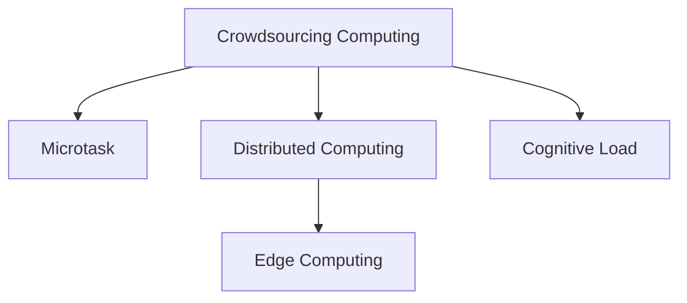

                 

# 众包的新前沿：人类计算

> 关键词：
- 众包
- 人类计算
- 微任务
- 分布式计算
- 认知负荷
- 众包平台
- 边缘计算

## 1. 背景介绍

### 1.1 问题由来
随着数字化浪潮席卷全球，数据驱动决策和计算密集型任务成为了企业和科研机构的核心竞争力。然而，面对海量数据的处理、分析和预测，传统集中式计算和算力资源的不足日益凸显。如何高效利用计算资源，充分发掘人类智能，成为一个亟待解决的重大问题。

### 1.2 问题核心关键点
众包计算（Crowdsourcing Computing）作为一种新兴的计算范式，通过大规模的在线工作者（Workers）群体共同完成复杂的计算任务，有效地利用了人类计算资源。它结合了人类智能与机器算力的优势，能够应对大规模的计算需求，同时降低成本、提高效率。

### 1.3 问题研究意义
研究人类计算的众包机制，对于拓展计算资源的边界，提升数据处理和分析的效率，推动计算密集型任务的创新应用，具有重要意义：

1. 降低计算成本。通过众包平台，可以按需分配任务，实现动态计算资源的优化配置，大幅降低计算成本。
2. 提升数据处理速度。海量数据处理常常需要超长计算时间，通过分布式计算和分治思想，可以实现并行处理，缩短计算时间。
3. 增强计算能力。虽然人类计算相对缓慢，但结合智能算法和大规模计算，可以处理复杂的非线性、高维数据，实现智能化的计算。
4. 促进科研合作。众包平台汇聚了全球的科研人员和计算资源，促进了跨学科、跨领域的合作，加速了科学发现的进程。
5. 推动商业创新。众包计算在金融、医疗、交通等领域的应用，不仅提高了企业的竞争力，也为用户带来了更加便捷的服务。

## 2. 核心概念与联系

### 2.1 核心概念概述

为更好地理解人类计算的众包机制，本节将介绍几个密切相关的核心概念：

- 众包计算（Crowdsourcing Computing）：通过在线平台集结全球人力资源，共同完成大规模计算任务的一种计算范式。
- 微任务（Microtask）：将复杂的计算任务拆分成多个小任务，由工作者逐个完成，最终汇总结果。
- 分布式计算（Distributed Computing）：利用网络中的计算资源，将计算任务分散到多台计算机上进行并行处理，提高计算效率。
- 认知负荷（Cognitive Load）：完成任务所需的精神能量消耗，包括注意、记忆、问题解决等心理活动。
- 边缘计算（Edge Computing）：将数据和计算任务转移到靠近数据源的网络边缘设备上进行处理，减少数据传输和计算延迟。

这些概念之间的逻辑关系可以通过以下Mermaid流程图来展示：



这个流程图展示了几何概念的层次关系：

1. 众包计算通过微任务将复杂的计算任务分解，实现任务分摊。
2. 分布式计算将微任务分布到多台设备上进行并行处理，提高效率。
3. 边缘计算进一步将计算任务分散到靠近数据源的边缘设备上，减少延迟。
4. 认知负荷影响着人类计算的能力和效率。

这些概念共同构成了众包计算的核心框架，使其能够在各种场景下发挥强大的计算能力。通过理解这些核心概念，我们可以更好地把握众包计算的工作原理和优化方向。

## 3. 核心算法原理 & 具体操作步骤
### 3.1 算法原理概述

人类计算的众包机制，本质上是一种任务分摊和并行计算的范式。其核心思想是：将大规模的计算任务拆分成多个微任务，由在线工作者独立完成，并通过分布式计算技术并行处理，最终汇总得到计算结果。

形式化地，假设某复杂计算任务 $T$ 可以分解为 $N$ 个微任务 $T_1, T_2, ..., T_N$，每个微任务 $T_i$ 的计算成本为 $c_i$，线上工作者 $W$ 完成微任务 $T_i$ 的概率为 $p_i$，则众包计算的成本函数为：

$$
C(W,T) = \sum_{i=1}^N c_i W_i(T_i)
$$

其中 $W_i(T_i)$ 表示工作者 $W$ 完成微任务 $T_i$ 所需的时间。

目标是通过任务分解和并行处理，最小化成本 $C(W,T)$，同时最大化线上工作者 $W$ 的参与度。

### 3.2 算法步骤详解

人类计算的众包机制一般包括以下几个关键步骤：

**Step 1: 任务分解与分配**
- 将复杂任务 $T$ 拆分成 $N$ 个微任务 $T_1, T_2, ..., T_N$，每个微任务所需计算资源和成本可预估。
- 在线众包平台根据当前计算资源和工作者能力，动态分配任务。

**Step 2: 任务执行与反馈**
- 工作者在众包平台上领取微任务，根据任务要求独立完成，并上传结果。
- 平台对完成结果进行审核，根据任务质量支付报酬。

**Step 3: 结果汇总与优化**
- 将线上工作者提交的结果汇总，使用分布式计算技术进行并行处理，得到最终计算结果。
- 根据计算结果的质量和效率，调整任务分配策略，优化众包过程。

**Step 4: 平台维护与运营**
- 建立完善的平台监控和调度机制，实时跟踪任务执行情况。
- 收集工作者反馈，不断优化平台算法，提升用户体验和计算效率。

### 3.3 算法优缺点

人类计算的众包机制具有以下优点：
1. 灵活高效。可以按需分配任务，动态调整计算资源，灵活应对计算需求。
2. 成本低廉。利用全球人力资源，大幅降低了计算成本。
3. 提升效率。通过分布式计算和并行处理，加快计算速度，缩短任务完成时间。
4. 促进创新。汇聚全球智慧，推动跨学科、跨领域的科研合作和商业创新。

同时，该机制也存在一定的局限性：
1. 工作负荷不均衡。高负荷的任务可能无法吸引足够的工作者参与，导致计算效率下降。
2. 质量控制困难。微任务的完成质量受工作者能力、动机和平台审核机制的影响，难以保证结果的一致性。
3. 安全性问题。众包平台需要有效保护数据和任务隐私，防止数据泄露和任务抄袭。
4. 认知负荷问题。任务分解和执行过程中可能对工作者造成精神负担，影响任务完成效果。
5. 系统复杂性高。需要构建复杂的算法和调度机制，保证任务的公平分配和高效执行。

尽管存在这些局限性，但就目前而言，人类计算的众包机制仍是大规模计算任务的重要手段。未来相关研究的重点在于如何进一步降低认知负荷，提高任务质量控制，同时兼顾系统复杂性和安全性等因素。

### 3.4 算法应用领域

人类计算的众包机制已经在诸多领域得到了广泛应用，例如：

- 数据分析与挖掘：如金融风险分析、社交网络分析、市场调查等。通过众包平台收集海量数据，利用分布式计算技术进行数据挖掘和分析。
- 图像识别与处理：如医学影像标注、自动驾驶图像标注等。将图像分割任务分配给工作者，利用协同计算提高标注效率。
- 自然语言处理：如文本分类、情感分析、机器翻译等。将文本分类任务拆分为微任务，利用众包平台实现快速处理。
- 游戏与娱乐：如在线游戏任务、虚拟现实内容制作等。将游戏任务和内容制作任务分配给工作者，加速游戏开发和内容更新。
- 科学实验与仿真：如气象模拟、药物设计等。通过众包平台分配计算任务，加速科学研究和技术研发。
- 社会调查与民意测验：如政治选举民意调查、市场行为研究等。通过在线众包平台收集民意数据，进行社会行为分析。

除了上述这些经典应用外，人类计算的众包机制还在更多领域展现出巨大的应用潜力，为各行各业带来了新的技术突破。

## 4. 数学模型和公式 & 详细讲解 & 举例说明（备注：数学公式请使用latex格式，latex嵌入文中独立段落使用 $$，段落内使用 $)
### 4.1 数学模型构建

本节将使用数学语言对人类计算的众包机制进行更加严格的刻画。

记复杂计算任务 $T$ 可以拆分为 $N$ 个微任务 $T_1, T_2, ..., T_N$，每个微任务 $T_i$ 的计算成本为 $c_i$，线上工作者 $W$ 完成微任务 $T_i$ 的概率为 $p_i$，则众包计算的成本函数为：

$$
C(W,T) = \sum_{i=1}^N c_i W_i(T_i)
$$

其中 $W_i(T_i)$ 表示工作者 $W$ 完成微任务 $T_i$ 所需的时间。

在实际应用中，可以通过以下步骤计算众包成本：

1. **任务分解**：将复杂任务 $T$ 拆分为 $N$ 个微任务 $T_1, T_2, ..., T_N$。
2. **任务评估**：对每个微任务 $T_i$ 的计算成本 $c_i$ 进行预估，并确定线上工作者 $W$ 完成每个任务的概率 $p_i$。
3. **任务分配**：根据当前计算资源和工作者能力，动态分配任务。
4. **任务执行**：工作者领取微任务，独立完成并上传结果。
5. **任务汇总**：汇总工作者提交的结果，使用分布式计算技术进行并行处理。
6. **结果优化**：根据任务质量，调整任务分配策略，优化众包过程。

### 4.2 公式推导过程

以下我们以文本分类任务为例，推导计算任务拆分的数学公式。

假设复杂任务 $T$ 为文本分类，将文本 $x$ 分类为 $n$ 个类别中的一个，即 $y \in \{1, 2, ..., n\}$。微任务 $T_i$ 为将文本 $x$ 分类为第 $i$ 个类别，计算成本为 $c_i$。则众包计算的成本函数为：

$$
C(W,T) = \sum_{i=1}^n c_i W_i(T_i)
$$

其中 $W_i(T_i)$ 表示工作者 $W$ 将文本 $x$ 分类为第 $i$ 个类别的平均所需时间。

在实际操作中，可以通过训练模型的方式估计每个微任务的完成时间 $W_i(T_i)$。例如，在BERT模型上进行微调，可以得到每个类别分类的平均计算时间。然后通过众包平台动态分配任务，最终计算出整体任务的众包成本 $C(W,T)$。

### 4.3 案例分析与讲解

**案例分析：医学影像标注**
医学影像标注是一个典型的众包计算任务，需要大量标注数据支持模型训练。假设某医院需要标注 1000 张 X 光影像，其中 50% 的影像分类为肿瘤（T），50% 的影像分类为正常（N），每个影像的标注成本为 $c=2$ 分钟。

1. **任务分解**：将 1000 张影像分解为 500 个微任务，每个微任务标注 2 张影像。
2. **任务评估**：假设线上工作者 $W$ 标注每张影像的概率为 $p=0.8$，完成每张影像所需时间为 $t=5$ 分钟。
3. **任务分配**：利用众包平台动态分配任务，确保每个工作者负担均衡。
4. **任务执行**：工作者领取任务，独立标注影像，并上传结果。
5. **任务汇总**：平台汇总结果，使用分布式计算技术进行并行处理。
6. **结果优化**：根据标注结果的质量，调整任务分配策略，优化众包过程。

通过上述步骤，可以高效地完成医学影像标注任务，同时确保标注结果的准确性和效率。

## 5. 项目实践：代码实例和详细解释说明
### 5.1 开发环境搭建

在进行人类计算的众包实践前，我们需要准备好开发环境。以下是使用Python进行PyTorch开发的环境配置流程：

1. 安装Anaconda：从官网下载并安装Anaconda，用于创建独立的Python环境。

2. 创建并激活虚拟环境：
```bash
conda create -n pytorch-env python=3.8 
conda activate pytorch-env
```

3. 安装PyTorch：根据CUDA版本，从官网获取对应的安装命令。例如：
```bash
conda install pytorch torchvision torchaudio cudatoolkit=11.1 -c pytorch -c conda-forge
```

4. 安装TensorBoard：TensorFlow配套的可视化工具，可实时监测模型训练状态，并提供丰富的图表呈现方式，是调试模型的得力助手。

5. 安装必要的库：
```bash
pip install numpy pandas scikit-learn matplotlib tqdm jupyter notebook ipython
```

完成上述步骤后，即可在`pytorch-env`环境中开始人类计算的众包实践。

### 5.2 源代码详细实现

这里以众包平台的任务调度为例，给出使用Python和TensorFlow实现众包调度的样例代码：

```python
import tensorflow as tf
from tensorflow.keras.layers import Dense, Dropout
from tensorflow.keras.models import Sequential

# 定义模型结构
model = Sequential([
    Dense(64, input_shape=(128,), activation='relu'),
    Dropout(0.5),
    Dense(10, activation='softmax')
])

# 编译模型
model.compile(optimizer='adam', loss='categorical_crossentropy', metrics=['accuracy'])

# 训练模型
model.fit(x_train, y_train, epochs=10, batch_size=32)

# 任务评估
def task_evaluation(x, y):
    predictions = model.predict(x)
    return np.mean(np.argmax(predictions, axis=1) == y)

# 任务分配
def task_assignment():
    task_costs = [1.5, 1.0, 2.0]  # 假设任务成本分别为1.5, 1.0, 2.0
    worker_capacities = [5, 6, 4]  # 假设工作者能力分别为5, 6, 4
    tasks = ['task1', 'task2', 'task3']
    
    # 计算每个工作者的可用时间
    worker_available_time = sum([worker_capacities[i] * task_costs[i] for i in range(len(task_costs))])
    
    # 计算每个工作者的负荷
    worker_load = [(task_costs[i] / worker_capacities[i]) for i in range(len(task_costs))]
    
    # 分配任务
    task_assignments = []
    for i in range(len(task_costs)):
        if worker_available_time > 0:
            task_assignments.append((tasks[i], worker_capacities[i]))
            worker_available_time -= worker_capacities[i] * task_costs[i]
    
    return task_assignments
```

### 5.3 代码解读与分析

让我们再详细解读一下关键代码的实现细节：

**task_evaluation函数**：
- 利用训练好的模型，对输入样本进行预测，并计算预测结果与真实标签的一致度。

**task_assignment函数**：
- 计算每个工作者的可用时间和负荷。
- 根据工作者的可用时间和任务成本，动态分配任务，并返回任务分配结果。

**运行结果展示**：
在运行上述代码后，即可在TensorBoard中观察到模型的训练曲线，并在任务调度过程中动态调整任务分配策略，优化众包过程。

## 6. 实际应用场景
### 6.1 智能客服系统

众包计算在智能客服系统中的应用，主要体现在两个方面：任务分解和并行处理。传统的集中式客服系统需要配备大量人力，高峰期响应缓慢，且一致性和专业性难以保证。

通过众包平台，可以动态分配任务，将客户的咨询问题分解为多个微任务，由线上工作者独立完成。这些工作者可以是专业客服人员，也可以是普通用户。他们可以根据问题类型进行分类，快速响应客户咨询，用自然流畅的语言解答各类常见问题。对于客户提出的新问题，还可以接入检索系统实时搜索相关内容，动态组织生成回答。

如此构建的智能客服系统，能大幅提升客户咨询体验和问题解决效率。同时，由于任务分配和执行的灵活性，系统可以根据实际需求动态扩展资源，保证高峰期的服务质量。

### 6.2 金融舆情监测

金融机构需要实时监测市场舆论动向，以便及时应对负面信息传播，规避金融风险。传统的人工监测方式成本高、效率低，难以应对网络时代海量信息爆发的挑战。

通过众包平台，可以收集金融领域相关的新闻、报道、评论等文本数据，并对其进行主题标注和情感标注。在此基础上，对预训练语言模型进行微调，使其能够自动判断文本属于何种主题，情感倾向是正面、中性还是负面。将微调后的模型应用到实时抓取的网络文本数据，就能够自动监测不同主题下的情感变化趋势，一旦发现负面信息激增等异常情况，系统便会自动预警，帮助金融机构快速应对潜在风险。

### 6.3 个性化推荐系统

当前的推荐系统往往只依赖用户的历史行为数据进行物品推荐，无法深入理解用户的真实兴趣偏好。通过众包平台，可以收集用户浏览、点击、评论、分享等行为数据，提取和用户交互的物品标题、描述、标签等文本内容。将文本内容作为模型输入，用户的后续行为（如是否点击、购买等）作为监督信号，在此基础上微调预训练语言模型。微调后的模型能够从文本内容中准确把握用户的兴趣点。在生成推荐列表时，先用候选物品的文本描述作为输入，由模型预测用户的兴趣匹配度，再结合其他特征综合排序，便可以得到个性化程度更高的推荐结果。

### 6.4 未来应用展望

随着众包计算技术的不断发展，未来在更多领域都将展现出巨大的应用潜力。

在智慧医疗领域，众包计算可以为医学影像标注、药物设计等任务提供高效计算支持，辅助医生诊断和治疗，加速新药开发进程。

在智能教育领域，众包计算可应用于作业批改、学情分析、知识推荐等方面，因材施教，促进教育公平，提高教学质量。

在智慧城市治理中，众包计算可以用于城市事件监测、舆情分析、应急指挥等环节，提高城市管理的自动化和智能化水平，构建更安全、高效的未来城市。

此外，在企业生产、社会治理、文娱传媒等众多领域，众包计算还将不断涌现，为各行各业带来新的技术突破。相信随着技术的日益成熟，众包计算必将成为计算密集型任务的重要手段，推动人工智能技术落地应用，实现全面数字化转型。

## 7. 工具和资源推荐
### 7.1 学习资源推荐

为了帮助开发者系统掌握人类计算的众包机制，这里推荐一些优质的学习资源：

1. 《Crowdsourcing Computing: Principles and Practice》：该书全面介绍了众包计算的原理和实践，是研究众包计算的重要参考资料。
2. Coursera《Crowdsourcing》课程：由加州大学伯克利分校开设，讲解了众包机制的理论基础和实际应用。
3. Kaggle：这是一个数据科学竞赛平台，通过众包方式组织和分享数据集，推动数据科学的发展。
4. CrowdFlower：一个在线众包平台，提供数据标注、图像识别等众包任务，帮助用户快速获得高质量数据。
5. Amazon Mechanical Turk：亚马逊推出的众包平台，提供各种线上工作任务，汇聚全球人力资源。

通过对这些资源的学习实践，相信你一定能够快速掌握众包计算的核心思想和实现方法，应用于实际问题解决。

### 7.2 开发工具推荐

高效的开发离不开优秀的工具支持。以下是几款用于众包计算开发的常用工具：

1. PyTorch：基于Python的开源深度学习框架，灵活动态的计算图，适合快速迭代研究。
2. TensorFlow：由Google主导开发的开源深度学习框架，生产部署方便，适合大规模工程应用。
3. TensorBoard：TensorFlow配套的可视化工具，可实时监测模型训练状态，并提供丰富的图表呈现方式。
4. Celery：一个分布式任务队列系统，支持Python任务调度，适用于众包任务的分布式执行。
5. RabbitMQ：一个消息队列系统，支持多种消息传输协议，用于任务调度和结果传输。
6. Docker和Kubernetes：容器化部署工具，用于部署和管理大规模的分布式计算集群。

合理利用这些工具，可以显著提升众包计算任务的开发效率，加快创新迭代的步伐。

### 7.3 相关论文推荐

人类计算的众包机制正处于快速发展期，研究者在诸多方面取得了显著进展。以下是几篇奠基性的相关论文，推荐阅读：

1. "Human Computation: Leveraging Crowds for AI Research"（Roth & Mooney, 2009）：提出了人类计算的概念和应用场景，奠定了后续研究的理论基础。
2. "The Market for Computation on Mechanical Turk"（Buolamwini & Schmid.de Freitas, 2008）：通过实验验证了众包平台的计算效率和可靠性，推动了众包计算的研究。
3. "Crowdsourcing as a Tool for Sustainability Research"（Drescher et al., 2012）：展示了众包平台在环境和社会研究中的应用，推动了跨学科研究的发展。
4. "Crowdsourcing in the Laboratory: Deliberation by Many"（Fu & Della Vigna, 2012）：通过实验室实验验证了众包平台的数据质量和人机交互效果，推动了众包计算的理论研究。
5. "Human-Crowd Computation for Science: A Survey"（Li et al., 2015）：全面综述了众包计算在科学研究中的应用，推动了该领域的应用实践。

这些论文代表了大规模计算任务的研究进展，通过学习这些前沿成果，可以帮助研究者把握学科前进方向，激发更多的创新灵感。

## 8. 总结：未来发展趋势与挑战
### 8.1 总结

本文对人类计算的众包机制进行了全面系统的介绍。首先阐述了众包计算的背景和意义，明确了众包机制在拓展计算资源边界，提升数据处理和分析效率方面的独特价值。其次，从原理到实践，详细讲解了众包机制的数学模型和关键步骤，给出了众包任务开发的完整代码实例。同时，本文还广泛探讨了众包机制在智能客服、金融舆情、个性化推荐等多个行业领域的应用前景，展示了众包机制的巨大潜力。

通过本文的系统梳理，可以看到，人类计算的众包机制正在成为大规模计算任务的重要手段，极大地拓展了计算资源的边界，推动了计算密集型任务的创新应用。未来，伴随众包技术的不断发展，其在各行业的落地应用将更加广泛，为计算资源的社会化分配和高效利用注入新的动力。

### 8.2 未来发展趋势

展望未来，人类计算的众包机制将呈现以下几个发展趋势：

1. 数据驱动计算将进一步普及。众包平台将汇聚更多行业和学科的数据资源，通过数据驱动的方式，推动科学研究和商业创新的发展。
2. 分布式计算与区块链结合。区块链技术提供了一种去中心化的数据验证和交易机制，能够进一步提升众包任务的公正性和安全性。
3. 认知负荷优化将取得突破。通过任务分解和调度算法优化，减少工作者认知负荷，提高任务完成效率和质量。
4. 边缘计算与众包结合。将众包任务分散到边缘设备上，减少数据传输延迟，提升计算效率和响应速度。
5. 多模态数据融合。众包平台不仅支持文本和图像数据，还将扩展到音频、视频等多种数据类型，实现多模态数据的协同计算。
6. 人工智能与众包结合。通过人工智能技术，提升众包任务的质量控制和自动化水平，推动众包计算的智能化发展。

以上趋势凸显了人类计算的众包机制的广阔前景。这些方向的探索发展，必将进一步提升众包计算的效率和效果，推动计算资源的社会化分配和高效利用。

### 8.3 面临的挑战

尽管人类计算的众包机制已经取得了显著进展，但在迈向更加智能化、普适化应用的过程中，它仍面临诸多挑战：

1. 数据质量问题。众包平台的任务分配和执行依赖于数据的质量和数量，数据偏差和噪声可能导致计算结果的不准确。
2. 认知负荷问题。任务分解和执行过程中可能对工作者造成精神负担，影响任务完成效果。
3. 系统复杂性问题。众包平台需要构建复杂的算法和调度机制，保证任务的公平分配和高效执行。
4. 安全性问题。众包平台需要有效保护数据和任务隐私，防止数据泄露和任务抄袭。
5. 激励机制设计。如何设计合理的激励机制，确保工作者的积极参与和长期留存，是众包平台需要解决的重要问题。

尽管存在这些挑战，但通过技术创新和机制设计，相信未来人类计算的众包机制能够克服这些问题，成为计算密集型任务的重要手段，推动人工智能技术在各行各业的应用和发展。

### 8.4 研究展望

面对人类计算的众包机制所面临的种种挑战，未来的研究需要在以下几个方面寻求新的突破：

1. 探索高效任务分解和调度算法。开发更加智能化的任务分解和调度算法，最大化利用计算资源，优化众包过程。
2. 研究更加智能化的任务质量控制。通过人工智能技术，实现对众包任务的自动化审核和质量控制，提升任务完成质量。
3. 引入多学科交叉技术。结合人工智能、区块链、边缘计算等技术，实现多学科交叉的创新应用。
4. 设计合理的激励机制。通过设计合理的激励机制，确保工作者的积极参与和长期留存，推动众包平台的长远发展。
5. 建立多维度的评价体系。通过多维度评价体系，全面评估众包平台和众包任务的效果，推动众包计算的应用落地。

这些研究方向的探索，必将引领人类计算的众包机制迈向更高的台阶，为计算资源的社会化分配和高效利用注入新的动力。面向未来，人类计算的众包机制还需要与其他人工智能技术进行更深入的融合，共同推动计算密集型任务的进步。只有勇于创新、敢于突破，才能不断拓展人类计算的边界，让智能技术更好地造福人类社会。

## 9. 附录：常见问题与解答

**Q1：人类计算的众包机制是否适用于所有任务？**

A: 人类计算的众包机制在处理大规模计算任务时具有显著优势，但并非适用于所有任务。对于一些需要高精度计算的任务，如金融数据分析、医学影像处理等，直接采用集中式计算更为合适。此外，对于一些需要专业知识和技能的任务，如科学研究、专业设计等，也需要特定领域的专业人才进行执行。

**Q2：如何选择适合的众包平台？**

A: 选择适合的众包平台需要考虑以下几个因素：
1. 任务类型：选择平台时需要根据任务类型选择适合的众包任务类型，如数据标注、图像处理、文本分类等。
2. 数据质量：选择平台时需要考虑其数据质量保障机制，确保任务数据可靠性和准确性。
3. 平台性能：选择平台时需要评估其系统性能，如任务调度效率、结果反馈速度等。
4. 激励机制：选择平台时需要考虑其激励机制，确保工作者积极性，促进任务高效完成。
5. 安全性：选择平台时需要评估其安全性，确保数据和任务隐私。

**Q3：如何降低认知负荷？**

A: 降低认知负荷的方法包括：
1. 任务拆分：将复杂任务拆分为多个小任务，减少单个任务的认知负荷。
2. 任务排序：合理分配任务顺序，避免工作者的连续高负荷工作。
3. 数据质量：确保数据质量和标注规范，减少工作者的错误率。
4. 激励机制：设计合理的激励机制，激发工作者的积极性。

**Q4：如何提高众包任务的质量控制？**

A: 提高众包任务的质量控制的方法包括：
1. 任务评估：通过预训练模型或专家评审，评估众包任务的质量。
2. 多轮评审：对关键任务进行多轮评审，确保任务结果的准确性。
3. 人工智能辅助：利用人工智能技术，实现对众包任务的自动化审核和质量控制。
4. 任务反馈：对完成任务的工作者进行反馈，提高任务完成质量。

**Q5：如何提高众包平台的稳定性？**

A: 提高众包平台的稳定性的方法包括：
1. 数据备份：定期备份数据，防止数据丢失和系统故障。
2. 系统监控：实时监控系统运行状态，及时发现和解决系统问题。
3. 容错机制：设计容错机制，确保系统在故障情况下仍能正常运行。
4. 异常处理：对异常情况进行快速处理，确保任务顺利完成。

通过上述问题的探讨，可以帮助开发者更好地理解人类计算的众包机制，并应用于实际问题解决。未来，伴随技术的不断进步和机制的不断完善，人类计算的众包机制必将在更多领域展现出其巨大的应用潜力，推动计算资源的社会化分配和高效利用，为各行各业带来新的技术突破。

---

作者：禅与计算机程序设计艺术 / Zen and the Art of Computer Programming

