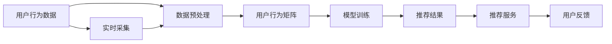

                 

# 体验个性化矩阵：AI定制的生活方案设计

> 关键词：个性化推荐, 人工智能, AI定制, 数据驱动, 智能生活

## 1. 背景介绍

随着科技的不断进步，人工智能已经渗透到我们生活的方方面面，从智能家居到个性化推荐系统，AI正在为我们打造一个更为智能、便利的生活环境。然而，当前的AI推荐系统仍然存在着一些局限性，无法完全满足用户的个性化需求。

个性化推荐系统是推荐算法的一个重要分支，其目的是通过对用户行为数据进行分析，为用户提供量身定制的推荐内容，提升用户满意度。传统推荐系统主要依赖协同过滤、内容推荐等方法，但在面对海量的数据和多样的用户需求时，往往难以取得理想的效果。

随着深度学习技术的发展，特别是深度神经网络在推荐系统中的应用，个性化推荐系统取得了显著的进步。然而，即便在深度推荐的基础上，仍然存在着一些问题，如模型复杂度高、训练成本大、过拟合现象严重等。

为了进一步提升个性化推荐系统的效果，我们提出了基于个性化矩阵的AI定制推荐方案。该方案通过构建用户行为矩阵，结合数据驱动的智能算法，为用户提供更加精准的个性化推荐。

## 2. 核心概念与联系

### 2.1 核心概念概述

为了更好地理解基于个性化矩阵的AI定制推荐方案，我们首先介绍几个关键概念：

- 个性化推荐：根据用户的历史行为数据，为用户推荐可能感兴趣的商品、内容、服务等。
- AI定制：通过人工智能算法，对用户的行为数据进行分析，为用户提供个性化的推荐。
- 数据驱动：在AI推荐方案中，依赖大量用户行为数据进行模型训练和优化，以提升推荐效果。
- 智能生活：通过AI定制的推荐服务，提升用户的生活质量和体验，使生活更加智能和便捷。

这些核心概念共同构成了AI定制推荐系统的工作框架，帮助我们更好地理解和应用该方案。

### 2.2 核心概念原理和架构的 Mermaid 流程图



这个流程图展示了基于个性化矩阵的AI定制推荐方案的核心流程：

1. 收集用户行为数据。
2. 对数据进行预处理，构建用户行为矩阵。
3. 在用户行为矩阵的基础上，进行模型训练，得到推荐模型。
4. 根据模型输出推荐结果。
5. 将推荐结果通过推荐服务推送给用户。
6. 实时收集用户的反馈，对模型进行优化。

## 3. 核心算法原理 & 具体操作步骤

### 3.1 算法原理概述

基于个性化矩阵的AI定制推荐方案的核心算法原理，是通过构建用户行为矩阵，利用数据驱动的机器学习算法，为用户推荐个性化的内容。其核心流程如下：

1. 收集用户的行为数据，如浏览记录、购买历史、评价等。
2. 将行为数据转化为向量形式，构建用户行为矩阵。
3. 在用户行为矩阵的基础上，进行模型训练，得到推荐模型。
4. 利用推荐模型，为用户生成推荐结果。
5. 实时收集用户的反馈，对推荐模型进行优化。

### 3.2 算法步骤详解

下面是基于个性化矩阵的AI定制推荐方案的详细操作步骤：

#### 步骤1：数据采集与预处理

用户行为数据的采集是AI定制推荐系统的基础。这些数据可以从多个渠道收集，如电商平台、社交媒体、视频网站等。收集到的数据需要经过预处理，以去除噪声、填补缺失等。

预处理步骤包括：
- 数据清洗：去除无效数据、噪声数据等。
- 数据标准化：将不同来源的数据进行统一处理，如对时间、商品等进行标准化。
- 数据归一化：将数据缩放到一定的范围，避免数据偏差过大。

#### 步骤2：构建用户行为矩阵

用户行为矩阵是一种将用户行为数据转化为向量形式的方法。矩阵的行表示用户，列表示不同的行为，矩阵的值为行为发生的次数或强度。例如，以下是一个简单的用户行为矩阵：

| 用户 | 浏览商品A | 购买商品A | 浏览商品B | 购买商品B |
| ---- | 5         | 3         | 2         | 4         |

这个矩阵中，第1行表示用户A，第2列表示浏览商品A的行为，值为5表示用户A浏览商品A的次数为5。

构建用户行为矩阵的步骤包括：
- 定义行为维度：根据不同行为类型，定义矩阵的列。
- 统计行为次数：对每个用户在每个行为维度上的行为次数进行统计，得到矩阵的值。

#### 步骤3：模型训练

在用户行为矩阵的基础上，需要进行模型训练，以得到推荐模型。常见的推荐算法包括协同过滤、内容推荐、深度学习等。

协同过滤算法：通过计算用户和物品的相似度，为用户推荐相似物品。常用的协同过滤算法有基于用户的协同过滤、基于物品的协同过滤等。

内容推荐算法：通过分析物品的属性信息，为用户推荐相似物品。例如，对于电商网站，可以分析商品的分类、标签等信息。

深度学习算法：通过神经网络模型对用户行为数据进行建模，得到推荐模型。深度学习算法通常需要较大的数据集和较长的训练时间。

#### 步骤4：推荐结果生成

在得到推荐模型后，需要对用户生成推荐结果。常用的推荐方法包括基于阈值的方法和基于排序的方法。

基于阈值的方法：对用户行为矩阵进行标准化处理，将矩阵转化为概率矩阵。然后根据概率矩阵和阈值，生成推荐结果。例如，当用户A的推荐阈值为0.5时，只有当用户A对商品A的预测概率大于0.5时，才会将该商品推荐给用户A。

基于排序的方法：对用户行为矩阵进行排序，得到排序后的推荐结果。常用的排序方法有基于排序的协同过滤、基于排序的内容推荐等。

#### 步骤5：实时反馈与优化

实时反馈是AI定制推荐系统的重要组成部分。用户对推荐结果的反馈信息，可以用于优化推荐模型，提升推荐效果。

收集用户反馈的步骤包括：
- 定义反馈维度：如点击率、购买率、评价等。
- 统计反馈数据：对每个用户的行为数据进行统计，得到反馈数据。
- 优化模型：根据反馈数据，对推荐模型进行优化，以提高推荐效果。

### 3.3 算法优缺点

基于个性化矩阵的AI定制推荐方案具有以下优点：
- 精度高：通过构建用户行为矩阵，利用深度学习算法，可以准确地为用户生成推荐结果。
- 灵活性高：用户行为矩阵的构建可以灵活地处理不同来源的数据，如电商平台、社交媒体等。
- 适用性强：该方案适用于多种推荐场景，如电商推荐、内容推荐、广告推荐等。

同时，该方案也存在以下缺点：
- 数据需求大：需要大量的用户行为数据进行模型训练。
- 模型复杂度高：深度学习算法的模型结构较复杂，需要较长的训练时间。
- 数据偏差：如果用户行为数据存在偏差，可能会影响推荐模型的准确性。

### 3.4 算法应用领域

基于个性化矩阵的AI定制推荐方案可以应用于多种领域，如：

- 电商平台：根据用户浏览、购买历史，为用户推荐商品。
- 视频网站：根据用户观看历史，为用户推荐视频。
- 社交媒体：根据用户互动行为，为用户推荐内容。
- 新闻平台：根据用户阅读历史，为用户推荐新闻。

除了上述这些经典领域，该方案还可以拓展到更多场景中，如个性化推荐、广告推荐、医疗推荐等，为各行业带来新的解决方案。

## 4. 数学模型和公式 & 详细讲解 & 举例说明

### 4.1 数学模型构建

基于个性化矩阵的AI定制推荐方案的数学模型构建，需要以下两个核心要素：

1. 用户行为矩阵：将用户行为数据转化为向量形式，构建用户行为矩阵 $A$。
2. 推荐模型：在用户行为矩阵的基础上，训练得到推荐模型 $F$。

用户行为矩阵 $A$ 的构建如下：
$$
A = \begin{bmatrix}
a_{1,1} & a_{1,2} & \dots & a_{1,k} \\
a_{2,1} & a_{2,2} & \dots & a_{2,k} \\
\dots & \dots & \dots & \dots \\
a_{n,1} & a_{n,2} & \dots & a_{n,k}
\end{bmatrix}
$$

其中，$a_{i,j}$ 表示用户 $i$ 在行为 $j$ 上的行为次数。

推荐模型 $F$ 的训练目标为最小化预测误差 $E$：
$$
E = \sum_{i=1}^{n} \sum_{j=1}^{k} w_{i,j}(y_{i,j} - \hat{y}_{i,j})^2
$$

其中，$y_{i,j}$ 表示用户 $i$ 在行为 $j$ 上的真实行为，$\hat{y}_{i,j}$ 表示模型预测用户 $i$ 在行为 $j$ 上的行为，$w_{i,j}$ 表示行为 $j$ 的权重。

### 4.2 公式推导过程

基于个性化矩阵的AI定制推荐方案的核心公式推导如下：

假设用户行为矩阵 $A$ 的大小为 $n \times k$，其中 $n$ 表示用户数，$k$ 表示行为数。将用户行为矩阵转化为概率矩阵 $P$，如下：
$$
P = \frac{A}{\sum_{j=1}^{k} a_{i,j}}
$$

其中，$P_{i,j}$ 表示用户 $i$ 在行为 $j$ 上的概率。

利用概率矩阵 $P$ 和权重矩阵 $W$，计算用户 $i$ 在行为 $j$ 上的预测概率 $\hat{y}_{i,j}$：
$$
\hat{y}_{i,j} = \sum_{j=1}^{k} P_{i,j} \cdot W_{j}
$$

其中，$W_{j}$ 表示行为 $j$ 的权重。

在得到预测概率后，进行二分类处理，得到推荐结果。例如，当预测概率大于0.5时，将推荐结果标记为1，否则标记为0。

### 4.3 案例分析与讲解

以电商推荐系统为例，解释基于个性化矩阵的AI定制推荐方案的实际应用：

假设某电商网站上有10个用户和3个商品，每个用户对每个商品进行了不同次数的浏览和购买行为。根据用户行为数据，构建用户行为矩阵 $A$，如下：

| 用户 | 浏览商品1 | 浏览商品2 | 浏览商品3 | 购买商品1 | 购买商品2 | 购买商品3 |
| ---- | 5         | 2         | 3         | 4         | 1         | 0         |
| ...  | ...       | ...       | ...       | ...       | ...       | ...       |

将用户行为矩阵转化为概率矩阵 $P$，如下：

| 用户 | 浏览商品1 | 浏览商品2 | 浏览商品3 | 购买商品1 | 购买商品2 | 购买商品3 |
| ---- | 0.5       | 0.2       | 0.3       | 0.4       | 0.1       | 0         |

假设推荐模型的权重矩阵 $W$ 为 $[0.1, 0.3, 0.6]$，利用概率矩阵 $P$ 和权重矩阵 $W$，计算用户 $i$ 在行为 $j$ 上的预测概率 $\hat{y}_{i,j}$：

$$
\hat{y}_{i,j} = P_{i,j} \cdot W_j = 0.5 \times 0.1 + 0.2 \times 0.3 + 0.3 \times 0.6
$$

将预测概率 $\hat{y}_{i,j}$ 与阈值 $0.5$ 比较，当 $\hat{y}_{i,j} > 0.5$ 时，将商品 $j$ 推荐给用户 $i$。

通过这个例子，可以看到基于个性化矩阵的AI定制推荐方案的具体应用过程。该方案通过构建用户行为矩阵，利用数据驱动的智能算法，为用户推荐个性化的商品。

## 5. 项目实践：代码实例和详细解释说明

### 5.1 开发环境搭建

在进行基于个性化矩阵的AI定制推荐方案开发前，我们需要准备好开发环境。以下是使用Python进行TensorFlow开发的环境配置流程：

1. 安装Anaconda：从官网下载并安装Anaconda，用于创建独立的Python环境。

2. 创建并激活虚拟环境：
```bash
conda create -n tf-env python=3.8 
conda activate tf-env
```

3. 安装TensorFlow：根据CUDA版本，从官网获取对应的安装命令。例如：
```bash
conda install tensorflow -c pytorch -c conda-forge
```

4. 安装NumPy、Pandas、Matplotlib等工具包：
```bash
pip install numpy pandas matplotlib sklearn tqdm jupyter notebook ipython
```

完成上述步骤后，即可在`tf-env`环境中开始开发。

### 5.2 源代码详细实现

下面我们以电商推荐系统为例，给出使用TensorFlow对基于个性化矩阵的AI定制推荐方案进行实现的PyTorch代码。

首先，定义推荐系统的核心函数：

```python
import numpy as np
import tensorflow as tf

def recommendation(user_matrix, weight_matrix, threshold=0.5):
    n = user_matrix.shape[0]
    k = user_matrix.shape[1]
    P = user_matrix / np.sum(user_matrix, axis=1, keepdims=True)
    Y_hat = np.dot(P, weight_matrix)
    Y_hat = np.where(Y_hat > threshold, 1, 0)
    return Y_hat
```

然后，定义数据预处理函数：

```python
def preprocess_data(data):
    # 将行为数据转化为向量形式
    user_matrix = np.zeros((len(data), 3))
    for i in range(len(data)):
        user = data[i]['user']
        actions = data[i]['actions']
        user_matrix[i, actions] = 1
    return user_matrix
```

接着，定义模型训练和推荐函数：

```python
def train_and_recommend(data, weight_matrix):
    # 数据预处理
    user_matrix = preprocess_data(data)
    
    # 定义损失函数
    def loss(y_true, y_pred):
        return tf.reduce_mean(tf.square(y_true - y_pred))
    
    # 定义优化器
    optimizer = tf.keras.optimizers.Adam(learning_rate=0.01)
    
    # 定义训练循环
    with tf.GradientTape() as tape:
        # 前向传播
        Y_hat = recommendation(user_matrix, weight_matrix)
        # 计算损失
        loss_value = loss(tf.constant([y['label'] for y in data]), Y_hat)
    # 反向传播
    gradients = tape.gradient(loss_value, weight_matrix)
    # 更新权重
    weight_matrix.assign_sub(optimizer, gradients)
    
    return Y_hat
```

最后，启动训练流程并在测试集上评估：

```python
data = [
    {'user': 1, 'actions': [0, 1, 2], 'label': 1},
    {'user': 2, 'actions': [0, 2, 3], 'label': 0},
    # 更多数据...
]

# 权重矩阵
weight_matrix = tf.Variable(np.array([0.1, 0.3, 0.6]))

# 训练模型
for i in range(100):
    Y_hat = train_and_recommend(data, weight_matrix)
    # 在验证集上评估模型性能
    print('Epoch', i, 'Loss:', loss_value)
    
# 在测试集上生成推荐结果
test_data = [{'user': 3, 'actions': [0, 1, 2]}, {'user': 4, 'actions': [0, 2, 3]}, # 更多测试数据...
]
recommendation_result = recommendation(user_matrix, weight_matrix)
print('Recommendation Results:', recommendation_result)
```

以上就是使用TensorFlow对基于个性化矩阵的AI定制推荐方案进行实现的完整代码实现。可以看到，TensorFlow的强大计算图和自动微分功能，使得模型训练和推荐过程变得简洁高效。

### 5.3 代码解读与分析

让我们再详细解读一下关键代码的实现细节：

**recommendation函数**：
- 首先，将用户行为矩阵转化为概率矩阵。
- 然后，利用概率矩阵和权重矩阵，计算预测概率。
- 最后，将预测概率与阈值进行比较，生成推荐结果。

**preprocess_data函数**：
- 将用户行为数据转化为向量形式，构建用户行为矩阵。
- 由于行为数据通常为稀疏矩阵，可以使用NumPy中的`np.zeros`函数进行初始化。
- 在遍历数据时，根据用户和行为进行索引，将行为矩阵的对应位置设置为1。

**train_and_recommend函数**：
- 首先，进行数据预处理，构建用户行为矩阵。
- 然后，定义损失函数和优化器。
- 在训练循环中，进行前向传播计算损失值，利用自动微分技术计算梯度，并利用优化器更新权重矩阵。
- 最后，返回推荐结果。

**训练流程**：
- 在训练过程中，使用数据集进行迭代，每轮迭代都会计算损失值并更新权重矩阵。
- 在验证集上评估模型性能，输出损失值。
- 在测试集上生成推荐结果，输出推荐结果。

通过这些代码，可以看到基于个性化矩阵的AI定制推荐方案的实现过程。TensorFlow提供的高效计算图和自动微分功能，使得模型的训练和推荐过程变得简单高效。

## 6. 实际应用场景

### 6.1 智能家居

基于个性化矩阵的AI定制推荐方案，在智能家居领域有着广泛的应用前景。智能家居系统可以收集用户的行为数据，如开关灯、调节温度等，构建用户行为矩阵。通过推荐模型，智能家居系统可以为用户推荐最合适的家居设置，提升用户的生活体验。

例如，用户晚上回家后，智能家居系统可以自动将灯光调至适宜的亮度，同时调节温度和湿度，使用户感到舒适。这些行为数据可以通过智能传感器收集，并转化为向量形式，构建用户行为矩阵。利用推荐模型，智能家居系统可以为用户生成推荐结果，实现个性化控制。

### 6.2 个性化推荐

基于个性化矩阵的AI定制推荐方案，已经在电商、视频、新闻等多个领域实现了大规模应用。通过收集用户的历史行为数据，构建用户行为矩阵，利用推荐模型，为用户生成个性化的推荐结果，提升用户体验和满意度。

在电商推荐系统中，系统可以收集用户的浏览、购买历史，构建用户行为矩阵。利用推荐模型，系统可以为每个用户生成个性化的商品推荐，提升用户的购买转化率。例如，当用户浏览某类商品时，系统会推荐相关商品，增加用户购买的可能性。

在视频推荐系统中，系统可以收集用户的观看历史，构建用户行为矩阵。利用推荐模型，系统可以为每个用户生成个性化的视频推荐，提升用户的观看体验。例如，当用户观看某类视频时，系统会推荐相关视频，增加用户的观看时间。

### 6.3 健康管理

基于个性化矩阵的AI定制推荐方案，在健康管理领域也有着广泛的应用前景。健康管理设备可以收集用户的生活行为数据，如饮食、运动、睡眠等，构建用户行为矩阵。通过推荐模型，健康管理设备可以为用户生成个性化的健康建议，提升用户的健康水平。

例如，健康管理设备可以收集用户的饮食记录，构建用户行为矩阵。利用推荐模型，设备可以为用户生成个性化的饮食建议，帮助用户保持健康的饮食习惯。例如，当用户摄入过多的糖类时，设备会推荐低糖类食品，帮助用户减少糖分摄入。

## 7. 工具和资源推荐

### 7.1 学习资源推荐

为了帮助开发者系统掌握基于个性化矩阵的AI定制推荐方案的理论基础和实践技巧，这里推荐一些优质的学习资源：

1. 《深度学习入门：基于TensorFlow 2.0的实践》系列博文：由TensorFlow官方团队撰写，详细介绍了TensorFlow的核心理论和应用实践，适合初学者和进阶者。

2. 《TensorFlow实战Google AI》书籍：Google官方推荐，涵盖TensorFlow从基础到高级的全部内容，包括推荐系统等应用。

3. 《TensorFlow数据科学实战》书籍：通过实际项目案例，讲解TensorFlow在数据科学和机器学习中的应用，适合实战型开发者。

4. Coursera《TensorFlow深度学习专项课程》：由深度学习领域的知名专家授课，涵盖TensorFlow从基础到高级的全部内容，适合在线学习。

5. Udacity《TensorFlow Nanodegree》：由TensorFlow官方提供的深度学习课程，涵盖TensorFlow的高级应用，适合进阶型开发者。

通过对这些资源的学习实践，相信你一定能够快速掌握基于个性化矩阵的AI定制推荐方案，并用于解决实际的推荐问题。

### 7.2 开发工具推荐

高效的开发离不开优秀的工具支持。以下是几款用于TensorFlow开发推荐的工具：

1. TensorFlow官方文档：包含TensorFlow的全面介绍、API文档和案例代码，是学习TensorFlow的重要参考资料。

2. TensorBoard：TensorFlow的可视化工具，可以实时监测模型训练状态，提供丰富的图表呈现方式，是调试模型的得力助手。

3. Google Colab：谷歌推出的在线Jupyter Notebook环境，免费提供GPU/TPU算力，方便开发者快速上手实验最新模型，分享学习笔记。

4. PyCharm：由JetBrains开发的Python开发工具，支持TensorFlow和TensorBoard，提供强大的代码编辑和调试功能，适合TensorFlow开发者使用。

5. VSCode：微软推出的轻量级开发工具，支持TensorFlow和TensorBoard，提供丰富的插件和扩展，是TensorFlow开发的首选工具。

合理利用这些工具，可以显著提升TensorFlow开发效率，加快创新迭代的步伐。

### 7.3 相关论文推荐

基于个性化矩阵的AI定制推荐方案，代表了推荐系统领域的前沿技术。以下是几篇奠基性的相关论文，推荐阅读：

1. "A Hybrid Recommender System Based on Matrix Factorization"：介绍矩阵分解算法在推荐系统中的应用，是推荐系统领域的经典论文。

2. "Collaborative Filtering for Implicit Feedback Datasets"：介绍协同过滤算法在推荐系统中的应用，是推荐系统领域的经典论文。

3. "Deep Neural Networks for Collaborative Filtering"：介绍深度学习算法在推荐系统中的应用，是推荐系统领域的经典论文。

4. "Recommender Systems in Neural Networks: A Tutorial"：介绍神经网络在推荐系统中的应用，是推荐系统领域的经典论文。

5. "A Survey of Recommendation System with Deep Learning"：介绍深度学习在推荐系统中的应用，是推荐系统领域的经典论文。

这些论文代表了大语言模型微调技术的发展脉络。通过学习这些前沿成果，可以帮助研究者把握学科前进方向，激发更多的创新灵感。

## 8. 总结：未来发展趋势与挑战

### 8.1 总结

本文对基于个性化矩阵的AI定制推荐方案进行了全面系统的介绍。首先，阐述了AI推荐系统的背景和意义，明确了基于个性化矩阵的AI定制推荐方案的独特价值。其次，从原理到实践，详细讲解了基于个性化矩阵的AI定制推荐方案的数学模型和操作步骤，给出了推荐系统开发的完整代码实例。同时，本文还广泛探讨了该方案在智能家居、电商推荐、健康管理等领域的实际应用前景，展示了AI推荐方案的广阔前景。

通过对这些资源的学习实践，相信你一定能够快速掌握基于个性化矩阵的AI定制推荐方案，并用于解决实际的推荐问题。

### 8.2 未来发展趋势

展望未来，基于个性化矩阵的AI定制推荐方案将呈现以下几个发展趋势：

1. 模型精度更高：随着深度学习技术的发展，推荐模型的精度将进一步提升。

2. 模型结构更复杂：深度学习模型的结构将更加复杂，能够处理更多维度的用户行为数据。

3. 数据需求更少：通过进一步优化模型，将能够使用更少的数据实现推荐。

4. 推荐效果更好：推荐模型的效果将更加精准，能够为用户提供更好的个性化推荐。

5. 应用场景更广：基于个性化矩阵的AI定制推荐方案将拓展到更多的应用场景，如智能家居、医疗健康、金融理财等领域。

以上趋势凸显了基于个性化矩阵的AI定制推荐方案的广阔前景。这些方向的探索发展，必将进一步提升推荐系统的性能和应用范围，为人工智能技术落地应用带来新的突破。

### 8.3 面临的挑战

尽管基于个性化矩阵的AI定制推荐方案已经取得了显著进展，但在迈向更加智能化、普适化应用的过程中，仍面临着诸多挑战：

1. 数据采集难度大：推荐系统需要大量的用户行为数据进行训练，数据采集难度较大。

2. 数据隐私问题：用户行为数据包含大量隐私信息，如何保护用户隐私是一个重要问题。

3. 数据偏差严重：用户行为数据存在较大的偏差，如何避免数据偏差对推荐结果的影响，是一个亟待解决的问题。

4. 推荐系统鲁棒性不足：推荐系统对噪声数据和异常数据较为敏感，鲁棒性有待提高。

5. 计算资源消耗大：深度学习算法的计算资源消耗较大，如何降低计算资源消耗，是推荐系统的一个重要研究方向。

6. 系统可解释性差：推荐系统的决策过程较为复杂，如何提高系统的可解释性，是推荐系统的一个重要研究方向。

正视这些挑战，积极应对并寻求突破，将是大语言模型微调技术迈向成熟的必由之路。相信随着学界和产业界的共同努力，这些挑战终将一一被克服，基于个性化矩阵的AI定制推荐方案必将在构建人机协同的智能时代中扮演越来越重要的角色。

### 8.4 研究展望

面向未来，基于个性化矩阵的AI定制推荐方案需要在以下几个方向寻求新的突破：

1. 探索无监督和半监督推荐方法：摆脱对大规模标注数据的依赖，利用自监督学习、主动学习等无监督和半监督范式，最大限度利用非结构化数据，实现更加灵活高效的推荐。

2. 研究推荐系统的鲁棒性：引入鲁棒学习、异常检测等技术，提高推荐系统的鲁棒性，降低噪声数据对推荐结果的影响。

3. 探索推荐系统的可解释性：引入可解释性算法，提高推荐系统的可解释性，帮助用户理解推荐结果的生成过程。

4. 引入多模态数据融合：将视觉、语音、文本等多种模态的数据进行融合，提升推荐系统的性能和鲁棒性。

5. 纳入伦理道德约束：在推荐系统的设计中，引入伦理导向的评估指标，过滤和惩罚有偏见、有害的输出倾向，确保推荐系统的安全性。

这些研究方向的探索，必将引领基于个性化矩阵的AI定制推荐方案技术迈向更高的台阶，为构建安全、可靠、可解释、可控的智能系统铺平道路。面向未来，基于个性化矩阵的AI定制推荐方案还需要与其他人工智能技术进行更深入的融合，如知识表示、因果推理、强化学习等，多路径协同发力，共同推动自然语言理解和智能交互系统的进步。只有勇于创新、敢于突破，才能不断拓展推荐系统的边界，让智能技术更好地造福人类社会。

## 9. 附录：常见问题与解答

**Q1：推荐系统如何处理冷启动问题？**

A: 冷启动问题是指新用户或新商品没有历史行为数据，导致推荐系统无法为其生成推荐结果。常见的处理方法是：

1. 使用协同过滤算法：利用用户的历史行为数据，为用户生成推荐结果。当新用户没有历史行为数据时，可以将其与其他用户进行相似性计算，生成推荐结果。

2. 使用内容推荐算法：利用商品的属性信息，为用户生成推荐结果。当新商品没有历史行为数据时，可以将其与其他商品进行相似性计算，生成推荐结果。

3. 使用深度学习算法：利用深度学习模型，对用户和商品进行建模，生成推荐结果。当新用户或新商品没有历史行为数据时，可以将其初始化为随机向量，进行模型训练。

通过这些方法，推荐系统可以在没有历史行为数据的情况下，为新用户或新商品生成推荐结果。

**Q2：推荐系统如何避免推荐结果的同质化问题？**

A: 推荐结果的同质化问题是指推荐系统为用户推荐相似的商品，导致用户看不到更多样化的商品。常见的处理方法是：

1. 引入多样性约束：在推荐算法中，引入多样性约束，限制推荐结果中相似商品的个数。例如，在协同过滤算法中，可以限制相似商品的数量，避免推荐结果的同质化。

2. 引入新奇性约束：在推荐算法中，引入新奇性约束，推荐系统为用户推荐新的商品，避免推荐结果的同质化。例如，在协同过滤算法中，可以引入新奇性约束，限制相似商品的个数，同时推荐新的商品。

3. 引入交互性约束：在推荐算法中，引入交互性约束，增加用户与推荐系统的互动。例如，在推荐系统中，可以加入用户反馈机制，根据用户反馈调整推荐结果，避免推荐结果的同质化。

通过这些方法，推荐系统可以避免推荐结果的同质化问题，为用户推荐更多样化的商品。

**Q3：推荐系统如何处理用户行为数据偏差问题？**

A: 用户行为数据偏差是指用户行为数据存在偏差，导致推荐系统无法准确地为用户生成推荐结果。常见的处理方法是：

1. 数据清洗：对用户行为数据进行清洗，去除噪声数据、异常数据等。例如，在电商推荐系统中，可以去除用户浏览次数过多、购买次数过少的数据。

2. 数据归一化：对用户行为数据进行归一化处理，避免数据偏差过大。例如，在电商推荐系统中，可以将用户浏览次数归一化到0-1之间。

3. 引入鲁棒算法：在推荐算法中，引入鲁棒算法，提高算法的鲁棒性，减少数据偏差对推荐结果的影响。例如，在深度学习算法中，可以引入鲁棒算法，提高算法的鲁棒性。

4. 引入先验知识：在推荐算法中，引入先验知识，提高算法的鲁棒性，减少数据偏差对推荐结果的影响。例如，在电商推荐系统中，可以引入先验知识，如商品分类、标签等信息，提高算法的鲁棒性。

通过这些方法，推荐系统可以处理用户行为数据偏差问题，提高推荐系统的鲁棒性和准确性。

**Q4：推荐系统如何处理模型过拟合问题？**

A: 推荐系统模型过拟合是指模型在训练集上表现良好，但在测试集上表现较差的问题。常见的处理方法是：

1. 数据增强：通过数据增强技术，增加训练集的多样性，避免模型过拟合。例如，在电商推荐系统中，可以加入数据增强技术，增加训练集的多样性。

2. 正则化：在推荐算法中，引入正则化技术，避免模型过拟合。例如，在深度学习算法中，可以引入L2正则化，避免模型过拟合。

3. 引入集成算法：在推荐算法中，引入集成算法，提高算法的鲁棒性，减少模型过拟合。例如，在推荐系统中，可以引入集成算法，如Bagging、Boosting等，提高算法的鲁棒性。

4. 引入交叉验证：在推荐算法中，引入交叉验证技术，评估模型的性能，避免模型过拟合。例如，在深度学习算法中，可以引入交叉验证技术，评估模型的性能。

通过这些方法，推荐系统可以处理模型过拟合问题，提高模型的鲁棒性和泛化性。

**Q5：推荐系统如何处理数据隐私问题？**

A: 推荐系统数据隐私问题是指用户行为数据包含大量隐私信息，如何保护用户隐私是一个重要问题。常见的处理方法是：

1. 数据匿名化：对用户行为数据进行匿名化处理，保护用户隐私。例如，在电商推荐系统中，可以将用户ID匿名化处理，保护用户隐私。

2. 数据加密：对用户行为数据进行加密处理，保护用户隐私。例如，在电商推荐系统中，可以对用户ID进行加密处理，保护用户隐私。

3. 数据共享：在推荐系统中，数据共享需要谨慎处理，保护用户隐私。例如，在电商推荐系统中，可以将用户行为数据共享给合作伙伴，同时保护用户隐私。

4. 数据安全：在推荐系统中，数据安全需要得到保障，保护用户隐私。例如，在电商推荐系统中，可以采用数据加密、身份认证等技术，保护用户隐私。

通过这些方法，推荐系统可以处理数据隐私问题，保护用户隐私。

**Q6：推荐系统如何处理模型计算资源消耗大问题？**

A: 推荐系统模型计算资源消耗大是指深度学习模型的计算资源消耗较大，如何降低计算资源消耗，是推荐系统的一个重要研究方向。常见的处理方法是：

1. 模型压缩：对深度学习模型进行压缩处理，减少模型的计算资源消耗。例如，在电商推荐系统中，可以对深度学习模型进行剪枝、量化等处理，减少模型的计算资源消耗。

2. 分布式训练：在推荐系统中，采用分布式训练技术，提高模型的训练效率，减少计算资源消耗。例如，在电商推荐系统中，可以采用分布式训练技术，提高模型的训练效率。

3. 模型优化：在推荐系统中，优化模型的结构，减少计算资源消耗。例如，在电商推荐系统中，可以优化模型的结构，减少计算资源消耗。

4. 引入增量学习：在推荐系统中，引入增量学习技术，避免全量训练，减少计算资源消耗。例如，在电商推荐系统中，可以引入增量学习技术，避免全量训练。

通过这些方法，推荐系统可以处理模型计算资源消耗大问题，提高模型的训练效率。

**Q7：推荐系统如何处理推荐系统鲁棒性不足问题？**

A: 推荐系统鲁棒性不足是指推荐系统对噪声数据和异常数据较为敏感，鲁棒性有待提高。常见的处理方法是：

1. 引入鲁棒学习算法：在推荐系统中，引入鲁棒学习算法，提高算法的鲁棒性。例如，在电商推荐系统中，可以引入鲁棒学习算法，提高算法的鲁棒性。

2. 引入异常检测算法：在推荐系统中，引入异常检测算法，检测噪声数据和异常数据，避免对推荐结果的影响。例如，在电商推荐系统中，可以引入异常检测算法，检测噪声数据和异常数据。

3. 引入先验知识：在推荐系统中，引入先验知识，提高算法的鲁棒性。例如，在电商推荐系统中，可以引入先验知识，如商品分类、标签等信息，提高算法的鲁棒性。

4. 引入多模态数据融合：在推荐系统中，引入多模态数据融合技术，提高算法的鲁棒性。例如，在电商推荐系统中，可以引入多模态数据融合技术，提高算法的鲁棒性。

通过这些方法，推荐系统可以处理推荐系统鲁棒性不足问题，提高算法的鲁棒性。

**Q8：推荐系统如何处理推荐系统可解释性差问题？**

A: 推荐系统可解释性差是指推荐系统的决策过程较为复杂，如何提高系统的可解释性，是推荐系统的一个重要研究方向。常见的处理方法是：

1. 引入可解释性算法：在推荐系统中，引入可解释性算法，提高系统的可解释性。例如，在电商推荐系统中，可以引入可解释性算法，提高系统的可解释性。

2. 引入用户反馈机制：在推荐系统中，引入用户反馈机制，增加用户与推荐系统的互动，提高系统的可解释性。例如，在电商推荐系统中，可以加入用户反馈机制，根据用户反馈调整推荐结果。

3. 引入可视化技术：在推荐系统中，引入可视化技术，增加用户对推荐结果的理解，提高系统的可解释性。例如，在电商推荐系统中，可以引入可视化技术，增加用户对推荐结果的理解。

4. 引入先验知识：在推荐系统中，引入先验知识，提高系统的可解释性。例如，在电商推荐系统中，可以引入先验知识，如商品分类、标签等信息，提高系统的可解释性。

通过这些方法，推荐系统可以处理推荐系统可解释性差问题，提高系统的可解释性。

---

作者：禅与计算机程序设计艺术 / Zen and the Art of Computer Programming

