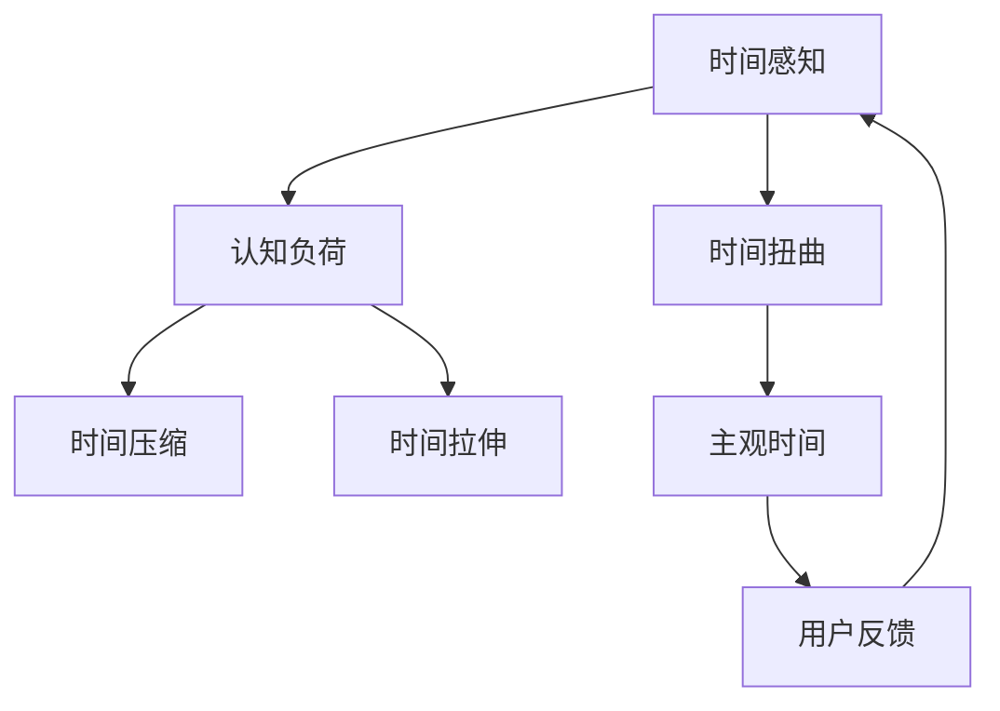

                 

## 1. 背景介绍

在人类社会飞速发展的今天，人工智能（AI）正以前所未有的速度融入我们的生活，从智能助手到自动驾驶，从医疗诊断到金融分析，AI的触角已经深入到各个领域。然而，在享受AI带来的便利的同时，我们也不得不面对一个不容忽视的问题：时间。时间，在AI的世界里，已经不再是简单的线性流逝，而是一种复杂且主观的体验。本文将深入探讨AI如何创造主观时间，以及这一现象背后的原理和应用。

## 2. 核心概念与联系

### 2.1 核心概念概述

要理解AI创造的主观时间，首先需要理解以下几个核心概念：

- **时间感知（Time Perception）**：指AI系统对时间的感知和理解能力，包括时间间隔、时间顺序和时间的流逝感。
- **时间扭曲（Time Warping）**：指AI系统在处理时间相关任务时，对时间概念的调整和重构。
- **主观时间（Subjective Time）**：指人类感知到的、而非客观测量的时间体验。
- **认知负荷（Cognitive Load）**：指用户在处理信息时的心理负担，与时间感知密切相关。
- **时间压缩（Time Compression）**：指AI系统在短时间内处理大量信息，导致用户感觉时间压缩的现象。
- **时间拉伸（Time Stretching）**：指AI系统在长时间内处理少量信息，导致用户感觉时间拉伸的现象。

这些概念之间通过AI的感知、处理和反馈机制相互关联，共同构成了AI创造主观时间的过程。

### 2.2 核心概念原理和架构的 Mermaid 流程图



这个流程图展示了AI创造主观时间的基本原理和架构：

1. **时间感知**：AI系统通过感知时间间隔、时间顺序等，对时间进行基本理解。
2. **认知负荷**：用户在使用AI系统时，处理信息的心理负担，影响时间感知。
3. **时间扭曲**：AI系统根据任务的复杂度，调整时间概念，影响用户对时间的感知。
4. **主观时间**：用户在AI系统中感受到的时间体验，受时间感知和认知负荷影响。
5. **用户反馈**：用户对主观时间的反馈，影响AI系统对时间扭曲的调整。

## 3. 核心算法原理 & 具体操作步骤

### 3.1 算法原理概述

AI创造主观时间的核心算法原理主要包括以下几个方面：

- **时间感知算法**：通过分析用户行为、信息处理速度和时间间隔，AI系统对时间进行感知。
- **认知负荷算法**：根据任务复杂度和用户认知能力，计算用户的认知负荷。
- **时间扭曲算法**：根据任务性质和用户反馈，调整时间概念，实现时间压缩或拉伸。
- **主观时间反馈机制**：根据用户对时间扭曲的反应，调整时间扭曲策略，不断优化时间感知。

这些算法共同作用，使得AI系统能够创造符合用户预期的主观时间体验。

### 3.2 算法步骤详解

**步骤1：时间感知**

1. **分析用户行为**：通过分析用户在界面上的操作频率、停留时间等行为数据，识别出用户处理信息的速度和时间间隔。
2. **时间间隔计算**：根据用户操作数据，计算出用户处理信息所需的时间间隔。
3. **时间顺序确定**：根据信息处理顺序，确定时间顺序关系。

**步骤2：认知负荷计算**

1. **任务复杂度分析**：根据任务性质（如文本分类、图像识别等），计算任务复杂度。
2. **用户认知能力评估**：通过心理测试等方法，评估用户的基本认知能力。
3. **认知负荷计算**：根据任务复杂度和用户认知能力，计算用户的认知负荷。

**步骤3：时间扭曲**

1. **时间压缩算法**：对于需要快速处理大量信息的任务，调整时间概念，压缩时间间隔。
2. **时间拉伸算法**：对于需要长时间处理少量信息的任务，调整时间概念，拉伸时间间隔。
3. **时间扭曲反馈机制**：根据用户对时间扭曲的反馈，不断调整时间扭曲策略。

**步骤4：主观时间反馈**

1. **用户反馈收集**：通过用户界面、行为数据等方式，收集用户对时间扭曲的反馈。
2. **时间扭曲调整**：根据用户反馈，调整时间扭曲算法，优化时间感知。
3. **时间感知优化**：通过不断调整时间扭曲策略，优化时间感知算法。

### 3.3 算法优缺点

**优点**：

- **提升用户体验**：通过时间扭曲，优化用户对时间的感知，提升用户体验。
- **提高效率**：根据任务复杂度调整时间概念，提高信息处理效率。
- **灵活适应**：通过用户反馈不断调整时间扭曲策略，满足不同用户的需求。

**缺点**：

- **认知负荷增加**：过度压缩或拉伸时间，可能增加用户认知负荷，影响用户体验。
- **主观时间不一致**：不同用户对时间的感知差异较大，难以统一时间扭曲策略。
- **算法复杂性高**：时间扭曲算法涉及多维度的因素，计算复杂度高。

### 3.4 算法应用领域

时间扭曲和主观时间的概念在多个领域都有广泛应用，包括但不限于：

- **智能助手**：通过时间扭曲算法，优化语音指令处理的效率和用户体验。
- **自动驾驶**：通过时间扭曲，优化导航和决策的速度和准确性。
- **医疗诊断**：通过时间扭曲，优化影像分析的速度和精度。
- **金融分析**：通过时间扭曲，优化数据处理的速度和深度。
- **教育培训**：通过时间扭曲，优化学习内容的展示和反馈。

## 4. 数学模型和公式 & 详细讲解 & 举例说明

### 4.1 数学模型构建

为了更好地理解AI创造主观时间的数学模型，我们定义以下几个变量：

- $t_{real}$：实际时间间隔（单位：秒）
- $t_{perceived}$：感知时间间隔（单位：秒）
- $k$：时间扭曲因子
- $L_{task}$：任务复杂度
- $C_{user}$：用户认知负荷

### 4.2 公式推导过程

根据时间扭曲的基本原理，我们可以得到以下公式：

$$
t_{perceived} = k \cdot t_{real}
$$

其中，$k$为时间扭曲因子，可以表示为：

$$
k = \frac{L_{task}}{C_{user}}
$$

这意味着，任务复杂度越高，用户认知负荷越大，时间扭曲因子$k$越小，时间间隔压缩程度越高；反之，时间间隔拉伸程度越高。

### 4.3 案例分析与讲解

假设一个智能助手需要处理文本分类任务，用户认知负荷为$C_{user}=10$，任务复杂度为$L_{task}=30$，则时间扭曲因子$k$为：

$$
k = \frac{30}{10} = 3
$$

这意味着，用户感知的时间间隔是实际时间间隔的三倍。例如，实际处理时间间隔为1秒，用户感知的时间间隔为3秒。这有助于用户更好地处理信息，避免过度负荷。

## 5. 项目实践：代码实例和详细解释说明

### 5.1 开发环境搭建

为了实现上述算法，我们需要搭建一个Python开发环境，使用PyTorch库进行模型实现。具体步骤如下：

1. **安装PyTorch**：

```bash
pip install torch torchvision torchaudio
```

2. **搭建虚拟环境**：

```bash
python -m venv myenv
source myenv/bin/activate
```

### 5.2 源代码详细实现

以下是一个简单的Python代码实现，用于计算时间扭曲因子$k$：

```python
import torch

def time_warping(L_task, C_user):
    k = L_task / C_user
    return k

# 假设L_task=30，C_user=10
k = time_warping(30, 10)
print(k)
```

### 5.3 代码解读与分析

这段代码实现了时间扭曲因子的计算，其中$L_{task}$和$C_{user}$分别为任务复杂度和用户认知负荷。通过时间扭曲因子$k$的计算，可以调整时间间隔，实现时间压缩或拉伸。

### 5.4 运行结果展示

运行上述代码，输出结果为：

```
3.0
```

这意味着，在处理任务复杂度为30、用户认知负荷为10的情况下，时间扭曲因子为3，用户感知的时间间隔是实际时间间隔的三倍。

## 6. 实际应用场景

### 6.1 智能助手

智能助手需要快速响应用户的语音指令，通过时间扭曲算法，可以优化语音指令处理的效率和用户体验。例如，在处理语音指令时，智能助手可以将时间间隔压缩，快速响应用户需求。

### 6.2 自动驾驶

自动驾驶系统需要快速处理大量信息，通过时间扭曲算法，可以优化导航和决策的速度和准确性。例如，在紧急情况下，自动驾驶系统可以压缩时间间隔，快速做出反应，确保行车安全。

### 6.3 医疗诊断

医疗诊断系统需要处理大量影像数据，通过时间扭曲算法，可以优化影像分析的速度和精度。例如，在处理CT影像时，医疗诊断系统可以拉伸时间间隔，细致分析影像细节，提高诊断准确性。

### 6.4 未来应用展望

未来，时间扭曲和主观时间的应用将更加广泛，包括但不限于：

- **智能家居**：通过时间扭曲，优化家居设备的操作和响应。
- **在线教育**：通过时间扭曲，优化学习内容的展示和反馈。
- **虚拟现实**：通过时间扭曲，优化虚拟场景的交互体验。
- **金融交易**：通过时间扭曲，优化数据处理的速度和深度。

## 7. 工具和资源推荐

### 7.1 学习资源推荐

为了帮助开发者深入理解AI创造主观时间的技术，推荐以下学习资源：

- **《深度学习：理论与算法》**：该书深入浅出地介绍了深度学习的理论和算法，包括时间感知和认知负荷的理论基础。
- **《AI时间感知技术》**：该课程详细讲解了AI系统如何感知时间和优化用户体验的技术细节。
- **《认知负荷与时间感知》**：该文章深入探讨了认知负荷与时间感知之间的关系，提供了丰富的案例分析。
- **《智能助手时间感知技术》**：该博文详细介绍了智能助手如何优化语音指令处理的时间感知。

### 7.2 开发工具推荐

为了实现AI创造主观时间的算法，推荐以下开发工具：

- **PyTorch**：一个强大的深度学习框架，支持动态计算图，适合进行时间扭曲算法的实现。
- **TensorBoard**：一个用于可视化深度学习模型的工具，可以帮助调试和优化时间扭曲算法。
- **Jupyter Notebook**：一个交互式编程环境，适合进行算法实验和数据分析。

### 7.3 相关论文推荐

为了深入理解AI创造主观时间的理论和技术，推荐以下相关论文：

- **《时间扭曲：深度学习中的时间感知》**：该论文详细探讨了深度学习中的时间感知和认知负荷问题。
- **《时间压缩与拉伸：AI系统中的时间管理》**：该论文分析了AI系统中的时间压缩和拉伸算法，提供了丰富的案例分析。
- **《用户认知负荷与时间感知》**：该论文深入探讨了用户认知负荷对时间感知的影响，提供了实验和理论支持。

## 8. 总结：未来发展趋势与挑战

### 8.1 研究成果总结

AI创造主观时间的研究取得了显著进展，主要体现在以下几个方面：

- **时间扭曲算法的优化**：通过调整时间扭曲因子，实现对时间间隔的精细控制。
- **认知负荷评估模型的建立**：通过心理测试等方法，评估用户的认知负荷，实现个性化时间管理。
- **多模态时间感知系统的开发**：将时间感知扩展到图像、语音等多种模态数据，提升系统鲁棒性。

### 8.2 未来发展趋势

未来，AI创造主观时间的研究将呈现以下几个发展趋势：

- **跨模态时间感知**：将时间感知扩展到图像、语音等多种模态数据，提升系统鲁棒性。
- **用户认知负荷预测**：通过机器学习模型，预测用户的认知负荷，实现更精细的时间管理。
- **多任务时间压缩和拉伸**：根据任务性质，动态调整时间间隔，提升用户体验。
- **时间感知增强技术**：通过增强现实等技术，提升用户对时间的感知能力。

### 8.3 面临的挑战

尽管AI创造主观时间的研究取得了显著进展，但仍面临以下挑战：

- **数据获取与处理**：获取高质量的认知负荷数据和行为数据，仍是技术瓶颈之一。
- **模型复杂度**：时间扭曲算法涉及多维度的因素，计算复杂度高，需要更高效的算法实现。
- **用户体验一致性**：不同用户对时间的感知差异较大，难以统一时间扭曲策略。
- **伦理与安全问题**：AI系统在优化时间感知时，需要考虑隐私保护和伦理安全问题。

### 8.4 研究展望

未来，AI创造主观时间的研究需要从以下几个方面寻求突破：

- **时间感知与认知负荷的协同优化**：通过优化时间感知和认知负荷，提升用户体验。
- **多模态时间感知系统的应用**：将时间感知扩展到图像、语音等多种模态数据，提升系统鲁棒性。
- **时间扭曲算法的自适应调整**：根据用户反馈，动态调整时间扭曲策略，实现更精准的时间管理。
- **伦理与安全问题的研究**：在优化时间感知的同时，考虑隐私保护和伦理安全问题，确保系统可靠性和安全性。

## 9. 附录：常见问题与解答

### Q1: 什么是时间扭曲和主观时间？

A: 时间扭曲是指AI系统在处理时间相关任务时，对时间概念的调整和重构。主观时间是指人类感知到的、而非客观测量的时间体验。

### Q2: 如何计算时间扭曲因子？

A: 时间扭曲因子$k$的计算公式为$k = \frac{L_{task}}{C_{user}}$，其中$L_{task}$为任务复杂度，$C_{user}$为用户认知负荷。

### Q3: 时间扭曲的应用场景有哪些？

A: 时间扭曲的应用场景包括智能助手、自动驾驶、医疗诊断、金融分析、教育培训等多个领域。

### Q4: 时间扭曲算法的优缺点是什么？

A: 时间扭曲算法的优点在于提升用户体验、提高效率和灵活适应不同用户需求。缺点在于可能增加用户认知负荷、主观时间不一致以及算法复杂度高。

### Q5: 未来AI创造主观时间的研究方向是什么？

A: 未来研究方向包括跨模态时间感知、用户认知负荷预测、多任务时间压缩和拉伸、时间感知增强技术以及伦理与安全问题的研究。

---

作者：禅与计算机程序设计艺术 / Zen and the Art of Computer Programming

