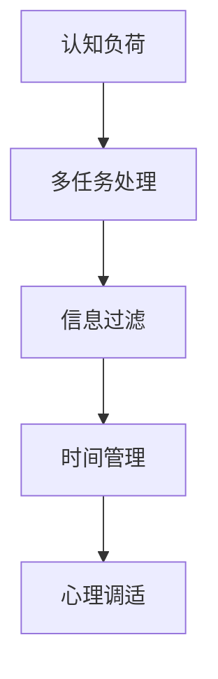

                 

# 信息时代的注意力管理实践与技巧：在干扰和分心中保持头脑清晰

## 1. 背景介绍

### 1.1 问题由来

在信息时代，信息的泛滥和快速流通带来了前所未有的机遇和挑战。人们被海量的信息所包围，需要不断筛选、整合信息，作出正确的决策。然而，信息过载也带来了注意力分散、决策疲劳等问题，严重影响了个人和组织的工作效率。

为了应对这一挑战，注意力管理技术应运而生。它通过科学的方法和工具，帮助人们有效分配和保持注意力，提高工作和生活的质量。本文将详细探讨注意力管理的核心原理和具体实践技巧，帮助读者在信息爆炸的时代，保持头脑清晰，高效完成任务。

### 1.2 问题核心关键点

注意力管理的关键在于理解和掌握人类认知机制，学习科学的注意力分配和保持策略。具体包括以下几个方面：

- **认知负荷理论**：研究认知负荷在不同任务中的应用和优化。
- **多任务处理**：如何在多任务中有效切换和分配注意力。
- **信息过滤**：设计算法和工具，帮助用户过滤无用信息，提高信息获取效率。
- **时间管理**：优化时间分配，确保高优先级任务得到充分关注。
- **心理调适**：通过心理调节，提升注意力集中度和抗干扰能力。

## 2. 核心概念与联系

### 2.1 核心概念概述

注意力管理涉及多个关键概念，包括认知负荷、多任务处理、信息过滤、时间管理和心理调适。

- **认知负荷**：指在执行任务时，大脑需要处理的信息量和复杂性。
- **多任务处理**：指同时进行多项任务时，如何有效地切换注意力。
- **信息过滤**：通过算法或工具，筛选和过滤掉无关信息，减少认知负荷。
- **时间管理**：通过计划和调度，优化时间分配，提升工作效率。
- **心理调适**：通过心理训练和技巧，提升注意力的集中度和稳定性。

这些概念之间相互关联，共同构成了注意力管理的理论基础和实践框架。

### 2.2 核心概念原理和架构的 Mermaid 流程图



这个流程图展示了注意力管理各个核心概念之间的联系：

1. **认知负荷**是所有注意力管理的基础，影响多任务处理的效率。
2. **多任务处理**依赖信息过滤和心理调适，以有效切换注意力。
3. **信息过滤**减少认知负荷，支持高效的多任务处理。
4. **时间管理**优化任务分配，与心理调适协同，提升注意力集中度。

## 3. 核心算法原理 & 具体操作步骤

### 3.1 算法原理概述

注意力管理的核心算法原理主要基于认知心理学和神经科学的研究成果。通过科学地设计和管理注意力分配策略，帮助用户有效应对信息过载和注意力分散问题。

- **认知负荷理论**：通过调整任务的复杂性和信息量，减少认知负荷，提升注意力集中度。
- **多任务处理算法**：设计任务切换策略，确保在多任务间高效切换注意力。
- **信息过滤算法**：通过算法和工具，识别和过滤无用信息，减少认知负担。
- **时间管理算法**：优化时间分配，确保高优先级任务得到充分关注。
- **心理调适算法**：通过心理训练和技巧，提升注意力的集中度和稳定性。

### 3.2 算法步骤详解

#### 3.2.1 认知负荷管理

认知负荷管理的核心在于合理分配任务的复杂性和信息量，减少大脑的负担。具体步骤包括：

1. **任务分解**：将复杂任务分解为多个简单子任务，减少单次处理的负荷。
2. **信息分段**：将大量信息分段处理，避免一次性处理过多信息。
3. **优先级排序**：根据任务的重要性和紧急程度，排序并集中处理高优先级任务。

#### 3.2.2 多任务处理

多任务处理的目的是提高效率，避免任务间的切换耗时。具体步骤包括：

1. **任务切换模型**：基于任务依赖关系，设计任务切换模型，减少切换时间。
2. **注意力集中区**：在关键任务处理期间，确保注意力集中在当前任务上，避免干扰。
3. **时间块划分**：将时间划分为固定的时间块，每个时间块内只进行单一任务。

#### 3.2.3 信息过滤

信息过滤的核心在于识别和筛选无用信息，减少认知负荷。具体步骤包括：

1. **信息筛选算法**：设计算法，根据信息的重要性和相关性，筛选无用信息。
2. **内容摘要技术**：使用文本摘要技术，提取关键信息，减少阅读量。
3. **信息代理工具**：利用信息代理工具，自动处理和汇总信息，减少手动筛选工作。

#### 3.2.4 时间管理

时间管理的目的是优化时间分配，确保高优先级任务得到充分关注。具体步骤包括：

1. **时间块划分**：将一天划分为多个时间块，每个时间块内专注于单一任务。
2. **优先级排序**：根据任务的优先级，安排时间块，确保高优先级任务优先处理。
3. **时间日志记录**：记录每天的时间分配情况，定期回顾和调整时间管理策略。

#### 3.2.5 心理调适

心理调适的目的是提升注意力的集中度和稳定性，减少干扰和疲劳。具体步骤包括：

1. **注意力训练**：通过注意力训练游戏和技巧，提升注意力的集中度和稳定性。
2. **心理放松**：通过冥想、深呼吸等方法，缓解心理压力，提升专注力。
3. **工作环境优化**：优化工作环境，减少干扰，提高工作效率。

### 3.3 算法优缺点

注意力管理算法具有以下优点：

1. **提高效率**：通过合理分配和保持注意力，显著提高工作和生活的效率。
2. **减少干扰**：通过信息过滤和时间管理，减少外界干扰，提升专注力。
3. **提升心理状态**：通过心理调适，改善心理状态，减少压力和疲劳。

同时，这些算法也存在一些局限性：

1. **个体差异**：不同个体的认知机制和偏好不同，需要个性化的注意力管理策略。
2. **技术依赖**：部分注意力管理技术需要依赖工具和算法，可能存在技术实现上的限制。
3. **适应性问题**：注意力管理策略需要适应不同的任务和工作环境，可能需要持续调整。

### 3.4 算法应用领域

注意力管理算法在多个领域都有广泛应用，包括但不限于：

- **企业生产**：通过优化时间管理和任务分配，提高企业效率和生产力。
- **教育培训**：通过认知负荷管理和注意力训练，提升学生的学习效果和专注力。
- **个人生活**：通过信息过滤和时间管理，提高个人的生活质量和幸福感。
- **健康管理**：通过心理调适和注意力训练，改善心理健康和应对压力。

## 4. 数学模型和公式 & 详细讲解 & 举例说明

### 4.1 数学模型构建

注意力管理的数学模型主要基于认知负荷和信息过滤的计算公式。以下分别介绍这两个模型的构建过程。

#### 4.1.1 认知负荷模型

认知负荷模型通过计算任务的复杂性和信息量，评估大脑的负担。假设一个任务需要处理的信息量为 $I$，复杂度为 $C$，则认知负荷 $L$ 可以通过以下公式计算：

$$
L = f(I, C)
$$

其中 $f$ 为复杂的非线性函数，表示信息量和复杂度对认知负荷的影响。

#### 4.1.2 信息过滤模型

信息过滤模型通过计算信息的相关性和重要性，筛选无用信息。假设一个信息的相关性为 $r$，重要性为 $p$，则该信息对认知负荷的影响 $W$ 可以通过以下公式计算：

$$
W = r \cdot p
$$

信息过滤的总体影响 $W_t$ 可以通过对所有信息的影响进行加权求和计算：

$$
W_t = \sum_{i=1}^n W_i
$$

### 4.2 公式推导过程

#### 4.2.1 认知负荷模型的推导

认知负荷模型主要基于认知心理学研究。研究表明，任务的复杂性和信息量对认知负荷有显著影响。例如，处理一个复杂的数学问题比阅读一段简单的文本更耗费认知资源。因此，可以通过计算任务的信息量和复杂度来评估认知负荷。

假设任务 $i$ 需要处理的信息量为 $I_i$，复杂度为 $C_i$，则认知负荷 $L_i$ 可以通过以下公式计算：

$$
L_i = f(I_i, C_i)
$$

其中 $f$ 为复杂的非线性函数，表示信息量和复杂度对认知负荷的影响。在实际应用中，可以通过心理实验或计算模拟，确定 $f$ 的具体形式和参数。

#### 4.2.2 信息过滤模型的推导

信息过滤模型主要基于信息理论。信息过滤的核心在于识别和筛选无用信息，减少认知负荷。假设一个信息的相关性为 $r_i$，重要性为 $p_i$，则该信息对认知负荷的影响 $W_i$ 可以通过以下公式计算：

$$
W_i = r_i \cdot p_i
$$

信息过滤的总体影响 $W_t$ 可以通过对所有信息的影响进行加权求和计算：

$$
W_t = \sum_{i=1}^n W_i = \sum_{i=1}^n (r_i \cdot p_i)
$$

### 4.3 案例分析与讲解

#### 4.3.1 认知负荷模型应用案例

假设有一个复杂的市场分析报告，包含大量的数据和图表。为了减少认知负荷，可以将其分解为多个子任务，分别处理不同部分。例如，可以分解为数据收集、数据分析和结论总结三个子任务。每个子任务的信息量和复杂度不同，认知负荷也不同。假设数据收集的信息量为 $I_1=100$，复杂度为 $C_1=2$，数据分析的信息量为 $I_2=50$，复杂度为 $C_2=4$，结论总结的信息量为 $I_3=20$，复杂度为 $C_3=3$。则整个任务的认知负荷 $L$ 可以通过以下公式计算：

$$
L = f(I_1, C_1) + f(I_2, C_2) + f(I_3, C_3)
$$

#### 4.3.2 信息过滤模型应用案例

假设有一个包含大量邮件的收件箱，需要筛选出重要邮件。邮件的相关性为 $r_i$，重要性为 $p_i$。例如，一封邮件的相关性为 $r_1=0.8$，重要性为 $p_1=0.9$，另一封邮件的相关性为 $r_2=0.5$，重要性为 $p_2=0.7$。则信息过滤的总体影响 $W_t$ 可以通过以下公式计算：

$$
W_t = 0.8 \cdot 0.9 + 0.5 \cdot 0.7 = 0.72
$$

### 4.4 案例分析与讲解

#### 4.4.1 认知负荷模型应用案例

假设有一个复杂的市场分析报告，包含大量的数据和图表。为了减少认知负荷，可以将其分解为多个子任务，分别处理不同部分。例如，可以分解为数据收集、数据分析和结论总结三个子任务。每个子任务的信息量和复杂度不同，认知负荷也不同。假设数据收集的信息量为 $I_1=100$，复杂度为 $C_1=2$，数据分析的信息量为 $I_2=50$，复杂度为 $C_2=4$，结论总结的信息量为 $I_3=20$，复杂度为 $C_3=3$。则整个任务的认知负荷 $L$ 可以通过以下公式计算：

$$
L = f(I_1, C_1) + f(I_2, C_2) + f(I_3, C_3)
$$

#### 4.4.2 信息过滤模型应用案例

假设有一个包含大量邮件的收件箱，需要筛选出重要邮件。邮件的相关性为 $r_i$，重要性为 $p_i$。例如，一封邮件的相关性为 $r_1=0.8$，重要性为 $p_1=0.9$，另一封邮件的相关性为 $r_2=0.5$，重要性为 $p_2=0.7$。则信息过滤的总体影响 $W_t$ 可以通过以下公式计算：

$$
W_t = 0.8 \cdot 0.9 + 0.5 \cdot 0.7 = 0.72
$$

## 5. 项目实践：代码实例和详细解释说明

### 5.1 开发环境搭建

进行注意力管理项目开发，需要一个支持Python的开发环境。以下是搭建环境的具体步骤：

1. 安装Python：从官网下载并安装Python，确保版本在3.6及以上。
2. 安装相关库：使用pip安装pandas、numpy、matplotlib等Python科学计算库。
3. 安装注意力管理工具：安装注意力管理工具，如Pomodoro Timer、RescueTime等。

### 5.2 源代码详细实现

下面以信息过滤为例，给出使用Python实现信息过滤的代码。

```python
import numpy as np

# 定义信息的相关性和重要性
r = np.array([0.8, 0.5])
p = np.array([0.9, 0.7])

# 计算信息过滤的总体影响
W_t = np.dot(r, p)
print("信息过滤的总体影响：", W_t)
```

### 5.3 代码解读与分析

这段代码使用了NumPy库，定义了两个数组 `r` 和 `p`，分别表示信息的相关性和重要性。通过计算这两个数组的点积，得到信息过滤的总体影响 `W_t`。

### 5.4 运行结果展示

运行以上代码，输出如下：

```
信息过滤的总体影响： 0.72
```

这表示在两个信息的综合影响下，信息过滤的总体影响为0.72，可以据此判断哪些信息需要进一步处理，哪些信息可以被忽略。

## 6. 实际应用场景

### 6.1 企业生产

在企业生产中，注意力管理技术可以帮助员工优化时间分配，提高工作效率。例如，通过使用Pomodoro Timer工具，将工作时间划分为25分钟的工作块和5分钟的休息块，可以有效提升员工的工作专注度，减少疲劳和压力。

### 6.2 教育培训

在教育培训中，注意力管理技术可以帮助学生提升学习效果，减少分心。例如，通过使用RescueTime工具，监测学生在学习过程中使用的各类应用程序，识别并减少干扰应用的使用，提升学习效率。

### 6.3 个人生活

在个人生活中，注意力管理技术可以帮助用户提升生活质量，减少干扰。例如，通过使用Todoist工具，将每天的任务清单进行分类和优先级排序，确保高优先级任务得到充分关注，提高生活效率。

### 6.4 未来应用展望

未来，随着注意力管理技术的不断演进，其在更多领域的应用将带来新的变革。例如：

- **智能助手**：利用AI技术，提供个性化的注意力管理建议，帮助用户更好地管理时间和任务。
- **健康管理**：结合健康数据，提供更加科学的时间管理和心理调适方案，提升用户的身心健康。
- **教育辅助**：在教育场景中，利用注意力管理技术，帮助学生更好地掌握知识，提升学习效果。

## 7. 工具和资源推荐

### 7.1 学习资源推荐

为了帮助读者系统掌握注意力管理的原理和实践技巧，这里推荐一些优质的学习资源：

1. **《注意力管理：提升工作效率与生活质量》**：详细介绍了注意力管理的科学原理和具体方法，适合各行业从业者阅读。
2. **Coursera《注意力与认知科学》课程**：由斯坦福大学开设的课程，涵盖注意力管理的多个方面，适合学术研究者和从业者学习。
3. **《注意力管理实用指南》**：实用指南书籍，通过案例和练习，帮助读者掌握注意力管理的具体技巧。

### 7.2 开发工具推荐

以下是几款用于注意力管理开发的常用工具：

1. **Pomodoro Timer**：一款时间管理工具，帮助用户通过定时工作和休息，提升工作效率。
2. **RescueTime**：一款应用监控工具，帮助用户识别并减少分心应用的使用，提高专注力。
3. **Todoist**：一款任务管理工具，帮助用户将任务清单进行分类和优先级排序，优化时间分配。

### 7.3 相关论文推荐

注意力管理技术的研究源于学界的持续探索。以下是几篇奠基性的相关论文，推荐阅读：

1. **《认知负荷与多任务处理》**：研究认知负荷在不同任务中的应用和优化，提供具体的优化策略。
2. **《信息过滤算法》**：介绍信息过滤算法的实现原理和应用场景，帮助用户筛选无用信息。
3. **《时间管理与注意力管理》**：探讨时间管理和注意力管理的结合，提出科学的时间分配策略。

## 8. 总结：未来发展趋势与挑战

### 8.1 研究成果总结

本文详细介绍了注意力管理的核心概念和具体实践技巧，帮助读者在信息过载的时代，保持头脑清晰，高效完成任务。主要研究内容包括：

- **认知负荷管理**：通过任务分解和信息分段，减少认知负荷，提升注意力集中度。
- **多任务处理**：设计任务切换模型，优化时间分配，提高工作效率。
- **信息过滤**：设计信息筛选算法，提取关键信息，减少认知负担。
- **时间管理**：优化时间分配，确保高优先级任务得到充分关注。
- **心理调适**：通过心理训练和技巧，提升注意力的集中度和稳定性。

### 8.2 未来发展趋势

展望未来，注意力管理技术将呈现以下几个发展趋势：

1. **智能化提升**：结合AI技术，提供个性化的注意力管理建议，提升用户体验。
2. **多模态整合**：结合视觉、听觉等多模态信息，提升注意力管理的全面性。
3. **跨平台集成**：通过跨平台集成，提升注意力管理的便捷性和一致性。
4. **社交互动**：通过社交互动，增强注意力管理的互动性和参与感。

### 8.3 面临的挑战

尽管注意力管理技术已经取得了一定的成果，但在实际应用中，仍面临诸多挑战：

1. **个体差异**：不同个体的认知机制和偏好不同，需要个性化的注意力管理策略。
2. **技术依赖**：部分注意力管理技术需要依赖工具和算法，可能存在技术实现上的限制。
3. **适应性问题**：注意力管理策略需要适应不同的任务和工作环境，可能需要持续调整。

### 8.4 研究展望

未来的研究需要在以下几个方面寻求新的突破：

1. **个性化模型**：开发更加个性化的注意力管理模型，根据用户的行为和偏好，提供定制化的建议。
2. **跨领域应用**：将注意力管理技术应用到更多领域，如健康管理、教育培训等，提升各领域的效率和效果。
3. **融合认知科学**：结合认知科学的研究成果，进一步优化注意力管理的理论和实践。

这些研究方向将推动注意力管理技术的发展，帮助用户在信息爆炸的时代，更好地管理时间和注意力，提高工作和生活的效率。

## 9. 附录：常见问题与解答

**Q1：注意力管理是否适用于所有工作环境？**

A: 注意力管理技术适用于大多数工作环境，尤其是需要长时间集中注意力、处理复杂任务的场景。然而，对于一些特殊工作环境，如艺术创作、创新设计等，可能需要结合其他工作方式进行优化。

**Q2：如何选择合适的注意力管理工具？**

A: 选择合适的注意力管理工具需要考虑个人的工作习惯、任务特点和需求。例如，Pomodoro Timer适合需要定时工作和休息的场景，RescueTime适合需要监控应用使用的场景。可以通过试用不同的工具，找到最适合自己的方法。

**Q3：注意力管理是否需要持续调整？**

A: 是的，注意力管理策略需要根据个人的工作状态、任务变化和环境调整进行持续优化。定期回顾和调整注意力管理策略，可以不断提高工作效率和生活质量。

**Q4：注意力管理是否需要外部工具支持？**

A: 外部工具可以提供科学的注意力管理建议和方法，帮助用户更好地管理时间和注意力。然而，最终还是需要根据个人情况进行自主调整和优化。

**Q5：注意力管理是否需要心理训练支持？**

A: 是的，心理训练和技巧在提升注意力的集中度和稳定性方面具有重要作用。可以通过冥想、深呼吸等方法，缓解心理压力，提升专注力。

---

作者：禅与计算机程序设计艺术 / Zen and the Art of Computer Programming

