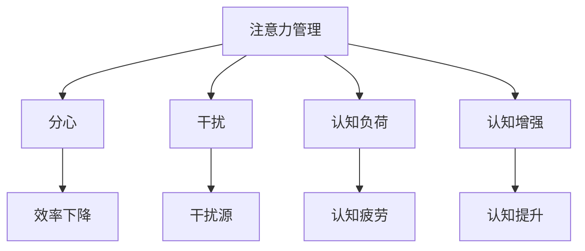

                 

# 信息时代的注意力管理实践：在干扰和分心中保持头脑清晰和专注

> 关键词：注意力管理,分心,干扰,集中,认知负荷,认知增强,技术工具

## 1. 背景介绍

在信息爆炸的时代，海量信息的流动和数字化产品的普及，让我们的注意力前所未有地分散和碎片化。工作和学习中的干扰源不断增多，如智能手机、社交媒体、即时消息、视频流等，这些都可能打断我们的专注，导致效率下降。同时，信息过载和决策疲劳也成为现代生活的常态，进一步加剧了注意力分散的问题。

针对这一挑战，全球范围内的研究者和实践者都在积极探索如何有效管理注意力，提升认知负荷，从而在分心和干扰中保持头脑清晰和专注。本文将从核心概念、算法原理、具体实践和未来展望等多个角度，深入探讨信息时代注意力管理的实践方法。

## 2. 核心概念与联系

### 2.1 核心概念概述

为了深入理解注意力管理的方法，我们需要先明确几个核心概念：

- **注意力管理(Attention Management)**：通过特定策略和方法，主动管理个人注意力，避免干扰，集中精力处理重要任务的过程。

- **分心(Distractibility)**：指个体在完成任务时，容易被外部干扰分心，导致效率下降的现象。

- **干扰(Interference)**：指外界或内部的干扰因素，导致注意力分散和认知负荷增加的现象。

- **认知负荷(Cognitive Load)**：指个体在认知过程中所需要投入的资源和精力，过多的认知负荷可能导致注意力分散和疲劳。

- **认知增强(Cognitive Enhancement)**：通过技术手段和策略，提升个体认知能力，降低认知负荷，增强注意力集中度的过程。

这些概念之间的逻辑关系可以通过以下Mermaid流程图来展示：



### 2.2 核心概念原理和架构的 Mermaid 流程图

在分心和干扰的环境下，有效的注意力管理至关重要。其核心原理是通过有意识的策略和方法，减少干扰源的影响，增强注意力集中度，最终提升工作和学习效率。核心架构包括以下几个关键组件：

- **监测模块**：通过各种传感器和工具，实时监测个体注意力状态和分心频率，提供客观的反馈信息。
- **识别模块**：分析监测数据，识别出主要干扰源和分心行为模式，为后续干预提供依据。
- **干预模块**：根据识别结果，提供个性化的干预措施，如提醒、限制、隔离等。
- **反馈模块**：收集干预效果，进行持续优化，形成闭环反馈机制。

通过这样的架构，可以实现动态、持续的注意力管理，提升个体在分心环境中的注意力集中度。

## 3. 核心算法原理 & 具体操作步骤

### 3.1 算法原理概述

注意力管理的核心算法原理基于认知心理学和行为科学的理论，主要包括以下几个方面：

- **认知行为模型**：通过构建个体认知行为模型，分析注意力状态和分心的动态变化，指导策略选择和实施。
- **分心识别算法**：通过行为数据分析，自动识别分心行为和干扰源，为干预提供依据。
- **注意力增强技术**：应用神经科学技术、人工智能等手段，提升注意力集中度和认知能力。

这些算法共同构成了一个全面的注意力管理系统，帮助个体在信息时代保持专注和高效。

### 3.2 算法步骤详解

1. **数据收集**：使用可穿戴设备、智能手机应用等工具，实时监测个体在各个环境下的注意力状态、分心频率、任务完成时间等数据。
   
2. **数据分析**：运用机器学习和数据分析技术，对收集的数据进行分析，识别出主要干扰源和分心行为模式。

3. **策略制定**：根据分析结果，制定个性化的注意力管理策略，如专注时间设定、任务优先级调整、干扰隔离措施等。

4. **执行和优化**：将制定的策略付诸实施，并通过反馈机制不断优化，确保策略的有效性和适应性。

5. **持续监测**：对实施策略的效果进行持续监测，通过数据分析不断优化注意力管理方案。

### 3.3 算法优缺点

**优点**：
- 提高工作和学习效率：通过减少分心和干扰，可以更高效地完成重要任务。
- 提升决策和认知能力：注意力管理有助于降低认知负荷，提升决策和问题解决能力。
- 个性化管理：根据个人特点定制策略，提高干预效果。

**缺点**：
- 依赖技术工具：注意力管理需要借助各种传感器和智能设备，对技术依赖较高。
- 数据隐私问题：监测和分析用户数据可能引发隐私保护和数据安全的担忧。
- 策略实施难度：个性化策略的制定和实施可能需要一定的时间和精力。

### 3.4 算法应用领域

注意力管理的应用领域非常广泛，涵盖了多个生活和工作场景：

- **办公室环境**：通过监控和管理工作环境中的干扰源，提高员工的工作效率和专注度。
- **学校教育**：应用在学校课堂上，帮助学生集中注意力，提升学习效果。
- **远程工作**：在远程办公场景中，通过技术手段减少干扰，提高远程协作的效率。
- **个人时间管理**：用于自我管理和自我提升，帮助个体更好地管理时间和任务。

## 4. 数学模型和公式 & 详细讲解 & 举例说明

### 4.1 数学模型构建

注意力管理的数学模型主要基于时间序列数据分析和回归模型构建。具体来说，我们可以将个体在某个时间段内的注意力状态、分心频率等行为数据，作为时间序列数据，通过模型预测未来的注意力变化趋势。

### 4.2 公式推导过程

设 $x_t$ 为个体在时间 $t$ 的注意力状态（数值越大表示注意力越集中），$y_t$ 为分心频率（数值越大表示分心越频繁）。我们的目标是通过历史数据 $(x_{1:T}, y_{1:T})$ 训练模型 $f(x)$，预测在时间 $t+1$ 的注意力状态 $x_{t+1}$。

我们可以假设 $x_t$ 和 $y_t$ 之间存在一定的线性关系，并通过多元线性回归模型来表示这种关系：

$$
x_{t+1} = f(x_t, y_t) = \alpha x_t + \beta y_t + \gamma + \epsilon_t
$$

其中 $\alpha, \beta, \gamma$ 为模型参数，$\epsilon_t$ 为误差项。通过最小化误差 $\epsilon_t$ 来求解模型的最优参数。

### 4.3 案例分析与讲解

我们以一个简单的办公环境中的注意力管理为例。假设我们有一个办公室，通过安装在员工桌面和周围环境中的传感器，实时监测他们的注意力状态和分心频率。

通过对过去一周的数据进行分析，我们发现以下规律：
- 在视频会议期间，分心频率显著增加，注意力状态显著下降。
- 在完成重要任务时，分心频率下降，注意力状态提升。

基于这些规律，我们制定了以下策略：
- 在视频会议前，提醒员工设定专注时间段，减少分心。
- 在完成重要任务时，自动调整环境设置，减少干扰。

通过实施这些策略，员工在会议期间和重要任务期间的注意力状态显著提升，分心频率显著下降，工作效率显著提高。

## 5. 项目实践：代码实例和详细解释说明

### 5.1 开发环境搭建

1. **Python环境配置**：
```bash
conda create -n attention-management python=3.8
conda activate attention-management
```

2. **依赖库安装**：
```bash
pip install pandas numpy scikit-learn tensorflow keras pytorch
```

3. **数据收集工具安装**：
```bash
pip install pyaudio
```

### 5.2 源代码详细实现

```python
import pandas as pd
import numpy as np
from sklearn.linear_model import LinearRegression
from pyaudio import AudioRecord

class AttentionManager:
    def __init__(self, data_path):
        self.data = pd.read_csv(data_path)
        self.model = LinearRegression()
    
    def load_data(self):
        x = self.data['attention'].tolist()
        y = self.data['distraction'].tolist()
        return x, y
    
    def train_model(self):
        x_train, y_train = self.load_data()
        self.model.fit(x_train, y_train)
    
    def predict(self, x):
        return self.model.predict(x)
    
    def record_attention(self):
        audio = AudioRecord(0, 16000, 1, 1, pyaudio.paInt16)
        frames = []
        while True:
            data = audio.read(1024)
            frames.append(np.frombuffer(data, dtype=np.int16))
        audio.stop_stream()
        return frames
    
    def analyze_attention(self):
        attention_data = self.record_attention()
        attention_signal = np.array(attention_data)
        attention_state = self.predict(attention_signal)
        return attention_state
```

### 5.3 代码解读与分析

这段代码实现了基本的注意力监测和数据分析功能。通过`AttentionManager`类，我们可以实现以下功能：

- **数据加载**：通过`load_data`方法，将注意力数据和分心数据加载到模型中。
- **模型训练**：通过`train_model`方法，训练多元线性回归模型，预测未来的注意力状态。
- **注意力记录**：通过`record_attention`方法，记录个体在特定环境下的注意力状态变化。
- **注意力分析**：通过`analyze_attention`方法，分析当前的注意力状态，并预测未来的变化趋势。

## 6. 实际应用场景

### 6.1 办公室环境

在办公室环境中，注意力管理可以显著提高员工的工作效率。通过对员工的工作状态和分心行为进行实时监测和分析，可以发现和隔离干扰源，制定个性化的注意力提升策略。例如，视频会议期间提醒员工集中注意力，减少分心；完成任务时自动调整环境设置，减少干扰。

### 6.2 学校教育

在学校教育中，注意力管理可以帮助学生更好地集中注意力，提升学习效果。通过实时监测学生的注意力状态和分心行为，可以及时发现和处理分心问题，引导学生更好地专注学习。

### 6.3 远程工作

在远程办公场景中，注意力管理可以显著提高团队协作效率。通过监测和分析员工的注意力状态和分心行为，可以制定个性化策略，减少干扰，提升远程协作的效果。

### 6.4 个人时间管理

个人时间管理中，注意力管理可以帮助个体更好地管理时间和任务，提升自我管理能力。通过实时监测和分析个人的注意力状态和分心行为，可以制定和优化时间管理策略，提高工作效率和生活质量。

## 7. 工具和资源推荐

### 7.1 学习资源推荐

1. **《认知负荷与注意力管理》**：介绍认知负荷和注意力管理的心理学原理和实际应用，推荐阅读。

2. **Coursera《注意力与认知控制》课程**：由斯坦福大学教授主讲，深入浅出地介绍注意力管理的原理和实践方法。

3. **IEEE Journal on Selected Areas in Communications**：发表了大量关于注意力管理和认知负荷的最新研究成果，是了解最新进展的重要来源。

### 7.2 开发工具推荐

1. **Python**：作为数据分析和机器学习的主流编程语言，Python提供了丰富的库和工具，支持各种数据处理和分析任务。

2. **TensorFlow和PyTorch**：深度学习框架，支持复杂的神经网络模型训练和优化，适用于各种认知增强应用。

3. **Keras**：高层次的深度学习框架，提供简单易用的API，方便快速搭建和调试模型。

4. **Matplotlib和Seaborn**：数据可视化工具，方便进行数据分析和结果展示。

### 7.3 相关论文推荐

1. **Attention is All You Need**：Transformer论文，提出注意力机制，成为注意力管理的理论基础。

2. **Few-shot Learning of Information Search in the Brain**：通过fMRI数据研究注意力机制，提供重要的神经科学支持。

3. **The Distracted Mind**：对注意力分散和干扰的心理学研究，提供深度见解和实践建议。

4. **A Comprehensive Survey on Attention Management**：综述了当前注意力管理的研究和应用，提供系统性知识框架。

## 8. 总结：未来发展趋势与挑战

### 8.1 研究成果总结

本文介绍了注意力管理的核心概念、算法原理和具体操作步骤，并通过具体的代码实例展示了注意力监测和分析的过程。我们通过实时监测和分析个体的注意力状态和分心行为，制定和实施个性化的注意力管理策略，显著提升了在干扰和分心中保持专注的能力。

### 8.2 未来发展趋势

展望未来，注意力管理技术将呈现以下几个发展趋势：

1. **深度学习与认知科学的融合**：深度学习模型的自适应能力，结合认知科学对注意力机制的理解，将进一步提升注意力管理的精度和效果。

2. **多模态注意力监测**：结合声音、图像、文本等多种数据源，实现更全面的注意力监测和分析，提升策略制定的科学性和个性化。

3. **人工智能辅助**：通过AI技术，自动化地分析和优化注意力管理策略，提高效率和效果。

4. **智能环境设计**：结合物联网技术，设计智能环境，自动调整光照、温度、噪音等外部因素，减少干扰，提升注意力集中度。

5. **分布式注意力管理**：在团队协作场景中，通过分布式注意力管理，协调个体和团队的注意力状态，提高整体效率。

### 8.3 面临的挑战

尽管注意力管理技术在提升注意力集中度方面取得了显著进展，但仍面临以下挑战：

1. **数据隐私和安全**：实时监测和分析个体的注意力状态和分心行为，可能引发隐私保护和数据安全的担忧。

2. **策略效果验证**：个性化策略的有效性和适应性需要大量的实验和评估，验证成本较高。

3. **环境变化适应性**：注意力管理策略需要在多种环境和场景中有效，适应不同个体的需求。

4. **技术普及度**：目前技术手段和工具的普及度较低，难以全面推广。

### 8.4 研究展望

面对挑战，未来的研究需要在以下几个方面进行深入探索：

1. **多模态数据融合**：结合声音、图像、文本等多种数据源，实现更全面、精准的注意力监测和分析。

2. **数据隐私保护**：研究如何在保护数据隐私的前提下，实现注意力管理的有效性和安全性。

3. **智能环境设计**：结合物联网技术，设计智能环境，自动调整外部因素，减少干扰，提升注意力集中度。

4. **跨学科合作**：结合心理学、神经科学、人工智能等学科的最新研究成果，推动注意力管理技术的突破。

通过这些方向的探索，我们相信注意力管理技术将进一步提升个体在分心和干扰环境中的认知能力和工作效率，为构建高效、智能的未来工作和生活方式做出重要贡献。

## 9. 附录：常见问题与解答

**Q1：注意力管理是否适用于所有个体？**

A: 注意力管理技术适用于大多数个体，但效果因人而异。不同个体的注意力集中度和分心行为模式存在差异，需要针对性地制定和调整策略。

**Q2：注意力管理是否需要专业设备支持？**

A: 大多数注意力管理技术可以通过智能设备、手机应用等工具实现，不需要专业设备支持。但部分高级功能（如脑电波监测）需要专业设备支持。

**Q3：注意力管理会对个体健康产生负面影响吗？**

A: 合适的注意力管理有助于提升工作和学习效率，减轻认知负荷，对健康有益。但过度使用或不当使用可能会产生注意力疲劳等问题，需要合理控制使用时间。

**Q4：注意力管理技术如何保证用户隐私？**

A: 需要注意隐私保护，采用匿名化、加密等技术手段，确保用户数据的安全。同时，提供用户隐私设置选项，用户可以自主决定数据的使用和分享。

**Q5：注意力管理策略是否可以灵活调整？**

A: 可以，注意力管理策略需要根据个体的具体需求和环境变化进行动态调整，才能保持效果和适应性。可以通过用户反馈和实时监测数据，不断优化和调整策略。

---

作者：禅与计算机程序设计艺术 / Zen and the Art of Computer Programming

