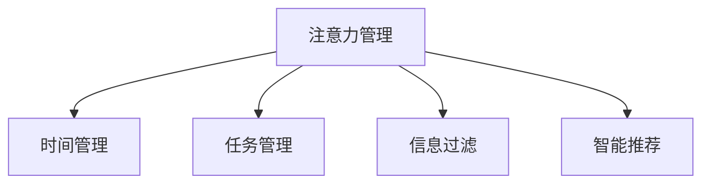

                 

# 信息时代的注意力管理技术与实践：在干扰和信息过载中保持专注

## 1. 背景介绍

### 1.1 问题由来

在数字化、信息化飞速发展的今天，人们的工作与生活已经与数字信息密不可分。一方面，数字技术极大地提高了效率，实现了信息流通的高速化和实时化；另一方面，信息的爆炸式增长也带来了新的挑战：信息过载和注意力分散。大数据时代下，人们每天接触的信息量急剧增加，如何从海量信息中筛选出真正有用的内容，保持高效专注，成为当前迫切需要解决的问题。

### 1.2 问题核心关键点

注意力管理技术的核心在于帮助用户从信息海洋中聚焦于重要信息，避免干扰和分心。现代注意力管理技术包括但不限于时间管理、任务管理、信息过滤、智能推荐等多个方面。其关键在于理解人类注意力分布的心理学原理，并利用数据和算法实现高效的注意力分配和信息筛选。

本文将介绍几种常见的注意力管理技术，并结合实际案例，分析其在不同场景下的应用效果和优劣。重点关注如何在大数据、信息过载的环境下，通过算法和技术手段，帮助人们保持专注，提高工作效率和生活质量。

## 2. 核心概念与联系

### 2.1 核心概念概述

为更好地理解注意力管理技术，本节将介绍几个密切相关的核心概念：

- 注意力管理（Attention Management）：通过算法和技术手段，帮助用户从大量信息中筛选出重要内容，避免注意力分散和信息过载。
- 时间管理（Time Management）：通过合理规划和安排时间，提高任务执行效率，避免时间浪费。
- 任务管理（Task Management）：通过任务分解和优先级排序，提升工作和生活管理的系统性和条理性。
- 信息过滤（Information Filtering）：通过算法对海量信息进行筛选，仅向用户展示其可能感兴趣的内容，减少信息干扰。
- 智能推荐（Intelligent Recommendation）：通过用户行为数据和历史偏好，预测用户可能感兴趣的内容，优化信息接收体验。

这些概念之间的逻辑关系可以通过以下Mermaid流程图来展示：



这个流程图展示了一些核心概念之间的联系：

1. 注意力管理是对信息流量的初步控制，帮助用户保持专注。
2. 时间管理和任务管理是通过具体的时间和任务安排，支持用户高效执行注意力管理的结果。
3. 信息过滤和智能推荐则是对注意力管理结果的进一步优化，确保用户接收到的信息更有价值。

## 3. 核心算法原理 & 具体操作步骤

### 3.1 算法原理概述

注意力管理技术的核心是利用算法对用户的行为数据进行分析和处理，通过预测和推荐，帮助用户聚焦于重要信息。

常见算法包括基于模型的推荐算法（如协同过滤、基于内容的推荐）、基于规则的推荐算法（如基于关键词的推荐）、基于深度学习的推荐算法（如深度神经网络、强化学习）等。

这些算法通常通过用户历史行为数据、点击记录、浏览记录等，建模用户兴趣模型，并预测用户可能感兴趣的内容，实现信息过滤和智能推荐。

### 3.2 算法步骤详解

以基于协同过滤的推荐算法为例，介绍其基本步骤：

1. **数据收集与预处理**：收集用户的历史行为数据，包括点击、浏览、购买记录等，并进行数据清洗和预处理。

2. **用户兴趣建模**：将用户历史行为转化为向量表示，并计算用户间的相似度，得到用户兴趣向量。

3. **物品相似度计算**：对推荐物品进行特征提取和向量表示，计算物品间的相似度。

4. **推荐结果排序**：根据用户和物品的相似度，计算推荐分数，对推荐结果进行排序，返回给用户。

### 3.3 算法优缺点

基于协同过滤的推荐算法具有以下优点：

- 算法简单易懂，不需要额外的特征工程，适合小规模数据集。
- 可以处理隐式反馈，如用户未点击但浏览过的商品，捕捉用户潜在兴趣。

同时，该算法也存在一些局限：

- 数据稀疏性问题：用户历史行为数据较少时，算法效果会明显下降。
- 冷启动问题：新用户或新物品没有历史行为记录，算法难以推荐。
- 推荐多样性：算法倾向于推荐相似物品，可能减少用户的新鲜感。

### 3.4 算法应用领域

注意力管理技术已经广泛应用于多个领域，包括但不限于：

- 信息获取与搜索：通过推荐算法，帮助用户快速找到所需信息。
- 电子商务：通过个性化推荐，提升用户购物体验和转化率。
- 内容推荐：对新闻、视频、音乐等进行个性化推荐，提升用户满意度。
- 信息安全：对敏感信息进行过滤，保护用户隐私安全。
- 教育培训：根据用户学习行为，推荐学习内容和资源，提高学习效率。

## 4. 数学模型和公式 & 详细讲解 & 举例说明

### 4.1 数学模型构建

注意力管理算法的核心是利用用户和物品的向量表示，计算相似度并进行推荐。设用户和物品的向量分别为 $U$ 和 $I$，用户与物品之间的相似度 $S$ 可以用余弦相似度计算：

$$
S = \cos(\theta) = \frac{U \cdot I}{\|U\| \|I\|}
$$

其中 $U \cdot I$ 为向量内积，$\|U\|$ 和 $\|I\|$ 分别为向量 $U$ 和 $I$ 的模长。

### 4.2 公式推导过程

在协同过滤推荐算法中，用户 $u$ 和物品 $i$ 的推荐分数 $R_{ui}$ 可表示为：

$$
R_{ui} = \sum_{j=1}^N \alpha_j \cdot U_u \cdot I_i
$$

其中 $N$ 为物品数量，$U_u$ 和 $I_i$ 分别为用户 $u$ 和物品 $i$ 的特征向量，$\alpha_j$ 为物品 $j$ 对物品 $i$ 的影响权重。

通过以上公式，可以计算用户对每个物品的推荐分数，并选择得分最高的前 $K$ 个物品作为推荐结果。

### 4.3 案例分析与讲解

以Amazon商品推荐系统为例，该系统利用用户和商品的点击记录，对用户进行兴趣建模，计算物品相似度，并基于协同过滤算法，推荐用户可能感兴趣的物品。

具体流程如下：

1. **数据收集**：收集用户的历史点击记录，并将商品特征提取为向量表示。

2. **用户建模**：对用户历史点击记录进行向量表示，并计算用户与商品之间的相似度。

3. **物品建模**：对商品进行特征提取，并计算商品间的相似度。

4. **推荐计算**：根据用户和商品的相似度，计算推荐分数，选择得分最高的商品进行推荐。

Amazon的商品推荐系统通过不断迭代优化模型参数，显著提升了推荐效果，并取得了显著的业务价值。

## 5. 项目实践：代码实例和详细解释说明

### 5.1 开发环境搭建

在进行推荐系统开发前，我们需要准备好开发环境。以下是使用Python进行PyTorch开发的环境配置流程：

1. 安装Anaconda：从官网下载并安装Anaconda，用于创建独立的Python环境。

2. 创建并激活虚拟环境：
```bash
conda create -n pytorch-env python=3.8 
conda activate pytorch-env
```

3. 安装PyTorch：根据CUDA版本，从官网获取对应的安装命令。例如：
```bash
conda install pytorch torchvision torchaudio cudatoolkit=11.1 -c pytorch -c conda-forge
```

4. 安装推荐系统相关的库：
```bash
pip install scipy pandas numpy scikit-learn joblib lightfm 
```

5. 安装数据处理相关的库：
```bash
pip install matplotlib seaborn plotly
```

完成上述步骤后，即可在`pytorch-env`环境中开始推荐系统开发。

### 5.2 源代码详细实现

这里我们以基于协同过滤的推荐系统为例，展示如何使用Python实现商品推荐。

首先，准备数据集：

```python
import pandas as pd
from lightfm.datasets import fetch_movielens
from lightfm import LightFM

# 加载电影推荐数据集
data = fetch_movielens()
ratings = pd.read_csv(data[0])
movies = pd.read_csv(data[1])

# 构建数据集
def build_dataframe(ratings, movies):
    data = ratings.merge(movies, on='user_id', how='left').merge(movies, on='item_id', how='left', left_on='item_id', right_on='movie_id')
    data = data.dropna()
    data = data.drop(columns=['user_id', 'item_id', 'timestamp'])
    data['rating'] = 1 if data['rating'] > 0 else 0
    return data

# 获取训练集和测试集
train_df = build_dataframe(ratings[::2], movies)
test_df = build_dataframe(ratings[1::2], movies)
```

然后，使用LightFM模型进行训练：

```python
model = LightFM()

# 将用户和物品ID转换为数值型
train_df['user_id'] = train_df['user_id'].astype('int64')
train_df['item_id'] = train_df['item_id'].astype('int64')

# 训练模型
model.fit(train_df, epochs=20, verbose=False)
```

最后，对测试集进行预测，并输出推荐结果：

```python
# 将测试集转换为训练集格式
test_df['user_id'] = test_df['user_id'].astype('int64')
test_df['item_id'] = test_df['item_id'].astype('int64')

# 进行预测
predictions = model.predict(test_df)
```

完整代码如下：

```python
import pandas as pd
from lightfm.datasets import fetch_movielens
from lightfm import LightFM

# 加载电影推荐数据集
data = fetch_movielens()
ratings = pd.read_csv(data[0])
movies = pd.read_csv(data[1])

# 构建数据集
def build_dataframe(ratings, movies):
    data = ratings.merge(movies, on='user_id', how='left').merge(movies, on='item_id', how='left', left_on='item_id', right_on='movie_id')
    data = data.dropna()
    data = data.drop(columns=['user_id', 'item_id', 'timestamp'])
    data['rating'] = 1 if data['rating'] > 0 else 0
    return data

# 获取训练集和测试集
train_df = build_dataframe(ratings[::2], movies)
test_df = build_dataframe(ratings[1::2], movies)

# 训练模型
model = LightFM()
train_df['user_id'] = train_df['user_id'].astype('int64')
train_df['item_id'] = train_df['item_id'].astype('int64')
model.fit(train_df, epochs=20, verbose=False)

# 进行预测
test_df['user_id'] = test_df['user_id'].astype('int64')
test_df['item_id'] = test_df['item_id'].astype('int64')
predictions = model.predict(test_df)
```

### 5.3 代码解读与分析

让我们再详细解读一下关键代码的实现细节：

**fetch_movielens函数**：
- 从数据集中加载电影评分数据，并合并到电影ID数据集中。

**build_dataframe函数**：
- 将评分数据集和电影ID数据集合并，并进行预处理，生成用于训练的DataFrame格式数据集。

**LightFM模型训练**：
- 使用LightFM模型进行训练，设置训练轮数为20轮，不打印训练信息。

**测试集预测**：
- 将测试集数据转换为模型输入格式，使用模型进行预测，得到推荐分数。

## 6. 实际应用场景

### 6.1 电商推荐系统

基于协同过滤的推荐算法在电商领域得到了广泛应用。亚马逊、淘宝、京东等电商平台都采用推荐系统向用户推荐商品，提升用户体验和购买转化率。

电商推荐系统通常采用用户行为数据，通过协同过滤算法计算用户和商品的相似度，推荐可能感兴趣的商品。推荐的商品种类多，覆盖面广，能够满足不同用户的个性化需求。

### 6.2 视频流媒体推荐

视频流媒体平台如Netflix、YouTube等也广泛采用推荐系统，向用户推荐电影、电视剧、纪录片等视频内容。

视频推荐系统通常采用用户历史观看记录和评分数据，利用协同过滤算法计算用户和视频的相似度，并推荐用户可能感兴趣的视频。推荐系统能够显著提高用户观看时长和满意度。

### 6.3 新闻信息推荐

新闻聚合平台如今日头条、新浪新闻等，通过推荐系统向用户推荐新闻内容。

新闻推荐系统通常采用用户阅读历史和浏览记录，利用协同过滤算法计算用户和新闻文章的相似度，并推荐用户可能感兴趣的新闻。推荐系统能够提高用户阅读量和新闻点击率。

## 7. 工具和资源推荐

### 7.1 学习资源推荐

为了帮助开发者系统掌握注意力管理技术，这里推荐一些优质的学习资源：

1. 《推荐系统实战》书籍：详细介绍了推荐系统的工作原理和算法实现，适合初学者入门。

2. 《深度学习推荐系统》课程：斯坦福大学开设的深度学习课程，介绍了深度学习在推荐系统中的应用。

3. 《Python推荐系统实战》博客：介绍了使用Python实现推荐系统的详细过程，适合动手实践。

4. Kaggle推荐系统竞赛：Kaggle平台上有多个推荐系统竞赛，可以实际参与训练和测试推荐算法。

5. GitHub推荐系统项目：GitHub上有许多开源的推荐系统项目，可以学习和参考。

通过对这些资源的学习实践，相信你一定能够快速掌握推荐系统的实现和优化方法，并应用于实际业务场景。

### 7.2 开发工具推荐

高效的开发离不开优秀的工具支持。以下是几款用于推荐系统开发的常用工具：

1. PyTorch：基于Python的开源深度学习框架，适合实现复杂的深度学习模型。

2. TensorFlow：由Google主导开发的开源深度学习框架，支持分布式计算和模型部署。

3. LightFM：HuggingFace提供的轻量级推荐系统库，支持协同过滤和矩阵分解算法。

4. Surprise：Python推荐系统库，支持多种推荐算法，易于使用。

5. Spark：Apache提供的分布式计算框架，支持大规模推荐系统的训练和部署。

合理利用这些工具，可以显著提升推荐系统的开发效率，加快创新迭代的步伐。

### 7.3 相关论文推荐

推荐系统的发展源于学界的持续研究。以下是几篇奠基性的相关论文，推荐阅读：

1. J. Koren 的《Collaborative Filtering for Implicit Feedback Datasets》：介绍了协同过滤算法的基本原理和实现方法。

2. Y. Bengio 的《Representation Learning: A Review and New Perspectives》：讨论了深度学习在推荐系统中的应用前景。

3. A. Narang 的《Deep Aspect Recommendation》：研究了深度神经网络在推荐系统中的应用，提出了多种深度学习推荐算法。

4. X. Chen 的《Adaptive Matrix Factorization》：介绍了矩阵分解算法的基本原理和实现方法。

5. H. Deng 的《An Overview of Recommender Systems: Research Challenges》：总结了推荐系统的研究挑战和未来方向。

这些论文代表了大数据推荐系统的发展脉络。通过学习这些前沿成果，可以帮助研究者把握学科前进方向，激发更多的创新灵感。

## 8. 总结：未来发展趋势与挑战

### 8.1 总结

本文对基于协同过滤的推荐系统进行了全面系统的介绍。首先阐述了推荐系统的背景和意义，明确了其在信息管理中的重要价值。其次，从原理到实践，详细讲解了协同过滤推荐系统的数学模型和算法步骤，给出了推荐系统开发的完整代码实例。同时，本文还广泛探讨了推荐系统在电商、视频、新闻等众多场景下的应用效果，展示了推荐系统的广泛应用前景。

通过本文的系统梳理，可以看到，基于协同过滤的推荐系统已经广泛应用于各个领域，显著提升了用户体验和业务价值。未来，伴随推荐算法的不断演进和应用场景的扩展，推荐系统必将在更多领域发挥更大的作用，成为信息时代的核心技术。

### 8.2 未来发展趋势

展望未来，推荐系统的发展趋势主要包括以下几个方面：

1. 推荐模型深化：深度学习推荐系统将继续发展，通过复杂的模型结构和更丰富的特征表示，提升推荐效果。

2. 推荐算法多样化：除了协同过滤和矩阵分解算法，推荐系统将引入更多算法，如基于内容的推荐、基于知识图谱的推荐、基于对抗训练的推荐等。

3. 推荐系统个性化：推荐系统将更加注重个性化，通过用户的复杂行为和多样化需求，提供更精准的推荐内容。

4. 推荐系统泛化能力提升：推荐系统将具备更强的泛化能力，能够适应不同领域和数据类型的推荐任务。

5. 推荐系统实时性增强：推荐系统将实现更快速的训练和推荐，满足实时性要求，提升用户体验。

6. 推荐系统融合多模态数据：推荐系统将融合视觉、语音、文本等多种模态数据，提供更全面的推荐服务。

以上趋势凸显了推荐系统技术的广阔前景。这些方向的探索发展，必将进一步提升推荐系统的性能和应用范围，为信息时代的信息管理提供更强大、更高效的技术支撑。

### 8.3 面临的挑战

尽管推荐系统已经取得了瞩目成就，但在迈向更加智能化、普适化应用的过程中，它仍面临诸多挑战：

1. 数据隐私问题：推荐系统依赖大量用户数据，如何保护用户隐私、防止数据滥用，是亟待解决的问题。

2. 冷启动问题：新用户和新物品没有历史数据，推荐系统难以推荐，需要引入先验知识或增量学习策略。

3. 推荐多样性：推荐系统倾向于推荐相似物品，可能减少用户的新鲜感，需要引入多样化推荐策略。

4. 算法透明度：推荐系统的决策过程不够透明，难以解释其内部工作机制，影响用户信任。

5. 计算资源消耗：推荐系统需要处理大量数据，计算复杂度高，需要高效的计算资源支持。

6. 用户行为多样性：用户行为复杂多样，推荐系统需要具备更强的适应性和灵活性。

正视推荐系统面临的这些挑战，积极应对并寻求突破，将使推荐系统在未来发展中取得更大的突破和进步。

### 8.4 研究展望

面对推荐系统所面临的种种挑战，未来的研究需要在以下几个方面寻求新的突破：

1. 探索基于深度学习的推荐算法：开发更复杂的深度学习模型，引入自注意力机制、图卷积神经网络等，提升推荐效果。

2. 研究跨模态推荐算法：融合视觉、语音、文本等多种模态数据，提高推荐的全面性和准确性。

3. 引入对抗训练和对抗样本：通过对抗训练提高推荐系统的鲁棒性，增强对抗样本检测，提升推荐系统的安全性。

4. 开发基于知识的推荐算法：结合知识图谱、逻辑规则等专家知识，提高推荐系统的可信度和合理性。

5. 引入多目标优化：设计多目标优化算法，同时考虑推荐效果、用户满意度、推荐成本等多个因素，提升推荐系统的综合效益。

6. 研究用户行为建模：深入理解用户行为规律，设计更灵活的推荐策略，提高推荐的个性化和多样性。

这些研究方向的探索，必将引领推荐系统技术迈向更高的台阶，为信息时代的信息管理提供更强大、更高效的技术支撑。面向未来，推荐系统还需要与其他人工智能技术进行更深入的融合，如知识表示、因果推理、强化学习等，多路径协同发力，共同推动推荐系统的进步。只有勇于创新、敢于突破，才能不断拓展推荐系统的边界，让信息管理技术更好地造福人类社会。

## 9. 附录：常见问题与解答

**Q1：推荐系统如何缓解数据稀疏性问题？**

A: 数据稀疏性是推荐系统常见的问题，可以通过以下方法缓解：
1. 基于协同过滤的推荐算法：引入用户和物品的隐式反馈，如用户未点击但浏览过的商品，提高模型预测的准确性。
2. 基于内容的推荐算法：通过分析物品特征，进行相似度计算，推荐可能感兴趣的内容。
3. 矩阵分解算法：将用户和物品的评分矩阵分解，得到低秩矩阵表示，减少数据稀疏性带来的影响。

**Q2：推荐系统如何应对冷启动问题？**

A: 冷启动问题可以通过以下方法解决：
1. 基于协同过滤的推荐算法：引入先验知识，如用户人口统计特征、物品属性等，进行推荐。
2. 基于内容的推荐算法：利用物品的特征和描述信息，进行推荐。
3. 深度学习推荐算法：通过神经网络模型，学习用户和物品的潜在兴趣，缓解冷启动问题。

**Q3：推荐系统如何提高多样性？**

A: 提高推荐系统的多样性可以通过以下方法实现：
1. 基于协同过滤的推荐算法：引入多样性惩罚，控制相似物品的推荐数量。
2. 基于内容的推荐算法：结合用户兴趣和物品特征，推荐不同类别的物品。
3. 混合推荐算法：结合基于协同过滤和基于内容的推荐算法，提供多样化的推荐结果。

**Q4：推荐系统如何优化计算效率？**

A: 优化推荐系统的计算效率可以通过以下方法实现：
1. 基于协同过滤的推荐算法：使用分布式计算框架，如Spark，提高计算效率。
2. 基于内容的推荐算法：通过特征工程，减少特征向量的维度，降低计算复杂度。
3. 矩阵分解算法：通过并行计算和优化算法，提高计算效率。

**Q5：推荐系统如何提高透明度？**

A: 提高推荐系统的透明度可以通过以下方法实现：
1. 基于协同过滤的推荐算法：公开推荐模型的参数和训练过程，让用户了解推荐机制。
2. 基于内容的推荐算法：通过分析物品特征和用户偏好，解释推荐结果。
3. 深度学习推荐算法：引入可解释性模型，如注意力机制、可视化技术，帮助用户理解推荐过程。

这些方法可以提升推荐系统的可信度和透明度，增强用户对推荐系统的信任感。

---

作者：禅与计算机程序设计艺术 / Zen and the Art of Computer Programming

