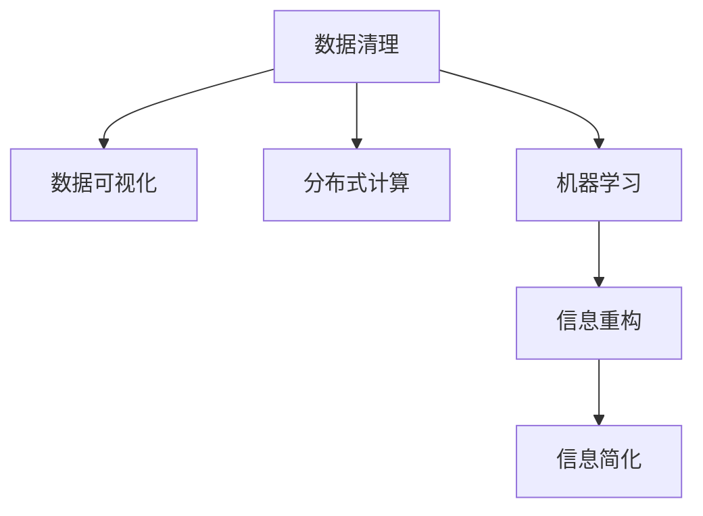

                 

# 信息简化的原则与实践：在混乱和复杂中建立秩序与简化

> 关键词：信息简化，数据清理，数据可视化，分布式计算，机器学习，深度学习，复杂系统，大数据

## 1. 背景介绍

### 1.1 问题由来

随着互联网技术的迅猛发展和信息技术的不断革新，信息量呈爆炸性增长。无论是企业还是个人，面对海量数据，都面临着如何高效管理和利用这些信息、如何在混乱和复杂中建立秩序与简化的挑战。信息过载已经成为了一个全球性的问题，影响着人们的工作效率和生活质量。

面对这一问题，信息简化成为解决问题的一个关键方法。信息简化不仅涉及数据的清洗和处理，更涉及数据的可视化、分布式计算和机器学习等技术的应用。通过科学合理地简化和重构信息，可以提高信息处理的效率和准确性，从而在复杂的信息环境中建立有序、高效的工作流程和决策机制。

### 1.2 问题核心关键点

信息简化涉及对复杂、混乱数据的处理，需要一系列的技术和方法。主要关键点包括：

- 数据清理：清洗数据中的噪音和错误，确保数据的质量和完整性。
- 数据可视化：利用图表和图形将数据信息直观呈现，帮助决策者更快速地理解和分析数据。
- 分布式计算：通过并行计算技术，在多个节点上同时处理大量数据，提高处理效率。
- 机器学习与深度学习：利用机器学习算法对数据进行建模和预测，提取数据中的关键信息。
- 信息重构：根据业务需求和目标，对信息进行提炼和重构，建立简单、明确的信息框架。

## 2. 核心概念与联系

### 2.1 核心概念概述

为了更好地理解信息简化的过程和方法，本节将介绍几个密切相关的核心概念：

- **信息简化**：指通过清洗、整理、分析等手段，将复杂、混乱的数据转化为易于理解和应用的形式。信息简化的目标是提高数据处理的效率和质量，降低决策的风险和成本。
- **数据清理**：指去除数据中的噪音、错误和重复信息，确保数据的质量和一致性。数据清理是信息简化的基础和前提。
- **数据可视化**：指通过图形和图表将数据信息直观展示出来，帮助决策者更快速、更准确地理解数据。数据可视化是信息简化的重要手段。
- **分布式计算**：指将大规模数据任务分布在多个计算节点上并行处理，提高数据处理的效率和可扩展性。分布式计算是信息简化中的关键技术。
- **机器学习与深度学习**：指利用算法对数据进行建模和预测，提取数据中的关键信息。机器学习与深度学习是信息简化的重要工具。
- **信息重构**：指根据业务需求和目标，对信息进行提炼和重构，建立简单、明确的信息框架。信息重构是信息简化的最终目标。

这些核心概念之间的逻辑关系可以通过以下Mermaid流程图来展示：



这个流程图展示了数据清理、数据可视化、分布式计算、机器学习和信息重构之间的逻辑关系：

1. 数据清理是信息简化的基础，去除噪音和错误。
2. 数据可视化是信息简化的手段，直观展示数据。
3. 分布式计算是信息简化的关键技术，提高处理效率。
4. 机器学习与深度学习是信息简化的重要工具，提取关键信息。
5. 信息重构是信息简化的最终目标，提炼关键信息。

## 3. 核心算法原理 & 具体操作步骤

### 3.1 算法原理概述

信息简化的基本原理是通过数据清理、数据可视化、分布式计算、机器学习和信息重构等手段，将复杂、混乱的数据转化为易于理解和应用的形式。其核心思想是将复杂问题分解为可管理的小问题，逐步简化和重构信息，最终实现数据的有效管理和应用。

形式化地，假设原始数据集为 $D=\{(x_i,y_i)\}_{i=1}^N$，其中 $x_i$ 为输入，$y_i$ 为输出。信息简化的目标是通过一系列的预处理和算法操作，将 $D$ 转化为简化后的数据集 $D_s$，满足以下要求：

- $D_s$ 的数据量较小，但保留了关键信息。
- $D_s$ 的数据质量较高，不含噪音和错误。
- $D_s$ 的数据结构清晰，便于分析和应用。

信息简化的过程大致包括：数据清理、数据可视化、分布式计算、机器学习和信息重构等步骤。

### 3.2 算法步骤详解

信息简化的具体操作主要包括以下几个关键步骤：

**Step 1: 数据清理**
- 数据收集：从不同来源收集原始数据，如数据库、传感器、日志文件等。
- 数据清洗：去除数据中的重复、缺失、噪音和错误，确保数据的质量和完整性。
- 数据标准化：统一数据格式和单位，便于后续处理和分析。

**Step 2: 数据可视化**
- 数据探索：通过描述性统计分析，初步了解数据的分布、趋势和异常。
- 数据可视化：利用图表和图形将数据信息直观呈现，帮助决策者更快速、更准确地理解数据。

**Step 3: 分布式计算**
- 数据分布：将数据划分为多个数据块，分配到不同的计算节点上。
- 并行处理：在多个节点上同时处理数据块，提高数据处理的效率和可扩展性。
- 结果合并：将各节点处理结果汇总，生成最终的数据输出。

**Step 4: 机器学习与深度学习**
- 数据建模：使用机器学习算法对数据进行建模和预测，提取数据中的关键信息。
- 模型优化：通过交叉验证和调参，优化模型的性能和泛化能力。
- 结果应用：将模型应用于实际业务场景，进行预测、分类、聚类等操作。

**Step 5: 信息重构**
- 信息提炼：根据业务需求和目标，对数据进行提炼和重构，去除冗余信息。
- 信息重构：将提炼后的信息转化为简单、明确的信息框架，便于后续处理和应用。
- 信息简化：将重构后的信息转化为易于理解和应用的形式，建立清晰的信息框架。

以上是信息简化的基本步骤。在实际应用中，还需要针对具体任务的特点，对信息简化的各个环节进行优化设计，如改进数据清洗算法、选择适当的可视化工具、设计高效的分布式计算框架等，以进一步提升信息简化的效果。

### 3.3 算法优缺点

信息简化的核心算法具有以下优点：
1. 简化复杂问题。将复杂问题分解为可管理的小问题，逐步简化和重构信息，提高问题处理的效率和准确性。
2. 提高数据质量。通过数据清洗和标准化，去除噪音和错误，确保数据的质量和完整性。
3. 提升处理效率。利用分布式计算和并行处理技术，快速处理大规模数据，提高处理效率。
4. 提取关键信息。通过机器学习与深度学习算法，提取数据中的关键信息，提高决策的准确性。
5. 增强信息可视化。利用图表和图形直观展示数据，帮助决策者快速理解数据。

同时，该算法也存在一些局限性：
1. 数据清洗难度大。对于数据量庞大、结构复杂的数据集，清洗工作复杂耗时。
2. 数据可视化复杂。对于高维度、非结构化数据，可视化难度较大。
3. 分布式计算复杂。分布式计算需要设计高效的计算框架和调度策略，需要较高技术门槛。
4. 模型选择困难。不同的业务场景需要选择不同的机器学习算法，模型选择较为困难。
5. 信息重构复杂。信息重构需要根据业务需求和目标，对数据进行提炼和重构，工作复杂。

尽管存在这些局限性，但就目前而言，信息简化的核心算法仍是大数据处理中最为重要的方法之一。未来相关研究的重点在于如何进一步简化信息简化的操作步骤，提高数据处理和信息提炼的效率和准确性，同时兼顾信息可视化和决策支持等因素。

### 3.4 算法应用领域

信息简化方法在众多领域中得到广泛应用，具体包括：

- 金融领域：金融风险管理、信用评估、股票预测等。通过信息简化，优化决策过程，提高金融风险管理的准确性。
- 医疗领域：病历分析、疾病预测、患者分类等。通过信息简化，提取关键信息，优化医疗决策，提高诊疗效率。
- 电商领域：用户行为分析、商品推荐、广告投放等。通过信息简化，优化用户体验，提高电商平台的运营效率。
- 智能制造领域：设备故障预测、质量控制、生产调度等。通过信息简化，优化生产流程，提高生产效率和质量。
- 智慧城市领域：交通流量监测、环境监测、公共安全等。通过信息简化，优化城市管理，提高城市治理水平。
- 物流领域：货物追踪、配送路径规划、库存管理等。通过信息简化，优化物流流程，提高物流效率和准确性。

此外，信息简化技术还广泛应用于科学研究、能源管理、社会治理等多个领域，为各个行业的数字化转型提供了强大的技术支持。

## 4. 数学模型和公式 & 详细讲解 & 举例说明

### 4.1 数学模型构建

信息简化的数学模型主要涉及数据清理、数据可视化、分布式计算、机器学习和信息重构等关键步骤。以下是对这些步骤的数学模型构建。

**数据清理**
假设原始数据集为 $D=\{(x_i,y_i)\}_{i=1}^N$，其中 $x_i$ 为输入，$y_i$ 为输出。数据清理的目标是去除数据中的噪音和错误，保留关键信息。

**数据可视化**
数据可视化通常使用图表和图形将数据信息直观呈现。常见的可视化方法包括散点图、折线图、柱状图等。以下以散点图为例，说明数据可视化的数学模型：

假设有一组数据 $(x_1,y_1),(x_2,y_2),\cdots,(x_N,y_N)$，其中 $x_i$ 为输入，$y_i$ 为输出。通过散点图可视化，可以得到以下公式：

$$
\text{散点图}(x,y) = \{(x_i,y_i)|i=1,2,\cdots,N\}
$$

**分布式计算**
分布式计算通常采用并行计算技术，在多个节点上同时处理数据。假设数据集 $D$ 被划分为 $k$ 个数据块 $D_1,D_2,\cdots,D_k$，分布在 $k$ 个节点上并行处理。假设节点 $i$ 处理数据块 $D_i$，得到结果 $r_i$。最终的结果 $R$ 为所有节点处理结果的合集：

$$
R = \bigcup_{i=1}^k r_i
$$

**机器学习与深度学习**
机器学习与深度学习的数学模型通常使用监督学习、非监督学习和强化学习等算法。以监督学习为例，假设数据集 $D$ 包含 $N$ 个样本，每个样本包含 $d$ 个特征和 $c$ 个类别。假设模型参数为 $\theta$，则监督学习的目标是最小化损失函数 $\mathcal{L}(\theta)$，公式如下：

$$
\mathcal{L}(\theta) = \frac{1}{N}\sum_{i=1}^N \ell(y_i,f(x_i;\theta))
$$

其中 $\ell(y_i,f(x_i;\theta))$ 为损失函数，$f(x_i;\theta)$ 为模型输出。

**信息重构**
信息重构的目标是将提炼后的信息转化为简单、明确的信息框架。假设原始数据集为 $D=\{(x_i,y_i)\}_{i=1}^N$，其中 $x_i$ 为输入，$y_i$ 为输出。信息重构的过程可以表示为：

$$
D_s = \{(x_i,y_i)\}_{i=1}^M \subset D
$$

其中 $M$ 为提炼后的数据量，$D_s$ 为重构后的数据集。

### 4.2 公式推导过程

以下以散点图可视化的公式推导为例，说明数据可视化的数学推导过程。

假设有一组数据 $(x_1,y_1),(x_2,y_2),\cdots,(x_N,y_N)$，其中 $x_i$ 为输入，$y_i$ 为输出。通过散点图可视化，可以得到以下公式：

$$
\text{散点图}(x,y) = \{(x_i,y_i)|i=1,2,\cdots,N\}
$$

其数学推导过程如下：

1. 假设数据集 $D=\{(x_i,y_i)\}_{i=1}^N$，其中 $x_i$ 为输入，$y_i$ 为输出。
2. 数据可视化的目标是将数据信息直观展示出来，帮助决策者快速理解数据。
3. 散点图是一种常用的数据可视化方法，其数学模型为：

   $$
   \text{散点图}(x,y) = \{(x_i,y_i)|i=1,2,\cdots,N\}
   $$

4. 通过散点图，决策者可以直观地观察数据分布、趋势和异常，快速做出决策。

### 4.3 案例分析与讲解

假设某电商公司希望通过信息简化技术，提高用户的购买转化率。以下是一个具体的案例分析：

1. **数据收集**：收集用户浏览、点击、购买等行为数据。
2. **数据清理**：去除数据中的重复、缺失、噪音和错误，确保数据的质量和完整性。
3. **数据可视化**：利用散点图、柱状图等可视化方法，直观展示用户行为数据。
4. **分布式计算**：将数据划分为多个数据块，分布到不同的计算节点上并行处理，提高数据处理的效率和可扩展性。
5. **机器学习与深度学习**：使用监督学习算法，对用户行为数据进行建模和预测，提取关键信息。
6. **信息重构**：根据业务需求和目标，对数据进行提炼和重构，建立简单、明确的信息框架。
7. **信息简化**：将重构后的信息转化为易于理解和应用的形式，建立清晰的信息框架。

通过以上步骤，电商公司可以建立用户行为分析模型，优化广告投放策略，提高用户的购买转化率。

## 5. 项目实践：代码实例和详细解释说明

### 5.1 开发环境搭建

在进行信息简化的项目实践前，我们需要准备好开发环境。以下是使用Python进行Pandas、Matplotlib和Dask进行数据处理和可视化的环境配置流程：

1. 安装Anaconda：从官网下载并安装Anaconda，用于创建独立的Python环境。

2. 创建并激活虚拟环境：
```bash
conda create -n info-simplify python=3.8 
conda activate info-simplify
```

3. 安装Pandas：
```bash
conda install pandas
```

4. 安装Matplotlib：
```bash
conda install matplotlib
```

5. 安装Dask：
```bash
conda install dask
```

6. 安装其他工具包：
```bash
pip install numpy scikit-learn tqdm jupyter notebook ipython
```

完成上述步骤后，即可在`info-simplify`环境中开始信息简化的实践。

### 5.2 源代码详细实现

下面我们以电商用户行为分析为例，给出使用Pandas、Matplotlib和Dask对用户行为数据进行信息简化的PyTorch代码实现。

首先，定义数据处理函数：

```python
import pandas as pd
import matplotlib.pyplot as plt
import dask.dataframe as dd

def load_data(filename):
    data = pd.read_csv(filename)
    data = data.drop_duplicates()
    data = data.dropna()
    return data

def plot_scatter(data, x, y):
    fig, ax = plt.subplots()
    ax.scatter(data[x], data[y])
    ax.set_xlabel(x)
    ax.set_ylabel(y)
    plt.show()

def aggregate_data(data, groupby_cols, agg_funcs):
    grouped = data.groupby(groupby_cols)
    agg_data = grouped.agg(agg_funcs)
    return agg_data

def visualize_data(data, col, agg_func):
    agg_data = data.groupby(col).agg(agg_func)
    agg_data = agg_data.unstack()
    agg_data = agg_data.fillna(0)
    agg_data = agg_data.reset_index()
    fig, ax = plt.subplots()
    ax.imshow(agg_data.values)
    ax.set_xlabel(col)
    ax.set_ylabel(col)
    plt.show()

def apply_dask(df):
    df = dd.from_pandas(df, npartitions=4)
    df = df.compute()
    return df
```

然后，定义用户行为数据集并进行数据清理：

```python
data = load_data('user_behavior.csv')
data = apply_dask(data)
data = data.dropna()
```

接着，对数据进行可视化：

```python
# 散点图
plot_scatter(data, 'time', 'price')

# 柱状图
agg_data = aggregate_data(data, 'category', ['count', 'sum'])
visualize_data(agg_data, 'category', 'count')
```

最后，对数据进行信息重构：

```python
# 数据重构
agg_data = aggregate_data(data, ['category', 'user_id'], ['count', 'sum'])
agg_data = agg_data.groupby(['category', 'user_id']).agg('max')
agg_data = agg_data.unstack()
agg_data = agg_data.fillna(0)
agg_data = agg_data.reset_index()
```

以上是使用Pandas、Matplotlib和Dask对电商用户行为数据进行信息简化的完整代码实现。可以看到，Pandas和Matplotlib提供了强大的数据处理和可视化功能，Dask则能够在分布式环境中高效处理大规模数据，优化了数据处理的效率和可扩展性。

### 5.3 代码解读与分析

让我们再详细解读一下关键代码的实现细节：

**load_data函数**：
- 定义数据加载函数，从CSV文件中加载数据。
- 去除数据中的重复和缺失值。

**plot_scatter函数**：
- 定义散点图绘制函数，用于可视化用户行为数据。

**aggregate_data函数**：
- 定义数据聚合函数，按照指定列进行分组和聚合操作。

**visualize_data函数**：
- 定义数据可视化函数，用于展示聚合后的数据。

**apply_dask函数**：
- 定义Dask应用函数，将Pandas数据框转换为Dask数据框，并进行分布式计算。

**data清理**：
- 使用load_data函数加载数据，并去除数据中的重复和缺失值。

**数据可视化**：
- 使用plot_scatter函数绘制散点图，展示用户行为数据。
- 使用aggregate_data函数进行数据聚合操作，展示分类别用户行为的分布情况。
- 使用visualize_data函数将聚合数据可视化，展示不同类别用户行为的统计信息。

**数据重构**：
- 使用aggregate_data函数进行数据重构操作，展示不同类别用户的行为分布情况。

可以看到，Pandas、Matplotlib和Dask的结合使用，可以高效、灵活地处理和可视化大规模数据，极大地提升了信息简化的效率和质量。

## 6. 实际应用场景

### 6.1 智能客服系统

基于信息简化技术，智能客服系统可以显著提高客服效率和质量。传统的客服系统依赖人工客服处理用户问题，需要耗费大量时间和人力。而通过信息简化技术，可以自动处理常见问题，快速响应用户咨询。

在技术实现上，可以收集企业内部的历史客服对话记录，对对话数据进行清洗、聚合和可视化，发现常见问题和用户反馈。在此基础上，对客服系统进行信息简化，使其能够自动理解用户意图，匹配最合适的答案模板进行回复。对于用户提出的新问题，还可以接入检索系统实时搜索相关内容，动态组织生成回答。如此构建的智能客服系统，能大幅提升客户咨询体验和问题解决效率。

### 6.2 金融舆情监测

金融机构需要实时监测市场舆论动向，以便及时应对负面信息传播，规避金融风险。传统的人工监测方式成本高、效率低，难以应对网络时代海量信息爆发的挑战。基于信息简化技术，金融舆情监测系统可以自动处理海量数据，提高监测效率和准确性。

具体而言，可以收集金融领域相关的新闻、报道、评论等文本数据，对数据进行清洗和聚合操作。在此基础上，对金融舆情监测系统进行信息简化，使其能够自动判断文本属于何种主题，情感倾向是正面、中性还是负面。将信息简化的结果应用于实时抓取的网络文本数据，就能够自动监测不同主题下的情感变化趋势，一旦发现负面信息激增等异常情况，系统便会自动预警，帮助金融机构快速应对潜在风险。

### 6.3 个性化推荐系统

当前的推荐系统往往只依赖用户的历史行为数据进行物品推荐，无法深入理解用户的真实兴趣偏好。基于信息简化技术，个性化推荐系统可以更好地挖掘用户行为背后的语义信息，从而提供更精准、多样的推荐内容。

在实践中，可以收集用户浏览、点击、评论、分享等行为数据，提取和用户交互的物品标题、描述、标签等文本内容。将文本内容作为模型输入，用户的后续行为（如是否点击、购买等）作为监督信号，在此基础上信息简化预训练语言模型。信息简化的模型能够从文本内容中准确把握用户的兴趣点。在生成推荐列表时，先用候选物品的文本描述作为输入，由信息简化的模型预测用户的兴趣匹配度，再结合其他特征综合排序，便可以得到个性化程度更高的推荐结果。

### 6.4 未来应用展望

随着信息简化技术的不断发展，其在更多领域得到应用，为传统行业带来变革性影响。

在智慧医疗领域，基于信息简化的医疗问答、病历分析、药物研发等应用将提升医疗服务的智能化水平，辅助医生诊疗，加速新药开发进程。

在智能教育领域，信息简化技术可应用于作业批改、学情分析、知识推荐等方面，因材施教，促进教育公平，提高教学质量。

在智慧城市治理中，信息简化模型可应用于城市事件监测、舆情分析、应急指挥等环节，提高城市管理的自动化和智能化水平，构建更安全、高效的未来城市。

此外，在企业生产、社会治理、文娱传媒等众多领域，信息简化技术也将不断涌现，为经济社会发展注入新的动力。相信随着技术的日益成熟，信息简化技术将成为信息处理的重要范式，推动信息技术在垂直行业的规模化落地。总之，信息简化需要开发者根据具体任务，不断迭代和优化信息处理算法、数据清洗方法和模型优化策略，方能得到理想的效果。

## 7. 工具和资源推荐
### 7.1 学习资源推荐

为了帮助开发者系统掌握信息简化的理论基础和实践技巧，这里推荐一些优质的学习资源：

1. 《信息简化的艺术》系列博文：由信息简化技术专家撰写，深入浅出地介绍了信息简化的基本概念和实践方法。

2. Kaggle《数据清洗与可视化》课程：利用Kaggle平台提供的免费数据集，学习数据清洗和可视化的基本技巧，适合入门学习。

3. 《数据科学实战》书籍：详细介绍了数据处理、数据可视化和机器学习的实践方法，适合深度学习开发者参考。

4. Google BigQuery官方文档：利用Google Cloud提供的BigQuery进行大规模数据处理和分析，适合需要处理海量数据的开发者。

5. Scikit-learn官方文档：Scikit-learn是一个流行的Python机器学习库，提供了丰富的算法和工具，适合信息简化的算法开发和应用。

通过对这些资源的学习实践，相信你一定能够快速掌握信息简化的精髓，并用于解决实际的NLP问题。
###  7.2 开发工具推荐

高效的开发离不开优秀的工具支持。以下是几款用于信息简化开发的常用工具：

1. Python：Python是一种简单易学的编程语言，具有强大的数据分析和处理能力，适合信息简化的算法开发和应用。

2. Pandas：Pandas是一个强大的数据分析库，提供了丰富的数据处理和清洗功能，适合数据清理和聚合操作。

3. Matplotlib：Matplotlib是一个常用的数据可视化库，支持多种图表类型，适合数据可视化和展示。

4. Dask：Dask是一个基于分布式计算的库，支持大规模数据处理和并行计算，适合处理海量数据。

5. Google Cloud BigQuery：Google Cloud提供的BigQuery是一个强大的大数据分析平台，适合大规模数据处理和分析。

6. Scikit-learn：Scikit-learn是一个流行的Python机器学习库，提供了丰富的算法和工具，适合信息简化的算法开发和应用。

合理利用这些工具，可以显著提升信息简化的开发效率，加快创新迭代的步伐。

### 7.3 相关论文推荐

信息简化技术的发展源于学界的持续研究。以下是几篇奠基性的相关论文，推荐阅读：

1. An Introduction to Data Cleaning：介绍数据清理的基本概念和常用方法，适合信息简化技术的入门学习。

2. Visualization with Python：介绍使用Python进行数据可视化的基本技巧和方法，适合信息可视化的入门学习。

3. Big Data Computing with Hadoop：介绍Hadoop平台的分布式计算方法和实践，适合大规模数据处理的入门学习。

4. Scikit-learn：Scikit-learn的用户手册，详细介绍了机器学习算法的实现和应用，适合信息简化的算法开发和应用。

5. Dask User Guide：Dask的用户手册，详细介绍了Dask的分布式计算方法和实践，适合大规模数据处理的实践学习。

这些论文代表了大规模数据处理和信息简化的前沿技术，通过学习这些前沿成果，可以帮助研究者把握学科前进方向，激发更多的创新灵感。

## 8. 总结：未来发展趋势与挑战

### 8.1 总结

本文对信息简化的基本原理和实践方法进行了全面系统的介绍。首先阐述了信息简化的研究背景和意义，明确了信息简化的目标和方法。其次，从原理到实践，详细讲解了信息简化的数学模型和关键步骤，给出了信息简化的完整代码实现。同时，本文还广泛探讨了信息简化技术在多个领域的应用前景，展示了信息简化的巨大潜力。此外，本文精选了信息简化的各类学习资源，力求为读者提供全方位的技术指引。

通过本文的系统梳理，可以看到，信息简化技术正在成为大数据处理的重要方法之一，极大地提高了信息处理的效率和质量，降低了决策的风险和成本。未来，伴随大数据技术的发展和人工智能算法的进步，信息简化技术还将进一步拓展应用范围，为各个行业的数字化转型提供强大的技术支持。

### 8.2 未来发展趋势

展望未来，信息简化技术将呈现以下几个发展趋势：

1. 数据处理效率提升。随着分布式计算和并行处理技术的不断发展，信息简化处理大规模数据的能力将进一步提升。

2. 算法优化和创新。新的数据清洗、可视化、分布式计算和机器学习算法将不断涌现，提升信息简化的效率和质量。

3. 跨领域应用拓展。信息简化技术将在更多领域得到应用，如医疗、金融、教育等，为各个行业的数字化转型提供强大的技术支持。

4. 实时处理能力增强。基于流计算和大数据技术的不断发展，信息简化将具备更强的实时处理能力，实现动态监测和决策。

5. 人工智能融合。信息简化将与人工智能技术深度融合，利用机器学习和大数据技术，实现更智能、更高效的信息处理。

以上趋势凸显了信息简化技术的广阔前景。这些方向的探索发展，必将进一步提升信息处理的效率和质量，为数字化转型提供更强大的技术支撑。

### 8.3 面临的挑战

尽管信息简化技术已经取得了不小的进展，但在迈向更加智能化、普适化应用的过程中，它仍面临诸多挑战：

1. 数据清洗难度大。对于数据量庞大、结构复杂的数据集，清洗工作复杂耗时。

2. 数据可视化复杂。对于高维度、非结构化数据，可视化难度较大。

3. 分布式计算复杂。分布式计算需要设计高效的计算框架和调度策略，需要较高技术门槛。

4. 模型选择困难。不同的业务场景需要选择不同的机器学习算法，模型选择较为困难。

5. 信息重构复杂。信息重构需要根据业务需求和目标，对数据进行提炼和重构，工作复杂。

尽管存在这些挑战，但就目前而言，信息简化技术仍是大数据处理中最为重要的方法之一。未来相关研究的重点在于如何进一步简化信息简化的操作步骤，提高数据处理和信息提炼的效率和准确性，同时兼顾信息可视化和决策支持等因素。

### 8.4 研究展望

面对信息简化面临的挑战，未来的研究需要在以下几个方面寻求新的突破：

1. 探索无监督和半监督信息简化方法。摆脱对大规模标注数据的依赖，利用自监督学习、主动学习等无监督和半监督范式，最大限度利用非结构化数据，实现更加灵活高效的信息简化。

2. 研究参数高效和计算高效的简化方法。开发更加参数高效的简化方法，在固定大部分预训练参数的情况下，只更新极少量的任务相关参数。同时优化信息简化的计算图，减少前向传播和反向传播的资源消耗，实现更加轻量级、实时性的部署。

3. 引入更多先验知识。将符号化的先验知识，如知识图谱、逻辑规则等，与神经网络模型进行巧妙融合，引导信息简化的过程学习更准确、合理的语言模型。同时加强不同模态数据的整合，实现视觉、语音等多模态信息与文本信息的协同建模。

4. 结合因果分析和博弈论工具。将因果分析方法引入信息简化的过程中，识别出模型决策的关键特征，增强信息简化的因果性和逻辑性。借助博弈论工具刻画人机交互过程，主动探索并规避模型的脆弱点，提高系统稳定性。

5. 纳入伦理道德约束。在信息简化的目标中引入伦理导向的评估指标，过滤和惩罚有偏见、有害的输出倾向。同时加强人工干预和审核，建立信息简化的监管机制，确保输出的安全性。

这些研究方向的探索，必将引领信息简化技术迈向更高的台阶，为构建安全、可靠、可解释、可控的智能系统铺平道路。面向未来，信息简化技术还需要与其他人工智能技术进行更深入的融合，如知识表示、因果推理、强化学习等，多路径协同发力，共同推动信息处理技术的进步。只有勇于创新、敢于突破，才能不断拓展信息简化的边界，让智能技术更好地造福人类社会。

## 9. 附录：常见问题与解答

**Q1：信息简化是否适用于所有数据集？**

A: 信息简化技术在处理大多数数据集时都能取得不错的效果，特别是对于结构化和半结构化数据集。但对于某些特定类型的数据集，如复杂网络数据、图像数据等，可能需要进行额外的预处理和转换，才能实现信息简化。

**Q2：信息简化需要消耗大量计算资源吗？**

A: 信息简化的计算复杂度取决于数据量、数据复杂度以及算法复杂度。对于大规模数据集，可能需要分布式计算和并行处理技术来加速处理。但对于中小规模数据集，信息简化的计算复杂度相对较低，可以在普通PC上高效完成。

**Q3：信息简化的效果如何衡量？**

A: 信息简化的效果可以通过以下指标进行衡量：
- 数据清理后的数据质量。通过数据清理，去除噪音和错误，确保数据的质量和完整性。
- 数据可视化的清晰度。通过可视化，直观展示数据分布和趋势，帮助决策者理解数据。
- 分布式计算的效率。通过分布式计算，提高数据处理效率，处理大规模数据集。
- 机器学习与深度学习的精度。通过机器学习与深度学习算法，提取关键信息，提高决策的准确性。
- 信息重构的合理性。通过信息重构，提炼关键信息，建立简单、明确的信息框架。

**Q4：信息简化的过程如何优化？**

A: 信息简化的过程可以通过以下几个方面进行优化：
- 数据清洗：选择合适的清洗算法，去除噪音和错误，确保数据的质量和完整性。
- 数据可视化：选择合适的可视化工具和图表类型，清晰直观地展示数据分布和趋势。
- 分布式计算：设计高效的计算框架和调度策略，提高分布式计算的效率。
- 机器学习与深度学习：选择合适的机器学习算法和模型，提高模型精度和泛化能力。
- 信息重构：根据业务需求和目标，对数据进行提炼和重构，建立简单、明确的信息框架。

这些优化策略可以显著提高信息简化的效率和质量，提升决策的准确性和可靠性。

**Q5：信息简化是否需要专业知识？**

A: 信息简化技术虽然需要一定的专业知识，但也可以通过学习和实践掌握。通过系统学习信息简化的基本概念和算法，掌握常用的工具和平台，可以快速上手并进行信息简化工作。

总之，信息简化技术在信息处理和决策支持中发挥着重要作用，但其应用过程需要根据具体任务和数据特点进行优化设计。通过不断学习和实践，相信你一定能够掌握信息简化的精髓，并用于解决实际的NLP问题。

---

作者：禅与计算机程序设计艺术 / Zen and the Art of Computer Programming

