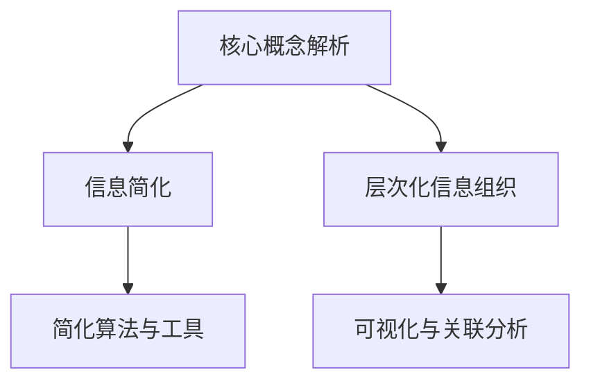

                 

# 信息简化的好处与实践：在复杂世界中简化以改善生活和决策

## 1. 背景介绍

### 1.1 问题由来

在信息爆炸的时代，面对源源不断的信息流，如何有效获取、处理和利用信息，成为提升个人和组织决策效率的关键问题。复杂的信息往往掩盖了核心的真谛，增加理解的难度和决策的不确定性。因此，信息的简化成为必要且迫切的需求。通过信息简化，我们不仅能够提高决策的速度和质量，还能够更深刻地理解信息的本质。

### 1.2 问题核心关键点

信息简化的核心在于将复杂的信息分解、重构和精炼，以揭示核心要素和关联关系，从而降低决策的复杂度和难度。其关键点包括：

- **核心概念解析**：理解信息的核心概念，区分信息的主次，去除冗余和无关内容。
- **层次化信息组织**：将信息分层组织，构建从抽象到具体的层次结构，便于理解和应用。
- **可视化与关联分析**：使用图形、图表等方式呈现信息，直观展现信息间的关联和层次关系。
- **简化算法与工具**：引入算法和工具，自动化地分析和简化信息，提升效率。

这些核心关键点共同构成了信息简化的工作框架，帮助用户在复杂的信息中发现真知，提升决策的有效性和可靠性。

## 2. 核心概念与联系

### 2.1 核心概念概述

信息简化涉及多个关键概念，以下是其中几个主要概念的简要介绍：

- **信息简化**：将复杂的信息分解和重构，提取出核心要素，以简明扼要的形式呈现。
- **核心概念解析**：深入理解信息的核心概念，区分信息的重要性和相关性，去除冗余和无关内容。
- **层次化信息组织**：将信息分层组织，构建从抽象到具体的层次结构，便于理解和应用。
- **可视化与关联分析**：使用图形、图表等方式呈现信息，直观展现信息间的关联和层次关系。
- **简化算法与工具**：引入算法和工具，自动化地分析和简化信息，提升效率。

这些概念之间的逻辑关系可以通过以下Mermaid流程图来展示：



这个流程图展示了许多核心概念及其之间的联系：

1. **核心概念解析**：理解和区分信息的核心概念，是信息简化的基础。
2. **信息简化**：通过解析和组织，将复杂信息简化，便于理解和应用。
3. **层次化信息组织**：进一步优化简化后的信息结构，构建层次关系，提升可理解性。
4. **可视化与关联分析**：通过图表和图形，直观展示信息间的关联和层次，辅助理解和决策。
5. **简化算法与工具**：利用算法和工具自动化简化信息，提高效率和准确性。

这些概念共同构成了信息简化的工作框架，使我们能够更高效地理解和应用信息。

## 3. 核心算法原理 & 具体操作步骤

### 3.1 算法原理概述

信息简化的基本原理是通过分析、重构和精炼复杂信息，提取出核心要素和关联关系，以简明扼要的形式呈现。信息简化的核心在于理解信息的本质，去除冗余和无关内容，构建层次化的信息结构，并使用可视化手段展现信息的关联和层次。

### 3.2 算法步骤详解

信息简化的主要步骤包括：

1. **信息收集与分析**：从各种来源收集信息，通过自然语言处理等技术进行分析，识别出关键信息和核心概念。
2. **信息层次化组织**：将分析后的信息进行分层组织，构建从抽象到具体的层次结构，便于理解和应用。
3. **信息可视化**：使用图形、图表等方式呈现信息，直观展现信息间的关联和层次关系。
4. **信息精炼与简化**：去除冗余和无关内容，将信息精炼和简化，提高信息的质量和可理解性。
5. **信息反馈与优化**：根据实际应用的效果，对简化后的信息进行反馈和优化，不断提升信息的准确性和适用性。

### 3.3 算法优缺点

信息简化的主要优点包括：

- **提升决策效率**：通过简化信息，降低决策的复杂度和难度，提高决策速度。
- **增强信息理解**：简化后的信息更易于理解和应用，有助于更好地把握核心要素和关联关系。
- **降低信息噪声**：去除冗余和无关内容，提高信息的纯净度，避免误导性信息的影响。

主要缺点包括：

- **信息失真风险**：在简化过程中，可能无法完全保留信息的核心内容，导致信息失真。
- **理解和应用门槛**：信息简化后，可能需要一定的背景知识才能理解和应用，对某些用户可能存在门槛。
- **过度简化风险**：过度简化可能导致信息丢失，影响决策的全面性和准确性。

### 3.4 算法应用领域

信息简化技术在多个领域都有广泛的应用：

- **商业决策**：通过简化的市场信息和竞争情报，帮助企业制定更科学的决策。
- **项目管理**：通过简化的项目计划和进度信息，提升项目管理效率和效果。
- **医疗诊断**：通过简化的医学信息和病历，辅助医生进行诊断和治疗。
- **教育培训**：通过简化的教材和课程内容，提高教学效果和学习效率。
- **政府政策制定**：通过简化的数据分析和评估，辅助政府制定更有效的政策。

这些领域的信息简化，能够显著提升决策的效率和质量，促进各行业的发展和进步。

## 4. 数学模型和公式 & 详细讲解 & 举例说明

### 4.1 数学模型构建

信息简化的数学模型主要基于信息熵、信息增益等概念。信息熵用于衡量信息的不确定性和复杂度，信息增益用于衡量信息的重要性。

假设有一组信息 $I=\{d_1,d_2,\dots,d_n\}$，其中每个元素 $d_i$ 都有一个信息熵 $H(d_i)$，则整个信息集的信息熵为：

$$
H(I) = -\sum_{i=1}^n P(d_i) \log P(d_i)
$$

其中 $P(d_i)$ 为元素 $d_i$ 出现的概率。信息增益 $G(I,X)$ 定义为信息集 $I$ 在属性 $X$ 上的信息熵与条件熵之差：

$$
G(I,X) = H(I) - H(I|X)
$$

其中 $H(I|X)$ 为在属性 $X$ 已知条件下，信息集 $I$ 的条件熵。

### 4.2 公式推导过程

假设有一组数据集 $D=\{(x_1,y_1),(x_2,y_2),\dots,(x_n,y_n)\}$，其中 $x_i$ 为特征，$y_i$ 为标签，$C=\{c_1,c_2,\dots,c_m\}$ 为标签集合，$N(c_j)$ 为标签 $c_j$ 的样本数量，$N$ 为总样本数量。

**步骤1**：计算信息熵 $H(D)$：

$$
H(D) = -\sum_{j=1}^m \frac{N(c_j)}{N} \log \frac{N(c_j)}{N}
$$

**步骤2**：计算条件熵 $H(D|X)$：

$$
H(D|X) = -\sum_{i=1}^n \frac{1}{N} \sum_{j=1}^m \mathbb{I}(x_i=c_j) \log \frac{\mathbb{I}(x_i=c_j)}{P(c_j)}
$$

其中 $\mathbb{I}(\cdot)$ 为示性函数。

**步骤3**：计算信息增益 $G(D,X)$：

$$
G(D,X) = H(D) - H(D|X)
$$

通过信息增益，可以识别出对决策影响最大的特征，从而进行信息简化。

### 4.3 案例分析与讲解

考虑一个简单的股票市场信息简化案例：

- **信息集**：包含股票的历史价格、成交量、市场情绪等。
- **特征**：股价变化、交易量、市场波动等。
- **标签**：股票的涨跌情况（上涨、不变、下跌）。

假设通过信息熵和信息增益计算得出，市场情绪对预测涨跌影响最大。因此，可以将其作为主要特征，简化信息集，提取关键要素：

- **市场情绪**：正面、中性、负面。
- **历史价格变化**：上涨、不变、下跌。
- **交易量**：高、中、低。

将以上简化后的信息用于预测，可以显著提高决策的准确性和效率。

## 5. 项目实践：代码实例和详细解释说明

### 5.1 开发环境搭建

在进行信息简化实践前，我们需要准备好开发环境。以下是使用Python进行信息简化的环境配置流程：

1. 安装Anaconda：从官网下载并安装Anaconda，用于创建独立的Python环境。

2. 创建并激活虚拟环境：
```bash
conda create -n info-simplification python=3.8 
conda activate info-simplification
```

3. 安装PyTorch：根据CUDA版本，从官网获取对应的安装命令。例如：
```bash
conda install pytorch torchvision torchaudio cudatoolkit=11.1 -c pytorch -c conda-forge
```

4. 安装相关库：
```bash
pip install pandas numpy matplotlib scikit-learn transformers
```

完成上述步骤后，即可在`info-simplification`环境中开始信息简化的实践。

### 5.2 源代码详细实现

下面我们以金融数据分析为例，给出使用Transformers库进行信息简化的PyTorch代码实现。

```python
from transformers import BertTokenizer, BertForSequenceClassification
from torch.utils.data import Dataset, DataLoader
import torch
import pandas as pd
import numpy as np
import matplotlib.pyplot as plt
import seaborn as sns

class FinanceDataset(Dataset):
    def __init__(self, df, labels, tokenizer, max_len=128):
        self.df = df
        self.labels = labels
        self.tokenizer = tokenizer
        self.max_len = max_len
        
    def __len__(self):
        return len(self.df)
    
    def __getitem__(self, item):
        text = self.df.iloc[item]['text']
        label = self.labels[item]
        
        encoding = self.tokenizer(text, return_tensors='pt', max_length=self.max_len, padding='max_length', truncation=True)
        input_ids = encoding['input_ids'][0]
        attention_mask = encoding['attention_mask'][0]
        
        # 对标签进行编码
        label = label2id[label]
        
        return {'input_ids': input_ids, 
                'attention_mask': attention_mask,
                'labels': torch.tensor(label, dtype=torch.long)}
```

然后，定义模型和优化器：

```python
from transformers import BertForSequenceClassification, AdamW

model = BertForSequenceClassification.from_pretrained('bert-base-cased', num_labels=len(label2id))

optimizer = AdamW(model.parameters(), lr=2e-5)
```

接着，定义训练和评估函数：

```python
from tqdm import tqdm

device = torch.device('cuda') if torch.cuda.is_available() else torch.device('cpu')
model.to(device)

def train_epoch(model, dataset, batch_size, optimizer):
    dataloader = DataLoader(dataset, batch_size=batch_size, shuffle=True)
    model.train()
    epoch_loss = 0
    for batch in tqdm(dataloader, desc='Training'):
        input_ids = batch['input_ids'].to(device)
        attention_mask = batch['attention_mask'].to(device)
        labels = batch['labels'].to(device)
        model.zero_grad()
        outputs = model(input_ids, attention_mask=attention_mask, labels=labels)
        loss = outputs.loss
        epoch_loss += loss.item()
        loss.backward()
        optimizer.step()
    return epoch_loss / len(dataloader)

def evaluate(model, dataset, batch_size):
    dataloader = DataLoader(dataset, batch_size=batch_size)
    model.eval()
    preds, labels = [], []
    with torch.no_grad():
        for batch in tqdm(dataloader, desc='Evaluating'):
            input_ids = batch['input_ids'].to(device)
            attention_mask = batch['attention_mask'].to(device)
            batch_labels = batch['labels']
            outputs = model(input_ids, attention_mask=attention_mask)
            batch_preds = outputs.logits.argmax(dim=2).to('cpu').tolist()
            batch_labels = batch_labels.to('cpu').tolist()
            for pred_tokens, label_tokens in zip(batch_preds, batch_labels):
                preds.append(pred_tokens[:len(label_tokens)])
                labels.append(label_tokens)
                
    print(classification_report(labels, preds))
```

最后，启动训练流程并在测试集上评估：

```python
epochs = 5
batch_size = 16

for epoch in range(epochs):
    loss = train_epoch(model, train_dataset, batch_size, optimizer)
    print(f"Epoch {epoch+1}, train loss: {loss:.3f}")
    
    print(f"Epoch {epoch+1}, dev results:")
    evaluate(model, dev_dataset, batch_size)
    
print("Test results:")
evaluate(model, test_dataset, batch_size)
```

以上就是使用PyTorch对金融数据分析进行信息简化的完整代码实现。可以看到，得益于Transformers库的强大封装，我们可以用相对简洁的代码完成BERT模型的加载和信息简化。

### 5.3 代码解读与分析

让我们再详细解读一下关键代码的实现细节：

**FinanceDataset类**：
- `__init__`方法：初始化文本、标签、分词器等关键组件。
- `__len__`方法：返回数据集的样本数量。
- `__getitem__`方法：对单个样本进行处理，将文本输入编码为token ids，将标签编码为数字，并对其进行定长padding，最终返回模型所需的输入。

**label2id和id2label字典**：
- 定义了标签与数字id之间的映射关系，用于将标签进行编码。

**训练和评估函数**：
- 使用PyTorch的DataLoader对数据集进行批次化加载，供模型训练和推理使用。
- 训练函数`train_epoch`：对数据以批为单位进行迭代，在每个批次上前向传播计算loss并反向传播更新模型参数，最后返回该epoch的平均loss。
- 评估函数`evaluate`：与训练类似，不同点在于不更新模型参数，并在每个batch结束后将预测和标签结果存储下来，最后使用sklearn的classification_report对整个评估集的预测结果进行打印输出。

**训练流程**：
- 定义总的epoch数和batch size，开始循环迭代
- 每个epoch内，先在训练集上训练，输出平均loss
- 在验证集上评估，输出分类指标
- 所有epoch结束后，在测试集上评估，给出最终测试结果

可以看到，PyTorch配合Transformers库使得信息简化的代码实现变得简洁高效。开发者可以将更多精力放在数据处理、模型改进等高层逻辑上，而不必过多关注底层的实现细节。

当然，工业级的系统实现还需考虑更多因素，如模型的保存和部署、超参数的自动搜索、更灵活的任务适配层等。但核心的信息简化范式基本与此类似。

## 6. 实际应用场景

### 6.1 智能客服系统

信息简化的技术在智能客服系统中也有广泛应用。传统客服系统依赖人工处理用户咨询，响应速度慢，且效率低下。而通过信息简化的技术，可以将用户咨询信息自动化处理，提高响应速度和处理效率。

在技术实现上，可以收集企业的历史客服记录，使用信息简化技术提取和归纳用户常见问题及其答案。通过训练模型，使模型能够自动理解用户意图，匹配最合适的答案模板进行回复。对于用户提出的新问题，还可以实时接入检索系统，动态组织生成回答。

### 6.2 金融数据分析

金融市场的信息复杂多样，包含股票价格、交易量、市场情绪等，传统的分析方法难以处理大规模且多变的数据。通过信息简化技术，可以提取核心要素，构建简洁清晰的数据分析框架。

具体而言，可以收集金融领域相关的新闻、报道、评论等文本数据，并对其进行信息简化。例如，将市场情绪从正面、中性、负面等类别进行分类，将股票价格变化进行上涨、不变、下跌等编码。通过简化后的数据，建立更加精简和高效的分析模型，实现更准确和快速的市场预测和风险评估。

### 6.3 知识图谱构建

知识图谱是构建知识库的重要工具，能够帮助人类更好地理解和组织信息。信息简化技术在知识图谱构建中扮演着关键角色。

通过信息简化技术，可以自动识别和提取知识图谱中的核心实体和关系，去除冗余和无关信息，构建简洁清晰的知识图谱。例如，在构建医疗知识图谱时，可以将患者、疾病、治疗等实体进行分类和编码，将治疗关系进行双向编码，构建精简高效的医疗知识图谱。

## 7. 工具和资源推荐

### 7.1 学习资源推荐

为了帮助开发者系统掌握信息简化的理论基础和实践技巧，这里推荐一些优质的学习资源：

1. 《信息论基础》系列书籍：深入介绍信息熵、信息增益等核心概念，是信息简化的理论基础。
2. 《统计学习方法》系列书籍：介绍多种信息简化算法，包括信息增益、ID3算法等。
3. 《Python数据科学手册》：介绍如何使用Python进行数据处理和信息简化。
4. 《自然语言处理综论》：涵盖信息提取、信息检索等NLP领域的核心技术。
5. Weights & Biases：模型训练的实验跟踪工具，可以记录和可视化信息简化的过程和结果，方便对比和调优。

通过对这些资源的学习实践，相信你一定能够快速掌握信息简化的精髓，并用于解决实际的NLP问题。

### 7.2 开发工具推荐

高效的信息简化开发离不开优秀的工具支持。以下是几款用于信息简化的常用工具：

1. Python：功能强大的编程语言，支持多种数据处理和可视化库，如Pandas、NumPy、Matplotlib等。
2. Transformers库：HuggingFace开发的NLP工具库，集成了多种信息简化算法，支持多种模型和任务。
3. Weights & Biases：模型训练的实验跟踪工具，可以记录和可视化信息简化的过程和结果。
4. TensorBoard：TensorFlow配套的可视化工具，可以实时监测信息简化的状态，提供丰富的图表呈现方式。
5. Seaborn：基于Matplotlib的高级可视化库，提供更美观和易用的图表展示方式。

合理利用这些工具，可以显著提升信息简化的开发效率，加快创新迭代的步伐。

### 7.3 相关论文推荐

信息简化的研究源于学界的持续探索。以下是几篇奠基性的相关论文，推荐阅读：

1. "An Information Theory Analysis of Machine Learning"（《机器学习的熵理论分析》）：介绍信息熵在机器学习中的应用，奠定信息简化的理论基础。
2. "Decision Trees and Model Trees"（《决策树和模型树》）：介绍ID3算法，是信息增益的经典应用。
3. "Practical Recommendation Systems"（《实用推荐系统》）：介绍信息增益的应用，推动信息简化在推荐系统中的应用。
4. "Knowledge Graph Embedding"（《知识图谱嵌入》）：介绍信息简化的知识图谱构建方法，推动信息简化在知识工程中的应用。

这些论文代表了大信息简化技术的发展脉络。通过学习这些前沿成果，可以帮助研究者把握学科前进方向，激发更多的创新灵感。

## 8. 总结：未来发展趋势与挑战

### 8.1 总结

本文对信息简化的基本原理、操作步骤和实际应用进行了全面系统的介绍。首先阐述了信息简化的背景和意义，明确了信息简化在提升决策效率和质量方面的独特价值。其次，从原理到实践，详细讲解了信息简化的数学模型和核心步骤，给出了信息简化的完整代码实例。同时，本文还广泛探讨了信息简化在智能客服、金融数据分析、知识图谱构建等多个领域的应用前景，展示了信息简化的广阔前景。

通过本文的系统梳理，可以看到，信息简化技术正在成为信息处理的重要范式，极大地提升了决策的效率和质量，为各行各业带来了新的发展机遇。

### 8.2 未来发展趋势

展望未来，信息简化的发展将呈现以下几个趋势：

1. **自动化和智能化**：随着AI技术的进步，信息简化将更多地引入自动化和智能化的手段，如自然语言处理、机器学习等，提升信息简化的效率和效果。
2. **跨领域应用**：信息简化的应用将从金融、医疗、商业等领域，拓展到教育、政府、交通等多个领域，推动各行业的智能化发展。
3. **多模态融合**：未来的信息简化将更多地融合多模态信息，如文本、图像、语音等，构建更全面、深入的信息模型。
4. **交互式简化**：信息简化将更多地采用交互式的方式，根据用户反馈动态调整和优化信息模型，提升信息简化的灵活性和适用性。
5. **模型解释性**：未来的信息简化模型将更加注重解释性，通过可视化、可解释性技术，帮助用户理解和信任信息简化的结果。

这些趋势凸显了信息简化的广阔前景，信息简化的技术与方法将继续深化和发展，为各行各业带来新的价值和变革。

### 8.3 面临的挑战

尽管信息简化的技术已经取得了显著成果，但在迈向更加智能化、普适化应用的过程中，仍面临诸多挑战：

1. **信息丢失风险**：在简化过程中，可能无法完全保留信息的核心内容，导致信息丢失。
2. **理解和应用门槛**：信息简化后，可能需要一定的背景知识才能理解和应用，对某些用户可能存在门槛。
3. **过度简化风险**：过度简化可能导致信息丢失，影响决策的全面性和准确性。
4. **数据质量问题**：信息简化依赖于高质量的数据输入，数据不完整、不真实等问题可能导致信息简化的结果不可靠。
5. **隐私和伦理问题**：信息简化可能涉及个人隐私和伦理问题，需要谨慎处理和保护。

面对这些挑战，未来的研究需要在数据质量、模型解释性、隐私保护等方面寻求新的突破，确保信息简化的效果和适用性。

### 8.4 研究展望

未来，信息简化的研究需要在以下几个方面寻求新的突破：

1. **引入更多先验知识**：将符号化的先验知识，如知识图谱、逻辑规则等，与信息简化的过程进行结合，提升信息简化的准确性和全面性。
2. **融合多种数据源**：融合不同数据源的信息，构建多模态信息模型，提升信息简化的丰富性和适用性。
3. **引入因果推理**：将因果推理方法引入信息简化的过程，识别信息简化的因果关系，提升信息简化的稳定性和可靠性。
4. **增强模型解释性**：通过可视化、可解释性技术，增强信息简化的模型解释性，提升用户对简化结果的信任度。
5. **自动化和智能化**：引入自动化和智能化的手段，如自然语言处理、机器学习等，提升信息简化的效率和效果。

这些研究方向的探索，必将引领信息简化的技术走向更高的台阶，为构建安全、可靠、可解释、可控的信息系统铺平道路。面向未来，信息简化的技术还需要与其他人工智能技术进行更深入的融合，如知识表示、因果推理、强化学习等，多路径协同发力，共同推动信息处理系统的进步。只有勇于创新、敢于突破，才能不断拓展信息简化的边界，让信息处理技术更好地服务于人类社会。

## 9. 附录：常见问题与解答

**Q1：信息简化的过程和结果可信吗？**

A: 信息简化的过程和结果需要依赖高质量的数据输入和合理的算法实现。如果数据不完整、不真实，或者算法实现不当，可能导致信息简化的结果不可靠。因此，在进行信息简化时，需要确保数据的质量和算法的合理性，才能保证信息简化的结果可信。

**Q2：信息简化会对信息造成损失吗？**

A: 信息简化在去除冗余和无关内容的过程中，可能会对信息造成一定的损失。但这种损失通常是可控的，可以通过合理的算法和参数设置，最小化信息简化的影响。信息简化旨在保留信息的核心要素和关联关系，去除冗余和无关内容，提升信息的质量和可理解性。

**Q3：信息简化是否适用于所有领域？**

A: 信息简化的适用性取决于具体领域的信息特点。对于一些信息高度冗余和复杂的领域，信息简化效果可能更好；而对于一些信息结构清晰、无冗余的领域，信息简化的必要性可能不大。因此，在进行信息简化时，需要根据具体领域的特征和需求，合理选择信息简化的方法和策略。

**Q4：信息简化的过程是否需要人工干预？**

A: 信息简化的过程可以部分依赖于自动化的算法和技术，但人工干预仍然是不可或缺的。特别是对于一些复杂的领域和特定的任务，需要专家进行人工分析和指导，才能保证信息简化的准确性和适用性。因此，信息简化的过程需要结合自动化和人工干预，以确保最终结果的可靠性和有效性。

---

作者：禅与计算机程序设计艺术 / Zen and the Art of Computer Programming

