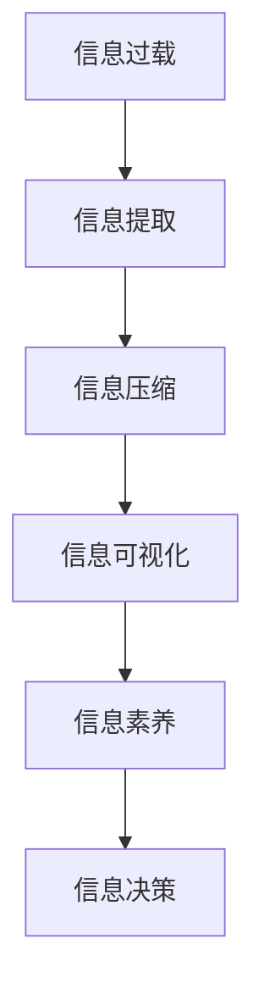

                 

# 信息简化的好处与实践：在复杂世界中简化以改善生活和决策

## 1. 背景介绍

### 1.1 问题由来

在信息爆炸的时代，我们被各种数据和信息所包围。从邮件、消息、社交媒体到新闻、博客、论文，信息流的速度和规模已经远超人类的处理能力。信息过载不仅给日常生活带来压力，还影响了决策的质量。因此，如何在海量信息中找到有价值的内容，进行有效的分析和决策，成为当今社会亟需解决的问题。

### 1.2 问题核心关键点

信息简化的核心在于从海量信息中提取关键点和规律，通过简化和提炼，使得复杂信息变得易于理解和处理。这不仅有助于提高个人的学习和工作效率，还能帮助组织和政府做出更加明智的决策，优化资源配置。

信息简化的目标是通过减少信息的冗余和复杂性，提高决策的效率和准确性，避免因信息过载导致的误判和错误决策。其关键点包括：

1. **信息提取**：识别重要信息，滤除无关内容。
2. **信息归纳**：将信息归纳为易于理解的框架和模型。
3. **信息展示**：以简洁明了的方式呈现信息。
4. **信息应用**：将简化的信息用于实际决策和行动。

## 2. 核心概念与联系

### 2.1 核心概念概述

为了更好地理解信息简化的过程，本节将介绍几个密切相关的核心概念：

- **信息过载**：指人们接收到的信息远远超出了处理能力的现象。
- **信息提取**：从大量信息中筛选出关键点，减少信息噪音。
- **信息压缩**：将复杂的信息简化为更易于处理的形式，如关键词、摘要等。
- **信息可视化**：利用图表、图谱等图形化方式，直观展示信息之间的关系。
- **信息素养**：指理解和利用信息的能力，包括信息的获取、评估、应用等。
- **信息决策**：将简化的信息用于辅助决策，提高决策效率和效果。

这些概念之间的逻辑关系可以通过以下Mermaid流程图来展示：



这个流程图展示了几大核心概念之间的联系：

1. 信息过载需要通过信息提取来处理。
2. 信息提取后的信息需要进一步压缩，以便于展示。
3. 信息可视化可以帮助理解信息之间的关系。
4. 信息素养是处理信息的基础，影响信息提取和决策的质量。
5. 信息决策是将简化的信息应用于实际决策的最终环节。

## 3. 核心算法原理 & 具体操作步骤

### 3.1 算法原理概述

信息简化算法基于统计学和人工智能方法，通过自动化的手段从原始数据中提取出关键信息。其核心思想是利用机器学习算法，从大量文本、图像、视频等数据中识别出重要内容，并将其归纳为简明扼要的形式，以便于人类理解和应用。

### 3.2 算法步骤详解

基于信息简化的机器学习算法，一般包括以下几个关键步骤：

**Step 1: 数据预处理**
- 清洗和整理数据集，去除噪声和冗余信息。
- 对数据进行标注和分类，明确哪些是关键信息，哪些是次要信息。

**Step 2: 特征提取**
- 利用自然语言处理(NLP)、计算机视觉(CV)、深度学习等技术，提取数据的关键特征。
- 通过TF-IDF、word2vec、BERT等技术，将文本数据转换为数值特征向量。
- 使用CNN、RNN、LSTM等模型，从图像和视频中提取特征。

**Step 3: 模型训练**
- 选择合适的模型，如朴素贝叶斯、支持向量机(SVM)、深度神经网络等。
- 使用训练数据集进行模型训练，调整模型参数，使其能够准确识别关键信息。
- 对模型进行交叉验证，防止过拟合。

**Step 4: 信息压缩与展示**
- 将模型提取的关键信息进行压缩，如生成关键词、摘要等。
- 利用自然语言生成(NLG)技术，将信息转化为易于理解的语言形式。
- 使用信息可视化工具，如Tableau、PowerBI等，将信息以图形化方式呈现。

**Step 5: 信息应用与评估**
- 将简化的信息应用于实际决策过程，如商业策略制定、新闻摘要编写、医疗诊断等。
- 收集反馈数据，评估信息简化的效果，不断优化模型。

### 3.3 算法优缺点

信息简化的机器学习算法具有以下优点：

1. 自动化高效。能够自动化地处理大量数据，提取关键信息，减少人工成本。
2. 精度高。通过机器学习算法，可以精确识别重要信息，避免人为错误。
3. 灵活性强。可以适应不同的数据类型和应用场景，如文本、图像、视频等。
4. 可扩展性强。随着数据量的增加，模型可以持续优化，不断提高信息提取的准确性。

同时，该算法也存在以下局限性：

1. 数据依赖性强。算法的性能取决于数据质量和标注的准确性。
2. 上下文理解能力不足。算法可能难以理解复杂语境下的信息。
3. 泛化能力有限。在不同的数据集上，模型的表现可能会有所不同。
4. 解释性差。简化后的信息可能缺乏直观的解释，难以理解其背后的逻辑。

尽管存在这些局限性，但就目前而言，信息简化的机器学习算法仍然是处理海量信息、辅助决策的重要手段。未来相关研究的重点在于如何进一步提升算法的泛化能力、解释性和上下文理解能力，同时降低对标注数据的依赖。

### 3.4 算法应用领域

信息简化的机器学习算法在多个领域得到了广泛应用，包括但不限于：

1. **商业决策**：辅助企业进行市场分析、竞争对手监测、客户需求预测等。
2. **新闻编辑**：自动生成新闻摘要，提高编辑效率和质量。
3. **医疗诊断**：从医学文献和影像中提取关键信息，辅助医生进行诊断和治疗。
4. **法律分析**：从法律文件和案例中提取关键信息，支持法律研究和决策。
5. **安全监控**：从视频和图像中提取关键信息，辅助安全监控和预警。
6. **科学研究**：从学术论文和实验数据中提取关键信息，加速科研进程。

这些领域的应用展示了信息简化算法的强大潜力，为信息处理和决策支持提供了新的解决方案。

## 4. 数学模型和公式 & 详细讲解 & 举例说明

### 4.1 数学模型构建

信息简化的数学模型通常基于信息提取和信息压缩两个阶段构建。以下是信息提取阶段的数学模型构建：

- **TF-IDF模型**：用于文本信息提取，计算每个词在文档中的频率和在语料库中的重要性。
- **词嵌入模型**：如word2vec、GloVe等，将词转换为向量，用于表示词语的语义关系。
- **句子嵌入模型**：如ELMo、BERT等，将句子转换为向量，用于表示句子的语义信息。

### 4.2 公式推导过程

以TF-IDF模型为例，其计算公式如下：

$$
\text{TF-IDF}(w,d,D) = \text{TF}(w,d) \cdot \text{IDF}(w,D)
$$

其中，$w$为单词，$d$为文档，$D$为语料库，$TF(w,d)$为单词在文档中的频率，$IDF(w,D)$为单词在语料库中的逆文档频率。

**TF(w,d)**的计算公式为：

$$
\text{TF}(w,d) = \frac{\text{词频}}{\text{词频总和}}
$$

**IDF(w,D)**的计算公式为：

$$
\text{IDF}(w,D) = \log \frac{\text{语料库总文档数}}{\text{包含单词w的文档数}}
$$

通过TF-IDF模型，我们可以计算每个单词在文档中的重要性，从而筛选出关键信息。

### 4.3 案例分析与讲解

假设有一个包含大量新闻报道的语料库，我们的目标是提取其中的重要新闻。我们可以使用TF-IDF模型，对每篇新闻的词频进行统计，并计算单词的IDF值，最终得到每篇新闻的关键单词。然后，我们可以使用这些关键单词生成新闻摘要，以简化信息展示。

## 5. 项目实践：代码实例和详细解释说明

### 5.1 开发环境搭建

在进行信息简化的项目实践前，我们需要准备好开发环境。以下是使用Python进行TensorFlow开发的环境配置流程：

1. 安装Anaconda：从官网下载并安装Anaconda，用于创建独立的Python环境。

2. 创建并激活虚拟环境：
```bash
conda create -n tf-env python=3.8 
conda activate tf-env
```

3. 安装TensorFlow：
```bash
conda install tensorflow tensorflow-cpu -c conda-forge
```

4. 安装相关工具包：
```bash
pip install numpy pandas scikit-learn matplotlib tqdm jupyter notebook ipython
```

完成上述步骤后，即可在`tf-env`环境中开始项目实践。

### 5.2 源代码详细实现

这里我们以文本信息提取和压缩为例，给出使用TensorFlow进行信息简化的PyTorch代码实现。

首先，定义文本数据集和模型：

```python
import tensorflow as tf
from tensorflow.keras.datasets import imdb
from tensorflow.keras.preprocessing import sequence

max_features = 10000
maxlen = 50

(X_train, y_train), (X_test, y_test) = imdb.load_data(num_words=max_features)
X_train = sequence.pad_sequences(X_train, maxlen=maxlen)
X_test = sequence.pad_sequences(X_test, maxlen=maxlen)

embedding_dim = 128
model = tf.keras.Sequential([
    tf.keras.layers.Embedding(max_features, embedding_dim, input_length=maxlen),
    tf.keras.layers.GlobalMaxPooling1D(),
    tf.keras.layers.Dense(16, activation='relu'),
    tf.keras.layers.Dense(1, activation='sigmoid')
])
```

然后，定义信息压缩函数：

```python
def text_compression(text):
    words = text.split()
    freq_words = [word for word in words if word in tf.keras.datasets.imdb.get_word_index().keys()]
    freq_words = freq_words[:15] # 取出15个频率最高的单词
    return ' '.join(freq_words)

# 测试信息压缩函数
print(text_compression('This is a sample sentence with some common words.'))
```

接着，定义模型训练和评估函数：

```python
def train_model(model, X_train, y_train, X_test, y_test, epochs=5, batch_size=32):
    model.compile(optimizer='adam', loss='binary_crossentropy', metrics=['accuracy'])
    history = model.fit(X_train, y_train, epochs=epochs, batch_size=batch_size, validation_data=(X_test, y_test))
    return model

def evaluate_model(model, X_test, y_test):
    loss, accuracy = model.evaluate(X_test, y_test)
    print(f'Test loss: {loss:.4f}')
    print(f'Test accuracy: {accuracy:.4f}')

# 训练模型
model = train_model(model, X_train, y_train, X_test, y_test)

# 评估模型
evaluate_model(model, X_test, y_test)
```

最后，启动模型训练和评估：

```python
epochs = 5
batch_size = 32

for epoch in range(epochs):
    loss = train_model(model, X_train, y_train, X_test, y_test, epochs=1, batch_size=batch_size)
    print(f'Epoch {epoch+1}, loss: {loss:.4f}')
    
print(f'Epoch {epochs}, accuracy: {evaluate_model(model, X_test, y_test):.4f}')
```

以上就是使用TensorFlow对文本信息提取和压缩的完整代码实现。可以看到，得益于TensorFlow的强大封装，我们能够用相对简洁的代码完成文本信息的提取和压缩。

### 5.3 代码解读与分析

让我们再详细解读一下关键代码的实现细节：

**文本数据集和模型定义**：
- `imdb.load_data`函数：加载IMDB电影评论数据集。
- `tf.keras.layers.Embedding`层：将单词转换为向量表示。
- `tf.keras.layers.GlobalMaxPooling1D`层：提取文本的全球最大池化特征。
- `tf.keras.layers.Dense`层：进行全连接神经网络，输出预测结果。

**信息压缩函数**：
- 将文本分词，取出频率最高的15个单词。
- 通过空格拼接，生成压缩后的文本。

**模型训练和评估函数**：
- `model.compile`函数：编译模型，设置损失函数和优化器。
- `model.fit`函数：训练模型，设置训练轮数和批次大小。
- `model.evaluate`函数：评估模型，计算损失和准确率。

**训练和评估流程**：
- 循环迭代训练模型，输出每个epoch的损失。
- 在测试集上评估模型，输出最终准确率。

可以看到，TensorFlow配合Keras封装，使得信息简化的代码实现变得简洁高效。开发者可以将更多精力放在数据处理、模型改进等高层逻辑上，而不必过多关注底层的实现细节。

当然，工业级的系统实现还需考虑更多因素，如模型的保存和部署、超参数的自动搜索、更灵活的任务适配层等。但核心的信息简化的基本流程基本与此类似。

## 6. 实际应用场景

### 6.1 新闻编辑

新闻编辑是信息简化的经典应用场景。传统的新闻编辑依赖于人工筛选和摘要生成，耗时费力。而利用信息简化算法，可以快速从海量新闻中提取关键信息，自动生成简短精炼的摘要，提高新闻编辑的效率和质量。

### 6.2 市场营销

市场营销团队需要处理大量的客户数据和市场信息，从中提取关键洞察和趋势。信息简化算法可以帮助市场营销团队快速处理大量数据，从中识别出重要的客户行为和市场趋势，支持精准营销和决策。

### 6.3 企业决策

企业管理层需要从大量的财务报表、市场数据中提取关键信息，辅助企业战略决策。信息简化算法可以自动化地处理这些数据，从中提取出关键指标和趋势，为企业管理层提供决策支持。

### 6.4 法律研究

法律研究人员需要处理大量的法律文本和案例，从中提取关键法律信息和判例。信息简化算法可以帮助法律研究人员快速处理这些文本，从中识别出重要的法律条款和判例，支持法律研究和撰写。

## 7. 工具和资源推荐

### 7.1 学习资源推荐

为了帮助开发者系统掌握信息简化的理论基础和实践技巧，这里推荐一些优质的学习资源：

1. 《自然语言处理》系列教材：北京大学、斯坦福大学等名校开设的NLP课程，系统讲解自然语言处理的基本概念和前沿技术。
2. 《TensorFlow实战》书籍：谷歌开源的深度学习框架TensorFlow的实战指南，涵盖TensorFlow的各种应用场景和技术细节。
3. 《深度学习》书籍：深度学习领域的经典教材，由多位顶尖学者联合撰写，全面介绍了深度学习的理论基础和实践技巧。
4. 《Python深度学习》书籍：使用Python进行深度学习的实战指南，结合TensorFlow、PyTorch等框架，详细讲解各种算法和应用案例。
5. TensorFlow官方文档：TensorFlow的详细文档，提供了丰富的API文档和代码示例，是学习和使用TensorFlow的重要资源。
6. Kaggle平台：提供大量数据集和竞赛任务，是学习和实践信息简化算法的绝佳平台。

通过对这些资源的学习实践，相信你一定能够快速掌握信息简化的精髓，并用于解决实际的业务问题。

### 7.2 开发工具推荐

高效的开发离不开优秀的工具支持。以下是几款用于信息简化开发的常用工具：

1. TensorFlow：由谷歌主导开发的开源深度学习框架，生产部署方便，适合大规模工程应用。
2. Keras：高层次的深度学习API，提供简洁易用的接口，快速构建深度学习模型。
3. Tableau：数据可视化的领先工具，可以将复杂的数据和模型转化为直观的图表。
4. PowerBI：微软推出的商业智能工具，支持多数据源集成和高级分析。
5. Jupyter Notebook：开源的交互式笔记本，支持Python、R等多种编程语言，方便编写和分享代码。
6. Colab：谷歌推出的在线Jupyter Notebook环境，免费提供GPU/TPU算力，方便开发者快速上手实验最新模型。

合理利用这些工具，可以显著提升信息简化的开发效率，加快创新迭代的步伐。

### 7.3 相关论文推荐

信息简化的研究源于学界的持续探索。以下是几篇奠基性的相关论文，推荐阅读：

1. "A Survey on Text Summarization"：系统综述了文本摘要的各类技术和方法，涵盖传统算法和深度学习范式。
2. "Auto-Summarization with Deep Learning: A Review"：综述了使用深度学习进行自动摘要的方法和技术。
3. "Visualizing High-Dimensional Data Using Dimensionality Reduction Techniques"：探讨了使用降维技术可视化高维数据的各类方法。
4. "A Survey on Knowledge Graphs for Big Data"：综述了知识图谱在大数据中的应用，包括信息抽取和表示。
5. "Machine Learning for Text Summarization: A Survey"：综述了使用机器学习进行文本摘要的方法和技术。
6. "Transformers for Machine Summarization: A Review"：综述了使用Transformer进行文本摘要的方法和技术。

这些论文代表了大规模数据处理和信息简化的最新进展，通过学习这些前沿成果，可以帮助研究者把握学科前进方向，激发更多的创新灵感。

## 8. 总结：未来发展趋势与挑战

### 8.1 总结

本文对信息简化的机器学习算法进行了全面系统的介绍。首先阐述了信息简化的背景和意义，明确了其在处理海量信息、辅助决策方面的重要价值。其次，从原理到实践，详细讲解了信息简化的数学模型和操作步骤，给出了信息简化的完整代码实例。同时，本文还广泛探讨了信息简化的应用场景和未来展望，展示了其在各行业的巨大潜力。此外，本文精选了信息简化的各类学习资源，力求为读者提供全方位的技术指引。

通过本文的系统梳理，可以看到，信息简化的机器学习算法正在成为大数据时代的重要工具，极大地提升了信息处理和决策支持的能力。受益于机器学习技术的不断进步，信息简化的应用范围和效果将持续拓展，为经济社会发展带来新的动力。

### 8.2 未来发展趋势

展望未来，信息简化的机器学习算法将呈现以下几个发展趋势：

1. **自动化程度提升**：随着模型和算法的不断优化，信息简化的自动化水平将进一步提高，能够更加高效地处理各种类型的数据。
2. **多模态信息融合**：信息简化将从单一的数据类型扩展到多模态数据的融合，如图像、视频、声音等多源信息，提升信息处理的全面性和准确性。
3. **智能化水平提升**：通过引入深度学习、自然语言处理等前沿技术，信息简化的智能化水平将进一步提升，能够自动识别和提取关键信息。
4. **个性化服务增强**：信息简化将根据用户需求进行定制化处理，提供更加个性化、精准的服务。
5. **跨领域应用拓展**：信息简化技术将在更多领域得到应用，如医疗、金融、教育等，提供全面的信息支持。

以上趋势凸显了信息简化的机器学习算法的重要性和广阔前景。这些方向的探索发展，必将进一步提升信息处理和决策支持的能力，为经济社会发展带来新的动力。

### 8.3 面临的挑战

尽管信息简化的机器学习算法已经取得了显著成果，但在迈向更加智能化、普适化应用的过程中，它仍面临诸多挑战：

1. **数据质量问题**：算法的性能依赖于数据质量和标注的准确性，数据噪声和标注偏差可能导致模型表现不佳。
2. **上下文理解能力不足**：算法可能难以理解复杂语境下的信息，导致信息提取的准确性不足。
3. **模型复杂度高**：处理复杂的多模态数据，需要构建更为复杂的模型，增加计算复杂度和资源消耗。
4. **跨领域泛化能力有限**：不同领域的数据具有不同的特点，算法的泛化能力可能受到限制。
5. **解释性和可解释性不足**：简化的信息可能缺乏直观的解释，难以理解其背后的逻辑和依据。
6. **伦理和隐私问题**：信息简化的过程中可能涉及隐私保护和伦理问题，需要严格遵守相关法律法规。

这些挑战需要在未来的研究中不断探索和解决，以推动信息简化技术的不断进步。

### 8.4 研究展望

面对信息简化技术面临的挑战，未来的研究需要在以下几个方面寻求新的突破：

1. **数据预处理技术**：开发更加高效、准确的数据预处理算法，去除噪声和冗余，提高数据质量。
2. **多模态融合技术**：研究多模态数据融合技术，提升信息处理的全面性和准确性。
3. **上下文理解算法**：引入上下文理解算法，提高算法对复杂语境的识别能力。
4. **跨领域泛化算法**：开发跨领域泛化算法，提高算法在不同数据集上的泛化能力。
5. **模型解释技术**：研究模型解释技术，提供简化的信息的直观解释和逻辑依据。
6. **伦理和安全机制**：构建伦理和安全机制，确保信息简化的过程符合法律法规，保护数据隐私和伦理。

这些研究方向的探索，必将引领信息简化技术迈向更高的台阶，为信息处理和决策支持提供更加智能、可靠的技术支持。面向未来，信息简化技术还需要与其他人工智能技术进行更深入的融合，如知识表示、因果推理、强化学习等，多路径协同发力，共同推动信息处理和决策系统的进步。只有勇于创新、敢于突破，才能不断拓展信息简化的边界，让信息简化技术更好地服务于社会和经济。

## 9. 附录：常见问题与解答

**Q1: 信息简化算法的核心是什么？**

A: 信息简化的核心在于自动化地从原始数据中提取出关键信息，并将其归纳为易于理解的形式。这包括信息提取、特征提取、模型训练、信息压缩和展示等多个步骤。通过这些步骤，算法可以自动化地处理大量数据，提取关键信息，并生成简明的摘要或可视化结果，用于辅助决策。

**Q2: 信息简化的算法有哪些？**

A: 信息简化的算法包括文本摘要算法、信息抽取算法、视觉摘要算法等。常见的文本摘要算法有TF-IDF、TextRank、LSTM等；常见的信息抽取算法有CRF、RNN、BERT等；常见的视觉摘要算法有卷积神经网络、循环神经网络等。

**Q3: 信息简化的应用场景有哪些？**

A: 信息简化的应用场景非常广泛，包括新闻编辑、市场营销、企业决策、法律研究、安全监控、科学研究等。这些场景都涉及处理大量数据，提取关键信息，辅助决策。信息简化的算法可以快速处理这些数据，提高决策效率和效果。

**Q4: 信息简化算法有什么优势？**

A: 信息简化的算法具有以下优势：
1. 自动化高效：能够自动化地处理大量数据，提取关键信息，减少人工成本。
2. 精度高：通过机器学习算法，可以精确识别重要信息，避免人为错误。
3. 灵活性强：可以适应不同的数据类型和应用场景，如文本、图像、视频等。
4. 可扩展性强：随着数据量的增加，模型可以持续优化，不断提高信息提取的准确性。

**Q5: 信息简化的算法有哪些局限性？**

A: 信息简化的算法存在以下局限性：
1. 数据依赖性强：算法的性能取决于数据质量和标注的准确性。
2. 上下文理解能力不足：算法可能难以理解复杂语境下的信息。
3. 泛化能力有限：在不同的数据集上，模型的表现可能会有所不同。
4. 解释性差：简化的信息可能缺乏直观的解释，难以理解其背后的逻辑。

正视信息简化算法面临的这些挑战，积极应对并寻求突破，将是在大数据时代保持信息处理和决策支持能力的关键。相信随着学界和产业界的共同努力，信息简化算法必将不断进步，为信息处理和决策支持提供更加智能、可靠的技术支持。

---

作者：禅与计算机程序设计艺术 / Zen and the Art of Computer Programming

