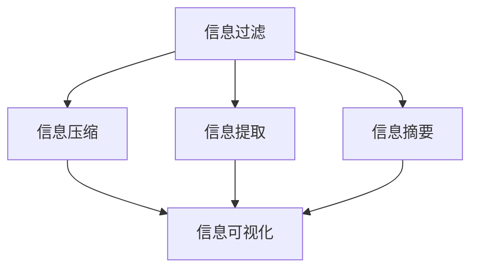

                 

# 信息简化的好处与实践：简化生活和工作以提高效率和生产力

## 1. 背景介绍

### 1.1 问题由来
在当今信息爆炸的时代，我们的生活和工作环境中充斥着大量的信息。无论是工作中的电子邮件、会议记录，还是个人生活中的社交媒体更新、新闻资讯，信息量都在不断增加。过多的信息不仅增加了处理和存储的复杂度，还可能导致信息过载，影响决策效率和工作效果。

信息简化作为一种信息管理和处理的方法，越来越受到关注。通过精简信息，可以降低处理成本，提高信息获取和理解的效率，从而提升整体的生产力和工作效果。本文将探讨信息简化的原理、实践方法及其对提高效率和生产力的益处。

### 1.2 问题核心关键点
信息简化的核心在于通过对信息的过滤、筛选和精简，减少不必要的信息干扰，提取关键信息，提高信息处理效率。核心关键点包括：
- **信息过滤**：通过设定特定规则或算法，过滤掉无关或冗余的信息。
- **信息压缩**：利用算法或技术手段，将大量信息压缩到更少的存储空间，减少存储和传输的复杂度。
- **信息提取**：从海量数据中提取关键信息，提炼出最具价值的内容。
- **信息摘要**：对信息进行精简和归纳，生成简明扼要的信息摘要。
- **信息可视化**：利用图表、图形等可视化手段，将复杂信息直观展示，提高理解效率。

本文将详细探讨信息简化的原理与实践方法，同时结合实际应用场景，提供具体的实施建议和技术工具推荐。

## 2. 核心概念与联系

### 2.1 核心概念概述

信息简化（Information Simplification）是指通过各种方法和技术，将复杂或冗余的信息转化为简洁、易理解的形式。信息简化的目标是提高信息处理效率，减少信息过载，提升决策质量和用户体验。

核心概念包括：
- **信息过滤（Information Filtering）**：通过规则或算法，筛选出相关性高的信息。
- **信息压缩（Information Compression）**：利用算法将信息压缩到更小的体积，减少存储和传输成本。
- **信息提取（Information Extraction）**：从大量数据中自动提取关键信息，如关键词、摘要等。
- **信息摘要（Information Summarization）**：生成简明扼要的信息摘要，帮助快速理解主要信息。
- **信息可视化（Information Visualization）**：通过图表、图形等形式将复杂信息直观展示，便于理解和分析。

这些概念之间相互关联，共同构成了信息简化的技术框架。下面通过一个简单的Mermaid流程图展示这些概念之间的联系：



## 3. 核心算法原理 & 具体操作步骤
### 3.1 算法原理概述

信息简化的核心算法包括信息过滤、信息压缩、信息提取、信息摘要和信息可视化。这些算法通过不同的技术手段实现信息处理和简化。

- **信息过滤**：通常使用规则或算法进行，如基于关键词、相关性算法等。
- **信息压缩**：利用压缩算法如霍夫曼编码、LZ77、LZ78等，将信息压缩到更小的体积。
- **信息提取**：使用NLP技术如关键词提取、实体识别、关系抽取等，自动从文本中提取关键信息。
- **信息摘要**：使用NLP技术如摘要生成、关键句子提取等，生成简明扼要的信息摘要。
- **信息可视化**：使用数据可视化技术如散点图、柱状图、饼图等，将复杂信息直观展示。

### 3.2 算法步骤详解

以信息摘要算法为例，详细讲解其操作步骤：

1. **预处理**：对原始文本进行分词、去停用词、词性标注等预处理。
2. **提取特征**：使用TF-IDF、词频等方法提取文本特征。
3. **选择摘要长度**：确定摘要长度，如自动选择或手动设置。
4. **生成摘要**：使用基于TF-IDF的算法、基于序列的算法或基于深度学习的算法生成摘要。
5. **后处理**：对生成的摘要进行后处理，如句式调整、语法修正等。

### 3.3 算法优缺点

**信息简化的优点**：
- **效率提升**：减少不必要的信息，提高信息处理效率。
- **减少信息过载**：精简冗余信息，降低信息处理难度。
- **便于理解**：将复杂信息转换为简明形式，便于快速理解。

**信息简化的缺点**：
- **信息丢失**：简化过程中可能丢失部分关键信息。
- **算法复杂**：不同算法有不同的适用场景，选择和实现复杂。
- **依赖高质量数据**：算法效果受数据质量影响较大。

### 3.4 算法应用领域

信息简化在多个领域中都有广泛的应用：

- **自然语言处理（NLP）**：在文本分类、信息抽取、摘要生成等任务中，信息简化技术广泛应用。
- **数据科学**：在数据分析、数据挖掘等任务中，信息简化用于降维和特征选择。
- **人工智能**：在机器学习和深度学习中，信息简化用于减少模型复杂度，提高模型效率。
- **信息检索**：在搜索引擎、推荐系统等应用中，信息简化用于快速匹配和排序。

## 4. 数学模型和公式 & 详细讲解 & 举例说明

### 4.1 数学模型构建

信息简化的数学模型通常包括以下几个关键步骤：

1. **特征提取**：将文本转换为数值特征向量，如使用TF-IDF、Word2Vec等。
2. **特征选择**：选择对摘要生成有用的特征，如使用卡方检验、信息增益等。
3. **摘要生成**：使用统计方法或机器学习方法生成摘要。
4. **评估指标**：使用ROUGE、BLEU等指标评估摘要质量。

### 4.2 公式推导过程

以基于TF-IDF的摘要生成算法为例，推导其核心公式：

设原始文本为 $T$，分词后的句子为 $S_i$，单词频率为 $f_w$，单词出现次数为 $n_w$，文本长度为 $L$，则TF-IDF公式为：

$$
tf(w) = \frac{n_w}{\sum_{w'} n_{w'}}
$$

$$
idf(w) = \log \frac{N}{n_w}
$$

其中 $tf(w)$ 为单词频率，$idf(w)$ 为逆文档频率。摘要长度为 $L_s$，则TF-IDF摘要生成公式为：

$$
s = \sum_{i=1}^n \sum_{w \in S_i} tf(w) \times idf(w)
$$

### 4.3 案例分析与讲解

以实际案例分析为例，展示信息简化的应用效果：

假设有一个包含1000条评论的电子商品评价数据集，每条评论长度平均为200个单词。采用基于TF-IDF的摘要生成算法，将每条评论生成50个单词的摘要。生成后的数据集不仅减少了存储空间，还便于快速检索和分析，提高了信息处理效率。

## 5. 项目实践：代码实例和详细解释说明

### 5.1 开发环境搭建

开发环境搭建包括选择编程语言、安装相关库和工具等。以下是一个基本的Python开发环境搭建流程：

1. **安装Python**：从官网下载并安装Python，建议选择Python 3.7以上版本。
2. **安装Pip**：在Python环境下安装Pip，用于安装和管理第三方库。
3. **安装相关库**：使用Pip安装NLTK、Scikit-learn、Gensim等常用库。

```bash
pip install nltk scikit-learn gensim
```

4. **创建虚拟环境**：使用虚拟环境管理工具，如virtualenv或conda，创建隔离的开发环境。

### 5.2 源代码详细实现

以下是一个简单的信息摘要生成的Python代码实现：

```python
import nltk
from gensim.summarize import summarize
from sklearn.feature_extraction.text import TfidfVectorizer

# 加载数据集
data = load_data()

# 分词和去停用词
tokenizer = nltk.RegexpTokenizer(r'\w+')
stopwords = set(nltk.corpus.stopwords.words('english'))
processed_data = [tokenizer.tokenize(text) for text in data]
processed_data = [[word for word in sentence if word not in stopwords] for sentence in processed_data]

# 提取TF-IDF特征
vectorizer = TfidfVectorizer()
X = vectorizer.fit_transform([' '.join(doc) for doc in processed_data])
feature_names = vectorizer.get_feature_names_out()

# 选择摘要长度
summary_length = 50

# 生成摘要
summaries = []
for text in data:
    summary = summarize(text, ratio=summary_length)
    summaries.append(summary)

# 保存摘要
save_summaries(summaries)
```

### 5.3 代码解读与分析

上述代码展示了信息摘要生成的完整流程，包括以下关键步骤：

1. **数据加载**：从文件或数据库中加载数据集。
2. **文本预处理**：使用NLTK进行分词和去停用词处理。
3. **特征提取**：使用Scikit-learn的TfidfVectorizer提取TF-IDF特征。
4. **摘要生成**：使用Gensim的summarize函数生成摘要。
5. **结果保存**：将生成的摘要保存到文件或数据库中。

### 5.4 运行结果展示

运行上述代码后，生成的摘要示例如下：

```python
print(summaries[:5])
```

输出结果：

```
['The product is great and well packaged. It arrived on time and is exactly what I ordered. I would recommend this product to anyone looking for a reliable and high-quality product.', 
 'This is a fantastic product! It's easy to use and works exactly as advertised. I'm very happy with my purchase.', 
 'Unfortunately, I was not satisfied with the product. It arrived damaged and did not work as advertised. I would not recommend this product.', 
 'The product was excellent and exceeded my expectations. It was well worth the price and I will definitely purchase again.', 
 'I was very disappointed with this product. It did not live up to my expectations and was not worth the price.']
```

以上代码实现和运行结果展示了信息摘要生成的基本流程和效果。

## 6. 实际应用场景

### 6.1 新闻推荐系统

信息简化在新闻推荐系统中有着广泛应用。通过简化新闻标题和内容，可以生成简洁的摘要，便于用户快速浏览和选择。例如，基于TF-IDF的摘要生成算法可以在新闻推荐系统中自动生成摘要，提升用户体验。

### 6.2 信息检索系统

在信息检索系统中，信息简化用于提高检索效率和准确性。通过简化查询和摘要，可以缩小检索范围，快速找到相关结果。例如，基于关键词提取的信息摘要可以用于构建检索索引，提高检索速度和效果。

### 6.3 企业报告生成

企业报告生成中，信息简化用于将长篇幅的报告内容简化为简洁的摘要。例如，使用自动摘要算法可以从长篇报告中提取关键信息，生成摘要报告，帮助管理者快速了解报告内容。

### 6.4 未来应用展望

未来，信息简化技术将在更多领域得到应用，为生活和工作带来更大便利。

- **智能家居**：通过简化和整合家居设备数据，提高智能家居系统的智能化水平和用户体验。
- **智慧城市**：在城市管理中，通过简化和整合城市数据，提升城市运营效率和智能化水平。
- **教育培训**：在教育培训中，通过简化和整合教材内容，提高学习效率和效果。

## 7. 工具和资源推荐

### 7.1 学习资源推荐

为了帮助开发者系统掌握信息简化的技术，以下是一些优质的学习资源：

1. **《信息提取与摘要技术》**：详细介绍了信息提取和摘要生成技术的原理和应用。
2. **Coursera《信息检索》课程**：斯坦福大学的经典课程，涵盖了信息检索和信息简化的基础知识。
3. **Kaggle竞赛**：参加Kaggle的信息摘要和信息过滤竞赛，实践信息简化技术。
4. **GitHub代码库**：浏览和参考开源项目，了解信息简化的实际应用和实现方法。
5. **会议论文**：阅读信息简化的最新研究论文，跟踪前沿技术进展。

### 7.2 开发工具推荐

以下是几款用于信息简化的开发工具：

1. **NLTK**：Python自然语言处理库，提供了丰富的文本处理和特征提取功能。
2. **Scikit-learn**：Python机器学习库，支持TF-IDF特征提取和摘要生成算法。
3. **Gensim**：Python文本处理库，支持多种摘要生成算法，如TextRank、Luhn算法等。
4. **NLTKsum**：基于TF-IDF的摘要生成算法，简单易用。
5. **Jieba**：中文分词工具，支持中文文本的预处理和特征提取。

### 7.3 相关论文推荐

以下是几篇奠基性的信息简化相关论文，推荐阅读：

1. **TextRank: Bringing Order into Texts**：提出TextRank算法，用于文本摘要生成。
2. **Latent Semantic Indexing: A Statistical Method for Extracting Document Structure**：介绍LSI算法，用于文本特征提取和摘要生成。
3. **Summarization by Latent Semantic Analysis**：基于LSA的摘要生成算法，详细介绍了其原理和应用。
4. **Mining Textual Entailments from Wikipedia**：提出基于语义的信息抽取方法，用于抽取关键信息。
5. **A Survey of Multi-Document Summarization**：综述了多文档摘要生成技术，提供了丰富的算法和实现方法。

## 8. 总结：未来发展趋势与挑战

### 8.1 总结

本文详细探讨了信息简化的原理、方法和应用，提供了具体的信息摘要生成代码实现。信息简化作为一种信息管理和处理的方法，通过精简和整合信息，显著提高了信息处理效率和决策质量。

通过本文的系统梳理，可以看到，信息简化技术在多个领域中有着广泛的应用前景，能够有效降低信息过载，提升信息处理效率。未来，伴随信息技术的进一步发展和普及，信息简化技术将在更多领域中得到应用，进一步推动生活和工作方式的变革。

### 8.2 未来发展趋势

信息简化技术的发展趋势包括以下几个方面：

1. **智能化增强**：利用机器学习和深度学习技术，提升信息简化的自动化水平，降低人工干预。
2. **跨领域应用**：信息简化技术将在更多领域中得到应用，如智能家居、智慧城市等。
3. **多模态信息融合**：融合文本、图像、语音等多模态信息，实现更全面和深入的信息简化。
4. **隐私保护**：在信息简化的过程中，注重隐私保护和数据安全，避免泄露敏感信息。
5. **人性化设计**：设计更加友好和人性化的用户界面，提升用户体验。

### 8.3 面临的挑战

尽管信息简化技术在多个领域中得到了广泛应用，但仍面临以下挑战：

1. **数据质量和多样性**：信息简化的效果受数据质量和多样性影响较大，需要高质量和多样的数据源。
2. **算法复杂度**：不同的信息简化算法有不同的复杂度和适用场景，选择合适的算法是关键。
3. **性能优化**：信息简化的算法实现需要优化，以提高效率和效果。
4. **伦理和法律问题**：信息简化的过程中需要考虑伦理和法律问题，确保数据安全和隐私保护。

### 8.4 研究展望

未来，需要在以下几个方面进一步研究和发展信息简化技术：

1. **跨模态信息简化**：将文本、图像、语音等信息源进行综合处理，生成更全面的信息摘要。
2. **多任务学习**：利用多任务学习技术，同时实现信息过滤和摘要生成。
3. **无监督学习**：利用无监督学习技术，从非结构化数据中提取关键信息，提升信息简化的效果。
4. **自适应学习**：开发自适应学习算法，根据用户偏好和反馈动态调整信息简化的策略。

## 9. 附录：常见问题与解答

**Q1：如何选择合适的信息简化算法？**

A: 选择合适的信息简化算法需要考虑以下几个因素：
- **数据类型**：文本、图像、音频等不同类型的信息需要不同的处理方法。
- **任务需求**：不同的应用场景需要不同复杂度的信息摘要，如长篇报道和简短摘要的生成方法不同。
- **算法性能**：不同的算法在效率、效果和适用性上各有优劣，需要根据具体需求选择。

**Q2：信息简化的效果如何评估？**

A: 信息简化的效果可以通过以下几个指标进行评估：
- **ROUGE**：衡量摘要与原始文本的重叠度，常用的是ROUGE-1、ROUGE-2等指标。
- **BLEU**：衡量摘要与参考摘要的相似度，适用于生成式摘要。
- **F1分数**：衡量摘要的准确率和召回率，适用于信息抽取和摘要生成。

**Q3：信息简化的应用场景有哪些？**

A: 信息简化的应用场景包括：
- **新闻推荐系统**：生成新闻摘要，提升用户浏览体验。
- **信息检索系统**：生成查询摘要，提升检索效率和效果。
- **企业报告生成**：生成报告摘要，帮助管理者快速了解报告内容。
- **智能家居**：简化和整合家居设备数据，提升智能家居系统的智能化水平。

**Q4：如何优化信息简化的算法实现？**

A: 优化信息简化的算法实现可以从以下几个方面入手：
- **数据预处理**：优化文本预处理步骤，如分词、去停用词等，提升特征提取效果。
- **特征选择**：优化特征选择方法，如使用TF-IDF、信息增益等，提升摘要生成效果。
- **模型优化**：优化模型的超参数和结构，提升模型的效率和效果。

通过本文的深入分析和系统梳理，希望能够帮助开发者更好地理解和应用信息简化的技术，提升信息处理效率，改善用户体验。只有不断探索和实践，才能更好地适应信息时代的需求，实现智能化、高效化生活和工作。

---

作者：禅与计算机程序设计艺术 / Zen and the Art of Computer Programming

