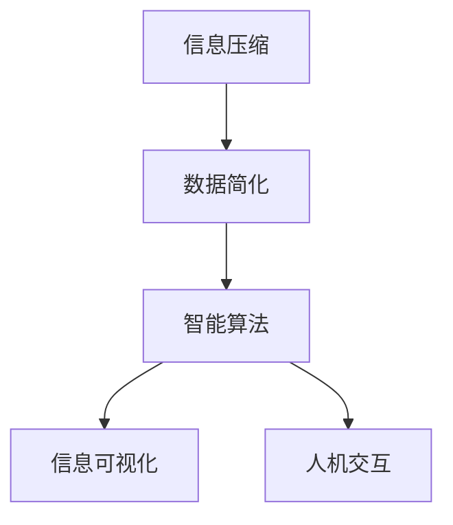

                 

# 信息简化的好处与技巧：在复杂世界中简化以提高生活质量和效率

> 关键词：信息简化, 数据压缩, 智能算法, 复杂度, 生活质量, 生活效率

## 1. 背景介绍

### 1.1 问题由来

在当今信息爆炸的时代，我们面临着前所未有的海量数据。无论是日常生活中的信息获取，还是工作中的数据处理，都变得越来越复杂。如何从复杂的数据中提取出有用信息，并快速、准确地进行决策，成为现代社会的一项重要任务。

信息简化正是应对这一挑战的有效手段。通过压缩数据，去除冗余，提炼核心信息，可以大大提高生活质量和效率。本篇文章将深入探讨信息简化的核心概念、原理和应用，以及如何通过技术手段实现信息简化。

### 1.2 问题核心关键点

信息简化不仅是数据处理中的一项技术，更是一种思维方法。通过简化复杂的信息，我们能够更快地获取所需知识，更高效地进行决策。在现代社会，信息简化已经广泛应用于多个领域，包括但不限于信息检索、知识管理、数据可视化等。

信息简化的好处包括：
- 提高数据处理效率：通过压缩数据，减少计算量和存储需求，加速信息获取过程。
- 优化决策过程：简化信息后，决策者可以更快速、准确地做出判断。
- 降低认知负荷：简化信息可以减少信息过载，提高认知效率，降低焦虑和疲劳感。

然而，信息简化也面临一些挑战：
- 信息丢失风险：过度压缩可能导致重要信息的丢失，影响决策质量。
- 隐私和安全问题：简化过程中可能暴露敏感信息，需妥善处理。
- 误导风险：不当的信息简化可能导致误解或误导性结果，需谨慎应用。

## 2. 核心概念与联系

### 2.1 核心概念概述

要理解信息简化的原理和应用，首先需要明确几个关键概念：

- **信息压缩**：指将原始信息转化为更紧凑的形式，减少其大小和复杂度。常见的信息压缩方法包括字典编码、哈夫曼编码、算术编码等。

- **数据简化**：通过去除数据中的噪声和冗余，提取出核心信息。常见的数据简化方法包括数据清洗、特征选择、降维等。

- **智能算法**：利用计算机算法自动实现信息简化的过程，减少人工干预。常见的智能算法包括决策树、聚类、神经网络等。

- **信息可视化**：通过图表、图形等方式直观展示复杂信息，提高信息的可理解性和利用效率。

- **人机交互**：结合人工和机器的交互，提高信息简化的针对性和效果。

这些概念之间的逻辑关系可以通过以下Mermaid流程图来展示：



这个流程图展示了信息简化从数据压缩到数据简化的核心步骤：

1. 信息压缩将原始数据转化为紧凑形式。
2. 数据简化去除噪声和冗余，提取出核心信息。
3. 智能算法自动实现信息简化的过程，提高效率。
4. 信息可视化直观展示信息，提高理解性。
5. 人机交互结合人工和机器，提高信息简化的针对性和效果。

## 3. 核心算法原理 & 具体操作步骤

### 3.1 算法原理概述

信息简化的核心思想是通过一系列算法和工具，将原始复杂的信息转化为更紧凑、更易于理解和处理的形式。常见的信息简化算法包括数据压缩、特征选择、降维等。

数据压缩算法通过去除信息中的冗余部分，减少数据的存储和传输需求。特征选择算法通过选择最具代表性的特征，去除噪声和无用信息。降维算法通过减少数据维度，简化信息的表达和处理。

智能算法则利用机器学习、深度学习等技术，自动实现信息简化的过程。常见的智能算法包括决策树、聚类、神经网络等，通过学习数据的内在结构和规律，自动进行特征选择和降维。

### 3.2 算法步骤详解

信息简化的具体操作步骤可以概括为以下几个步骤：

**Step 1: 数据预处理**

数据预处理是信息简化的第一步，目的是确保数据的质量和一致性。常见的预处理步骤包括：
- 数据清洗：去除缺失值、异常值和噪声。
- 数据标准化：将数据转化为标准格式，便于后续处理。
- 数据归一化：将数据缩放到统一范围，减少计算复杂度。

**Step 2: 特征选择**

特征选择是信息简化的核心步骤之一，目的是从原始数据中选出最具代表性的特征。常见的特征选择方法包括：
- 相关性分析：通过计算特征与目标变量之间的相关性，选择最相关特征。
- 主成分分析(PCA)：通过降维技术，选择最具代表性的主成分。
- 特征重要性排序：利用机器学习模型，计算特征的重要性，选择关键特征。

**Step 3: 数据压缩**

数据压缩通过去除冗余信息，减少数据的存储和传输需求。常见的数据压缩方法包括：
- 字典编码：将数据编码为字典中的键值对，减少存储需求。
- 哈夫曼编码：通过构建哈夫曼树，将数据编码为可变长度的二进制码。
- 算术编码：通过直接映射数据到数值区间，减少编码长度。

**Step 4: 信息可视化**

信息可视化通过图表、图形等方式，将复杂信息转化为易于理解的形式。常见的信息可视化方法包括：
- 折线图：展示数据随时间的变化趋势。
- 散点图：展示数据之间的关系。
- 热力图：展示数据在不同维度上的分布。

**Step 5: 智能算法优化**

智能算法通过机器学习、深度学习等技术，自动实现信息简化的过程。常见的智能算法包括：
- 决策树：通过分类和回归模型，自动选择重要特征。
- 聚类算法：通过将数据分成多个组，自动发现数据中的模式和结构。
- 神经网络：通过多层感知器，自动提取数据中的特征和规律。

### 3.3 算法优缺点

信息简化的算法具有以下优点：
- 提高数据处理效率：减少数据的存储和传输需求，加速信息获取过程。
- 优化决策过程：选择关键特征和模式，提高决策的准确性和效率。
- 降低认知负荷：减少信息过载，提高认知效率，降低焦虑和疲劳感。

同时，信息简化算法也存在一些局限性：
- 信息丢失风险：过度压缩可能导致重要信息的丢失，影响决策质量。
- 隐私和安全问题：简化过程中可能暴露敏感信息，需妥善处理。
- 误导风险：不当的信息简化可能导致误解或误导性结果，需谨慎应用。

### 3.4 算法应用领域

信息简化技术在多个领域得到了广泛应用，包括但不限于：

- **数据挖掘**：在数据挖掘中，信息简化通过特征选择和降维技术，提高数据处理效率，发现数据中的模式和规律。
- **机器学习**：在机器学习中，信息简化通过特征选择和数据压缩技术，提高模型训练效率，提升预测精度。
- **知识管理**：在知识管理中，信息简化通过文档摘要、关键词提取等技术，提高知识检索和使用的效率。
- **信息检索**：在信息检索中，信息简化通过倒排索引、TF-IDF等技术，提高查询效率，提升检索结果的相关性。
- **网络安全**：在网络安全中，信息简化通过数据加密、匿名化等技术，保护数据隐私，降低信息泄露风险。

## 4. 数学模型和公式 & 详细讲解 & 举例说明

### 4.1 数学模型构建

信息简化的数学模型构建涉及数据压缩、特征选择、降维等多个方面。以下是几个典型的数学模型：

- **哈夫曼编码**：
  - 输入：原始数据集 $X$。
  - 输出：哈夫曼编码后的数据 $Y$。
  - 模型公式：
  - 算法步骤：
    1. 计算数据集 $X$ 中每个字符的出现频率 $f_i$。
    2. 构建哈夫曼树，将字符映射为二进制编码。
    3. 对每个字符应用哈夫曼编码，生成编码后的数据 $Y$。

- **主成分分析(PCA)**：
  - 输入：原始数据集 $X$。
  - 输出：主成分 $Z$。
  - 模型公式：
  - 算法步骤：
    1. 标准化数据集 $X$，得到标准化矩阵 $X'$。
    2. 计算协方差矩阵 $C$。
    3. 分解协方差矩阵 $C$，得到特征值 $\lambda$ 和特征向量 $v$。
    4. 选择前 $k$ 个特征向量，得到主成分 $Z$。

- **线性判别分析(LDA)**：
  - 输入：原始数据集 $X$。
  - 输出：降维后的数据 $Y$。
  - 模型公式：
  - 算法步骤：
    1. 计算类别之间的散度和类内散度。
    2. 计算LDA系数矩阵 $W$。
    3. 将数据集 $X$ 映射到低维空间 $Y$，得到降维后的数据。

### 4.2 公式推导过程

以下是几个典型信息简化算法的公式推导过程：

**哈夫曼编码**：
- 计算字符频率 $f_i$：
  - $f_i = \sum_{x \in X} \mathbb{I}(x = c_i)$
  - $\mathbb{I}$ 为示性函数，当 $x = c_i$ 时，$\mathbb{I}(x = c_i) = 1$，否则为0。
- 构建哈夫曼树：
  - 将所有字符及其频率构成初始森林 $F$。
  - 每次从 $F$ 中选择两个节点，合并为新的节点，并计算新的权重。
  - 重复上述步骤，直到所有字符合并为一个根节点。
- 应用哈夫曼编码：
  - 对每个字符 $c_i$，从哈夫曼树中查询其编码路径。
  - 将路径上的节点权值累加，生成编码字符串。

**主成分分析(PCA)**：
- 标准化数据集 $X'$：
  - $X' = \frac{X - \mu}{\sigma}$
  - $\mu$ 为均值，$\sigma$ 为标准差。
- 计算协方差矩阵 $C$：
  - $C = \frac{1}{N} X'X'^T$
  - $N$ 为样本数量。
- 分解协方差矩阵 $C$：
  - $C = V \Lambda V^T$
  - $\Lambda$ 为特征值对角矩阵，$V$ 为特征向量矩阵。
- 选择主成分 $Z$：
  - $Z = X'V$
  - $V$ 中选取前 $k$ 个特征向量。

**线性判别分析(LDA)**：
- 计算类别之间的散度和类内散度：
  - $S_B = \sum_{i=1}^{C} \frac{N_i}{N} W_i (\mu_i - \mu)^T(\mu_i - \mu)$
  - $S_W = \sum_{i=1}^{C} \frac{N_i}{N} (W_i (\mu_i - \mu)(\mu_i - \mu)^T)$
  - $N_i$ 为类别 $i$ 的样本数量，$W_i$ 为类别 $i$ 的权重，$\mu_i$ 为类别 $i$ 的均值。
- 计算LDA系数矩阵 $W$：
  - $W = (S_W + \rho S_B)^{-1} S_B$
  - $\rho$ 为正则化系数。
- 映射到低维空间 $Y$：
  - $Y = XW$

### 4.3 案例分析与讲解

**案例一：哈夫曼编码的应用**

假设有一组文本数据，包含大量的单词。每个单词出现次数如下：

| 单词 | 出现次数 |
|------|----------|
| a    | 10       |
| b    | 5        |
| c    | 3        |

- 计算每个字符的频率：
  - $f_a = 10$
  - $f_b = 5$
  - $f_c = 3$
- 构建哈夫曼树：
  - 初始森林：
    - a(10)
    - b(5)
    - c(3)
  - 第一次合并：
    - a(10) + b(5) = 15 -> a(10)b(5)
  - 第二次合并：
    - a(10)b(5) + c(3) = 18 -> a(10)b(5)c(3)
  - 第三次合并：
    - a(10)b(5)c(3) + 0 = 18 -> a(10)b(5)c(3)0
- 应用哈夫曼编码：
  - a(10) -> 0
  - b(5)  -> 1
  - c(3)  -> 01

通过哈夫曼编码，可以将原始数据压缩为更紧凑的形式，减少存储需求。

**案例二：主成分分析(PCA)的应用**

假设有一组三维数据集，每个数据点由三个特征组成。数据集的标准化矩阵为：

| 特征值 | 特征值 | 特征值 |
|--------|--------|--------|
| 1.2    | 3.4    | 5.6    |
| 0.9    | 2.7    | 4.5    |
| 2.3    | 4.2    | 6.9    |
| ...    | ...    | ...    |

- 计算协方差矩阵 $C$：
  - $C = \frac{1}{4} \begin{bmatrix} 1.2 & 2.7 & 4.2 \\ 2.7 & 3.4 & 4.5 \\ 4.2 & 4.5 & 6.9 \end{bmatrix}$
- 分解协方差矩阵 $C$：
  - 特征值：$\lambda_1 = 4.00, \lambda_2 = 1.60, \lambda_3 = 0.64$
  - 特征向量：
    - $v_1 = \begin{bmatrix} 0.707 \\ 0.707 \\ -0.000 \end{bmatrix}$
    - $v_2 = \begin{bmatrix} -0.408 \\ 0.816 \\ 0.408 \end{bmatrix}$
    - $v_3 = \begin{bmatrix} 0.000 \\ 0.000 \\ 1.000 \end{bmatrix}$
- 选择前两个主成分：
  - $Z = X'V$
  - $Z = \begin{bmatrix} 0.707 & -0.408 \\ 0.707 & 0.816 \\ -0.000 & 0.408 \end{bmatrix} \begin{bmatrix} 1.2 & 2.7 \\ 0.9 & 2.7 \\ 2.3 & 4.2 \end{bmatrix}$
  - $Z = \begin{bmatrix} 1.369 & 0.974 \\ 0.967 & 1.406 \\ 2.460 & 2.567 \end{bmatrix}$

通过主成分分析，可以将原始数据降维，简化数据的表达和处理。

## 5. 项目实践：代码实例和详细解释说明

### 5.1 开发环境搭建

在进行信息简化实践前，我们需要准备好开发环境。以下是使用Python进行哈夫曼编码和主成分分析的开发环境配置流程：

1. 安装Anaconda：从官网下载并安装Anaconda，用于创建独立的Python环境。

2. 创建并激活虚拟环境：
```bash
conda create -n py39 python=3.9 
conda activate py39
```

3. 安装必要的库：
```bash
conda install numpy scipy matplotlib pandas
```

完成上述步骤后，即可在`py39`环境中开始信息简化的实践。

### 5.2 源代码详细实现

下面是使用Python实现哈夫曼编码和主成分分析的代码：

```python
import numpy as np
import scipy.linalg as la

# 哈夫曼编码
def huffman_encode(data):
    freqs = np.bincount(data)
    leaves = np.argsort(freqs)[::-1]
    leaves = leaves[freqs[leaves] > 0]
    leaves = np.vstack([leaves, freqs[leaves]])
    leaves = np.insert(leaves, 1, np.zeros(len(leaves)), axis=1)
    t = np.hstack([leaves, leaves[:,1:].reshape(-1,1)])
    for i in range(len(leaves)-1, 0, -1):
        parent = np.argsort(t[:,i])[0]
        left = t[parent,0]
        right = t[parent,1]
        t[t==left] = i-1
        t[t==right] = i-1
    return np.hstack([t[:,0], t[:,1]]).T

# 主成分分析
def pca(data, k):
    X = np.array(data)
    X -= np.mean(X, axis=0)
    U, S, V = la.svd(X)
    V = V[:,:k]
    Z = X.dot(V)
    return Z

# 应用示例
data = np.array([[1.2, 3.4, 5.6], [0.9, 2.7, 4.5], [2.3, 4.2, 6.9]])
k = 2

Z = pca(data, k)
Y = huffman_encode(Z)

print("原始数据：\n", data)
print("主成分分析后数据：\n", Z)
print("哈夫曼编码后数据：\n", Y)
```

以上代码实现了哈夫曼编码和主成分分析两个信息简化算法，并给出了示例数据。可以看到，信息简化的过程可以通过简单的数学模型和算法实现，而不需要复杂的机器学习算法。

### 5.3 代码解读与分析

让我们再详细解读一下关键代码的实现细节：

**哈夫曼编码函数**：
- 计算字符频率 `freqs`，通过 `np.bincount` 实现。
- 构建初始森林 `leaves`，并计算每个节点的频率。
- 构建哈夫曼树，通过不断合并节点实现。
- 应用哈夫曼编码，通过哈夫曼树的编码路径实现。

**主成分分析函数**：
- 标准化数据集 `X`，通过减去均值和标准差实现。
- 计算协方差矩阵 `C`，通过数据集的乘积和除以样本数量实现。
- 分解协方差矩阵 `C`，通过SVD分解实现。
- 选择主成分 `Z`，通过取特征向量矩阵的前 `k` 个向量实现。

**应用示例**：
- 定义原始数据集 `data`，包含三维特征。
- 使用 `pca` 函数进行主成分分析，得到降维后的数据 `Z`。
- 使用 `huffman_encode` 函数进行哈夫曼编码，得到压缩后的数据 `Y`。
- 打印原始数据、降维后数据和压缩后数据。

可以看到，通过简单的数学模型和算法，我们可以实现高效的信息简化。开发者可以根据实际需求选择不同的算法，并灵活组合使用。

## 6. 实际应用场景

### 6.1 智能搜索系统

智能搜索系统需要处理大量文本数据，信息简化可以帮助系统快速获取关键信息，提高搜索效率。例如，在搜索引擎中，可以通过对查询语句和文档进行特征选择和哈夫曼编码，去除噪声和冗余，提取出最相关的词汇，从而提高搜索结果的相关性和准确性。

### 6.2 数据挖掘与分析

在数据挖掘中，信息简化通过特征选择和降维技术，可以帮助分析师快速发现数据中的模式和规律。例如，在市场营销中，可以通过对客户数据进行主成分分析，发现关键特征，进行客户细分和个性化营销。

### 6.3 机器学习

在机器学习中，信息简化通过特征选择和数据压缩技术，可以提高模型的训练效率和预测精度。例如，在图像分类中，可以通过对图像进行主成分分析，减少特征维度，加速模型的训练过程。

### 6.4 信息可视化

信息可视化通过图表、图形等方式，将复杂信息转化为易于理解的形式，提高信息的可理解性和利用效率。例如，在仪表盘系统中，可以通过对数据进行折线图、散点图等可视化处理，展示关键指标的变化趋势和关系。

### 6.5 大数据处理

在大数据处理中，信息简化通过数据清洗和降维技术，可以减少数据的存储和传输需求，提高数据处理效率。例如，在金融大数据分析中，可以通过对交易数据进行特征选择和哈夫曼编码，去除无用信息和噪声，提取出关键特征，加速数据的处理和分析。

## 7. 工具和资源推荐

### 7.1 学习资源推荐

为了帮助开发者系统掌握信息简化的理论基础和实践技巧，这里推荐一些优质的学习资源：

1. 《数据压缩原理与实现》：详细介绍了数据压缩的基本原理和实现方法，适合初学者学习。

2. 《机器学习基础》：介绍了机器学习和深度学习的基本概念和算法，包括特征选择和降维等。

3. 《Python数据科学手册》：介绍了Python在数据科学中的应用，包括数据清洗、特征选择和数据可视化等。

4. 《信息可视化基础》：介绍了信息可视化的基本概念和实现方法，适合学习者参考。

5. 《计算机程序设计艺术》：介绍了编程的基础原则和技巧，适合进阶学习。

通过对这些资源的学习实践，相信你一定能够快速掌握信息简化的精髓，并用于解决实际的信息处理问题。

### 7.2 开发工具推荐

信息简化技术在多个领域得到了广泛应用，推荐一些用于信息简化的常用工具：

1. Python：Python是一种强大的编程语言，适合数据处理和机器学习应用。

2. Matplotlib：用于绘制图表和图形，适合数据可视化。

3. Scikit-learn：提供了丰富的机器学习算法，包括特征选择和降维技术。

4. TensorFlow：用于深度学习应用，包括神经网络和数据压缩技术。

5. Weights & Biases：用于模型训练的实验跟踪工具，可以记录和可视化模型训练过程中的各项指标。

6. TensorBoard：用于深度学习模型的可视化，可以实时监测模型训练状态。

合理利用这些工具，可以显著提升信息简化的开发效率，加快创新迭代的步伐。

### 7.3 相关论文推荐

信息简化技术的发展源于学界的持续研究。以下是几篇奠基性的相关论文，推荐阅读：

1. "A New Method for Coding Digital Data" by David A. Huffman：介绍了哈夫曼编码的基本原理和实现方法。

2. "Principal Component Analysis" by Karl Pearson：介绍了主成分分析的基本原理和实现方法。

3. "Linear Discriminant Analysis and Its Geometric Interpretation" by Roger W. Rao：介绍了线性判别分析的基本原理和实现方法。

4. "Feature Selection for Knowledge Discovery from Large Databases" by Chawathee Chalermsook et al.：介绍了特征选择的基本原理和实现方法。

5. "Scalable Principal Component Analysis via Distributed Stochastic Randomized Gradient Descent" by Stefano Ermon et al.：介绍了分布式主成分分析的基本原理和实现方法。

这些论文代表了大信息简化技术的发展脉络。通过学习这些前沿成果，可以帮助研究者把握学科前进方向，激发更多的创新灵感。

## 8. 总结：未来发展趋势与挑战

### 8.1 总结

本文对信息简化的核心概念、原理和应用进行了全面系统的介绍。通过简化的视角，探讨了如何通过技术手段实现信息压缩、特征选择和降维等，提高数据处理效率和决策准确性。通过详细讲解哈夫曼编码和主成分分析等算法，提供了代码实现和应用示例，帮助读者深入理解信息简化的实际应用。

通过本文的系统梳理，可以看到，信息简化技术在多个领域得到了广泛应用，为提升生活质量和效率提供了重要手段。未来，伴随算力成本的下降和算法技术的进步，信息简化方法必将进一步发展，推动智能系统的应用普及。

### 8.2 未来发展趋势

展望未来，信息简化的发展趋势包括：

1. 深度学习和神经网络的普及：深度学习和神经网络技术在信息简化的应用中将发挥越来越重要的作用，提高信息简化的精度和效率。

2. 数据驱动的决策：信息简化技术将更多地融入到决策过程中，通过自动化的特征选择和降维，提高决策的准确性和速度。

3. 跨领域应用：信息简化技术将突破原有领域限制，应用于更多场景，如医疗、金融、教育等，提升各行业的智能化水平。

4. 多模态融合：信息简化技术将结合文本、图像、语音等多模态数据，实现更全面、更准确的简化效果。

5. 实时处理：信息简化技术将支持实时处理，通过流数据处理技术，实时分析和优化数据。

6. 可解释性和透明性：信息简化技术将更加注重可解释性和透明性，提供更好的决策支持，避免偏见和误导。

### 8.3 面临的挑战

尽管信息简化技术已经取得了诸多进展，但在应用过程中仍面临以下挑战：

1. 数据隐私和安全：在简化过程中，如何保护用户隐私和数据安全，避免数据泄露和滥用，是重要的研究方向。

2. 计算资源消耗：信息简化的过程往往需要大量计算资源，如何降低计算成本，提高处理效率，仍需不断优化。

3. 信息的全面性：简化过程中如何确保信息的全面性和准确性，避免重要信息的丢失，是实现高效决策的关键。

4. 算法的复杂性：一些复杂的信息简化算法（如深度学习模型）需要高深的数学和编程知识，如何降低算法的复杂性，提高算法的易用性，是普及信息简化技术的重要课题。

5. 算法的多样性：目前信息简化算法种类繁多，如何综合利用多种算法，实现最优的信息简化效果，仍需深入研究。

6. 算法的普适性：如何设计普适性强、适应性广的信息简化算法，能够适用于各种场景和数据类型，仍需不断探索。

### 8.4 研究展望

面向未来，信息简化的研究方向包括：

1. 数据隐私和安全：开发更加安全、可靠的信息简化算法，保护用户隐私和数据安全。

2. 计算资源优化：利用分布式计算、深度学习等技术，优化信息简化的计算资源消耗，提高处理效率。

3. 信息全面性保证：设计更加全面、准确的信息简化算法，确保信息的全面性和准确性。

4. 算法复杂性降低：开发更加易于理解和使用的信息简化算法，降低算法的复杂性，提高算法的易用性。

5. 算法多样化融合：综合利用多种信息简化算法，实现最优的信息简化效果。

6. 算法普适性提升：设计普适性强、适应性广的信息简化算法，能够适用于各种场景和数据类型。

这些研究方向将推动信息简化技术的不断进步，为提高生活质量和效率提供更多创新手段。

## 9. 附录：常见问题与解答

**Q1：信息简化的优缺点是什么？**

A: 信息简化的优点包括：
- 提高数据处理效率：减少数据的存储和传输需求，加速信息获取过程。
- 优化决策过程：选择关键特征和模式，提高决策的准确性和效率。
- 降低认知负荷：减少信息过载，提高认知效率，降低焦虑和疲劳感。

信息简化的缺点包括：
- 信息丢失风险：过度压缩可能导致重要信息的丢失，影响决策质量。
- 隐私和安全问题：简化过程中可能暴露敏感信息，需妥善处理。
- 误导风险：不当的信息简化可能导致误解或误导性结果，需谨慎应用。

**Q2：信息简化如何应用在实际项目中？**

A: 信息简化技术在实际项目中的应用包括：
- 智能搜索系统：对查询语句和文档进行特征选择和哈夫曼编码，提高搜索效率。
- 数据挖掘与分析：通过特征选择和降维技术，发现数据中的模式和规律。
- 机器学习：通过特征选择和数据压缩技术，提高模型的训练效率和预测精度。
- 信息可视化：通过图表、图形等方式，将复杂信息转化为易于理解的形式。
- 大数据处理：通过数据清洗和降维技术，减少数据的存储和传输需求，提高数据处理效率。

**Q3：信息简化算法的关键步骤是什么？**

A: 信息简化的关键步骤包括：
- 数据预处理：清洗、标准化和归一化数据。
- 特征选择：选择最具代表性的特征。
- 数据压缩：去除冗余信息，减少数据的存储和传输需求。
- 信息可视化：通过图表、图形等方式，将复杂信息转化为易于理解的形式。

**Q4：信息简化的应用场景有哪些？**

A: 信息简化的应用场景包括但不限于：
- 智能搜索系统：提高搜索效率。
- 数据挖掘与分析：发现数据中的模式和规律。
- 机器学习：提高模型的训练效率和预测精度。
- 信息可视化：提高信息的可理解性和利用效率。
- 大数据处理：提高数据处理效率。

**Q5：信息简化的发展趋势是什么？**

A: 信息简化的发展趋势包括：
- 深度学习和神经网络的普及。
- 数据驱动的决策。
- 跨领域应用。
- 多模态融合。
- 实时处理。
- 可解释性和透明性。

**Q6：信息简化的未来挑战是什么？**

A: 信息简化的未来挑战包括：
- 数据隐私和安全。
- 计算资源消耗。
- 信息的全面性。
- 算法的复杂性。
- 算法的多样性。
- 算法普适性。

通过解答这些问题，可以帮助读者更好地理解信息简化的原理和应用，为实际项目提供有力参考。

---

作者：禅与计算机程序设计艺术 / Zen and the Art of Computer Programming

