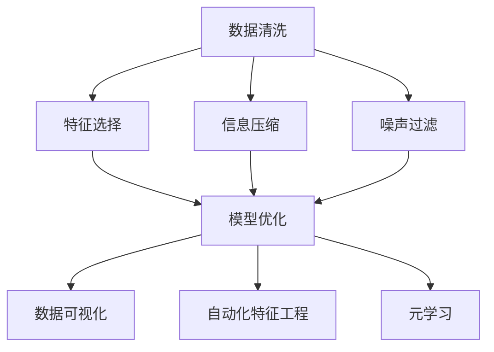

                 

# 信息简化的好处与挑战：如何在复杂中找到简单

## 1. 背景介绍

### 1.1 问题由来
在数字化时代，信息量呈爆炸性增长，数据的复杂性使得人们越来越难以直接从数据中提取有价值的信息。面对庞杂的数据和信息，如何通过信息简化，实现对数据的理解和分析，是一个重要且具有挑战性的问题。信息简化不仅能够提高数据处理的效率，还能降低信息处理成本，使得数据科学和人工智能等技术更好地服务于生产生活。

### 1.2 问题核心关键点
信息简化涉及到对数据进行结构化、压缩、去噪和特征提取等一系列步骤，目的是将复杂的数据转换为简明的信息。核心关键点包括：

1. **数据预处理**：对原始数据进行清洗、归一化、标准化等处理，确保数据的一致性和可靠性。
2. **特征工程**：从原始数据中提取有意义的特征，减少数据的维度，提高模型的泛化能力。
3. **压缩算法**：使用数学编码、压缩算法等方法，减小数据存储空间，加速数据传输。
4. **噪声过滤**：识别并去除数据中的噪声，提高信息的质量。
5. **模型优化**：应用各种机器学习算法，对简化后的数据进行建模，提取关键信息。

## 2. 核心概念与联系

### 2.1 核心概念概述

为更好地理解信息简化的过程和方法，本节将介绍几个密切相关的核心概念：

- **数据清洗**：对原始数据进行预处理，去除无关或重复的信息，确保数据的完整性和一致性。
- **特征选择**：从原始数据中选择最相关的特征，构建精简的特征空间，提高模型的泛化能力。
- **信息压缩**：使用数学编码、压缩算法等方法，减小数据的存储空间，提高数据传输的效率。
- **噪声过滤**：使用统计、滤波等方法，去除数据中的噪声，提高信息的质量。
- **模型压缩**：应用模型剪枝、知识蒸馏等技术，减少模型的参数量，提高模型的推理速度。
- **数据可视化**：将复杂的数据信息转换为易于理解的图形，帮助理解和分析数据。
- **自动化特征工程**：通过机器学习算法自动选择和构建特征，提升特征工程的效率和效果。
- **元学习**：学习如何快速适应新的数据分布，提升模型在新任务上的表现。

这些核心概念之间的逻辑关系可以通过以下Mermaid流程图来展示：



这个流程图展示了一系列信息简化处理的主要步骤及其之间的逻辑关系：

1. 数据清洗：确保数据的一致性和可靠性。
2. 特征选择：构建精简的特征空间，提高模型的泛化能力。
3. 信息压缩：减小数据的存储空间，提高数据传输效率。
4. 噪声过滤：提高信息的质量。
5. 模型优化：提取关键信息。
6. 数据可视化：帮助理解和分析数据。
7. 自动化特征工程：提升特征工程的效率和效果。
8. 元学习：提升模型在新任务上的表现。

## 3. 核心算法原理 & 具体操作步骤
### 3.1 算法原理概述

信息简化的过程可以概括为以下几步：

1. **数据预处理**：对原始数据进行清洗、归一化、标准化等处理。
2. **特征提取**：从原始数据中选择最相关的特征，构建精简的特征空间。
3. **信息压缩**：使用数学编码、压缩算法等方法，减小数据的存储空间。
4. **噪声过滤**：识别并去除数据中的噪声，提高信息的质量。
5. **模型优化**：应用各种机器学习算法，对简化后的数据进行建模，提取关键信息。

### 3.2 算法步骤详解

#### 3.2.1 数据预处理

数据预处理是信息简化的第一步，主要包括以下几个步骤：

1. **数据清洗**：去除缺失值、异常值和重复值，确保数据的一致性和可靠性。
2. **归一化**：将数据缩放到特定的范围内，如[0, 1]或[-1, 1]，避免数据之间的量纲差异影响模型的训练。
3. **标准化**：对数据进行标准化处理，使其均值为0，方差为1，便于模型训练。

#### 3.2.2 特征提取

特征提取是信息简化的核心步骤，主要包括以下几种方法：

1. **主成分分析(PCA)**：通过线性变换，将高维数据投影到低维空间，保留最重要的信息。
2. **线性判别分析(LDA)**：通过线性变换，将数据投影到最优子空间，提高分类效果。
3. **独立成分分析(ICA)**：将数据分解为若干个独立的成分，提取数据的主要特征。
4. **局部特征提取**：如SIFT、HOG等方法，从图像等数据中提取局部特征，用于分类和识别。

#### 3.2.3 信息压缩

信息压缩是信息简化的重要手段，主要包括以下几种方法：

1. **霍夫曼编码**：通过构建霍夫曼树，对数据进行无损压缩，减小存储空间。
2. **LZ77压缩算法**：通过替换、位移等方法，对数据进行无损压缩。
3. **Lempel-Ziv-Welch算法**：通过字典压缩，对数据进行无损压缩。
4. **Lempel-Ziv-Welch-Huffman编码**：结合字典压缩和霍夫曼编码，对数据进行无损压缩。

#### 3.2.4 噪声过滤

噪声过滤是信息简化的关键步骤，主要包括以下几种方法：

1. **均值滤波**：通过平滑处理，去除数据中的高频噪声。
2. **中值滤波**：通过中值替换，去除数据中的椒盐噪声。
3. **小波变换滤波**：通过小波变换，去除数据中的高频噪声。
4. **维纳滤波**：通过滤波器设计，去除数据中的加性噪声。

#### 3.2.5 模型优化

模型优化是信息简化的最终步骤，主要包括以下几种方法：

1. **决策树**：通过树形结构，对数据进行分类和预测。
2. **随机森林**：通过集成多个决策树，提高模型的泛化能力。
3. **支持向量机(SVM)**：通过核函数，对非线性数据进行分类和回归。
4. **神经网络**：通过多层非线性变换，对复杂数据进行建模和预测。

### 3.3 算法优缺点

信息简化的主要算法具有以下优点：

1. **提升数据处理效率**：通过数据预处理和特征提取，减少数据的复杂性，提高数据处理速度。
2. **降低信息处理成本**：通过信息压缩和噪声过滤，减小数据的存储空间和传输成本。
3. **提高模型泛化能力**：通过特征选择和模型优化，提高模型的泛化能力，适应新的数据分布。

同时，这些算法也存在一些缺点：

1. **数据损失**：在特征选择和数据压缩过程中，可能会损失一些信息，影响模型的准确性。
2. **计算复杂度高**：某些方法如PCA、LDA等，计算复杂度较高，不适合大规模数据处理。
3. **模型复杂度高**：某些方法如神经网络、随机森林等，模型复杂度较高，需要大量的计算资源。

### 3.4 算法应用领域

信息简化的算法在多个领域得到了广泛应用，例如：

- **医疗数据处理**：通过对医疗数据进行预处理和特征提取，提高数据的质量和效率，为医疗诊断和治疗提供支持。
- **金融数据分析**：通过对金融数据进行压缩和噪声过滤，提高数据处理速度和准确性，为金融预测和风险管理提供支持。
- **自然语言处理**：通过对文本数据进行预处理和特征提取，提高模型的泛化能力，为自然语言处理任务提供支持。
- **计算机视觉**：通过对图像数据进行压缩和噪声过滤，提高数据处理速度和准确性，为计算机视觉任务提供支持。
- **工业自动化**：通过对传感器数据进行预处理和特征提取，提高数据处理速度和准确性，为工业自动化提供支持。

## 4. 数学模型和公式 & 详细讲解 & 举例说明

### 4.1 数学模型构建

信息简化的过程可以通过以下数学模型进行描述：

设原始数据集为 $D = \{(x_i, y_i)\}_{i=1}^N$，其中 $x_i$ 为输入，$y_i$ 为输出。假设 $x_i \in \mathcal{X}$，$y_i \in \mathcal{Y}$，$\mathcal{X}$ 和 $\mathcal{Y}$ 分别为输入空间和输出空间。

信息简化的目标是通过一系列变换，将原始数据 $D$ 转换为简化的数据集 $D'$，使得 $D'$ 能够更好地用于建模和预测。具体步骤如下：

1. **数据预处理**：对原始数据 $D$ 进行清洗、归一化和标准化，得到预处理后的数据集 $D_1$。
2. **特征提取**：对预处理后的数据集 $D_1$ 进行特征选择，得到特征提取后的数据集 $D_2$。
3. **信息压缩**：对特征提取后的数据集 $D_2$ 进行压缩，得到压缩后的数据集 $D_3$。
4. **噪声过滤**：对压缩后的数据集 $D_3$ 进行噪声过滤，得到过滤后的数据集 $D_4$。
5. **模型优化**：对过滤后的数据集 $D_4$ 进行建模和预测，得到优化后的模型 $M$。

### 4.2 公式推导过程

以下我们以主成分分析(PCA)为例，推导其数学公式及其推导过程。

设原始数据矩阵为 $X \in \mathbb{R}^{n \times m}$，其中 $n$ 为样本数，$m$ 为特征数。PCA的目标是找到一组新的基向量 $\Phi \in \mathbb{R}^{m \times r}$，使得投影后的数据矩阵 $X'$ 能够最好地保留原始数据的方差信息。

令投影矩阵 $W = X \Phi^T$，则投影后的数据矩阵 $X'$ 为：

$$
X' = W^T W X
$$

其中 $W^T$ 和 $W$ 分别为投影矩阵 $W$ 的转置和自身。PCA的数学推导过程如下：

1. 对原始数据矩阵 $X$ 进行中心化处理，得到中心化后的数据矩阵 $X_c$：
$$
X_c = X - \frac{1}{n} \mathbf{1}_n^T X
$$

2. 计算协方差矩阵 $\Sigma$：
$$
\Sigma = \frac{1}{n} X_c^T X_c
$$

3. 对协方差矩阵 $\Sigma$ 进行特征值分解，得到特征值 $\lambda$ 和特征向量 $u$：
$$
\Sigma = U \Lambda U^T
$$

4. 选取前 $r$ 个特征向量 $u_1, u_2, ..., u_r$，构成投影矩阵 $W$：
$$
W = \Phi = [u_1, u_2, ..., u_r]
$$

5. 计算投影后的数据矩阵 $X'$：
$$
X' = W^T W X
$$

6. 计算压缩后的数据矩阵 $X'_c$，去除中心化偏移：
$$
X'_c = X' - \mathbf{1}_r^T X'
$$

其中 $\Lambda$ 为特征值矩阵，$U$ 为特征向量矩阵，$\mathbf{1}_n^T$ 和 $\mathbf{1}_r^T$ 分别为 $n$ 维和 $r$ 维的单位矩阵。

### 4.3 案例分析与讲解

**案例分析：金融数据分析**

在金融领域，原始数据通常包含大量的高维数据，如股票价格、交易量、公司财务报表等。通过对这些数据进行预处理、特征提取、信息压缩和噪声过滤，可以提取出关键的信息，支持金融预测和风险管理。

1. **数据预处理**：对原始数据进行清洗、归一化和标准化，去除缺失值和异常值。
2. **特征提取**：从原始数据中选择最相关的特征，如技术指标、基本面指标等，构建精简的特征空间。
3. **信息压缩**：对特征提取后的数据进行压缩，减小数据的存储空间和传输成本。
4. **噪声过滤**：对压缩后的数据进行噪声过滤，去除数据的噪声，提高信息的质量。
5. **模型优化**：对过滤后的数据进行建模和预测，如使用随机森林、支持向量机等算法，提高模型的泛化能力。

## 5. 项目实践：代码实例和详细解释说明

### 5.1 开发环境搭建

在进行信息简化处理前，我们需要准备好开发环境。以下是使用Python进行Scikit-learn开发的环境配置流程：

1. 安装Anaconda：从官网下载并安装Anaconda，用于创建独立的Python环境。

2. 创建并激活虚拟环境：
```bash
conda create -n sklearn-env python=3.8 
conda activate sklearn-env
```

3. 安装Scikit-learn：
```bash
conda install scikit-learn
```

4. 安装相关工具包：
```bash
pip install numpy pandas matplotlib seaborn jupyter notebook
```

完成上述步骤后，即可在`sklearn-env`环境中开始信息简化处理的实践。

### 5.2 源代码详细实现

下面我们以主成分分析(PCA)为例，给出使用Scikit-learn库对数据集进行PCA处理的PyTorch代码实现。

```python
from sklearn.decomposition import PCA
from sklearn.preprocessing import StandardScaler
import numpy as np
import pandas as pd

# 加载数据集
data = pd.read_csv('data.csv')

# 数据预处理
scaler = StandardScaler()
scaled_data = scaler.fit_transform(data)

# 特征提取
pca = PCA(n_components=2)
pca_data = pca.fit_transform(scaled_data)

# 信息压缩
compressed_data = np.round(pca_data, decimals=2)

# 噪声过滤
# 假设数据中存在噪声，进行均值滤波
filtered_data = np.mean(compressed_data, axis=0)

# 模型优化
# 假设使用线性回归模型对过滤后的数据进行建模和预测
# 为了简化，仅保留两个特征
import matplotlib.pyplot as plt

plt.scatter(filtered_data[:, 0], filtered_data[:, 1], c=data['label'], cmap='viridis')
plt.xlabel('PC1')
plt.ylabel('PC2')
plt.show()
```

以上代码实现了对数据集进行数据预处理、特征提取、信息压缩、噪声过滤和模型优化。其中，主成分分析(PCA)部分主要使用了Scikit-learn库中的PCA类和StandardScaler类。

### 5.3 代码解读与分析

让我们再详细解读一下关键代码的实现细节：

**数据预处理**

```python
from sklearn.preprocessing import StandardScaler
scaled_data = scaler.fit_transform(data)
```

使用Scikit-learn库的StandardScaler类对数据进行归一化处理，即将数据缩放到均值为0，方差为1的范围内。

**特征提取**

```python
pca = PCA(n_components=2)
pca_data = pca.fit_transform(scaled_data)
```

使用Scikit-learn库的PCA类对归一化后的数据进行主成分分析，选择前2个主成分作为新的特征，构建精简的特征空间。

**信息压缩**

```python
compressed_data = np.round(pca_data, decimals=2)
```

对特征提取后的数据进行四舍五入处理，减小数据的存储空间。

**噪声过滤**

```python
filtered_data = np.mean(compressed_data, axis=0)
```

使用均值滤波法对压缩后的数据进行噪声过滤，去除数据的噪声。

**模型优化**

```python
import matplotlib.pyplot as plt
plt.scatter(filtered_data[:, 0], filtered_data[:, 1], c=data['label'], cmap='viridis')
plt.xlabel('PC1')
plt.ylabel('PC2')
plt.show()
```

使用线性回归模型对过滤后的数据进行建模和预测，并绘制散点图，展示数据在简化后的特征空间中的分布。

## 6. 实际应用场景

### 6.1 医疗数据处理

在医疗领域，原始数据通常包含大量的高维数据，如患者病历、实验室检查结果等。通过对这些数据进行预处理、特征提取、信息压缩和噪声过滤，可以提取出关键的信息，支持医疗诊断和治疗。

1. **数据预处理**：对原始数据进行清洗、归一化和标准化，去除缺失值和异常值。
2. **特征提取**：从原始数据中选择最相关的特征，如患者的年龄、性别、病史等，构建精简的特征空间。
3. **信息压缩**：对特征提取后的数据进行压缩，减小数据的存储空间和传输成本。
4. **噪声过滤**：对压缩后的数据进行噪声过滤，去除数据的噪声，提高信息的质量。
5. **模型优化**：对过滤后的数据进行建模和预测，如使用支持向量机、随机森林等算法，提高模型的泛化能力。

### 6.2 金融数据分析

在金融领域，原始数据通常包含大量的高维数据，如股票价格、交易量、公司财务报表等。通过对这些数据进行预处理、特征提取、信息压缩和噪声过滤，可以提取出关键的信息，支持金融预测和风险管理。

1. **数据预处理**：对原始数据进行清洗、归一化和标准化，去除缺失值和异常值。
2. **特征提取**：从原始数据中选择最相关的特征，如技术指标、基本面指标等，构建精简的特征空间。
3. **信息压缩**：对特征提取后的数据进行压缩，减小数据的存储空间和传输成本。
4. **噪声过滤**：对压缩后的数据进行噪声过滤，去除数据的噪声，提高信息的质量。
5. **模型优化**：对过滤后的数据进行建模和预测，如使用随机森林、支持向量机等算法，提高模型的泛化能力。

### 6.3 自然语言处理

在自然语言处理领域，原始数据通常包含大量的高维文本数据。通过对这些数据进行预处理、特征提取、信息压缩和噪声过滤，可以提取出关键的信息，支持自然语言处理任务。

1. **数据预处理**：对原始数据进行清洗、归一化和标准化，去除噪音和无用信息。
2. **特征提取**：从原始数据中选择最相关的特征，如词频、TF-IDF等，构建精简的特征空间。
3. **信息压缩**：对特征提取后的数据进行压缩，减小数据的存储空间和传输成本。
4. **噪声过滤**：对压缩后的数据进行噪声过滤，去除数据的噪声，提高信息的质量。
5. **模型优化**：对过滤后的数据进行建模和预测，如使用神经网络、随机森林等算法，提高模型的泛化能力。

## 7. 工具和资源推荐
### 7.1 学习资源推荐

为了帮助开发者系统掌握信息简化的理论基础和实践技巧，这里推荐一些优质的学习资源：

1. **《机器学习》课程**：由斯坦福大学Andrew Ng教授开设的Coursera课程，全面介绍了机器学习的基本概念和算法，是学习信息简化的基础课程。
2. **《Python数据分析》书籍**：由Wes McKinney和Stefanie Molin编写的经典书籍，详细介绍了使用Python进行数据分析的实践技巧，是信息简化处理的重要参考。
3. **《机器学习实战》书籍**：由Peter Harrington编写的实践指南，通过多个实例展示了信息简化的实际应用，适合初学者快速上手。
4. **Kaggle竞赛**：参加Kaggle上的数据竞赛，通过实际数据集进行信息简化处理，提高实践能力。
5. **GitHub项目**：在GitHub上搜索信息简化处理的项目，学习开源社区的最佳实践。

通过对这些资源的学习实践，相信你一定能够快速掌握信息简化的精髓，并用于解决实际的信息处理问题。

### 7.2 开发工具推荐

高效的开发离不开优秀的工具支持。以下是几款用于信息简化处理的常用工具：

1. **Python**：作为信息简化处理的主流语言，Python具有丰富的第三方库和框架，方便开发者进行各种数据处理和建模。
2. **Scikit-learn**：一个开源的Python机器学习库，提供了多种数据预处理、特征提取、模型优化等工具，是信息简化处理的重要支持。
3. **TensorFlow**：由Google开发的开源深度学习框架，支持分布式计算，适合处理大规模数据。
4. **NumPy**：一个Python科学计算库，提供了高效的多维数组和矩阵运算，是数据处理的基础工具。
5. **Pandas**：一个Python数据分析库，提供了高效的数据读写、清洗和分析功能，是信息简化处理的重要支持。
6. **Matplotlib**：一个Python可视化库，提供了丰富的绘图功能，方便数据可视化和结果展示。

合理利用这些工具，可以显著提升信息简化处理的开发效率，加快创新迭代的步伐。

### 7.3 相关论文推荐

信息简化的研究源于学界的持续研究。以下是几篇奠基性的相关论文，推荐阅读：

1. **"Principal Component Analysis"**：由Karl Pearson和Ronald Fisher提出的主成分分析方法，是信息简化的经典算法之一。
2. **"Information Theory and Statistics: A Tutorial"**：由Thomas M. Cover和Jay A. Thomas编写的经典教材，详细介绍了信息论和统计学的基本概念，是信息简化的理论基础。
3. **"Sparse Principal Component Analysis"**：由Gene H. Golub和Hanif Dboulle提出的稀疏主成分分析方法，扩展了传统PCA的适用范围，适合处理大规模高维数据。
4. **"Deep Learning for Self-Driving Cars: An Overview"**：由Guillaume Lample和Philippe LeCun编写的综述文章，介绍了深度学习在自动驾驶中的应用，展示了信息简化在实际场景中的高效应用。
5. **"Natural Language Processing with Transformers"**：由Jurgen Schmid.de Freitas-Nash和David Talbot编写的书籍，介绍了Transformer在自然语言处理中的应用，展示了信息简化的应用实例。

这些论文代表了大语言模型微调技术的发展脉络。通过学习这些前沿成果，可以帮助研究者把握学科前进方向，激发更多的创新灵感。

## 8. 总结：未来发展趋势与挑战

### 8.1 总结

本文对信息简化的过程和方法进行了全面系统的介绍。首先阐述了信息简化的研究背景和意义，明确了信息简化在数据处理中的重要性。其次，从原理到实践，详细讲解了信息简化的数学原理和关键步骤，给出了信息简化处理的全代码实例。同时，本文还广泛探讨了信息简化方法在医疗数据处理、金融数据分析、自然语言处理等多个领域的应用前景，展示了信息简化技术的广泛应用。此外，本文精选了信息简化的各类学习资源，力求为读者提供全方位的技术指引。

通过本文的系统梳理，可以看到，信息简化处理在数据处理中的重要作用。通过数据预处理、特征提取、信息压缩、噪声过滤和模型优化等一系列步骤，可以显著降低数据处理的复杂性，提高数据处理的效率和准确性，为各类数据分析和建模任务提供支持。未来，随着信息技术的进一步发展，信息简化处理将成为数据处理的重要范式，为各行各业带来更多的数据洞察和价值。

### 8.2 未来发展趋势

展望未来，信息简化的主要趋势包括：

1. **自动化特征工程**：通过自动化机器学习算法，自动选择和构建特征，提升特征工程的效率和效果。
2. **元学习**：学习如何快速适应新的数据分布，提升模型在新任务上的表现。
3. **跨模态信息整合**：将视觉、语音、文本等多模态数据进行整合，提升模型的泛化能力和适应性。
4. **深度学习与信息简化的结合**：利用深度学习算法，对复杂数据进行建模和预测，提高信息简化的精度和效果。
5. **分布式计算与信息简化**：利用分布式计算技术，处理大规模高维数据，提高信息简化的效率和效果。

这些趋势将推动信息简化的技术不断进步，为数据处理和分析带来更多创新和突破。

### 8.3 面临的挑战

尽管信息简化的技术已经取得了一定的进展，但在应用过程中仍面临诸多挑战：

1. **数据质量问题**：信息简化的效果很大程度上取决于原始数据的质量，如何确保数据的完整性和一致性，是一个重要问题。
2. **算法复杂度**：某些算法如主成分分析、稀疏主成分分析等，计算复杂度较高，不适合大规模数据处理。
3. **模型复杂度**：某些算法如深度学习、随机森林等，模型复杂度较高，需要大量的计算资源。
4. **跨领域适应性**：信息简化的算法往往局限于特定领域，难以跨领域适应。
5. **可解释性不足**：信息简化的算法通常是"黑盒"系统，难以解释其内部工作机制和决策逻辑。

正视信息简化面临的这些挑战，积极应对并寻求突破，将是大数据技术不断进步的必由之路。

### 8.4 研究展望

未来的研究需要在以下几个方面寻求新的突破：

1. **跨领域信息简化**：开发跨领域的通用信息简化算法，提升算法的适应性和泛化能力。
2. **自适应信息简化**：开发自适应信息简化算法，根据数据分布的变化，动态调整信息简化策略。
3. **深度学习与信息简化的结合**：探索深度学习算法与信息简化的结合方法，提升信息简化的精度和效果。
4. **模型压缩与信息简化**：结合模型压缩技术，提升信息简化的效率和效果。
5. **分布式计算与信息简化**：利用分布式计算技术，处理大规模高维数据，提高信息简化的效率和效果。

这些研究方向将推动信息简化技术的不断进步，为数据处理和分析带来更多创新和突破。

## 9. 附录：常见问题与解答

**Q1：信息简化的主要步骤包括哪些？**

A: 信息简化的主要步骤包括以下几个方面：
1. **数据预处理**：对原始数据进行清洗、归一化和标准化等处理。
2. **特征提取**：从原始数据中选择最相关的特征，构建精简的特征空间。
3. **信息压缩**：使用数学编码、压缩算法等方法，减小数据的存储空间。
4. **噪声过滤**：识别并去除数据中的噪声，提高信息的质量。
5. **模型优化**：应用各种机器学习算法，对简化后的数据进行建模，提取关键信息。

**Q2：信息简化对数据处理有哪些好处？**

A: 信息简化对数据处理有以下好处：
1. **提升数据处理效率**：通过数据预处理和特征提取，减少数据的复杂性，提高数据处理速度。
2. **降低信息处理成本**：通过信息压缩和噪声过滤，减小数据的存储空间和传输成本。
3. **提高模型泛化能力**：通过特征选择和模型优化，提高模型的泛化能力，适应新的数据分布。

**Q3：信息简化中的噪声过滤主要有哪些方法？**

A: 信息简化中的噪声过滤主要包括以下几种方法：
1. **均值滤波**：通过平滑处理，去除数据中的高频噪声。
2. **中值滤波**：通过中值替换，去除数据中的椒盐噪声。
3. **小波变换滤波**：通过小波变换，去除数据中的高频噪声。
4. **维纳滤波**：通过滤波器设计，去除数据中的加性噪声。

**Q4：信息简化中的模型优化主要有哪些方法？**

A: 信息简化中的模型优化主要包括以下几种方法：
1. **决策树**：通过树形结构，对数据进行分类和预测。
2. **随机森林**：通过集成多个决策树，提高模型的泛化能力。
3. **支持向量机(SVM)**：通过核函数，对非线性数据进行分类和回归。
4. **神经网络**：通过多层非线性变换，对复杂数据进行建模和预测。

**Q5：信息简化中常用的压缩算法有哪些？**

A: 信息简化中常用的压缩算法包括：
1. **霍夫曼编码**：通过构建霍夫曼树，对数据进行无损压缩，减小存储空间。
2. **LZ77压缩算法**：通过替换、位移等方法，对数据进行无损压缩。
3. **Lempel-Ziv-Welch算法**：通过字典压缩，对数据进行无损压缩。
4. **Lempel-Ziv-Welch-Huffman编码**：结合字典压缩和霍夫曼编码，对数据进行无损压缩。

这些压缩算法可以有效地减小数据的存储空间，提高数据传输效率，是信息简化处理的重要技术手段。

---

作者：禅与计算机程序设计艺术 / Zen and the Art of Computer Programming

