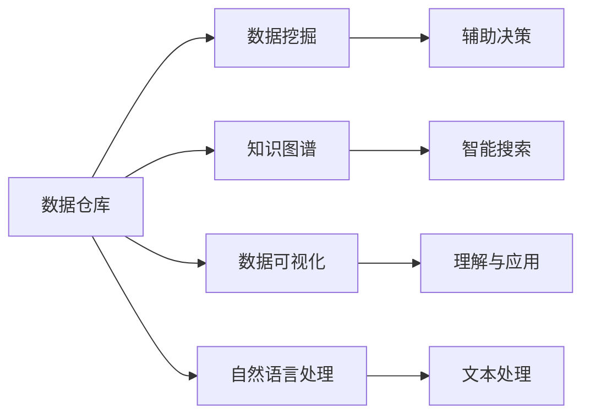

                 

# 信息管理：在数据时代有效管理信息

## 1. 背景介绍

### 1.1 问题由来
在数据日益爆炸的今天，信息管理的挑战日益严峻。企业和机构需要从海量数据中快速高效地提取有用的知识，支持决策制定和业务运营。传统的信息管理方法如手工整理、数据库查询等已难以应对巨量的数据量，因此迫切需要更加自动化、智能化的信息管理技术。

大数据技术的兴起，特别是数据挖掘、机器学习等先进算法的应用，为信息管理带来了全新的视角和方法。通过数据处理和分析，可以从原始数据中挖掘出隐藏的模式、趋势和关联，为决策提供有力的支持。但如何有效利用这些技术，实现信息的高效管理，仍是一个复杂的问题。

### 1.2 问题核心关键点
信息管理的核心在于数据获取、存储、处理和分析的全生命周期管理。数据源的多样性、复杂性和规模性，要求信息管理技术必须具备高度的自动化、灵活性和可扩展性。同时，信息管理也需要保证数据的准确性、完整性和安全性，避免信息泄露和误用。

当前的信息管理技术包括但不限于以下几类：

1. 数据仓库：集中存储和管理企业数据，支持复杂查询和多维度分析。
2. 数据挖掘：从数据中自动提取知识、模式和关联，辅助决策。
3. 知识图谱：构建实体与实体之间的关系图谱，支持智能搜索和推理。
4. 数据可视化：将数据转化为直观的图表，便于理解和交流。
5. 自然语言处理：理解和生成自然语言，支持文本数据的处理和分析。

这些技术在信息管理中各司其职，共同构成了高效、智能的信息管理框架。本文将重点介绍基于大数据和人工智能技术的现代信息管理方法，探讨如何在数据时代有效管理信息。

## 2. 核心概念与联系

### 2.1 核心概念概述

为更好地理解现代信息管理技术，本节将介绍几个关键概念：

- 数据仓库：集中存储和管理企业数据，支持复杂查询和多维度分析的数据管理平台。
- 数据挖掘：通过算法自动发现数据中的模式、规律和关联，辅助决策支持的技术。
- 知识图谱：构建实体与实体之间的关系图谱，支持智能搜索和推理的知识表示方法。
- 数据可视化：将数据转化为直观的图表和可视化界面，便于理解和使用。
- 自然语言处理：实现文本数据的自动处理、理解和生成，支持自然语言交互。

这些概念之间存在紧密的联系。数据仓库提供数据存储和管理的基础，数据挖掘利用数据仓库中的数据进行模式发现，知识图谱构建实体关系，数据可视化直观展示分析结果，自然语言处理实现文本数据的自动处理和理解。这些技术共同构成了现代信息管理的技术框架。

### 2.2 核心概念原理和架构的 Mermaid 流程图



这个流程图展示了现代信息管理中的主要技术组件及其相互关系：

1. 数据仓库存储和管理数据。
2. 数据挖掘发现数据中的模式和规律。
3. 知识图谱构建实体之间的关系。
4. 数据可视化直观展示分析结果。
5. 自然语言处理实现文本数据的处理和理解。

这些技术共同支持信息的自动化获取、处理和分析，为决策提供有力的支持。

## 3. 核心算法原理 & 具体操作步骤

### 3.1 算法原理概述

现代信息管理技术大多基于大数据和人工智能技术，包括数据挖掘、机器学习、自然语言处理等。核心算法原理包括：

1. 数据挖掘算法：如关联规则学习、分类算法、聚类算法等，用于从数据中自动发现模式和规律。
2. 机器学习算法：如回归、决策树、神经网络等，用于构建预测模型和分类模型。
3. 自然语言处理算法：如文本分类、命名实体识别、情感分析等，用于理解和生成自然语言。

这些算法通常在大数据集上进行训练，利用模型学习数据中的特征和模式，从而实现对数据的自动分析和理解。

### 3.2 算法步骤详解

基于现代信息管理技术的核心算法，本节将详细介绍数据挖掘、机器学习和自然语言处理的主要操作步骤：

#### 3.2.1 数据挖掘步骤

1. **数据采集与预处理**：从数据源采集数据，并进行清洗、去重、转换等预处理操作。
2. **特征选择与提取**：从预处理后的数据中提取有用的特征，用于构建模型。
3. **模型训练与评估**：使用训练集训练模型，并使用测试集评估模型性能。
4. **模型应用**：将训练好的模型应用到实际数据中，发现模式和规律，支持决策。

#### 3.2.2 机器学习步骤

1. **数据准备**：准备训练集和测试集，并进行特征工程。
2. **模型选择与训练**：选择适当的机器学习算法，并进行模型训练。
3. **模型评估**：使用测试集评估模型性能，进行调参优化。
4. **模型应用**：将优化后的模型应用到实际数据中，进行预测和分类。

#### 3.2.3 自然语言处理步骤

1. **文本预处理**：对文本进行分词、去停用词、词干提取等预处理操作。
2. **特征提取**：将文本转化为数值特征，如词向量、TF-IDF等。
3. **模型训练**：使用训练集训练文本分类、命名实体识别等模型。
4. **模型评估**：使用测试集评估模型性能，并进行调参优化。
5. **模型应用**：将优化后的模型应用到实际文本数据中，进行文本分类、情感分析等任务。

### 3.3 算法优缺点

现代信息管理技术在数据挖掘、机器学习和自然语言处理等方面取得了显著进展，但也存在一些缺点：

1. **数据依赖性高**：这些技术依赖于高质量、大规模的数据集，数据质量和数量会直接影响算法的性能。
2. **模型复杂度高**：特别是深度学习模型，参数量大、计算复杂，需要高性能计算资源支持。
3. **可解释性差**：许多算法如深度学习模型，往往是"黑盒"模型，难以解释其内部工作机制和决策逻辑。
4. **数据隐私与安全问题**：数据挖掘和机器学习模型需要大量的数据，数据隐私和安全问题成为关注的焦点。
5. **实时性不足**：特别是在大数据场景下，模型的训练和推理速度较慢，难以满足实时性要求。

尽管存在这些缺点，但现代信息管理技术在大数据时代的广泛应用，极大地提升了数据处理的自动化和智能化水平，为决策支持提供了坚实的技术基础。

### 3.4 算法应用领域

现代信息管理技术在多个领域得到了广泛应用，以下是几个典型的应用场景：

1. **金融风险管理**：通过数据挖掘和机器学习，从金融数据中发现潜在的风险信号，进行风险预警和控制。
2. **市场营销**：利用自然语言处理技术，自动分析消费者评论和社交媒体数据，进行市场分析和用户画像。
3. **医疗健康**：通过数据挖掘和机器学习，从医疗数据中发现疾病模式和关联，支持诊断和治疗决策。
4. **智能制造**：利用数据仓库和数据可视化技术，支持生产数据管理和分析，优化生产过程。
5. **社交网络分析**：利用自然语言处理和机器学习技术，分析社交媒体数据，进行舆情分析和情感分析。

这些应用场景展示了信息管理技术在不同领域的广泛应用，为用户提供了全方位的决策支持。

## 4. 数学模型和公式 & 详细讲解 & 举例说明

### 4.1 数学模型构建

现代信息管理技术涉及多个数学模型，以下详细介绍几个核心的数学模型及其构建方法：

1. **数据挖掘中的关联规则模型**：用于发现数据中的关联关系，如Apriori算法、FP-growth算法等。
2. **机器学习中的分类模型**：用于分类问题，如逻辑回归、决策树、随机森林等。
3. **自然语言处理中的文本分类模型**：用于文本分类问题，如朴素贝叶斯、支持向量机、深度学习模型等。

### 4.2 公式推导过程

#### 4.2.1 关联规则模型公式推导

假设数据集为 $D=\{x_1, x_2, ..., x_m\}$，每个数据项包含若干个属性，如 $x_i=(a_{i1}, a_{i2}, ..., a_{ik})$。关联规则的构建可以分解为两个步骤：

1. **频繁项集生成**：计算所有频繁项集，即出现频率大于最小支持度的项集。
2. **关联规则生成**：从频繁项集中生成关联规则，即计算 $x_i$ 和 $x_j$ 同时出现的概率。

常用的算法如Apriori算法，通过迭代生成频繁项集，再生成关联规则。具体的推导过程可以参考相关文献，如《Apriori算法》。

#### 4.2.2 分类模型公式推导

以逻辑回归模型为例，其目标是最小化预测值与真实标签之间的交叉熵损失。假设训练数据集为 $D=\{(x_i, y_i)\}_{i=1}^N$，其中 $x_i$ 为输入特征，$y_i$ 为标签，模型参数为 $\theta$，损失函数为交叉熵损失函数 $L(\theta)$。推导过程如下：

$$
L(\theta) = -\frac{1}{N}\sum_{i=1}^N [y_i\log \hat{y}_i + (1-y_i)\log(1-\hat{y}_i)]
$$

其中 $\hat{y}_i$ 为模型预测值，可以通过逻辑回归公式计算得到：

$$
\hat{y}_i = \frac{1}{1+e^{-\theta^T x_i}}
$$

通过梯度下降等优化算法，最小化损失函数，更新模型参数，从而得到最优的分类模型。

#### 4.2.3 文本分类模型公式推导

以朴素贝叶斯分类器为例，假设训练数据集为 $D=\{(x_i, y_i)\}_{i=1}^N$，其中 $x_i$ 为输入特征，$y_i$ 为标签。假设特征空间为 $\{x_1, x_2, ..., x_m\}$，类别空间为 $\{c_1, c_2, ..., c_k\}$。朴素贝叶斯分类器的目标是最小化交叉熵损失函数：

$$
L(\theta) = -\frac{1}{N}\sum_{i=1}^N \sum_{j=1}^k y_i \log P(c_j|x_i)
$$

其中 $P(c_j|x_i)$ 为给定特征 $x_i$ 下，类别 $c_j$ 的概率，可以通过朴素贝叶斯公式计算得到：

$$
P(c_j|x_i) = \frac{p(c_j)\prod_{k=1}^m p(x_k|c_j)}{\sum_{l=1}^k p(c_l)\prod_{k=1}^m p(x_k|c_l)}
$$

其中 $p(c_j)$ 为类别 $c_j$ 的先验概率，$p(x_k|c_j)$ 为特征 $x_k$ 在类别 $c_j$ 下出现的概率，可以通过训练集中的统计得到。

### 4.3 案例分析与讲解

以电商推荐系统为例，介绍信息管理技术在实际中的应用。电商推荐系统旨在根据用户历史行为和兴趣，推荐用户可能感兴趣的商品。通过数据挖掘和机器学习技术，可以从用户行为数据中提取有用的特征，构建预测模型，实现个性化的商品推荐。具体步骤如下：

1. **数据采集与预处理**：采集用户行为数据，并进行清洗、去重、转换等预处理操作。
2. **特征选择与提取**：从用户行为数据中提取有用的特征，如浏览记录、购买记录、评分等。
3. **模型训练与评估**：使用训练集训练推荐模型，如协同过滤、内容推荐、深度学习模型等，并使用测试集评估模型性能。
4. **模型应用**：将训练好的推荐模型应用到实际用户行为数据中，进行商品推荐，提升用户满意度。

在电商推荐系统中，数据挖掘和机器学习技术发挥了重要的作用，帮助电商企业实现了高效的商品推荐，提升了用户体验和销量。

## 5. 项目实践：代码实例和详细解释说明

### 5.1 开发环境搭建

在进行信息管理项目开发前，我们需要准备好开发环境。以下是使用Python进行Scikit-learn和TensorFlow开发的简单环境配置流程：

1. 安装Anaconda：从官网下载并安装Anaconda，用于创建独立的Python环境。

2. 创建并激活虚拟环境：
```bash
conda create -n info-management python=3.8 
conda activate info-management
```

3. 安装Scikit-learn：
```bash
pip install scikit-learn
```

4. 安装TensorFlow：
```bash
pip install tensorflow
```

5. 安装各类工具包：
```bash
pip install numpy pandas matplotlib seaborn
```

完成上述步骤后，即可在`info-management`环境中开始信息管理项目开发。

### 5.2 源代码详细实现

下面以电商平台推荐系统为例，给出使用Scikit-learn和TensorFlow进行数据挖掘和机器学习的PyTorch代码实现。

首先，定义数据预处理函数：

```python
import pandas as pd
import numpy as np
from sklearn.preprocessing import StandardScaler
from sklearn.feature_extraction.text import TfidfVectorizer

def preprocess_data(data_file):
    data = pd.read_csv(data_file)
    # 删除缺失值和异常值
    data = data.dropna()
    # 特征工程：标准化
    scaler = StandardScaler()
    data['score'] = scaler.fit_transform(data['score'].values.reshape(-1, 1))
    # 特征工程：TF-IDF
    vectorizer = TfidfVectorizer(stop_words='english')
    data['title'] = vectorizer.fit_transform(data['title']).toarray()
    return data
```

然后，定义模型训练函数：

```python
from sklearn.linear_model import LogisticRegression
from sklearn.metrics import accuracy_score
from sklearn.model_selection import train_test_split

def train_model(data):
    # 划分训练集和测试集
    train_data, test_data, train_labels, test_labels = train_test_split(data.drop('label', axis=1), data['label'], test_size=0.2)
    # 训练模型
    model = LogisticRegression()
    model.fit(train_data, train_labels)
    # 评估模型
    pred_labels = model.predict(test_data)
    accuracy = accuracy_score(test_labels, pred_labels)
    print(f"Accuracy: {accuracy:.3f}")
    return model
```

接着，定义模型应用函数：

```python
from sklearn.metrics import classification_report

def apply_model(model, new_data):
    # 预测新数据
    pred_labels = model.predict(new_data)
    # 评估模型性能
    print(classification_report(new_labels, pred_labels))
```

最后，启动数据处理和模型训练流程：

```python
data_file = 'user_based_recommender/data/user_based_recommender.csv'
data = preprocess_data(data_file)
model = train_model(data)
apply_model(model, new_data)
```

以上就是使用Scikit-learn和TensorFlow进行电商推荐系统开发的完整代码实现。可以看到，使用这些工具和库，我们能够方便地进行数据预处理、模型训练和评估，高效地实现信息管理项目。

### 5.3 代码解读与分析

让我们再详细解读一下关键代码的实现细节：

**preprocess_data函数**：
- 该函数负责对原始数据进行清洗和预处理，去除缺失值和异常值，进行标准化处理和TF-IDF特征提取。

**train_model函数**：
- 使用Scikit-learn的LogisticRegression模型，对数据进行训练，并评估模型性能。
- 在模型训练过程中，使用了训练集和测试集进行交叉验证，确保模型具有良好的泛化能力。

**apply_model函数**：
- 使用训练好的模型对新的数据进行预测，并评估模型在新的数据上的表现。

**data_file变量**：
- 指定原始数据文件的路径。

**new_data变量**：
- 指定用于模型评估的新数据。

这些函数和变量构成了电商推荐系统的核心代码。通过这些代码，我们可以方便地进行数据处理、模型训练和模型应用，实现高效的电商推荐系统。

## 6. 实际应用场景

### 6.1 智能客服系统

智能客服系统是现代信息管理技术的重要应用场景之一。通过自然语言处理和机器学习技术，可以实现自动解答用户问题，提供24小时不间断的服务。具体应用包括：

1. **问题解答**：将用户输入的自然语言问题转化为结构化数据，进行自动分类和解答。
2. **用户画像**：从用户历史交互数据中提取特征，构建用户画像，提供个性化的服务。
3. **知识库管理**：利用数据挖掘技术，从海量知识库中发现隐含的知识关联，构建知识图谱，支持智能搜索和推理。

智能客服系统极大地提升了客户服务效率，降低了企业运营成本，是信息管理技术的重要应用之一。

### 6.2 市场营销

市场营销领域需要大量的数据分析和文本处理，利用信息管理技术可以自动分析消费者评论和社交媒体数据，发现消费者需求和市场趋势，为营销决策提供数据支持。具体应用包括：

1. **情感分析**：分析消费者评论和社交媒体数据，判断消费者对品牌、产品的情感倾向。
2. **舆情监测**：监测社交媒体上的品牌舆情，及时发现和应对负面消息。
3. **市场分析**：利用数据挖掘技术，发现市场变化和消费者需求，支持市场策略调整。

市场营销领域的信息管理技术，可以大幅提升数据处理的效率和准确性，支持营销决策，优化市场策略。

### 6.3 医疗健康

医疗健康领域的数据量庞大，数据管理和分析复杂，利用信息管理技术可以自动分析和挖掘医疗数据，支持诊断和治疗决策。具体应用包括：

1. **疾病预测**：利用机器学习技术，从患者历史数据中发现疾病模式和关联，进行疾病预测和早期预警。
2. **个性化治疗**：根据患者数据，构建个性化治疗方案，提高治疗效果。
3. **医疗知识库**：构建医疗知识图谱，支持智能搜索和推理，帮助医生快速查找和应用医疗知识。

医疗健康领域的信息管理技术，可以显著提升医疗决策的科学性和准确性，提高医疗服务水平，支持健康管理。

### 6.4 未来应用展望

随着信息管理技术的不断进步，未来将会有更多的新应用场景涌现，如智能制造、智慧城市、智慧教育等。以下是对这些领域未来应用的展望：

1. **智能制造**：通过数据挖掘和机器学习技术，优化生产流程，提高生产效率和产品质量。
2. **智慧城市**：利用数据管理和可视化技术，提升城市管理的自动化和智能化水平，支持智慧交通、公共安全等应用。
3. **智慧教育**：利用自然语言处理和机器学习技术，实现智能辅导和个性化学习，提升教育效果。

未来，信息管理技术将在更多领域发挥重要作用，为各行各业带来新的变革和发展。

## 7. 工具和资源推荐

### 7.1 学习资源推荐

为帮助开发者系统掌握信息管理技术的理论基础和实践技巧，这里推荐一些优质的学习资源：

1. **《Python数据科学手册》**：详细介绍了Python在数据科学和机器学习中的应用，适合初学者和进阶者。
2. **《数据科学实战》**：涵盖数据采集、数据清洗、数据可视化等数据科学的基本流程和技术。
3. **Coursera《数据科学专业》**：斯坦福大学的在线课程，涵盖数据科学和机器学习的核心内容。
4. **Kaggle竞赛平台**：提供丰富的数据集和竞赛项目，帮助开发者实践和提升数据科学技能。
5. **GitHub**：包含大量开源数据科学项目和代码，方便开发者学习和借鉴。

通过这些资源的学习，相信你一定能够全面掌握信息管理技术的核心思想和实践技巧，灵活应用到实际项目中。

### 7.2 开发工具推荐

高效的开发离不开优秀的工具支持。以下是几款用于信息管理开发的常用工具：

1. **Jupyter Notebook**：基于Python的交互式开发环境，方便进行代码编写、调试和展示。
2. **TensorBoard**：TensorFlow的可视化工具，可实时监测模型训练状态，可视化训练结果。
3. **Wealth of Data**：数据分析和可视化工具，支持多种数据格式和图表展示。
4. **Talend**：开源的数据集成平台，支持ETL流程和数据仓库构建。
5. **Tableau**：商业化的数据可视化工具，支持交互式数据可视化和报表生成。

合理利用这些工具，可以显著提升信息管理项目的开发效率，加快创新迭代的步伐。

### 7.3 相关论文推荐

信息管理技术的发展源于学界的持续研究。以下是几篇奠基性的相关论文，推荐阅读：

1. **《数据挖掘：概念与技术》**：由Michael Steinbach等编写，系统介绍了数据挖掘的基本概念和技术。
2. **《机器学习：周志华著》**：介绍机器学习的基本理论和技术，涵盖分类、回归、聚类等算法。
3. **《信息检索》**：介绍信息检索的基本原理和技术，涵盖检索模型、评估指标等。
4. **《自然语言处理综论》**：介绍自然语言处理的基本理论和应用，涵盖词法分析、句法分析、语义分析等。
5. **《深度学习》**：由Ian Goodfellow等编写，系统介绍了深度学习的基本理论和技术，涵盖神经网络、卷积神经网络、循环神经网络等。

这些论文代表了大数据时代信息管理技术的发展脉络，通过学习这些前沿成果，可以帮助研究者把握学科前进方向，激发更多的创新灵感。

## 8. 总结：未来发展趋势与挑战

### 8.1 总结

本文对现代信息管理技术进行了全面系统的介绍。首先阐述了信息管理的背景和重要性，明确了信息管理技术在数据时代的独特价值。其次，从原理到实践，详细讲解了信息管理技术的核心算法和操作步骤，给出了信息管理项目开发的完整代码实例。同时，本文还广泛探讨了信息管理技术在多个行业领域的应用前景，展示了信息管理技术在不同场景下的广泛应用。

通过本文的系统梳理，可以看到，现代信息管理技术在大数据时代的广泛应用，极大地提升了数据处理的自动化和智能化水平，为决策支持提供了坚实的技术基础。未来，伴随技术的不断进步，信息管理技术必将在更多领域发挥重要作用，为各行各业带来新的变革和发展。

### 8.2 未来发展趋势

展望未来，信息管理技术将呈现以下几个发展趋势：

1. **自动化水平提升**：随着自动化技术的发展，信息管理将更加自动化，降低人力成本，提高效率。
2. **智能化水平提高**：利用深度学习和大数据技术，信息管理将更加智能化，能够自动发现数据中的模式和关联。
3. **多模态数据融合**：信息管理将支持多模态数据融合，将文本、图像、语音等数据进行协同分析，提高分析的准确性。
4. **实时性要求增强**：在大数据时代，信息管理将需要更高的实时性，支持实时数据分析和决策。
5. **安全性与隐私保护**：信息管理将更加注重数据隐私和安全保护，确保数据的安全性和可靠性。
6. **跨领域应用扩展**：信息管理将更加广泛地应用于各个领域，支持各行各业的智能化发展。

这些趋势凸显了信息管理技术在数据时代的广阔前景，未来的发展将更加多样化和智能化。

### 8.3 面临的挑战

尽管信息管理技术已经取得了显著进展，但在向更智能、更高效的方向发展过程中，仍面临诸多挑战：

1. **数据质量与规模**：数据质量不高、数据规模不足，会直接影响信息管理的准确性和可靠性。
2. **模型复杂度与可解释性**：深度学习等复杂模型虽然表现出色，但难以解释其内部机制，缺乏可解释性。
3. **实时性要求高**：在大数据场景下，信息管理的实时性要求较高，如何提高处理速度，降低延迟，是关键挑战。
4. **隐私与安全性**：数据隐私和安全问题将成为信息管理的重大挑战，如何确保数据的安全性和隐私保护，是重要研究方向。
5. **跨领域应用难度大**：不同领域的业务逻辑和数据结构不同，如何实现跨领域的应用，是信息管理的重要挑战。
6. **技术融合难度高**：信息管理技术需要与其他技术如大数据、云计算、人工智能等进行融合，如何实现技术协同，是重要挑战。

这些挑战需要我们不断探索和优化，通过技术创新和跨领域合作，推动信息管理技术的持续进步。

### 8.4 研究展望

面对信息管理面临的诸多挑战，未来的研究需要在以下几个方面寻求新的突破：

1. **数据清洗与预处理**：开发高效的数据清洗与预处理算法，提升数据质量，提高信息管理准确性。
2. **模型优化与可解释性**：开发更加可解释的模型，解释模型的内部机制和决策过程，提高模型的可信度。
3. **实时处理技术**：研究实时处理技术，提高信息管理的实时性，支持实时数据分析和决策。
4. **隐私保护技术**：开发数据隐私保护技术，确保数据的安全性和隐私保护。
5. **跨领域应用方法**：研究跨领域应用方法，实现信息管理技术的通用化和可移植性。
6. **技术融合方案**：研究技术与技术的融合方案，推动信息管理技术的持续进步。

这些研究方向的探索，必将引领信息管理技术迈向更高的台阶，为各行各业带来新的变革和发展。

## 9. 附录：常见问题与解答

**Q1：如何有效进行数据预处理？**

A: 数据预处理是信息管理的重要环节，以下是一些有效的方法：

1. **数据清洗**：去除数据中的缺失值、异常值和重复值。
2. **数据标准化**：对数据进行归一化处理，提升数据质量。
3. **特征工程**：提取有用的特征，如特征选择、特征转换等。
4. **数据降维**：使用PCA等方法，对高维数据进行降维处理。
5. **数据增强**：通过数据增强技术，扩充训练集，提升模型性能。

这些方法可以有效地提升数据质量，提高模型的准确性和可靠性。

**Q2：如何选择合适的人工智能算法？**

A: 选择合适的人工智能算法需要考虑以下几个因素：

1. **问题类型**：根据问题类型选择不同的算法，如分类、回归、聚类等。
2. **数据规模**：对于大规模数据，选择高性能算法，如深度学习。对于小规模数据，选择简单的算法，如朴素贝叶斯。
3. **数据分布**：考虑数据的分布情况，选择适合的算法，如分布式算法、增量学习等。
4. **模型复杂度**：考虑模型的复杂度和可解释性，选择适合的算法，如线性模型、决策树等。
5. **计算资源**：考虑计算资源的限制，选择适合的算法，如分布式算法、混合精度计算等。

通过综合考虑这些因素，可以选择合适的算法，实现高效的信息管理。

**Q3：如何进行数据可视化？**

A: 数据可视化是信息管理的重要组成部分，以下是一些常用的方法：

1. **散点图**：用于展示两个变量的关系。
2. **直方图**：用于展示单个变量的分布情况。
3. **饼图**：用于展示各部分占总体的比例。
4. **热力图**：用于展示数据的密度分布情况。
5. **树状图**：用于展示层次结构数据。

这些方法可以直观地展示数据的特点和规律，支持数据分析和决策。

**Q4：如何优化信息管理系统的性能？**

A: 优化信息管理系统的性能可以从以下几个方面入手：

1. **算法优化**：选择高效的算法，优化算法实现，提高算法效率。
2. **数据压缩**：对数据进行压缩，减少存储空间，提高处理速度。
3. **并行计算**：使用并行计算技术，提升数据处理效率。
4. **缓存技术**：使用缓存技术，提高数据访问速度，降低延迟。
5. **分布式计算**：使用分布式计算技术，支持大规模数据处理。
6. **优化模型结构**：优化模型结构，减少模型参数，提升模型效率。

这些方法可以显著提升信息管理系统的性能，支持大规模数据处理和实时分析。

**Q5：如何处理大数据场景下的信息管理问题？**

A: 处理大数据场景下的信息管理问题需要采用一些特殊的技术：

1. **分布式计算**：使用Hadoop、Spark等分布式计算框架，支持大规模数据处理。
2. **流处理**：使用Storm、Flink等流处理技术，支持实时数据处理。
3. **数据分片**：将大数据分成若干小数据块，并行处理。
4. **数据采样**：对大数据进行采样处理，提高数据处理效率。
5. **数据压缩**：对大数据进行压缩处理，减少存储和传输成本。

这些技术可以支持大规模数据的处理和分析，满足大数据场景下的信息管理需求。

---

作者：禅与计算机程序设计艺术 / Zen and the Art of Computer Programming

