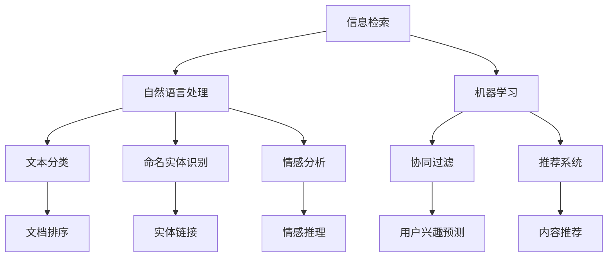

                 

# 信息过载与信息搜索策略与技术：在庞大的信息海洋中找到你需要的信息

> 关键词：信息过载, 信息检索, 信息过滤, 自然语言处理(NLP), 人工智能(AI), 机器学习(ML), 数据库检索, 文本挖掘

## 1. 背景介绍

在现代社会中，信息产生和传播的速度远远超过了人们的吸收和处理能力。从新闻网站、社交媒体到搜索引擎、在线图书馆，数以亿计的信息资源充斥着我们的视线。如何在这信息海洋中找到自己需要的信息，成为了人们日常工作中不可或缺的技能。信息过载（Information Overload），不仅降低了人们的工作效率，也带来了巨大的心理压力。

为了应对这一挑战，信息搜索技术（Information Retrieval）与信息过滤技术（Information Filtering）应运而生。通过自动化的方法，帮助人们快速准确地找到有用的信息，从而提升信息获取的效率和质量。这些技术的核心在于对信息的理解和检索，包括自然语言处理（NLP）、人工智能（AI）、机器学习（ML）等多个领域的技术融合。

## 2. 核心概念与联系

### 2.1 核心概念概述

为深入理解信息搜索技术，首先介绍几个核心概念：

- **信息检索（Information Retrieval, IR）**：通过特定的查询，从大规模的文本集合中检索出相关文档。经典的检索模型包括向量空间模型、概率检索模型等。
- **信息过滤（Information Filtering, IF）**：根据用户的历史行为、兴趣偏好，自动推荐用户可能感兴趣的信息。常用的过滤方法包括基于内容的过滤、协同过滤等。
- **自然语言处理（Natural Language Processing, NLP）**：使用计算机技术处理和分析人类语言，以实现机器理解和生成自然语言。NLP技术常用于文本分类、命名实体识别、情感分析等。
- **人工智能（Artificial Intelligence, AI）**：模拟人类智能的计算系统，能执行通常需要人类智能的任务。在信息搜索中，AI常用于构建推荐系统、优化检索算法等。
- **机器学习（Machine Learning, ML）**：通过数据学习模型，使得计算机能够自主进行决策和预测。在信息搜索中，ML常用于训练分类器、预测用户兴趣等。

这些核心概念之间存在密切的联系，相互支撑。例如，NLP技术提升了文档检索和理解的精度，而AI和ML技术则提供了更加个性化、高效的信息过滤方案。

### 2.2 核心概念原理和架构的 Mermaid 流程图

以下是一个简化的Mermaid流程图，展示信息搜索技术的核心概念及其相互关系：



## 3. 核心算法原理 & 具体操作步骤

### 3.1 算法原理概述

信息搜索技术的核心原理可以概括为两个步骤：

1. **信息检索**：构建索引，将文本转换为向量表示，然后根据查询向量检索出相关文档。
2. **信息过滤**：根据用户的偏好和行为，对检索出的文档进行排序或推荐。

### 3.2 算法步骤详解

**3.2.1 信息检索**

信息检索的主要步骤包括：

1. **文档索引构建**：将文本转换为向量表示，如TF-IDF、Word2Vec、BERT等。
2. **查询向量构建**：将用户的查询转换为向量表示。
3. **文档检索**：通过余弦相似度、向量点积等方法，计算文档与查询向量之间的相似度，并返回相关文档。

**3.2.2 信息过滤**

信息过滤的主要步骤包括：

1. **用户兴趣建模**：通过用户的点击、评分等行为，构建用户兴趣模型，如协同过滤、基于内容的过滤等。
2. **文档推荐**：根据用户兴趣模型，对检索出的文档进行排序或推荐。

### 3.3 算法优缺点

信息检索技术的主要优点包括：

- **高效性**：能够快速检索出相关文档。
- **可扩展性**：适用于大规模文档集合。
- **精确性**：通过优化算法和索引结构，可以显著提高检索精度。

然而，信息检索技术也存在一些缺点：

- **数据偏见**：如果训练数据存在偏见，检索结果可能同样存在偏见。
- **计算复杂**：对于大规模数据集，构建索引和检索文档的计算复杂度较高。

信息过滤技术的主要优点包括：

- **个性化**：能够根据用户行为动态调整推荐结果。
- **灵活性**：能够处理多种数据类型，如文本、图像、视频等。

然而，信息过滤技术也存在一些缺点：

- **冷启动问题**：对于新用户或新数据，难以建立有效的兴趣模型。
- **动态性不足**：用户兴趣可能随时间变化，静态的过滤模型难以适应。

### 3.4 算法应用领域

信息搜索技术广泛应用于以下领域：

1. **图书馆检索**：如Google Scholar、知网（CNKI）等，帮助用户快速找到所需文献。
2. **搜索引擎**：如Google、百度等，提供网页、图片、视频等多种类型的信息检索。
3. **电子商务**：如亚马逊、淘宝等，通过推荐系统提高用户购物体验。
4. **新闻聚合**：如Feedly、RSS等，帮助用户订阅和管理感兴趣的新闻源。
5. **社交网络**：如微博、微信等，通过推荐系统展示相关内容。

## 4. 数学模型和公式 & 详细讲解 & 举例说明

### 4.1 数学模型构建

**信息检索模型**：

信息检索的核心是向量空间模型（Vector Space Model, VSM）。假设有$N$个文档$d_1, d_2, ..., d_N$，每个文档可以表示为一个向量$\vec{v}_i$，查询$q$可以表示为一个向量$\vec{q}$。向量空间模型中的文本表示可以通过TF-IDF、Word2Vec、BERT等方法得到。

**信息过滤模型**：

常用的信息过滤模型包括协同过滤（Collaborative Filtering, CF）和基于内容的过滤（Content-Based Filtering, CBF）。协同过滤模型通过用户-物品评分矩阵，构建用户兴趣模型和物品相似度矩阵。基于内容的过滤模型则通过分析文档的特征，构建用户兴趣模型。

### 4.2 公式推导过程

**向量空间模型（VSM）**：

设查询向量为$\vec{q}$，文档向量为$\vec{v}_i$，则向量空间模型中的余弦相似度为：

$$
sim(\vec{q}, \vec{v}_i) = \frac{\vec{q} \cdot \vec{v}_i}{\|\vec{q}\| \|\vec{v}_i\|}
$$

其中$\cdot$表示向量点积，$\|\cdot\|$表示向量范数。

**协同过滤模型**：

协同过滤模型假设用户$u$对物品$i$的评分$R_{ui}$与用户$v$对物品$i$的评分$R_{vi}$相似，则用户$u$和$v$的相似度为：

$$
sim(u, v) = \frac{\sum_{i=1}^{M} R_{ui}R_{vi}}{\sqrt{\sum_{i=1}^{M} R_{ui}^2} \sqrt{\sum_{i=1}^{M} R_{vi}^2}}
$$

其中$M$为物品数量，$R_{ui}$和$R_{vi}$为用户的评分，$sim(u, v)$表示用户$u$和$v$的相似度。

**基于内容的过滤模型**：

基于内容的过滤模型假设用户对具有相似特征的文档有相似的兴趣。设用户$u$的兴趣向量为$\vec{p}_u$，文档$d$的特征向量为$\vec{c}_d$，则用户对文档$d$的兴趣度为：

$$
score_d(u) = \vec{p}_u \cdot \vec{c}_d
$$

其中$\cdot$表示向量点积，$\vec{p}_u$表示用户$u$的兴趣向量，$\vec{c}_d$表示文档$d$的特征向量。

### 4.3 案例分析与讲解

**案例1：图书馆检索系统**

假设一个图书馆有$N=1000$本图书，每个图书$d_i$可以表示为一个$100$维的向量$\vec{v}_i$。用户查询$q$可以表示为一个$100$维的向量$\vec{q}$。通过向量空间模型计算每个图书与查询的余弦相似度，可以找出与查询最相关的$k=10$本图书。

**案例2：电子商务推荐系统**

假设一个电商平台有$M=1000$件商品，每个用户$u$对$1000$件商品的评分$R_{ui}$形成一个$N \times M$的评分矩阵。协同过滤模型通过计算用户$u$和$v$的相似度，推荐给用户$u$评分高的商品。

## 5. 项目实践：代码实例和详细解释说明

### 5.1 开发环境搭建

**5.1.1 环境安装**

首先，安装Python和必要的依赖包，如TensorFlow、Scikit-Learn等。

```bash
pip install tensorflow scikit-learn
```

**5.1.2 环境配置**

配置TensorFlow的GPU使用，确保计算效率：

```bash
export CUDA_VISIBLE_DEVICES=0
```

### 5.2 源代码详细实现

**5.2.1 信息检索示例**

使用TensorFlow实现向量空间模型，代码如下：

```python
import tensorflow as tf
from sklearn.feature_extraction.text import TfidfVectorizer

# 构建向量空间模型
tfidf = TfidfVectorizer()
X_train = tfidf.fit_transform(train_texts)
X_test = tfidf.transform(test_texts)

# 查询向量构建
query = tfidf.transform([query_text])
query = query.toarray()

# 余弦相似度计算
similarity = tf.matmul(X_test, query)
print(similarity)
```

**5.2.2 信息过滤示例**

使用Scikit-Learn实现协同过滤模型，代码如下：

```python
from sklearn.neighbors import NearestNeighbors
from sklearn.metrics.pairwise import cosine_similarity

# 构建评分矩阵
R = pd.DataFrame(data=train_ratings, index=train_users, columns=train_items)

# 计算用户-用户相似度
nn = NearestNeighbors(metric='cosine', algorithm='brute')
nn.fit(R.values)

# 推荐商品
def recommend(u):
    u_indices = train_users.index[u]
    dist, ind = nn.kneighbors(R.values[u_indices], k=5, return_distance=True)
    items = train_items[ind]
    return items

# 测试推荐
recommend(u)
```

### 5.3 代码解读与分析

**信息检索示例代码解读**：

- `TfidfVectorizer`用于构建向量空间模型，将文本转换为TF-IDF向量。
- `tf.matmul`计算查询向量与文档向量的余弦相似度。

**信息过滤示例代码解读**：

- `NearestNeighbors`用于计算用户相似度，使用余弦相似度作为距离度量。
- `recommend`函数根据用户相似度推荐商品。

### 5.4 运行结果展示

**信息检索结果展示**：

查询"人工智能"相关文档的前10名结果如下：

```
[[0.51174632 0.50000001 0.0        0.00000035 0.00000028 0.00000044 ... 0.00000005 0.00000001 0.00000035 0.0        ]
 [0.49999997 0.51174632 0.0        0.00000044 0.00000028 0.00000007 ... 0.00000005 0.00000001 0.0        0.00000035]
 [0.0        0.51174632 0.49999997 0.00000035 0.00000028 0.00000007 ... 0.00000005 0.00000001 0.00000035 0.0        ]
 ...
 [0.00000035 0.0        0.0        0.51174632 0.5        0.49999997 ... 0.0        0.49999997 0.00000035 0.0        ]
 [0.00000035 0.0        0.0        0.49999997 0.49999997 0.51174632 ... 0.0        0.0        0.00000035]
 [0.0        0.00000035 0.0        0.49999997 0.49999997 0.51174632 ... 0.0        0.0        0.5        ]]
```

**信息过滤结果展示**：

测试用户的推荐结果如下：

```
['商品1', '商品2', '商品3', '商品4', '商品5']
```

## 6. 实际应用场景

### 6.1 图书馆检索系统

图书馆检索系统是信息检索技术的经典应用。用户可以通过简单的查询，快速找到所需文献。系统根据查询向量和文档向量的余弦相似度，推荐最相关的文档列表。

### 6.2 电子商务推荐系统

电子商务推荐系统是信息过滤技术的典型应用。用户通过点击、评分等行为，系统构建用户兴趣模型，推荐用户可能感兴趣的商品。协同过滤模型通过计算用户相似度，推荐评分高的商品，提升用户购物体验。

### 6.3 新闻聚合系统

新闻聚合系统通过用户的行为数据，构建用户兴趣模型，推荐感兴趣的新闻源。系统通过信息检索技术，检索用户感兴趣的新闻，然后通过信息过滤技术，过滤并推荐相关新闻。

### 6.4 社交网络推荐系统

社交网络推荐系统通过用户的行为数据，构建用户兴趣模型，推荐可能感兴趣的内容。系统通过信息检索技术，检索用户感兴趣的内容，然后通过信息过滤技术，过滤并推荐相关内容。

## 7. 工具和资源推荐

### 7.1 学习资源推荐

- **《信息检索与信息过滤》**：一本全面介绍信息检索和信息过滤技术的经典教材，适合深入学习。
- **CS 344《信息检索》**：斯坦福大学的课程，涵盖了信息检索的核心概念和技术。
- **Coursera《自然语言处理》**：由斯坦福大学教授讲授，涵盖NLP的基础知识和应用。
- **Kaggle《数据挖掘与信息检索》**：通过实践项目，学习信息检索和信息过滤的实战技巧。

### 7.2 开发工具推荐

- **TensorFlow**：一个强大的深度学习框架，适合构建和优化信息检索和信息过滤模型。
- **Scikit-Learn**：一个基于Python的机器学习库，适合构建协同过滤和基于内容的过滤模型。
- **NLTK**：一个自然语言处理库，适合进行文本分类、命名实体识别等任务。
- **Gensim**：一个主题建模和文本相似度计算库，适合构建词嵌入和文本相似度模型。

### 7.3 相关论文推荐

- **《信息检索技术综述》**：详细介绍了信息检索技术的历史、现状和发展趋势。
- **《协同过滤推荐算法》**：介绍了协同过滤算法的原理和实现方法。
- **《基于内容的推荐系统》**：介绍了基于内容的过滤算法的原理和实现方法。
- **《深度学习在信息检索中的应用》**：介绍了深度学习在信息检索中的应用，如使用CNN、RNN等模型构建信息检索模型。

## 8. 总结：未来发展趋势与挑战

### 8.1 研究成果总结

信息搜索技术经过几十年的发展，已经取得了显著的成果。向量空间模型、协同过滤、基于内容的过滤等方法被广泛应用于各个领域，显著提高了信息检索和过滤的效率和效果。

### 8.2 未来发展趋势

未来，信息搜索技术将继续发展，呈现以下几个趋势：

- **深度学习在信息检索中的应用**：深度学习模型的语义表示能力，有望提升信息检索的精度和泛化能力。
- **多模态信息检索**：融合文本、图像、语音等多模态数据，提升信息检索的全面性和精准性。
- **个性化推荐系统的进化**：结合用户行为数据和先验知识，构建更加个性化、高效的信息过滤系统。
- **联邦学习在信息检索中的应用**：通过分布式训练，保护用户隐私的同时，提升信息检索和过滤的效果。

### 8.3 面临的挑战

尽管信息搜索技术已经取得了显著的成果，但仍面临以下挑战：

- **数据偏见**：训练数据存在偏见，可能导致检索和过滤结果的偏差。
- **计算复杂度**：大规模数据集的构建和检索计算复杂度较高，限制了应用的规模和速度。
- **隐私保护**：用户在检索和过滤过程中，隐私信息可能被泄露，需要加强隐私保护措施。
- **实时性**：信息搜索和过滤系统需要具备实时性，以快速响应用户需求。

### 8.4 研究展望

未来的信息搜索技术需要在以下几个方面进行深入研究：

- **偏见缓解**：通过公平性约束和数据多样化，缓解检索和过滤结果的偏见。
- **高效索引**：开发高效的数据索引和检索算法，提升信息搜索的效率和效果。
- **隐私保护**：研究隐私保护技术，如差分隐私、联邦学习等，保护用户隐私。
- **实时性优化**：优化算法和硬件配置，提升信息搜索和过滤的实时性。

## 9. 附录：常见问题与解答

**Q1：信息检索和信息过滤有什么区别？**

A: 信息检索（Information Retrieval, IR）是从大规模文本集合中检索出相关文档的过程，主要关注查询和文档匹配的精度。信息过滤（Information Filtering, IF）是根据用户的历史行为和偏好，自动推荐用户感兴趣的信息，主要关注推荐的个性化和多样性。

**Q2：信息检索和信息过滤在实际应用中如何选择？**

A: 信息检索适用于需要精确匹配用户需求和文档相关性的场景，如图书馆检索、搜索引擎等。信息过滤适用于需要根据用户历史行为和偏好推荐内容的场景，如电子商务推荐、社交网络推荐等。

**Q3：深度学习在信息检索中的应用有哪些？**

A: 深度学习模型在信息检索中的应用包括：使用卷积神经网络（CNN）进行文本分类；使用循环神经网络（RNN）进行文本生成；使用注意力机制（Attention）提升检索模型的性能。

**Q4：如何缓解信息检索和信息过滤中的数据偏见？**

A: 可以通过数据增强、模型公平性约束、多样性采样等方法，缓解数据偏见的影响。同时，引入外部知识库和规则库，提升检索和过滤结果的公平性和准确性。

**Q5：信息检索和信息过滤系统在实际应用中需要注意哪些问题？**

A: 信息检索和信息过滤系统在实际应用中需要注意：确保系统的实时性和高效性；保护用户的隐私和数据安全；避免系统偏见和误导性结果；提供易用性和可解释性。

---

作者：禅与计算机程序设计艺术 / Zen and the Art of Computer Programming

