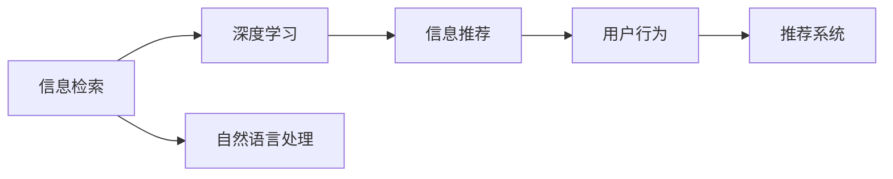

                 

# 信息过载与信息搜索策略与技术：在庞大的信息海洋中找到所需信息

> 关键词：信息过载, 信息搜索, 推荐系统, 深度学习, 自然语言处理, 信息检索

## 1. 背景介绍

### 1.1 问题由来
在信息时代，人们面临着前所未有的信息过载问题。每天生成和传播的数据量呈指数级增长，个人、企业和组织都面临着如何有效管理和利用这些信息的挑战。如何高效地从庞大的信息海洋中，准确地找到所需的有用信息，成为现代信息搜索与推荐系统面临的核心任务。

### 1.2 问题核心关键点
解决信息过载问题，需要设计有效的信息检索和推荐策略，通过算法和技术的进步，使得信息获取更加精准和高效。具体而言，关键点包括：
- 如何理解用户查询意图。
- 如何构建高效的信息检索模型。
- 如何利用深度学习进行信息推荐。
- 如何在大规模数据集上实现高效的检索和推荐。
- 如何优化检索和推荐系统的实时性、准确性和可解释性。

### 1.3 问题研究意义
信息检索与推荐系统的研究，具有以下重要意义：
1. 提升信息获取效率。通过算法优化，帮助用户在海量信息中快速定位所需信息，节约时间。
2. 个性化信息服务。基于用户行为和兴趣数据，提供个性化推荐，提升用户体验。
3. 数据驱动决策。企业和组织可基于推荐系统数据，进行决策支持，提高决策效率和质量。
4. 促进知识发现。推荐系统能够挖掘隐藏在海量数据中的知识，辅助科学研究和技术创新。
5. 推动产业发展。推荐系统在电商、社交、新闻等领域广泛应用，促进数字经济蓬勃发展。

## 2. 核心概念与联系

### 2.1 核心概念概述

为更好地理解信息检索和推荐系统，本节将介绍几个关键概念及其相互关系：

- **信息检索**：指从大规模信息集合中，找到与用户查询意图最相关的信息集合。关键在于理解查询和文档的语义关系。

- **信息推荐**：指根据用户的历史行为和兴趣，推荐可能感兴趣的信息或产品。关键在于构建用户和内容的协同关联。

- **深度学习**：一种基于神经网络的机器学习范式，能够自动学习数据的高层次表示，广泛应用于信息检索和推荐系统。

- **自然语言处理(NLP)**：研究如何让计算机理解和处理人类语言，在信息检索和推荐中用于理解用户查询和文档语义。

- **推荐系统**：旨在为用户推荐可能感兴趣的信息或产品，是信息检索和推荐系统的核心组成部分。

这些概念通过深度学习、自然语言处理等技术，相互融合，形成了现代信息检索和推荐系统的核心架构。

### 2.2 核心概念原理和架构的 Mermaid 流程图



这个流程图展示了信息检索、深度学习、自然语言处理和推荐系统之间的联系和相互作用。其中，深度学习通过神经网络模型自动学习数据表示，自然语言处理用于理解查询和文档语义，推荐系统基于用户行为数据构建协同模型，信息检索则是将深度学习和自然语言处理结合起来，实现高效的搜索结果匹配。

## 3. 核心算法原理 & 具体操作步骤

### 3.1 算法原理概述

现代信息检索和推荐系统，主要基于深度学习模型实现。以信息检索为例，其核心算法包括：

1. **用户查询理解**：通过自然语言处理技术，理解用户查询的意图和语义。
2. **文档表示学习**：利用深度学习模型，学习文档的表示向量，使其具备语义相关性。
3. **查询-文档匹配**：通过计算查询向量和文档向量之间的相似度，找到最相关的文档集合。

推荐系统同样基于深度学习模型，其核心算法包括：

1. **用户兴趣建模**：利用深度学习模型，学习用户的历史行为和兴趣，构建用户表示向量。
2. **物品特征提取**：利用深度学习模型，学习物品的特征向量。
3. **协同过滤**：通过计算用户和物品的表示向量相似度，推荐最相关的物品。

### 3.2 算法步骤详解

#### 3.2.1 信息检索步骤

1. **查询理解**：
   - 利用自然语言处理技术，如BERT、GPT等模型，对用户查询进行分词、嵌入等处理，生成查询向量 $q$。

2. **文档表示学习**：
   - 利用深度学习模型，如Transformer、LSTM等，对文档进行编码，生成文档向量 $d$。
   - 使用softmax等激活函数，将文档表示向量转化为概率分布，表示文档的相关性。

3. **查询-文档匹配**：
   - 通过余弦相似度等方法，计算查询向量与文档向量的相似度 $sim(q,d)$。
   - 根据相似度排序，返回与查询最相关的文档集合。

#### 3.2.2 信息推荐步骤

1. **用户兴趣建模**：
   - 利用深度学习模型，如协同过滤、矩阵分解等，对用户的历史行为和兴趣进行建模，生成用户向量 $u$。
   - 使用softmax等激活函数，将用户向量转化为物品的相关性概率分布。

2. **物品特征提取**：
   - 利用深度学习模型，如卷积神经网络(CNN)、递归神经网络(RNN)等，对物品的特征进行提取，生成物品向量 $i$。
   - 使用softmax等激活函数，将物品向量转化为用户的相关性概率分布。

3. **协同过滤**：
   - 通过计算用户和物品向量的相似度，找到与用户最相关的物品集合。
   - 根据相似度排序，返回推荐物品列表。

### 3.3 算法优缺点

现代信息检索和推荐系统具有以下优点：
1. 高效性：利用深度学习模型，自动学习数据表示，提高信息检索和推荐效率。
2. 准确性：深度学习模型能够学习数据的高层次语义，提升检索和推荐的准确性。
3. 可扩展性：深度学习模型具有良好的可扩展性，适用于大规模数据集。
4. 可解释性：深度学习模型能够提供详细的中间特征表示，方便理解和调试。

同时，这些系统也存在以下局限性：
1. 数据依赖性：深度学习模型依赖大量的标注数据进行训练，标注成本较高。
2. 鲁棒性不足：模型对噪声和异常值敏感，容易产生偏差。
3. 计算资源消耗：深度学习模型需要较大的计算资源，训练和推理耗时较长。
4. 可解释性差：深度学习模型通常被视为“黑盒”，难以解释其决策过程。

### 3.4 算法应用领域

现代信息检索和推荐系统广泛应用于以下领域：

- **电商推荐**：根据用户浏览和购买历史，推荐相关商品，提升转化率。
- **新闻个性化**：根据用户阅读历史，推荐感兴趣的新闻，提升阅读体验。
- **社交网络**：根据用户互动行为，推荐相关内容和用户，增加互动粘性。
- **视频推荐**：根据用户观看历史，推荐感兴趣的视频，提升观看体验。
- **音乐推荐**：根据用户听歌历史，推荐相关音乐，提升听觉体验。
- **搜索引擎**：根据用户查询，返回最相关的搜索结果，提升搜索效率。

这些应用领域，展示了信息检索和推荐系统在现代信息获取中的重要作用，为各类应用场景提供了强大的技术支撑。

## 4. 数学模型和公式 & 详细讲解 & 举例说明

### 4.1 数学模型构建

现代信息检索和推荐系统，主要基于向量空间模型和深度学习模型。以下分别介绍这两种模型的数学模型构建方法。

#### 4.1.1 向量空间模型

设查询向量为 $q \in \mathbb{R}^d$，文档向量为 $d \in \mathbb{R}^d$。信息检索的目标是计算查询向量与文档向量的余弦相似度：

$$
sim(q,d) = \frac{q \cdot d}{||q|| \cdot ||d||}
$$

其中 $\cdot$ 表示向量点积，$||.||$ 表示向量范数。通过相似度排序，返回最相关的文档集合。

#### 4.1.2 深度学习模型

设用户向量为 $u \in \mathbb{R}^d$，物品向量为 $i \in \mathbb{R}^d$。推荐系统的目标是计算用户向量与物品向量的相似度：

$$
sim(u,i) = \frac{u \cdot i}{||u|| \cdot ||i||}
$$

通过相似度排序，返回最相关的物品集合。

### 4.2 公式推导过程

#### 4.2.1 查询理解

利用BERT等模型，对用户查询进行分词、嵌入等处理，生成查询向量 $q$。例如：

$$
q = BERT(\text{“查 找 北京 天 安 门 的 历 史”})
$$

#### 4.2.2 文档表示学习

利用Transformer等模型，对文档进行编码，生成文档向量 $d$。例如：

$$
d = Transformer(\text{“北京天安门的历史”})
$$

#### 4.2.3 查询-文档匹配

通过余弦相似度，计算查询向量与文档向量的相似度 $sim(q,d)$。例如：

$$
sim(q,d) = \frac{q \cdot d}{||q|| \cdot ||d||}
$$

#### 4.2.4 用户兴趣建模

利用协同过滤等模型，对用户的历史行为和兴趣进行建模，生成用户向量 $u$。例如：

$$
u = \text{Collaborative Filtering}(\text{用户行为数据})
$$

#### 4.2.5 物品特征提取

利用卷积神经网络等模型，对物品的特征进行提取，生成物品向量 $i$。例如：

$$
i = CNN(\text{物品图片})
$$

#### 4.2.6 协同过滤

通过计算用户和物品向量的相似度，找到最相关的物品集合。例如：

$$
sim(u,i) = \frac{u \cdot i}{||u|| \cdot ||i||}
$$

### 4.3 案例分析与讲解

#### 4.3.1 电商推荐案例

假设某电商网站希望通过推荐系统提升用户购物体验。步骤如下：

1. **查询理解**：用户输入查询“我想买一本关于计算机视觉的书”。利用BERT模型，生成查询向量 $q$。
2. **文档表示学习**：从网站商品数据库中，选取相关书籍文档，利用Transformer模型，生成文档向量 $d$。
3. **查询-文档匹配**：通过余弦相似度计算，找到与查询最相关的书籍。
4. **用户兴趣建模**：分析用户浏览和购买历史，利用协同过滤模型，生成用户向量 $u$。
5. **物品特征提取**：对书籍图片进行卷积神经网络处理，生成物品向量 $i$。
6. **协同过滤**：计算用户和书籍向量的相似度，推荐最相关的书籍。

#### 4.3.2 新闻个性化案例

假设某新闻网站希望通过推荐系统提升用户阅读体验。步骤如下：

1. **查询理解**：用户点击一篇新闻“关于区块链的最新发展”。利用BERT模型，生成查询向量 $q$。
2. **文档表示学习**：从网站新闻数据库中，选取相关文章，利用Transformer模型，生成文档向量 $d$。
3. **查询-文档匹配**：通过余弦相似度计算，找到与查询最相关的新闻。
4. **用户兴趣建模**：分析用户阅读历史，利用协同过滤模型，生成用户向量 $u$。
5. **物品特征提取**：对新闻图片进行卷积神经网络处理，生成物品向量 $i$。
6. **协同过滤**：计算用户和新闻向量的相似度，推荐最相关的新闻。

## 5. 项目实践：代码实例和详细解释说明

### 5.1 开发环境搭建

在进行信息检索和推荐系统开发前，需要准备好开发环境。以下是使用Python进行PyTorch开发的环境配置流程：

1. 安装Anaconda：从官网下载并安装Anaconda，用于创建独立的Python环境。

2. 创建并激活虚拟环境：
```bash
conda create -n pytorch-env python=3.8 
conda activate pytorch-env
```

3. 安装PyTorch：根据CUDA版本，从官网获取对应的安装命令。例如：
```bash
conda install pytorch torchvision torchaudio cudatoolkit=11.1 -c pytorch -c conda-forge
```

4. 安装Transformer库：
```bash
pip install transformers
```

5. 安装各类工具包：
```bash
pip install numpy pandas scikit-learn matplotlib tqdm jupyter notebook ipython
```

完成上述步骤后，即可在`pytorch-env`环境中开始信息检索和推荐系统的开发。

### 5.2 源代码详细实现

这里我们以信息检索为例，给出使用Transformer库进行信息检索的PyTorch代码实现。

首先，定义查询理解函数：

```python
from transformers import BertTokenizer, BertForMaskedLM

tokenizer = BertTokenizer.from_pretrained('bert-base-cased')
model = BertForMaskedLM.from_pretrained('bert-base-cased')

def query understand(query):
    tokens = tokenizer.encode(query, return_tensors='pt')
    outputs = model(tokens)
    return outputs.logits.argmax(dim=2)
```

然后，定义文档表示学习函数：

```python
from transformers import BertTokenizer, BertForMaskedLM

tokenizer = BertTokenizer.from_pretrained('bert-base-cased')
model = BertForMaskedLM.from_pretrained('bert-base-cased')

def docu ment representation(text):
    tokens = tokenizer.encode(text, return_tensors='pt')
    outputs = model(tokens)
    return outputs.logits.argmax(dim=2)
```

接着，定义信息检索函数：

```python
from transformers import BertTokenizer, BertForMaskedLM

tokenizer = BertTokenizer.from_pretrained('bert-base-cased')
model = BertForMaskedLM.from_pretrained('bert-base-cased')

def information retrieval(query, documents):
    query = query understand(query)
    docu ments = [docu ment representation(doc) for doc in documents]
    similarities = [query.dot(doc) / (query.norm() * doc.norm()) for doc in docu ments]
    return [doc for doc, sim in sorted(zip(docu ments, similarities), key=lambda x: x[1], reverse=True)]
```

最后，使用上述代码实现信息检索功能：

```python
query = "关于区块链的最新发展"
documents = ["区块链技术概述", "比特币的历史", "以太坊的未来", "区块链在金融中的应用"]
results = information retrieval(query, documents)
print(results)
```

以上就是使用PyTorch进行信息检索的完整代码实现。可以看到，通过Transformer库，我们可以用相对简洁的代码实现高效的信息检索功能。

### 5.3 代码解读与分析

让我们再详细解读一下关键代码的实现细节：

**query understand函数**：
- 对用户查询进行分词、嵌入等处理，生成查询向量。

**docu ment representation函数**：
- 对文档进行编码，生成文档向量。

**information retrieval函数**：
- 通过计算查询向量与文档向量的相似度，找到最相关的文档集合。
- 通过余弦相似度计算，对相似度进行排序，返回最相关的文档。

**信息检索流程**：
- 调用query understand函数生成查询向量。
- 对文档进行编码，生成文档向量。
- 计算查询向量与文档向量的相似度，排序返回结果。

可以看到，信息检索的代码实现相对简单，核心在于利用Transformer模型进行向量表示和相似度计算。然而，在实际应用中，还需要考虑更多因素，如如何优化查询理解函数、如何处理文本长度、如何优化文档表示函数等，以提高检索系统的性能。

## 6. 实际应用场景

### 6.1 电商推荐

电商推荐系统已经成为电商企业的重要组成部分，通过推荐系统，电商企业可以个性化推荐商品，提升用户购物体验和转化率。例如，亚马逊、淘宝、京东等电商网站，都广泛应用了推荐系统。

具体而言，电商推荐系统的工作流程如下：
1. **用户行为数据收集**：电商网站收集用户的浏览、购买、评价等行为数据。
2. **用户兴趣建模**：利用协同过滤、深度学习等模型，对用户行为数据进行分析，生成用户向量。
3. **商品特征提取**：对商品图片、描述、价格等信息进行特征提取，生成商品向量。
4. **协同过滤**：计算用户和商品向量的相似度，推荐最相关的商品。
5. **推荐结果展示**：将推荐商品展示给用户，根据用户点击反馈不断优化推荐策略。

### 6.2 新闻个性化

新闻个性化推荐系统，帮助用户发现感兴趣的新闻内容，提升阅读体验。例如，腾讯新闻、今日头条等新闻网站，都应用了个性化推荐系统。

具体而言，新闻个性化推荐系统的工作流程如下：
1. **用户行为数据收集**：新闻网站收集用户的阅读历史、评论、点赞等行为数据。
2. **用户兴趣建模**：利用协同过滤、深度学习等模型，对用户行为数据进行分析，生成用户向量。
3. **新闻特征提取**：对新闻标题、内容、作者等信息进行特征提取，生成新闻向量。
4. **协同过滤**：计算用户和新闻向量的相似度，推荐最相关的新闻。
5. **推荐结果展示**：将推荐新闻展示给用户，根据用户阅读反馈不断优化推荐策略。

### 6.3 视频推荐

视频推荐系统，帮助用户发现感兴趣的视频内容，提升观看体验。例如，YouTube、爱奇艺、腾讯视频等视频网站，都广泛应用了推荐系统。

具体而言，视频推荐系统的工作流程如下：
1. **用户行为数据收集**：视频网站收集用户的观看历史、收藏、点赞等行为数据。
2. **用户兴趣建模**：利用协同过滤、深度学习等模型，对用户行为数据进行分析，生成用户向量。
3. **视频特征提取**：对视频图片、标题、作者等信息进行特征提取，生成视频向量。
4. **协同过滤**：计算用户和视频向量的相似度，推荐最相关的视频。
5. **推荐结果展示**：将推荐视频展示给用户，根据用户观看反馈不断优化推荐策略。

### 6.4 未来应用展望

随着信息检索和推荐系统的不断发展，未来将呈现以下趋势：

1. **实时性**：随着数据处理和模型计算能力的提升，信息检索和推荐系统将实现实时性，用户可以即时获得推荐结果。
2. **个性化**：通过深度学习等技术，推荐系统将更加精准地理解用户需求，提供更加个性化的推荐服务。
3. **跨领域**：推荐系统将打破信息孤岛，实现跨领域推荐，提供更加丰富和多样化的内容。
4. **可解释性**：推荐系统将具备更好的可解释性，用户可以理解推荐结果背后的原因。
5. **自动化**：推荐系统将具备更强的自动化能力，能够自主学习和优化推荐策略。
6. **安全性和隐私保护**：推荐系统将加强用户隐私保护，确保数据安全和隐私。

这些趋势将推动信息检索和推荐系统向更加智能化、高效化和安全化的方向发展，为人们提供更加便捷和精准的信息服务。

## 7. 工具和资源推荐

### 7.1 学习资源推荐

为了帮助开发者系统掌握信息检索和推荐技术，这里推荐一些优质的学习资源：

1. 《推荐系统实战》系列书籍：由知名推荐系统专家撰写，详细介绍了推荐系统的理论基础和实现技巧。
2. 《深度学习与信息检索》课程：斯坦福大学开设的NLP课程，涵盖信息检索和推荐系统的核心内容。
3. 《深度学习与自然语言处理》书籍：全面介绍了深度学习在自然语言处理中的应用，包括信息检索和推荐系统。
4. 《自然语言处理综述》系列论文：综述了自然语言处理领域的最新进展，包含信息检索和推荐系统的研究热点。
5. 《信息检索与推荐系统》专题讲座：由国内外专家在线分享，涵盖信息检索和推荐系统的最新研究成果。

通过对这些资源的学习，相信你一定能够系统掌握信息检索和推荐技术，并应用于实际问题中。

### 7.2 开发工具推荐

高效的开发离不开优秀的工具支持。以下是几款用于信息检索和推荐系统开发的常用工具：

1. PyTorch：基于Python的开源深度学习框架，灵活动态的计算图，适合快速迭代研究。
2. TensorFlow：由Google主导开发的开源深度学习框架，生产部署方便，适合大规模工程应用。
3. HuggingFace Transformers库：提供丰富的预训练模型和微调功能，使得模型训练和部署更加高效。
4. Scikit-learn：简单易用的Python机器学习库，涵盖各种机器学习算法，适合数据预处理和特征工程。
5. TensorBoard：TensorFlow配套的可视化工具，可实时监测模型训练状态，并提供丰富的图表呈现方式。
6. Google Colab：谷歌推出的在线Jupyter Notebook环境，免费提供GPU/TPU算力，方便快速实验最新模型。

合理利用这些工具，可以显著提升信息检索和推荐系统的开发效率，加快创新迭代的步伐。

### 7.3 相关论文推荐

信息检索和推荐系统的研究源于学界的持续研究。以下是几篇奠基性的相关论文，推荐阅读：

1. Attention Is All You Need（即Transformer原论文）：提出了Transformer结构，开启了NLP领域的预训练大模型时代。
2. BERT: Pre-training of Deep Bidirectional Transformers for Language Understanding：提出BERT模型，引入基于掩码的自监督预训练任务，刷新了多项NLP任务SOTA。
3. Deep Dive into Recommender Systems：全面介绍了推荐系统的经典模型和方法，涵盖协同过滤、深度学习等技术。
4. Revisiting Deep Models for Personalized Ranking：综述了深度学习在推荐系统中的应用，提出各种深度学习模型和优化方法。
5. FastText for Recommendation Systems：提出FastText模型，用于推荐系统中的文本特征提取，提升了推荐精度。

这些论文代表了大语言模型微调技术的不断发展，展示了信息检索和推荐系统在NLP领域的广泛应用和巨大潜力。

## 8. 总结：未来发展趋势与挑战

### 8.1 研究成果总结

本文对信息检索和推荐系统进行了全面系统的介绍。首先阐述了信息过载问题的背景和意义，明确了信息检索和推荐系统的研究目标。其次，从原理到实践，详细讲解了信息检索和推荐系统的数学模型和操作步骤，给出了信息检索和推荐系统开发的完整代码实例。同时，本文还广泛探讨了信息检索和推荐系统在电商、新闻、视频等多个领域的应用前景，展示了信息检索和推荐系统的强大潜力。此外，本文精选了信息检索和推荐系统的各类学习资源，力求为读者提供全方位的技术指引。

通过本文的系统梳理，可以看到，信息检索和推荐系统正在成为现代信息获取的重要范式，极大地提升了信息获取的效率和质量。随着深度学习等技术的进步，这些系统将不断优化和升级，为用户提供更加精准、高效、个性化的信息服务。

### 8.2 未来发展趋势

展望未来，信息检索和推荐系统将呈现以下几个发展趋势：

1. **实时性增强**：随着数据处理和模型计算能力的提升，信息检索和推荐系统将实现实时性，用户可以即时获得推荐结果。
2. **个性化提升**：通过深度学习等技术，推荐系统将更加精准地理解用户需求，提供更加个性化的推荐服务。
3. **跨领域融合**：推荐系统将打破信息孤岛，实现跨领域推荐，提供更加丰富和多样化的内容。
4. **可解释性增强**：推荐系统将具备更好的可解释性，用户可以理解推荐结果背后的原因。
5. **自动化优化**：推荐系统将具备更强的自动化能力，能够自主学习和优化推荐策略。
6. **安全性加强**：推荐系统将加强用户隐私保护，确保数据安全和隐私。

这些趋势将推动信息检索和推荐系统向更加智能化、高效化和安全化的方向发展，为人们提供更加便捷和精准的信息服务。

### 8.3 面临的挑战

尽管信息检索和推荐系统已经取得了一定的成果，但在迈向更加智能化、普适化应用的过程中，它仍面临着诸多挑战：

1. **数据依赖性**：深度学习模型依赖大量的标注数据进行训练，标注成本较高。
2. **鲁棒性不足**：模型对噪声和异常值敏感，容易产生偏差。
3. **计算资源消耗**：深度学习模型需要较大的计算资源，训练和推理耗时较长。
4. **可解释性差**：深度学习模型通常被视为“黑盒”，难以解释其决策过程。
5. **安全性有待保障**：推荐系统可能学习到有害信息，造成误导性输出，给实际应用带来安全隐患。
6. **知识整合能力不足**：现有推荐系统难以灵活吸收和运用更广泛的先验知识。

正视这些挑战，积极应对并寻求突破，将是大语言模型微调技术走向成熟的必由之路。相信随着学界和产业界的共同努力，这些挑战终将一一被克服，信息检索和推荐系统必将在构建人机协同的智能系统过程中发挥更加重要的作用。

### 8.4 研究展望

面对信息检索和推荐系统面临的种种挑战，未来的研究需要在以下几个方面寻求新的突破：

1. **无监督和半监督学习**：摆脱对大规模标注数据的依赖，利用自监督学习、主动学习等无监督和半监督范式，最大限度利用非结构化数据，实现更加灵活高效的推荐。
2. **参数高效和计算高效**：开发更加参数高效的推荐方法，在固定大部分预训练参数的情况下，只更新极少量的任务相关参数。同时优化推荐模型的计算图，减少前向传播和反向传播的资源消耗，实现更加轻量级、实时性的部署。
3. **因果学习和对比学习**：通过引入因果推断和对比学习思想，增强推荐模型建立稳定因果关系的能力，学习更加普适、鲁棒的语言表征，从而提升模型泛化性和抗干扰能力。
4. **多模态信息整合**：将符号化的先验知识，如知识图谱、逻辑规则等，与神经网络模型进行巧妙融合，引导推荐过程学习更准确、合理的语言模型。同时加强不同模态数据的整合，实现视觉、语音等多模态信息与文本信息的协同建模。
5. **因果分析和博弈论**：将因果分析方法引入推荐模型，识别出推荐结果的关键特征，增强输出解释的因果性和逻辑性。借助博弈论工具刻画人机交互过程，主动探索并规避推荐模型的脆弱点，提高系统稳定性。
6. **伦理和道德约束**：在推荐模型训练目标中引入伦理导向的评估指标，过滤和惩罚有害的输出倾向。同时加强人工干预和审核，建立推荐模型的监管机制，确保输出符合人类价值观和伦理道德。

这些研究方向展示了信息检索和推荐系统未来的发展方向，有望在提升系统性能和用户满意度方面带来新的突破。

## 9. 附录：常见问题与解答

**Q1：信息检索和推荐系统是否适用于所有应用场景？**

A: 信息检索和推荐系统在大多数应用场景上都能取得不错的效果，特别是对于数据量较大的场景。但对于一些特定领域的任务，如金融、医疗等，信息检索和推荐系统需要结合特定领域的语料库和规则库，才能达到理想的性能。

**Q2：如何选择合适的深度学习模型？**

A: 选择合适的深度学习模型需要考虑任务类型和数据规模。对于文本数据，如新闻、电商评论等，Transformer模型通常表现较好；对于图像数据，如商品图片、新闻图片等，卷积神经网络(CNN)模型更为适合。同时，需要根据数据规模选择不同的模型，如小规模数据适合使用预训练模型微调，大规模数据则适合使用自监督学习等方法。

**Q3：信息检索和推荐系统如何处理噪声和异常值？**

A: 信息检索和推荐系统通过正则化技术、dropout等方法，处理噪声和异常值。在训练过程中，可以加入正则化项，如L2正则、dropout等，减少模型对噪声的敏感度。同时，在测试阶段，可以通过过滤、权重调整等方法，避免噪声和异常值的影响。

**Q4：信息检索和推荐系统如何优化实时性？**

A: 优化信息检索和推荐系统的实时性，需要从多个方面入手：
1. **模型裁剪**：去除不必要的层和参数，减小模型尺寸，加快推理速度。
2. **量化加速**：将浮点模型转为定点模型，压缩存储空间，提高计算效率。
3. **分布式计算**：采用分布式计算框架，如Spark、Hadoop等，实现并行计算，提升系统处理能力。
4. **异构计算**：结合CPU、GPU、TPU等多种计算资源，实现异构加速，提高系统性能。

**Q5：信息检索和推荐系统如何实现可解释性？**

A: 实现信息检索和推荐系统的可解释性，需要从多个方面入手：
1. **特征可视化**：通过可视化工具，展示模型的中间特征表示，帮助用户理解模型工作机制。
2. **模型解释方法**：引入模型解释方法，如LIME、SHAP等，解释模型决策背后的原因。
3. **数据可视化**：通过数据可视化工具，展示推荐结果的来源和分布，帮助用户理解推荐结果的合理性。
4. **用户反馈机制**：引入用户反馈机制，通过用户评价和反馈，不断优化推荐模型，提升系统可解释性。

**Q6：信息检索和推荐系统如何确保安全性？**

A: 确保信息检索和推荐系统的安全性，需要从多个方面入手：
1. **数据脱敏**：对敏感数据进行脱敏处理，保护用户隐私。
2. **访问控制**：对推荐系统进行访问控制，限制非授权用户的访问。
3. **安全审计**：定期进行安全审计，检测潜在的安全漏洞和风险。
4. **异常检测**：引入异常检测技术，及时发现并应对潜在的安全威胁。

这些技术手段将有助于提升信息检索和推荐系统的安全性，保障用户数据和系统的安全。

---

作者：禅与计算机程序设计艺术 / Zen and the Art of Computer Programming

