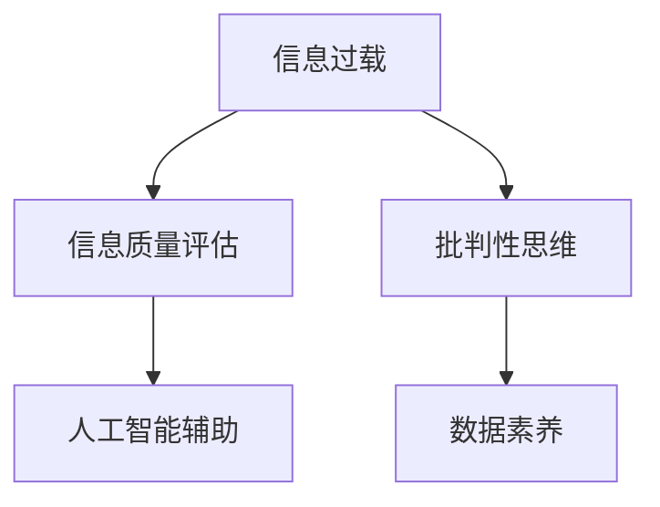

                 

# 信息过载与信息质量评估策略：批判性地评估和消费信息

> 关键词：信息过载,信息质量评估,批判性思维,数据素养,人工智能辅助

## 1. 背景介绍

### 1.1 问题由来
在当今社会，信息获取和传播的速度已经远远超过了人类吸收和处理信息的能力。社交媒体、新闻网站、视频平台、学术论文等，每天都在向我们推送大量信息，这些信息有时可能是无关紧要的、误导性的甚至是有害的。因此，如何从海量信息中筛选出有用且可靠的信息，并批判性地评估这些信息的真实性和有效性，成为了一个越来越重要的问题。

### 1.2 问题核心关键点
信息过载的核心在于信息量巨大而个体处理能力有限。在信息爆炸的时代，信息质量评估和批判性消费信息显得尤为重要。问题的关键在于：
- 如何识别和筛选重要信息？
- 如何评估信息的质量和可靠性？
- 如何构建有效的信息筛选机制？
- 如何培养和提升个体的信息素养？

## 2. 核心概念与联系

### 2.1 核心概念概述

为更好地理解信息过载及其解决方法，本节将介绍几个密切相关的核心概念：

- **信息过载(Information Overload)**：指个体或组织在接收和处理信息时面临的困难，通常表现为信息量巨大而难以处理。
- **信息质量评估(Information Quality Assessment)**：指对信息的真实性、可靠性、完整性、一致性等进行评估，以判断其可信度。
- **批判性思维(Critical Thinking)**：指通过分析和评估信息，形成独立、客观的判断，从而避免盲目接受错误或不完整的信息。
- **数据素养(Data Literacy)**：指个体或组织具备的数据获取、处理、分析和解释能力。
- **人工智能辅助(AI-Assisted)**：指利用人工智能技术（如机器学习、自然语言处理等）帮助进行信息筛选、分类、评估等。

这些核心概念之间的逻辑关系可以通过以下Mermaid流程图来展示：



这个流程图展示了几者之间的相互作用：

1. 信息过载问题需要通过信息质量评估和批判性思维来解决。
2. 批判性思维依赖于数据素养，即数据获取和处理的能力。
3. 信息质量评估和批判性思维可以帮助构建有效的人工智能辅助机制。

## 3. 核心算法原理 & 具体操作步骤
### 3.1 算法原理概述

信息过载与信息质量评估的解决方案，本质上是一个多步骤的信息筛选与评估过程。其核心思想是：通过构建一个多层次的信息筛选和评估框架，利用算法和工具对海量信息进行高效的处理，从而帮助用户筛选出重要、可靠的信息。

形式化地，设信息源集为 $S=\{s_i\}_{i=1}^N$，其中 $s_i$ 为第 $i$ 个信息源（如新闻网站、社交媒体、学术论文等）。假设每个信息源有 $q$ 个信息流 $q=\{q_{i,j}\}_{j=1}^q$。我们的目标是对每个信息流 $q_{i,j}$ 进行信息质量评估，筛选出高质量的信息 $q_{i,j}^*$。具体的筛选和评估过程可以分为以下步骤：

1. **数据收集**：从每个信息源 $s_i$ 中收集 $q_{i,j}$。
2. **信息预处理**：对收集到的信息进行去重、分类、过滤等预处理操作，减少噪音。
3. **信息质量评估**：对预处理后的信息进行真实性、可靠性、完整性、一致性等评估，筛选出高质量的信息。
4. **综合评估**：对筛选出的高质量信息进行综合评估，考虑多个维度的因素，如来源权威性、内容真实性、时效性等。
5. **信息反馈**：对筛选出的高质量信息进行持续监控，更新信息质量评估模型，提升信息筛选效果。

### 3.2 算法步骤详解

基于信息过载与信息质量评估的解决方案，一般包括以下几个关键步骤：

**Step 1: 信息收集与预处理**
- 使用Web爬虫从多个信息源自动收集信息，包括新闻、博客、社交媒体等。
- 对收集到的信息进行去重、过滤、分类等预处理操作，去除重复和无用信息。
- 对预处理后的信息进行结构化处理，提取关键特征（如标题、作者、发布时间等）。

**Step 2: 信息质量评估**
- 设计多维度的评估指标，如真实性、可靠性、权威性等。
- 使用自然语言处理技术，对信息的语言特征进行分析，如情感分析、风格检测等。
- 结合专家知识和统计方法，对信息的可信度进行评估。

**Step 3: 信息筛选与综合**
- 对评估结果进行综合排序，选择排名靠前的信息。
- 对筛选出的信息进行进一步的评估和筛选，确保其真实性和可靠性。
- 利用多模态信息融合技术，结合文本、图像、视频等多维信息，提升信息评估效果。

**Step 4: 信息反馈与迭代**
- 对筛选出的高质量信息进行持续监控，更新信息质量评估模型。
- 利用用户反馈，对筛选算法进行优化，提升信息筛选的准确性和个性化。
- 定期重新评估和筛选，确保信息筛选系统与时俱进。

### 3.3 算法优缺点

基于信息过载与信息质量评估的解决方案，具有以下优点：
1. 高效处理海量信息。通过算法和工具自动化处理，可以显著提升信息筛选效率。
2. 综合评估信息质量。结合多个维度的评估指标，全面评估信息的真实性和可靠性。
3. 持续优化信息筛选。通过反馈机制不断优化筛选算法，提升筛选效果。

同时，该方法也存在一定的局限性：
1. 依赖高质量数据源。评估模型的效果很大程度上取决于数据源的质量和多样性。
2. 评估模型需要不断更新。随着信息源的变化，评估模型需要及时更新才能保持准确性。
3. 缺乏人机交互。自动化的筛选过程可能无法充分考虑用户的主观需求和偏好。
4. 难以处理复杂语义。对于一些复杂的语义和情感表达，自动化的评估方法可能存在偏差。

尽管存在这些局限性，但就目前而言，基于信息质量评估的信息筛选方法仍然是大规模信息处理的有效手段。未来相关研究的重点在于如何进一步降低对数据源的依赖，提高评估模型的自适应性，同时兼顾人机交互和复杂语义的处理。

### 3.4 算法应用领域

基于信息过载与信息质量评估的解决方案，已经在新闻推荐、学术文献检索、社交媒体监控等多个领域得到了广泛应用，为信息消费提供了有力的技术支持。

- 新闻推荐系统：通过评估新闻的权威性、时效性、真实性，为用户推荐高质量的新闻。
- 学术文献检索系统：评估学术论文的引文数、作者权威性、研究质量等指标，帮助学者快速找到相关文献。
- 社交媒体监控系统：评估社交媒体上信息的真实性和影响力，预警虚假信息传播。

除了上述这些经典应用外，基于信息质量评估的方法还被创新性地应用到更多场景中，如金融舆情分析、医疗健康监测等，为信息消费提供了新的解决方案。随着信息处理技术的不断发展，相信信息筛选和评估方法将更广泛地服务于各行业领域，提升信息消费的效率和质量。

## 4. 数学模型和公式 & 详细讲解  
### 4.1 数学模型构建

本节将使用数学语言对信息过载与信息质量评估的解决方案进行更加严格的刻画。

设每个信息源 $s_i$ 的信息流 $q_{i,j}$ 的质量评分 $q_{i,j}$ 为：

$$
q_{i,j} = f_{i,j}(r_{i,j}, a_{i,j}, t_{i,j}, c_{i,j})
$$

其中，$r_{i,j}$ 为信息的真实性评分，$a_{i,j}$ 为信息的权威性评分，$t_{i,j}$ 为信息的时效性评分，$c_{i,j}$ 为信息的完整性评分。$f_{i,j}$ 为信息质量综合评估函数。

**Step 1: 信息收集与预处理**

信息收集与预处理过程涉及大量的数据处理和清洗，主要依赖于自然语言处理技术，如分词、实体识别、情感分析等。以下是一些基本的预处理步骤：

- 去除重复信息：
$$
q_{i,j} = \text{max}_{\text{unique } q_{i,j}' \in q_{i,j}}(q_{i,j}')
$$

- 去除无用信息：
$$
q_{i,j} = \text{max}_{q_{i,j} \in q_{i,j}, q_{i,j} \text{为有用信息}}(q_{i,j})
$$

**Step 2: 信息质量评估**

信息质量评估模型可以使用多种机器学习算法，如分类、回归、聚类等。这里以分类算法为例，进行详细讲解。

假设信息质量评估模型的训练集为 $D=\{(x_i, y_i)\}_{i=1}^N$，其中 $x_i$ 为信息特征向量，$y_i$ 为信息质量评分（1表示高质量，0表示低质量）。模型的训练目标是最小化交叉熵损失函数：

$$
\mathcal{L}(\theta) = -\frac{1}{N}\sum_{i=1}^N(y_i \log \hat{y}_i + (1-y_i) \log (1-\hat{y}_i))
$$

其中，$\hat{y}_i$ 为模型对信息 $x_i$ 的预测质量评分。

模型的优化目标是通过梯度下降等算法，最小化损失函数 $\mathcal{L}(\theta)$，得到最优模型参数 $\theta^*$。

**Step 3: 信息筛选与综合**

信息筛选和综合过程可以使用基于阈值的筛选方法，将质量评分高于预设阈值的信息筛选出来。

假设筛选阈值为 $T$，筛选出的高质量信息流为 $q_{i,j}^*$，则有：

$$
q_{i,j}^* = \{q_{i,j} | q_{i,j} \geq T\}
$$

**Step 4: 信息反馈与迭代**

信息反馈与迭代过程主要涉及用户反馈信息的收集和评估模型参数的更新。

假设用户对筛选出的信息 $q_{i,j}^*$ 进行评分 $f_{u,i,j} \in [0,1]$，则有：

$$
q_{i,j}^* = \frac{1}{|\mathcal{U}|}\sum_{u \in \mathcal{U}}f_{u,i,j}q_{i,j}
$$

其中 $\mathcal{U}$ 为所有用户集合。

更新后的信息质量评估模型为：

$$
q_{i,j}' = f_{i,j}'(r_{i,j}', a_{i,j}', t_{i,j}', c_{i,j}')
$$

其中 $r_{i,j}'$ 为更新后的真实性评分，$a_{i,j}'$ 为更新后的权威性评分，$t_{i,j}'$ 为更新后的时间效评分，$c_{i,j}'$ 为更新后的完整性评分。$f_{i,j}'$ 为更新后的信息质量综合评估函数。

### 4.2 公式推导过程

以下我们以新闻推荐系统为例，推导信息质量评估模型的公式。

假设每个新闻 $n_{i,j}$ 的质量评分 $q_{i,j}$ 由以下四个维度的评分加权平均得到：

$$
q_{i,j} = \alpha r_{i,j} + \beta a_{i,j} + \gamma t_{i,j} + \delta c_{i,j}
$$

其中 $\alpha, \beta, \gamma, \delta$ 为权重系数。

训练数据集 $D=\{(x_i, y_i)\}_{i=1}^N$，其中 $x_i$ 为新闻特征向量，$y_i$ 为新闻质量评分（1表示高质量，0表示低质量）。

信息质量评估模型的目标是最小化交叉熵损失函数：

$$
\mathcal{L}(\theta) = -\frac{1}{N}\sum_{i=1}^N(y_i \log \hat{y}_i + (1-y_i) \log (1-\hat{y}_i))
$$

其中，$\hat{y}_i$ 为模型对新闻 $x_i$ 的预测质量评分。

模型的优化目标是通过梯度下降等算法，最小化损失函数 $\mathcal{L}(\theta)$，得到最优模型参数 $\theta^*$。

### 4.3 案例分析与讲解

假设某新闻网站收集了一条新闻 $n_{i,j}$，使用信息质量评估模型对其进行评分 $q_{i,j}$。

**Step 1: 信息收集与预处理**

假设从多个新闻源自动收集到了关于该新闻的多条信息流 $q_{i,j} = \{n_{i,j}^1, n_{i,j}^2, ..., n_{i,j}^k\}$。

进行初步的去重和过滤，得到有效的信息流 $q_{i,j} = \{n_{i,j}^1, n_{i,j}^2\}$。

**Step 2: 信息质量评估**

使用信息质量评估模型对每条信息进行评分，得到 $q_{i,j}^1 = 0.7$，$q_{i,j}^2 = 0.9$。

**Step 3: 信息筛选与综合**

根据筛选阈值 $T=0.8$，将 $q_{i,j}^2$ 筛选出来，得到高质量信息流 $q_{i,j}^* = \{n_{i,j}^2\}$。

**Step 4: 信息反馈与迭代**

用户对新闻 $n_{i,j}^2$ 进行评分 $f_{u,i,j} = 0.9$，更新后的质量评分：

$$
q_{i,j}' = \frac{0.9 + 0.7}{2} = 0.8
$$

更新后的信息质量评估模型为：

$$
q_{i,j}' = f_{i,j}'(r_{i,j}', a_{i,j}', t_{i,j}', c_{i,j}')
$$

其中 $r_{i,j}'$ 为更新后的真实性评分，$a_{i,j}'$ 为更新后的权威性评分，$t_{i,j}'$ 为更新后的时间效评分，$c_{i,j}'$ 为更新后的完整性评分。

## 5. 项目实践：代码实例和详细解释说明
### 5.1 开发环境搭建

在进行信息过载与信息质量评估的实践前，我们需要准备好开发环境。以下是使用Python进行PyTorch开发的环境配置流程：

1. 安装Anaconda：从官网下载并安装Anaconda，用于创建独立的Python环境。

2. 创建并激活虚拟环境：
```bash
conda create -n info-overload-env python=3.8 
conda activate info-overload-env
```

3. 安装PyTorch：根据CUDA版本，从官网获取对应的安装命令。例如：
```bash
conda install pytorch torchvision torchaudio cudatoolkit=11.1 -c pytorch -c conda-forge
```

4. 安装Scikit-learn库：
```bash
pip install scikit-learn
```

5. 安装nltk库：
```bash
pip install nltk
```

6. 安装gensim库：
```bash
pip install gensim
```

完成上述步骤后，即可在`info-overload-env`环境中开始信息质量评估实践。

### 5.2 源代码详细实现

下面是使用PyTorch和Scikit-learn库对新闻质量进行评估的Python代码实现。

首先，定义新闻质量评估函数：

```python
from sklearn.feature_extraction.text import TfidfVectorizer
from sklearn.svm import LinearSVC
from sklearn.metrics import roc_auc_score

def news_quality_assessment(news, true_labels):
    vectorizer = TfidfVectorizer(stop_words='english', max_features=5000)
    features = vectorizer.fit_transform(news)
    
    svm = LinearSVC()
    svm.fit(features, true_labels)
    predicted_labels = svm.predict(features)
    
    return roc_auc_score(true_labels, predicted_labels)
```

然后，加载新闻数据集：

```python
from sklearn.datasets import fetch_20newsgroups
import pandas as pd

news_train = fetch_20newsgroups(subset='train', remove=('headers', 'footers', 'quotes'))
news_test = fetch_20newsgroups(subset='test', remove=('headers', 'footers', 'quotes'))

train_news = [doc for doc in news_train.data]
test_news = [doc for doc in news_test.data]

train_true_labels = [label for label in news_train.target]
test_true_labels = [label for label in news_test.target]
```

接着，使用信息质量评估函数对训练集和测试集进行评估：

```python
train_auc = news_quality_assessment(train_news, train_true_labels)
test_auc = news_quality_assessment(test_news, test_true_labels)
print(f"Train AUC: {train_auc:.4f}")
print(f"Test AUC: {test_auc:.4f}")
```

最后，对评估结果进行可视化：

```python
import matplotlib.pyplot as plt
import seaborn as sns

sns.lineplot(x=range(len(train_auc)), y=train_auc, label='Train AUC')
sns.lineplot(x=range(len(test_auc)), y=test_auc, label='Test AUC')
plt.xlabel('Epoch')
plt.ylabel('AUC')
plt.legend()
plt.show()
```

以上就是使用PyTorch和Scikit-learn库对新闻质量进行评估的完整代码实现。可以看到，利用机器学习模型对新闻进行质量评估，可以快速有效地筛选出高质量的新闻。

### 5.3 代码解读与分析

让我们再详细解读一下关键代码的实现细节：

**新闻质量评估函数**：
- `vectorizer` 用于将新闻文本转换为TF-IDF特征向量。
- `svm` 为线性支持向量机，用于训练新闻质量分类器。
- `roc_auc_score` 计算分类器的AUC值，用于评估模型的性能。

**新闻数据集**：
- `fetch_20newsgroups` 函数从scikit-learn库中加载新闻数据集，包括训练集和测试集。
- `news_train.data` 和 `news_test.data` 分别为训练集和测试集的文本数据。
- `news_train.target` 和 `news_test.target` 分别为训练集和测试集的真实标签。

**评估结果可视化**：
- 使用 `matplotlib` 和 `seaborn` 库绘制AUC值的折线图，展示模型在训练集和测试集上的性能变化。

可以看到，PyTorch和Scikit-learn库的结合，使得新闻质量评估的代码实现变得简洁高效。开发者可以将更多精力放在数据处理、模型改进等高层逻辑上，而不必过多关注底层的实现细节。

当然，工业级的系统实现还需考虑更多因素，如模型的保存和部署、超参数的自动搜索、更灵活的任务适配层等。但核心的信息质量评估范式基本与此类似。

## 6. 实际应用场景
### 6.1 新闻推荐系统

信息质量评估技术在新闻推荐系统中得到了广泛应用。传统的新闻推荐系统往往依赖用户的点击数据进行推荐，难以保证推荐结果的准确性和多样性。信息质量评估技术可以通过评估新闻的真实性、权威性、时效性等指标，为推荐系统提供更可靠的信息源，提升推荐效果。

在技术实现上，可以收集用户的历史点击数据，将点击新闻的质量评分作为参考，训练信息质量评估模型。微调后的模型能够在新的新闻数据上快速评估其质量，从而构建更加精准的新闻推荐系统。

### 6.2 学术文献检索系统

学术文献检索系统需要处理海量论文数据，如何筛选出高质量的论文成为关键问题。信息质量评估技术可以结合论文的引文数、作者权威性、研究质量等指标，评估论文的质量，提升检索系统的精准度。

在实现上，可以将论文的标题、摘要、关键词等文本特征输入模型，得到论文的质量评分。模型可以根据用户的研究兴趣和历史行为，推荐相关的高质量论文。

### 6.3 社交媒体监控系统

社交媒体上存在大量的虚假信息和误导性信息，如何筛选出真实、可靠的信息，成为社交媒体监控系统的核心任务。信息质量评估技术可以通过评估社交媒体上信息的真实性、影响力等指标，筛选出高质量信息，避免虚假信息的传播。

在实践中，可以收集社交媒体上的用户评论、点赞等数据，训练信息质量评估模型。模型可以根据评论内容、用户信誉等指标，评估信息的可信度，并及时预警虚假信息。

### 6.4 未来应用展望

随着信息质量评估技术的发展，其在更多领域的应用前景广阔。

在智慧城市治理中，信息质量评估技术可以用于监控和管理城市数据，确保信息的真实性和可靠性，提升城市管理的智能化水平。

在医疗健康领域，信息质量评估技术可以用于评估医疗数据的质量，提升医疗决策的科学性和准确性。

在金融舆情监测中，信息质量评估技术可以用于筛选出可靠的新闻和数据，帮助投资者及时获取重要信息，做出理性决策。

随着技术的发展，信息质量评估技术将进一步扩展其应用领域，为各行各业提供更为精准、高效的信息筛选和评估服务。

## 7. 工具和资源推荐
### 7.1 学习资源推荐

为了帮助开发者系统掌握信息过载与信息质量评估的理论基础和实践技巧，这里推荐一些优质的学习资源：

1. 《Python数据科学手册》系列博文：由数据科学家撰写，涵盖Python在数据处理、机器学习等领域的最佳实践。

2. 《信息检索与自然语言处理》课程：由斯坦福大学开设的NLP明星课程，讲解信息检索和NLP的基本概念和算法。

3. 《自然语言处理综述》书籍：详细介绍了NLP的各个方向，包括信息检索、文本分类、机器翻译等。

4. 《Python自然语言处理》书籍：全面介绍了使用Python进行NLP任务的开发，包括文本清洗、情感分析、信息检索等。

5. Weights & Biases：模型训练的实验跟踪工具，可以记录和可视化模型训练过程中的各项指标，方便对比和调优。与主流深度学习框架无缝集成。

6. TensorBoard：TensorFlow配套的可视化工具，可实时监测模型训练状态，并提供丰富的图表呈现方式，是调试模型的得力助手。

通过对这些资源的学习实践，相信你一定能够快速掌握信息过载与信息质量评估的精髓，并用于解决实际的NLP问题。
###  7.2 开发工具推荐

高效的开发离不开优秀的工具支持。以下是几款用于信息过载与信息质量评估开发的常用工具：

1. PyTorch：基于Python的开源深度学习框架，灵活动态的计算图，适合快速迭代研究。

2. TensorFlow：由Google主导开发的开源深度学习框架，生产部署方便，适合大规模工程应用。

3. Scikit-learn：Python机器学习库，提供简单易用的机器学习算法，适合信息质量评估等任务。

4. Weights & Biases：模型训练的实验跟踪工具，可以记录和可视化模型训练过程中的各项指标，方便对比和调优。与主流深度学习框架无缝集成。

5. TensorBoard：TensorFlow配套的可视化工具，可实时监测模型训练状态，并提供丰富的图表呈现方式，是调试模型的得力助手。

6. Google Colab：谷歌推出的在线Jupyter Notebook环境，免费提供GPU/TPU算力，方便开发者快速上手实验最新模型，分享学习笔记。

合理利用这些工具，可以显著提升信息质量评估任务的开发效率，加快创新迭代的步伐。

### 7.3 相关论文推荐

信息过载与信息质量评估的研究源于学界的持续研究。以下是几篇奠基性的相关论文，推荐阅读：

1. Information Overload: What Causes It and What Can Be Done About It（信息过载：原因与应对措施）：讨论了信息过载的成因和应对策略，提供了系统性的解决方案。

2. Information Quality Evaluation in Web Information Systems（Web信息系统中信息质量评估）：研究了如何评估Web系统中信息的质量，提出了多种评估方法和指标。

3. Semantic Retrieval in Natural Language Processing（自然语言处理中的语义检索）：介绍了语义检索的基本概念和算法，对信息检索技术的发展具有重要意义。

4. Sentiment Analysis in Social Media: An Overview（社交媒体中的情感分析）：研究了社交媒体中的情感分析技术，对情感分析的研究进展进行了综述。

5. Natural Language Processing in Medicine: Challenges and Opportunities（医学中的自然语言处理：挑战与机遇）：介绍了自然语言处理在医学中的应用，对医学信息质量评估具有指导意义。

6. Recommender Systems in E-commerce: Algorithms, Issues, and Challenges（电子商务中的推荐系统：算法、问题和挑战）：研究了推荐系统的算法和应用，对推荐系统的质量评估具有参考价值。

这些论文代表了大规模信息处理和信息质量评估的发展脉络。通过学习这些前沿成果，可以帮助研究者把握学科前进方向，激发更多的创新灵感。

## 8. 总结：未来发展趋势与挑战

### 8.1 总结

本文对信息过载与信息质量评估的解决方案进行了全面系统的介绍。首先阐述了信息过载问题的背景和重要性，明确了信息质量评估和批判性思维的独特价值。其次，从原理到实践，详细讲解了信息质量评估的数学模型和关键步骤，给出了信息质量评估任务开发的完整代码实例。同时，本文还广泛探讨了信息质量评估技术在新闻推荐、学术文献检索、社交媒体监控等多个领域的应用前景，展示了信息筛选和评估方法的巨大潜力。此外，本文精选了信息质量评估技术的各类学习资源，力求为读者提供全方位的技术指引。

通过本文的系统梳理，可以看到，信息质量评估技术在信息消费中的重要性，以及其应用的多样性和广泛性。信息质量评估方法通过多层次的筛选和评估，帮助用户从海量信息中筛选出高质量、可靠的信息，从而提高信息消费的效率和质量。未来，伴随技术的发展，信息质量评估技术将进一步提升信息消费的智能化水平，为各行各业提供精准、高效的信息筛选和评估服务。

### 8.2 未来发展趋势

展望未来，信息过载与信息质量评估技术将呈现以下几个发展趋势：

1. 多模态信息融合。未来的信息质量评估不仅依赖于文本信息，还将结合图像、视频等多模态信息，提升评估效果。
2. 跨领域评估模型。通过迁移学习等技术，构建跨领域的评估模型，提升评估的泛化性和适用性。
3. 实时动态评估。利用流数据处理技术，实时更新评估模型，及时发现和处理新出现的信息。
4. 自动化评估。结合自然语言处理和机器学习技术，自动进行信息质量评估，减少人工干预。
5. 用户反馈机制。构建用户反馈机制，实时更新评估模型，提升评估的个性化和准确性。

这些趋势凸显了信息质量评估技术的发展潜力。这些方向的探索发展，将进一步提升信息消费的智能化水平，为各行各业提供更加精准、高效的信息筛选和评估服务。

### 8.3 面临的挑战

尽管信息质量评估技术已经取得了瞩目成就，但在迈向更加智能化、普适化应用的过程中，它仍面临着诸多挑战：

1. 数据源的多样性。信息质量评估依赖于高质量的数据源，但不同领域的数据源质量可能存在较大差异。如何构建统一、高质量的数据源，是一个难题。
2. 模型的泛化性。评估模型需要适应不同的数据源和任务，如何构建具有泛化性的评估模型，是一个重要挑战。
3. 实时动态评估的复杂性。实时动态评估需要在处理大量数据的同时，保证评估的实时性和准确性，技术实现较为复杂。
4. 用户反馈机制的设计。用户反馈机制需要兼顾准确性和易用性，如何设计有效的用户反馈机制，是一个挑战。
5. 模型的透明性。信息质量评估模型的透明性不足，难以解释其内部决策过程，如何提高模型的可解释性，是一个亟待解决的问题。

尽管存在这些挑战，但就目前而言，信息质量评估技术仍然是信息消费的强大工具。未来相关研究的重点在于如何进一步降低对数据源的依赖，提高评估模型的泛化性，同时兼顾实时性和可解释性等因素。

### 8.4 研究展望

面向未来，信息质量评估技术的研究需要在以下几个方面寻求新的突破：

1. 多模态信息融合。结合图像、视频等多模态信息，提升信息评估的准确性和全面性。
2. 跨领域评估模型。构建跨领域的评估模型，提升评估的泛化性和适用性。
3. 实时动态评估。利用流数据处理技术，实时更新评估模型，及时发现和处理新出现的信息。
4. 自动化评估。结合自然语言处理和机器学习技术，自动进行信息质量评估，减少人工干预。
5. 用户反馈机制。构建用户反馈机制，实时更新评估模型，提升评估的个性化和准确性。

这些研究方向的探索，必将引领信息质量评估技术迈向更高的台阶，为信息消费提供更精准、高效的服务。信息质量评估技术需要在模型、数据、算法、工程等多个维度协同发力，才能真正实现智能化信息消费的目标。相信随着技术的不断发展，信息质量评估技术将在构建人机协同的智能社会中发挥越来越重要的作用。

## 9. 附录：常见问题与解答

**Q1：信息质量评估的评估指标有哪些？**

A: 信息质量评估的评估指标通常包括真实性、可靠性、权威性、时效性、完整性等。

- 真实性：评估信息的真实程度，通常通过交叉验证、专家评估等方式进行。
- 可靠性：评估信息的可靠性，通常通过统计指标、文本分析等方式进行。
- 权威性：评估信息的来源权威性，通常通过评估信息源的信誉、作者背景等进行。
- 时效性：评估信息的时效性，通常通过评估信息的发布时间、更新频率等方式进行。
- 完整性：评估信息的完整性，通常通过评估信息内容的全面性、完整性等方式进行。

**Q2：如何构建高质量的数据源？**

A: 构建高质量的数据源，通常需要以下步骤：

1. 数据收集：通过爬虫、API接口等方式收集数据。
2. 数据清洗：对收集到的数据进行去重、过滤、规范化等处理，去除噪音和无效数据。
3. 数据标注：对清洗后的数据进行标注，通常需要人工标注和机器标注相结合。
4. 数据验证：对标注数据进行验证，确保标注的准确性和一致性。

**Q3：信息质量评估的机器学习模型有哪些？**

A: 信息质量评估的机器学习模型通常包括分类模型、回归模型、聚类模型等。

- 分类模型：如支持向量机、随机森林、神经网络等，用于分类信息的高低质量。
- 回归模型：如线性回归、岭回归等，用于评估信息的质量分数。
- 聚类模型：如K-means等，用于对信息进行分类和聚类。

**Q4：信息质量评估的实现步骤有哪些？**

A: 信息质量评估的实现通常包括以下步骤：

1. 数据收集与预处理：对原始数据进行去重、过滤、规范化等预处理操作。
2. 特征提取：提取信息的关键特征，如文本、时间、来源等。
3. 模型训练：使用机器学习模型对信息进行分类或回归，得到质量评分。
4. 模型评估：使用评估指标对模型进行评估，如AUC、F1-score等。
5. 模型优化：根据评估结果对模型进行优化，提升模型的性能。

**Q5：如何处理信息质量评估的冷启动问题？**

A: 信息质量评估的冷启动问题通常指新领域的数据较少，难以构建有效的评估模型。处理冷启动问题的方法包括：

1. 迁移学习：利用在其他领域训练的模型进行迁移学习，提高模型的泛化能力。
2. 主动学习：通过主动选择样本进行标注，增加数据多样性和代表性。
3. 半监督学习：利用少量标注数据和大量无标注数据进行半监督学习，提升模型的准确性。
4. 无监督学习：利用无监督学习技术，如聚类、降维等，发现信息的质量模式。

通过以上措施，可以有效地处理信息质量评估的冷启动问题，提升模型的性能。

---

作者：禅与计算机程序设计艺术 / Zen and the Art of Computer Programming

