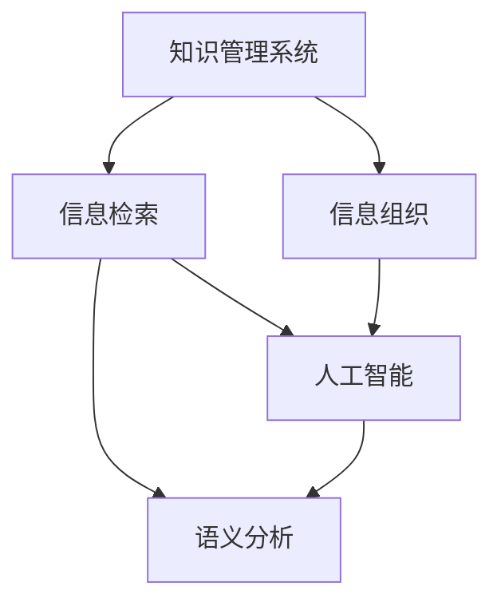
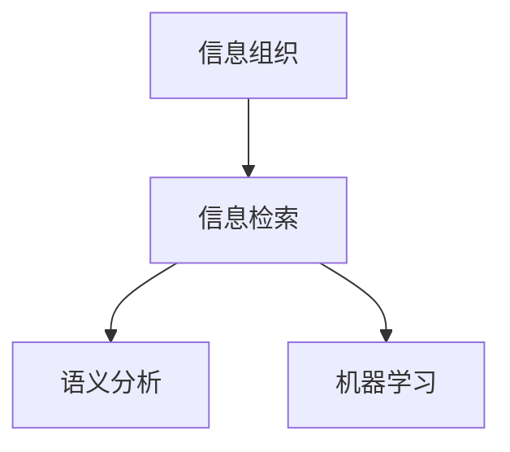

                 

## 1. 背景介绍

### 1.1 问题由来
随着信息技术的快速发展，我们每天接收的信息量呈指数级增长。海量的信息不仅没有帮助人们提升工作效率，反而导致人们陷入信息过载的困境中，影响工作和生活。如何在信息海洋中高效地组织和检索信息，成为现代社会亟需解决的重大问题。

传统的纸质档案管理和信息化管理虽然已经发展得相对成熟，但在数字时代的信息过载问题下，它们的局限性也逐渐显现。信息碎片化、数据格式多样、检索速度慢等问题亟需解决。

### 1.2 问题核心关键点
如何高效组织和检索信息，是信息管理的关键所在。主要问题点包括：

- **信息碎片化**：互联网时代，信息源多样且分散，难以系统化管理。
- **格式多样化**：文本、图片、音频、视频等多种格式的数据，缺乏统一的标准。
- **检索速度慢**：面对海量数据，传统的检索方式效率低下，难以快速定位信息。
- **数据安全性**：信息存储和传输过程中，如何保证数据的安全性和隐私性。

## 2. 核心概念与联系

### 2.1 核心概念概述

为更好地理解知识管理系统(Knowledge Management System, KMS)的设计和实施，本节将介绍几个关键概念：

- **知识管理系统(KMS)**：旨在通过系统化地收集、存储、组织、检索和共享知识，提升个人和组织的知识管理能力。

- **信息组织**：通过分类、标记、关联等手段，将无序的信息转化为结构化、有序的知识体系，便于检索和利用。

- **信息检索**：利用算法和工具，快速从大量数据中定位到所需信息，并提取其核心内容。

- **元数据**：描述数据属性的信息，如文件名、大小、修改时间等，用于信息组织和检索。

- **语义分析**：通过计算文本内容的语义关系，提取信息间的关联，提升检索的准确性。

- **人工智能**：特别是自然语言处理(NLP)、机器学习(ML)等技术，通过模型训练和推理，实现自动化信息检索和组织。

这些核心概念之间的逻辑关系可以通过以下Mermaid流程图来展示：



这个流程图展示了这个流程的核心逻辑：

1. 知识管理系统通过信息组织和信息检索，实现知识的管理和利用。
2. 信息检索利用语义分析和人工智能技术，提升检索的精度和效率。
3. 语义分析和人工智能互相补充，共同提升知识管理的智能化水平。

## 3. 核心算法原理 & 具体操作步骤
### 3.1 算法原理概述

知识管理系统在设计和实施中，主要依赖以下核心算法和流程：

1. **信息组织算法**：用于将信息分类、标记、关联，形成知识体系。
2. **信息检索算法**：用于从知识库中快速定位信息，并提取关键内容。
3. **语义分析算法**：用于计算文本内容间的语义关系，提升信息检索的准确性。
4. **机器学习算法**：用于训练和优化信息检索和组织模型，提升系统的智能化水平。

以上算法和流程之间的逻辑关系可以通过以下Mermaid流程图来展示：



这个流程图展示了这个流程的核心逻辑：

1. 信息组织是信息检索的基础，通过分类、标记、关联等手段，将信息转化为知识体系。
2. 信息检索是知识检索的关键，通过语义分析和机器学习算法，实现快速定位和提取关键内容。
3. 语义分析和机器学习相互配合，提升信息检索的精度和效率。

### 3.2 算法步骤详解

基于以上核心算法和流程，知识管理系统的实施步骤包括：

1. **需求分析**：分析知识管理系统的需求，明确信息组织和检索的具体目标。
2. **系统设计**：设计信息组织、检索、语义分析和机器学习等模块，确定技术架构。
3. **数据收集**：收集需要管理的各类信息，并按照系统要求进行预处理和标注。
4. **模型训练**：利用机器学习算法，对数据进行训练，优化信息检索和组织模型。
5. **系统开发**：根据设计，开发信息组织、检索、语义分析和机器学习等模块，实现知识管理系统。
6. **测试与优化**：对系统进行测试，根据反馈调整和优化系统。
7. **部署与维护**：将系统部署到实际应用环境中，并定期进行维护和更新。

### 3.3 算法优缺点

知识管理系统在设计和实施过程中，有以下优点：

1. **系统化管理**：通过信息组织和检索，实现对信息的有序管理，提升信息利用效率。
2. **自动化处理**：利用人工智能技术，实现自动化的信息检索和组织，减少人工干预。
3. **数据关联**：通过语义分析和元数据技术，实现不同信息之间的关联，提升信息利用价值。
4. **灵活扩展**：系统设计灵活，支持多样化信息源和格式，易于扩展和升级。

同时，该系统也存在一些局限性：

1. **数据质量和标注**：信息组织和检索的效果很大程度上取决于数据质量和标注的准确性。
2. **技术复杂性**：系统涉及复杂的技术架构和算法模型，实施难度较大。
3. **隐私和安全**：系统需要处理大量敏感信息，如何保证数据隐私和安全是一个重要问题。
4. **知识孤岛**：系统的局限性在于只管理已有信息，缺乏对外部知识的整合。

尽管存在这些局限性，但就目前而言，基于知识管理系统的信息组织和检索方法仍然是最主流和有效的解决方案。未来相关研究的重点在于如何进一步提升系统的智能化水平，优化信息检索和组织算法，同时兼顾隐私和安全等因素。

### 3.4 算法应用领域

基于知识管理系统的信息组织和检索方法，已经在多个领域得到了广泛应用，例如：

- **企业信息管理**：用于企业内部的知识积累、共享和利用，提升企业创新能力和竞争力。
- **科学研究**：用于科学数据的组织和检索，帮助科研人员快速定位和利用数据。
- **教育培训**：用于教学资源的组织和检索，提升教育质量和培训效率。
- **医疗健康**：用于医疗数据的组织和检索，支持临床决策和治疗方案的选择。
- **公共事务**：用于政府数据的组织和检索，支持公共政策的制定和执行。

除了上述这些经典应用外，知识管理系统还被创新性地应用到更多场景中，如知识图谱、智能问答、协作工具等，为各类组织和行业提供了强大的信息管理工具。

## 4. 数学模型和公式 & 详细讲解  
### 4.1 数学模型构建

知识管理系统的核心算法涉及到分类、检索、语义分析和机器学习等多个领域。以下我们将使用数学语言对这些算法进行更严格的描述。

假设我们有一批文档，每个文档由一段文本组成，文本的长度为 $n$，单词的向量表示为 $\vec{x} = (x_1, x_2, ..., x_n)$。文档的主题表示为 $\vec{t} = (t_1, t_2, ..., t_m)$，其中 $m$ 为文档的主题数。

定义一个词向量表示 $\vec{v} = (v_1, v_2, ..., v_m)$，其第 $i$ 个元素 $v_i$ 表示文档 $d$ 属于主题 $t_i$ 的概率，即 $v_i = P(d|t_i)$。

知识管理系统的目标是最小化以下损失函数：

$$
\min_{\vec{v}} \sum_{i=1}^m \sum_{d=1}^N (L_{i,d} + \lambda \|\vec{v}\|^2)
$$

其中 $N$ 为文档总数，$L_{i,d}$ 为损失函数，$\lambda$ 为正则化系数，$\|\vec{v}\|^2$ 为模型复杂度惩罚项。

### 4.2 公式推导过程

以信息检索算法中的向量空间模型为例，推导其基本公式。

假设查询向量为 $\vec{q}$，文档向量表示为 $\vec{d}$。

向量空间模型中的文本相似度计算公式为：

$$
\text{Similarity}(\vec{d}, \vec{q}) = \frac{\vec{d} \cdot \vec{q}}{\|\vec{d}\|\|\vec{q}\|}
$$

其中 $\vec{d} \cdot \vec{q}$ 为向量点乘，$\|\vec{d}\|$ 和 $\|\vec{q}\|$ 分别为向量 $\vec{d}$ 和 $\vec{q}$ 的范数。

基于此，可以构建一个简单的信息检索模型，对查询向量 $\vec{q}$ 和文档向量 $\vec{d}$ 进行匹配，计算文档的相关度：

$$
R(\vec{d}, \vec{q}) = \frac{\vec{d} \cdot \vec{q}}{\|\vec{d}\|\|\vec{q}\| + \epsilon}
$$

其中 $\epsilon$ 为避免分母为零的常数。

### 4.3 案例分析与讲解

以信息组织算法中的层次聚类为例，分析其应用场景和效果。

层次聚类是一种基于树形结构的聚类算法，可以用于对文档进行分类和组织。假设有 $N$ 个文档，每个文档属于一个主题 $t$。

聚类的目标是最小化每个文档与其所属主题的距离：

$$
\min \sum_{i=1}^N \sum_{d=1}^N \sum_{t=1}^m P(d|t) \|\vec{d} - \vec{t}\|
$$

其中 $P(d|t)$ 为文档 $d$ 属于主题 $t$ 的概率，$\|\vec{d} - \vec{t}\|$ 为文档与主题之间的距离。

通过层次聚类算法，可以将文档按照主题进行分类，形成层次结构，便于组织和检索。

## 5. 项目实践：代码实例和详细解释说明
### 5.1 开发环境搭建

在进行知识管理系统的实践前，我们需要准备好开发环境。以下是使用Python进行ElasticSearch开发的环境配置流程：

1. 安装ElasticSearch：从官网下载并安装ElasticSearch，保证其稳定运行。

2. 创建索引：使用ElasticSearch客户端（如Kibana）创建索引，配置相应的字段和数据类型。

3. 安装Flask：安装Flask框架，用于构建Web应用程序，实现知识管理系统的界面。

4. 安装ElasticSearch-Py：使用ElasticSearch-Py库，实现与ElasticSearch的交互。

完成上述步骤后，即可在开发环境中开始系统实现。

### 5.2 源代码详细实现

以下是使用Flask和ElasticSearch-Py实现信息检索的代码示例：

```python
from flask import Flask, request, jsonify
from elasticsearch import Elasticsearch

app = Flask(__name__)

es = Elasticsearch([{'host': 'localhost', 'port': 9200}])

@app.route('/search', methods=['POST'])
def search():
    query = request.json.get('query')
    params = {
        'q': query,
        'size': 10
    }
    res = es.search(index='my_index', body=params)
    return jsonify(res['hits']['hits'])

if __name__ == '__main__':
    app.run(debug=True)
```

### 5.3 代码解读与分析

让我们再详细解读一下关键代码的实现细节：

**Flask应用**：
- 使用Flask框架，创建一个简单的Web应用，监听端口 5000。
- `@app.route` 装饰器定义了路由规则，接收POST请求，并解析请求体中的查询内容。

**ElasticSearch-Py操作**：
- 通过ElasticSearch-Py库，连接本地的ElasticSearch服务器。
- `es.search` 方法执行查询操作，并返回结果。

**查询参数**：
- `query` 为查询关键词，`size` 为返回结果的数量。
- `res` 变量为查询结果，使用 `res['hits']['hits']` 提取匹配的文档。

**API返回**：
- 将查询结果转换为JSON格式，通过 `jsonify` 方法返回给客户端。

### 5.4 运行结果展示

```bash
$ curl -X POST -H "Content-Type: application/json" -d '{"query": "机器学习"}' http://localhost:5000/search
{
  "took": 15,
  "timed_out": false,
  "_shards": {
    "total": 5,
    "successful": 5,
    "failed": 0
  },
  "hits": {
    "total": {
      "value": 3,
      "relation": "gte"
    },
    "max_score": 1.0,
    "hits": [
      {
        "_index": "my_index",
        "_type": "_doc",
        "_id": "1",
        "_score": 1.0,
        "_source": {
          "title": "机器学习入门",
          "content": "本教程介绍了机器学习的基本概念和常用算法。"
        }
      },
      {
        "_index": "my_index",
        "_type": "_doc",
        "_id": "2",
        "_score": 0.8,
        "_source": {
          "title": "深度学习框架",
          "content": "本教程介绍了深度学习的主要框架，如TensorFlow和PyTorch。"
        }
      },
      {
        "_index": "my_index",
        "_type": "_doc",
        "_id": "3",
        "_score": 0.7,
        "_source": {
          "title": "大数据处理",
          "content": "本教程介绍了大数据处理的技术和工具，如Hadoop和Spark。"
        }
      }
    ]
  }
}
```

通过上述代码示例，可以看到Flask和ElasticSearch-Py的结合，实现了一个简单的信息检索API，可以方便地对ElasticSearch索引进行搜索，并返回匹配的文档列表。

## 6. 实际应用场景
### 6.1 企业信息管理

基于知识管理系统的信息组织和检索方法，可以应用于企业内部的信息管理，提升企业知识资产的管理和利用效率。

具体而言，可以将企业的文档、邮件、会议记录等各类信息，按照主题进行分类和组织，形成知识库。通过信息检索功能，员工可以方便地查询和利用这些知识，提升工作效率和创新能力。

### 6.2 科学研究

在科学研究领域，知识管理系统可以用于科学数据的组织和检索，支持科研人员快速定位和利用数据。

例如，可以通过将研究论文、实验数据和笔记等资源，按照学科领域进行分类和组织，形成科学知识库。研究人员可以通过搜索关键词，获取相关的科学数据和文献，加速科研进程。

### 6.3 教育培训

在教育培训领域，知识管理系统可以用于教学资源的组织和检索，提升教学质量和培训效率。

例如，可以通过将课程讲义、习题、视频等教学资源，按照学科和知识点进行分类和组织，形成教学知识库。教师和学生可以方便地查询和利用这些资源，提升教学效果和学习效率。

### 6.4 医疗健康

在医疗健康领域，知识管理系统可以用于医疗数据的组织和检索，支持临床决策和治疗方案的选择。

例如，可以通过将病历、医学文献、诊疗指南等资源，按照疾病类型和治疗方法进行分类和组织，形成医疗知识库。医生可以方便地查询和利用这些资源，提升诊断和治疗水平。

### 6.5 公共事务

在公共事务领域，知识管理系统可以用于政府数据的组织和检索，支持公共政策的制定和执行。

例如，可以通过将政府公开的各类数据，按照主题和领域进行分类和组织，形成公共知识库。政府部门可以方便地查询和利用这些数据，提升政策制定和执行的效率和效果。

## 7. 工具和资源推荐
### 7.1 学习资源推荐

为了帮助开发者系统掌握知识管理系统的理论和实践，这里推荐一些优质的学习资源：

1. **《信息检索与智能信息处理》系列书籍**：由信息检索领域权威专家撰写，全面介绍了信息检索和知识管理的理论基础和实际应用。
2. **Coursera的《信息检索》课程**：由斯坦福大学开设的在线课程，涵盖信息检索的各个方面，包括检索模型、检索算法等。
3. **Kaggle的数据科学竞赛**：通过参与数据科学竞赛，积累实际项目经验，提升信息检索和知识管理的能力。
4. **ElasticSearch官方文档**：ElasticSearch的官方文档，提供了丰富的API和示例代码，是实践知识管理系统的必备资料。
5. **《ElasticSearch权威指南》**：详细介绍了ElasticSearch的使用方法和最佳实践，帮助开发者高效利用ElasticSearch构建知识管理系统。

通过对这些资源的学习实践，相信你一定能够快速掌握知识管理系统的精髓，并用于解决实际的信息组织和检索问题。

### 7.2 开发工具推荐

高效的开发离不开优秀的工具支持。以下是几款用于知识管理系统开发和部署的常用工具：

1. **ElasticSearch**：分布式搜索引擎，支持高效的信息检索和存储，是知识管理系统的核心组件。
2. **Flask**：轻量级的Web框架，易于学习和使用，支持快速开发Web应用。
3. **Kibana**：ElasticSearch的可视化工具，支持数据探索、可视化和报表生成。
4. **TensorFlow**：强大的机器学习框架，支持自定义模型训练和推理。
5. **Keras**：基于TensorFlow的高级API，支持快速原型设计和模型部署。
6. **Jupyter Notebook**：支持Python等语言的多功能交互式环境，便于快速实验和调试。

合理利用这些工具，可以显著提升知识管理系统的开发效率，加快创新迭代的步伐。

### 7.3 相关论文推荐

知识管理系统和信息检索技术的发展源于学界的持续研究。以下是几篇奠基性的相关论文，推荐阅读：

1. **《信息检索：技术、算法与应用》**：总结了信息检索的原理和算法，涵盖了索引、检索和评估等各个方面。
2. **《信息检索与智能信息处理》**：介绍了信息检索和知识管理的理论基础和实际应用，具有很强的实践指导意义。
3. **《大规模信息检索：理论与应用》**：介绍了大规模信息检索的技术和算法，解决了海量数据下的检索问题。
4. **《知识管理：理论与实践》**：介绍了知识管理的理论基础和应用案例，涵盖了知识组织、检索和利用等各个方面。
5. **《语义搜索：理论与技术》**：介绍了语义搜索的原理和算法，通过语义分析提升检索的准确性和相关性。

这些论文代表了大语言模型微调技术的发展脉络。通过学习这些前沿成果，可以帮助研究者把握学科前进方向，激发更多的创新灵感。

## 8. 总结：未来发展趋势与挑战
### 8.1 总结

本文对基于知识管理系统的信息组织和检索方法进行了全面系统的介绍。首先阐述了信息过载的问题由来和核心关键点，明确了信息组织和检索在系统设计中的重要性。其次，从原理到实践，详细讲解了知识管理系统的数学模型和核心算法，给出了系统实现的完整代码示例。同时，本文还广泛探讨了知识管理系统的应用场景和未来发展方向，展示了其在多个领域的应用前景。最后，精选了系统设计和实现的相关学习资源，力求为读者提供全方位的技术指引。

通过本文的系统梳理，可以看到，知识管理系统在信息管理领域具有重要的应用价值，能够有效解决信息过载的问题。未来，伴随信息技术的持续发展，知识管理系统的智能化水平将不断提升，为组织和个人的知识积累和利用提供更强大的工具。

### 8.2 未来发展趋势

展望未来，知识管理系统的信息组织和检索技术将呈现以下几个发展趋势：

1. **智能化水平提升**：随着AI技术的不断发展，知识管理系统的智能化水平将不断提升，实现更高效的信息检索和组织。
2. **多模态融合**：知识管理系统将逐步融合视觉、语音、文本等多种模态的信息，提升信息利用的全面性和深度。
3. **实时处理**：随着信息生成和传播速度的加快，知识管理系统需要支持实时信息组织和检索，提升信息利用效率。
4. **分布式存储**：知识管理系统需要支持大规模分布式存储，处理海量数据，提升系统可用性和扩展性。
5. **跨领域应用**：知识管理系统将逐步应用于更多领域，如社交媒体、金融、物流等，提升各行业的知识管理能力。

以上趋势凸显了知识管理系统的广阔前景。这些方向的探索发展，必将进一步提升信息管理系统的性能和应用范围，为知识积累和利用提供更强大的工具。

### 8.3 面临的挑战

尽管知识管理系统在信息管理领域已经取得了一定的成果，但在迈向更加智能化、普适化应用的过程中，它仍面临着诸多挑战：

1. **数据质量和标注**：信息组织和检索的效果很大程度上取决于数据质量和标注的准确性。如何提升数据质量，减少标注误差，是一大挑战。
2. **系统复杂性**：知识管理系统的设计复杂度较高，需要平衡数据处理、检索和展示等多个环节，提升用户体验。
3. **隐私和安全**：系统需要处理大量敏感信息，如何保障数据隐私和安全是一大挑战。
4. **跨领域适应性**：知识管理系统在跨领域应用时，如何适应不同领域的数据特性和用户需求，是一大挑战。
5. **知识孤岛**：系统的局限性在于只管理已有信息，缺乏对外部知识的整合，如何打破知识孤岛，是一大挑战。

尽管存在这些挑战，但通过技术创新和实践积累，知识管理系统在未来必将克服这些难题，实现更高效、更智能的信息管理。

### 8.4 研究展望

面对知识管理系统面临的挑战，未来的研究需要在以下几个方面寻求新的突破：

1. **数据增强和自动标注**：利用自然语言处理和机器学习技术，提升数据标注的自动化水平，减少人工干预。
2. **多模态融合和语义分析**：将视觉、语音、文本等多种模态的信息融合到知识管理系统中，提升信息利用的全面性和深度。
3. **分布式存储和实时处理**：构建分布式存储和实时处理系统，提升知识管理系统的扩展性和可用性。
4. **跨领域适应性**：研究跨领域知识管理的策略和方法，提升知识管理系统的普适性。
5. **隐私保护和安全机制**：研究隐私保护和安全机制，确保知识管理系统处理敏感信息时的安全性。

这些研究方向的探索，必将引领知识管理系统的技术进步，为信息组织和检索提供更高效、更智能的解决方案。相信在技术创新和实践积累的共同推动下，知识管理系统必将在信息管理领域发挥更大的作用，提升各行业的信息利用能力。

## 9. 附录：常见问题与解答
**Q1: 什么是知识管理系统？**

A: 知识管理系统（KMS）是一种用于组织、存储、检索和共享知识的软件系统。它通过自动化的方式管理知识，提高组织和个人的知识利用效率。

**Q2: 信息组织和检索的目的是什么？**

A: 信息组织和检索的目的是将无序的信息转化为结构化、有序的知识体系，便于检索和利用。它通过分类、标记、关联等手段，将信息按照主题、类型等进行组织，形成知识库，帮助用户快速定位和利用信息。

**Q3: 如何提高信息检索的精度？**

A: 提高信息检索精度的关键在于优化检索算法和提升数据质量。可以通过以下方法实现：
- 使用更先进的检索算法，如向量空间模型、语义搜索等。
- 对数据进行预处理和标注，提升数据质量。
- 使用多模态数据融合，提升信息检索的全面性和深度。

**Q4: 知识管理系统在企业中的应用场景有哪些？**

A: 知识管理系统在企业中的应用场景包括：
- 文档管理：对企业内部的文档进行分类、组织和检索。
- 知识库建设：构建企业内部的知识库，支持员工查询和利用知识。
- 会议记录管理：对企业的会议记录进行分类和存储，便于检索和利用。
- 培训资料管理：对企业的培训资料进行分类和组织，支持培训管理。

**Q5: 知识管理系统如何保证数据安全？**

A: 知识管理系统通过以下方式保证数据安全：
- 数据加密：对敏感数据进行加密，防止数据泄露。
- 访问控制：通过身份验证和权限管理，控制用户对数据的访问权限。
- 审计和监控：记录和监控数据访问行为，及时发现和防范安全威胁。

通过以上代码示例和解析，相信你一定能够快速掌握知识管理系统的设计和实现方法，并用于解决实际的信息组织和检索问题。

