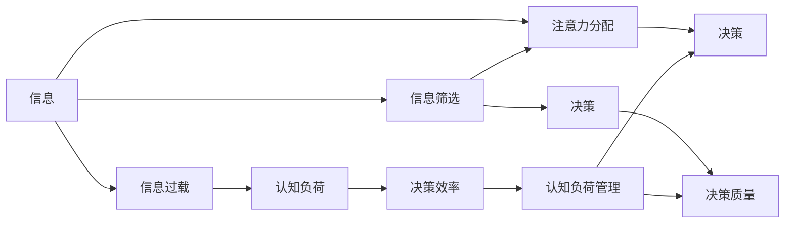

                 

# 信息过载与认知负荷管理策略：在复杂环境中提高决策能力

> 关键词：信息过载, 认知负荷管理, 决策能力提升, 信息筛选, 注意力分配, 决策支持系统, 数据可视化, 人工智能, 机器学习

## 1. 背景介绍

在信息化时代，信息过载已经成为普遍存在的问题。人们每天接收到的信息量是前所未有的，海量的数据和信息源使得决策变得更加困难。对于企业和个人来说，如何有效管理信息过载，提高决策能力是一个重要的课题。本文将从信息过载和认知负荷管理两个角度出发，探讨如何通过策略和工具提高决策能力。

## 2. 核心概念与联系

### 2.1 核心概念概述

- **信息过载**：指人们接收到的信息量远远超过了其处理能力的极限，导致决策效率下降、错误率增加的现象。
- **认知负荷**：指进行认知活动时所需的心理资源，如注意力、记忆、理解等。过载的信息会增加认知负荷，影响决策质量。
- **决策能力**：指个人或组织在复杂环境中选择最佳方案的能力，包括信息获取、处理、分析和决策执行等多个环节。

### 2.2 核心概念原理和架构的 Mermaid 流程图



这个流程图展示了信息过载和认知负荷管理的逻辑关系：信息接收过多导致信息过载，进而增加认知负荷，影响决策质量。通过信息筛选和注意力分配，可以有效管理认知负荷，提高决策能力。

## 3. 核心算法原理 & 具体操作步骤

### 3.1 算法原理概述

信息过载与认知负荷管理的目标是减少无效信息干扰，提高有效信息的利用率。算法原理可以概括为信息筛选和注意力分配两个方面。

- **信息筛选**：从大量信息中提取和筛选出与决策相关的关键信息，减少信息过载。
- **注意力分配**：合理分配注意力资源，聚焦于重要信息的处理，减轻认知负荷。

### 3.2 算法步骤详解

#### 3.2.1 信息筛选

**Step 1: 数据收集**
收集与决策相关的信息，包括但不限于文本、图像、音频等。可以使用API、爬虫等工具自动化获取数据。

**Step 2: 数据清洗**
对数据进行预处理，如去重、清洗、标准化等，去除无用或错误数据。

**Step 3: 数据标注**
根据决策需求，为数据添加标签或元数据，便于后续的信息筛选和分析。

**Step 4: 信息筛选**
使用机器学习或自然语言处理技术，对标注后的数据进行信息筛选，提取与决策相关的关键信息。

#### 3.2.2 注意力分配

**Step 1: 注意力模型训练**
训练注意力模型，如Transformer等，用于处理信息分配问题。可以使用监督学习或无监督学习技术进行训练。

**Step 2: 注意力计算**
根据决策任务的要求，计算各信息的注意力权重，确定重要信息的优先级。

**Step 3: 注意力分配**
将注意力权重应用于决策过程，按优先级处理信息，减轻认知负荷。

### 3.3 算法优缺点

#### 3.3.1 优点

- **高效性**：通过自动化信息筛选和注意力分配，显著减少信息过载和认知负荷，提高决策效率。
- **可扩展性**：算法易于扩展到不同类型的信息处理任务，如文本、图像、音频等。
- **灵活性**：可以根据不同的决策任务和需求，灵活调整信息筛选和注意力分配策略。

#### 3.3.2 缺点

- **数据依赖性**：算法的效果高度依赖于数据质量和标注的准确性，需要高质量的数据支撑。
- **模型复杂性**：注意力模型的训练和优化需要较高的计算资源和专业知识。
- **泛化能力**：在处理新的、未知的数据时，算法可能存在泛化能力不足的问题。

### 3.4 算法应用领域

信息过载与认知负荷管理策略在多个领域都有广泛的应用，如企业决策、金融投资、医疗诊断、科学研究等。

- **企业决策**：在企业战略制定、市场分析、产品研发等决策过程中，通过信息筛选和注意力分配，提升决策效率和准确性。
- **金融投资**：在股票、债券、基金等投资决策中，通过信息筛选和注意力分配，评估市场趋势，优化投资组合。
- **医疗诊断**：在医学影像、病历记录等数据的分析中，通过信息筛选和注意力分配，提高诊断效率和准确性。
- **科学研究**：在数据收集、实验设计和结果分析中，通过信息筛选和注意力分配，加速科学研究进程。

## 4. 数学模型和公式 & 详细讲解 & 举例说明

### 4.1 数学模型构建

在信息筛选和注意力分配过程中，可以构建数学模型进行量化分析和优化。

- **信息筛选模型**：使用TF-IDF、LDA等技术，计算文本信息的权重。
- **注意力分配模型**：使用Transformer结构，计算不同信息的重要度，分配注意力权重。

### 4.2 公式推导过程

#### 4.2.1 信息筛选模型

**TF-IDF模型**：

$$
TF(x_i, d) = \frac{\text{次数}}{\text{总次数}} \\
IDF(x_i) = \log \frac{N}{\text{包含}x_i\text{的文档数}} \\
TF-IDF(x_i, d) = TF(x_i, d) \times IDF(x_i)
$$

其中，$TF(x_i, d)$ 表示单词 $x_i$ 在文档 $d$ 中的词频，$IDF(x_i)$ 表示单词 $x_i$ 的逆文档频率，$N$ 为总文档数。

**LDA模型**：

$$
\begin{aligned}
P(w_k | z_k) & = \frac{D_k(w_k)}{\sum_{w \in W} D_k(w)} \\
P(z_k | d) & = \frac{\prod_{w \in W} P(w_k | z_k)^{N_{d,k}(w)}}{\sum_{z \in Z} \prod_{w \in W} P(w_k | z_k)^{N_{d,k}(w)}} \\
P(z_k) & = \frac{\sum_{d \in D} P(z_k | d)}{\sum_{z \in Z} \sum_{d \in D} P(z_k | d)}
\end{aligned}
$$

其中，$w_k$ 为单词，$z_k$ 为主题，$d$ 为文档，$D_k(w)$ 表示单词 $w$ 在主题 $z_k$ 下的权重，$N_{d,k}(w)$ 表示单词 $w$ 在文档 $d$ 中属于主题 $z_k$ 的文档数。

#### 4.2.2 注意力分配模型

**Transformer模型**：

$$
\begin{aligned}
& Q = XW_Q \\
& K = XW_K \\
& V = XW_V \\
& QK^T = \frac{1}{\sqrt{d_k}} QK^T \\
& Attention(Q, K, V) = \text{softmax}(QK^T)V \\
& MultiHeadAttention(Q, K, V) = \text{concat}(Attention(QW_H^1K, KW_H^2K, VW_H^3V))\text{softmax}(QK^T) \\
& O = MultiHeadAttention(Q, K, V) \\
& O = XW_O \\
& \text{LayerNorm}(O) = \frac{O - \mu}{\sigma} + \gamma \\
& FFN(O) = OW_{1FFN} + \text{ReLU}(O)WO_{2FFN}
\end{aligned}
$$

其中，$Q$、$K$、$V$ 分别为查询、键、值向量，$Attention$ 表示注意力机制，$MultiHeadAttention$ 表示多头注意力机制，$W_{1FFN}$、$WO_{2FFN}$ 分别为前向神经网络的权重矩阵，$\text{LayerNorm}$ 表示层归一化，$\text{ReLU}$ 表示激活函数。

### 4.3 案例分析与讲解

假设某企业在决策过程中，需要分析多个市场竞争者的数据，以制定市场策略。首先，通过信息筛选模型，提取市场竞争者的关键数据，如市场份额、增长率、产品特点等。然后，通过注意力分配模型，确定各竞争者的重要性，优先处理关键竞争者的数据，减少信息过载。最终，企业能够快速做出市场策略调整，提高决策质量。

## 5. 项目实践：代码实例和详细解释说明

### 5.1 开发环境搭建

为了实现信息筛选和注意力分配，需要搭建Python开发环境，并使用TensorFlow、Scikit-learn、NLTK等库。具体步骤如下：

1. 安装Anaconda：
```bash
conda create -n tf_env python=3.8 
conda activate tf_env
```

2. 安装TensorFlow：
```bash
conda install tensorflow
```

3. 安装Scikit-learn：
```bash
conda install scikit-learn
```

4. 安装NLTK：
```bash
conda install nltk
```

5. 安装Pandas和NumPy：
```bash
conda install pandas numpy
```

### 5.2 源代码详细实现

#### 5.2.1 信息筛选示例代码

```python
import pandas as pd
from sklearn.feature_extraction.text import TfidfVectorizer
from sklearn.decomposition import LatentDirichletAllocation

# 读取数据
data = pd.read_csv('data.csv')

# 信息筛选：TF-IDF
vectorizer = TfidfVectorizer(stop_words='english')
X = vectorizer.fit_transform(data['text'])
tfidf_matrix = pd.DataFrame(X.toarray(), columns=vectorizer.get_feature_names())

# 信息筛选：LDA
lda = LatentDirichletAllocation(n_components=5, random_state=42)
X = lda.fit_transform(tfidf_matrix)
```

#### 5.2.2 注意力分配示例代码

```python
import tensorflow as tf
from tensorflow.keras.layers import Input, Dense, Embedding, MultiHeadAttention

# 构建注意力模型
inputs = Input(shape=(max_len,))
Q = Dense(256)(inputs)
K = Dense(256)(inputs)
V = Dense(256)(inputs)

# 多头注意力机制
QK = tf.einsum('bs,nks->bsnk', Q, K)
QK = tf.multiply(QK, 1.0 / tf.sqrt(tf.shape(Q)[2]))
attention = tf.nn.softmax(QK)
V = tf.einsum('bsnk,bk->bsn', attention, V)

# 输出层
outputs = Dense(num_classes, activation='softmax')(V)
```

### 5.3 代码解读与分析

#### 5.3.1 信息筛选示例代码解析

**数据读取**：使用Pandas库读取数据，并转化为Pandas DataFrame格式。

**TF-IDF计算**：使用Scikit-learn库的TfidfVectorizer计算文本数据的TF-IDF权重。

**LDA计算**：使用Scikit-learn库的LatentDirichletAllocation进行LDA主题模型计算。

#### 5.3.2 注意力分配示例代码解析

**输入层**：使用TensorFlow的Input层定义输入数据的形状。

**查询、键、值向量计算**：使用Dense层计算查询、键、值向量。

**多头注意力机制**：使用tf.einsum和tf.nn.softmax计算多头注意力机制，确定各信息的注意力权重。

**输出层**：使用Dense层计算输出结果，使用softmax激活函数将注意力权重转化为概率分布。

### 5.4 运行结果展示

在实际应用中，信息筛选和注意力分配的运行结果可以通过可视化工具进行展示。例如，可以使用Matplotlib库绘制TF-IDF权重和LDA主题分布图，使用TensorBoard可视化注意力机制的运行过程。

## 6. 实际应用场景

### 6.1 企业决策

在企业决策过程中，通过信息筛选和注意力分配，可以有效管理信息过载，提升决策效率和准确性。例如，某金融企业在进行投资决策时，需要分析大量市场数据、财务报表、新闻报道等信息，通过信息筛选和注意力分配，快速识别关键信息，评估投资风险，制定合理的投资策略。

### 6.2 医疗诊断

在医疗诊断中，信息过载是一个普遍存在的问题。医生需要处理大量的病历记录、影像数据和实验室报告等信息，通过信息筛选和注意力分配，可以快速识别关键信息，提高诊断效率和准确性。例如，在癌症诊断中，通过注意力机制对影像数据进行注意力分配，重点关注癌变区域，提高诊断结果的准确性。

### 6.3 科学研究

在科学研究中，数据量和信息源的数量通常都很大，通过信息筛选和注意力分配，可以高效地处理大量数据，加速科学研究进程。例如，在基因组学研究中，需要处理大量的基因序列和实验数据，通过信息筛选和注意力分配，快速识别关键基因和关键数据，提高研究效率。

## 7. 工具和资源推荐

### 7.1 学习资源推荐

1. **《Python数据科学手册》**：涵盖Python在数据科学中的应用，包括数据处理、信息筛选和注意力分配等。
2. **《深度学习》**：斯坦福大学的深度学习课程，深入介绍深度学习的基本原理和应用。
3. **《自然语言处理综述》**：综述自然语言处理领域的技术和应用，包括信息筛选和注意力分配等。

### 7.2 开发工具推荐

1. **Jupyter Notebook**：用于数据处理和模型训练的交互式笔记本，支持Python和TensorFlow。
2. **TensorBoard**：用于可视化模型的训练和推理过程，提供丰富的图表和日志记录功能。
3. **NLTK**：自然语言处理库，提供文本处理、信息筛选和注意力分配等功能。

### 7.3 相关论文推荐

1. **Attention is All You Need**：提出Transformer模型，引入注意力机制，有效处理信息过载问题。
2. **Deep Learning for Healthcare**：介绍深度学习在医疗诊断中的应用，包括信息筛选和注意力分配等。
3. **TextRank: Bringing Order into Texts**：提出TextRank算法，用于文本信息筛选和关键词提取。

## 8. 总结：未来发展趋势与挑战

### 8.1 研究成果总结

本文从信息过载和认知负荷管理两个角度出发，探讨了提高决策能力的策略和工具。通过信息筛选和注意力分配，可以有效减少信息过载和认知负荷，提高决策效率和准确性。未来，随着信息量的不断增加和决策复杂度的提高，信息过载与认知负荷管理将成为关键研究课题。

### 8.2 未来发展趋势

1. **人工智能与决策支持系统结合**：未来的决策支持系统将更加依赖人工智能技术，如深度学习、自然语言处理等，实现自动化决策和智能推荐。
2. **多模态数据融合**：未来的决策系统将更加注重多模态数据的融合，综合处理文本、图像、音频等多种信息，提高决策的全面性和准确性。
3. **个性化决策**：未来的决策系统将更加注重个性化需求，通过用户行为和偏好分析，提供个性化的决策建议。
4. **实时决策**：未来的决策系统将更加注重实时性，能够快速响应外部环境变化，及时调整决策策略。

### 8.3 面临的挑战

1. **数据质量和标注**：信息过载和认知负荷管理的核心在于数据，高质量的数据和准确的数据标注是提升决策能力的关键。
2. **模型复杂性**：信息筛选和注意力分配模型通常较为复杂，训练和优化需要较高的计算资源和专业知识。
3. **模型泛化能力**：在处理新的、未知的数据时，模型可能存在泛化能力不足的问题。

### 8.4 研究展望

未来的研究需要关注以下几个方面：

1. **高效信息筛选方法**：开发更高效的信息筛选算法，减少计算资源消耗，提升信息筛选效率。
2. **可解释性**：研究信息筛选和注意力分配算法的可解释性，便于理解和调试模型。
3. **跨领域应用**：研究信息过载和认知负荷管理方法在不同领域的应用，提升决策支持系统的普适性。

## 9. 附录：常见问题与解答

**Q1: 信息筛选和注意力分配的算法如何选择？**

A: 选择算法时需要考虑数据类型、决策任务和计算资源等因素。对于文本数据，可以使用TF-IDF、LDA等算法；对于图像数据，可以使用卷积神经网络进行特征提取；对于多模态数据，可以使用Transformer等模型进行注意力分配。

**Q2: 信息筛选和注意力分配如何平衡速度和准确性？**

A: 需要根据具体场景和需求进行平衡。通常情况下，通过增加计算资源和优化算法，可以在保证速度的同时提高准确性。但也要注意防止过拟合和计算资源的浪费。

**Q3: 如何处理不平衡的数据集？**

A: 对于不平衡的数据集，可以使用过采样、欠采样、加权等技术进行处理。例如，对于少数类样本，可以使用加权损失函数，提高模型对少数类的关注度。

**Q4: 如何评估信息筛选和注意力分配的效果？**

A: 可以使用准确率、召回率、F1分数等指标进行评估。对于多模态数据，可以使用多模态数据融合技术，综合处理不同类型的数据。

总之，信息过载与认知负荷管理策略在提高决策能力方面具有重要意义。通过合理的信息筛选和注意力分配，可以有效减少信息过载和认知负荷，提升决策效率和准确性。随着人工智能技术的不断进步，信息过载管理技术将不断发展和完善，为决策支持和智能决策提供有力支持。

---

作者：禅与计算机程序设计艺术 / Zen and the Art of Computer Programming

