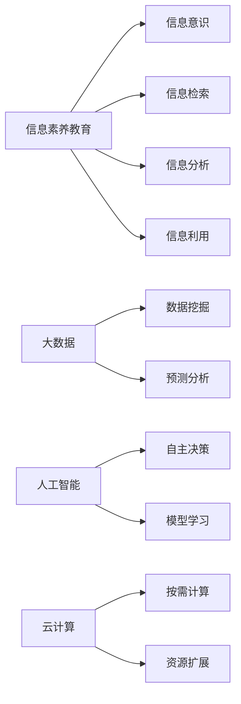

                 

## 1. 背景介绍

在信息时代，大数据、人工智能、云计算等技术的飞速发展，改变了人们获取、处理和利用信息的方式。信息素养（Information Literacy）成为数字时代每个人都必须具备的能力。信息素养不仅是获取知识和信息的能力，更重要的是理解和评估信息的质量和可靠性的能力，以及在信息海洋中找到所需信息的能力。

### 1.1 信息素养的定义

信息素养是指人们在信息时代获取、评估、管理和利用信息的能力。它包括信息意识、信息检索、信息分析、信息利用等多个方面。信息素养教育旨在培养人们的信息素养能力，提高其处理和利用信息的能力，以适应信息爆炸时代的各种挑战。

### 1.2 信息素养的重要性

信息素养在数字时代的重要性不言而喻。随着信息技术的普及，信息的获取变得容易，但信息泛滥也带来了信息过载、信息误导等问题。信息素养教育能够帮助人们有效辨别信息真伪，提高信息处理和利用的效率，保障信息安全，增强个人和组织的决策能力。

## 2. 核心概念与联系

### 2.1 核心概念概述

- **信息素养教育**：通过培训和教育，提高个人或组织的信息意识、信息检索、信息分析和信息利用的能力。
- **信息验证**：通过各种技术和方法，评估信息的真实性、可靠性和有效性。
- **大数据**：指大规模、复杂的数据集合，可用于数据挖掘、预测分析等。
- **人工智能**：通过算法和模型，使机器模拟人类智能，实现自主决策和学习。
- **云计算**：通过网络提供按需、可扩展的计算资源，支持大规模数据处理和应用开发。

这些核心概念构成了信息素养教育的基础，它们之间的关系可以用以下Mermaid流程图表示：



### 2.2 核心概念原理和架构

信息素养教育的核心原理是通过系统的培训和实践，使受教育者掌握信息意识、信息检索、信息分析和信息利用的技能。信息验证则是一个评估和筛选信息的过程，通过技术手段（如数据挖掘、机器学习等）验证信息的真实性和可靠性。大数据和人工智能为信息验证提供了强大的工具和平台，云计算则为数据处理和分析提供了高效的计算资源。

## 3. 核心算法原理 & 具体操作步骤

### 3.1 算法原理概述

信息验证的核心算法包括数据挖掘、机器学习、自然语言处理等。数据挖掘算法通过分析大数据集中的模式和规律，发现潜在的信息关联。机器学习算法则利用历史数据训练模型，预测新信息的真实性和可靠性。自然语言处理算法则用于分析和理解文本信息，提取关键信息点。

### 3.2 算法步骤详解

#### 3.2.1 数据准备

数据准备是信息验证的第一步。包括数据的收集、清洗、标注等步骤。数据的清洗和标注需要遵循一定的规范，以提高数据质量。

#### 3.2.2 特征工程

特征工程是将原始数据转换为模型能够理解的形式的过程。包括特征提取、特征选择、特征变换等步骤。特征工程的好坏直接影响到模型训练的效果。

#### 3.2.3 模型训练

模型训练是信息验证的核心步骤。选择适合问题的模型（如分类模型、回归模型等），利用标注数据训练模型。模型训练的目标是最小化模型在验证集上的误差，提高模型的泛化能力。

#### 3.2.4 模型评估

模型评估是通过各种指标（如准确率、召回率、F1分数等）来评估模型性能的过程。评估结果可以指导模型的调整和优化。

#### 3.2.5 信息验证

信息验证是将训练好的模型应用于新数据的过程。模型通过分析和比较新数据与已有数据的特点，判断新信息的真实性和可靠性。

### 3.3 算法优缺点

#### 3.3.1 优点

1. **自动化**：信息验证算法能够自动分析和筛选信息，提高效率。
2. **高精度**：利用机器学习和数据挖掘技术，信息验证的准确率较高。
3. **可扩展性**：云计算提供了高效的计算资源，支持大规模数据处理。

#### 3.3.2 缺点

1. **依赖数据质量**：信息验证的效果依赖于数据的质量和数量，数据质量差会导致误判。
2. **模型复杂性**：一些复杂的模型需要大量的计算资源和专业知识，难以推广应用。
3. **数据隐私**：数据挖掘和机器学习算法可能涉及敏感数据，需要考虑隐私保护问题。

### 3.4 算法应用领域

信息验证算法在多个领域都有广泛应用，包括：

- **网络安全**：用于识别和防御恶意软件、钓鱼网站等网络攻击。
- **新闻媒体**：用于判断新闻报道的真实性和可信度。
- **金融分析**：用于评估金融数据的真实性和可靠性。
- **医疗健康**：用于分析医疗数据的真实性和可靠性。
- **教育培训**：用于验证和筛选教育资源的真实性和可靠性。

## 4. 数学模型和公式 & 详细讲解 & 举例说明

### 4.1 数学模型构建

信息验证的数学模型通常包括分类模型、回归模型和聚类模型等。以分类模型为例，其数学模型可以表示为：

$$ y = \sum_{i=1}^{n} w_i x_i + b $$

其中 $y$ 是分类结果，$x_i$ 是特征向量，$w_i$ 是特征权重，$b$ 是偏置项。

### 4.2 公式推导过程

以逻辑回归模型为例，其损失函数可以表示为：

$$ J(w,b) = -\frac{1}{2m} \sum_{i=1}^{m} (y^{(i)} \log h_{\theta}(x^{(i)}) + (1-y^{(i)}) \log (1-h_{\theta}(x^{(i)}))) + \frac{\lambda}{2m} \sum_{i=1}^{n} w_i^2 $$

其中 $m$ 是样本数量，$y^{(i)}$ 是样本的真实标签，$h_{\theta}(x^{(i)}) = \frac{1}{1+e^{-\theta^T x^{(i)}}}$ 是逻辑回归模型的输出，$\theta$ 是模型参数，$\lambda$ 是正则化系数。

### 4.3 案例分析与讲解

以网络安全领域为例，信息验证算法可以用于识别和防御恶意软件。训练一个分类模型，利用已知的恶意软件和正常软件特征，预测新软件是否为恶意软件。模型的输入特征可以包括文件大小、文件类型、执行权限等，输出为0或1，0表示正常，1表示恶意。

## 5. 项目实践：代码实例和详细解释说明

### 5.1 开发环境搭建

为了进行信息验证的实践，需要搭建一个Python开发环境，包括以下步骤：

1. 安装Python 3.x。
2. 安装所需的Python包，如numpy、pandas、scikit-learn等。
3. 安装Jupyter Notebook，用于编写和运行Python代码。

### 5.2 源代码详细实现

以逻辑回归模型为例，以下是使用scikit-learn库进行信息验证的Python代码：

```python
from sklearn.linear_model import LogisticRegression
from sklearn.model_selection import train_test_split
from sklearn.metrics import accuracy_score

# 准备数据
X = ... # 特征数据
y = ... # 标签数据

# 分割数据集
X_train, X_test, y_train, y_test = train_test_split(X, y, test_size=0.2, random_state=42)

# 训练逻辑回归模型
model = LogisticRegression()
model.fit(X_train, y_train)

# 预测测试集
y_pred = model.predict(X_test)

# 计算准确率
accuracy = accuracy_score(y_test, y_pred)
print("Accuracy: {:.2f}%".format(accuracy * 100))
```

### 5.3 代码解读与分析

上述代码中，首先准备数据集，使用train_test_split方法将其分割为训练集和测试集。然后使用逻辑回归模型对训练集进行训练，最后使用测试集进行预测，计算准确率。

## 6. 实际应用场景

### 6.1 网络安全

网络安全是信息验证的重要应用领域。通过训练分类模型，对网络流量进行分析，识别恶意软件和钓鱼网站，提高网络安全性。

### 6.2 新闻媒体

新闻媒体需要保证信息的真实性和可靠性。通过训练分类模型，对新闻报道进行评估，判断其真实性和可信度。

### 6.3 金融分析

金融分析需要评估金融数据的真实性和可靠性。通过训练回归模型，预测金融市场的趋势和风险，帮助投资者做出更好的决策。

### 6.4 医疗健康

医疗健康领域需要分析医疗数据的真实性和可靠性。通过训练分类模型，对病历数据进行分析，预测患者的疾病风险，提供个性化的医疗建议。

## 7. 工具和资源推荐

### 7.1 学习资源推荐

为了提高信息素养能力，以下是一些推荐的学习资源：

1. **Coursera**：提供大量与信息素养和信息验证相关的课程。
2. **edX**：提供信息素养教育的在线课程和认证。
3. **Khan Academy**：提供免费的计算机科学和数据科学课程。
4. **Google Digital Garage**：提供数字素养和信息验证的培训课程。

### 7.2 开发工具推荐

为了进行信息验证的实践，以下是一些推荐的开发工具：

1. **Jupyter Notebook**：用于编写和运行Python代码，支持代码块的交互式调试。
2. **GitHub**：用于版本控制和代码协作。
3. **Anaconda**：用于创建和管理Python环境，支持科学计算和数据分析。

### 7.3 相关论文推荐

以下是一些信息验证和信息素养教育领域的重要论文：

1. **"Information Literacy and Information素养 Education"**：探讨信息素养教育的必要性和重要性。
2. **"Data Mining and Statistical Learning"**：介绍数据挖掘和机器学习的基本原理和应用。
3. **"Natural Language Processing"**：介绍自然语言处理的基本概念和算法。
4. **"Cloud Computing and Information Validation"**：探讨云计算在信息验证中的应用。

## 8. 总结：未来发展趋势与挑战

### 8.1 研究成果总结

信息验证和信息素养教育的研究取得了显著进展，包括数据挖掘、机器学习、自然语言处理等技术在信息验证中的应用。但信息素养教育仍面临挑战，如数据质量、模型复杂性、隐私保护等问题。

### 8.2 未来发展趋势

未来的信息素养教育和信息验证将呈现以下发展趋势：

1. **自动化**：自动化信息验证技术将越来越普及，提高效率和准确性。
2. **智能化**：智能信息验证系统将结合人工智能技术，进一步提高信息验证的能力。
3. **数据集成**：跨领域数据集成将进一步提高信息验证的效果。
4. **隐私保护**：隐私保护技术将得到进一步加强，保障数据安全。

### 8.3 面临的挑战

信息素养教育和信息验证仍面临以下挑战：

1. **数据质量**：数据质量和数量直接影响信息验证的效果。
2. **模型复杂性**：复杂模型需要大量的计算资源和专业知识，难以推广应用。
3. **隐私保护**：数据挖掘和机器学习算法可能涉及敏感数据，需要考虑隐私保护问题。
4. **人机协作**：信息素养教育需要结合人机协作，提高教育效果。

### 8.4 研究展望

未来的信息素养教育和信息验证研究将重点关注以下几个方面：

1. **自动化和智能化**：发展自动化和智能化信息验证技术，提高效率和准确性。
2. **跨领域数据集成**：探索跨领域数据集成技术，提高信息验证的效果。
3. **隐私保护**：开发隐私保护技术，保障数据安全。
4. **人机协作**：结合人机协作，提高信息素养教育的效果。

## 9. 附录：常见问题与解答

**Q1：什么是信息素养教育？**

A: 信息素养教育是通过培训和教育，提高个人或组织的信息意识、信息检索、信息分析和信息利用的能力。

**Q2：如何进行信息验证？**

A: 信息验证是通过数据挖掘、机器学习、自然语言处理等技术，评估信息的真实性和可靠性。

**Q3：信息素养教育和信息验证的区别是什么？**

A: 信息素养教育注重培养信息素养能力，而信息验证注重评估信息的质量和可靠性。

**Q4：信息验证在实际应用中有什么作用？**

A: 信息验证可以识别和防御恶意软件、钓鱼网站等网络攻击，评估新闻报道的真实性和可信度，预测金融市场的趋势和风险，分析医疗数据的真实性和可靠性等。

**Q5：信息验证的算法有哪些？**

A: 信息验证的算法包括数据挖掘、机器学习、自然语言处理等。

**Q6：信息验证的缺点是什么？**

A: 信息验证的缺点包括依赖数据质量、模型复杂性、数据隐私等。

---

作者：禅与计算机程序设计艺术 / Zen and the Art of Computer Programming

