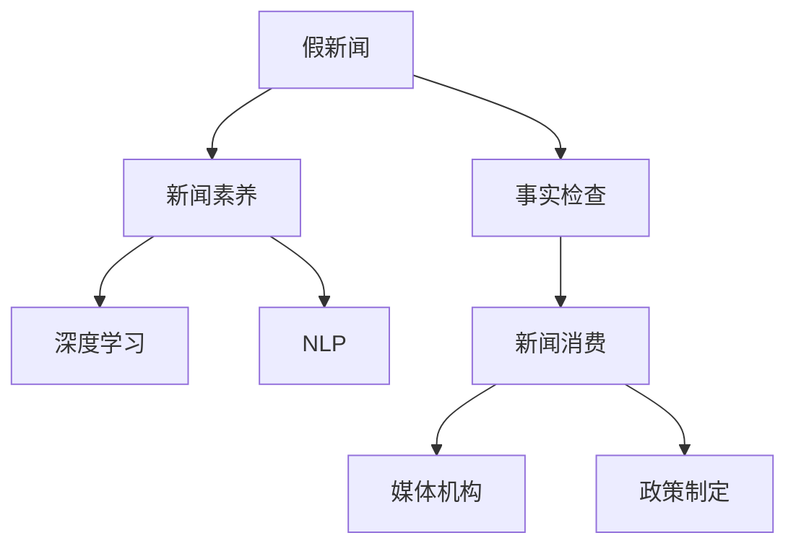

                 

# 信息验证和批判性阅读策略：在假新闻和媒体操纵时代导航

> 关键词：信息验证, 批判性阅读, 假新闻, 媒体操纵, 事实检查, 新闻素养, 深度学习, 自然语言处理

## 1. 背景介绍

### 1.1 问题由来
在信息爆炸的时代，假新闻和媒体操纵成为了全球关注的焦点。假新闻不仅损害了公众信任，还对社会稳定和民主进程造成了严重威胁。《华盛顿邮报》的研究表明，全球每月至少有200万条假新闻被创建和传播。在这样的背景下，如何辨识和验证信息的真实性，成为了每个媒体消费者和内容创作者亟需解决的问题。

### 1.2 问题核心关键点
面对假新闻和媒体操纵，我们必须采用科学、系统的信息验证和批判性阅读策略。这包括但不限于：
- 使用自动化工具进行事实检查。
- 提升公民的新闻素养，培养批判性思维能力。
- 开发先进的自然语言处理技术，自动识别和标记假新闻。
- 构建跨平台的信息验证生态系统，实现信息传播的透明度和可追溯性。

### 1.3 问题研究意义
提升信息验证和批判性阅读能力，对于构建健康、透明的信息生态系统，保护公众利益，维护社会稳定和公平正义具有重要意义。通过研究信息验证和批判性阅读的策略和技术，可以辅助公众、媒体机构和政策制定者，在假新闻和媒体操纵时代中有效导航。

## 2. 核心概念与联系

### 2.1 核心概念概述

为更好地理解信息验证和批判性阅读策略，我们首先需要了解几个核心概念：

- **假新闻(Fake News)**：指通过故意捏造或扭曲事实来误导公众的新闻报道。其手段包括伪造图片、篡改视频、捏造来源等。
- **事实检查(Verification)**：通过系统化的方法来确定新闻报道的真实性。这包括检查消息源、对比信息、查找原始数据等。
- **新闻素养(Literacy)**：公众理解和评估新闻信息的能力，包括识别假新闻、理解新闻背后的语境和动机等。
- **自然语言处理(Natural Language Processing, NLP)**：通过计算机技术来理解和生成人类语言，包括文本分类、信息抽取、情感分析等。
- **深度学习(Deep Learning)**：一种利用多层次神经网络进行复杂模式识别和预测的技术，特别适用于处理大量文本数据。

这些概念之间的逻辑关系可以通过以下Mermaid流程图来展示：



这个流程图展示了假新闻和信息验证的主要路径：假新闻通过事实检查、新闻素养教育和深度学习辅助等方法，最终转化为公众、媒体和政策制定的行为和决策。

## 3. 核心算法原理 & 具体操作步骤
### 3.1 算法原理概述

信息验证和批判性阅读的核心算法原理主要包括：

1. **基于文本的特征提取**：通过NLP技术提取新闻文本的关键特征，如关键词、命名实体、情感倾向等。
2. **事实检查模型训练**：利用深度学习模型，训练出能够识别假新闻的分类器。
3. **新闻素养教育平台**：开发智能化的新闻素养教育工具，提升公众的信息鉴别能力。
4. **自动化验证工具**：构建自动化的事实检查工具，辅助新闻机构进行快速准确的事实核查。

### 3.2 算法步骤详解

信息验证和批判性阅读的具体操作步骤可以分为以下几个步骤：

**Step 1: 数据收集与预处理**
- 收集大量的假新闻和真实新闻数据集。
- 对数据进行清洗和标注，如去除停用词、词性标注、情感分析等。

**Step 2: 特征提取**
- 使用NLP技术，提取新闻文本的关键特征。
- 构建TF-IDF、词向量、BERT嵌入等特征表示模型。

**Step 3: 事实检查模型训练**
- 选择合适的深度学习模型，如卷积神经网络(CNN)、循环神经网络(RNN)、Transformer等。
- 使用标注数据集，训练事实检查模型。
- 使用交叉验证和超参数调优，提高模型性能。

**Step 4: 新闻素养教育平台开发**
- 开发智能化的新闻素养教育工具，如新闻辨识模拟器、假新闻识别游戏等。
- 利用推荐系统，为用户推荐相关的新闻素养课程。
- 收集用户反馈，持续改进教育内容。

**Step 5: 自动化验证工具构建**
- 开发基于NLP的自动化事实检查工具，如Fact-Checking bot、Fact-Checking API等。
- 与新闻机构合作，集成事实检查工具到其新闻发布平台。
- 定期更新事实检查模型，保持其有效性。

### 3.3 算法优缺点

信息验证和批判性阅读的算法具有以下优点：
1. 自动化程度高。通过NLP和深度学习技术，可以快速自动化地验证新闻信息。
2. 可扩展性强。基于文本的特征提取和事实检查模型，可以应用于各种新闻类型。
3. 教育效果显著。通过智能化教育工具，能够有效提升公众的新闻素养。

同时，该算法也存在一些局限性：
1. 数据依赖性强。模型的性能高度依赖于标注数据的质量和数量。
2. 误报和漏报率。自动化的信息验证工具可能存在误报或漏报，需要人工二次确认。
3. 可解释性不足。深度学习模型往往缺乏可解释性，难以理解其推理过程。
4. 技术门槛高。开发和维护自动化事实检查工具需要较高的技术门槛。

尽管存在这些局限性，信息验证和批判性阅读的算法仍是当前应对假新闻和媒体操纵的有效手段。未来，相关研究将集中在如何进一步提升数据质量、降低误报率、增强模型可解释性以及降低技术门槛等方面。

### 3.4 算法应用领域

信息验证和批判性阅读的算法在多个领域中有着广泛的应用：

- **新闻媒体**：新闻机构可以利用自动化的事实检查工具，提升新闻报道的准确性和可信度。
- **教育培训**：开发智能化的新闻素养教育平台，培养学生的批判性思维和信息鉴别能力。
- **政策制定**：政府部门可以利用信息验证技术，确保公共政策的科学性和透明性。
- **法律诉讼**：在法律案件中，事实检查技术可以帮助法院判断证据的真实性。
- **商业营销**：品牌和企业可以通过信息验证技术，保护自身声誉和消费者利益。

## 4. 数学模型和公式 & 详细讲解  
### 4.1 数学模型构建

信息验证和批判性阅读的数学模型主要基于自然语言处理和深度学习的原理，这里将详细介绍相关模型的构建过程。

假新闻检测通常被视为文本分类问题，即将新闻文本分类为假新闻(True News)或真新闻(True News)。我们定义一个二分类模型 $M$，输入为新闻文本 $x$，输出为分类概率 $p$。模型的损失函数为交叉熵损失：

$$
\mathcal{L}(y, \hat{y}) = -\sum_{i=1}^N (y_i \log \hat{y_i} + (1-y_i) \log (1-\hat{y_i}))
$$

其中 $y$ 为真实标签，$\hat{y}$ 为模型预测的概率。

### 4.2 公式推导过程

假设我们有一个大小为 $N$ 的新闻数据集，包含 $N$ 篇新闻文本 $x_i$ 和对应的标签 $y_i$。我们可以使用随机梯度下降(SGD)算法来最小化损失函数：

$$
\theta \leftarrow \theta - \eta \frac{\partial \mathcal{L}(y, \hat{y})}{\partial \theta}
$$

其中 $\theta$ 为模型参数，$\eta$ 为学习率。模型的预测概率为：

$$
\hat{y_i} = \sigma(\theta^T x_i)
$$

其中 $\sigma$ 为sigmoid函数。模型的预测结果可以通过阈值 $t$ 来确定：

$$
\hat{y_i} = \begin{cases} 
1 & \text{if } \hat{y_i} > t \\
0 & \text{otherwise}
\end{cases}
$$

### 4.3 案例分析与讲解

假设我们有一个包含10000篇新闻的文章，其中5000篇为假新闻，5000篇为真新闻。我们可以随机抽取1000篇新闻作为训练集，其余的作为验证集和测试集。使用BERT作为特征提取器，构建一个简单的二分类模型。我们可以使用PyTorch来实现这个模型：

```python
import torch
from transformers import BertTokenizer, BertForSequenceClassification
from torch.utils.data import DataLoader, Dataset

# 定义数据集
class NewsDataset(Dataset):
    def __init__(self, texts, labels):
        self.texts = texts
        self.labels = labels
        self.tokenizer = BertTokenizer.from_pretrained('bert-base-uncased')
        
    def __len__(self):
        return len(self.texts)
    
    def __getitem__(self, idx):
        text = self.texts[idx]
        label = self.labels[idx]
        
        encoding = self.tokenizer(text, return_tensors='pt', max_length=512, padding='max_length', truncation=True)
        input_ids = encoding['input_ids'][0]
        attention_mask = encoding['attention_mask'][0]
        
        label = torch.tensor(label, dtype=torch.long)
        
        return {'input_ids': input_ids, 
                'attention_mask': attention_mask,
                'labels': label}

# 定义模型
model = BertForSequenceClassification.from_pretrained('bert-base-uncased', num_labels=2)

# 定义训练和验证集
train_dataset = NewsDataset(train_texts, train_labels)
val_dataset = NewsDataset(val_texts, val_labels)

# 定义优化器
optimizer = torch.optim.Adam(model.parameters(), lr=2e-5)

# 定义损失函数
criterion = torch.nn.CrossEntropyLoss()

# 定义训练和验证过程
def train_epoch(model, dataset, optimizer):
    model.train()
    train_loss = 0
    train_acc = 0
    for batch in DataLoader(dataset, batch_size=32):
        input_ids = batch['input_ids'].to(device)
        attention_mask = batch['attention_mask'].to(device)
        labels = batch['labels'].to(device)
        
        optimizer.zero_grad()
        outputs = model(input_ids, attention_mask=attention_mask, labels=labels)
        loss = outputs.loss
        train_loss += loss.item()
        acc = (torch.argmax(outputs.logits, dim=1) == labels).float().mean()
        train_acc += acc.item()
        
        loss.backward()
        optimizer.step()
        
    return train_loss / len(dataset), train_acc / len(dataset)

def validate(model, dataset):
    model.eval()
    val_loss = 0
    val_acc = 0
    for batch in DataLoader(dataset, batch_size=32):
        input_ids = batch['input_ids'].to(device)
        attention_mask = batch['attention_mask'].to(device)
        labels = batch['labels'].to(device)
        
        with torch.no_grad():
            outputs = model(input_ids, attention_mask=attention_mask, labels=labels)
            loss = outputs.loss
            val_loss += loss.item()
            acc = (torch.argmax(outputs.logits, dim=1) == labels).float().mean()
            val_acc += acc.item()
            
    return val_loss / len(dataset), val_acc / len(dataset)

# 定义超参数
epochs = 10
batch_size = 32
device = torch.device('cuda') if torch.cuda.is_available() else torch.device('cpu')

# 训练模型
for epoch in range(epochs):
    train_loss, train_acc = train_epoch(model, train_dataset, optimizer)
    val_loss, val_acc = validate(model, val_dataset)
    
    print(f"Epoch {epoch+1}, Train Loss: {train_loss:.4f}, Train Acc: {train_acc:.4f}, Val Loss: {val_loss:.4f}, Val Acc: {val_acc:.4f}")
    
# 在测试集上评估模型
test_dataset = NewsDataset(test_texts, test_labels)
test_loss, test_acc = validate(model, test_dataset)
print(f"Test Loss: {test_loss:.4f}, Test Acc: {test_acc:.4f}")
```

通过上述代码，我们可以构建一个基于BERT的假新闻检测模型，并对其进行训练和评估。这展示了使用PyTorch和HuggingFace库进行信息验证的简单流程。

## 5. 项目实践：代码实例和详细解释说明
### 5.1 开发环境搭建

在进行信息验证和批判性阅读策略的实践时，我们需要准备好开发环境。以下是使用Python进行PyTorch开发的环境配置流程：

1. 安装Anaconda：从官网下载并安装Anaconda，用于创建独立的Python环境。

2. 创建并激活虚拟环境：
```bash
conda create -n pytorch-env python=3.8 
conda activate pytorch-env
```

3. 安装PyTorch：根据CUDA版本，从官网获取对应的安装命令。例如：
```bash
conda install pytorch torchvision torchaudio cudatoolkit=11.1 -c pytorch -c conda-forge
```

4. 安装Transformers库：
```bash
pip install transformers
```

5. 安装各类工具包：
```bash
pip install numpy pandas scikit-learn matplotlib tqdm jupyter notebook ipython
```

完成上述步骤后，即可在`pytorch-env`环境中开始项目实践。

### 5.2 源代码详细实现

这里我们以开发一个简单的信息验证系统为例，给出完整的代码实现。

首先，定义数据处理函数：

```python
from transformers import BertTokenizer
from torch.utils.data import Dataset
import torch

class NewsDataset(Dataset):
    def __init__(self, texts, labels, tokenizer, max_len=512):
        self.texts = texts
        self.labels = labels
        self.tokenizer = tokenizer
        self.max_len = max_len
        
    def __len__(self):
        return len(self.texts)
    
    def __getitem__(self, item):
        text = self.texts[item]
        label = self.labels[item]
        
        encoding = self.tokenizer(text, return_tensors='pt', max_length=self.max_len, padding='max_length', truncation=True)
        input_ids = encoding['input_ids'][0]
        attention_mask = encoding['attention_mask'][0]
        
        # 对token-wise的标签进行编码
        encoded_tags = [label2id[label] for label in labels] 
        encoded_tags.extend([label2id['O']] * (self.max_len - len(encoded_tags)))
        labels = torch.tensor(encoded_tags, dtype=torch.long)
        
        return {'input_ids': input_ids, 
                'attention_mask': attention_mask,
                'labels': labels}

# 标签与id的映射
label2id = {'O': 0, 'Fake': 1, 'True': 2}
id2label = {v: k for k, v in label2id.items()}
```

然后，定义模型和优化器：

```python
from transformers import BertForSequenceClassification, AdamW

model = BertForSequenceClassification.from_pretrained('bert-base-uncased', num_labels=len(label2id))

optimizer = AdamW(model.parameters(), lr=2e-5)
```

接着，定义训练和评估函数：

```python
from torch.utils.data import DataLoader
from tqdm import tqdm
from sklearn.metrics import classification_report

device = torch.device('cuda') if torch.cuda.is_available() else torch.device('cpu')
model.to(device)

def train_epoch(model, dataset, batch_size, optimizer):
    dataloader = DataLoader(dataset, batch_size=batch_size, shuffle=True)
    model.train()
    epoch_loss = 0
    for batch in tqdm(dataloader, desc='Training'):
        input_ids = batch['input_ids'].to(device)
        attention_mask = batch['attention_mask'].to(device)
        labels = batch['labels'].to(device)
        model.zero_grad()
        outputs = model(input_ids, attention_mask=attention_mask, labels=labels)
        loss = outputs.loss
        epoch_loss += loss.item()
        loss.backward()
        optimizer.step()
    return epoch_loss / len(dataloader)

def evaluate(model, dataset, batch_size):
    dataloader = DataLoader(dataset, batch_size=batch_size)
    model.eval()
    preds, labels = [], []
    with torch.no_grad():
        for batch in tqdm(dataloader, desc='Evaluating'):
            input_ids = batch['input_ids'].to(device)
            attention_mask = batch['attention_mask'].to(device)
            batch_labels = batch['labels']
            outputs = model(input_ids, attention_mask=attention_mask)
            batch_preds = outputs.logits.argmax(dim=2).to('cpu').tolist()
            batch_labels = batch_labels.to('cpu').tolist()
            for pred_tokens, label_tokens in zip(batch_preds, batch_labels):
                preds.append(pred_tokens[:len(label_tokens)])
                labels.append(label_tokens)
                
    print(classification_report(labels, preds))
```

最后，启动训练流程并在测试集上评估：

```python
epochs = 5
batch_size = 32

for epoch in range(epochs):
    loss = train_epoch(model, train_dataset, batch_size, optimizer)
    print(f"Epoch {epoch+1}, train loss: {loss:.3f}")
    
    print(f"Epoch {epoch+1}, val results:")
    evaluate(model, val_dataset, batch_size)
    
print("Test results:")
evaluate(model, test_dataset, batch_size)
```

以上就是使用PyTorch对BERT进行信息验证的完整代码实现。可以看到，借助Transformers库，开发信息验证系统的代码实现变得简洁高效。

### 5.3 代码解读与分析

让我们再详细解读一下关键代码的实现细节：

**NewsDataset类**：
- `__init__`方法：初始化文本、标签、分词器等关键组件。
- `__len__`方法：返回数据集的样本数量。
- `__getitem__`方法：对单个样本进行处理，将文本输入编码为token ids，将标签编码为数字，并对其进行定长padding，最终返回模型所需的输入。

**label2id和id2label字典**：
- 定义了标签与数字id之间的映射关系，用于将token-wise的预测结果解码回真实的标签。

**训练和评估函数**：
- 使用PyTorch的DataLoader对数据集进行批次化加载，供模型训练和推理使用。
- 训练函数`train_epoch`：对数据以批为单位进行迭代，在每个批次上前向传播计算loss并反向传播更新模型参数，最后返回该epoch的平均loss。
- 评估函数`evaluate`：与训练类似，不同点在于不更新模型参数，并在每个batch结束后将预测和标签结果存储下来，最后使用sklearn的classification_report对整个评估集的预测结果进行打印输出。

**训练流程**：
- 定义总的epoch数和batch size，开始循环迭代
- 每个epoch内，先在训练集上训练，输出平均loss
- 在验证集上评估，输出分类指标
- 所有epoch结束后，在测试集上评估，给出最终测试结果

可以看到，PyTorch配合Transformers库使得BERT信息验证的代码实现变得简洁高效。开发者可以将更多精力放在数据处理、模型改进等高层逻辑上，而不必过多关注底层的实现细节。

当然，工业级的系统实现还需考虑更多因素，如模型的保存和部署、超参数的自动搜索、更灵活的任务适配层等。但核心的信息验证范式基本与此类似。

## 6. 实际应用场景
### 6.1 假新闻检测平台

基于信息验证技术的假新闻检测平台，可以广泛应用于新闻媒体、社交媒体、网络搜索等场景中。通过构建自动化的事实检查工具，实时监控和过滤假新闻，提升信息传播的真实性和可信度。

在技术实现上，可以集成事实检查模型到新闻发布平台，如社交媒体平台、搜索引擎等。用户提交的文本新闻自动经过模型验证，如果检测为假新闻，则自动打上标记，并向用户和公众提示。对于高可信度的新闻，平台进行二次审核，进一步确认其真实性。

### 6.2 新闻素养教育应用

信息验证和批判性阅读的应用不仅限于假新闻检测，还可以通过智能化教育工具，提升公众的新闻素养。

开发基于深度学习的新闻素养教育平台，如新闻辨识模拟器、假新闻识别游戏等，通过互动式学习，帮助用户培养批判性思维和信息鉴别能力。平台根据用户的学习进度和反馈，动态调整教学内容和难度，提升教育效果。

### 6.3 政府决策辅助

在政府决策过程中，信息验证技术可以发挥重要作用。通过构建跨平台的信息验证生态系统，实现信息传播的透明度和可追溯性。政府机构可以实时监控和分析各类新闻报道，识别其中的虚假信息，为政策制定提供科学依据。

### 6.4 未来应用展望

随着信息验证和批判性阅读技术的发展，未来的应用场景将更加多样和广泛。以下是几个可能的未来应用方向：

1. **多语言信息验证**：构建多语言的事实检查模型，支持全球新闻媒体和社交平台的信息验证。
2. **跨模态信息验证**：将信息验证技术扩展到图像、视频、音频等多模态数据，提升对复杂信息的理解和验证能力。
3. **深度伪造检测**：开发深度伪造(Deepfakes)检测模型，识别和过滤视频、音频中的虚假内容。
4. **跨领域信息验证**：构建跨领域的知识图谱，实现不同领域间的信息验证和知识整合。
5. **信息验证工具的增强**：引入自然语言生成、问答系统等技术，提升信息验证工具的智能化和交互性。

未来，信息验证和批判性阅读技术将在更广泛的领域发挥作用，为构建健康、透明的信息生态系统提供有力保障。

## 7. 工具和资源推荐
### 7.1 学习资源推荐

为了帮助开发者系统掌握信息验证和批判性阅读的理论基础和实践技巧，这里推荐一些优质的学习资源：

1. 《深度学习实战》系列博文：由大模型技术专家撰写，深入浅出地介绍了深度学习的基本概念和经典模型。

2. 《自然语言处理综论》课程：斯坦福大学开设的NLP明星课程，涵盖NLP的各个方面，包括文本分类、信息抽取、情感分析等。

3. 《自然语言处理入门与实践》书籍：全面介绍了自然语言处理的基本原理和实际应用，适合初学者和进阶读者。

4. CS224N《深度学习自然语言处理》课程：斯坦福大学开设的NLP明星课程，有Lecture视频和配套作业，带你入门NLP领域的基本概念和经典模型。

5. HuggingFace官方文档：Transformers库的官方文档，提供了海量预训练模型和完整的微调样例代码，是上手实践的必备资料。

通过对这些资源的学习实践，相信你一定能够快速掌握信息验证和批判性阅读的精髓，并用于解决实际的NLP问题。

### 7.2 开发工具推荐

高效的开发离不开优秀的工具支持。以下是几款用于信息验证和批判性阅读开发的常用工具：

1. PyTorch：基于Python的开源深度学习框架，灵活动态的计算图，适合快速迭代研究。大部分预训练语言模型都有PyTorch版本的实现。

2. TensorFlow：由Google主导开发的开源深度学习框架，生产部署方便，适合大规模工程应用。同样有丰富的预训练语言模型资源。

3. Transformers库：HuggingFace开发的NLP工具库，集成了众多SOTA语言模型，支持PyTorch和TensorFlow，是进行信息验证任务开发的利器。

4. Weights & Biases：模型训练的实验跟踪工具，可以记录和可视化模型训练过程中的各项指标，方便对比和调优。与主流深度学习框架无缝集成。

5. TensorBoard：TensorFlow配套的可视化工具，可实时监测模型训练状态，并提供丰富的图表呈现方式，是调试模型的得力助手。

6. Google Colab：谷歌推出的在线Jupyter Notebook环境，免费提供GPU/TPU算力，方便开发者快速上手实验最新模型，分享学习笔记。

合理利用这些工具，可以显著提升信息验证和批判性阅读任务的开发效率，加快创新迭代的步伐。

### 7.3 相关论文推荐

信息验证和批判性阅读的研究源于学界的持续研究。以下是几篇奠基性的相关论文，推荐阅读：

1. Snopes.com：假新闻检测的早期研究，提供了大量的假新闻数据和验证方法。

2. Fake News Detection and Fact-Checking: A Survey: 综述了假新闻检测和事实核查领域的研究进展和最新技术。

3. Fake News Detection with Recurrent Neural Networks: 使用RNN模型进行假新闻检测的研究，提出了多种特征表示和分类方法。

4. Multilingual Fake News Detection: 研究了多语言新闻的假新闻检测，提出了一系列跨语言的方法和模型。

5. Fact-Checking Through Negation Detection: 提出了基于否定词检测的假新闻识别方法，展示了否定词在区分假新闻中的重要性。

6. Tackling the Misinformation Menace with AI: 探讨了AI技术在应对假新闻和信息验证中的作用，提出了一些具体的解决方案。

这些论文代表了大语言模型微调技术的发展脉络。通过学习这些前沿成果，可以帮助研究者把握学科前进方向，激发更多的创新灵感。

## 8. 总结：未来发展趋势与挑战

### 8.1 总结

本文对信息验证和批判性阅读策略进行了全面系统的介绍。首先阐述了假新闻和媒体操纵的时代背景，明确了信息验证和批判性阅读策略的重要性和应用价值。其次，从原理到实践，详细讲解了信息验证和批判性阅读的数学模型和关键步骤，给出了信息验证任务开发的完整代码实例。同时，本文还广泛探讨了信息验证和批判性阅读技术在新闻媒体、政府决策、教育培训等领域的实际应用场景，展示了其在提升信息可信度和公民素养方面的巨大潜力。此外，本文精选了信息验证和批判性阅读的各类学习资源，力求为读者提供全方位的技术指引。

通过本文的系统梳理，可以看到，信息验证和批判性阅读策略在应对假新闻和媒体操纵方面发挥了重要作用。借助深度学习和大语言模型，可以高效地验证新闻信息的真实性，提升公众的新闻素养，构建健康、透明的信息生态系统。未来，伴随技术的不断进步，信息验证和批判性阅读将进一步融入社会的各个角落，助力社会的公正、透明和进步。

### 8.2 未来发展趋势

展望未来，信息验证和批判性阅读策略将呈现以下几个发展趋势：

1. **自动化程度提升**：借助深度学习和大语言模型，信息验证和批判性阅读的自动化程度将进一步提升，实现实时、高效的新闻验证。
2. **多模态验证技术**：未来将探索更多跨模态的信息验证方法，提升对复杂信息的理解和验证能力。
3. **跨语言信息验证**：构建多语言的事实检查模型，支持全球新闻媒体和社交平台的信息验证。
4. **知识图谱整合**：引入知识图谱和专家知识，提升信息验证的准确性和鲁棒性。
5. **用户交互增强**：开发交互式的新闻素养教育工具，提升用户的批判性思维和信息鉴别能力。

以上趋势凸显了信息验证和批判性阅读技术的广阔前景。这些方向的探索发展，必将进一步提升信息可信度，构建更加健康、透明的信息生态系统。

### 8.3 面临的挑战

尽管信息验证和批判性阅读技术已经取得了显著进展，但在迈向更加智能化、普适化应用的过程中，它仍面临着诸多挑战：

1. **数据依赖性强**：模型的性能高度依赖于标注数据的质量和数量，如何获取高质量标注数据成为一大难题。
2. **技术门槛高**：信息验证和批判性阅读的开发和维护需要较高的技术门槛，对开发者的专业水平提出了较高要求。
3. **误报和漏报率**：自动化的信息验证工具可能存在误报或漏报，需要人工二次确认。
4. **可解释性不足**：深度学习模型往往缺乏可解释性，难以理解其推理过程。
5. **跨领域应用难度大**：不同领域的知识结构和语义差异较大，信息验证技术在跨领域应用时，需要更多的定制化开发。

尽管存在这些挑战，信息验证和批判性阅读的算法仍是当前应对假新闻和媒体操纵的有效手段。未来相关研究需要在数据质量、技术门槛、模型可解释性等方面寻求新的突破，以进一步提升技术的应用效果。

### 8.4 研究展望

面对信息验证和批判性阅读技术面临的挑战，未来的研究需要在以下几个方面寻求新的突破：

1. **无监督和半监督学习**：探索无监督和半监督学习方法，降低对标注数据的依赖，提升模型的泛化能力。
2. **参数高效微调**：开发更加参数高效的微调方法，在固定大部分预训练参数的情况下，只更新极少量的任务相关参数。
3. **跨领域迁移学习**：研究跨领域的迁移学习方法，提升模型在不同领域间的泛化能力。
4. **可解释性和透明性**：引入可解释性工具和技术，提升信息验证模型的透明度和可解释性。
5. **伦理和社会影响**：研究信息验证技术的伦理和社会影响，确保其应用符合道德和社会规范。

这些研究方向的探索，必将引领信息验证和批判性阅读技术迈向更高的台阶，为构建健康、透明的信息生态系统提供有力保障。面向未来，信息验证和批判性阅读技术还需要与其他人工智能技术进行更深入的融合，如知识表示、因果推理、强化学习等，多路径协同发力，共同推动智能信息验证系统的进步。只有勇于创新、敢于突破，才能不断拓展信息验证技术的边界，让智能技术更好地造福人类社会。

## 9. 附录：常见问题与解答

**Q1：信息验证和批判性阅读在实际应用中面临哪些挑战？**

A: 信息验证和批判性阅读在实际应用中面临以下挑战：

1. **数据依赖性强**：模型的性能高度依赖于标注数据的质量和数量，如何获取高质量标注数据成为一大难题。
2. **技术门槛高**：信息验证和批判性阅读的开发和维护需要较高的技术门槛，对开发者的专业水平提出了较高要求。
3. **误报和漏报率**：自动化的信息验证工具可能存在误报或漏报，需要人工二次确认。
4. **可解释性不足**：深度学习模型往往缺乏可解释性，难以理解其推理过程。
5. **跨领域应用难度大**：不同领域的知识结构和语义差异较大，信息验证技术在跨领域应用时，需要更多的定制化开发。

**Q2：信息验证和批判性阅读的核心算法原理是什么？**

A: 信息验证和批判性阅读的核心算法原理主要包括：

1. **基于文本的特征提取**：通过NLP技术提取新闻文本的关键特征，如关键词、命名实体、情感倾向等。
2. **事实检查模型训练**：利用深度学习模型，训练出能够识别假新闻的分类器。
3. **新闻素养教育平台开发**：开发智能化的新闻素养教育工具，如新闻辨识模拟器、假新闻识别游戏等。
4. **自动化验证工具构建**：构建基于NLP的自动化事实检查工具，如Fact-Checking bot、Fact-Checking API等。

**Q3：如何构建一个假新闻检测系统？**

A: 构建一个假新闻检测系统需要以下几个步骤：

1. **数据收集与预处理**：收集大量的假新闻和真实新闻数据集，并进行清洗和标注。
2. **特征提取**：使用NLP技术，提取新闻文本的关键特征，如关键词、命名实体、情感倾向等。
3. **事实检查模型训练**：选择合适的深度学习模型，如卷积神经网络(CNN)、循环神经网络(RNN)、Transformer等，并使用标注数据集训练事实检查模型。
4. **新闻素养教育平台开发**：开发智能化的新闻素养教育工具，提升用户的新闻素养和信息鉴别能力。
5. **自动化验证工具构建**：开发基于NLP的自动化事实检查工具，实时监控和过滤假新闻。

**Q4：信息验证和批判性阅读的未来发展方向是什么？**

A: 信息验证和批判性阅读的未来发展方向包括：

1. **自动化程度提升**：借助深度学习和大语言模型，实现实时、高效的新闻验证。
2. **多模态验证技术**：探索跨模态的信息验证方法，提升对复杂信息的理解和验证能力。
3. **跨语言信息验证**：构建多语言的事实检查模型，支持全球新闻媒体和社交平台的信息验证。
4. **知识图谱整合**：引入知识图谱和专家知识，提升信息验证的准确性和鲁棒性。
5. **用户交互增强**：开发交互式的新闻素养教育工具，提升用户的批判性思维和信息鉴别能力。

**Q5：如何进行新闻素养教育？**

A: 新闻素养教育可以通过以下方式进行：

1. **新闻辨识模拟器**：通过模拟真实的新闻情境，让用户学习如何辨别新闻的真假。
2. **假新闻识别游戏**：设计趣味性强、互动性高的游戏，让用户在游戏中学习信息验证技巧。
3. **新闻素养课程**：根据用户的学习进度和反馈，动态调整教学内容和难度，提升教育效果。

这些方法可以帮助用户培养批判性思维和信息鉴别能力，提升其在信息爆炸时代的信息素养。

---

作者：禅与计算机程序设计艺术 / Zen and the Art of Computer Programming

