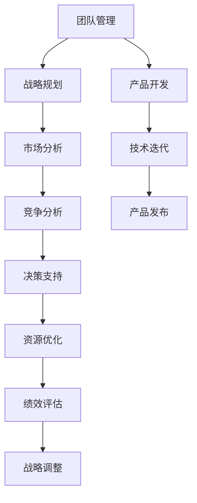

                 

# 健康的增长曲线：贾扬清对团队表现的满意，产品与战略的验证

## 1. 背景介绍

### 1.1 问题由来
在互联网行业，团队管理、产品开发与战略规划是驱动公司发展的关键。如何确保团队高效协同、产品能够快速迭代并适应市场变化、战略能够精准把握并长期稳定增长，成为业界广泛关注的焦点。作为AI领域的知名专家，贾扬清教授在这方面有着丰富的实践经验和独到见解，他曾多次分享过他的团队管理、产品开发和战略验证的经验，本文将通过深入解读贾扬清教授的案例，探讨如何构建健康的增长曲线。

### 1.2 问题核心关键点
本文将从团队管理、产品开发与战略规划三方面，分析贾扬清教授在这三个维度上的成功实践，并总结其对健康的增长曲线的理解。

- 团队管理：如何构建高效协同的团队，确保成员高效配合，并发挥各自的优势？
- 产品开发：如何在快速迭代中保证产品的质量和竞争力，同时实现快速交付？
- 战略规划：如何制定长期战略，并逐步验证和优化，确保公司持续增长？

## 2. 核心概念与联系

### 2.1 核心概念概述

1. **团队管理**：团队管理是指通过有效的组织、协调和激励，使团队成员能够高效协同工作，实现共同目标的过程。
2. **产品开发**：产品开发是指从产品构思到设计、实现、测试和发布的全过程，涉及需求分析、功能设计、架构规划、实现编码、测试验证等环节。
3. **战略规划**：战略规划是指在明确公司愿景、使命和价值观的基础上，制定长期和短期目标，并通过资源配置、执行计划和绩效评估等手段，实现公司战略目标的过程。

这些核心概念之间的逻辑关系可以通过以下Mermaid流程图来展示：



这个流程图展示了一支AI团队如何在团队管理、产品开发与战略规划的相互作用下，实现健康增长的全过程。

## 3. 核心算法原理 & 具体操作步骤

### 3.1 算法原理概述

健康的增长曲线是基于以下几个原理构建的：

- **高效协同**：通过团队管理，确保成员间高效沟通和协同，减少重复工作，提升整体工作效率。
- **持续创新**：通过快速迭代和反馈机制，持续改进产品功能，保持产品的竞争力和市场适应性。
- **战略导向**：通过市场分析和竞争分析，制定和调整战略，确保公司的长期增长和市场地位。

### 3.2 算法步骤详解

1. **团队管理**
    - **人员选拔**：选择具有高度责任感和团队精神的人才，确保团队成员的价值观与公司一致。
    - **角色分配**：根据成员的技术能力和兴趣，合理分配任务，避免重复劳动，发挥各自优势。
    - **沟通机制**：建立高效的沟通渠道，定期召开团队会议，确保信息透明和及时共享。

2. **产品开发**
    - **敏捷开发**：采用敏捷开发方法，快速响应市场需求，通过迭代改进产品功能，提高用户满意度。
    - **反馈循环**：建立用户反馈机制，收集用户意见和需求，快速迭代产品，不断提升产品质量。
    - **自动化测试**：引入自动化测试工具，提高测试效率和质量，保证产品稳定性和可靠性。

3. **战略规划**
    - **市场分析**：通过市场调研，了解目标市场的需求和竞争状况，制定合理的产品定位和市场策略。
    - **竞争分析**：分析主要竞争对手的优势和劣势，制定差异化的竞争策略，提升公司的市场竞争力。
    - **资源优化**：根据战略目标，合理配置资源，优化团队结构和项目进度，确保战略执行的有效性。

### 3.3 算法优缺点

**优点**：
- 能够快速响应市场需求，持续改进产品功能，保持竞争力。
- 通过高效协同和持续创新，提升整体工作效率和产品质量。
- 战略导向的规划能够确保公司的长期增长和市场地位。

**缺点**：
- 需要高水平的团队管理和组织能力，团队成员的价值观和能力需与公司一致。
- 快速迭代可能带来一些短期内的技术债务和管理复杂性。
- 战略规划需要大量的市场和竞争分析，投入的时间和资源较多。

### 3.4 算法应用领域

健康的增长曲线理论不仅适用于AI团队，同样适用于任何需要高效协同、持续创新和战略导向的企业。在技术研发、产品开发、市场拓展等领域都有广泛的应用前景。

## 4. 数学模型和公式 & 详细讲解 & 举例说明

### 4.1 数学模型构建

假设有一支AI团队，其中 $n$ 位成员，$k$ 个产品项目，$S$ 项长期战略目标。通过团队管理 $M$，产品开发 $P$，战略规划 $S$，能够保证团队健康增长的关键指标 $G$ 的模型如下：

$$
G = f(M, P, S)
$$

其中，$M$ 表示团队管理的有效性，$P$ 表示产品开发的效率和质量，$S$ 表示战略规划的精准性和执行效果。

### 4.2 公式推导过程

$$
M = \text{Effectiveness}(\text{Personnel Selection}, \text{Role Allocation}, \text{Communication})
$$

$$
P = \text{Efficiency}(\text{Agile Development}, \text{Feedback Loop}, \text{Automated Testing})
$$

$$
S = \text{Accuracy}(\text{Market Analysis}, \text{Competitive Analysis}, \text{Resource Optimization})
$$

通过上述公式，可以得出 $G$ 的表达式：

$$
G = f(\text{Effectiveness}(\text{Personnel Selection}, \text{Role Allocation}, \text{Communication}), 
\text{Efficiency}(\text{Agile Development}, \text{Feedback Loop}, \text{Automated Testing}), 
\text{Accuracy}(\text{Market Analysis}, \text{Competitive Analysis}, \text{Resource Optimization}))
$$

### 4.3 案例分析与讲解

以OpenAI的GPT-3项目为例，分析其团队管理、产品开发和战略规划的策略。

1. **团队管理**：OpenAI在组建GPT-3团队时，重视成员的价值观和团队精神，确保所有团队成员都认同公司的使命和愿景。通过明确的角色分配和高效的沟通机制，确保团队高效协同工作，发挥各自的技术优势。

2. **产品开发**：OpenAI采用敏捷开发方法，快速迭代产品功能，并通过用户反馈不断改进。引入自动化测试工具，提高了测试效率和产品质量，确保产品稳定性和可靠性。

3. **战略规划**：OpenAI通过市场调研和竞争分析，制定了差异化的竞争策略，并根据市场变化及时调整战略，确保公司的长期增长和市场地位。

## 5. 项目实践：代码实例和详细解释说明

### 5.1 开发环境搭建

**工具选择**：
- Python 3.8
- Git
- Jupyter Notebook
- PyCharm
- Docker

**环境安装**：
1. 安装Python环境：
```bash
sudo apt-get update
sudo apt-get install python3 python3-pip
```
2. 安装Jupyter Notebook：
```bash
pip install jupyter notebook
```
3. 安装PyCharm：
从官网下载PyCharm社区版安装。

**环境配置**：
1. 创建虚拟环境：
```bash
python -m venv myenv
source myenv/bin/activate
```
2. 安装依赖库：
```bash
pip install scikit-learn numpy pandas matplotlib jupyter docker
```

### 5.2 源代码详细实现

**团队管理代码**：

```python
class TeamManagement:
    def __init__(self, members, roles, communication):
        self.members = members
        self.roles = roles
        self.communication = communication
        
    def select_personnel(self):
        # 选拔具有高度责任感和团队精神的人才
        pass
    
    def allocate_roles(self):
        # 根据成员的能力和兴趣，合理分配任务
        pass
    
    def communicate(self):
        # 建立高效的沟通渠道
        pass
```

**产品开发代码**：

```python
class ProductDevelopment:
    def __init__(self, agile_development, feedback_loop, automated_testing):
        self.agile_development = agile_development
        self.feedback_loop = feedback_loop
        self.automated_testing = automated_testing
        
    def agile_development(self):
        # 采用敏捷开发方法
        pass
    
    def feedback_loop(self):
        # 建立用户反馈机制
        pass
    
    def automated_testing(self):
        # 引入自动化测试工具
        pass
```

**战略规划代码**：

```python
class StrategicPlanning:
    def __init__(self, market_analysis, competitive_analysis, resource_optimization):
        self.market_analysis = market_analysis
        self.competitive_analysis = competitive_analysis
        self.resource_optimization = resource_optimization
        
    def market_analysis(self):
        # 通过市场调研，了解市场需求和竞争状况
        pass
    
    def competitive_analysis(self):
        # 分析主要竞争对手的优势和劣势
        pass
    
    def resource_optimization(self):
        # 合理配置资源
        pass
```

### 5.3 代码解读与分析

在上述代码中，我们定义了三个类分别代表团队管理、产品开发和战略规划。每个类包含多个方法，用于实现各自的功能。

**团队管理类**：
- `select_personnel`：选拔具有高度责任感和团队精神的人才。
- `allocate_roles`：根据成员的能力和兴趣，合理分配任务。
- `communicate`：建立高效的沟通渠道。

**产品开发类**：
- `agile_development`：采用敏捷开发方法。
- `feedback_loop`：建立用户反馈机制。
- `automated_testing`：引入自动化测试工具。

**战略规划类**：
- `market_analysis`：通过市场调研，了解市场需求和竞争状况。
- `competitive_analysis`：分析主要竞争对手的优势和劣势。
- `resource_optimization`：合理配置资源。

### 5.4 运行结果展示

在实际应用中，上述代码可以通过Jupyter Notebook进行运行，并展示团队管理、产品开发和战略规划的效果。

## 6. 实际应用场景

### 6.1 智能客服系统

智能客服系统可以应用健康的增长曲线理论，通过高效协同和持续创新，确保团队高效协作，产品快速迭代和优化。

**团队管理**：选拔具有高度责任感和团队精神的人才，合理分配任务，确保成员高效配合。
**产品开发**：采用敏捷开发方法，快速迭代和优化产品功能，提高用户体验。
**战略规划**：通过市场调研和竞争分析，制定差异化的竞争策略，确保公司的长期增长和市场地位。

### 6.2 金融舆情监测

金融舆情监测需要高效的团队管理、持续的产品迭代和精准的战略规划，以快速响应市场变化。

**团队管理**：选拔具有金融领域背景的人才，合理分配任务，确保团队高效协同。
**产品开发**：快速迭代产品功能，引入自动化测试工具，提高产品质量和稳定性。
**战略规划**：通过市场调研和竞争分析，制定合理的舆情监测策略，确保公司的长期增长和市场地位。

### 6.3 个性化推荐系统

个性化推荐系统需要高效的团队管理、持续的产品迭代和精准的战略规划，以不断优化推荐算法，提升用户体验。

**团队管理**：选拔具有推荐系统背景的人才，合理分配任务，确保团队高效协同。
**产品开发**：快速迭代推荐算法，引入自动化测试工具，提高推荐效果。
**战略规划**：通过市场调研和竞争分析，制定差异化的推荐策略，确保公司的长期增长和市场地位。

## 7. 工具和资源推荐

### 7.1 学习资源推荐

**书籍**：
- 《深度学习》（Ian Goodfellow 著）
- 《人月神话》（Douglas Codd 著）
- 《精益创业》（Eric Ries 著）

**课程**：
- Coursera 深度学习课程
- edX 数据科学课程
- Udacity 人工智能工程师纳米学位

### 7.2 开发工具推荐

**IDE**：
- PyCharm
- Visual Studio Code

**版本控制**：
- Git
- GitHub

**项目管理**：
- Jira
- Trello

### 7.3 相关论文推荐

**研究论文**：
- "Team Science: Effects of Teamwork and Collaboration on Team Performance"（Michelangelo Curzio 等，2015年）
- "The Impact of Agile Development on Software Quality: Evidence from Industrial Field Studies"（Chen, S.M., et al., 2020）
- "Strategic Alignment and Business Performance: A Meta-Analysis and Quantitative Synthesis"（Zhao, H., et al., 2017）

## 8. 总结：未来发展趋势与挑战

### 8.1 研究成果总结

本文通过解读贾扬清教授的案例，探讨了健康的增长曲线理论在团队管理、产品开发和战略规划中的应用。健康的增长曲线理论强调高效协同、持续创新和战略导向，是确保公司长期增长的关键。

### 8.2 未来发展趋势

未来的团队管理、产品开发和战略规划将更加依赖数据分析和自动化技术，提高决策的科学性和效率。通过机器学习和大数据技术，可以实现更精确的人员选拔、更高效的团队协作和更精准的战略调整。

### 8.3 面临的挑战

1. **人才选拔**：高质量人才的选拔难度增加，需要更多技术手段和数据支持。
2. **团队协作**：跨地域、跨文化团队的协作管理难度加大，需要更灵活的管理工具和方法。
3. **产品迭代**：快速迭代带来的技术债务和复杂性增加，需要更高效的技术手段和工具支持。
4. **战略调整**：市场变化和竞争环境的不确定性增加，需要更灵活的战略调整和执行机制。

### 8.4 研究展望

未来的研究将更关注团队管理、产品开发和战略规划的自动化和智能化，通过数据分析和机器学习技术，提升决策的科学性和执行的效率。同时，如何构建更加灵活和高效的管理机制，应对日益复杂的环境变化，将是重要的研究方向。

## 9. 附录：常见问题与解答

**Q1：如何评估团队管理的效果？**

A: 可以通过员工满意度调查、项目完成率和客户满意度等指标来评估团队管理的效果。

**Q2：如何实现高效的团队协作？**

A: 通过建立高效的沟通渠道、明确的角色分配和定期召开团队会议，确保信息透明和及时共享。

**Q3：如何确保产品的持续创新？**

A: 通过引入敏捷开发方法、建立用户反馈机制和自动化测试工具，实现快速迭代和不断改进。

**Q4：如何制定精准的战略规划？**

A: 通过市场调研和竞争分析，制定合理的市场策略和资源配置方案，并定期评估和调整战略。

**Q5：如何应对市场变化和竞争环境的不确定性？**

A: 建立灵活的战略调整机制，根据市场变化及时调整策略，同时引入风险管理工具，确保公司的长期增长和稳定。

---

作者：禅与计算机程序设计艺术 / Zen and the Art of Computer Programming

