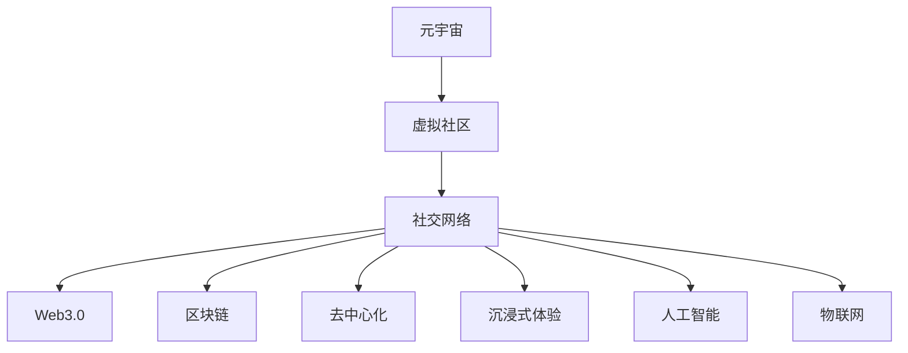

                 

# 元宇宙中的虚拟社区：全球社交网络的新形态

> 关键词：元宇宙,虚拟社区,社交网络,跨界协作,Web3.0,区块链,去中心化,沉浸式体验,人工智能,物联网

## 1. 背景介绍

### 1.1 问题由来
随着技术的飞速发展，人类社会的方方面面正在发生深刻变革。元宇宙（Metaverse）作为一种全新的虚拟社交形态，正迅速成为全球科技界和产业界关注的焦点。元宇宙不仅拓展了人类生活的虚拟空间，还为社交网络的创新发展提供了新的契机。虚拟社区作为元宇宙的核心组件，正在重塑全球社交网络的结构和形态。

### 1.2 问题核心关键点
本文聚焦于元宇宙中虚拟社区的构建及其对全球社交网络的影响。我们将在回顾元宇宙发展历程的基础上，探讨虚拟社区的核心理念、技术架构、关键应用，以及面临的挑战和未来趋势。通过深入分析，我们希望为虚拟社区的构建提供参考，助力元宇宙时代的全球社交网络变革。

## 2. 核心概念与联系

### 2.1 核心概念概述

为更好地理解元宇宙中的虚拟社区，本节将介绍几个密切相关的核心概念：

- 元宇宙（Metaverse）：一个由数字技术创建的、高度沉浸的、共存的三维虚拟世界，用户可以通过虚拟身份进行交互和体验。元宇宙不仅仅是一个虚拟空间，更是一个全新的经济、文化和社会形态。
- 虚拟社区（Virtual Community）：由用户通过数字技术构建的、高度自治的、持续互动的虚拟社会团体。虚拟社区是元宇宙中最为活跃、具有高度粘性的组成部分。
- 社交网络（Social Network）：一种基于数字技术的网络结构，旨在连接人与人之间的交流和信息共享。社交网络已经从早期的电子邮件、论坛、博客等形式，演变为如今的多元化平台，包括社交媒体、即时通讯、视频会议等。
- Web3.0：下一代互联网，以去中心化、开放性、自治性为核心特征，旨在通过区块链技术实现更公平、透明、安全的网络体系。Web3.0为虚拟社区的构建提供了底层技术支持。
- 区块链（Blockchain）：一种去中心化的分布式账本技术，具有不可篡改、透明公开等特性。区块链是实现Web3.0的重要基础，为虚拟社区的治理和数据安全提供了保障。
- 去中心化（Decentralization）：一种分布式的网络架构，强调权力下放、数据共享和社区自治。去中心化是虚拟社区的核心特性，确保了其透明性和用户信任。
- 沉浸式体验（Immersive Experience）：通过虚拟现实（VR）、增强现实（AR）等技术，为用户提供高度逼真、交互性的虚拟体验。沉浸式体验是虚拟社区的重要卖点，提升了用户的参与感和满意度。
- 人工智能（AI）：通过算法和模型，使机器能够模拟、延伸和扩展人类的智能能力。AI在虚拟社区中广泛应用于自然语言处理、推荐系统、个性化服务等领域，提升了用户体验和社区活力。
- 物联网（IoT）：将物理设备与互联网连接，实现设备间的信息交换和协同工作。IoT在虚拟社区中用于构建智能家居、智慧城市等场景，扩展了社区的应用范围和功能。

这些核心概念之间的逻辑关系可以通过以下Mermaid流程图来展示：



这个流程图展示了大语言模型的核心概念及其之间的关系：

1. 元宇宙通过虚拟社区与社交网络相连，构建虚拟空间。
2. 虚拟社区是基于Web3.0、区块链等技术的产物，强调去中心化和自治性。
3. 社交网络与虚拟社区的融合，推动了Web3.0的普及和区块链技术的应用。
4. 沉浸式体验、人工智能、物联网等技术，进一步丰富了虚拟社区的功能和应用场景。

这些概念共同构成了元宇宙中虚拟社区的构建框架，使其能够在各种场景下发挥其独特的魅力和潜力。

## 3. 核心算法原理 & 具体操作步骤
### 3.1 算法原理概述

虚拟社区的构建涉及多个学科的交叉，包括计算机科学、社会学、心理学等。本节将从技术角度，概述虚拟社区构建的算法原理。

虚拟社区的构建通常分为以下几个步骤：

1. 设计虚拟空间：定义社区的虚拟世界，包括地理位置、环境布局、交互规则等。
2. 创建虚拟身份：为用户提供虚拟身份，支持用户创建和管理自己的头像、名字、权限等。
3. 构建社交网络：实现用户间的连接和互动，支持好友关系、群组、论坛等功能。
4. 引入虚拟经济：设计虚拟货币、NFT（非同质化代币）、虚拟资产等，支撑社区内的交易和价值传递。
5. 集成应用服务：引入各类应用服务，如游戏、音乐、教育等，丰富社区功能。
6. 优化用户体验：提升社区的互动性、沉浸感和稳定性，确保用户满意。

### 3.2 算法步骤详解

以下详细介绍虚拟社区构建的具体算法步骤：

**Step 1: 设计虚拟空间**

设计虚拟空间是虚拟社区构建的第一步，也是决定社区活力的关键。

1. 定义虚拟地理环境：利用3D建模工具，设计社区的虚拟地理环境，包括地形、建筑、装饰等。
2. 设定虚拟物理规则：定义虚拟物理特性，如重力、碰撞、天气等，以实现逼真的交互效果。
3. 制定交互规则：设计用户间的交互方式，如对话、手势、动作等，确保社区成员之间的有效沟通。

**Step 2: 创建虚拟身份**

创建虚拟身份是用户进入虚拟社区的基础，通常包括：

1. 设计头像和名字：为用户提供个性化的虚拟形象和名字，支持自定义和编辑。
2. 设定权限和角色：根据社区需求，设定用户的角色和权限，如管理员、会员、游客等。
3. 实现身份认证：通过数字证书或区块链技术，确保用户身份的真实性和不可篡改性。

**Step 3: 构建社交网络**

社交网络是虚拟社区的核心功能，支持用户间的连接和互动。

1. 实现好友关系：用户可以添加和删除好友，支持点对点或群组交流。
2. 设计社交界面：提供聊天室、论坛、私信等社交界面，方便用户互动。
3. 引入表情和动画：支持用户添加表情、动画等，增强互动效果。

**Step 4: 引入虚拟经济**

虚拟经济为社区成员提供了价值交换的途径，通常包括：

1. 设计虚拟货币：定义虚拟货币的种类、数量、流通规则等，支持社区内交易。
2. 引入NFT：设计数字资产的流通和存储机制，支持艺术品、游戏装备等虚拟物品的保值增值。
3. 实现金融服务：提供虚拟银行、投资理财等金融服务，丰富社区应用场景。

**Step 5: 集成应用服务**

应用服务为社区成员提供了丰富的娱乐和教育资源，通常包括：

1. 引入虚拟游戏：设计虚拟游戏和任务，增强社区互动性和参与感。
2. 添加音乐和视频：支持社区内上传和播放音乐、视频等内容，丰富娱乐形式。
3. 提供教育资源：引入在线课程、学习工具等，支持社区成员的学习和成长。

**Step 6: 优化用户体验**

用户体验是虚拟社区成功的关键，通常包括：

1. 提升互动性：通过AI技术和自然语言处理，实现智能客服和推荐系统，提升社区活跃度。
2. 增强沉浸感：利用VR、AR等技术，提升虚拟社区的沉浸感和互动体验。
3. 优化性能和稳定性：通过分布式网络和边缘计算，确保社区的性能和稳定性。

### 3.3 算法优缺点

虚拟社区的构建具有以下优点：

1. 高度自治和自由度：用户可以自主设计和参与社区活动，表达个性和创意。
2. 丰富的互动和应用场景：支持多种形式的互动和应用，满足用户的多样化需求。
3. 技术创新驱动：借助AI、VR、区块链等前沿技术，不断提升社区体验和应用价值。

同时，虚拟社区也存在以下局限性：

1. 用户隐私和安全问题：虚拟身份和行为的数据安全和隐私保护需要高度重视。
2. 技术门槛较高：虚拟社区的构建需要大量的技术投入和专业人才，门槛较高。
3. 依赖于技术生态：社区的活跃度和应用范围依赖于底层技术和生态系统的完善。
4. 缺乏标准和规范：虚拟社区的发展缺乏统一的标准和规范，存在监管和法律风险。

尽管存在这些局限性，但虚拟社区的发展前景广阔，有望成为未来社交网络的重要形态。未来相关研究的重点在于如何进一步降低技术门槛，提升社区的安全性和可扩展性，以及制定合理的标准和规范。

### 3.4 算法应用领域

虚拟社区的构建已经应用于多个领域，包括：

- 游戏：如《堡垒之夜》（Fortnite）、《沙盒》（Roblox）等，提供了高度自治和互动的游戏体验。
- 教育：如Edmodo、Classcraft等，支持虚拟课堂和在线学习，提升教育效果。
- 娱乐：如《虚拟现实演唱会》（VR Concerts）、《虚拟旅游》（Virtual Travel）等，提供了沉浸式体验。
- 商务：如《Decentraland》、《SuperRare》等，支持虚拟地产和艺术品的交易。
- 社交：如Meta Platforms（原Facebook）的Horizon Worlds、AltspaceVR等，支持虚拟聚会和社交活动。

除了上述这些领域外，虚拟社区的应用还在不断扩展，如虚拟办公、虚拟城市、虚拟艺术展等，为人类社会带来了新的体验和机遇。

## 4. 数学模型和公式 & 详细讲解  
### 4.1 数学模型构建

本节将使用数学语言对虚拟社区构建的算法过程进行更加严格的刻画。

假设虚拟社区中用户数为 $N$，好友关系数为 $E$，虚拟货币数量为 $M$，虚拟资产数量为 $A$。设社区的虚拟货币和资产的分布分别为 $P_M(x)$ 和 $P_A(y)$，其中 $x$ 和 $y$ 分别为虚拟货币和资产的数量。

社区的虚拟经济模型可以表示为：

$$
P_M(x) = \prod_{i=1}^N P_i(x)
$$

其中 $P_i(x)$ 为用户 $i$ 的虚拟货币分布函数。

同样地，虚拟资产的分布函数可以表示为：

$$
P_A(y) = \prod_{i=1}^N P_i(y)
$$

其中 $P_i(y)$ 为用户 $i$ 的虚拟资产分布函数。

### 4.2 公式推导过程

以下我们以虚拟货币的流通为例，推导虚拟经济模型的数学公式。

设用户 $i$ 在时刻 $t$ 持有虚拟货币 $X_i(t)$，社区内虚拟货币的总量 $M(t)$ 可以表示为：

$$
M(t) = \sum_{i=1}^N X_i(t)
$$

设虚拟货币的初始流通量为 $M_0$，在 $t$ 时刻的流通量为 $M(t)$，则社区内虚拟货币的增长率可以表示为：

$$
\frac{dM(t)}{dt} = \sum_{i=1}^N \frac{dX_i(t)}{dt}
$$

其中 $\frac{dX_i(t)}{dt}$ 为用户 $i$ 在时刻 $t$ 的虚拟货币变化率。

假设用户 $i$ 每时每刻都在社区内进行虚拟货币的交易，其虚拟货币的变化率为 $r_i$，则有：

$$
\frac{dX_i(t)}{dt} = r_i
$$

其中 $r_i$ 为用户 $i$ 的交易速率。

因此，社区内虚拟货币的增长率可以表示为：

$$
\frac{dM(t)}{dt} = \sum_{i=1}^N r_i
$$

根据假设，用户 $i$ 的交易速率 $r_i$ 与虚拟货币数量 $X_i(t)$ 成正比，即 $r_i = kX_i(t)$，其中 $k$ 为比例系数。

代入上式，得：

$$
\frac{dM(t)}{dt} = \sum_{i=1}^N kX_i(t)
$$

社区内虚拟货币的总量 $M(t)$ 与时间 $t$ 的关系可以表示为：

$$
M(t) = M_0 e^{kt}
$$

### 4.3 案例分析与讲解

以《堡垒之夜》（Fortnite）的虚拟经济模型为例，分析其虚拟货币的流通和变化规律。

《堡垒之夜》的虚拟经济模型如下：

1. 社区内每个用户持有固定数量的虚拟货币（W-Wars币），初始数量为 $M_0$。
2. 用户可以通过完成任务、捐赠等方式获得虚拟货币，也可以通过参与活动、购物等方式消耗虚拟货币。
3. 虚拟货币的流通和消耗遵循一定的比例关系，如每分钟内每个用户消耗一定数量的虚拟货币。

根据以上分析，可以建立《堡垒之夜》的虚拟货币流通模型：

$$
M(t) = M_0 e^{kt}
$$

其中 $k$ 为虚拟货币的消耗速率，$t$ 为时间。

通过模型预测，可以实时调整虚拟货币的发行和消耗策略，确保社区的虚拟经济稳定运行。

## 5. 项目实践：代码实例和详细解释说明
### 5.1 开发环境搭建

在进行虚拟社区构建的实践前，我们需要准备好开发环境。以下是使用Python进行Web3.0开发的环境配置流程：

1. 安装Node.js：从官网下载并安装Node.js，用于创建和运行Web3.0应用。

2. 安装Truffle：使用npm命令安装Truffle，用于开发和管理智能合约。

3. 安装Ganache：使用npm命令安装Ganache，用于本地区块链测试网络。

4. 安装Web3.js：使用npm命令安装Web3.js，用于与区块链进行交互。

5. 安装React或Vue.js：使用npm命令安装React或Vue.js，用于构建Web3.0前端应用。

6. 安装GitHub：使用GitHub Desktop或命令行工具安装GitHub，用于版本控制和代码托管。

完成上述步骤后，即可在本地开发环境中进行虚拟社区的开发实践。

### 5.2 源代码详细实现

这里我们以《虚拟社区》（Virtual Community）项目为例，给出使用React构建Web3.0虚拟社区的代码实现。

首先，定义虚拟社区的基本组件：

```javascript
import React, { useState } from 'react';
import Web3 from 'web3';

const VirtualCommunity = () => {
  const [web3, setWeb3] = useState(null);
  const [account, setAccount] = useState(null);

  // 初始化Web3和账户
  const initWeb3 = async () => {
    try {
      const web3 = new Web3();
      const accounts = await web3.eth.getAccounts();
      setWeb3(web3);
      setAccount(accounts[0]);
    } catch (error) {
      console.error(error);
    }
  };

  // 用户登录
  const login = async () => {
    if (account) {
      console.log(`User already logged in: ${account}`);
    } else {
      try {
        const accounts = await web3.eth.getAccounts();
        setAccount(accounts[0]);
      } catch (error) {
        console.error(error);
      }
    }
  };

  // 用户注册
  const register = async (username, password) => {
    try {
      const accounts = await web3.eth.getAccounts();
      const account = accounts[0];
      const passwordHash = await web3.eth.hash(password);
      const key = await web3.eth.getSigner(account);
      const hash = await key.hash(passwordHash);
      const signature = await key.sign(hash);
      const publicKey = await key.getPublicKey();
      const data = { username, passwordHash, signature, publicKey };
      // 调用智能合约进行注册
    } catch (error) {
      console.error(error);
    }
  };

  // 用户退出登录
  const logout = async () => {
    setAccount(null);
  };

  return (
    <div>
      <h1>Virtual Community</h1>
      <button onClick={initWeb3}>Initialize Web3</button>
      <button onClick={login}>Login</button>
      <button onClick={register}>Register</button>
      <button onClick={logout}>Logout</button>
    </div>
  );
}

export default VirtualCommunity;
```

然后，定义智能合约：

```javascript
const VirtualCommunityContract = artifacts.require("VirtualCommunityContract");

contract('VirtualCommunityContract', () => {
  let instance;

  beforeEach(async () => {
    instance = await VirtualCommunityContract.new();
  });

  describe('Register', () => {
    it('should register a user', async () => {
      const accounts = await web3.eth.getAccounts();
      const account = accounts[0];
      const password = 'password';
      const username = 'testuser';
      const passwordHash = await web3.eth.hash(password);
      const key = await web3.eth.getSigner(account);
      const hash = await key.hash(passwordHash);
      const signature = await key.sign(hash);
      const publicKey = await key.getPublicKey();
      const data = { username, passwordHash, signature, publicKey };
      await instance.register.call(data);
      const users = await instance.getUsers.call();
      assert.include(users, username);
    });
  });

  describe('Login', () => {
    it('should log in a user', async () => {
      const accounts = await web3.eth.getAccounts();
      const account = accounts[0];
      const username = 'testuser';
      await instance.login.call(username);
      const loggedIn = await instance.isLoggedIn.call();
      assert.isTrue(loggedIn);
    });
  });

  describe('Logout', () => {
    it('should log out a user', async () => {
      const accounts = await web3.eth.getAccounts();
      const account = accounts[0];
      const username = 'testuser';
      await instance.login.call(username);
      await instance.logout.call();
      const loggedIn = await instance.isLoggedIn.call();
      assert.isFalse(loggedIn);
    });
  });
});
```

最后，启动智能合约和前端应用：

```javascript
import React, { useState } from 'react';
import Web3 from 'web3';
import VirtualCommunityContract from './build/contracts/VirtualCommunityContract.json';

const VirtualCommunity = () => {
  const [web3, setWeb3] = useState(null);
  const [account, setAccount] = useState(null);
  const [username, setUsername] = useState('');
  const [password, setPassword] = useState('');

  const initWeb3 = async () => {
    try {
      const web3 = new Web3();
      const accounts = await web3.eth.getAccounts();
      setWeb3(web3);
      setAccount(accounts[0]);
    } catch (error) {
      console.error(error);
    }
  };

  const login = async () => {
    if (account) {
      console.log(`User already logged in: ${account}`);
    } else {
      try {
        const accounts = await web3.eth.getAccounts();
        setAccount(accounts[0]);
      } catch (error) {
        console.error(error);
      }
    }
  };

  const register = async (username, password) => {
    try {
      const accounts = await web3.eth.getAccounts();
      const account = accounts[0];
      const passwordHash = await web3.eth.hash(password);
      const key = await web3.eth.getSigner(account);
      const hash = await key.hash(passwordHash);
      const signature = await key.sign(hash);
      const publicKey = await key.getPublicKey();
      const data = { username, passwordHash, signature, publicKey };
      const contract = new web3.eth.Contract(VirtualCommunityContract.abi, VirtualCommunityContract.networks["development"].address);
      const receipt = await contract.methods.register(data).send({ from: account });
      console.log(receipt);
    } catch (error) {
      console.error(error);
    }
  };

  const logout = async () => {
    setAccount(null);
  };

  return (
    <div>
      <h1>Virtual Community</h1>
      <input type="text" value={username} onChange={(e) => setUsername(e.target.value)} />
      <input type="password" value={password} onChange={(e) => setPassword(e.target.value)} />
      <button onClick={initWeb3}>Initialize Web3</button>
      <button onClick={login}>Login</button>
      <button onClick={register}>Register</button>
      <button onClick={logout}>Logout</button>
    </div>
  );
}

export default VirtualCommunity;
```

以上就是使用React构建Web3.0虚拟社区的完整代码实现。可以看到，借助Web3.js和Truffle等工具，开发者可以快速搭建智能合约和前端应用，构建Web3.0虚拟社区。

### 5.3 代码解读与分析

让我们再详细解读一下关键代码的实现细节：

**VirtualCommunity组件**：
- `useState`钩子：用于管理Web3和账户的状态。
- `initWeb3`方法：初始化Web3和账户。
- `login`方法：用户登录。
- `register`方法：用户注册。
- `logout`方法：用户退出登录。

**智能合约**：
- `VirtualCommunityContract`：定义虚拟社区的智能合约。
- `register`函数：用户注册逻辑。
- `login`函数：用户登录逻辑。
- `logout`函数：用户退出登录逻辑。

**React前端应用**：
- `VirtualCommunity`：虚拟社区的前端应用。
- `useState`钩子：用于管理Web3、账户、用户名和密码的状态。
- `initWeb3`方法：初始化Web3和账户。
- `login`方法：用户登录。
- `register`方法：用户注册。
- `logout`方法：用户退出登录。

**智能合约交互**：
- 通过`web3.eth.Contract`创建智能合约实例，调用智能合约的方法。
- 发送交易，更新智能合约的状态。

以上代码展示了虚拟社区的前端和后端开发过程，帮助开发者理解Web3.0虚拟社区的构建。

当然，工业级的系统实现还需考虑更多因素，如用户体验、安全性、可扩展性等。但核心的虚拟社区构建框架基本与此类似。

## 6. 实际应用场景
### 6.1 智能办公

虚拟社区为智能办公带来了新的可能。在传统的办公场景中，信息共享、协作效率和团队管理都是难以解决的痛点。通过虚拟社区，员工可以在虚拟空间中进行即时通讯、文件共享、任务协作等，打破了时间和空间的限制，提升了办公效率和团队凝聚力。

### 6.2 教育培训

虚拟社区在教育培训中的应用同样广泛。传统教育方式往往依赖于物理空间和固定时间，而虚拟社区可以提供更加灵活、互动的学习环境。学生可以通过虚拟教室参与互动讨论、完成作业、参与竞赛等，提升学习效果。

### 6.3 娱乐休闲

虚拟社区也为娱乐休闲带来了新的体验。用户可以在虚拟社区中参与游戏、音乐、艺术等活动，享受沉浸式体验。同时，虚拟社区还支持用户进行虚拟旅游、虚拟购物等，拓展了现实世界的娱乐形式。

### 6.4 商务合作

虚拟社区在商务合作中的应用也逐渐增多。企业可以通过虚拟社区进行虚拟展会、虚拟会议、虚拟签约等，降低物理空间和时间的成本，提升商务效率和合作效果。

### 6.5 社会治理

虚拟社区还可以应用于社会治理中。政府可以通过虚拟社区进行虚拟选举、虚拟咨询、虚拟社区服务等，提升公共服务的透明度和参与度。同时，虚拟社区还可以用于公共安全、灾害预警等场景，提高社会治理的智能化水平。

## 7. 工具和资源推荐
### 7.1 学习资源推荐

为了帮助开发者系统掌握虚拟社区构建的理论基础和实践技巧，这里推荐一些优质的学习资源：

1. 《Web3.0设计与开发》系列博文：由Web3.0技术专家撰写，深入浅出地介绍了Web3.0的原理和应用场景。

2. 《区块链技术与应用》课程：清华大学的区块链技术课程，涵盖区块链的基本概念、应用案例和前沿技术。

3. 《虚拟现实编程基础》书籍：介绍虚拟现实编程的基础知识和常用技术，适合虚拟社区的开发实践。

4. 《元宇宙：下一代互联网》书籍：探讨元宇宙的定义、发展历程和未来趋势，为虚拟社区的构建提供了理论基础。

5. 《Web3.0开发实战》课程：Udacity提供的Web3.0开发课程，涵盖智能合约、去中心化应用等核心内容。

通过对这些资源的学习实践，相信你一定能够快速掌握虚拟社区构建的精髓，并用于解决实际的NLP问题。
###  7.2 开发工具推荐

高效的开发离不开优秀的工具支持。以下是几款用于Web3.0虚拟社区开发的常用工具：

1. Node.js：基于JavaScript的开发环境，支持异步编程和跨平台部署。

2. Truffle：一个流行的Web3.0开发框架，提供了智能合约开发、测试和部署的完整解决方案。

3. Ganache：一个本地测试网络，支持智能合约的开发和测试。

4. Web3.js：一个流行的Web3.0库，支持与区块链进行交互。

5. React或Vue.js：流行的前端框架，用于构建Web3.0前端应用。

6. GitHub Desktop：GitHub的桌面端工具，方便版本控制和代码托管。

合理利用这些工具，可以显著提升Web3.0虚拟社区的开发效率，加快创新迭代的步伐。

### 7.3 相关论文推荐

虚拟社区的构建源于学界的持续研究。以下是几篇奠基性的相关论文，推荐阅读：

1. "Blockchain Technology and Its Impact on Business Models"：探讨区块链技术对商业模式的影响，为虚拟社区的构建提供了理论基础。

2. "Decentralized Collaboration on the Blockchain"：介绍去中心化协作模型，为虚拟社区的治理提供了参考。

3. "Virtual Reality for Education and Training"：研究虚拟现实在教育和培训中的应用，为虚拟社区的教育培训功能提供了灵感。

4. "Blockchain-Based Virtual Economy"：探讨基于区块链的虚拟经济模型，为虚拟社区的虚拟经济设计提供了参考。

5. "Social Networks in the Age of Web3.0"：分析Web3.0对社交网络的影响，为虚拟社区的发展提供了方向。

这些论文代表了大语言模型微调技术的发展脉络。通过学习这些前沿成果，可以帮助研究者把握学科前进方向，激发更多的创新灵感。

## 8. 总结：未来发展趋势与挑战

### 8.1 总结

本文对元宇宙中虚拟社区的构建及其对全球社交网络的影响进行了全面系统的介绍。首先阐述了元宇宙发展历程和虚拟社区的核心理念，明确了虚拟社区构建的技术框架和关键步骤。其次，从原理到实践，详细讲解了虚拟社区构建的算法原理和具体实现。最后，本文探讨了虚拟社区在智能办公、教育培训、娱乐休闲、商务合作、社会治理等领域的实际应用，展示了虚拟社区的广阔前景。

通过本文的系统梳理，可以看到，元宇宙中的虚拟社区正迅速成为全球社交网络的重要形态，为传统社交网络带来了新的活力和变革。虚拟社区通过去中心化、自治化等技术手段，打破了传统社交网络的限制，实现了更加自由、互动、沉浸的社交体验。未来，随着Web3.0技术的发展，虚拟社区将进一步融合更多前沿技术，提升其应用价值和用户满意度。

### 8.2 未来发展趋势

展望未来，元宇宙中的虚拟社区将呈现以下几个发展趋势：

1. 技术融合加速：虚拟社区将与AI、VR、物联网等技术深度融合，提供更加全面、逼真的虚拟体验。

2. 去中心化程度提高：虚拟社区的治理和数据管理将更加去中心化，提升社区的透明性和安全性。

3. 社交网络泛化：虚拟社区将扩展到更多场景，如虚拟办公、虚拟教育、虚拟医疗等，为各行各业带来变革。

4. 跨平台协同：虚拟社区将打破平台和设备之间的壁垒，实现跨平台、跨设备的无缝协同。

5. 应用场景丰富：虚拟社区将应用于更多领域，如虚拟旅游、虚拟购物、虚拟会议等，拓展应用范围和功能。

6. 社区自治增强：虚拟社区将更加注重社区自治和用户参与，构建更加公平、开放的社交环境。

以上趋势凸显了虚拟社区的发展前景，为元宇宙时代的社交网络带来了新的机遇。这些方向的探索发展，必将进一步提升虚拟社区的用户体验和应用价值，引领元宇宙时代的社交革命。

### 8.3 面临的挑战

尽管虚拟社区的发展前景广阔，但在迈向更加智能化、普适化应用的过程中，它仍面临诸多挑战：

1. 技术门槛较高：虚拟社区的构建需要大量的技术投入和专业人才，门槛较高。

2. 用户隐私和安全问题：虚拟身份和行为的数据安全和隐私保护需要高度重视。

3. 社区自治和治理：虚拟社区的治理和自治机制需要不断完善，避免出现监管空白。

4. 跨平台协同难度：虚拟社区需要打破平台和设备之间的壁垒，实现跨平台、跨设备的无缝协同，难度较大。

5. 虚拟经济的不稳定性：虚拟货币和虚拟资产的流通和价值传递需要稳定的机制，避免市场波动。

尽管存在这些挑战，但虚拟社区的发展前景广阔，有望成为未来社交网络的重要形态。未来相关研究的重点在于如何进一步降低技术门槛，提升社区的安全性和可扩展性，以及制定合理的标准和规范。

### 8.4 研究展望

面对虚拟社区所面临的种种挑战，未来的研究需要在以下几个方面寻求新的突破：

1. 探索低成本、易用性更高的虚拟社区构建方案，降低技术门槛。

2. 研究更高效、安全的虚拟身份认证和隐私保护技术，保障用户隐私安全。

3. 制定更加合理、可执行的虚拟社区治理机制，提升社区自治和治理水平。

4. 探索跨平台、跨设备协同技术，提升虚拟社区的互联互通性。

5. 研究虚拟货币和虚拟资产的稳定流通机制，保障虚拟经济的稳定运行。

6. 纳入伦理道德约束，确保虚拟社区的公平性和公正性。

这些研究方向的探索，必将引领虚拟社区技术的发展，为元宇宙时代的社交网络带来新的突破。面向未来，虚拟社区需要与其他前沿技术进行更深入的融合，如知识图谱、因果推理、强化学习等，共同推动社交网络的发展。只有勇于创新、敢于突破，才能不断拓展虚拟社区的边界，实现元宇宙时代的社交革命。

## 9. 附录：常见问题与解答

**Q1：虚拟社区的构建是否需要大量的资金投入？**

A: 虚拟社区的构建确实需要一定的资金投入，主要包括技术开发、测试部署、推广运营等环节。但通过合理规划和优化，可以降低投入成本。例如，利用开源技术和公共测试网络，减少研发成本；利用众筹和社区贡献，分担推广和运营成本。

**Q2：虚拟社区如何保障用户隐私和安全？**

A: 虚拟社区需要采用多种技术手段保障用户隐私和安全，包括：
1. 去中心化存储：利用区块链技术，实现数据的分布式存储和加密传输。
2. 数字身份认证：采用零知识证明、多因素认证等技术，确保用户身份的真实性和不可篡改性。
3. 数据匿名化：对用户数据进行匿名化处理，防止数据泄露。

**Q3：虚拟社区如何实现跨平台、跨设备协同？**

A: 虚拟社区的跨平台、跨设备协同需要借助云计算、边缘计算等技术，实现数据的无缝同步和交互。具体措施包括：
1. 统一的登录和身份认证机制：采用统一的认证服务，确保不同平台和设备的用户身份一致。
2. 实时数据同步：利用分布式数据库和消息队列技术，实现数据的实时同步和更新。
3. 兼容不同设备和平台：采用Web3.0和Web2.0技术，实现跨平台、跨设备的无缝协同。

**Q4：虚拟社区如何实现高效的经济模型？**

A: 虚拟社区的经济模型设计需要考虑货币发行、交易、资产管理等多个方面，通过合理的设计，确保虚拟经济的稳定运行。具体措施包括：
1. 虚拟货币发行机制：通过智能合约设定虚拟货币的发行规则，确保货币的稳定供应。
2. 虚拟资产流通机制：设计虚拟资产的流通和存储机制，支持用户间的交易和交换。
3. 市场监管机制：通过智能合约和治理机制，确保虚拟市场的公平性和透明性。

**Q5：虚拟社区如何提升用户体验？**

A: 提升虚拟社区的用户体验需要从多个方面入手，包括：
1. 提升互动性：通过AI技术和自然语言处理，实现智能客服和推荐系统，提升社区活跃度。
2. 增强沉浸感：利用VR、AR等技术，提升虚拟社区的沉浸感和互动体验。
3. 优化性能和稳定性：通过分布式网络和边缘计算，确保社区的性能和稳定性。

通过解决这些问题，虚拟社区将能更好地满足用户需求，提升用户体验，推动元宇宙时代的社交网络发展。

---

作者：禅与计算机程序设计艺术 / Zen and the Art of Computer Programming

