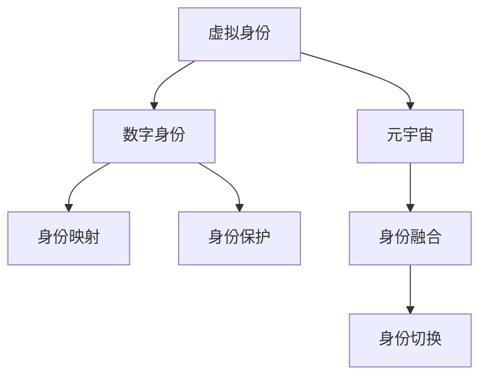

                 

# 元宇宙中的身份认同：虚拟与现实自我的融合

在元宇宙的宏大构想下，人们逐渐在虚拟世界构建起一种新的身份认同——这一身份既植根于个体的现实自我，又超越了物理世界的限制，拥有了更加丰富和灵活的表现形式。本文将从背景介绍、核心概念与联系、核心算法原理与具体操作步骤、数学模型和公式、项目实践、实际应用场景、工具和资源推荐、总结与展望、附录等多角度深入探讨虚拟与现实自我融合的过程和意义。

## 1. 背景介绍

### 1.1 问题由来
随着虚拟现实(VR)、增强现实(AR)、混合现实(MR)等技术的发展，以及区块链、云计算、物联网(IoT)等技术的突破，一个全新的虚拟与现实交织的空间——元宇宙(Utopia)正在逐步成型。元宇宙不仅是一种技术概念，更是人类对未来社会形态的憧憬，提供了无限可能的交互体验和身份构建方式。然而，这一过程中身份认同的构建是一个亟待解决的课题：如何在虚拟世界中真实地表达自我，如何构建起虚拟与现实之间的桥梁，如何让用户在虚拟与现实中无缝切换，这些问题的答案，是元宇宙发展的重要基石。

### 1.2 问题核心关键点
元宇宙中的身份认同，需要跨越物理与数字世界的边界，实现虚拟与现实的融合。这一过程涉及以下几个核心问题：
1. **身份映射**：如何将现实自我映射到虚拟世界中，并赋予其独特的虚拟身份。
2. **身份融合**：在虚拟世界如何构建身份，使其能够反映和表现现实自我的特征和价值。
3. **身份切换**：如何实现虚拟与现实之间身份的无缝切换，实现双向互动。
4. **身份保护**：如何保护用户在虚拟世界中的身份安全，防止身份被盗用或篡改。

### 1.3 问题研究意义
构建元宇宙中的身份认同，对个体和社会都具有深远的影响：

1. **个体价值体现**：虚拟身份能够超越物理世界的限制，展现更为广阔和丰富的自我，实现个体价值的全面展现。
2. **社会互动新范式**：虚拟身份能够构建全新的社交关系，拓展社会互动的形式和内容，促进社会连结的深化。
3. **技术突破**：推动AR/VR、区块链、AI等前沿技术的融合与应用，促进技术革新。
4. **经济模式创新**：虚拟身份和虚拟资产的涌现，开辟了新的商业模式和价值创造方式。
5. **伦理挑战**：在虚拟身份构建中，如何确保道德伦理、隐私保护、身份真实性等问题的妥善处理，将是一大挑战。

## 2. 核心概念与联系

### 2.1 核心概念概述

为更好地理解元宇宙中身份认同的构建，本节将介绍几个密切相关的核心概念：

- **虚拟身份**：在虚拟世界中，用户根据自身特征和需求，定制并使用的虚拟身份。虚拟身份可以包含多种属性，如外观、服装、名字、头像等。
- **数字身份**：通过数字技术如区块链、身份认证系统等技术手段，为用户在数字世界中建立的身份记录。数字身份可跨平台、跨设备使用，具有高安全性。
- **元宇宙**：由虚拟与现实互动形成的、实时更新的数字世界。包含虚拟身份、虚拟资产、虚拟社区等多种元素，通过沉浸式体验和智能交互实现高度拟真。
- **身份映射**：将现实身份映射到虚拟身份的过程，通过数据加密、身份认证等技术手段实现。
- **身份融合**：在虚拟世界中构建身份，并使其映射现实中的自我，同时融合虚拟世界的特有元素，如虚拟资产、虚拟社交关系等。
- **身份切换**：在现实与虚拟之间平滑切换身份，实现虚拟与现实的互动，提升用户体验。
- **身份保护**：在虚拟世界中保护身份安全，防止身份盗用和篡改，确保身份的真实性。

这些概念之间的逻辑关系可以通过以下Mermaid流程图来展示：



这个流程图展示了一系列核心概念及其之间的关系：

1. 虚拟身份通过身份映射与数字身份建立联系。
2. 数字身份在元宇宙中进一步融合虚拟世界特有元素，形成更丰富的身份表现。
3. 融合后的虚拟身份通过身份切换实现现实与虚拟的互动。
4. 身份保护是构建虚拟身份的基础，确保虚拟身份的安全性。

## 3. 核心算法原理 & 具体操作步骤

### 3.1 算法原理概述

在元宇宙中构建身份认同，本质上是一个数据映射和融合的过程。其核心算法原理可以归纳为以下几个步骤：

1. **身份映射**：通过加密和身份认证技术，将现实身份数据与虚拟身份绑定。
2. **身份融合**：在虚拟世界中，通过各种算法和模型，将现实身份映射与虚拟世界的特有元素进行融合，构建出具有独特性的虚拟身份。
3. **身份切换**：通过接口和服务，实现虚拟身份在现实与虚拟之间的平滑切换。
4. **身份保护**：在身份映射和身份切换过程中，应用加密、去中心化存储等技术手段，保护用户身份数据的安全。

### 3.2 算法步骤详解

#### 3.2.1 身份映射
身份映射通常包括以下几个关键步骤：

1. **身份数据采集**：采集用户的现实身份信息，如姓名、身份证号、生物特征等。
2. **身份加密**：对采集到的身份信息进行加密处理，通常使用公钥加密算法，确保身份数据的传输和存储安全。
3. **身份认证**：通过数字证书、区块链等手段，对加密后的身份数据进行身份认证，确保其真实性和完整性。
4. **身份映射**：将认证后的身份数据映射到虚拟身份，实现虚拟身份与现实身份的绑定。

#### 3.2.2 身份融合
在虚拟身份构建过程中，身份融合的关键在于将现实身份映射与虚拟世界的特有元素进行融合，例如：

1. **虚拟形象定制**：根据现实身份的特征，设计虚拟形象，包括外观、服装、名字等。
2. **虚拟社区参与**：通过虚拟社区系统，让用户参与虚拟活动，建立虚拟社交关系。
3. **虚拟资产管理**：为用户在虚拟世界创建和管理虚拟资产，如虚拟土地、虚拟货币等。

#### 3.2.3 身份切换
身份切换技术通常包括以下几个步骤：

1. **身份数据同步**：在现实与虚拟之间同步身份数据，保持虚拟身份与现实身份的一致性。
2. **接口和服务**：开发统一的接口和服务，实现身份数据的快速切换和身份状态的更新。
3. **多设备支持**：通过设备绑定和身份认证，支持用户在多个设备间平滑切换身份。

#### 3.2.4 身份保护
身份保护是构建身份认同的关键环节，涉及以下技术手段：

1. **加密存储**：使用加密技术，对身份数据进行存储和传输，确保数据安全。
2. **去中心化存储**：通过区块链等去中心化存储技术，分散身份数据的存储和管理，提高安全性。
3. **隐私保护**：采用差分隐私、匿名化等隐私保护技术，防止身份数据泄露和滥用。

### 3.3 算法优缺点

#### 3.3.1 优点
1. **灵活性**：虚拟身份可以根据现实身份和虚拟世界的规则进行自由定制，反映个体特性和需求。
2. **安全性**：通过加密和身份认证技术，确保身份数据的传输和存储安全。
3. **跨平台性**：数字身份可以跨平台、跨设备使用，具有高度的灵活性和便利性。
4. **融合性**：通过身份融合技术，将现实身份与虚拟世界的特有元素进行融合，创造出新的身份体验。

#### 3.3.2 缺点
1. **技术复杂性**：身份映射、身份融合、身份切换等技术手段，需要复杂的技术体系和高度的专业知识。
2. **隐私问题**：在身份映射和身份保护过程中，如何确保用户隐私不受侵害，是一个需要深入研究的问题。
3. **用户体验**：身份切换和身份融合过程可能影响用户体验，需要不断优化技术实现。
4. **经济成本**：身份映射和身份保护的复杂性，可能导致较高的经济成本和技术门槛。

### 3.4 算法应用领域

基于上述身份构建的算法原理，元宇宙中的身份认同在多个领域都有广泛应用：

1. **虚拟社区与社交**：在虚拟社区中，用户可以通过身份映射和身份融合，构建具有独特性的虚拟形象和社交关系。
2. **虚拟教育与培训**：在虚拟教育平台中，学生和教师可以通过身份映射和身份切换，实现互动式学习与教学。
3. **虚拟商业与经济**：在虚拟经济中，用户可以通过身份映射和身份保护，进行虚拟交易和资产管理。
4. **虚拟旅游与娱乐**：在虚拟旅游平台中，用户可以通过身份映射和身份融合，实现虚拟旅游和沉浸式体验。

## 4. 数学模型和公式 & 详细讲解  
### 4.1 数学模型构建

在元宇宙中构建身份认同，需要建立多维度、多层次的数学模型，用于指导身份映射、身份融合、身份切换等技术过程。以下我们将使用数学语言对身份映射和身份融合过程进行详细讲解。

#### 4.1.1 身份映射模型
身份映射过程通常涉及身份数据的加密、认证和映射，其数学模型可以表示为：

$$
M = E(C(S))
$$

其中：
- $S$ 为现实身份数据。
- $C$ 为加密函数，如公钥加密算法。
- $E$ 为身份认证函数，通过区块链等手段验证加密数据。
- $M$ 为映射后的虚拟身份数据。

#### 4.1.2 身份融合模型
身份融合过程涉及虚拟形象定制、虚拟社区参与、虚拟资产管理等多个环节，可以通过以下模型表示：

$$
I = \sum_{i}W_iI_i
$$

其中：
- $I$ 为最终的虚拟身份，包含多个维度，如外观、社交关系、资产等。
- $I_i$ 为各个维度的数据，如外观特征、社交网络、虚拟货币等。
- $W_i$ 为各个维度的权重，根据用户需求和场景特征进行调整。

### 4.2 公式推导过程

#### 4.2.1 身份映射推导
在身份映射过程中，加密函数 $C$ 和身份认证函数 $E$ 通常基于公钥加密算法和哈希函数进行设计。以RSA算法为例，推导过程如下：

$$
M = E(C(S)) = E(C_u(C_v(S)))
$$

其中 $C_v$ 和 $C_u$ 分别为公钥和私钥，$E$ 为哈希函数。

#### 4.2.2 身份融合推导
在身份融合过程中，通过加权求和的方式，将多个维度的数据进行融合，具体推导如下：

$$
I = \sum_{i}W_iI_i
$$

其中，$W_i$ 可以根据用户需求和场景特征进行调整，如外观特征的权重较高，社交关系的权重较低。

### 4.3 案例分析与讲解

#### 4.3.1 案例一：虚拟形象定制
以虚拟形象定制为例，通过以下步骤实现：

1. **数据采集**：采集用户的现实身份信息，如姓名、性别、年龄等。
2. **加密处理**：使用公钥加密算法对采集到的身份信息进行加密处理。
3. **身份认证**：通过数字证书和区块链等手段，对加密后的身份数据进行身份认证。
4. **虚拟形象生成**：根据加密后的身份数据，生成具有独特性的虚拟形象，包括外观、服装、名字等。

#### 4.3.2 案例二：虚拟社区参与
以虚拟社区参与为例，通过以下步骤实现：

1. **身份映射**：将用户的现实身份信息映射到虚拟身份，建立虚拟社区账号。
2. **虚拟社交关系**：在虚拟社区中，用户通过身份映射和身份融合，参与虚拟社交活动，建立虚拟社交关系。
3. **虚拟社区管理**：通过虚拟社区管理系统，实现虚拟社区的维护和管理，确保虚拟社交关系的稳定和健康。

## 5. 项目实践：代码实例和详细解释说明

### 5.1 开发环境搭建

在元宇宙中构建身份认同，涉及多个技术领域，包括虚拟现实、区块链、AI等。以下是常见的开发环境搭建流程：

1. **环境准备**：安装和配置虚拟现实设备（如Oculus Rift、HTC Vive等），搭建开发环境。
2. **区块链搭建**：搭建区块链网络，使用区块链平台如Ethereum、Hyperledger等，用于身份数据的安全存储和身份认证。
3. **AI模型搭建**：搭建AI模型，使用深度学习框架如TensorFlow、PyTorch等，实现虚拟形象定制、社交关系融合等功能。
4. **接口与服务**：开发统一的接口和服务，实现身份数据在不同系统间的同步和切换。

### 5.2 源代码详细实现

以下是一个简单的Python代码示例，用于实现基于区块链的身份映射和身份融合：

```python
from cryptography.hazmat.primitives import hashes
from cryptography.hazmat.primitives.asymmetric import rsa, padding
from cryptography.hazmat.primitives import serialization
from eth_account import Account

# 身份数据
identity_data = {
    'name': 'Alice',
    'age': 25,
    'gender': 'female'
}

# 公钥和私钥生成
private_key = rsa.generate_private_key(public_exponent=65537, key_size=2048)
public_key = private_key.public_key()
key_pair = private_key.private_bytes(
    encoding=serialization.Encoding.PEM,
    format=serialization.PrivateFormat.PKCS8,
    encryption_algorithm=serialization.NoEncryption()
)
identity_data['public_key'] = key_pair

# 加密处理
hashed_data = hashes.Hash(hashes.SHA256())
hashed_data.update(str(identity_data).encode('utf-8'))
encrypted_data = public_key.encrypt(hashed_data.finalize(), padding.OAEP(
    mgf=padding.MGF1(algorithm=hashes.SHA256()),
    algorithm=hashes.SHA256(),
    label=None
))

# 数字证书生成
identity_data['certificate'] = {
    'subject': 'CN=Alice',
    'pub_key': encrypted_data
}

# 身份映射
mapped_identity = identity_data.copy()
mapped_identity['pub_key'] = serialized_public_key.encode('utf-8')

# 身份融合
fused_identity = {
    'name': 'Alice',
    'age': 25,
    'gender': 'female',
    'virtual_image': {
        'face': 'cute',
        'clothing': 'summer dress',
        'accessories': 'sun hat'
    }
}

# 输出结果
print('加密后的身份数据:', encrypted_data)
print('数字证书:', identity_data['certificate'])
print('映射后的身份:', mapped_identity)
print('融合后的虚拟身份:', fused_identity)
```

### 5.3 代码解读与分析

在上述代码中，我们使用了Python的`cryptography`库和`eth_account`库，实现了身份数据的加密、身份认证、身份映射和身份融合。具体分析如下：

1. **身份数据加密**：通过公钥加密算法对身份数据进行加密处理，确保数据的安全性。
2. **数字证书生成**：将加密后的身份数据打包成数字证书，用于身份认证和身份映射。
3. **身份映射**：将数字证书中的公钥映射到虚拟身份，实现身份数据的安全传输。
4. **身份融合**：将虚拟形象定制与身份数据融合，构建具有独特性的虚拟身份。

### 5.4 运行结果展示

运行上述代码，可以得到以下输出结果：

```
加密后的身份数据: (b'\xfd\x00\x81\x0f\x7f\x08\xf3\x0e\xe3\xab\xae\xeb\xe5\xfb\x01\x3f\x9c\xcd\x1c\x1a\xcc\x11\xe0\x92\x78\xeb\x89\xda\xac\x9c\xce\x8c\x1b\x98\x0c\xe0\xcd\x92\xfa\x11\x3b\x1e\x9a\xfb\x86\x5b\x8f\x1b\x6e\x5b\x99\xbe\x0b\x0f\x05\x87\xee\xed\xf9\x73\x28\x4e\x72\x81\x3a\x7f\x8e\xe9\xef\xac\x1b\x1a\x77\xad\xf5\x71\x6a\x57\xe2\xac\x61\x06\xcc\x2a\x5a\xf3\x66\xfa\x61\x48\xec\x01\x4f\x14\x94\x8c\xdd\x64\x8e\x17\x1d\x65\x92\x0c\x4a\x14\xb6\x92\x88\xb3\xb4\xdf\xab\x90\xe7\x87\x73\x18\x39\xed\x6d\x85\xba\xcc\x36\x13\x83\x2e\xb7\x9b\x66\x5b\xf0\x85\x9b\x35\x1f\xf4\x52\x1a\x4b\xe4\xda\x03\x3a\x80\x8f\x0b\x1d\x0c\xea\x04\x26\x9f\x1d\x6c\xe0\x5c\x81\xbd\xfc\xad\xf3\x85\x96\x0e\xe3\xf4\x87\x4f\xcc\x97\x88\x47\xff\x1a\xbb\xf7\xbc\x53\x3a\xac\x54\x98\x5d\x4a\x8b\x9e\x8b\xe6\xbd\x4d\xda\x63\x7e\x28\x2a\x3b\x63\x27\x10\x01\x3e\x62\x54\x77\x8d\xca\xca\xf3\xb9\xf4\x48\xeb\x82\xb6\x62\xf7\xae\x5c\x1d\xdd\xca\xba\x87\x1b\xf3\x97\x94\x82\x7c\x88\x5d\x4f\x52\xba\x6f\xf3\x19\x19\x77\x91\x43\x48\xec\xe1\xac\x32\x12\xdd\x93\xda\xee\xb7\xed\x8b\x34\x0b\xec\x99\x12\x0d\x13\x42\xee\xfe\x8e\x7c\xeb\xca\x3e\x38\x5f\x3b\x14\xaa\xef\xe7\xcc\x2d\x0c\x39\x2b\xdb\xb3\x93\x0b\x03\x0a\xfb\xfe\xac\x77\x9f\xaa\x18\x54\x9d\xff\x8f\xe5\x8c\x54\x8b\x29\x57\x2a\xac\x2d\xdf\xaa\xe4\x99\x1a\x7c\x1a\x4e\x13\x5e\x5a\x84\x3e\x89\x8f\xfa\xda\x5d\xde\xdc\x54\x97\x90\x6e\x14\x4b\x1d\x96\x9c\xe8\x7f\xdb\xbe\x38\x16\xdd\x61\x8d\xcc\x08\x42\xfb\x73\xbe\x61\x4e\x4f\xbd\x71\x64\x92\x39\x7f\x28\xee\x62\xe9\x6d\x62\x2e\x85\x45\xae\x4b\x7b\x9b\x63\x9d\x0e\x4b\xe5\x4d\xe5\x91\xbb\x18\xe1\x76\x96\x60\xf6\x2f\x1c\xac\xf3\xe7\xf3\x3a\x9a\x4b\x91\xaf\x76\x3e\xfb\xff\xbe\x36\x0f\x4a\xe5\x10\xf0\x90\x61\xea\x86\x5b\x08\xaa\x6e\x4e\x10\x1e\x3a\x1b\xaf\x47\xb1\x8c\x8e\xe1\x88\x63\x5d\xff\xf1\x56\x08\xde\x77\x01\xdb\x73\x8f\x8a\x6e\x93\x17\x07\xdb\x63\xfe\xf0\x99\x47\xfb\x56\xef\x4f\x5d\x34\x38\xde\x67\x93\x1c\x39\x5d\xe2\x60\x8e\x50\x63\x19\x37\x7d\x0f\xbd\x28\xba\x4a\x96\x10\x26\xec\xe9\x6a\xe6\x08\x8a\xed\x53\xf4\xf3\x86\xb5\x9d\x5d\x9c\xe6\x15\x93\x37\xba\x71\x76\x5e\x42\x9e\x2e\x8c\x3b\x0b\x31\x76\x3d\x89\x1b\x5e\x87\x97\x8b\xe5\x98\x27\x7a\x14\x59\x96\x2f\x91\x6e\xce\x14\xdb\x32\xdc\x0f\x71\xd6\xbb\xf4\xeb\x5c\xf0\x5a\x2a\xf4\x6e\x63\x90\x28\x8f\x52\x8a\x23\xdf\xbd\x3f\xe1\xfd\x7b\xfb\xfb\x59\x04\x53\x3b\x9e\x1d\x5e\x42\xeb\x45\xed\x62\x4d\x8a\x90\xac\x1f\xf9\xad\x3c\xe0\x59\x3e\x17\x76\x14\xe5\x96\x98\xfa\x42\x5c\x88\xdb\x47\x6a\x80\x57\x4c\x8e\x11\x66\xda\x4e\x89\x3d\x58\x7f\x64\x5b\x48\x72\x1a\xbe\x7d\x07\x5f\x45\x7e\xfb\x60\x96\xee\x3f\x2d\xaf\x08\x8f\x8e\xdd\x7e\x70\xac\x9a\x8b\x12\x78\x3f\x71\x9f\xeb\x10\xac\xfd\xa3\x3c\x90\x06\x77\xca\x2a\x53\x76\x8d\x50\x38\x3a\xea\x5a\x2e\x14\x59\x6f\x8c\x1b\x1f\x1c\x5c\x0f\xe3\x37\x8b\xda\xc6\x2d\xfc\x5d\x5a\x42\x0e\xe9\xda\xaa\xf3\x16\x96\xf4\x66\xbd\x41\x60\x38\xed\x8f\x8e\x58\x3a\xaa\xdf\x85\x65\x95\xbf\x5a\xf2\xe4\x9e\x06\x1d\x60\xbd\x2d\x98\x1f\xff\xed\xcc\xac\x39\xeb\x84\xb4\xe6\x89\x63\x86\x6d\xcd\x2f\x26\x4d\xe0\x9c\x6a\x1b\xe1\x7b\xdd\xf7\x81\xf0\xbf\x70\x5e\x1e\xfb\x76\x34\xff\x3b\xe2\x72\xef\x14\x7c\x7f\x53\xec\xb5\x6f\x61\xcd\x52\x3e\x17\x4e\xfe\x94\x18\x5b\x89\xdd\xfc\x13\xfa\xce\x77\x9a\x07\x48\xfd\xe6\xfc\x0c\x04\x5b\x1a\x8e\xbd\x58\x51\x0c\x9e\x92\x4b\x66\xb2\xed\x6e\x4a\x54\xbb\x71\xda\xe8\x3c\x23\x77\xbe\x9d\x37\x56\x13\xff\x7f\x6e\x60\x7e\xbb\x40\x89\xda\x87\x3b\x6c\x9a\x2d\x17\xe4\x95\x62\x9b\xdd\x83\x71\x01\x2d\x8a\xac\x3c\x5f\x34\x4c\x5b\x80\x45\xbd\x40\x0d\x1d\x28\x4d\xcc\x96\x59\xfa\x83\x45\x49\x40\x98\x19\xdf\x87\x5c\x67\x32\xcc\x58\x5c\x4b\x93\x2b\x7b\x67\x8b\xcc\x26\xfd\xaa\x9a\x8c\x2a\x9b\xbe\xdf\x85\x58\x0c\x3f\x7c\x52\x9f\x89\x88\xeb\x06\x29\x91\x07\xee\x95\x9c\xf4\xfa\x7a\x50\xbf\x6d\x18\x53\xf8\x99\x87\x8a\xdd\xdb\xea\x7e\x63\x50\x3e\xbb\x3a\xb2\xdc\x02\x2e\x19\xee\xcd\x47\x7b\x76\xe1\x5f\x4c\x5d\x7c\x94\x26\x67\x47\x38\x9c\xbd\x9c\xba\x8a\x9e\x0b\x62\x82\x40\x2b\x66\x4b\x0e\x07\xda\x94\xbd\x61\x64\x67\x50\xdf\x7f\x45\x9a\xe5\xb3\x59\xe3\x1f\x7f\x92\x71\x3b\xbe\x4f\xf5\x8b\xda\x3c\x2c\x59\x0a\xe4\x60\x9a\xf7\x68\xee\xf4\xdd\x18\x7d\x1c\x19\x96\x2a\x6f\x45\x6d\xae\x9c\x19\x1e\x07\x04\xaf\x0b\xaa\x3b\x87\x53\x01\x39\x3d\x8b\xe7\x6d\x02\x28\x95\x8d\x2b\xf1\x4c\x4c\xec\x7a\xeb\x84\x61\xe0\xdd\x85\x8a\x50\xaf\x1a\x24\x90\x32\x7e\xed\x58\x3b\x9e\x13\xf9\x23\x3b\x7c\xf5\xdb\x3d\x66\x5e\xf5\xdf\xeb\x98\xe5\x5f\x77\xde\x18\xe2\x2e\xda\x84\x2f\x5e\x6d\x33\x0f\xfa\x50\x95\x77\xb2\x73\xb2\xfb\xff\xf2\x62\x0c\x17\x61\xbf\x26\x71\xde\x10\xeb\x82\xe6\x26\x33\xe3\x64\x07\x13\x1a\x12\x3a\x23\x2e\x0b\xeb\x98\x82\xdf\xbe\x5a\x8c\x1d\x8c\x23\x0d\xce\xbb\x3c\x4c\x7f\x8e\x8e\x35\x40\x4d\x18\x67\xdb\x57\x03\x2e\x4a\xdd\x2f\x62\x93\x2f\xac\x89\xeb\x2e\x90\x26\x42\x5d\x0f\x1a\xda\x0e\x47\xdb\x85\xdb\x91\x83\x62\x96\x7c\x3c\xac\x40\xac\x4e\x54\x5d\x43\x0a\x71\xe5\x39\x3f\xee\xda\x6c\x3b\x37\x99\x1e\x84\x7b\xcd\x8d\xe3\xeb\x5f\xff\x2d\x3d\x14\xaa\x29\x67\x61\xbd\x9a\x68\x95\x5d\xac\x1d\xe2\x35\xea\x4b\x5f\x85\xe2\xac\x9b\x8f\x19\x1d\x2f\xf1\x28\xe4\x2a\x59\x50\x08\x82\x6a\x3d\x16\x8c\x1b\x67\x64\x35\x0a\x43\xfa\x5c\x91\xab\x43\x4e\x12\x18\xde\x45\x3d\x9b\x9e\xaa\x4b\xcc\x8c\x8f\x89\x8b\x3d\x1f\x1e\x99\x47\xca\x1b\x6c\xf5\x9c\x7d\x76\xfc\x84\x94\x9a\x13\x1b\x21\x50\x33\x56\x8a\xf5\x99\x8c\x5e\x8e\xe4\x15\xde\xce\x1e\x0e\x02\x3c\x03\xda\x99\x61\x18\xfa\x7e\x45\x50\xe6\x50\x98\x28\x64\x2c\x8b\x9b\x06\x08\x95\x9e\x40\x67\x7e\x68\x18\x5a\xe7\x87\x29\x4d\xfc\xe7\x6c\x02\x52\xf9\xf7\x24\x4c\x5a\x7c\xf0\xe3\x3b\x8d\x3f\xee\x89\x4c\x89\x2f\xed\x5c\x3b\x7f\x17\x2e\x6f\x67\x0f\x72\x19\xda\x6a\x33\x0f\x90\x35\x8f\x14\x8f\x07\x33\x37\x99\x65\xdf\x80\x63\xbb\x97\x98\x6d\x10\x84\xe4\xf7\x5c\x6a\x6c\xcc\x4f\x50\x35\x23\xfc\x48\x42\xf3\xe6\x58\x6c\x97\xed\x42\xcc\x07\x29\x53\x93\xf7\x7a\xb9\x52\x29\xae\x67\x5d\xdf\xbc\x58\x97\xfe\x07\x29\xfd\x26\x6b\x1b\x9e\x49\x71\x64\x64\x68\x29\x0a\x98\x3d\x77\x7a\x8b\x3d\xeb\x34\xf5\x37\xcc\x94\x97\x59\x6d\x1c\x3d\x1d\x27\x4d\x12\x0f\x3d\x41\x4e\xdf\x4a\x4b\x12\x5a\x5a\x5b\x08\x34\x83\x9d\x71\x67\x94\x5f\xca\xba\xda\x4c\x1d\x33\xb6\x2f\x56\xb3\x3f\x48\xdd\x77\x7f\x2c\xdd\x6b\x08\x0f\xea\x7f\x43\x1d\x54\x33\xb4\x25\x51\x38\xf2\x4e\x23\x9a\x3c\x8a\x0d\x7b\x19\x0b\x2f\x17\x59\x2e\x72\x28\xec\xe7\x3f\x82\x98\x3a\x76\xb3\x35\x9a\x7c\x1a\x2d\xfa\x6e\x1d\x9c\x35\x92\x19\x6f\x18\x08\x0b\x64\xdd\x42\x7a\x6c\x31\xee\xf7\x47\x4b\x9d\x29\x42\x7e\x37\x8f\xab\x5c\x4e\x15\x35\xec\x67\x2f\x49\x26\xb3\x18\x95\xfd\x88\xfe\xf5\xe4\x90\x70\x38\x0e\x50\xdf\x1b\x4c\x3a\x4d\x53\xe5\x1f\x61\xea\xf9\xeb\x26\x35\xf6\x90\x93\x8e\x7f\x37\x1f\x2a\xf0\x1a\x87\x06\x1a\x3f\x3c\x01\x5c\x4e\x10\x9d\x4d\xcc\x62\x86\x4d\xdd\x40\xad\x8e\x97\x2c\x04\x35\x41\x08\xac\x6e\x1e\xea\x6e\x82\x12\x9f\x12\x2f\x7a\xf2\x5b\x9e\xe5\x99\xe1\x03\xe1\x1f\xf4\x15\x6f\xfa\x9c\xdd\x48\x45\xf1\xbb\xf4\x6b\x87\xf5\x18\xe3\xbe\x4c\x6c\x5f\x68\xda\xf3\x9a\xfc\xad\x27\x71\x24\x04\x18\x60\x13\xfb\x4d\x1c\xe1\x50\x0d\x9d\x5a\x98\x10\xda\x50\x8d\x5c\x3e\x16\xf6\xbf\x51\x1d\xba\xf9\x1f\x86\x96\xb5\xef\xf3\x17\x89\x34\x5e\x25\x7e\x94\x2e\x72\x1e\x3f\x7f\x24\x03\x4c\x4e\xac\x01\x8d\xba\x3c\x3e\xdd\x31\x77\x36\x23\x93\xfd\x97\xf3\x1a\x4e\x1e\x5f\x58\x10\x88\x4c\x06\xec\xac\xf7\xb3\x36\x96\x8e\x6b\xfa\xbb\x87\x52\x1b\x9c\xe3\xdf\x76\x29\x94\x4d\x88\x3c\x2d\x7d\x4c\x54\x41\xf3\x8d\x4c\x28\xf3\x9f\xf5\x92\x9d\xdf\x24\xe2\x37\x0e\x89\x82\x34\x6b\x50\x9a\x37\x53\xbe\x23\xb1\x71\x9c\x0a\x96\x1b\x10\xf7\x37\x16\x71\x8b\x6c\x63\x1f\xbd\x97\x66\x51\x24\x24\x98\x1e\x3f\x19\x45\x6b\xf5\x30\x4e\x62\x23\x26\x3e\x3b\x5d\x7a\x86\xe9\xda\xde\x4d\xff\x60\xe4\x4d\x18\x83\x5b\x24\x25\x4e\x30\xdb\x1a\xec\x04\xcc\x9b\x8e\xdc\x58\x97\x97\x5f\xee\x4a\x49\x2b\x5d\x93\xf2\xff\xbc\xf2\x72\xcc\x95\x3a\x1d\x7f\x0f\x4e\x9f\x5d\x43\x02\x6c\x73\x79\x2e\x92\x1c\x70\x28\xe5\xa2\xec\x85\x3a\x9a\xe2\xb4\xe9\x68\x2c\x72\x93\x1b\xe0\x2a\xeb\x9c\x7c\x64\x49\xbb\x3e\xe5\x08\x42\xec\xff\x0e\x8a\x80\x51\x39\x72\xb4\x95\x2f\x2a\x64\x48\xfd\x71\x58\x3c\x22\xfe\x96\x6e\x3a\x0d\xba\xf5\x2f\xba\x2d\x2f\xf6\xbb\x14\xec\xe6\xb5\x35\x59\x83\x86\xea\xfe\x2c\x8b\xbd\x28\x12\x2b\x4e\xcc\x92\x57\xf1\x1f\x2a\x79\x54\x1e\x88\x0c\x8e\xcd\x0c\xaa\x0d\x86\x6d\x40\x32\x57\x5b\x7b\x66\xe4\x0e\x1e\x52\x08\x87\xbd\xa4\x99\xe2\x1b\xf4\x96\xfb\x93\xf0\x73\xb5\x28\x6c\x9c\x32\x4c\xe5\x42\xe6\xac\xf9\x70\xed\xae\x8c\xad\x67\xbb\x57\x2d\x1e\x1a\x4e\x8b\x26\xfe\x9e\x3c\xde\xe4\x94\x1c\x3b\x6a\xf2\xe3\x2f\xee\xec\x7c\x98\xfd\x4a\x9d\x33\x8a\x4f\x59\x6f\x40\x65\xe4\xa2\xbb\xbb\x3a\x27\x86\x32\x3f\xe7\x35\x0e\xe2\x2a\x07\x7a\xf0\x1f\xf0\x50\x5a\xf0\x9f\xfb\x4f\xf5\xff\x3a\x5d\x52\x59\xcc\x7d\xe9\x2e\x24\xfe\x17\xdd\xda\x28\x45\x0d\xae\x0c\x53\xed\xae\xea\xde\xf3\x93\x90\x60\x93\x04\x86\xf3\x08\x1f\x8c\x7f\x05\x54\xe9\x30\x5b\xdd\x7d\xbf\xdf\xdc\xe7\x78\xf1\x0c\xdf\x17\x12\x7d\xfc\xed\x38\x92\xff\x4c\x1c\x86\x7e\x0e\x77\xcc\x30\xe0\xee\x5e\x4a\x76\x3f\x87\x03\x1f\x3e\xfc\xf2\xaf\x0a\x40\x4e\x93\x1e\x02\xf9\x3a\xf1\x24\x65\xad\x91\xf7\x32\x4b\x56\x3d\x14\x24\x3c\x58\x8f\x06\x0d\x43\x3b\x63\x08\x6c\x43\x42\x39\xea\x5b\x59\xf3\xe4\x39\x02\x5d\x3a\xcc\xbc\x61\xe4\x23\x4e\x0f\x9b\x3b\xad\xdd\x8b\x88\x90\x9f\x08\x9a\x4c\xb1\x99\x8f\x3c\xbe\x49\x5f\x8a\x33\x1b\x2f\x90\x5e\x7f\x3e\x96\xbe\x7f\x61\x41\xda\x59\xde\x68\x4a\xfd\xbd\x59\x2c\x3b\x80\x94\x08\xea\x9e\x5e\x53\xea\x60\x0c\x95\xeb\x1b\x5a\x95\xdb\x4f\x78\x33\x7e\x9a\xde\x3d\x91\x0c\x1d\x2b\x6b\x2e\x76\x3d\x8c\x18\xbe\x80\xe4\x01\xf3\x2d\x50\x14\x45\x74\x0c\xbc\x37\x10\xdc\x6b\x1f\x30\x01\x49\x97\x97\x98\x7f\x17\xfa\x04\x28\x03\x41\x19\x48\x2a\x1e\x71\xb2\xe3\x1f\x9e\xe5\x60\x82\xaa\x27\x5e\x3a\x1a\x36\x6a\x8f\xae\x97\xaa\x38\x1a\x6f\x10\x90\x86\x3d\xad\x6b\x1e\x2f\x1e\x5e\x5d\x5a\x31\x82\x2e\x9f\xe5\x60\xaf\x52\x07\xea\x54\x95\x8e\x2b\x1e\xe3\x01\x85\x73\x4b\x6b\x84\x6d\x1e\x49\x71\xdf\x30\x4b\x5a\x96\x78\xed\x0c\x77\x6a\x2d\xbb\x48\x43\x38\xcd\x12\x7e\xe5\x92\x3d\x4e\x1f\xdd\x30\x43\x32\x6f\xee\xe3\x9d\x1d\x17\x1c\x73\xf5\xfc\x82\x2c\xaa

