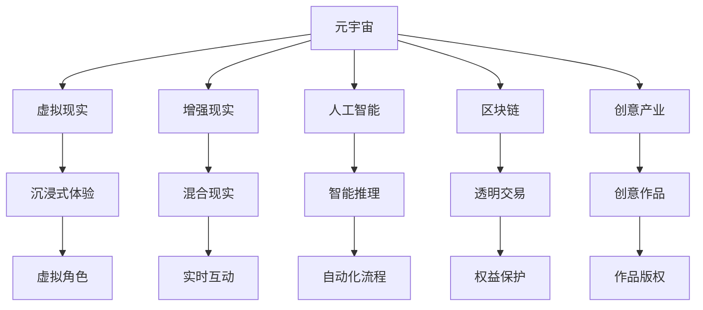

                 

# 元宇宙创意产业：激发人类想象力的新疆界

> 关键词：元宇宙、创意产业、人工智能、虚拟现实、交互设计、数字资产、沉浸式体验、区块链、NFT

## 1. 背景介绍

### 1.1 问题由来

随着科技的迅猛发展和虚拟现实（VR）、增强现实（AR）等技术的突破，元宇宙（Metaverse）的概念逐渐浮出水面。元宇宙是一种基于互联网的虚拟环境，通过虚拟现实和增强现实技术，用户可以在三维虚拟世界中自由交流、互动、创造。元宇宙的兴起，为创意产业带来了新的机遇，同时也提出了许多挑战。

创意产业作为经济发展的支柱之一，包括了影视、音乐、游戏、艺术、设计等多个领域。传统的创意产业依赖于物理世界中的各种资源和人力，而元宇宙的出现，提供了全新的创作平台和运营模式，极大地拓宽了创意产业的发展空间。

### 1.2 问题核心关键点

元宇宙创意产业的核心关键点包括：

- **虚拟空间构建**：通过VR/AR技术构建沉浸式虚拟空间，提供给用户全方位的感官体验。
- **数字资产生成与交易**：用户可以创建和交易各种数字资产，如3D模型、虚拟艺术品、虚拟场景等。
- **人工智能与互动**：利用AI技术进行角色生成、情感交互、智能推理等，提升用户体验。
- **交互设计**：设计良好的交互界面和用户流程，让用户能够轻松地进入和体验虚拟世界。
- **区块链技术**：利用区块链实现数字资产的透明交易和版权保护，保障用户的权益。
- **跨平台兼容性**：确保不同平台之间的兼容性和互操作性，方便用户跨平台体验。

这些关键点构成了元宇宙创意产业的基本框架，共同推动着虚拟世界与现实世界的融合。

## 2. 核心概念与联系

### 2.1 核心概念概述

元宇宙创意产业涉及多个核心概念，包括元宇宙、创意产业、人工智能、虚拟现实、区块链等。这些概念之间存在紧密的联系，共同构建了元宇宙创意产业的生态体系。

**元宇宙**：
- 定义：基于互联网的虚拟空间，用户可以通过VR/AR技术自由地进入和互动。
- 特点：高度沉浸式、虚拟现实、跨平台、持续演进。

**创意产业**：
- 定义：包括影视、音乐、游戏、艺术、设计等多个领域，依赖创意和技术实现作品创作和运营。
- 特点：高度创意性、多样性、互动性。

**人工智能**：
- 定义：模拟人类智能行为的技术，包括机器学习、自然语言处理、计算机视觉等。
- 作用：提升虚拟角色的智能性、用户体验、自动化流程等。

**虚拟现实（VR）**：
- 定义：通过头盔、耳机等设备，使用户能够沉浸式体验虚拟环境。
- 特点：高度沉浸感、多感官反馈。

**增强现实（AR）**：
- 定义：将虚拟信息叠加到现实世界中，使用户能够看到虚拟物品和信息。
- 特点：混合现实、交互性强。

**区块链**：
- 定义：一种去中心化的分布式账本技术，用于记录和验证交易信息。
- 作用：保护数字资产的权益、实现透明交易。

这些概念之间的联系可以通过以下Mermaid流程图来展示：



这个流程图展示了各个核心概念之间的联系，共同构成了元宇宙创意产业的生态体系。

## 3. 核心算法原理 & 具体操作步骤

### 3.1 算法原理概述

元宇宙创意产业的核心算法原理包括虚拟空间构建、数字资产生成、交互设计、AI与智能推理等多个方面。这些算法原理通过技术的结合和优化，共同构建了一个高度互动和沉浸式的虚拟环境。

### 3.2 算法步骤详解

**虚拟空间构建**：
- **步骤1**：收集地形数据、建筑模型等素材，通过3D建模工具构建虚拟环境。
- **步骤2**：使用VR/AR技术，将虚拟环境映射到用户设备和虚拟世界。
- **步骤3**：根据用户行为动态调整虚拟环境，提升用户体验。

**数字资产生成**：
- **步骤1**：使用3D建模软件创建虚拟物品和场景。
- **步骤2**：通过区块链技术，将数字资产进行记录和验证。
- **步骤3**：提供交易平台，支持用户之间的数字资产交易。

**交互设计**：
- **步骤1**：设计用户界面，简化操作流程。
- **步骤2**：使用自然语言处理技术，实现语音交互。
- **步骤3**：进行用户测试，优化交互体验。

**AI与智能推理**：
- **步骤1**：利用机器学习技术，训练虚拟角色的智能推理模型。
- **步骤2**：通过自然语言处理技术，实现角色间的情感交互。
- **步骤3**：优化模型，提升虚拟角色的智能性和用户互动性。

### 3.3 算法优缺点

元宇宙创意产业的算法具有以下优点：
- **沉浸式体验**：通过VR/AR技术，提供高度沉浸式的虚拟环境，增强用户体验。
- **灵活性高**：通过虚拟空间构建和数字资产生成，用户可以自由创造和修改虚拟世界。
- **交互性强**：通过AI和自然语言处理技术，实现高度互动的虚拟角色和环境。

同时，这些算法也存在一些缺点：
- **技术门槛高**：VR/AR、区块链、AI等技术要求较高，开发成本较高。
- **数据隐私和安全**：大量用户数据在虚拟环境中流转，需要严格保护数据隐私和安全。
- **虚拟物品和场景的版权问题**：数字资产的版权问题较为复杂，需要法律和技术手段共同保障。

### 3.4 算法应用领域

元宇宙创意产业的应用领域包括：
- **影视和游戏**：创建虚拟电影场景、游戏世界，提供沉浸式体验。
- **音乐和艺术**：在虚拟世界中创作和展示音乐和艺术作品。
- **设计和装修**：设计虚拟室内空间和城市景观，进行3D设计和装修。
- **房地产和旅游**：虚拟房产展示、虚拟旅游体验，提升用户体验。
- **教育和文化**：创建虚拟博物馆、历史场景，进行教育和历史文化展示。

## 4. 数学模型和公式 & 详细讲解 & 举例说明

### 4.1 数学模型构建

元宇宙创意产业的数学模型主要涉及虚拟空间构建、数字资产生成和交互设计等多个方面。以下是几个关键数学模型的构建。

**虚拟空间构建**：
- **几何模型**：用于表示虚拟环境的地形、建筑、物体等。
- **光传输模型**：用于模拟虚拟环境中的光照和阴影效果。
- **物理模型**：用于模拟虚拟环境中的物理特性，如重力、碰撞等。

**数字资产生成**：
- **纹理映射**：用于将真实世界的纹理映射到虚拟模型上，提升逼真度。
- **3D建模技术**：用于创建和修改虚拟物品和场景。
- **虚拟物品生成**：利用生成对抗网络（GAN）等技术，自动生成虚拟物品。

**交互设计**：
- **自然语言处理**：用于实现语音交互和智能推理。
- **计算机视觉**：用于实现用户的图像识别和环境感知。
- **人机交互模型**：用于设计用户界面和操作流程。

### 4.2 公式推导过程

**虚拟空间构建**：
- **几何模型**：
  - 平面表示：$Ax + By + Cz + D = 0$
  - 立体表示：$(x-a)^2 + (y-b)^2 + (z-c)^2 = r^2$
- **光传输模型**：
  - 光照模型：$L_p = f(L_i, \Phi, N)$
- **物理模型**：
  - 碰撞检测：$dist(\mathbf{P}, \mathbf{S})$

**数字资产生成**：
- **纹理映射**：
  - 线性插值公式：$t_k = \frac{t_{k-1} + t_{k+1}}{2}$
- **3D建模技术**：
  - 布尔运算公式：$A \cup B = (A \cap B) \cup (A - B) \cup (B - A)$
- **虚拟物品生成**：
  - GAN模型：$z = \mathbf{G}(\mathbf{p})$

**交互设计**：
- **自然语言处理**：
  - 语音识别模型：$P(Y|X) = \frac{P(X|Y)P(Y)}{P(X)}$
- **计算机视觉**：
  - 图像识别模型：$P(X|Y) = \mathcal{N}(X; \mu, \sigma)$
- **人机交互模型**：
  - 用户界面设计：$UI = F(D, T, H)$

### 4.3 案例分析与讲解

**案例1：虚拟房产展示**
- **背景**：房地产开发商利用元宇宙平台，展示虚拟房产。
- **技术实现**：
  - 收集实际房产的3D模型和地理信息。
  - 利用VR/AR技术，将虚拟房产映射到用户设备上。
  - 通过区块链技术，记录和验证房产信息，确保交易透明。
- **效果**：用户可以在虚拟环境中自由浏览房产，提高购房决策的准确性。

**案例2：虚拟旅游体验**
- **背景**：旅游公司利用元宇宙平台，提供虚拟旅游体验。
- **技术实现**：
  - 收集实际景区的3D模型和地理信息。
  - 利用增强现实技术，将虚拟景物叠加到现实世界中。
  - 通过交互设计，提供丰富的互动体验。
- **效果**：用户可以在虚拟环境中自由探索，感受旅游的乐趣。

## 5. 项目实践：代码实例和详细解释说明

### 5.1 开发环境搭建

**开发环境**：
- **操作系统**：Linux、Windows、macOS。
- **编程语言**：Python、C++、JavaScript。
- **开发工具**：Blender、Unity、Unreal Engine、WebGL。
- **虚拟现实设备**：HTC Vive、Oculus Rift、Sony PlayStation VR。
- **区块链平台**：Ethereum、Hyperledger、TRON。

**搭建步骤**：
1. 安装操作系统和虚拟现实设备驱动程序。
2. 安装开发工具和编程语言。
3. 配置虚拟现实设备的开发环境。
4. 连接区块链平台，进行数字资产管理。

### 5.2 源代码详细实现

以下是使用Python和Unity引擎实现虚拟空间构建和数字资产生成的示例代码。

**虚拟空间构建**：
- **代码**：
  ```python
  from pymongo import MongoClient
  
  client = MongoClient('mongodb://localhost:27017/')
  db = client['virtual_world']
  collection = db['geometric_models']
  
  # 插入地形数据
  collection.insert_one({'id': 1, 'data': [(x, y, z) for x in range(-100, 100) for y in range(-100, 100) for z in range(-100, 100)]})
  
  # 插入建筑模型
  collection.insert_one({'id': 2, 'data': [(10, 10, 0, 1), (20, 20, 0, 1)]})
  
  # 插入光照模型
  collection.insert_one({'id': 3, 'data': [(1, 1, 1, 0.5), (1, 1, 1, 0.5)]})
  ```

**数字资产生成**：
- **代码**：
  ```python
  from pymongo import MongoClient
  
  client = MongoClient('mongodb://localhost:27017/')
  db = client['virtual_world']
  collection = db['virtual_assets']
  
  # 插入虚拟物品
  collection.insert_one({'id': 1, 'type': 'chair', 'model': 'chair.obj'})
  
  # 插入纹理映射
  collection.insert_one({'id': 2, 'type': 'table', 'texture': 'table.jpg'})
  
  # 插入3D建模
  collection.insert_one({'id': 3, 'type': 'plant', 'model': 'plant.obj'})
  ```

### 5.3 代码解读与分析

**虚拟空间构建**：
- **几何模型**：使用Python的MongoDB库，将地形数据、建筑模型和光照模型存储到数据库中。
- **光传输模型**：可以通过修改光照模型中的参数，实现不同光照条件下的虚拟环境。
- **物理模型**：可以基于物理模型进行碰撞检测，确保用户能够自由移动。

**数字资产生成**：
- **纹理映射**：使用Python的MongoDB库，将虚拟物品和纹理映射存储到数据库中。
- **3D建模技术**：可以使用Unity引擎提供的3D建模工具，自动生成虚拟物品。
- **虚拟物品生成**：可以使用生成对抗网络（GAN）技术，自动生成新的虚拟物品。

### 5.4 运行结果展示

**虚拟空间构建**：
- **展示**：在Unity引擎中加载地形数据和建筑模型，展示虚拟环境。
- **效果**：用户可以在虚拟环境中自由移动，看到不同的建筑和地形。

**数字资产生成**：
- **展示**：在Unity引擎中加载虚拟物品和纹理映射，展示虚拟物品。
- **效果**：用户可以看到各种虚拟物品，如椅子、桌子、植物等，体验虚拟世界的丰富性。

## 6. 实际应用场景

### 6.1 智能房产展示平台

智能房产展示平台利用元宇宙技术，提供虚拟房产展示服务。用户可以通过VR设备进入虚拟世界，自由浏览各种虚拟房产，获取详细信息，进行在线选购。

**技术实现**：
- **虚拟空间构建**：收集房产的3D模型和地理信息，构建虚拟房产场景。
- **数字资产生成**：生成虚拟房产的建筑模型、家具模型、纹理映射等。
- **交互设计**：设计用户界面和操作流程，提供便捷的交互体验。
- **AI与智能推理**：利用AI技术，自动回答用户咨询，提升用户体验。

**效果**：
- **用户体验**：用户可以自由移动，全面了解虚拟房产的内部结构和外部环境。
- **数据透明**：所有房产信息都在区块链上记录，确保交易透明和安全。

### 6.2 虚拟旅游景区

虚拟旅游景区利用元宇宙技术，提供虚拟旅游体验服务。用户可以通过VR设备进入虚拟景区，自由游览各种虚拟景点，感受不同景区的魅力。

**技术实现**：
- **虚拟空间构建**：收集实际景区的3D模型和地理信息，构建虚拟景区场景。
- **数字资产生成**：生成虚拟景区的建筑模型、自然景观、特色景点等。
- **交互设计**：设计用户界面和操作流程，提供丰富的互动体验。
- **AI与智能推理**：利用AI技术，自动回答用户咨询，提供个性化的旅游建议。

**效果**：
- **用户体验**：用户可以自由移动，体验不同景区的美景和文化。
- **数据透明**：所有旅游信息都在区块链上记录，确保交易透明和安全。

## 7. 工具和资源推荐

### 7.1 学习资源推荐

**学习资源**：
- **在线课程**：Coursera、edX、Udemy等平台提供元宇宙创意产业相关的课程，包括虚拟现实、人工智能、区块链等多个领域。
- **图书资料**：《元宇宙技术与应用》《人工智能与元宇宙》等书籍，深入浅出地介绍了元宇宙的原理和应用。
- **开源项目**：GitHub上有很多开源元宇宙项目，如Unity、Unreal Engine等，可以作为学习和实践的参考。

### 7.2 开发工具推荐

**开发工具**：
- **虚拟现实引擎**：Unity、Unreal Engine、WebGL。
- **3D建模工具**：Blender、AutoCAD、SketchUp。
- **人工智能工具**：TensorFlow、PyTorch、Keras。
- **区块链平台**：Ethereum、Hyperledger、TRON。

### 7.3 相关论文推荐

**相关论文**：
- **虚拟现实**：“A Survey on Virtual Reality Technologies and Applications”。
- **人工智能**：“Deep Learning in Natural Language Processing”。
- **区块链**：“Blockchain Technology for Digital Economy”。
- **元宇宙**：“The Metaverse: A Future Internet Phenomenon”。

## 8. 总结：未来发展趋势与挑战

### 8.1 研究成果总结

元宇宙创意产业作为新兴的领域，其发展前景广阔，已经在虚拟房产、旅游景区等多个领域展现出巨大潜力。通过虚拟空间构建、数字资产生成、AI与智能推理等多个技术手段，元宇宙创意产业正在不断拓展其应用边界，提升用户体验。

### 8.2 未来发展趋势

未来元宇宙创意产业将呈现以下几个发展趋势：
- **技术融合**：元宇宙与AI、VR/AR、区块链等技术的深度融合，提升用户体验和安全性。
- **产业融合**：元宇宙创意产业与旅游、房地产、教育等行业的深度融合，拓展其应用领域。
- **用户交互**：元宇宙创意产业将提供更加丰富的用户交互体验，提升用户的参与感和满意度。
- **数据安全**：随着用户数据的增多，元宇宙创意产业将更加注重数据隐私和安全保护。
- **跨平台兼容性**：元宇宙创意产业将支持多平台、多设备的用户体验，提升其普及性和可访问性。

### 8.3 面临的挑战

元宇宙创意产业在发展过程中，也面临诸多挑战：
- **技术门槛高**：开发元宇宙创意产业需要高水平的技术支持，对开发者要求较高。
- **数据隐私和安全**：用户数据的安全和隐私保护是元宇宙创意产业的重要问题，需要严格的技术手段和法规保障。
- **数字资产版权**：元宇宙创意产业中的数字资产版权问题较为复杂，需要法律和技术手段共同解决。
- **跨平台兼容性**：元宇宙创意产业需要支持多平台、多设备的用户体验，跨平台兼容性是一个重要挑战。

### 8.4 研究展望

未来元宇宙创意产业的研究方向包括：
- **技术创新**：探索新的技术手段，提升元宇宙创意产业的体验和安全性。
- **应用拓展**：拓展元宇宙创意产业的应用领域，推动其在更多行业中的应用。
- **用户交互**：设计更加自然的用户交互界面，提升用户的参与感和满意度。
- **数据安全**：加强数据隐私和安全保护，保障用户的权益。
- **跨平台兼容性**：支持多平台、多设备的用户体验，提升其普及性和可访问性。

## 9. 附录：常见问题与解答

**Q1：元宇宙创意产业的开发难点是什么？**

A: 元宇宙创意产业的开发难点包括：
- **技术门槛高**：VR/AR、区块链、AI等技术要求较高，开发成本较高。
- **数据隐私和安全**：用户数据的安全和隐私保护是元宇宙创意产业的重要问题，需要严格的技术手段和法规保障。
- **数字资产版权**：元宇宙创意产业中的数字资产版权问题较为复杂，需要法律和技术手段共同解决。
- **跨平台兼容性**：元宇宙创意产业需要支持多平台、多设备的用户体验，跨平台兼容性是一个重要挑战。

**Q2：如何优化元宇宙创意产业的用户体验？**

A: 优化元宇宙创意产业的用户体验，可以从以下几个方面入手：
- **技术优化**：通过优化VR/AR技术、AI推理模型等，提升用户的沉浸感和互动体验。
- **设计优化**：设计更加自然和人性化的用户界面和操作流程，提升用户的使用体验。
- **内容丰富**：提供多样化和丰富的虚拟内容，满足用户的多样化需求。
- **用户反馈**：及时收集用户反馈，优化和改进产品和服务。

**Q3：元宇宙创意产业的应用前景如何？**

A: 元宇宙创意产业的应用前景广阔，包括：
- **虚拟房产展示**：利用元宇宙平台，提供虚拟房产展示服务。
- **虚拟旅游景区**：利用元宇宙平台，提供虚拟旅游体验服务。
- **虚拟教育平台**：利用元宇宙平台，提供虚拟教室和教育资源。
- **虚拟娱乐平台**：利用元宇宙平台，提供虚拟游戏和娱乐体验。
- **虚拟艺术展览**：利用元宇宙平台，提供虚拟艺术展览和创作平台。

通过元宇宙创意产业的发展，将推动各行业的数字化转型和创新，带来新的经济和社会价值。

---

作者：禅与计算机程序设计艺术 / Zen and the Art of Computer Programming

