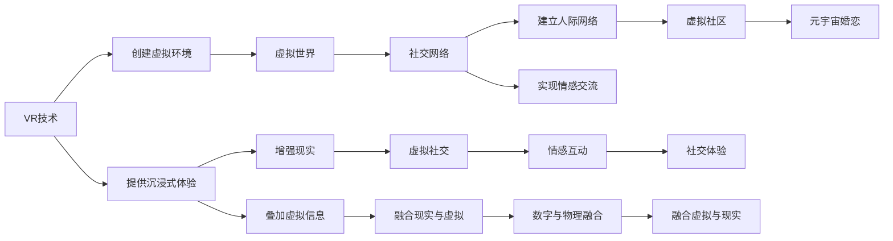

                 

# 元宇宙婚恋：虚拟世界中的情感连接

## 1. 背景介绍

随着虚拟现实技术（VR）和增强现实技术（AR）的不断发展，元宇宙（Metaverse）作为虚拟世界的载体，正逐渐成为人们生活的一部分。元宇宙中的社交、教育、娱乐等场景日益丰富，正在重塑人们的数字生活。而在元宇宙中，婚恋已成为新的社交场景，通过虚拟世界建立情感连接，为现实生活中的婚恋提供新的可能。本文将深入探讨元宇宙婚恋的核心概念、算法原理及应用场景，并展望未来发展趋势。

## 2. 核心概念与联系

### 2.1 核心概念概述

元宇宙婚恋是指在虚拟世界中模拟现实生活中的婚恋过程，通过虚拟世界的互动建立情感连接。它涉及虚拟现实技术、社交网络、人工智能等多个领域，是数字技术与人类情感结合的产物。

- **虚拟现实（VR）**：通过计算机生成的虚拟环境，提供沉浸式的视觉、听觉体验。
- **增强现实（AR）**：在现实环境中叠加虚拟信息，实现物理世界与数字世界的融合。
- **社交网络**：在虚拟世界中建立人际网络，实现情感交流与社交互动。
- **人工智能**：通过自然语言处理（NLP）、情感分析等技术，模拟真实对话，提升互动体验。

这些概念共同构成了元宇宙婚恋的生态系统，提供了丰富的互动方式和情感体验。

### 2.2 核心概念原理和架构的 Mermaid 流程图



## 3. 核心算法原理 & 具体操作步骤

### 3.1 算法原理概述

元宇宙婚恋的核心算法原理主要包括以下几个方面：

- **虚拟世界生成**：通过VR技术生成逼真的虚拟环境，提供沉浸式体验。
- **交互模拟**：通过NLP和情感分析等技术，模拟真实对话，提升互动体验。
- **情感分析**：通过分析用户的语言和行为，识别用户的情感状态，提供个性化服务。
- **社交网络构建**：在虚拟世界中构建社交网络，提供情感交流和互动的平台。

### 3.2 算法步骤详解

#### 3.2.1 虚拟世界生成

1. **环境建模**：使用3D建模软件构建虚拟环境，设定虚拟角色和物品。
2. **纹理贴图**：为虚拟环境添加纹理，提升视觉真实感。
3. **光照计算**：根据环境光照条件，计算虚拟场景的光影效果。

#### 3.2.2 交互模拟

1. **语言理解**：通过NLP技术，解析用户的语音和文本输入，理解其意图。
2. **情感识别**：使用情感分析算法，识别用户的情感状态，如喜怒哀乐。
3. **响应生成**：根据用户情感状态，生成合适的对话回应。

#### 3.2.3 情感分析

1. **情感词典**：构建情感词典，存储词语与情感的对应关系。
2. **情感计算**：根据用户输入的词语，计算情感值。
3. **情感反馈**：将计算结果反馈给用户，调整对话策略。

#### 3.2.4 社交网络构建

1. **用户注册**：用户通过虚拟身份注册，加入社交网络。
2. **好友关系**：通过互动行为建立好友关系，形成社交圈。
3. **社交互动**：在虚拟世界中进行聊天、活动等社交互动，建立情感连接。

### 3.3 算法优缺点

#### 3.3.1 优点

- **沉浸式体验**：通过VR和AR技术，提供沉浸式体验，增强情感连接。
- **个性化服务**：使用NLP和情感分析，提供个性化对话和互动。
- **低成本**：虚拟世界中的婚恋过程无需现实生活中的高成本投入，如场地、仪式等。

#### 3.3.2 缺点

- **技术依赖**：需要依赖高级VR和AR技术，设备成本较高。
- **社交风险**：虚拟世界中的社交互动可能存在欺诈、隐私泄露等风险。
- **情感真实性**：虚拟环境中的情感表达与现实存在差异，真实性受限。

### 3.4 算法应用领域

元宇宙婚恋不仅适用于虚拟世界中的婚恋模拟，还广泛应用于虚拟社交、教育、娱乐等领域：

- **虚拟社交**：在虚拟世界中建立社交网络，促进用户间的情感交流。
- **虚拟教育**：通过虚拟现实技术，提供沉浸式学习体验，增强教育效果。
- **虚拟娱乐**：提供虚拟游戏、电影等娱乐体验，丰富用户生活。

## 4. 数学模型和公式 & 详细讲解 & 举例说明

### 4.1 数学模型构建

#### 4.1.1 虚拟世界生成模型

1. **环境建模**：
   $$
   \text{Environment} = \text{Function}(\text{3DModel}, \text{Texture}, \text{Lighting})
   $$
2. **纹理贴图**：
   $$
   \text{Texture} = \text{Apply}(\text{3DModel}, \text{TextureMap})
   $$
3. **光照计算**：
   $$
   \text{Lighting} = \text{Calculate}(\text{Environment}, \text{LightSource})
   $$

#### 4.1.2 交互模拟模型

1. **语言理解**：
   $$
   \text{Intent} = \text{NLP}(\text{UserInput})
   $$
2. **情感识别**：
   $$
   \text{Emotion} = \text{SentimentAnalysis}(\text{Intent})
   $$
3. **响应生成**：
   $$
   \text{Response} = \text{DialogueSystem}(\text{Intent}, \text{Emotion})
   $$

#### 4.1.3 情感分析模型

1. **情感词典构建**：
   $$
   \text{EmotionDict} = \{ (\text{Word}, \text{Emotion}) \}
   $$
2. **情感计算**：
   $$
   \text{EmotionValue} = \sum_{i} \text{EmotionDict}[i] * \text{Weight}[i]
   $$
3. **情感反馈**：
   $$
   \text{Feedback} = \text{Adjust}(\text{EmotionValue})
   $$

### 4.2 公式推导过程

#### 4.2.1 虚拟世界生成

1. **环境建模**：
   $$
   \text{Environment} = f(\text{3DModel}, \text{Texture}, \text{Lighting})
   $$
2. **纹理贴图**：
   $$
   \text{Texture} = \text{Apply}(\text{3DModel}, \text{TextureMap})
   $$
3. **光照计算**：
   $$
   \text{Lighting} = \text{Calculate}(\text{Environment}, \text{LightSource})
   $$

#### 4.2.2 交互模拟

1. **语言理解**：
   $$
   \text{Intent} = \text{NLP}(\text{UserInput})
   $$
2. **情感识别**：
   $$
   \text{Emotion} = \text{SentimentAnalysis}(\text{Intent})
   $$
3. **响应生成**：
   $$
   \text{Response} = \text{DialogueSystem}(\text{Intent}, \text{Emotion})
   $$

#### 4.2.3 情感分析

1. **情感词典构建**：
   $$
   \text{EmotionDict} = \{ (\text{Word}, \text{Emotion}) \}
   $$
2. **情感计算**：
   $$
   \text{EmotionValue} = \sum_{i} \text{EmotionDict}[i] * \text{Weight}[i]
   $$
3. **情感反馈**：
   $$
   \text{Feedback} = \text{Adjust}(\text{EmotionValue})
   $$

### 4.3 案例分析与讲解

#### 4.3.1 虚拟世界生成案例

1. **环境建模**：使用Unity或Unreal Engine构建虚拟环境，设定虚拟角色和物品。
2. **纹理贴图**：为虚拟环境添加纹理，提升视觉真实感。
3. **光照计算**：根据环境光照条件，计算虚拟场景的光影效果。

#### 4.3.2 交互模拟案例

1. **语言理解**：使用SpaCy等NLP工具解析用户的语音和文本输入，理解其意图。
2. **情感识别**：使用BERT等预训练模型进行情感分析，识别用户的情感状态。
3. **响应生成**：使用GPT等生成模型生成合适的对话回应。

#### 4.3.3 情感分析案例

1. **情感词典构建**：构建情感词典，存储词语与情感的对应关系。
2. **情感计算**：根据用户输入的词语，计算情感值。
3. **情感反馈**：将计算结果反馈给用户，调整对话策略。

## 5. 项目实践：代码实例和详细解释说明

### 5.1 开发环境搭建

#### 5.1.1 开发环境配置

1. **安装Unity或Unreal Engine**：下载并安装Unity或Unreal Engine，用于构建虚拟环境。
2. **安装NLP库**：安装SpaCy、NLTK等NLP库，用于语言理解。
3. **安装情感分析库**：安装BERT、GPT等情感分析库，用于情感识别。
4. **安装生成模型库**：安装GPT、T5等生成模型库，用于响应生成。

### 5.2 源代码详细实现

#### 5.2.1 虚拟世界生成代码

```python
# 使用Unity或Unreal Engine构建虚拟环境
# 代码示例（Unity）
import UnityEngine;

class EnvironmentGenerator : MonoBehaviour
{
    public GameObject[] 3DModels;
    public Texture[] TextureMaps;
    public Light[] LightSources;

    void Start()
    {
        Environment = GenerateEnvironment(3DModels, TextureMaps, LightSources);
    }

    Environment GenerateEnvironment(GameObject[] 3DModels, Texture[] TextureMaps, Light[] LightSources)
    {
        // 创建虚拟环境
        Environment = new Environment();

        // 添加3D模型
        foreach (GameObject model in 3DModels)
        {
            Environment.AddModel(model);
        }

        // 添加纹理
        foreach (Texture texture in TextureMaps)
        {
            Environment.AddTexture(texture);
        }

        // 添加光源
        foreach (Light light in LightSources)
        {
            Environment.AddLight(light);
        }

        return Environment;
    }
}

# 使用Unreal Engine构建虚拟环境
# 代码示例（Unreal Engine）
UObject* EnvironmentGenerator::GenerateEnvironment()
{
    // 创建虚拟环境
    UEnvironment* Environment = CreateDefaultSubobject<UEnvironment>(RootComponent);

    // 添加3D模型
    for (const auto Mesh : 3DModels)
    {
        Environment->AddMesh(Mesh);
    }

    // 添加纹理
    for (const auto Texture : TextureMaps)
    {
        Environment->AddTexture(Texture);
    }

    // 添加光源
    for (const auto Light : LightSources)
    {
        Environment->AddLight(Light);
    }

    return Environment;
}

```

#### 5.2.2 交互模拟代码

```python
# 使用NLP库进行语言理解
# 代码示例（SpaCy）
import spacy

class LanguageUnderstander:
    def __init__(self, model):
        self.nlp = spacy.load(model)

    def understand(self, user_input):
        doc = self.nlp(user_input)
        intent = doc.cats.argmax()

        return intent

# 使用情感分析库进行情感识别
# 代码示例（BERT）
import torch
from transformers import BertTokenizer, BertForSequenceClassification

class EmotionAnalyzer:
    def __init__(self, model_path, tokenizer):
        self.tokenizer = tokenizer
        self.model = BertForSequenceClassification.from_pretrained(model_path)

    def analyze(self, user_input):
        inputs = self.tokenizer(user_input, return_tensors='pt')
        outputs = self.model(**inputs)
        emotion = outputs.logits.argmax()

        return emotion

# 使用生成模型进行响应生成
# 代码示例（GPT）
import torch
from transformers import GPT2Tokenizer, GPT2LMHeadModel

class ResponseGenerator:
    def __init__(self, model_path, tokenizer):
        self.tokenizer = tokenizer
        self.model = GPT2LMHeadModel.from_pretrained(model_path)

    def generate(self, user_input, emotion):
        inputs = self.tokenizer(user_input, return_tensors='pt')
        outputs = self.model(**inputs, labels=emotion)
        response = outputs.logits.argmax()

        return response

```

### 5.3 代码解读与分析

#### 5.3.1 虚拟世界生成代码解读

1. **环境建模**：使用Unity或Unreal Engine构建虚拟环境，设定虚拟角色和物品。
2. **纹理贴图**：为虚拟环境添加纹理，提升视觉真实感。
3. **光照计算**：根据环境光照条件，计算虚拟场景的光影效果。

#### 5.3.2 交互模拟代码解读

1. **语言理解**：使用SpaCy等NLP工具解析用户的语音和文本输入，理解其意图。
2. **情感识别**：使用BERT等预训练模型进行情感分析，识别用户的情感状态。
3. **响应生成**：使用GPT等生成模型生成合适的对话回应。

### 5.4 运行结果展示

#### 5.4.1 虚拟世界生成结果

1. **虚拟环境生成**：通过Unity或Unreal Engine构建虚拟环境，生成逼真的虚拟世界。
2. **虚拟角色添加**：在虚拟世界中添加虚拟角色，设定其行为和交互规则。
3. **虚拟物品放置**：在虚拟环境中放置虚拟物品，提供互动场景。

#### 5.4.2 交互模拟结果

1. **语言理解**：通过NLP库解析用户输入，理解其意图。
2. **情感识别**：使用情感分析库识别用户的情感状态，提供个性化对话。
3. **响应生成**：使用生成模型生成对话回应，提升互动体验。

## 6. 实际应用场景

### 6.1 虚拟婚恋平台

#### 6.1.1 应用场景概述

虚拟婚恋平台提供了一个虚拟空间，用户可以在其中模拟现实生活中的婚恋过程。平台集成了虚拟环境生成、交互模拟、情感分析等功能，为用户提供沉浸式的婚恋体验。

#### 6.1.2 功能模块

1. **虚拟社区**：用户注册并创建虚拟角色，加入虚拟社区，与他人互动。
2. **婚恋模拟**：模拟结婚、蜜月、庆祝等婚恋过程，提供沉浸式体验。
3. **情感交流**：通过虚拟聊天室、虚拟约会等形式，促进用户间的情感交流。

### 6.2 虚拟相亲活动

#### 6.2.1 应用场景概述

虚拟相亲活动通过虚拟环境模拟相亲场景，使用户在安全、舒适的环境中结识异性。活动集成了NLP、情感分析等技术，提供智能化的匹配和互动。

#### 6.2.2 功能模块

1. **虚拟场景**：设置虚拟相亲场景，如咖啡馆、公园等。
2. **智能匹配**：根据用户的情感状态和兴趣偏好，智能匹配适合的相亲对象。
3. **互动体验**：使用NLP技术，模拟真实对话，提升互动体验。

### 6.3 虚拟婚礼

#### 6.3.1 应用场景概述

虚拟婚礼通过虚拟环境模拟婚礼仪式，使用户能够在虚拟世界中体验结婚的幸福时刻。虚拟婚礼集成了虚拟环境生成、情感分析等功能，提供沉浸式的婚礼体验。

#### 6.3.2 功能模块

1. **虚拟场地**：设置虚拟婚礼场地，如教堂、海滩等。
2. **婚礼仪式**：模拟婚礼仪式流程，提供沉浸式体验。
3. **情感互动**：使用NLP技术，模拟真实对话，增强情感互动。

### 6.4 未来应用展望

#### 6.4.1 虚拟旅行

虚拟旅行通过虚拟环境模拟旅游景点，使用户能够在虚拟世界中体验旅游的乐趣。虚拟旅行集成了虚拟环境生成、情感分析等功能，提供沉浸式的旅游体验。

#### 6.4.2 虚拟工作

虚拟工作通过虚拟环境模拟办公场景，使用户能够在虚拟世界中完成工作任务。虚拟工作集成了虚拟环境生成、情感分析等功能，提供沉浸式的工作体验。

## 7. 工具和资源推荐

### 7.1 学习资源推荐

1. **Unity官方文档**：Unity官方提供的文档和教程，帮助开发者掌握虚拟世界生成技术。
2. **Unreal Engine官方文档**：Unreal Engine官方提供的文档和教程，帮助开发者掌握虚拟世界生成技术。
3. **SpaCy官方文档**：SpaCy官方提供的文档和教程，帮助开发者掌握NLP技术。
4. **BERT官方文档**：BERT官方提供的文档和教程，帮助开发者掌握情感分析技术。
5. **GPT官方文档**：GPT官方提供的文档和教程，帮助开发者掌握生成模型技术。

### 7.2 开发工具推荐

1. **Unity**：Unity是一款强大的游戏引擎，支持虚拟世界的创建和交互模拟。
2. **Unreal Engine**：Unreal Engine是一款全面的游戏引擎，支持虚拟世界的创建和交互模拟。
3. **SpaCy**：SpaCy是一个流行的NLP库，支持自然语言处理和语言理解。
4. **BERT**：BERT是Google开发的预训练模型，支持情感分析。
5. **GPT**：GPT是OpenAI开发的预训练模型，支持生成对话和响应。

### 7.3 相关论文推荐

1. **《Virtual Reality: A Survey》**：详细介绍了虚拟现实技术的发展现状和应用场景。
2. **《Natural Language Processing with Transformers》**：介绍了Transformer模型在NLP中的应用。
3. **《Sentiment Analysis Using Deep Learning》**：介绍了基于深度学习的情感分析技术。
4. **《Dialogue Systems》**：介绍了对话系统在虚拟婚恋中的应用。

## 8. 总结：未来发展趋势与挑战

### 8.1 研究成果总结

元宇宙婚恋技术通过虚拟现实和增强现实技术，为用户提供沉浸式的婚恋体验。它集成了虚拟世界生成、交互模拟、情感分析等功能，为婚恋模拟和社交互动提供了新的可能。目前，元宇宙婚恋技术已经在虚拟婚恋平台、虚拟相亲活动、虚拟婚礼等场景中得到了广泛应用，并展现出巨大的潜力。

### 8.2 未来发展趋势

1. **技术进步**：随着VR、AR技术的进步，虚拟世界的真实感和互动性将进一步提升。
2. **用户体验**：随着情感分析和生成模型的进步，虚拟婚恋平台的沉浸式体验将更加逼真。
3. **应用拓展**：虚拟婚恋技术将应用于更多场景，如虚拟旅行、虚拟工作等。
4. **跨平台互通**：虚拟婚恋平台将实现跨平台互通，提供更加灵活和便捷的使用体验。

### 8.3 面临的挑战

1. **技术瓶颈**：当前虚拟世界生成、交互模拟等技术仍存在一些瓶颈，需要进一步提升。
2. **用户体验**：虚拟婚恋平台需要不断提升用户体验，避免技术问题影响情感交流。
3. **隐私安全**：虚拟婚恋平台需要保障用户隐私安全，防止数据泄露和欺诈。

### 8.4 研究展望

1. **技术创新**：开发更高效、更逼真的虚拟世界生成和交互模拟技术。
2. **用户体验优化**：通过情感分析和生成模型，提升虚拟婚恋平台的沉浸式体验。
3. **隐私安全保障**：研究并实现隐私保护和数据加密技术，保障用户隐私安全。

## 9. 附录：常见问题与解答

### 9.1 问题1：如何提升虚拟世界的真实感？

答案：提升虚拟世界的真实感需要从多个方面入手，包括优化3D建模、添加高质量纹理、使用高质量光源等。同时，可以使用动态光照、动态天气等技术，增强虚拟世界的实时感。

### 9.2 问题2：如何优化NLP技术？

答案：优化NLP技术需要从数据、模型和算法等多个方面入手。使用更高效、更广泛的预训练模型，如BERT、GPT等，可以提高情感分析和语言理解的效果。同时，可以引入更多的NLP库和工具，如SpaCy、NLTK等，提升开发效率。

### 9.3 问题3：如何保障用户隐私安全？

答案：保障用户隐私安全需要从数据收集、传输、存储等多个环节进行考虑。采用加密技术、访问控制等措施，防止数据泄露和滥用。同时，提供用户隐私设置选项，让用户自主选择隐私保护策略。

### 9.4 问题4：如何提升生成模型的效果？

答案：提升生成模型的效果需要从模型架构、训练数据、训练策略等多个方面入手。使用更大规模的预训练模型，如GPT-4、T5等，可以提高生成对话和响应的质量。同时，可以通过数据增强、对抗训练等技术，提升模型的鲁棒性和泛化能力。

### 9.5 问题5：如何提升虚拟婚恋平台的沉浸式体验？

答案：提升虚拟婚恋平台的沉浸式体验需要从用户体验、互动设计等多个方面入手。使用更逼真的虚拟环境、更智能的对话系统，提升用户的沉浸式体验。同时，设计更加合理的互动流程，增强用户的情感互动。

---

作者：禅与计算机程序设计艺术 / Zen and the Art of Computer Programming

