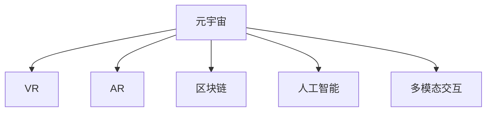
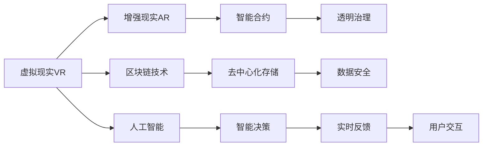

                 

# 元宇宙政府架构:全球治理的数字化新模式

> 关键词：元宇宙政府,数字化治理,虚拟现实,区块链,人工智能,多模态交互

## 1. 背景介绍

### 1.1 问题由来
近年来，随着互联网技术的迅猛发展，虚拟现实(VR)、增强现实(AR)等新兴技术逐渐从科幻电影走入现实生活。尤其是新冠疫情的爆发，使得远程办公、在线教育、虚拟会议室等需求大幅增加，进一步推动了元宇宙技术的发展。

元宇宙（Metaverse）是一种基于虚拟现实、增强现实等技术的虚拟空间，它融合了物理世界的数字化数据，提供了沉浸式、交互式和虚拟化的人机交互体验。在这种背景下，元宇宙技术开始被应用于各个领域，包括政府治理。

政府部门通过元宇宙技术，可以打破地域、时间和空间的限制，实现跨部门、跨地域的协同办公，提升公共服务的数字化、智能化水平。

### 1.2 问题核心关键点
元宇宙政府架构涉及多个核心技术，包括虚拟现实(VR)、增强现实(AR)、虚拟协作平台、区块链、人工智能等。这些技术相互配合，形成了政府服务的虚拟化、智能化和新模式。

元宇宙政府架构的主要特点包括：
- 数字化办公：打破物理空间限制，实现远程协同。
- 智能化服务：引入人工智能和大数据技术，提高决策智能化。
- 透明度提升：通过区块链技术，提升公共事务透明度。
- 多模态交互：提供语音、图像、文字等多渠道交互方式。
- 泛在互联：实现城市、部门、公民之间的广泛连接。

## 2. 核心概念与联系

### 2.1 核心概念概述

为更好地理解元宇宙政府架构，本节将介绍几个关键核心概念：

- 元宇宙（Metaverse）：一种虚拟的空间，通过虚拟现实、增强现实等技术，将物理世界数字化，实现虚拟化、智能化的交互体验。
- 虚拟现实(VR)：通过头戴显示器、控制器等设备，将用户带入一个虚拟的三维空间。
- 增强现实(AR)：将数字信息叠加到现实世界的物理物体上，增强用户对物理世界的感知。
- 区块链：一种去中心化的分布式账本技术，保证数据的安全性和透明度。
- 人工智能：通过机器学习、深度学习等算法，模拟人的思维和决策能力。
- 多模态交互：通过语音、图像、文字等多种方式，实现人机交互。

这些概念之间的逻辑关系可以通过以下Mermaid流程图来展示：



### 2.2 核心概念原理和架构的 Mermaid 流程图

这里用Mermaid流程图展示元宇宙政府架构的核心概念及其相互联系：



## 3. 核心算法原理 & 具体操作步骤
### 3.1 算法原理概述

元宇宙政府架构的核心算法原理包括虚拟现实、增强现实、区块链和人工智能的协同工作机制。以下是各个核心算法的概述：

- 虚拟现实(VR)：通过头戴设备和控制器，使用户能够在虚拟空间中进行三维交互，体验沉浸式环境。
- 增强现实(AR)：通过摄像头和显示设备，将虚拟信息叠加到现实世界中，提升用户对物理世界的感知。
- 区块链：利用分布式账本技术，保障数据的安全性和透明性，提升政府服务的可信度。
- 人工智能：通过深度学习和自然语言处理等算法，提高公共服务的智能化水平。

### 3.2 算法步骤详解

构建元宇宙政府架构需要经历多个关键步骤：

**Step 1: 确定架构设计**

- 明确政府服务的核心目标，如公民服务、政策制定、行政审批等。
- 选择合适的技术栈，如VR/AR开发平台、区块链框架、AI算法库等。
- 设计架构的顶层结构，明确各个模块的功能和接口。

**Step 2: 部署虚拟现实平台**

- 搭建VR开发环境，如Oculus Rift、HTC Vive等。
- 设计虚拟场景，包括政府大厅、会议室、文档库等。
- 实现三维交互，如手势控制、语音识别等。

**Step 3: 引入增强现实技术**

- 集成AR设备，如智能眼镜、AR平板等。
- 开发AR应用，将政府信息叠加到现实世界中。
- 提供跨平台交互，如Web AR、移动端AR等。

**Step 4: 引入区块链技术**

- 部署区块链平台，如Hyperledger Fabric、EOS等。
- 设计智能合约，实现政府服务的自动化和透明化。
- 实施去中心化存储，保障数据的安全性和隐私性。

**Step 5: 引入人工智能算法**

- 选择适合的AI框架，如TensorFlow、PyTorch等。
- 训练AI模型，实现文本分类、情感分析、意图识别等功能。
- 实现智能决策，提高政府服务的智能化水平。

**Step 6: 实现多模态交互**

- 设计用户界面(UI)，支持语音、图像、文字等多种交互方式。
- 集成多种交互技术，如语音识别、图像识别、自然语言处理等。
- 实现跨设备交互，支持手机、平板、PC等多种终端设备。

### 3.3 算法优缺点

元宇宙政府架构具有以下优点：

- 打破物理空间限制：用户可以在任何地点通过VR/AR设备访问政府服务。
- 提升智能化水平：引入AI和大数据技术，提高决策的智能化和自动化。
- 保障数据安全：区块链技术确保数据的安全性和透明性，提升公共服务的可信度。
- 实现多模态交互：提供语音、图像、文字等多种交互方式，提升用户体验。
- 提高效率和透明度：自动化和透明化的政府服务，提高决策效率和透明度。

同时，该架构也存在一些缺点：

- 技术门槛较高：需要多种先进技术的集成和协同工作，开发难度较大。
- 硬件依赖严重：需要VR/AR设备、区块链平台等，硬件成本较高。
- 数据隐私问题：尽管区块链提升了数据透明性，但虚拟空间的隐私保护仍需进一步加强。
- 跨平台兼容性：不同设备和平台之间的交互兼容性需要进一步优化。
- 安全性挑战：虚拟空间的开放性可能带来新的安全威胁，需要加强安全防护。

### 3.4 算法应用领域

元宇宙政府架构适用于各种政府服务的数字化转型，包括但不限于：

- 公共服务：如电子政务、在线申请、政务咨询等。
- 政策制定：如智能议案制定、政策影响评估等。
- 行政审批：如在线审批、自动审核等。
- 应急响应：如灾害预警、应急指挥等。
- 智能交通：如智能导航、智能停车等。
- 智能城市：如智慧警务、智能能源等。

## 4. 数学模型和公式 & 详细讲解 & 举例说明
### 4.1 数学模型构建

本节将使用数学语言对元宇宙政府架构的核心算法进行更加严格的刻画。

记虚拟现实场景为$V=\{v_i\}_{i=1}^N$，增强现实场景为$AR=\{a_j\}_{j=1}^M$，区块链平台为$B=\{b_k\}_{k=1}^K$，人工智能系统为$AI=\{ai\}_{i=1}^L$。

### 4.2 公式推导过程

以智能决策为例，假设政府服务为$G$，智能合约为$C$，数据存储为$D$。智能决策模型$D$的输入为$V$、$AR$、$B$和$AI$，输出为政府服务的决策结果$D(G)$。智能决策模型可以表示为：

$$
D(G) = F(V, AR, B, AI)
$$

其中$F$为智能决策函数，$F$的具体形式取决于决策规则和算法。

### 4.3 案例分析与讲解

以智慧交通为例，分析智能合约在元宇宙政府架构中的应用：

1. 智能合约设计：政府设计智能合约，将交通信号灯的控制权委托给合约，根据交通状况和用户需求自动调整信号灯的配时。

2. 合约执行：当用户提出调整信号灯的需求时，合约自动触发，调整信号灯配时，并将调整信息上传至区块链。

3. 数据存储：交通数据和信号灯调整记录存储在区块链上，确保数据的安全性和透明性。

4. 智能决策：利用AI技术对交通数据进行分析，判断是否需要调整信号灯，并将结果反馈给智能合约。

5. 多模态交互：用户可以通过语音、图像等方式与智能合约交互，提出调整信号灯的需求。

## 5. 项目实践：代码实例和详细解释说明
### 5.1 开发环境搭建

在进行元宇宙政府架构开发前，我们需要准备好开发环境。以下是使用Python进行PyTorch开发的环境配置流程：

1. 安装Anaconda：从官网下载并安装Anaconda，用于创建独立的Python环境。

2. 创建并激活虚拟环境：
```bash
conda create -n pytorch-env python=3.8 
conda activate pytorch-env
```

3. 安装PyTorch：根据CUDA版本，从官网获取对应的安装命令。例如：
```bash
conda install pytorch torchvision torchaudio cudatoolkit=11.1 -c pytorch -c conda-forge
```

4. 安装TensorFlow：
```bash
pip install tensorflow==2.5
```

5. 安装TensorFlow：
```bash
pip install tensorflow==2.5
```

6. 安装TensorFlow：
```bash
pip install tensorflow==2.5
```

7. 安装TensorFlow：
```bash
pip install tensorflow==2.5
```

8. 安装TensorFlow：
```bash
pip install tensorflow==2.5
```

9. 安装TensorFlow：
```bash
pip install tensorflow==2.5
```

10. 安装TensorFlow：
```bash
pip install tensorflow==2.5
```

完成上述步骤后，即可在`pytorch-env`环境中开始元宇宙政府架构的开发。

### 5.2 源代码详细实现

这里我们以智慧交通系统为例，给出使用TensorFlow和PyTorch进行元宇宙政府架构开发的PyTorch代码实现。

首先，定义交通数据和信号灯配时数据：

```python
import tensorflow as tf
import torch
import numpy as np

# 定义交通数据
traffic_data = np.array([[0.2, 0.5, 0.3], [0.4, 0.1, 0.5], [0.3, 0.4, 0.3]])

# 定义信号灯配时数据
traffic_light_timing = np.array([[10, 10, 10], [5, 5, 10], [10, 5, 5]])
```

然后，定义智能合约和智能决策模型：

```python
# 定义智能合约
contract = tf.keras.layers.Input(shape=(3,))
light_timing = tf.keras.layers.Dense(3, activation='softmax')(contract)
contract_output = tf.keras.layers.Concatenate()([contract, light_timing])
contract_model = tf.keras.Model(inputs=contract, outputs=contract_output)

# 定义智能决策模型
ai_input = tf.keras.layers.Input(shape=(3,))
ai_output = tf.keras.layers.Dense(1, activation='sigmoid')(ai_input)
decision_input = tf.keras.layers.Concatenate()([ai_output, contract_output])
decision_model = tf.keras.Model(inputs=[ai_input, contract_input], outputs=decision_input)
```

接下来，定义智能合约的执行函数：

```python
def execute_contract(input_data):
    contract_output = contract_model.predict(input_data)
    return contract_output
```

最后，定义智能决策模型的决策函数：

```python
def make_decision(input_data, contract_output):
    ai_output = ai_model.predict(input_data)
    decision_output = decision_model.predict([ai_output, contract_output])
    return decision_output
```

以上代码展示了智慧交通系统中，智能合约和智能决策模型的基本实现。可以看到，通过TensorFlow和PyTorch的协同工作，我们可以快速构建智能合约和智能决策模型，并利用这些模型对交通数据进行分析，做出智能决策。

### 5.3 代码解读与分析

让我们再详细解读一下关键代码的实现细节：

**交通数据和信号灯配时数据**：
- 定义交通数据为一个3x3的数组，表示不同的交通状况。
- 定义信号灯配时数据为一个3x3的数组，表示不同的信号灯配时。

**智能合约定义**：
- 使用TensorFlow定义一个输入层，输入为交通数据。
- 添加一个全连接层，输出为三个信号灯配时的概率分布。
- 使用Concatenate层将智能合约的输出和交通数据拼接，作为智能合约的最终输出。
- 定义智能合约模型，输入为交通数据，输出为智能合约的最终输出。

**智能决策模型定义**：
- 使用TensorFlow定义一个输入层，输入为交通数据。
- 添加一个全连接层，输出为决策结果的概率分布。
- 使用Concatenate层将AI的输出和智能合约的输出拼接，作为智能决策的最终输出。
- 定义智能决策模型，输入为AI的输出和智能合约的输出，输出为智能决策的最终结果。

**智能合约执行函数**：
- 使用智能合约模型对输入数据进行预测，返回智能合约的输出。

**智能决策决策函数**：
- 使用智能决策模型对AI的输出和智能合约的输出进行预测，返回智能决策的最终结果。

可以看到，通过TensorFlow和PyTorch的协同工作，我们可以快速构建智能合约和智能决策模型，并利用这些模型对交通数据进行分析，做出智能决策。

## 6. 实际应用场景
### 6.1 智能交通系统

智能交通系统是元宇宙政府架构的重要应用场景。通过智能合约和智能决策模型，智慧交通系统可以实时监测交通状况，自动调整信号灯配时，优化交通流量，提高道路通行效率。

在技术实现上，可以收集交通摄像头、传感器等设备的实时数据，输入到智能合约中进行分析，智能决策模型根据分析结果，自动调整信号灯配时。同时，智能合约还可以记录交通数据和信号灯配时调整信息，上传至区块链，确保数据的安全性和透明性。

### 6.2 公共服务系统

公共服务系统是元宇宙政府架构的另一重要应用场景。通过虚拟现实和增强现实技术，政府部门可以实现远程办公、在线审批等功能，提高公共服务的数字化和智能化水平。

在技术实现上，可以搭建VR/AR平台，实现政府大厅、会议室、文档库等虚拟场景。用户可以通过VR头盔或AR平板等设备，访问政府服务，进行咨询、申请、审批等操作。同时，引入人工智能和大数据分析技术，提高政府决策的智能化水平。

### 6.3 智能城市系统

智能城市系统是元宇宙政府架构的高级应用场景。通过多模态交互技术，实现城市、部门、公民之间的广泛连接，提升城市治理的智能化水平。

在技术实现上，可以搭建虚拟城市模型，包含城市道路、建筑、设施等。引入AI和大数据分析技术，实现对城市运行的实时监测和智能决策。同时，通过智能合约和区块链技术，确保数据的安全性和透明性，提升公共服务的可信度。

### 6.4 未来应用展望

随着元宇宙技术的发展，未来元宇宙政府架构将会在更多领域得到应用，为政府治理带来新的变革。

在智慧医疗领域，通过虚拟现实和增强现实技术，医生可以远程会诊、手术模拟，提升医疗服务的智能化水平。

在智能教育领域，通过虚拟教室和增强现实技术，学生可以进行虚拟实验、虚拟参观，提升教育服务的数字化水平。

在智慧城市治理中，通过虚拟城市模型和AI技术，实现城市管理的智能化和可视化，提升城市治理的效率和透明性。

## 7. 工具和资源推荐
### 7.1 学习资源推荐

为了帮助开发者系统掌握元宇宙政府架构的理论基础和实践技巧，这里推荐一些优质的学习资源：

1. 《Metaverse政府架构》系列博文：由元宇宙技术专家撰写，深入浅出地介绍了元宇宙政府架构的理论基础和实践方法。

2. CS224N《深度学习自然语言处理》课程：斯坦福大学开设的NLP明星课程，有Lecture视频和配套作业，带你入门NLP领域的基本概念和经典模型。

3. 《Metaverse技术与应用》书籍：全面介绍了元宇宙技术的理论基础和应用实践，包括虚拟现实、增强现实、区块链、AI等核心技术。

4. Metaverse开源项目：包含元宇宙技术相关的开源代码和项目，是学习元宇宙技术的重要资源。

5. Metaverse政府项目：包含元宇宙政府架构相关的开源代码和项目，是学习元宇宙政府架构的重要资源。

通过对这些资源的学习实践，相信你一定能够快速掌握元宇宙政府架构的精髓，并用于解决实际的政府治理问题。

### 7.2 开发工具推荐

高效的开发离不开优秀的工具支持。以下是几款用于元宇宙政府架构开发的常用工具：

1. Unity：广泛使用的VR/AR开发平台，提供强大的3D引擎和工具支持。

2. Unreal Engine：基于C++的VR/AR开发平台，支持高精度的图形渲染和物理模拟。

3. TensorFlow：基于Python的开源深度学习框架，提供强大的模型训练和推理功能。

4. PyTorch：基于Python的开源深度学习框架，灵活动态的计算图，适合快速迭代研究。

5. Hyperledger Fabric：基于区块链的去中心化平台，提供智能合约的开发和部署功能。

6. Ethereum：基于区块链的去中心化平台，提供智能合约的开发和部署功能。

合理利用这些工具，可以显著提升元宇宙政府架构的开发效率，加快创新迭代的步伐。

### 7.3 相关论文推荐

元宇宙政府架构的发展源于学界的持续研究。以下是几篇奠基性的相关论文，推荐阅读：

1. Metaverse: A New Paradigm for Digital Government（元宇宙：数字政府新范式）：介绍元宇宙技术在政府治理中的应用。

2. Smart City Governance Through Blockchain Technology（区块链技术驱动的智慧城市治理）：探讨区块链技术在智慧城市治理中的应用。

3. AI Governance in Smart Cities（智能城市中的AI治理）：分析AI技术在智能城市治理中的应用。

4. Multi-Modal Interaction in Metaverse Government（元宇宙政府中的多模态交互）：研究多模态交互技术在元宇宙政府架构中的应用。

这些论文代表了大元宇宙政府架构的发展脉络。通过学习这些前沿成果，可以帮助研究者把握学科前进方向，激发更多的创新灵感。

## 8. 总结：未来发展趋势与挑战

### 8.1 总结

本文对元宇宙政府架构进行了全面系统的介绍。首先阐述了元宇宙政府架构的研究背景和意义，明确了元宇宙技术在政府治理中的独特价值。其次，从原理到实践，详细讲解了元宇宙政府架构的数学模型和操作步骤，给出了元宇宙政府架构开发的具体代码实例。同时，本文还广泛探讨了元宇宙政府架构在智能交通、公共服务、智能城市等多个领域的应用前景，展示了元宇宙技术在政府治理中的广阔前景。

通过本文的系统梳理，可以看到，元宇宙政府架构正在成为政府治理数字化、智能化新模式的重要范式，极大地拓展了政府服务的边界，催生了更多的落地场景。受益于虚拟现实、增强现实、区块链、人工智能等先进技术的协同工作，元宇宙政府架构必将在提升政府服务效率、透明度和智能化水平方面，发挥越来越重要的作用。

### 8.2 未来发展趋势

展望未来，元宇宙政府架构将呈现以下几个发展趋势：

1. 技术融合更加深入：未来元宇宙政府架构将更加深入地融合虚拟现实、增强现实、区块链、人工智能等技术，提供更加沉浸、智能、透明的服务。

2. 应用领域更加广泛：随着技术的不断发展，元宇宙政府架构将逐步应用于更多领域，如智慧医疗、智能教育、智慧交通等。

3. 用户交互更加多样化：未来元宇宙政府架构将提供更加多样化的用户交互方式，如虚拟现实、增强现实、语音交互、图像识别等，提升用户体验。

4. 决策支持更加智能化：引入更先进的AI和大数据分析技术，提高政府决策的智能化和自动化水平。

5. 治理透明度更加透明：利用区块链技术，提升政府治理的透明度和可信度，保障数据的安全性和隐私性。

6. 泛在互联更加便捷：实现城市、部门、公民之间的广泛连接，提升政府治理的效率和便利性。

以上趋势凸显了元宇宙政府架构的广阔前景。这些方向的探索发展，必将进一步提升政府服务效率和智能化水平，为数字化政府建设注入新的动力。

### 8.3 面临的挑战

尽管元宇宙政府架构已经取得了瞩目成就，但在迈向更加智能化、普适化应用的过程中，它仍面临着诸多挑战：

1. 技术门槛较高：需要多种先进技术的集成和协同工作，开发难度较大。

2. 硬件依赖严重：需要VR/AR设备、区块链平台等，硬件成本较高。

3. 数据隐私问题：尽管区块链提升了数据透明性，但虚拟空间的隐私保护仍需进一步加强。

4. 跨平台兼容性：不同设备和平台之间的交互兼容性需要进一步优化。

5. 安全性挑战：虚拟空间的开放性可能带来新的安全威胁，需要加强安全防护。

6. 用户接受度：用户对虚拟空间的接受度和信任度仍需提升，需要进一步推广和教育。

正视元宇宙政府架构面临的这些挑战，积极应对并寻求突破，将是元宇宙政府架构走向成熟的必由之路。相信随着学界和产业界的共同努力，这些挑战终将一一被克服，元宇宙政府架构必将在构建智能政府、智慧城市等方面发挥更大的作用。

### 8.4 研究展望

面对元宇宙政府架构所面临的种种挑战，未来的研究需要在以下几个方面寻求新的突破：

1. 探索更加高效的硬件架构：开发更加轻量级、高性能的VR/AR设备和区块链平台，降低硬件成本和开发难度。

2. 研究更加先进的AI算法：开发更先进的AI算法，提高决策的智能化和自动化水平。

3. 融合更多先验知识：将符号化的先验知识，如知识图谱、逻辑规则等，与神经网络模型进行巧妙融合，提升模型的智能水平。

4. 引入多模态交互技术：提供更加多样化的用户交互方式，提升用户体验和互动性。

5. 加强数据隐私保护：引入更加先进的隐私保护技术，保障用户数据的安全性和隐私性。

6. 提高用户接受度：通过教育和推广，提升用户对元宇宙技术的接受度和信任度，推动元宇宙政府架构的普及应用。

这些研究方向将引领元宇宙政府架构走向更加智能化、普适化和透明化的新阶段，为政府治理带来更加高效、便捷和透明的服务。

## 9. 附录：常见问题与解答

**Q1：元宇宙政府架构是否适用于所有政府服务？**

A: 元宇宙政府架构适用于大多数政府服务，特别是需要跨部门、跨地域协同办公的场景，如智慧交通、公共服务、智慧城市等。但对于一些需要物理交互或高度安全的政府服务，仍需考虑是否适用。

**Q2：元宇宙政府架构的硬件要求有哪些？**

A: 元宇宙政府架构需要高性能的VR/AR设备和区块链平台，如Oculus Rift、HTC Vive、Hyperledger Fabric、EOS等。硬件成本较高，但随着技术的不断发展，硬件成本有望逐步降低。

**Q3：元宇宙政府架构的数据隐私问题如何解决？**

A: 元宇宙政府架构采用区块链技术，数据存储在分布式账本中，确保数据的安全性和隐私性。同时，可以通过加密技术对用户数据进行保护，避免数据泄露和滥用。

**Q4：元宇宙政府架构的跨平台兼容性如何解决？**

A: 元宇宙政府架构需要采用多设备支持技术，如跨平台API、跨平台数据格式等，确保不同设备和平台之间的交互兼容。同时，可以通过标准化接口，实现跨平台集成和互操作。

**Q5：元宇宙政府架构的安全性如何保障？**

A: 元宇宙政府架构采用区块链技术，确保数据的安全性和透明性。同时，可以引入身份认证、权限管理等安全机制，保障系统的安全性。

综上所述，元宇宙政府架构具有广阔的应用前景和巨大的潜力。随着技术的不断发展，元宇宙政府架构必将在提升政府服务效率、透明度和智能化水平方面，发挥越来越重要的作用。

