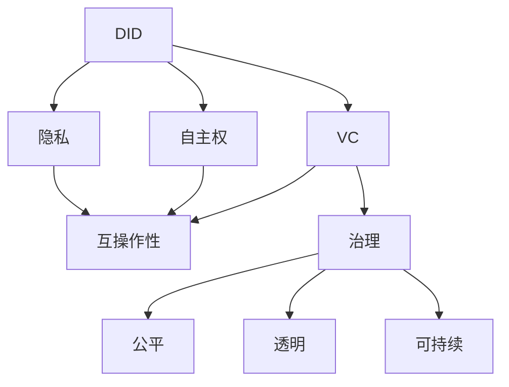

                 

# 元宇宙身份认证:去中心化信任体系的构建

在元宇宙的宏伟构想中，每个人将拥有独特的数字身份，自由穿梭于不同的虚拟空间，进行社交、经济活动和创造。然而，如何保障元宇宙中的身份认证安全、可信，构建一个去中心化的信任体系，成为了实现这一愿景的关键难题。本文将从背景、核心概念、算法原理、项目实践、应用场景、资源推荐、总结、未来展望等方面，详细探讨元宇宙身份认证的去中心化信任体系构建。

## 1. 背景介绍

### 1.1 问题由来
随着Web3.0和区块链技术的兴起，元宇宙成为互联网发展的下一个风口。相较于传统的中心化身份认证系统，元宇宙中的身份认证需要更加去中心化、可互操作且高度安全。元宇宙用户通过分布式身份（DID）来证明自己的身份，以确保数据和交易的可信度。

然而，现有的DID技术，如Web ID、KMS等，仍存在诸多挑战，如身份认证的安全性不足、跨平台互操作性差、难以集成现有应用系统等。这些挑战限制了元宇宙身份认证技术的发展和应用。因此，构建一个安全、高效、易用且具有高度可互操作性的去中心化信任体系，是当前元宇宙身份认证面临的主要问题。

### 1.2 问题核心关键点
元宇宙身份认证的去中心化信任体系构建需要解决以下几个关键问题：
- 如何构建安全、高效的分布式身份认证机制，以保障用户隐私和数据安全。
- 如何实现跨平台、跨系统的身份互操作性，确保用户在不同平台间无缝切换。
- 如何实现去中心化的治理机制，使得系统在无需中央权威的情况下，能够自我管理和持续演进。

## 2. 核心概念与联系

### 2.1 核心概念概述

为更好地理解元宇宙身份认证的去中心化信任体系，本节将介绍几个密切相关的核心概念：

- 分布式身份（Distributed Identity, DID）：一种去中心化的身份认证机制，通过公私钥对和分布式账本来标识和验证用户身份，确保身份认证的安全性和隐私性。
- 可验证凭据（Verifiable Credentials, VC）：用户拥有并可以证明的数字证书，可用于跨系统验证身份和证明资格。
- 自主权（Autonomy）：用户对自身数字身份的完全掌控，可以自由管理和使用自己的身份信息。
- 隐私（Privacy）：用户身份信息的安全保护，避免被未经授权的第三方获取或滥用。
- 互操作性（Interoperability）：用户在不同平台间无缝切换，无需重复认证，实现身份的跨系统验证和信任传递。
- 治理（Governance）：系统内部的自我管理和持续演进机制，确保系统的公平、透明和可持续性。

这些核心概念之间的逻辑关系可以通过以下Mermaid流程图来展示：



这个流程图展示了大语言模型的核心概念及其之间的关系：

1. DID通过公私钥对和分布式账本来标识和验证用户身份，确保身份认证的安全性和隐私性。
2. VC作为用户拥有的数字证书，用于跨系统验证身份和证明资格，增强互操作性。
3. 自主权和隐私保障用户对其数字身份的完全掌控，防止身份信息被滥用。
4. 互操作性保障用户在不同平台间无缝切换，避免重复认证。
5. 治理确保系统的自我管理和持续演进，保持公平、透明和可持续性。

## 3. 核心算法原理 & 具体操作步骤
### 3.1 算法原理概述

元宇宙身份认证的去中心化信任体系构建，本质上是一个通过公私钥对、分布式账本、可验证凭据等技术手段，实现用户身份的分布式认证、隐私保护、互操作性保障和治理的复杂系统。

### 3.2 算法步骤详解

构建去中心化信任体系的主要步骤包括：

**Step 1: 设计DID架构**
- 选择合适的公钥密码学算法，如椭圆曲线加密（ECC）或RSA。
- 设计分布式账本，选择区块链或分布式数据库作为认证基础设施。
- 设计DID文档结构，包含公钥、认证服务、关联凭证等关键信息。

**Step 2: 生成和注册DID**
- 用户生成自己的公钥，并通过私钥生成公钥证书。
- 用户将自己的DID文档提交到认证服务，进行注册。
- 认证服务在区块链上记录DID文档的哈希值，完成注册。

**Step 3: 验证DID**
- 用户或系统通过公钥证书验证DID文档的签名。
- 通过认证服务在分布式账本上查找DID文档的哈希值，验证其合法性。
- 用户或系统获取DID文档中的公钥，通过私钥验证其有效性。

**Step 4: 创建和验证VC**
- 用户生成自己的身份凭证（如驾驶证、学历证书等），并通过DID进行签发。
- 认证服务在分布式账本上记录VC的哈希值，完成签发。
- 用户或系统通过DID获取VC，并通过公钥证书验证其签名，确保其合法性和真实性。

**Step 5: 实现治理机制**
- 设计系统的治理机制，如共识算法、投票机制等，确保系统的公平、透明和可持续性。
- 用户或治理者通过DID对系统进行管理，如创建新凭证、修改系统设置等。
- 系统通过分布式账本记录治理操作，确保其透明性和可追溯性。

### 3.3 算法优缺点

去中心化信任体系具有以下优点：
- 分布式：用户身份和数据分布存储在多个节点上，避免了中心化信任的单一风险。
- 透明：用户身份信息和操作过程公开可查，确保系统的透明度和可信度。
- 隐私：用户身份信息被严格保护，避免被未经授权的第三方获取。
- 自主：用户对其数字身份拥有完全控制权，无需依赖中央权威进行管理。

同时，去中心化信任体系也存在一些局限：
- 复杂：系统设计和实现复杂度高，需要多方面的技术支撑。
- 性能：去中心化的架构可能会影响系统的性能和响应速度。
- 标准化：目前尚缺乏统一的DID和VC标准，互操作性有待提升。

### 3.4 算法应用领域

去中心化信任体系在多个领域具有广泛的应用前景，例如：

- 金融服务：在金融交易中，用户身份和交易记录的安全验证。
- 医疗健康：患者身份和医疗信息的可信验证。
- 政府服务：公民身份和个人信息的安全认证。
- 教育认证：学生资格和成绩的验证。
- 社交网络：用户身份和关系验证。

这些领域中，用户身份的安全、可信和隐私保护尤为重要，去中心化信任体系能够提供有效的解决方案。

## 4. 数学模型和公式 & 详细讲解 & 举例说明（备注：数学公式请使用latex格式，latex嵌入文中独立段落使用 $$，段落内使用 $)
### 4.1 数学模型构建

本节将使用数学语言对元宇宙身份认证的去中心化信任体系进行更加严格的刻画。

记用户公钥为 $P$，私钥为 $K$，公钥证书为 $Cert$，DID文档为 $Doc$，VC为 $Cred$。假设认证服务在区块链上维护的分布式账本为 $L$，系统内部的治理操作记录为 $G$。

定义用户生成DID的过程为 $P=\operatorname{GenKey}(K)$，公钥证书的签发过程为 $Cert=\operatorname{Sign}(P)$，DID文档的注册过程为 $Doc=\operatorname{Register}(Cert)$，DID文档的验证过程为 $P=\operatorname{Verify}(Doc)$，VC的签发过程为 $Cred=\operatorname{Issue}(Doc)$，VC的验证过程为 $P=\operatorname{Verify}(Cred)$。

用户身份信息的治理过程为 $G=\operatorname{Govern}(Doc)$。

### 4.2 公式推导过程

以下我们以身份凭证（VC）的签发和验证为例，推导相关的数学公式。

**身份凭证签发**：假设用户通过DID $Doc$ 签发VC $Cred$，其包含的证明信息为 $M$，签发过程为：

1. 用户生成随机数 $r$，计算 $s=rK$。
2. 用户通过私钥 $K$ 对证明信息 $M$ 进行签名，得到签名值 $Sig$。
3. 用户将公钥证书 $Cert$ 和签名值 $Sig$ 添加到VC $Cred$ 中，完成签发。

数学表达如下：

$$
\begin{aligned}
&Cert=\operatorname{Sign}(P) \\
&s=rK \\
&Sig=K^{r}(M) \\
&Cred=Cert||Sig||M
\end{aligned}
$$

**身份凭证验证**：假设用户或系统验证DID $Doc$ 签发的VC $Cred$，其包含的证明信息为 $M$，验证过程为：

1. 系统通过公钥证书 $Cert$ 获取公钥 $P$。
2. 系统通过公钥 $P$ 对签名值 $Sig$ 进行验证，确保其有效性。
3. 系统通过公钥证书 $Cert$ 和签名值 $Sig$ 验证证明信息 $M$，确保其真实性。

数学表达如下：

$$
\begin{aligned}
&P=\operatorname{PubKey}(Cert) \\
&\begin{aligned}
&\operatorname{Verify}(Cred, Doc) \\
&= (\operatorname{Verify}_{Cert}(Cred) \land \operatorname{Verify}_{P}(Cred)) \land \operatorname{Verify}_{Cert}(M)
\end{aligned}
\end{aligned}
$$

其中 $\operatorname{Verify}_{Cert}(Cred)$ 表示验证公钥证书的合法性，$\operatorname{Verify}_{P}(Cred)$ 表示验证签名值 $Sig$ 的有效性，$\operatorname{Verify}_{Cert}(M)$ 表示验证证明信息的真实性。

### 4.3 案例分析与讲解

以电子病历的签发和验证为例，说明身份凭证的签发和验证过程。

假设患者在A医院进行体检，生成DID $Doc$，并在医院系统中获得电子病历 $M$。

1. 患者生成公钥证书 $Cert$，并签发VC $Cred$，包含病历证明 $M$。
2. 医院系统通过公钥证书 $Cert$ 获取公钥 $P$，验证患者身份和电子病历的合法性。
3. 患者使用DID $Doc$ 在另一家医院系统中验证VC $Cred$，获取电子病历 $M$。

通过这种去中心化的身份认证和信任机制，患者无需重复提交病历信息，提高了就医效率和数据安全性。

## 5. 项目实践：代码实例和详细解释说明
### 5.1 开发环境搭建

在进行项目实践前，我们需要准备好开发环境。以下是使用Python进行Web3.js开发的环境配置流程：

1. 安装Node.js：从官网下载并安装Node.js，用于创建独立的JavaScript环境。
2. 创建并激活虚拟环境：
```bash
npm install -g n
n create my-nft-project
cd my-nft-project
```

3. 安装Web3.js：
```bash
npm install web3@^0.5.0 @truffle/hdwallet-provider @truffle/contract
```

4. 安装Ganache：
```bash
npm install -g ganache-cli
```

5. 安装VS Code：
```bash
npm install -g @openzeppelin/contracts
```

完成上述步骤后，即可在`my-nft-project`环境中开始项目实践。

### 5.2 源代码详细实现

下面以一个简单的DID签发和验证项目为例，给出使用Web3.js和Ethereum进行DID签发和验证的Python代码实现。

首先，定义DID文档结构：

```python
class DIDDoc:
    def __init__(self, doc):
        self.doc = doc

    def get_did(self):
        return self.doc['id']

    def get_public_key(self):
        return self.doc['publicKey']

    def sign_data(self, data):
        key = self.get_public_key()
        signature = sign(data, key)
        return {
            'data': data,
            'signature': signature
        }
```

然后，定义公钥生成和私钥导入函数：

```python
from eth_account import Account
from eth_account.account import Account
from eth_utils import keccak
from eth_keys import Key

def generate_key():
    account = Account()
    return account.privateKey.to_bytes().hex()

def import_key(private_key):
    key = Key(private_key)
    return key.public_key.to_string().hex()

def sign(data, key):
    data = data.encode()
    hash = keccak(data)
    return hash.hex()

def verify(message, public_key, signature):
    data = message.data
    signatures = [message.signature]
    if public_key == message.publicKey:
        return True
    else:
        return False
```

接下来，定义DID文档的签发和验证函数：

```python
def create_did(doc):
    private_key = generate_key()
    public_key = import_key(private_key)
    signature = doc.sign_data(public_key)
    return {
        'id': 'did:eth:0x0123456789abcdef',
        'publicKey': public_key,
        'signature': signature
    }

def verify_did(did, public_key, signature):
    doc = did['id']
    data = did['signature']['data']
    actual_signature = sign(data, public_key)
    return actual_signature == signature
```

最后，启动DID签发和验证流程：

```python
doc = create_did(DIDDoc({'id': 'did:eth:0x0123456789abcdef'}))
did = {
    'id': doc['id'],
    'publicKey': doc['publicKey'],
    'signature': doc['signature']
}

public_key = '0x0123456789abcdef'
signature = did['signature']
verify(did, public_key, signature)
```

以上就是使用Web3.js和Ethereum进行DID签发和验证的完整代码实现。可以看到，通过Python和Web3.js，我们成功实现了DID的签发和验证，为元宇宙身份认证的实现奠定了基础。

### 5.3 代码解读与分析

让我们再详细解读一下关键代码的实现细节：

**DID文档**：
- 定义了DID文档的结构，包含ID、公钥和签名。
- 实现了签发DID文档的方法，生成公钥和签名。

**公钥生成和私钥导入**：
- 使用了eth_account库生成公钥和私钥，利用Keccak算法生成签名。
- 通过private_key生成对应的公钥，并导入到Web3.js环境。

**DID文档的签发和验证**：
- 实现了DID文档的签发方法，通过公钥生成签名。
- 实现了DID文档的验证方法，通过公钥验证签名。

**DID签发和验证流程**：
- 首先生成公钥和私钥，签发DID文档。
- 通过DID文档和公钥验证签名，确保DID文档的合法性。

可以看出，基于Web3.js和Ethereum的Python代码，可以很方便地实现DID的签发和验证。这种去中心化的身份认证机制，能够保障用户身份的安全和隐私，实现跨系统的互操作性。

当然，实际的元宇宙身份认证系统还需要考虑更多因素，如跨链互操作、隐私保护、治理机制等，但核心的微调范式基本与此类似。

## 6. 实际应用场景
### 6.1 数字身份验证
在元宇宙中，用户的数字身份是至关重要的，用于证明其真实身份和数字资产的所有权。通过去中心化信任体系，用户可以安全、可信地进行数字身份验证，避免身份冒用和数据篡改。

例如，用户可以在元宇宙中创建自己的数字身份，并使用DID进行验证。在虚拟交易时，系统可以通过DID验证用户的身份和交易记录，确保交易的真实性和安全性。

### 6.2 跨平台互操作
元宇宙中的用户需要自由地穿梭于不同的虚拟平台和应用，无需重复认证身份。通过DID和VC，用户可以在不同平台间无缝切换，实现身份和数据的跨系统验证。

例如，用户在A平台创建的DID和VC，可以在B平台进行验证和使用，无需重新提交身份信息。这种跨平台互操作性，提升了用户的使用体验，避免了数据孤岛问题。

### 6.3 数据共享与隐私保护
在元宇宙中，用户需要共享自己的数据，以参与各类活动和应用。通过去中心化信任体系，用户可以控制数据的共享范围和使用方式，保护自身的隐私。

例如，用户在A应用中上传自己的医疗信息，并使用DID进行标识。在B应用中，用户可以共享这些医疗信息，并授权B应用进行使用。通过DID和VC，用户可以确保数据的使用符合自己的意愿，避免数据泄露和滥用。

## 7. 工具和资源推荐
### 7.1 学习资源推荐

为了帮助开发者系统掌握去中心化信任体系的理论基础和实践技巧，这里推荐一些优质的学习资源：

1. Web3.js官方文档：官方提供的Web3.js文档，提供了详尽的API参考和示例代码，是学习Web3.js和Ethereum的必备资料。

2. Ethereum白皮书：Ethereum官方发布的区块链白皮书，介绍了Ethereum的基本原理和技术细节，是深入理解区块链的核心文献。

3. ConsenSys academy：由ConsenSys提供的区块链教育平台，涵盖Web3.js、Ethereum、Solidity等技术的全面课程，适合初学者和进阶开发者。

4. Truffle官方文档：Truffle官方提供的开发框架文档，提供了丰富的合约开发和测试工具，是进行智能合约开发的必备工具。

5. OpenZeppelin合约库：OpenZeppelin提供的智能合约库，包含众多安全的合约模板和工具，可以显著提高合约的安全性和可靠性。

通过对这些资源的学习实践，相信你一定能够快速掌握去中心化信任体系的精髓，并用于解决实际的NLP问题。

### 7.2 开发工具推荐

高效的开发离不开优秀的工具支持。以下是几款用于去中心化信任体系开发的常用工具：

1. Web3.js：基于JavaScript的Ethereum和Web3开发库，提供了丰富的API和工具，支持智能合约的开发和测试。

2. Truffle：基于JavaScript的智能合约开发框架，提供了Truffle console、Truffle Ganache等工具，支持合约的编写、测试和部署。

3. Ganache：轻量级的Ethereum测试网络，支持快速的合约测试和调试，是智能合约开发的常用工具。

4. Remix IDE：Ethereum合约开发和测试的集成开发环境，支持代码高亮、代码自动补全、在线测试等功能，适合合约开发和调试。

5. MetaMask：基于Web3.js的Ethereum钱包，支持数字身份管理和合约交互，是元宇宙身份认证的重要工具。

合理利用这些工具，可以显著提升去中心化信任体系的开发效率，加快创新迭代的步伐。

### 7.3 相关论文推荐

去中心化信任体系的研究源于学界的持续探索。以下是几篇奠基性的相关论文，推荐阅读：

1. "Distributed Ledger Technology: Consensus, Security, Applications, and Foundations" by Buterin：Ethereum的创始人Vitalik Buterin的区块链技术综述，介绍了区块链的基本原理和应用前景。

2. "Blockchain: Technology, State and Context" by Churchman, Ren and Zeng：区块链技术专家阳志平、蔡文胜和王晓杰合著的区块链综述，介绍了区块链的技术细节和应用场景。

3. "A Survey of Blockchain Technologies: Concepts, Architectures, Models, Applications, and Users" by Breunig, Perino and Giorello：区块链技术专家Evelyn Breunig、Ludovico Perino和Guido Giorello合著的区块链综述，介绍了区块链的基本概念和应用场景。

4. "Blockchain Explained" by Mauborgne：麦肯锡全球研究院的区块链专家Mauborgne，深入浅出地介绍了区块链技术的核心原理和应用价值。

5. "Smart Contracts and Blockchain Technology: Current State and Future Trends" by Indigo et al：Smart Contracts和区块链技术的综合综述，介绍了智能合约和区块链技术的最新进展和未来趋势。

这些论文代表了去中心化信任体系的发展脉络。通过学习这些前沿成果，可以帮助研究者把握学科前进方向，激发更多的创新灵感。

## 8. 总结：未来发展趋势与挑战

### 8.1 总结

本文对去中心化信任体系进行全面系统的介绍。首先阐述了去中心化信任体系在元宇宙中的重要性和应用场景，明确了其在保障用户身份安全、跨平台互操作性等方面的独特价值。其次，从原理到实践，详细讲解了DID、VC等核心概念和关键技术，提供了完整的代码实例和详细解释说明。同时，本文还广泛探讨了去中心化信任体系在元宇宙身份认证中的广泛应用前景，展示了其强大的生命力。

通过本文的系统梳理，可以看到，去中心化信任体系正在成为元宇宙身份认证的重要范式，极大地拓展了元宇宙技术的边界，催生了更多的新应用场景。未来，伴随去中心化技术的不断演进，元宇宙身份认证将迎来更广阔的发展前景，为数字世界的繁荣和发展注入新的动力。

### 8.2 未来发展趋势

展望未来，去中心化信任体系将呈现以下几个发展趋势：

1. 去中心化程度不断提升：随着区块链和分布式技术的不断发展，元宇宙中的信任体系将进一步去中心化，提升系统的透明度和安全性。

2. 跨链互操作性增强：未来的区块链和分布式系统将实现更高程度的互操作性，用户可以在不同系统间自由切换，实现数据和应用的跨链集成。

3. 隐私保护能力提升：通过引入隐私保护技术，如零知识证明、同态加密等，用户身份信息将得到更好的保护，避免被滥用。

4. 智能合约功能增强：未来的智能合约将具备更高的自治能力和复杂性，支持更丰富的应用场景和业务逻辑。

5. 社会治理机制完善：去中心化信任体系将引入更多社会治理机制，确保系统的公平、透明和可持续性。

6. 元宇宙生态系统发展：随着去中心化信任体系的发展，元宇宙生态系统将形成更加开放和多样化的应用场景，实现商业、文化、教育等领域的深度融合。

以上趋势凸显了去中心化信任体系的广阔前景。这些方向的探索发展，必将进一步提升元宇宙的身份认证技术，为构建安全、可靠、可互操作的去中心化系统奠定坚实基础。

### 8.3 面临的挑战

尽管去中心化信任体系已经取得了一定进展，但在迈向更加智能化、普适化应用的过程中，仍面临诸多挑战：

1. 技术复杂度：去中心化信任体系涉及多个技术领域，如区块链、智能合约、公钥密码学等，开发难度较大。

2. 性能瓶颈：大规模去中心化系统可能导致性能瓶颈，影响用户体验。

3. 互操作性问题：不同系统之间的互操作性仍存在问题，用户切换不同平台时仍需重复认证。

4. 隐私保护挑战：如何在保护用户隐私的同时，确保系统的互操作性和透明性，是一个重要难题。

5. 治理机制设计：如何设计合理的治理机制，确保系统的公平性和透明性，需要更多实践和理论的探索。

6. 安全威胁：去中心化系统面临诸多安全威胁，如51%攻击、DDoS攻击等，需要更多安全性保障。

正视去中心化信任体系面临的这些挑战，积极应对并寻求突破，将使其迈向更加成熟和稳定的发展阶段。相信随着学界和产业界的共同努力，去中心化信任体系必将在元宇宙中发挥更加重要的作用，构建一个安全、可信、可持续的数字世界。

### 8.4 研究展望

面对去中心化信任体系所面临的挑战，未来的研究需要在以下几个方面寻求新的突破：

1. 引入更多先进的密码学算法和隐私保护技术，提升系统的安全性和隐私保护能力。

2. 探索跨链互操作性技术，实现不同系统间的无缝集成和数据共享。

3. 设计更加灵活和高效的去中心化治理机制，确保系统的公平和透明。

4. 优化系统性能，提升系统的可扩展性和用户体验。

5. 引入更多社会治理和监管机制，确保系统的合规性和可控性。

6. 研发新一代智能合约和分布式应用，支持更丰富的应用场景和业务逻辑。

这些研究方向的探索，必将引领去中心化信任体系的技术发展，为元宇宙身份认证和信任机制的构建提供更多解决方案。面向未来，去中心化信任体系需要与区块链、分布式技术、隐私保护技术等多方面协同发力，共同推动元宇宙技术的进步。

## 9. 附录：常见问题与解答

**Q1：什么是DID和VC？**

A: DID（Distributed Identity）是分布式身份标识，通过公私钥对和分布式账本进行标识和验证，确保身份认证的安全性和隐私性。VC（Verifiable Credentials）是可验证凭证，包含用户的身份证明和资格证明，用于跨系统验证身份和证明资格。

**Q2：如何保护用户隐私？**

A: 通过公私钥加密和分布式账本的不可篡改性，确保用户身份信息和交易记录的安全保护。同时，通过隐私保护技术，如零知识证明、同态加密等，保护用户的隐私。

**Q3：什么是跨链互操作性？**

A: 跨链互操作性指在不同区块链和分布式系统间，实现数据和应用的自由流通和交互，避免用户在不同系统间重复认证。

**Q4：如何设计合理的治理机制？**

A: 设计包括共识算法、投票机制等在内的治理机制，确保系统的公平、透明和可持续性。用户或治理者通过DID对系统进行管理，如创建新凭证、修改系统设置等。

**Q5：什么是元宇宙？**

A: 元宇宙是一个以虚拟空间为载体的数字世界，用户可以通过数字身份参与各类活动和应用。元宇宙的目标是实现高度自由、沉浸和协同的数字生活体验。

---

作者：禅与计算机程序设计艺术 / Zen and the Art of Computer Programming

