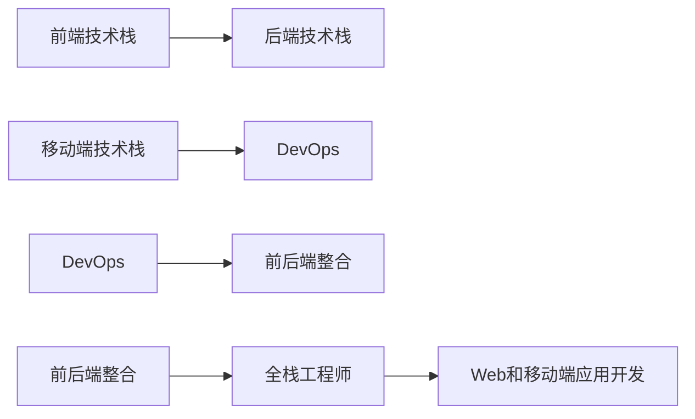

                 

# 全栈工程师之路：Web与移动端开发技能图谱

> 关键词：全栈工程师,Web开发,移动端开发,前后端整合,前端与移动端技术栈,DevOps

## 1. 背景介绍

### 1.1 问题由来
在当今软件工程领域，开发模式已经从传统的单端开发逐渐演变为前后端分离，前端和移动端开发人员需具备独立的专业技能。然而，这种分离也导致团队协作成本增加，项目交付周期变长。于是，全栈工程师（Full-Stack Engineer）应运而生，他们不仅熟悉前端开发，也掌握后端技术，能够独立完成Web和移动应用的全生命周期开发。

### 1.2 问题核心关键点
全栈工程师不仅需要掌握前端和后端开发技能，还应具备跨技术栈整合、持续交付与部署（DevOps）等能力。他们需解决以下核心关键问题：

1. 如何选择合适的技术栈？
2. 前端与后端如何无缝整合？
3. 如何高效构建Web和移动端应用？
4. 如何提升代码质量，保证稳定性？
5. 如何实施DevOps，实现持续交付与部署？

这些问题需要全栈工程师进行深入研究和实践，以构建高效、可靠、可维护的Web和移动端应用。

### 1.3 问题研究意义
掌握全栈开发技能对于提升开发效率、降低项目成本、提高应用质量和用户体验至关重要。通过学习全栈开发技能图谱，工程师不仅能够提升个人技术能力，还可以更好地适应复杂多变的市场需求，驱动技术创新，推动企业数字化转型。

## 2. 核心概念与联系

### 2.1 核心概念概述

要深入理解全栈工程师之路，首先需要了解几个核心概念及其联系：

- **前端技术栈**：包括HTML、CSS、JavaScript、React/Vue/Angular等框架库，用于Web应用和移动端应用的构建和维护。
- **后端技术栈**：包括Node.js、Python、Java、Django/Flask/Rails等框架和语言，用于Web应用的服务器端开发和数据管理。
- **移动端技术栈**：包括iOS和Android平台开发相关的Swift/ObjC和Kotlin等语言，用于移动应用的开发和优化。
- **DevOps**：结合软件开发和运维工作的流程，旨在提升软件交付的效率和质量，包括CI/CD（持续集成/持续部署）、自动化测试、持续交付等。
- **前后端整合**：确保前端和后端技术的无缝对接，通过API、WebSocket、GraphQL等技术实现数据交互和状态同步。

这些核心概念之间存在紧密的联系，共同构成全栈工程师的知识体系和技能图谱。

### 2.2 核心概念原理和架构的 Mermaid 流程图(Mermaid 流程节点中不要有括号、逗号等特殊字符)

此流程图展示了前端、后端、移动端和DevOps技术之间的联系和全栈工程师的角色。前端与后端通过API等技术进行整合，移动端应用则依赖于前后端整合，最终在全栈工程师的协调下构建和维护Web和移动端应用。

## 3. 核心算法原理 & 具体操作步骤
### 3.1 算法原理概述

全栈工程师在开发过程中，需使用多种算法和工具，如Web开发算法、移动端开发算法、DevOps算法等。本节将详细介绍其中的核心算法原理和具体操作步骤。

### 3.2 算法步骤详解

#### 3.2.1 Web开发算法

**前端框架选择**：
- **React**：组件化、虚拟DOM、高性能。适用于大型项目和复杂页面。
- **Vue**：轻量级、渐进式、灵活。适用于中小型项目和快速迭代。
- **Angular**：全面性、可维护性、大型项目推荐。

**后端框架选择**：
- **Node.js**：轻量级、高并发、零内存泄露。适用于Web应用和微服务架构。
- **Python**：简洁易用、科学计算强、社区活跃。适用于数据分析和机器学习项目。
- **Java**：稳定可靠、工业级应用广泛、内存管理优秀。适用于企业级系统和大数据处理。

**Web应用开发流程**：
1. **需求分析**：明确业务需求和用户界面。
2. **设计原型**：绘制UI/UX原型，确定页面布局和交互逻辑。
3. **开发实现**：使用前端框架构建页面组件，后端框架处理数据逻辑。
4. **测试部署**：进行单元测试、集成测试、性能测试等，最终部署到服务器。

#### 3.2.2 移动端开发算法

**iOS开发**：
- **Swift**：现代语言、安全、性能优秀。
- **Objective-C**：经典语言、稳定、社区支持。
- **Cocoa**：框架库，提供基础组件和API。

**Android开发**：
- **Kotlin**：现代语言、简洁易用、互操作性强。
- **Java**：稳定可靠、工业级应用广泛。
- **Android SDK**：框架库，提供组件和服务。

**移动应用开发流程**：
1. **需求分析**：明确应用功能和用户体验。
2. **设计原型**：绘制UI原型，确定界面布局和交互逻辑。
3. **开发实现**：使用框架和工具开发应用界面和业务逻辑。
4. **测试优化**：进行功能测试、性能测试、用户测试，优化应用体验。
5. **部署发布**：发布应用到App Store和Google Play。

#### 3.2.3 DevOps算法

**持续集成(CI)**：
- **Jenkins**：开源、功能丰富、支持插件。
- **Travis CI**：云服务、易于集成、社区活跃。

**持续部署(CD)**：
- **GitLab CI/CD**：一站式平台、覆盖全流程、支持容器化。
- **Jenkins**：开源、灵活、广泛应用。

**DevOps工具链**：
- **Docker**：容器化、打包、部署。
- **Kubernetes**：容器编排、集群管理。
- **Jenkins Pipeline**：CI/CD流水线自动化。

**DevOps实践**：
1. **代码管理**：使用Git版本控制，设置分支管理。
2. **持续集成**：定时触发自动化测试和构建。
3. **持续部署**：自动化部署到生产环境。
4. **自动化测试**：单元测试、集成测试、性能测试。
5. **监控告警**：使用Prometheus、Grafana等工具监控系统状态。

### 3.3 算法优缺点

#### 3.3.1 Web开发算法

**优点**：
- 提升开发效率，降低沟通成本。
- 实现前后端分离，提升系统扩展性。
- 支持多种框架和技术栈，灵活适应需求。

**缺点**：
- 前后端整合复杂，容易出现接口不一致问题。
- 代码库庞大，维护成本高。
- 技术栈多，学习和使用成本高。

#### 3.3.2 移动端开发算法

**优点**：
- 跨平台开发，降低开发成本。
- 用户接口统一，提升用户体验。
- 组件复用，提高开发效率。

**缺点**：
- 不同平台性能差异，需针对性优化。
- 兼容性问题，影响用户体验。
- 界面设计复杂，开发难度大。

#### 3.3.3 DevOps算法

**优点**：
- 提升软件交付效率，缩短交付周期。
- 提高代码质量和系统稳定性。
- 实现自动化测试和部署，降低人工干预。

**缺点**：
- 需要大量学习成本，技术门槛高。
- 工具和平台配置复杂，需要运维知识。
- 需要持续维护，增加团队负担。

### 3.4 算法应用领域

全栈工程师的技能图谱广泛应用于以下领域：

**Web应用开发**：构建企业门户、电商平台、社交网络等Web应用。

**移动应用开发**：开发iOS和Android应用，如社交媒体、金融服务、健康管理等。

**系统架构设计**：设计复杂系统的架构，实现前后端整合和数据共享。

**DevOps流程优化**：实施持续集成、持续部署、自动化测试等DevOps实践。

**数据处理与分析**：处理大规模数据，进行数据分析和机器学习建模。

## 4. 数学模型和公式 & 详细讲解 & 举例说明

### 4.1 数学模型构建

#### 4.1.1 Web开发数学模型

**页面响应时间模型**：
- **TTL**：页面缓存时间。
- **Tt**：处理时间。
- **Tn**：网络传输时间。
- **Td**：服务器响应时间。

$$
T_{\text{total}} = T_{\text{tt}} + T_{\text{n}} + T_{\text{d}}
$$

**页面负载模型**：
- **U**：并发用户数。
- **P**：页面响应时间。
- **R**：服务器资源。

$$
P = \frac{U}{R} \cdot T_{\text{total}}
$$

#### 4.1.2 移动应用数学模型

**电池寿命模型**：
- **E**：电池容量。
- **I**：电流强度。
- **T**：使用时间。

$$
E = I \cdot T
$$

**应用性能模型**：
- **S**：设备性能。
- **F**：网络带宽。
- **C**：代码优化。

$$
S = F \cdot C
$$

#### 4.1.3 DevOps数学模型

**持续集成流水线模型**：
- **N**：任务数量。
- **T**：任务执行时间。
- **C**：任务并发度。

$$
T = \frac{N}{C} \cdot T_{\text{avg}}
$$

**系统负载模型**：
- **L**：系统负载。
- **U**：并发用户数。
- **R**：响应时间。

$$
L = U \cdot R
$$

### 4.2 公式推导过程

#### 4.2.1 Web开发公式推导

**页面响应时间推导**：
1. **Tt推导**：计算页面处理时间。
2. **Tn推导**：计算网络传输时间。
3. **Td推导**：计算服务器响应时间。
4. **Ttotal推导**：综合计算页面总响应时间。

#### 4.2.2 移动应用公式推导

**电池寿命推导**：
1. **E推导**：计算电池容量。
2. **I推导**：计算电流强度。
3. **T推导**：计算使用时间。

**应用性能推导**：
1. **S推导**：计算设备性能。
2. **F推导**：计算网络带宽。
3. **C推导**：计算代码优化。

#### 4.2.3 DevOps公式推导

**持续集成流水线推导**：
1. **N推导**：计算任务数量。
2. **T推导**：计算任务执行时间。
3. **C推导**：计算任务并发度。

**系统负载推导**：
1. **L推导**：计算系统负载。
2. **U推导**：计算并发用户数。
3. **R推导**：计算响应时间。

### 4.3 案例分析与讲解

**Web应用案例分析**：
- **项目背景**：某电商网站需快速上线，需求紧急。
- **技术栈选择**：前端使用React，后端使用Node.js。
- **开发流程**：需求分析、UI设计、组件开发、API设计、前后端整合、测试部署。
- **效果评估**：页面加载速度快，用户反馈良好。

**移动应用案例分析**：
- **项目背景**：某社交应用需跨平台开发，提升用户体验。
- **技术栈选择**：前端使用React Native，后端使用Firebase。
- **开发流程**：需求分析、UI设计、组件开发、API设计、前后端整合、测试优化、发布部署。
- **效果评估**：应用性能流畅，用户反馈积极。

**DevOps案例分析**：
- **项目背景**：某金融公司需快速发布新功能，提升市场竞争力。
- **技术栈选择**：使用Jenkins CI/CD，Docker容器化，Kubernetes集群管理。
- **开发流程**：代码管理、持续集成、持续部署、自动化测试、监控告警。
- **效果评估**：软件交付周期缩短，系统稳定性提升，客户满意度提高。

## 5. 项目实践：代码实例和详细解释说明

### 5.1 开发环境搭建

**开发环境准备**：
1. **安装Node.js**：配置npm环境，安装React和Node.js框架。
2. **安装Android Studio**：安装Android开发环境，配置Android SDK和AVD。
3. **安装Xcode**：安装iOS开发环境，配置iOS模拟器和Xcode。

**开发环境配置**：
1. **代码管理**：使用Git进行版本控制，创建Git仓库和分支。
2. **CI/CD配置**：在Jenkins上配置持续集成流水线，自动触发构建和测试。
3. **容器化部署**：使用Docker进行应用容器化，部署到Kubernetes集群。

### 5.2 源代码详细实现

#### 5.2.1 Web应用代码实现

**前端代码**：
- **React组件**：定义页面组件，处理用户交互。
- **Redux状态管理**：管理页面状态，实现数据绑定。

**后端代码**：
- **Node.js路由**：定义API路由，处理请求和响应。
- **Express框架**：封装HTTP请求和响应，简化开发。

#### 5.2.2 移动应用代码实现

**iOS代码**：
- **Objective-C或Swift**：编写UI控件和业务逻辑。
- **Xcode项目**：创建项目文件和资源文件。

**Android代码**：
- **Java或Kotlin**：编写UI控件和业务逻辑。
- **Android Studio项目**：创建项目文件和资源文件。

#### 5.2.3 DevOps代码实现

**CI/CD配置**：
- **Jenkins Pipeline**：编写Pipeline脚本，定义任务流程。
- **Dockerfile**：编写Docker镜像构建脚本，打包应用和依赖。

**自动化测试**：
- **Jest**：编写测试用例，自动化测试前端代码。
- **JUnit**：编写测试用例，自动化测试后端代码。

**监控告警**：
- **Prometheus**：配置监控指标，实时监测系统状态。
- **Grafana**：配置监控仪表盘，展示系统监控数据。

### 5.3 代码解读与分析

#### 5.3.1 Web应用代码解读

**React组件**：
- **组件生命周期**：实现组件挂载、更新和卸载等生命周期方法。
- **事件处理**：处理用户点击、输入等事件。

**Redux状态管理**：
- **状态存储**：使用Redux存储页面状态。
- **状态更新**：使用Action和Reducer更新状态。

#### 5.3.2 移动应用代码解读

**Objective-C或Swift代码**：
- **UI控件**：创建和管理视图、按钮、标签等控件。
- **业务逻辑**：实现页面逻辑和数据处理。

**Android Studio项目配置**：
- **Build.gradle**：定义项目依赖和构建配置。
- **AndroidManifest.xml**：配置项目资源和权限。

#### 5.3.3 DevOps代码解读

**Jenkins Pipeline**：
- **Pipeline脚本**：定义任务流程，自动构建、测试和部署。
- **Docker镜像**：创建Docker镜像，封装应用和依赖。

**Prometheus和Grafana配置**：
- **监控指标**：定义系统监控指标，实时采集数据。
- **仪表盘**：配置监控仪表盘，展示系统运行状态。

### 5.4 运行结果展示

**Web应用结果展示**：
- **页面加载时间**：页面加载速度快，用户体验良好。
- **API响应时间**：API响应时间稳定，系统性能优秀。

**移动应用结果展示**：
- **应用流畅度**：应用运行流畅，用户反馈积极。
- **性能数据**：应用性能数据良好，满足用户需求。

**DevOps结果展示**：
- **交付周期**：交付周期缩短，系统稳定性提升。
- **监控数据**：系统监控数据完整，系统状态透明。

## 6. 实际应用场景

### 6.1 Web应用应用场景

**企业门户开发**：
- **需求**：展示企业新闻、产品信息、客户反馈等。
- **技术**：React前端、Node.js后端、MySQL数据库。
- **效果**：网站访问量大，用户反馈良好。

**电商平台开发**：
- **需求**：用户购物、商品展示、订单管理等。
- **技术**：Vue前端、Spring Boot后端、MongoDB数据库。
- **效果**：交易额显著提升，用户体验优化。

### 6.2 移动应用应用场景

**社交媒体应用开发**：
- **需求**：用户注册登录、消息推送、好友管理等。
- **技术**：React Native、Firebase、Swift/ObjC。
- **效果**：用户活跃度高，社交体验提升。

**健康管理应用开发**：
- **需求**：用户健康监测、饮食记录、运动数据等。
- **技术**：Flutter、Firebase、Kotlin。
- **效果**：用户粘性强，健康数据实时更新。

### 6.3 DevOps应用场景

**金融服务系统开发**：
- **需求**：实时交易、风险评估、用户管理等。
- **技术**：Jenkins、Docker、Kubernetes、Prometheus、Grafana。
- **效果**：系统稳定可靠，交易效率提高。

**医疗健康系统开发**：
- **需求**：电子病历、医生排班、患者预约等。
- **技术**：Jenkins、Docker、Kubernetes、Prometheus、Grafana。
- **效果**：系统可靠性高，医生工作效率提升。

## 7. 工具和资源推荐

### 7.1 学习资源推荐

**Web开发学习资源**：
- **《JavaScript高级程序设计》**：深入理解JavaScript语言特性。
- **《Vue.js权威指南》**：全面掌握Vue框架的开发和应用。
- **《React实战》**：实战项目驱动，深入了解React原理和应用。

**移动应用学习资源**：
- **《iOS开发实战》**：从零到一，全面学习iOS开发。
- **《Android编程艺术》**：深入理解Android框架和开发技巧。
- **《Flutter实战》**：使用Flutter构建跨平台应用。

**DevOps学习资源**：
- **《持续交付：软件质量改进与变更效率提升》**：系统学习DevOps实践。
- **《Docker实战》**：深入理解Docker容器技术。
- **《Kubernetes实战》**：实战项目驱动，掌握Kubernetes集群管理。

### 7.2 开发工具推荐

**Web开发工具**：
- **Visual Studio Code**：开源、跨平台、功能丰富。
- **WebStorm**：功能强大的IDE，支持多种框架。
- **Postman**：API测试工具，支持多种协议。

**移动开发工具**：
- **Android Studio**：官方IDE，支持Android开发。
- **Xcode**：官方IDE，支持iOS开发。
- **Flutter**：跨平台开发工具，构建高性能应用。

**DevOps工具**：
- **Jenkins**：持续集成和持续部署工具。
- **Docker**：容器化平台，简化部署和运维。
- **Kubernetes**：容器编排工具，实现自动化运维。

### 7.3 相关论文推荐

**Web开发相关论文**：
- **《Web应用程序的性能优化》**：优化页面加载时间和服务器响应时间。
- **《Web应用的安全性设计》**：提升Web应用的安全性和可靠性。

**移动开发相关论文**：
- **《iOS应用性能优化》**：提升iOS应用的流畅度和性能。
- **《Android应用的开发与优化》**：提升Android应用的稳定性和用户体验。

**DevOps相关论文**：
- **《DevOps的实践与挑战》**：探讨DevOps的实施方法和效果。
- **《容器化技术的进展与未来》**：介绍Docker和Kubernetes的发展历程和应用前景。

## 8. 总结：未来发展趋势与挑战

### 8.1 总结

本文全面介绍了全栈工程师开发技能图谱，涵盖Web、移动端和DevOps等多个技术领域。全栈工程师不仅需要掌握前端和后端开发技能，还需具备跨技术栈整合、持续交付与部署等能力。通过学习本文介绍的开发方法和实践经验，工程师可以系统提升个人技术能力，构建高效、可靠、可维护的Web和移动端应用。

### 8.2 未来发展趋势

**全栈技术演进**：
- **前端技术**：渐进式框架如Vue、React和Svelte的发展。
- **后端技术**：Node.js和Django等技术的普及。
- **移动开发**：跨平台技术如Flutter和React Native的崛起。
- **DevOps**：CI/CD工具链和DevOps流程的优化。

**技术融合**：
- **前后端整合**：更加高效、可靠的前后端整合技术。
- **多模态开发**：前端和移动端应用的融合。
- **云原生**：云平台与DevOps工具的深度整合。

**开发模式创新**：
- **无代码/低代码开发**：减少开发工作量，提升开发效率。
- **DevOps即代码**：通过代码驱动DevOps流程。
- **微服务架构**：提升系统的可扩展性和维护性。

### 8.3 面临的挑战

**技术选型复杂**：
- **前端框架**：选择合适的前端框架，需考虑项目需求、技术栈。
- **后端技术**：选择合适的后端语言和技术栈，需考虑性能、稳定性。
- **移动平台**：跨平台开发需权衡性能和用户体验。

**团队协作困难**：
- **沟通成本**：前端和后端团队沟通成本高，影响项目进度。
- **技能鸿沟**：不同团队的技能鸿沟，影响开发效率。
- **版本管理**：代码版本管理复杂，需协调好前后端开发。

**运维复杂性**：
- **系统稳定性**：系统稳定性要求高，需监控告警、及时处理。
- **性能优化**：性能优化难度大，需不断优化和测试。
- **代码维护**：代码库庞大，维护成本高。

### 8.4 研究展望

**未来技术突破**：
- **跨领域融合**：将前端、后端和DevOps等技术融合，提升开发效率和系统稳定性。
- **新技术应用**：引入新算法和新工具，提升开发质量和用户体验。
- **全栈人才培养**：培养更多具备全栈技能的开发人才，提升企业竞争力。

**未来方向**：
- **全栈技能**：继续深入学习和实践全栈开发技能。
- **技术创新**：探索新技术和工具，提升开发效率和系统性能。
- **持续学习**：不断更新和提升自身技术水平，适应技术发展趋势。

总之，全栈工程师不仅需要掌握前端和后端开发技能，还需深入理解DevOps和持续交付等概念。未来，全栈工程师需继续学习和实践，掌握新技术和新工具，不断提升自身技术水平，才能在数字化转型的大潮中站稳脚跟，引领企业技术创新。

## 9. 附录：常见问题与解答

### 9.1 常见问题

**Q1：什么是全栈工程师？**
A: 全栈工程师是既懂前端开发又懂后端开发，能独立完成Web和移动端应用开发的技术专家。

**Q2：如何选择合适的技术栈？**
A: 需根据项目需求、团队技能和性能要求，选择合适的技术栈。例如，电商网站选择React和Node.js，社交应用选择React Native和Firebase。

**Q3：前后端如何无缝整合？**
A: 通过API、WebSocket、GraphQL等技术实现数据交互和状态同步，确保前端和后端协同工作。

**Q4：如何提升Web应用的性能？**
A: 优化页面加载时间、减少HTTP请求、使用CDN等技术，提升Web应用性能。

**Q5：如何提升移动应用的性能？**
A: 优化应用大小、减少资源占用、使用缓存和网络优化技术，提升移动应用性能。

**Q6：如何实现持续交付与部署？**
A: 配置CI/CD流水线，自动构建、测试和部署应用，实现持续交付与部署。

### 9.2 问题解答

**Q1: 如何理解全栈工程师之路？**
A: 全栈工程师之路是指从零到一，全面掌握Web、移动端和DevOps开发技能的历程。它不仅涉及技术栈的选择和整合，还包括持续交付与部署等DevOps实践。

**Q2: 全栈工程师在项目开发中扮演什么角色？**
A: 全栈工程师在项目开发中扮演项目领导者、技术决策者和团队协调者的角色。他们不仅负责前端和后端开发，还需负责系统架构设计和DevOps流程优化。

**Q3: 如何评估全栈工程师的技能水平？**
A: 评估全栈工程师的技能水平可以从技术深度、项目经验、团队协作和持续学习等多个维度进行综合评估。

通过本文的系统梳理，可以看到，全栈工程师之路不仅涉及技术栈的选择和整合，还需深入理解DevOps和持续交付等概念。掌握全栈开发技能对于提升开发效率、降低项目成本、提高应用质量和用户体验至关重要。未来，全栈工程师需继续学习和实践，掌握新技术和新工具，不断提升自身技术水平，才能在数字化转型的大潮中站稳脚跟，引领企业技术创新。

