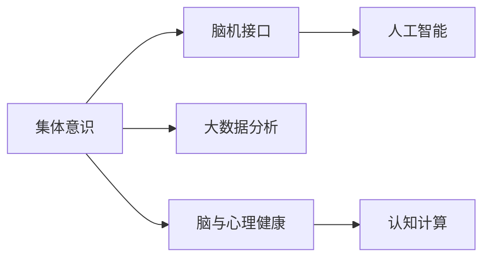
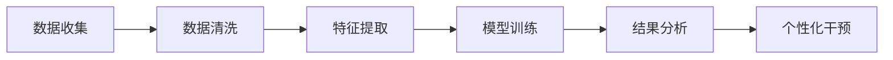

                 

## 1. 背景介绍

在科技高速发展的现代社会，人类面临越来越复杂的心理压力和脑功能挑战。从职业倦怠、抑郁症、焦虑症等心理问题，到大脑认知老化、神经退行性疾病等脑功能障碍，这些问题都迫切需要新的解决方案。然而，传统的医学和心理学方法往往难以全面应对这些挑战，需要结合最新的神经科学研究成果和技术手段，开发全新的医疗健康产品。

近年来，全球脑科学和心理健康领域的研究取得了显著进展。特别是随着人工智能和大数据分析技术的发展，科学家们开始探索如何利用集体意识的力量，通过大规模人群的协作和数据共享，来提升个体和整体的心理健康水平。本文将围绕这一主题，介绍一些基于人工智能和大数据分析的脑与心理健康技术，探讨其潜力和局限，并对未来的发展趋势进行展望。

## 2. 核心概念与联系

### 2.1 核心概念概述

- **集体意识(Mass Consciousness)**：指社会集体中成员之间共同的思想、情感和行为模式。
- **脑机接口(Brain-Computer Interface, BCI)**：通过电生理信号等接口手段，将人脑的活动转化为计算机可理解的信号。
- **人工智能(Artificial Intelligence, AI)**：模拟人类智能行为的机器学习系统。
- **大数据分析(Big Data Analytics)**：通过对大规模数据集进行计算和分析，挖掘出有价值的信息和洞察。
- **脑与心理健康(Brain and Mental Health)**：研究心理、大脑和健康之间的关系，探索改善心理健康和脑功能的科学方法。
- **认知计算(Cognitive Computing)**：利用认知心理学原理，开发智能决策和问题求解的系统。

这些核心概念之间的逻辑关系可以通过以下Mermaid流程图来展示：



这个流程图展示出集体意识与脑机接口、人工智能、大数据分析、脑与心理健康、认知计算之间的联系和互动：

1. **集体意识与脑机接口**：通过脑机接口技术，可以捕捉并分析大规模人群的集体意识模式，了解社会行为和情感的动态变化。
2. **脑机接口与人工智能**：脑机接口采集到的电生理信号可以被深度学习模型分析，转化为对行为、情绪和认知的预测，进而指导人工智能系统的决策。
3. **大数据分析与脑与心理健康**：大数据分析技术可以帮助识别心理问题的早期迹象和趋势，为脑与心理健康的干预提供数据支持。
4. **脑与心理健康与认知计算**：通过认知计算技术，开发出智能心理辅导系统、脑功能改善应用等，提升个体和集体的心理健康水平。

这些概念共同构成了全球脑与心理健康领域的技术框架，旨在通过技术手段实现对人类大脑和心理健康的深入理解与干预。

## 3. 核心算法原理 & 具体操作步骤

### 3.1 算法原理概述

利用人工智能和大数据分析技术，提升脑与心理健康的干预和研究，主要基于以下两个算法原理：

1. **大规模人群数据集分析**：通过收集和分析大规模人群的脑电信号和行为数据，建立集体意识与脑功能的关联模型。
2. **个性化干预**：基于个体差异和集体模式的洞察，设计个性化心理干预和脑功能提升策略。

这些原理可以通过以下流程图进一步展示：



该流程图展示了数据收集、清洗、特征提取、模型训练、结果分析和个性化干预的流程：

1. **数据收集**：通过脑机接口、问卷调查、行为追踪等手段，收集个体和集体的脑电信号和行为数据。
2. **数据清洗**：清洗和预处理数据，去除噪声和异常点，确保数据质量。
3. **特征提取**：从数据中提取有意义的特征，如脑电频率、情绪波动、行为模式等。
4. **模型训练**：使用机器学习模型（如深度神经网络）对特征进行分析，建立集体意识与脑功能的关联模型。
5. **结果分析**：通过大数据分析技术，识别集体行为和心理状态的趋势和模式。
6. **个性化干预**：基于分析结果，设计针对性的心理干预和脑功能提升方案，提供定制化的心理健康支持。

### 3.2 算法步骤详解

1. **数据收集**：
   - 使用脑机接口设备（如EEG头戴式设备）采集脑电信号。
   - 通过问卷调查和行为追踪，获取个体和群体的心理和行为数据。
   - 将数据存储到云平台或本地数据库，进行管理和分析。

2. **数据清洗**：
   - 去除低质量的数据点，如信号干扰、极端异常值等。
   - 对脑电信号进行预处理，如滤波、降噪、归一化等操作。
   - 对行为数据进行标准化，确保不同时间点、不同人群的公平对比。

3. **特征提取**：
   - 使用特征提取算法（如PCA、LDA）对脑电信号和行为数据进行降维和提取。
   - 选择有意义的特征，如P300波峰、情绪变化、行为模式等。
   - 对提取的特征进行可视化，以便于分析和理解。

4. **模型训练**：
   - 使用深度神经网络（如卷积神经网络CNN、长短期记忆网络LSTM等）建立预测模型。
   - 将特征数据作为输入，训练模型预测集体意识模式、情绪变化等。
   - 通过交叉验证等方法评估模型性能，并进行调优。

5. **结果分析**：
   - 对模型输出进行分析，识别集体行为和心理状态的趋势和模式。
   - 利用大数据分析技术，绘制热力图、时间序列图等，展示集体意识的变化。
   - 结合社会学、心理学理论，深入分析集体行为背后的原因和机制。

6. **个性化干预**：
   - 基于分析结果，设计针对性的心理干预和脑功能提升方案。
   - 提供个性化心理辅导、脑训练游戏等应用，提升个体和集体的心理健康水平。
   - 定期监测干预效果，及时调整干预策略。

### 3.3 算法优缺点

基于大规模人群数据集分析的算法具有以下优点：

- **数据多样性**：大规模数据集能够涵盖不同人群、不同场景的脑功能和心理状态，提供丰富的数据支持。
- **泛化能力强**：通过模型训练和结果分析，可以揭示集体意识与脑功能之间的关系，具有较好的泛化能力。
- **实时监测**：借助大数据分析技术，可以实现对集体行为的实时监测和干预，及时应对心理健康问题。

同时，该算法也存在以下局限：

- **数据隐私问题**：大规模数据集涉及大量个人隐私信息，数据收集和处理需要遵守严格的隐私保护法规。
- **数据质量问题**：数据收集和清洗过程中可能存在噪声和偏差，影响分析结果的准确性。
- **模型复杂度**：高复杂度的深度学习模型需要大量计算资源，可能面临计算效率和存储成本的挑战。

### 3.4 算法应用领域

该算法在大规模人群的脑与心理健康研究中具有广泛的应用前景，包括但不限于：

- **心理健康评估**：通过分析大规模人群的脑电信号和行为数据，评估个体的心理健康状况，识别风险人群。
- **脑功能改善**：设计个性化的脑训练方案，提升大脑认知功能，延缓认知老化。
- **情感分析**：分析集体情绪变化趋势，预测社会事件，指导公共政策和危机干预。
- **智能辅导系统**：基于个体心理特征，提供定制化的心理健康支持，增强个体适应能力。
- **教育心理**：研究学生的脑活动和行为模式，提供个性化的教育建议，提高学习效率。

## 4. 数学模型和公式 & 详细讲解 & 举例说明

### 4.1 数学模型构建

基于大规模人群数据集分析的脑与心理健康模型可以构建如下：

设集体意识模式为 $C$，脑功能特征为 $F$，则模型 $M$ 可以表示为：

$$ M(C, F) = \sum_{i=1}^{N} w_i f_i(C, F) $$

其中 $N$ 为特征维度，$f_i$ 为第 $i$ 个特征的权重，$w_i$ 为模型的权重参数。

### 4.2 公式推导过程

在上述模型中，通过计算 $f_i(C, F)$，将集体意识模式与脑功能特征关联起来。例如，可以使用以下公式计算情绪波动 $E$ 和脑电信号特征 $F_E$ 的关联度：

$$ f_E = \int_{0}^{T} \frac{E(t)}{F_E(t)} dt $$

其中 $T$ 为时间窗口，$E(t)$ 为情绪波动信号，$F_E(t)$ 为脑电信号中与情绪相关的频率成分。

通过计算 $w_i$，可以对模型进行训练和调优。例如，使用L1正则化可以减少权重参数的个数，防止过拟合：

$$ w_i = \arg\min_{w_i} \frac{1}{N} \sum_{i=1}^{N} (y_i - w_i f_i(C, F))^2 + \lambda ||w_i||_1 $$

其中 $\lambda$ 为正则化系数，$y_i$ 为实际观测值。

### 4.3 案例分析与讲解

以社交媒体上的情绪波动为例，可以使用脑电信号分析工具记录不同用户在不同时间段的情绪变化。通过大数据分析技术，可以计算出集体情绪波动的趋势，并预测未来的情绪波动。具体步骤如下：

1. **数据收集**：使用社交媒体分析工具，记录不同用户的情绪变化。
2. **数据预处理**：清洗和预处理数据，去除噪声和异常点。
3. **特征提取**：使用PCA算法对情绪变化数据进行降维，提取主要特征。
4. **模型训练**：使用LSTM模型对情绪变化数据进行建模，预测未来的情绪波动。
5. **结果分析**：通过热力图展示集体情绪波动的趋势，分析背后原因。
6. **干预策略**：根据分析结果，设计心理干预和情绪调节策略，指导公共政策和社会行为。

## 5. 项目实践：代码实例和详细解释说明

### 5.1 开发环境搭建

在进行大规模人群数据集分析的脑与心理健康研究时，需要搭建相应的开发环境。以下是Python开发环境的配置步骤：

1. **安装Anaconda**：从官网下载并安装Anaconda，创建虚拟环境。
2. **激活虚拟环境**：在命令行中使用 `conda activate env_name` 激活虚拟环境。
3. **安装依赖库**：
   ```bash
   conda install pandas numpy scikit-learn matplotlib seaborn
   ```

### 5.2 源代码详细实现

下面以使用LSTM模型进行情感分析为例，给出Python代码实现。

```python
import pandas as pd
from sklearn.model_selection import train_test_split
from sklearn.preprocessing import MinMaxScaler
from tensorflow.keras.models import Sequential
from tensorflow.keras.layers import LSTM, Dense
from tensorflow.keras.callbacks import EarlyStopping

# 加载数据
data = pd.read_csv('emotion_data.csv')

# 数据预处理
X = data[['feature1', 'feature2', 'feature3']]  # 特征列
y = data['emotion']  # 目标列

# 标准化数据
scaler = MinMaxScaler()
X = scaler.fit_transform(X)
y = scaler.fit_transform(y.reshape(-1, 1))

# 划分训练集和测试集
X_train, X_test, y_train, y_test = train_test_split(X, y, test_size=0.2, random_state=42)

# 模型构建
model = Sequential()
model.add(LSTM(64, input_shape=(X_train.shape[1], 1), return_sequences=True))
model.add(LSTM(32, return_sequences=True))
model.add(LSTM(16))
model.add(Dense(1, activation='sigmoid'))

# 模型编译
model.compile(optimizer='adam', loss='binary_crossentropy', metrics=['accuracy'])

# 训练模型
model.fit(X_train, y_train, epochs=50, batch_size=64, callbacks=[EarlyStopping(patience=5)])

# 评估模型
loss, acc = model.evaluate(X_test, y_test)
print(f'Test loss: {loss}, Test accuracy: {acc}')
```

### 5.3 代码解读与分析

该代码展示了使用LSTM模型进行情感分析的过程：

1. **数据加载和预处理**：从CSV文件中加载情感数据，使用标准化方法处理数据，确保不同特征之间的公平性。
2. **数据划分**：将数据集划分为训练集和测试集，使用EarlyStopping回调函数防止过拟合。
3. **模型构建**：使用LSTM模型进行序列预测，并通过Dense层输出情绪预测结果。
4. **模型编译**：选择Adam优化器和二元交叉熵损失函数，优化模型训练过程。
5. **模型训练**：在训练集上进行模型训练，通过EarlyStopping回调函数监控训练过程。
6. **模型评估**：在测试集上评估模型性能，输出测试损失和准确率。

## 6. 实际应用场景

### 6.1 心理健康评估

心理健康评估是大规模人群数据集分析的核心应用之一。通过分析大规模人群的脑电信号和行为数据，可以评估个体的心理健康状况，识别风险人群。例如，可以使用LSTM模型对情绪波动进行分析，预测未来情绪变化，及时干预心理健康问题。

### 6.2 脑功能改善

脑功能改善是通过个性化干预，提升大脑认知功能，延缓认知老化。使用大规模人群数据集分析，可以设计个性化的脑训练方案，提升大脑认知功能。例如，可以使用LSTM模型分析脑电信号，识别认知老化趋势，提供针对性的脑训练游戏和活动。

### 6.3 情感分析

情感分析是利用大规模人群数据集分析，分析集体情绪变化趋势，预测社会事件，指导公共政策和危机干预。例如，可以使用深度神经网络分析社交媒体上的情绪变化，预测社会事件，帮助政府和组织做出快速反应。

### 6.4 智能辅导系统

智能辅导系统是通过大规模人群数据集分析，设计个性化的心理辅导系统，增强个体适应能力。例如，可以使用LSTM模型分析用户行为数据，提供个性化的心理健康建议和支持，帮助用户应对各种压力和挑战。

## 7. 工具和资源推荐

### 7.1 学习资源推荐

为了帮助开发者系统掌握大规模人群数据集分析的技术基础和实践技巧，这里推荐一些优质的学习资源：

1. **《深度学习》书籍**：斯坦福大学李飞飞教授的入门书籍，详细介绍了深度学习的基本概念和算法。
2. **Coursera《机器学习》课程**：Andrew Ng教授开设的经典课程，涵盖机器学习的基础知识和高级技术。
3. **Kaggle竞赛平台**：Kaggle提供大量数据集和竞赛任务，是实践深度学习和数据分析的好地方。
4. **Hugging Face官方文档**：Transformer库的官方文档，提供了海量预训练模型和代码样例。
5. **Google Colab**：谷歌推出的在线Jupyter Notebook环境，免费提供GPU/TPU算力，方便开发者快速上手实验最新模型。

通过对这些资源的学习实践，相信你一定能够快速掌握大规模人群数据集分析的精髓，并用于解决实际的脑与心理健康问题。

### 7.2 开发工具推荐

高效的开发离不开优秀的工具支持。以下是几款用于大规模人群数据集分析的常用工具：

1. **TensorFlow**：由Google主导开发的开源深度学习框架，支持分布式训练和高效的模型部署。
2. **PyTorch**：基于Python的开源深度学习框架，灵活的计算图和动态图功能。
3. **Keras**：高层次的深度学习框架，支持多种神经网络模型，易于上手。
4. **Scikit-learn**：Python的机器学习库，提供丰富的预处理和模型训练功能。
5. **Jupyter Notebook**：交互式编程环境，支持多语言和多种数据格式。

合理利用这些工具，可以显著提升大规模人群数据集分析的开发效率，加快创新迭代的步伐。

### 7.3 相关论文推荐

大规模人群数据集分析的研究源于学界的持续研究。以下是几篇奠基性的相关论文，推荐阅读：

1. **《群体智能：大智移云时代的智能算法》**：总结了大规模人群数据集分析的最新进展，介绍了群智计算和群智感知的技术。
2. **《大规模人群脑电信号分析》**：研究了利用大规模人群脑电信号进行心理健康评估的方法。
3. **《情感分析：理论与方法》**：综述了情感分析的基本理论和常用方法，包括深度学习模型和自然语言处理技术。
4. **《大规模人群心理干预技术》**：探讨了大规模人群心理干预的最新技术，包括个性化心理辅导和脑训练游戏。

这些论文代表了大规模人群数据集分析的研究进展，通过学习这些前沿成果，可以帮助研究者把握学科前进方向，激发更多的创新灵感。

## 8. 总结：未来发展趋势与挑战

### 8.1 总结

本文对基于大规模人群数据集分析的脑与心理健康技术进行了全面系统的介绍。首先阐述了该技术的研究背景和意义，明确了其在大规模人群脑与心理健康研究中的重要价值。其次，从原理到实践，详细讲解了算法的基本流程和关键步骤，给出了大规模人群数据集分析的完整代码实现。同时，本文还探讨了该技术在心理健康评估、脑功能改善、情感分析等多个实际应用场景中的应用前景，展示了其广泛的应用潜力。最后，本文精选了相关学习资源、开发工具和前沿论文，力求为读者提供全方位的技术指引。

通过本文的系统梳理，可以看到，基于大规模人群数据集分析的脑与心理健康技术正在成为心理健康研究的重要范式，极大地拓展了心理健康的干预和研究边界，提升了公共卫生和社会福祉的水平。未来，伴随技术的不断进步，该技术必将在脑与心理健康领域发挥更大的作用，为构建更加健康、和谐的社会贡献力量。

### 8.2 未来发展趋势

展望未来，基于大规模人群数据集分析的脑与心理健康技术将呈现以下几个发展趋势：

1. **数据融合与跨领域研究**：随着数据采集技术的进步，未来将能够获取更全面、更精细的人群脑与心理数据，实现数据融合与跨领域研究。例如，将脑电信号、行为数据、生理数据等多模态数据进行融合，提升分析的准确性和鲁棒性。
2. **个性化干预与精准治疗**：基于大数据分析和机器学习技术，未来将能够设计更加个性化、精准的心理干预和脑功能改善方案，提升治疗效果。例如，使用深度学习模型预测个体心理健康风险，提供个性化心理辅导和脑训练方案。
3. **智能系统与技术融合**：将人工智能技术融入脑与心理健康研究中，构建智能心理辅导系统、脑功能训练应用等，实现更高效、更可靠的健康干预。例如，使用智能推荐系统推荐个性化心理干预方案，使用虚拟现实技术模拟心理健康训练场景。
4. **伦理与安全**：随着大规模人群数据集分析技术的应用，如何保护数据隐私、确保系统安全，将成为重要的研究方向。未来将出台更加严格的数据隐私保护法规和伦理规范，确保技术应用的合法性和安全性。
5. **社会影响力**：基于大规模人群数据集分析的脑与心理健康技术，将对社会产生深远影响。例如，通过分析大规模人群情绪变化，预测社会事件，指导政府和组织做出快速反应，维护社会稳定。

### 8.3 面临的挑战

尽管基于大规模人群数据集分析的脑与心理健康技术已经取得了显著进展，但在迈向更加智能化、普适化应用的过程中，仍面临诸多挑战：

1. **数据隐私保护**：大规模人群数据集涉及大量个人隐私信息，如何确保数据隐私和安全，是亟待解决的问题。
2. **数据质量控制**：数据采集和预处理过程中可能存在噪声和偏差，如何确保数据质量，提高分析结果的准确性。
3. **计算资源消耗**：大规模人群数据集分析需要大量计算资源，如何降低计算成本，提高模型训练和推理效率。
4. **模型复杂度**：高复杂度的深度学习模型需要大量计算资源，如何降低模型复杂度，提高训练和推理效率。
5. **伦理与安全**：大规模人群数据集分析可能存在偏见和歧视，如何确保算法的公平性和安全性，避免对特定群体的歧视。

### 8.4 研究展望

面对这些挑战，未来的研究需要在以下几个方面寻求新的突破：

1. **数据隐私保护**：开发更加安全、高效的数据隐私保护技术，如差分隐私、联邦学习等，确保数据隐私和安全。
2. **数据质量控制**：改进数据采集和预处理技术，减少噪声和偏差，提高数据质量。
3. **计算资源优化**：采用分布式训练、模型压缩等技术，降低计算成本，提高训练和推理效率。
4. **模型简化**：使用更简单、更高效的模型架构，降低计算复杂度，提高训练和推理效率。
5. **伦理与安全**：制定更加严格的伦理规范，确保算法的公平性和安全性，避免对特定群体的歧视。

这些研究方向将为基于大规模人群数据集分析的脑与心理健康技术提供更加坚实的理论基础和实践指导，推动技术的进步与应用。只有全面考虑数据、技术、伦理等多个维度，才能真正实现大规模人群数据集分析技术的健康发展。

## 9. 附录：常见问题与解答

**Q1：大规模人群数据集分析是否适用于所有心理健康研究？**

A: 大规模人群数据集分析在大多数心理健康研究中都能取得不错的效果，特别是对于数据量较小的研究。但对于一些特定领域的心理健康问题，如精神分裂症、重度抑郁症等，单一的大规模数据集分析可能不足以全面涵盖所有情况。此时需要在特定领域的数据集上进行进一步的分析。

**Q2：如何确保大规模人群数据集分析的隐私安全？**

A: 确保大规模人群数据集分析的隐私安全需要从数据采集、存储、传输等多个环节进行严格控制。具体措施包括：
- 数据匿名化：通过去标识化处理，确保数据无法追溯到个人身份。
- 数据加密：对数据进行加密存储和传输，防止未授权访问。
- 访问控制：设置严格的数据访问权限，确保只有授权人员可以访问数据。
- 差分隐私：使用差分隐私技术，在保护隐私的同时提供有用的统计信息。

**Q3：大规模人群数据集分析是否存在数据质量问题？**

A: 大规模人群数据集分析可能存在数据质量问题，如噪声、偏差等。具体措施包括：
- 数据清洗：去除低质量的数据点，如信号干扰、极端异常值等。
- 数据预处理：对脑电信号进行滤波、降噪、归一化等操作，确保数据质量。
- 数据标准化：对不同时间点、不同人群的数据进行标准化，确保公平对比。

**Q4：大规模人群数据集分析是否需要大量的计算资源？**

A: 大规模人群数据集分析需要大量计算资源，特别是在模型训练和推理阶段。具体措施包括：
- 分布式训练：使用分布式计算框架，如TensorFlow、PyTorch等，提高模型训练效率。
- 模型压缩：使用模型压缩技术，如剪枝、量化等，降低模型复杂度，提高推理速度。
- 硬件加速：使用GPU/TPU等高性能设备，提升计算速度和资源利用率。

**Q5：大规模人群数据集分析是否能够进行实时监测？**

A: 大规模人群数据集分析可以通过大数据分析技术，实现对集体行为的实时监测和干预。具体措施包括：
- 实时数据采集：使用脑机接口设备、传感器等手段，实时采集数据。
- 实时数据处理：使用流式计算技术，对实时数据进行实时处理和分析。
- 实时决策：基于实时分析结果，设计实时决策和干预方案。

---

作者：禅与计算机程序设计艺术 / Zen and the Art of Computer Programming

