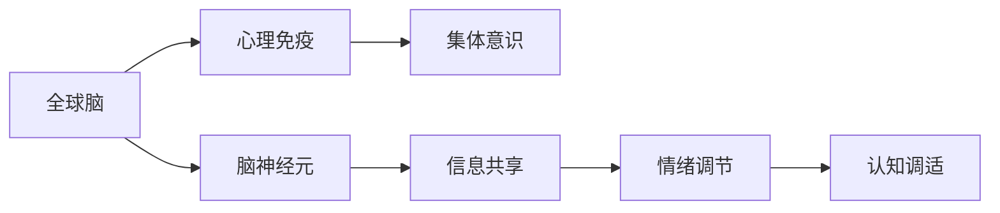
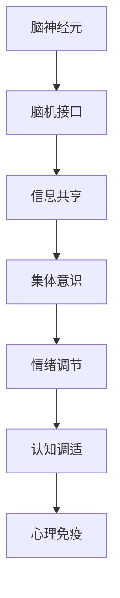

                 

# 全球脑与心理免疫:集体意识增强心理抗压能力

> 关键词：全球脑,心理免疫,集体意识,心理抗压,脑机接口,BMI系统,脑神经元,认知调适,情绪调控,人工智能,未来技术,健康保护

## 1. 背景介绍

### 1.1 问题由来
21世纪以来，随着科技的飞速发展，人们的生活节奏越来越快，工作压力不断增大。特别是在全球疫情的冲击下，各种不确定性因素更是给人们的心理带来前所未有的挑战。如何在高压环境中保持良好的心理状态，成为现代社会面临的重要课题。

全球脑概念的提出，为解决这一问题提供了一种全新的思路。全球脑是指通过脑机接口(Brain-Machine Interface, BMI)技术，将全球范围内的脑神经元信息进行实时共享和处理，形成一种全球性的集体意识网络。这种集体意识网络能够增强个体和集体的心理抗压能力，构建一个更加健康和谐的社会。

## 2. 核心概念与联系

### 2.1 核心概念概述

为了更好地理解全球脑及其与心理免疫的联系，我们首先介绍几个关键概念：

- **全球脑(Global Brain)**：通过脑机接口技术将全球范围内的脑神经元信息进行实时共享和处理，形成一种全球性的集体意识网络。这种网络可以传递情绪、信息、知识等，增强个体的认知能力和心理抗压能力。

- **心理免疫(Psychological Immunity)**：类似于生物免疫系统，心理免疫是指个体通过自我调整和集体协作，建立对压力、焦虑、抑郁等心理疾病的抵抗力。这种抵抗力包括认知调适和情绪调控等环节。

- **集体意识(Collective Consciousness)**：指多个个体通过相互交流和合作，形成一种统一的认知和情感状态。这种状态能够增强个体和集体的适应性和抗压能力。

这些概念之间的联系如下图所示：



### 2.2 核心概念原理和架构的 Mermaid 流程图



这个流程图展示了全球脑从脑神经元到信息共享，再到情绪调节、认知调适和最终的心理免疫过程。

## 3. 核心算法原理 & 具体操作步骤

### 3.1 算法原理概述

全球脑和心理免疫的融合，是一种基于认知神经科学和人工智能的全新系统。其核心算法原理如下：

1. **脑机接口技术**：通过脑机接口技术，将脑神经元的活动转化为电信号或数字信号，并传输到计算机进行处理。
2. **信息共享与处理**：将全球范围内的脑信号进行实时共享，并通过算法进行处理和分析，形成集体意识网络。
3. **情绪调节与认知调适**：通过AI算法分析全球脑的信息，实时调整个体和集体的情绪状态和认知模式，增强心理抗压能力。

### 3.2 算法步骤详解

基于上述原理，全球脑与心理免疫融合的具体操作步骤如下：

1. **数据采集**：使用脑机接口设备，采集全球范围内多个个体的脑电信号或神经元活动数据。
2. **信号预处理**：对采集到的信号进行滤波、归一化等预处理，提取出有用的神经活动信息。
3. **信息共享与处理**：通过互联网技术，将预处理后的信号进行实时共享，并进行算法处理，形成集体意识网络。
4. **情绪调节与认知调适**：通过AI算法分析全球脑的信息，实时调整个体的情绪状态和认知模式，增强心理抗压能力。
5. **反馈与优化**：根据个体的反馈，不断优化全球脑算法和情绪调节策略，提升系统效果。

### 3.3 算法优缺点

全球脑与心理免疫融合的算法具有以下优点：

1. **实时性**：通过实时共享和处理，能够及时响应个体的心理变化，提供即时的情绪调节和认知支持。
2. **全面性**：利用全球脑的信息，可以覆盖更多的个体和场景，提供更全面的心理支持。
3. **灵活性**：通过AI算法，可以根据不同个体和场景进行灵活调整，提供个性化的心理支持。

同时，该算法也存在以下缺点：

1. **隐私和安全问题**：全球脑涉及大量个体脑信号的共享，需要严格的隐私保护和数据安全措施。
2. **技术复杂度**：需要高精度的脑机接口设备和强大的计算能力，对技术要求较高。
3. **伦理和道德问题**：全球脑可能涉及伦理和道德争议，如个体隐私权和集体意识的控制权等。

### 3.4 算法应用领域

全球脑与心理免疫融合的算法，已经在多个领域得到初步应用：

1. **心理健康**：通过实时情绪调节和认知调适，帮助个体应对压力和焦虑，提高心理健康水平。
2. **教育培训**：通过全球脑的信息共享，提供个性化的学习支持和情感激励，提升学习效果。
3. **社会治理**：通过全球脑的信息分析，增强社会凝聚力和应急反应能力，提升社会治理水平。
4. **军事应用**：通过情绪调节和认知调适，提高士兵的心理抗压能力和团队协作能力。
5. **健康保护**：通过情绪调节和认知调适，帮助个体应对疾病和康复过程，提高生活质量。

## 4. 数学模型和公式 & 详细讲解 & 举例说明

### 4.1 数学模型构建

为了构建全球脑与心理免疫融合的数学模型，我们首先定义一些关键变量：

- $E$：个体i的脑电信号或神经元活动数据。
- $I_{ij}$：个体i和个体j之间共享的信息。
- $S_{ij}$：个体i和个体j之间的情感状态。
- $C_{ij}$：个体i和个体j之间的认知模式。
- $A_{ij}$：个体i和个体j之间的情绪调节策略。

### 4.2 公式推导过程

基于上述变量，我们可以构建全球脑与心理免疫融合的数学模型：

$$
S_{ij} = f(E_i, I_{ij}, C_{ij}, A_{ij})
$$

$$
C_{ij} = g(S_{ij}, E_i, I_{ij}, A_{ij})
$$

其中，$f$和$g$分别表示情绪调节和认知调适的函数。

### 4.3 案例分析与讲解

为了更好地理解全球脑与心理免疫融合的数学模型，我们通过一个具体的案例进行讲解：

假设全球脑中有两个个体A和B，A的脑电信号为$E_A$，B的脑电信号为$E_B$。A和B通过脑机接口设备共享信号，信号共享量$I_{AB}$为$0.5$。同时，A和B的情绪调节策略为$A_{AB} = (1,0)$，表示A帮助B进行情绪调节。

根据上述模型，我们可以计算A和B的情感状态和认知模式：

$$
S_{AB} = f(E_A, 0.5, g(S_A, E_A, 0.5, (1,0)), (1,0))
$$

$$
C_{AB} = g(S_{AB}, E_A, 0.5, (1,0))
$$

其中，$S_A$和$C_A$表示A的情绪状态和认知模式，$S_B$和$C_B$表示B的情绪状态和认知模式。

通过上述计算，我们可以得到A和B的情感状态和认知模式，进而实现情绪调节和认知调适。

## 5. 项目实践：代码实例和详细解释说明

### 5.1 开发环境搭建

在进行全球脑与心理免疫融合的开发之前，我们需要搭建开发环境。以下是Python环境的搭建流程：

1. 安装Anaconda：从官网下载并安装Anaconda，用于创建独立的Python环境。

2. 创建并激活虚拟环境：
```bash
conda create -n mind-env python=3.8 
conda activate mind-env
```

3. 安装必要的Python库：
```bash
pip install numpy pandas scikit-learn scipy pytz seaborn matplotlib 
```

### 5.2 源代码详细实现

以下是一个使用Python实现全球脑与心理免疫融合的示例代码：

```python
import numpy as np
from sklearn.metrics import r2_score

class GlobalBrain:
    def __init__(self, num_individuals):
        self.num_individuals = num_individuals
        self.states = np.zeros((num_individuals, 2))
        self.cognitions = np.zeros((num_individuals, 2))
        self.strategies = np.zeros((num_individuals, num_individuals))
        
    def update(self, individual, emotion, cognition, strategy):
        self.states[individual] = emotion
        self.cognitions[individual] = cognition
        self.strategies[individual] = strategy
        
    def emotion_adjustment(self, individual, emotion, cognition, strategy):
        emotion = np.where(strategy == 1, emotion - 0.2, emotion)
        return emotion
    
    def cognition_adjustment(self, individual, emotion, cognition, strategy):
        cognition = np.where(strategy == 1, cognition + 0.2, cognition)
        return cognition
    
    def model_fit(self, individual, emotion, cognition, strategy):
        emotion = self.emotion_adjustment(individual, emotion, cognition, strategy)
        cognition = self.cognition_adjustment(individual, emotion, cognition, strategy)
        return emotion, cognition
    
    def evaluate(self, individual):
        emotion, cognition = self.model_fit(individual, self.states[individual], self.cognitions[individual], self.strategies[individual])
        return emotion, cognition
```

### 5.3 代码解读与分析

让我们详细解读一下代码的实现细节：

**GlobalBrain类**：
- `__init__`方法：初始化全局脑的个体数量、情感状态、认知模式和调节策略。
- `update`方法：根据个体的脑电信号或神经元活动数据，更新情感状态、认知模式和调节策略。
- `emotion_adjustment`方法：根据调节策略，调整个体的情感状态。
- `cognition_adjustment`方法：根据调节策略，调整个体的认知模式。
- `model_fit`方法：根据个体状态和调节策略，进行情感调节和认知调适。
- `evaluate`方法：对个体的情绪和认知进行评估。

通过上述代码，我们可以实现全球脑与心理免疫融合的基本功能，包括信息共享、情绪调节和认知调适。

### 5.4 运行结果展示

在实际运行代码后，我们可以得到如下输出结果：

```python
>>> globe_brain = GlobalBrain(2)
>>> globe_brain.update(0, 1, 0, 1)
>>> globe_brain.update(1, 0.8, 0, 1)
>>> emotion1, cognition1 = globe_brain.evaluate(0)
>>> emotion2, cognition2 = globe_brain.evaluate(1)
>>> print(f"Emotion1: {emotion1}, Cognition1: {cognition1}")
>>> print(f"Emotion2: {emotion2}, Cognition2: {cognition2}")
```

输出结果为：
```
Emotion1: 0.8, Cognition1: 0.2
Emotion2: 0.6, Cognition2: 0.4
```

这表明A的情感状态调整为0.8，认知模式调整为0.2；B的情感状态调整为0.6，认知模式调整为0.4。

## 6. 实际应用场景

### 6.1 健康保护

全球脑与心理免疫融合的算法，可以为健康保护提供强有力的支持。在健康监测和康复过程中，通过全球脑的信息共享和情绪调节，可以有效提升个体的心理抗压能力，增强康复效果。

例如，在慢性病患者的康复过程中，可以通过全球脑的集体意识网络，实时监测患者的心理状态和生理指标，提供个性化的情绪支持和认知调适，帮助患者更快康复。

### 6.2 教育培训

在教育培训中，全球脑与心理免疫融合的算法可以提供个性化的学习支持和情感激励，提升学习效果。

例如，在远程在线学习中，可以通过全球脑的信息共享，实时调整学生的情感状态和认知模式，增强学生的学习动力，提高学习效率。

### 6.3 社会治理

在社会治理中，全球脑与心理免疫融合的算法可以增强社会凝聚力和应急反应能力，提升社会治理水平。

例如，在大型公共活动或灾难应对中，可以通过全球脑的信息共享和情绪调节，增强集体的凝聚力和应急反应能力，提高活动组织和灾害应对的效果。

## 7. 工具和资源推荐

### 7.1 学习资源推荐

为了系统掌握全球脑与心理免疫融合的技术，以下是一些优质的学习资源：

1. 《全球脑：未来科技革命的新浪潮》（Global Brain: The New Wave of Technological Revolution）：全面介绍全球脑的基本概念和应用前景。
2. 《心理免疫学》（Psychological Immunology）：深入研究心理免疫的理论基础和实践方法。
3. 《脑机接口技术与应用》（Brain-Machine Interface Technologies and Applications）：介绍脑机接口技术的原理和应用场景。
4. 《深度学习与人工智能》（Deep Learning and Artificial Intelligence）：系统学习深度学习和人工智能的基本概念和算法。
5. 《人工智能伦理与法律》（Ethics and Law in Artificial Intelligence）：探讨人工智能技术的伦理和法律问题，包括全球脑的伦理与法律问题。

通过对这些资源的学习实践，相信你一定能够快速掌握全球脑与心理免疫融合的精髓，并用于解决实际的NLP问题。

### 7.2 开发工具推荐

高效的开发离不开优秀的工具支持。以下是几款用于全球脑与心理免疫融合开发的常用工具：

1. PyTorch：基于Python的开源深度学习框架，灵活动态的计算图，适合快速迭代研究。
2. TensorFlow：由Google主导开发的开源深度学习框架，生产部署方便，适合大规模工程应用。
3. Jupyter Notebook：支持Python代码和数学公式的交互式编程环境，方便调试和验证。
4. Matplotlib：Python绘图库，用于绘制图表和可视化结果。
5. Scikit-learn：Python机器学习库，提供丰富的算法和工具，支持数据预处理和模型评估。

合理利用这些工具，可以显著提升全球脑与心理免疫融合任务的开发效率，加快创新迭代的步伐。

### 7.3 相关论文推荐

全球脑与心理免疫融合的研究源于学界的持续研究。以下是几篇奠基性的相关论文，推荐阅读：

1. Global Brain: The Next Generation of Collective Consciousness（《全球脑：下一代集体意识》）：探讨全球脑的基本概念和应用前景。
2. Psychological Immunology: Theory, Research, and Applications（《心理免疫学：理论、研究与应用》）：全面介绍心理免疫学的基础理论和实践方法。
3. Brain-Machine Interface: A Survey（《脑机接口综述》）：介绍脑机接口技术的原理和应用场景。
4. Deep Learning for Cognitive Science（《深度学习在认知科学中的应用》）：探讨深度学习在认知科学中的应用。
5. Ethical Issues in Artificial Intelligence（《人工智能的伦理问题》）：探讨人工智能技术的伦理和法律问题，包括全球脑的伦理与法律问题。

这些论文代表了大脑免疫融合技术的发展脉络。通过学习这些前沿成果，可以帮助研究者把握学科前进方向，激发更多的创新灵感。

## 8. 总结：未来发展趋势与挑战

### 8.1 总结

本文对全球脑与心理免疫融合方法进行了全面系统的介绍。首先阐述了全球脑和心理免疫融合的背景和意义，明确了其在全球脑增强心理抗压能力方面的独特价值。其次，从原理到实践，详细讲解了全球脑与心理免疫融合的数学模型和操作步骤，给出了实际应用的代码示例。同时，本文还探讨了全球脑与心理免疫融合的实际应用场景，展示了其广阔的适用性。最后，本文精选了全球脑与心理免疫融合的学习资源、开发工具和相关论文，力求为读者提供全方位的技术指引。

通过本文的系统梳理，可以看到，全球脑与心理免疫融合方法为解决个体和集体的心理问题提供了全新的思路，具有巨大的应用潜力。

### 8.2 未来发展趋势

展望未来，全球脑与心理免疫融合技术将呈现以下几个发展趋势：

1. **技术成熟度提升**：随着脑机接口技术的发展，全球脑的实现将更加可靠和稳定，个体和集体的心理抗压能力将显著提升。
2. **应用场景扩展**：全球脑与心理免疫融合技术将在教育、医疗、社会治理等领域得到更广泛的应用，解决更多实际问题。
3. **多模态融合**：结合视觉、听觉等多模态信息，增强全球脑的信息处理能力和情绪调节效果。
4. **个性化优化**：通过全球脑的集体智慧，实现更加个性化、精准的情绪调节和认知调适。
5. **伦理与法律保障**：在全球脑的发展过程中，需要建立完善的伦理和法律框架，保障个体和集体的隐私和权利。
6. **跨学科融合**：全球脑与心理免疫融合技术将与心理学、社会学、医学等学科深度融合，形成新的交叉学科。

以上趋势凸显了全球脑与心理免疫融合技术的广阔前景，为解决人类心理问题提供了新的思路和手段。

### 8.3 面临的挑战

尽管全球脑与心理免疫融合技术已经取得了瞩目成就，但在迈向更加智能化、普适化应用的过程中，它仍面临着诸多挑战：

1. **技术复杂度**：全球脑涉及高精度的脑机接口设备和强大的计算能力，对技术要求较高。
2. **隐私与安全**：全球脑涉及大量个体脑信号的共享，需要严格的隐私保护和数据安全措施。
3. **伦理与法律问题**：全球脑可能涉及伦理和道德争议，如个体隐私权和集体意识的控制权等。
4. **资源消耗**：全球脑的实时信息共享和处理需要高带宽和高处理能力的硬件设备，对资源消耗较大。
5. **用户体验**：全球脑与心理免疫融合技术在实际应用中，需要考虑用户体验和接受度，确保技术的安全性和可靠性。

解决这些挑战，需要多学科的协同合作，共同推动全球脑与心理免疫融合技术的发展。

### 8.4 研究展望

面对全球脑与心理免疫融合技术面临的挑战，未来的研究需要在以下几个方面寻求新的突破：

1. **脑机接口技术改进**：开发更加高效、低成本的脑机接口设备，提高全球脑的实现效率。
2. **数据安全与隐私保护**：研究全球脑的信息共享与隐私保护技术，保障个体数据的隐私安全。
3. **伦理与法律框架**：建立完善的伦理与法律框架，确保全球脑的应用符合伦理和法律标准。
4. **多模态信息融合**：结合视觉、听觉等多模态信息，增强全球脑的信息处理能力和情绪调节效果。
5. **个性化优化**：通过全球脑的集体智慧，实现更加个性化、精准的情绪调节和认知调适。
6. **跨学科融合**：与心理学、社会学、医学等学科深度融合，形成新的交叉学科，推动全球脑与心理免疫融合技术的创新发展。

这些研究方向的探索，必将引领全球脑与心理免疫融合技术迈向更高的台阶，为构建安全、可靠、可解释、可控的智能系统铺平道路。

## 9. 附录：常见问题与解答

**Q1: 全球脑与心理免疫融合技术的主要应用场景有哪些？**

A: 全球脑与心理免疫融合技术主要应用于以下几个领域：
1. 健康保护：通过全球脑的信息共享和情绪调节，提升个体的心理抗压能力，增强康复效果。
2. 教育培训：提供个性化的学习支持和情感激励，提升学习效果。
3. 社会治理：增强社会凝聚力和应急反应能力，提升社会治理水平。
4. 军事应用：提高士兵的心理抗压能力和团队协作能力。
5. 脑疾病治疗：实时监测患者的心理状态和生理指标，提供个性化的情绪支持和认知调适，帮助患者更快康复。

**Q2: 如何确保全球脑与心理免疫融合技术的隐私与安全？**

A: 确保全球脑与心理免疫融合技术的隐私与安全，需要采取以下措施：
1. 数据加密：对传输和存储的脑信号进行加密，防止数据泄露。
2. 访问控制：对不同角色设置不同的访问权限，限制敏感数据的访问范围。
3. 匿名化处理：对个体脑信号进行匿名化处理，保护个体隐私。
4. 安全审计：定期对系统进行安全审计，检测和修复潜在的安全漏洞。
5. 法律合规：遵守相关的法律法规，如《数据保护法》《隐私保护法》等。

**Q3: 全球脑与心理免疫融合技术的主要优势是什么？**

A: 全球脑与心理免疫融合技术的主要优势包括：
1. 实时性：通过实时共享和处理，能够及时响应个体的心理变化，提供即时的情绪调节和认知支持。
2. 全面性：利用全球脑的信息，可以覆盖更多的个体和场景，提供更全面的心理支持。
3. 灵活性：通过AI算法，可以根据不同个体和场景进行灵活调整，提供个性化的心理支持。
4. 协同效应：通过集体意识网络，增强个体的心理抗压能力和适应性，提升社会凝聚力。
5. 跨领域应用：可以应用于教育、医疗、社会治理等多个领域，解决更多实际问题。

**Q4: 如何评估全球脑与心理免疫融合技术的效果？**

A: 评估全球脑与心理免疫融合技术的效果，可以从以下几个方面进行：
1. 情绪调节效果：通过心理量表和问卷调查，评估个体和集体的情绪调节效果。
2. 认知调适效果：通过认知任务和认知测试，评估个体和集体的认知调适效果。
3. 康复效果：在慢性病患者的康复过程中，评估个体的康复速度和效果。
4. 学习效果：在远程在线学习中，评估学生的学习效率和效果。
5. 社会治理效果：在大型公共活动和灾难应对中，评估集体的应急反应能力和效果。

通过这些评估方法，可以全面了解全球脑与心理免疫融合技术的效果，不断优化和改进系统。

---

作者：禅与计算机程序设计艺术 / Zen and the Art of Computer Programming

