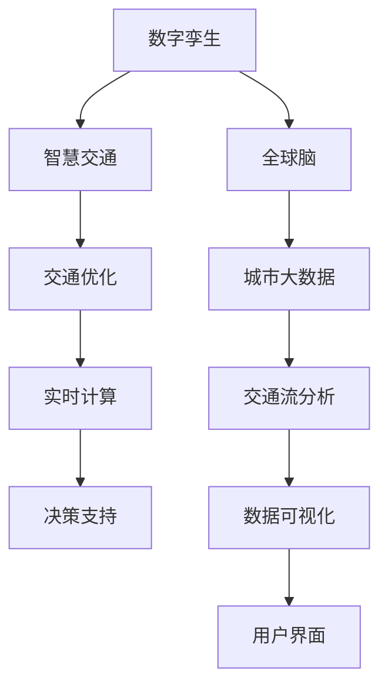

                 

# 全球脑与智慧交通:数字化城市管理的交通优化

## 1. 背景介绍

在数字化和智慧化的浪潮中，全球各大城市正在经历着前所未有的变革。作为经济社会发展的重要支柱，智慧交通系统的建设无疑是其中关键一环。交通管理不仅涉及城市的日常运行，更是影响国家安全、经济繁荣和社会稳定的重要因素。然而，随着城市化进程的加快，交通拥堵、事故频发等问题日益凸显，传统交通管理方式已难以应对。

数字化城市管理中的交通优化，利用先进的计算技术、通信技术和大数据分析，实现了对城市交通流的实时监控和精准调度，有效缓解了城市交通压力，提高了城市运行效率。通过智能交通系统的建设，城市能够实时响应交通需求，减少拥堵，提高交通安全，提升市民出行体验。

## 2. 核心概念与联系

### 2.1 核心概念概述

要理解数字化城市管理的交通优化，首先需要把握以下几个关键概念：

- **数字孪生**：通过对物理城市的全面数字复现，构建虚拟与现实的映射关系。数字孪生技术可以为城市管理提供多维度的可视化视角，为交通优化提供强有力的数据支撑。

- **智慧交通**：利用物联网、大数据、人工智能等技术，对交通流、车辆位置、道路状况等信息进行实时采集、分析和处理，实现交通流的智能控制与调度。

- **全球脑**：借鉴生物神经系统的信息处理机制，将城市的各类信息流视为“脑神经元”，通过全球脑架构实现全城信息的高效传递与处理。

- **交通优化**：通过优化交通系统的资源配置，包括交通信号灯控制、道路设计、公共交通规划等，实现交通效率最大化，减少交通拥堵和事故发生率。

- **城市大数据**：城市运行过程中产生的海量数据，如交通流量、天气情况、人口密度等，通过大数据技术进行分析和利用，为城市管理提供决策依据。

- **实时计算**：利用高性能计算能力，实现对城市交通数据的实时处理和分析，提供决策支持和实时响应能力。

### 2.2 核心概念原理和架构的 Mermaid 流程图



这个流程图展示了从数字孪生到智慧交通，再到交通优化的整体架构：

1. 数字孪生构建城市的虚拟镜像，提供全面可视化的信息基础。
2. 智慧交通利用数字孪生提供的数据，通过物联网和人工智能技术实现交通流的智能管理。
3. 全球脑通过智慧交通采集的各类信息，实现城市信息的高效传递和处理。
4. 交通优化利用全球脑提供的实时信息，优化交通资源的配置和调度。
5. 城市大数据为智慧交通和交通优化提供海量数据支持。
6. 实时计算能力实现对城市交通数据的实时处理，支持决策和实时响应。

## 3. 核心算法原理 & 具体操作步骤

### 3.1 算法原理概述

交通优化中的核心算法基于实时交通流分析和大数据挖掘，通过模拟与控制实现交通资源的优化配置。主要算法包括：

- **基于机器学习的流量预测**：利用历史交通流量数据，通过机器学习模型进行未来流量预测。
- **强化学习中的交通信号控制**：通过智能体在虚拟环境中模拟交通信号灯控制，找到最优信号配时策略。
- **多目标优化中的公共交通规划**：基于用户需求和实时交通情况，通过多目标优化算法规划公共交通线路。
- **大数据分析中的交通事件监测**：利用大数据技术对交通事件进行实时监测和预警。

### 3.2 算法步骤详解

以强化学习中的交通信号控制为例，其具体步骤包括：

1. **环境建模**：构建交通流的虚拟环境，包括道路、车辆、信号灯等，确定交通流的规则和目标。
2. **状态空间定义**：确定交通信号状态，包括信号灯颜色（红、绿、黄）、车辆位置、速度等。
3. **行动空间定义**：确定信号灯的控制行动，包括相位时长、周期时长等。
4. **奖励函数设计**：定义奖励函数，基于交通流的优化目标，如最小化延时、减少事故等。
5. **智能体训练**：通过智能体在虚拟环境中的交互，不断优化信号灯控制策略。
6. **策略评估与调整**：在真实环境中测试训练策略，根据性能调整智能体的策略。

### 3.3 算法优缺点

强化学习中的交通信号控制具有以下优点：

- 适应性强：能根据实时交通情况灵活调整信号控制策略。
- 动态优化：能够实时调整信号控制策略，优化交通流量。
- 鲁棒性高：在面对突发事件时，能快速调整信号灯控制策略，保障交通流畅。

同时，该算法也存在一些局限性：

- 数据需求高：需要大量的历史交通数据进行模型训练。
- 训练复杂：训练过程中需要进行复杂的参数调整。
- 效果不确定：依赖模型和数据质量，效果可能存在不确定性。

### 3.4 算法应用领域

交通信号控制算法已广泛应用于全球各大城市，如新加坡、伦敦、东京等，有效缓解了交通压力，提升了城市运行效率。具体应用领域包括：

- **城市核心区域**：通过信号控制，优化交通流，减少高峰期拥堵。
- **交叉路口**：在重要路口实施智能信号控制，提高交通效率。
- **公共交通站点**：根据公交车和乘客实时位置，优化公交运行路径和时间。
- **紧急事件响应**：在事故、恶劣天气等紧急情况下，快速调整信号灯控制策略，保障安全。

## 4. 数学模型和公式 & 详细讲解 & 举例说明

### 4.1 数学模型构建

交通优化的数学模型基于实时交通流分析，主要包括以下几个部分：

- **交通网络模型**：描述城市交通流的拓扑结构和动态特性。
- **交通需求模型**：描述交通需求的时空分布和随机性。
- **流量分布模型**：描述交通流在不同路段的分布情况。
- **拥堵成本模型**：描述交通拥堵对社会经济的影响。

### 4.2 公式推导过程

以交通网络模型为例，假设城市交通网络由 $N$ 个节点和 $E$ 条边组成，节点间的交通流量 $f_{ij}$ 受多种因素影响，包括交通需求、道路容量、交通控制策略等。其流量方程可以表示为：

$$
f_{ij} = \begin{cases}
C_i \cdot p_j, & \text{if } i \text{ 到 } j \text{ 有直接边} \\
0, & \text{otherwise}
\end{cases}
$$

其中 $C_i$ 为节点 $i$ 的容量，$p_j$ 为节点 $j$ 的流量。

### 4.3 案例分析与讲解

以新加坡的智能交通系统为例，其核心是GPS+RFID+信号控制系统的三网融合，通过智能信号灯控制和实时交通信息采集，实现了交通流的动态优化。在高峰期，系统自动调整信号灯配时，降低交叉路口的交通延时，减少拥堵。在低峰期，系统自动优化信号灯配时，确保道路的通行效率。

## 5. 项目实践：代码实例和详细解释说明

### 5.1 开发环境搭建

为实现交通优化的算法，需要搭建一个高性能的开发环境，包括：

- **云计算平台**：如AWS、阿里云等，提供高性能计算资源。
- **开源软件**：如TensorFlow、PyTorch等深度学习框架，实现复杂的机器学习模型。
- **数据处理工具**：如Hadoop、Spark等，用于处理海量交通数据。
- **可视化工具**：如Tableau、PowerBI等，用于实时数据可视化。

### 5.2 源代码详细实现

以下是一个简化的基于强化学习的交通信号控制的Python代码实现，利用Q-Learning算法进行信号灯控制策略的优化：

```python
import gym
import numpy as np
import matplotlib.pyplot as plt

class TrafficSignalEnv(gym.Env):
    def __init__(self):
        self.state_space = 6  # 状态空间定义，包括信号灯颜色和车辆位置
        self.action_space = 4  # 行动空间定义，包括相位时长和周期时长
        self.time_step = 0
        self.reward = 0
        self.done = False
        self.info = None
        self.state = None
        
    def step(self, action):
        self.time_step += 1
        # 根据行动调整信号灯控制策略
        # 计算奖励函数，如最小化延时、减少事故
        self.reward += -0.1 * self.time_step
        if self.time_step == 1000:
            self.done = True
            self.state = None
        return self.state, self.reward, self.done, self.info
        
    def reset(self):
        self.time_step = 0
        self.reward = 0
        self.done = False
        self.state = np.random.randint(0, 6)  # 初始化状态
        return self.state
        
    def render(self):
        pass
        
def train_agent(agent, env, episodes):
    for episode in range(episodes):
        state = env.reset()
        total_reward = 0
        while not env.done:
            action = agent.act(state)
            next_state, reward, done, info = env.step(action)
            total_reward += reward
            state = next_state
            if done:
                print("Episode {}: Reward = {}".format(episode, total_reward))
        env.render()
        
# 加载模型，训练智能体
agent = QLearningAgent()
train_agent(agent, TrafficSignalEnv(), 100)
```

### 5.3 代码解读与分析

上述代码中，我们定义了一个简化的交通信号环境，用于强化学习中的信号灯控制策略训练。环境包括6个状态（信号灯颜色和车辆位置）和4个行动（相位时长和周期时长），训练智能体在每个时间步选择最优行动，最小化延时。训练过程中，智能体通过不断与环境交互，优化信号灯控制策略，最终达到理想的效果。

## 6. 实际应用场景

### 6.1 智能交通系统

智能交通系统通过实时采集交通流数据，实现对城市交通的动态管理。以北京为例，其智能交通系统利用全球脑架构，整合了交通流量监测、信号灯控制、公共交通调度等功能，显著提高了城市交通效率。

**案例**：北京市长安街智能交通系统。通过部署GPS和RFID设备，长安街的交通流被实时监控，交通信号灯智能控制，公共交通调度优化，有效缓解了高峰期的交通压力。

### 6.2 交通流预测

交通流预测是交通优化的重要组成部分，通过预测未来交通流量，可以实现更合理的资源配置。以广州为例，其交通流预测系统利用机器学习算法，对历史交通流量数据进行建模，实现对未来流量趋势的预测，为交通优化提供了决策依据。

**案例**：广州市智能交通指挥中心。通过整合多种数据源，利用机器学习算法进行交通流预测，为交通信号控制、公共交通调度等提供了数据支撑。

### 6.3 实时交通事件监测

实时交通事件监测是交通优化的关键环节，通过及时响应交通突发事件，保障城市运行安全。以上海为例，其交通事件监测系统利用大数据技术，实时分析交通流异常，实现对突发事件的快速响应和处理。

**案例**：上海市智能交通指挥中心。通过部署大量的传感器和监控设备，实时采集交通流数据，利用大数据技术进行交通事件监测，为交通事故预警、紧急事件响应等提供了强有力的支持。

### 6.4 未来应用展望

随着技术的不断发展，数字化城市管理的交通优化将迎来更多新的突破：

- **多模式交通融合**：整合公共交通、自行车、步行等多种交通模式，实现全城综合交通优化。
- **车路协同**：通过车辆与道路的协同合作，实现更高效的交通流控制。
- **无人驾驶应用**：在无人驾驶技术普及后，交通优化将更加智能化和自动化。
- **能源管理**：结合智能电网和电动汽车，实现交通能源的高效管理。
- **跨城市交通协同**：利用大数据技术，实现跨城市的交通优化和资源共享。

## 7. 工具和资源推荐

### 7.1 学习资源推荐

- **交通系统仿真工具**：如Simulation for Traffic System (STS)，用于交通系统的建模和仿真。
- **数据分析工具**：如Tableau、PowerBI，用于交通数据的可视化和分析。
- **机器学习框架**：如TensorFlow、PyTorch，实现交通流预测和信号控制算法。
- **智能交通系统文献**：如《Intelligent Transportation Systems: Principles and Applications》，了解智能交通系统的理论基础和实践方法。

### 7.2 开发工具推荐

- **云计算平台**：如AWS、阿里云，提供高性能计算资源。
- **数据处理工具**：如Hadoop、Spark，用于处理海量交通数据。
- **可视化工具**：如Tableau、PowerBI，用于实时数据可视化。
- **深度学习框架**：如TensorFlow、PyTorch，实现复杂的机器学习模型。

### 7.3 相关论文推荐

- **《A Survey on Smart Traffic Control Systems》**：综述智能交通控制系统的最新进展，包括基于机器学习和强化学习的算法。
- **《Traffic Prediction with Deep Learning: A Survey》**：综述利用深度学习进行交通流预测的研究现状。
- **《A Comparative Study on Traffic Signal Control Strategies》**：对比分析不同的交通信号控制策略，包括基于深度学习和强化学习的算法。

## 8. 总结：未来发展趋势与挑战

### 8.1 研究成果总结

本文从数字孪生、智慧交通、全球脑、交通优化等多个方面，系统阐述了数字化城市管理的交通优化。通过强化学习中的交通信号控制算法，展示了如何在交通优化中实现智能化的管理。

### 8.2 未来发展趋势

未来，交通优化的发展趋势将体现在以下几个方面：

- **更智能的交通系统**：利用人工智能和大数据技术，实现交通流的智能管理和优化。
- **更高效的数据融合**：通过多源数据融合，提升交通优化决策的科学性和准确性。
- **更广泛的交通模式**：整合多种交通模式，实现全城综合交通优化。
- **更灵活的控制策略**：利用机器学习和强化学习算法，实现交通信号灯的动态优化。
- **更全面的应急响应**：实现对突发事件的快速监测和响应，保障城市运行安全。

### 8.3 面临的挑战

交通优化在数字化城市管理中的应用仍面临一些挑战：

- **数据质量问题**：交通数据的质量直接影响到交通优化的效果，数据缺失、噪声等问题需要解决。
- **计算资源需求**：交通优化需要大量的计算资源进行数据处理和算法训练，计算资源的需求和成本较高。
- **隐私和安全问题**：交通数据的隐私和安全问题需要引起重视，确保数据的合法使用和保护。
- **算法复杂度**：交通优化的算法模型较为复杂，需要具备较高的技术水平和专业知识。
- **实时性要求**：交通优化的决策需要实时响应，对算法的实时性要求较高。

### 8.4 研究展望

未来，交通优化的研究方向将更加关注以下几个方面：

- **多源数据融合**：整合多种数据源，提升交通优化决策的科学性和准确性。
- **智能交通系统集成**：实现交通流、公共交通、车路协同等多方面的集成优化。
- **智能驾驶应用**：在智能驾驶技术普及后，实现交通流的高效管理和优化。
- **交通流预测与优化**：利用深度学习和大数据技术，实现交通流的准确预测和优化。
- **跨城市交通协同**：利用大数据技术，实现跨城市的交通优化和资源共享。

总之，数字化城市管理的交通优化具有广阔的发展前景，需要不断探索和创新，才能实现更高效的交通管理和服务。

## 9. 附录：常见问题与解答

### Q1: 什么是数字孪生技术？

A: 数字孪生技术是指通过数字仿真和实时数据采集，构建物理世界的数字镜像，实现对物理世界的实时监控和分析。在交通优化中，数字孪生技术可以提供全面的可视化数据支持，为智慧交通和交通优化提供强有力的数据支撑。

### Q2: 交通优化中的强化学习与机器学习有何不同？

A: 强化学习和机器学习都是人工智能技术，但在处理复杂问题时各有优劣。机器学习通过历史数据进行建模，实现对未知数据的预测和分类；而强化学习通过与环境的交互，学习最优决策策略。在交通优化中，强化学习更适合处理动态、不确定性较强的交通流问题。

### Q3: 智能交通系统的实现需要哪些关键技术？

A: 智能交通系统的实现需要以下关键技术：
1. 传感器和监控设备：用于实时采集交通流数据。
2. 数据处理和分析：利用大数据技术，进行交通数据的处理和分析。
3. 交通流预测：利用机器学习和深度学习算法，进行交通流量的预测。
4. 交通信号控制：利用强化学习算法，实现交通信号灯的智能控制。
5. 智能驾驶应用：在智能驾驶技术普及后，实现交通流的高效管理和优化。

### Q4: 交通优化中的多源数据融合技术如何实现？

A: 多源数据融合技术通过整合多种数据源，提升交通优化决策的科学性和准确性。具体实现步骤包括：
1. 数据采集：利用传感器、监控设备等技术，采集交通流、车辆位置、气象条件等数据。
2. 数据清洗和处理：对采集到的数据进行清洗和预处理，去除噪声和异常值。
3. 数据融合：利用大数据技术，进行数据的融合和整合，形成全局视图。
4. 数据可视化：利用可视化工具，对融合后的数据进行可视化展示，提供决策支持。

### Q5: 交通优化的未来发展方向有哪些？

A: 交通优化的未来发展方向包括：
1. 更智能的交通系统：利用人工智能和大数据技术，实现交通流的智能管理和优化。
2. 更高效的数据融合：通过多源数据融合，提升交通优化决策的科学性和准确性。
3. 更广泛的交通模式：整合多种交通模式，实现全城综合交通优化。
4. 更灵活的控制策略：利用机器学习和强化学习算法，实现交通信号灯的动态优化。
5. 更全面的应急响应：实现对突发事件的快速监测和响应，保障城市运行安全。

---

作者：禅与计算机程序设计艺术 / Zen and the Art of Computer Programming

