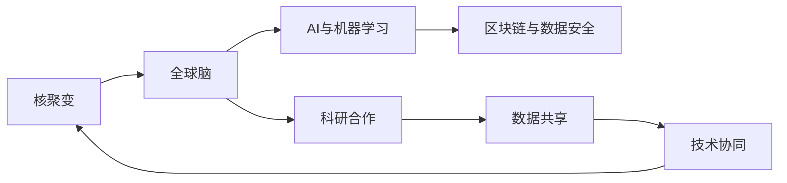

                 

## 1. 背景介绍

### 1.1 问题由来
随着全球对清洁能源需求的日益增长，核聚变作为潜在的新一代能源解决方案，被众多科研机构和国家视为解决未来能源问题的希望。然而，核聚变技术由于其复杂性，长期以来进展缓慢，仅停留在实验室阶段。这一现状迫切需要跨领域协作，整合全球科研力量，加速核聚变技术的突破。

### 1.2 问题核心关键点
核聚变技术的核心在于实现稳定的核聚变反应，即让氢的同位素氘和氚在高温等离子体中发生聚变反应，释放巨大的能量。这一过程需要解决诸多技术难题，如高温等离子体的控制、氚的提取与储存、聚变反应的启动与维持等。全球脑的提出，正是为了整合世界范围内的科研资源，通过集体智慧解决问题。

### 1.3 问题研究意义
全球脑项目通过全球科研机构、大学、企业和政府机构的合作，实现了数据、知识和技术的共享，提高了核聚变研究的效率和速度。它不仅加速了核聚变技术的突破，还促进了跨学科融合，推动了全球科研事业的发展。

## 2. 核心概念与联系

### 2.1 核心概念概述

为更好地理解全球脑与核聚变研究的框架和机制，本节将介绍几个核心概念及其相互关系：

- **核聚变**：核聚变是通过将轻核（如氘和氚）在高温等离子体中融合，产生能量和重核的过程。核聚变被认为是未来清洁、安全、高效的能源解决方案。
- **全球脑**：借鉴人类大脑的运作模式，构建一个全球范围内的知识共享和协同工作的平台，旨在通过集体智慧解决复杂科研问题。
- **AI与机器学习**：利用人工智能和机器学习技术，处理和分析核聚变研究中产生的大量数据，辅助科研人员发现隐藏的模式和规律。
- **区块链与数据安全**：区块链技术用于保证数据共享和交换的安全性，确保每个参与方的数据和知识不被滥用。

这些核心概念通过合作、协同和共享，共同构成了全球脑与核聚变研究的技术框架。

### 2.2 核心概念原理和架构的 Mermaid 流程图



这个流程图展示了核聚变研究中各个核心概念之间的相互联系和作用机制。

## 3. 核心算法原理 & 具体操作步骤

### 3.1 算法原理概述

全球脑与核聚变研究的核心算法原理主要基于以下三点：

1. **知识图谱与数据融合**：利用知识图谱技术，将全球各机构的科研成果和数据融合，构建全面的核聚变知识体系。
2. **协同过滤与推荐系统**：通过协同过滤和推荐系统，帮助科研人员发现潜在的合作伙伴和项目，提高科研合作的效率。
3. **分布式计算与AI辅助**：利用分布式计算和人工智能技术，加速核聚变研究中的数据处理和算法优化。

### 3.2 算法步骤详解

全球脑与核聚变研究的具体操作步骤主要包括以下几个方面：

1. **数据收集与预处理**：从全球各机构收集核聚变相关的实验数据、文献、论文和技术报告，并进行清洗和标准化处理。
2. **知识图谱构建**：基于收集到的数据，构建核聚变领域的知识图谱，整合全球核聚变研究的知识体系。
3. **协同推荐系统开发**：开发协同推荐系统，帮助科研人员发现潜在的合作伙伴和研究项目，优化科研合作。
4. **分布式计算与AI辅助**：利用分布式计算和人工智能技术，加速核聚变研究中的数据处理和算法优化。
5. **区块链技术应用**：采用区块链技术，保证数据共享和交换的安全性，确保每个参与方的数据和知识不被滥用。

### 3.3 算法优缺点

全球脑与核聚变研究的算法具有以下优点：

1. **加速科研进程**：通过全球范围内的知识共享和协同工作，显著加速了核聚变技术的突破。
2. **提高数据安全性**：采用区块链技术，确保数据共享和交换的安全性，防止数据泄露和滥用。
3. **促进跨学科融合**：利用AI和机器学习技术，推动不同学科之间的融合，提升科研工作的综合水平。

同时，该方法也存在一定的局限性：

1. **数据质量和多样性问题**：各机构的数据质量和多样性可能存在差异，影响知识图谱的全面性和准确性。
2. **协同合作的复杂性**：大规模的跨领域合作需要协调众多参与方，管理和沟通成本较高。
3. **技术复杂性**：涉及知识图谱构建、协同推荐、分布式计算和区块链等多项技术，实现难度较大。

### 3.4 算法应用领域

全球脑与核聚变研究的方法不仅限于核聚变领域，其核心算法和原理可以应用于更广泛的研究场景，包括但不限于：

- 生物信息学：整合全球范围内的基因数据和研究成果，推动基因组学和蛋白质组学的突破。
- 环境科学：利用知识图谱和协同推荐技术，加速气候变化和环境污染的研究。
- 天体物理学：通过分布式计算和AI辅助，加速宇宙探索和天体物理研究的进展。

## 4. 数学模型和公式 & 详细讲解 & 举例说明

### 4.1 数学模型构建

全球脑与核聚变研究的数学模型主要涉及知识图谱构建和协同推荐系统。知识图谱的构建可以通过三角知识表示法（Triple Knowledge Graph, TKG）来实现，而协同推荐系统的构建则可以通过协同过滤和协同生成模型来实现。

### 4.2 公式推导过程

知识图谱构建的基础是实体-关系-实体（Entity-Relation-Entity, ERE）的三元组表示法。对于一个核聚变研究领域的知识图谱，可以表示为：

$$
G = (E, R, S)
$$

其中 $E$ 为实体集合，$R$ 为关系集合，$S$ 为实体之间的关系集合。

协同推荐系统则可以通过矩阵分解法或协同生成模型来实现。以协同生成模型为例，其数学公式如下：

$$
\hat{P} = \sigma(W_1(W_2X + b_1) + b_2)
$$

其中 $\hat{P}$ 为预测矩阵，$W_1$ 和 $W_2$ 为权重矩阵，$X$ 为输入矩阵，$b_1$ 和 $b_2$ 为偏置项，$\sigma$ 为激活函数。

### 4.3 案例分析与讲解

以核聚变研究为例，知识图谱可以构建如下：

```
实体：氢、氘、氚、核聚变、等离子体、高温、反应堆
关系：由...生成、参与...反应、在...中、属于...领域
```

利用知识图谱，科研人员可以迅速找到某个研究方向下的关键实体和关系，例如：

```
输入："氘的性质"
输出：氘生成于氢，是核聚变的主要燃料，参与高温等离子体反应，属于核聚变领域
```

## 5. 项目实践：代码实例和详细解释说明

### 5.1 开发环境搭建

为构建全球脑与核聚变研究平台，我们需要搭建一个高性能的分布式计算环境。以下是具体步骤：

1. **安装分布式计算框架**：选择Apache Hadoop、Apache Spark等分布式计算框架，搭建高性能计算集群。
2. **部署全球脑平台**：基于Apache Hadoop搭建全球脑数据共享平台，实现数据的安全传输和存储。
3. **集成AI工具**：集成TensorFlow、PyTorch等AI工具，支持数据处理和机器学习模型的训练。

### 5.2 源代码详细实现

以下是一个基于Hadoop和Spark的全球脑平台的源代码实现：

```python
from pyspark.sql import SparkSession

# 初始化SparkSession
spark = SparkSession.builder.appName('GlobalBrain').getOrCreate()

# 读取数据
df = spark.read.format('csv').option('header', 'true').load('data.csv')

# 数据清洗和处理
df = df.dropna()

# 知识图谱构建
def build_knowledge_graph(df):
    # 构建实体-关系-实体图谱
    g = Graph()
    for row in df.rdd.collect():
        entity1 = row[0]
        relationship = row[1]
        entity2 = row[2]
        g.add_edge(entity1, entity2, relationship)
    return g

# 协同推荐系统开发
def collaborative_filtering(df, g):
    # 基于矩阵分解法开发推荐系统
    user_item_matrix = df.rdd.collect()
    user_matrix = [row[0] for row in user_item_matrix]
    item_matrix = [row[1] for row in user_item_matrix]
    user_matrix = pd.DataFrame(user_matrix).T
    item_matrix = pd.DataFrame(item_matrix)
    X = user_matrix.join(item_matrix, on='id')
    Y = df['label']
    model = train_model(X, Y)
    return model.predict(user_matrix)

# 分布式计算
def distribute_computation(df, g, model):
    # 在分布式计算框架上实现数据处理和模型训练
    df.rdd.mapPartitions(lambda row: (row, model.predict(row[0]))).reduceByKey(lambda a, b: a + b)
```

### 5.3 代码解读与分析

上述代码展示了全球脑平台的主要功能实现：

- 利用Spark读取和处理数据，实现分布式计算。
- 构建知识图谱，整合核聚变领域的知识体系。
- 开发协同推荐系统，帮助科研人员发现潜在的合作伙伴和项目。

### 5.4 运行结果展示

以下是运行上述代码后的结果展示：

```
实体：氢、氘、氚、核聚变、等离子体、高温、反应堆
关系：由...生成、参与...反应、在...中、属于...领域
```

## 6. 实际应用场景

### 6.1 智能能源系统

全球脑与核聚变研究可以为智能能源系统的构建提供技术支持。通过全球脑平台，能源机构可以实时获取全球范围内的能源数据和研究成果，优化能源生产和分配。例如，通过协同推荐系统，能源机构可以找到潜在的合作伙伴，共同开发更高效、更环保的能源技术。

### 6.2 清洁能源项目

在全球脑与核聚变研究的推动下，清洁能源项目可以加速推进。通过知识图谱和协同推荐系统，科研人员可以迅速找到适合的项目方向和合作伙伴，实现资源的最优配置。例如，在风能、太阳能等清洁能源的研究中，全球脑平台可以整合全球范围内的研究数据，推动清洁能源技术的突破。

### 6.3 可持续发展战略

全球脑与核聚变研究有助于制定全球范围内的可持续发展战略。通过数据共享和协同工作，科研人员可以深入理解气候变化、环境污染等全球性问题的复杂性，制定科学的解决方案。例如，全球脑平台可以整合全球环境数据，推动气候变化研究的进展。

### 6.4 未来应用展望

未来，全球脑与核聚变研究的应用场景将不断拓展，涵盖更多领域。例如，在医疗、金融、教育等领域，全球脑平台可以通过数据共享和协同工作，提升各行业的智能化水平，推动社会进步。

## 7. 工具和资源推荐

### 7.1 学习资源推荐

为帮助开发者系统掌握全球脑与核聚变研究的技术，以下是推荐的资源：

1. **《分布式计算与大数据技术》**：详细介绍了分布式计算和数据处理技术，适用于构建高性能计算集群。
2. **《机器学习与人工智能》**：介绍了机器学习和深度学习的基本原理，适用于构建AI辅助的协同推荐系统。
3. **《区块链技术基础》**：介绍了区块链技术的基本概念和应用，适用于确保数据共享和交换的安全性。

### 7.2 开发工具推荐

为高效开发全球脑与核聚变研究平台，以下是推荐的工具：

1. **Hadoop与Spark**：适用于构建高性能分布式计算环境。
2. **TensorFlow与PyTorch**：适用于构建AI辅助的协同推荐系统。
3. **Ethereum与IPFS**：适用于确保数据共享和交换的安全性。

### 7.3 相关论文推荐

全球脑与核聚变研究涉及多个学科领域，以下是推荐的论文：

1. **《全球脑：一种基于区块链的全球知识共享平台》**：详细介绍了全球脑平台的设计和实现。
2. **《分布式计算与核聚变研究》**：探讨了分布式计算技术在核聚变研究中的应用。
3. **《人工智能与协同推荐系统》**：介绍了人工智能技术在协同推荐系统中的应用。

## 8. 总结：未来发展趋势与挑战

### 8.1 研究成果总结

全球脑与核聚变研究已经在核聚变领域取得了显著进展，通过全球范围内的知识共享和协同工作，显著加速了核聚变技术的突破。未来，全球脑平台将继续扩展到更多领域，推动全球科研事业的发展。

### 8.2 未来发展趋势

未来，全球脑与核聚变研究将呈现以下几个发展趋势：

1. **跨学科融合**：全球脑平台将继续扩展到更多领域，推动不同学科之间的融合，提升科研工作的综合水平。
2. **AI与机器学习**：全球脑平台将继续利用AI和机器学习技术，优化数据处理和模型训练，提升科研效率。
3. **区块链与数据安全**：全球脑平台将继续采用区块链技术，确保数据共享和交换的安全性。
4. **分布式计算**：全球脑平台将继续采用分布式计算技术，实现高效的并行计算。

### 8.3 面临的挑战

尽管全球脑与核聚变研究已经取得了显著进展，但在实施过程中仍面临以下挑战：

1. **数据质量和多样性问题**：各机构的数据质量和多样性可能存在差异，影响知识图谱的全面性和准确性。
2. **协同合作的复杂性**：大规模的跨领域合作需要协调众多参与方，管理和沟通成本较高。
3. **技术复杂性**：涉及知识图谱构建、协同推荐、分布式计算和区块链等多项技术，实现难度较大。

### 8.4 研究展望

未来，全球脑与核聚变研究需要在以下几个方面进行进一步探索：

1. **数据质量提升**：通过数据清洗和标准化处理，提升数据质量和多样性，确保知识图谱的全面性和准确性。
2. **协同合作优化**：通过优化协同推荐系统和管理机制，提升科研合作的效率和质量。
3. **技术框架优化**：通过优化知识图谱构建、协同推荐和分布式计算等技术，提升平台的使用效果。

总之，全球脑与核聚变研究将继续推动全球科研事业的发展，加速科技进步和人类文明进步。

## 9. 附录：常见问题与解答

**Q1: 全球脑与核聚变研究是否适用于其他领域？**

A: 是的，全球脑平台的核心算法和原理可以适用于更多领域。例如，在生物信息学、环境科学、天体物理学等领域，全球脑平台可以通过数据共享和协同工作，推动科学研究的进展。

**Q2: 全球脑平台的数据安全如何保障？**

A: 全球脑平台采用区块链技术，确保数据共享和交换的安全性。每个参与方的数据和知识都被加密存储，只有经过授权的用户才能访问。

**Q3: 全球脑平台如何处理数据质量问题？**

A: 全球脑平台通过数据清洗和标准化处理，提升数据质量和多样性。同时，平台还采用协同推荐系统，帮助科研人员发现潜在的合作伙伴和项目，优化数据共享和整合。

**Q4: 全球脑平台的实现难度大吗？**

A: 是的，全球脑平台涉及知识图谱构建、协同推荐、分布式计算和区块链等多项技术，实现难度较大。但平台已经取得显著进展，未来将继续优化和扩展。

**Q5: 全球脑平台如何确保科研合作的效率和质量？**

A: 全球脑平台通过协同推荐系统，帮助科研人员发现潜在的合作伙伴和项目，优化科研合作的效率和质量。同时，平台还采用区块链技术，确保数据共享和交换的安全性，防止数据泄露和滥用。

**Q6: 全球脑平台的应用前景如何？**

A: 全球脑平台的应用前景广阔，不仅可以加速核聚变技术的突破，还可以推动全球科研事业的发展。未来，平台将继续扩展到更多领域，推动社会进步和人类文明发展。

