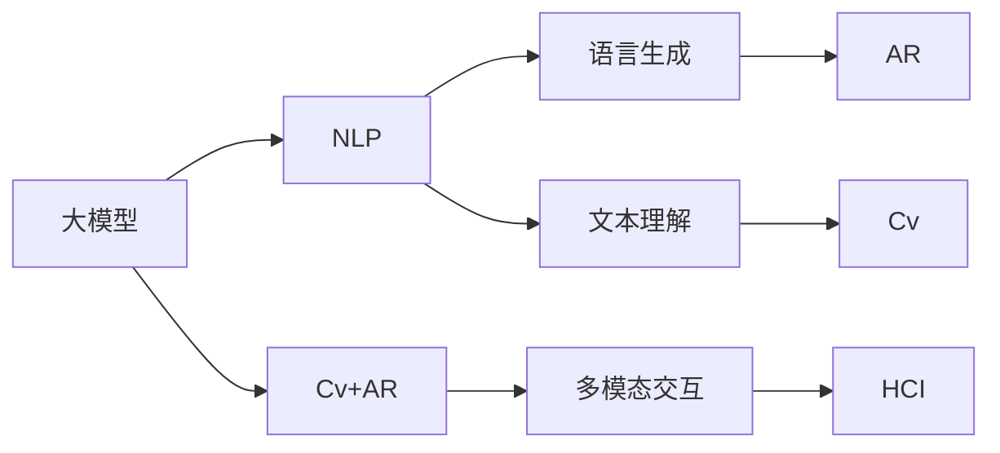

                 

# 全球脑与语言创造:人类沟通方式的革命性变革

> 关键词：人机交互, 自然语言处理, 语言模型, 语言生成, 计算机视觉, 增强现实

## 1. 背景介绍

### 1.1 问题由来
在全球化的今天，信息传播和人际交流已不仅仅局限于传统的语言文字。随着人工智能(AI)技术的迅猛发展，特别是自然语言处理(NLP)和计算机视觉(CV)领域的突破，人类沟通方式正在经历一次革命性的变革。

在这个时代，机器不再仅仅是信息的被动接收者，而是积极参与到语言的创造和理解中。通过大模型、深度学习等先进技术，机器可以生成自然流畅的语言，同时能够理解和回应复杂的多模态输入，极大地拓宽了人类沟通的边界。

### 1.2 问题核心关键点
这场通信方式的变革，其核心关键点在于：
1. **语言生成能力**：机器能够根据特定的输入，生成语法正确、语义清晰、上下文连贯的自然语言。
2. **多模态交互**：机器可以综合处理文本、图像、音频、视频等多模态信息，提供更为丰富和真实的人类沟通体验。
3. **个性化定制**：机器能够根据用户的偏好和习惯，生成个性化的语言内容，提高沟通效率和满意度。
4. **实时互动**：机器可以在实时交互中，迅速理解并回应用户的查询，提供即时反馈和解决方案。
5. **跨语言沟通**：机器可以跨越语言障碍，实现全球范围内的多语言沟通，促进国际交流。

本文将系统性地探讨全球脑与语言创造背后的技术原理、具体实现，以及其在人类沟通方式上的革命性影响，旨在为开发者和研究人员提供全面的理论指导和实践参考。

## 2. 核心概念与联系

### 2.1 核心概念概述

在进行深入探讨前，我们先介绍几个关键核心概念及其之间的联系：

- **大模型**：基于Transformer架构的预训练语言模型，如GPT-3、BERT、T5等，通过海量的无监督学习，掌握了丰富的语言知识和语言规律。
- **自然语言处理(NLP)**：涉及文本分析、理解、生成、处理等技术，使机器能够理解和生成自然语言。
- **计算机视觉(CV)**：处理和分析图像、视频等视觉数据的科学和技术。
- **增强现实(AR)**：将虚拟信息叠加在真实世界中，提供更直观、互动的交互体验。
- **人机交互(Human-Computer Interaction, HCI)**：研究如何让用户和计算机系统之间进行高效、自然的沟通。

这些概念在人工智能领域相互交织，共同推动了全球脑与语言创造的发展。大模型和NLP技术使得机器能够理解并生成自然语言，CV和AR技术提供了多模态交互的能力，而HCI则研究如何设计更为自然、流畅的交互界面。

### 2.2 核心概念原理和架构的 Mermaid 流程图



这个图表展示了各个核心概念之间的关系：大模型通过NLP技术生成和理解语言，再结合CV和AR技术，实现多模态交互，最后通过HCI技术，提供自然流畅的交互界面。

## 3. 核心算法原理 & 具体操作步骤

### 3.1 算法原理概述

语言创造的核心算法原理主要包括以下几个方面：

- **自监督学习**：在大规模无标签数据上，通过预训练模型学习语言的通用表示。
- **语言生成**：在特定任务上，通过微调模型生成符合任务要求的语言内容。
- **多模态融合**：综合处理文本、图像、音频等不同类型的输入，提供更全面的信息理解和输出。
- **个性化定制**：根据用户的历史数据和偏好，生成个性化的语言输出，提高用户体验。
- **实时互动**：通过在线服务实现实时交互，快速响应用户的查询和反馈。

### 3.2 算法步骤详解

**Step 1: 准备数据集和预训练模型**

- 收集和准备与目标任务相关的大量无标签数据集。
- 选择合适的预训练语言模型，如GPT-3、BERT等。
- 对模型进行必要的预处理，如分词、编码等。

**Step 2: 微调模型**

- 在预训练模型的基础上，使用目标任务的标注数据进行微调，优化模型在该任务上的性能。
- 根据任务类型，设计合适的损失函数和优化器。
- 调整学习率、批大小、迭代轮数等超参数。

**Step 3: 多模态融合**

- 将文本、图像、音频等多模态数据进行拼接和融合，生成综合性的输入。
- 利用多模态融合算法，提取不同模态的信息，生成更具代表性和丰富性的输出。

**Step 4: 个性化定制**

- 收集和分析用户的历史数据和偏好，生成个性化的语言输出。
- 使用用户模型，预测用户的兴趣和行为，动态调整输出的内容。

**Step 5: 实时互动**

- 搭建在线服务，支持实时交互和即时反馈。
- 使用API接口，与用户进行自然流畅的对话，提供快速的解决方案。

### 3.3 算法优缺点

**优点**：

- 生成自然流畅的语言，提高了沟通效率。
- 支持多模态交互，丰富了沟通内容。
- 实现了个性化定制，提升了用户体验。
- 支持实时互动，提供了即时反馈和解决方案。

**缺点**：

- 对数据质量和标注的依赖较大。
- 模型的复杂度和计算量较大，需要高性能硬件支持。
- 生成的内容质量和多样性受限于训练数据和模型设计。
- 多模态融合和个性化定制需要复杂的算法支持，技术门槛较高。

### 3.4 算法应用领域

全球脑与语言创造的算法已在多个领域得到了广泛应用，例如：

- **智能客服**：通过多模态交互和实时互动，提供24小时不间断的智能客服服务。
- **教育**：利用个性化定制和实时互动，为学生提供个性化的学习资源和即时反馈。
- **医疗**：通过自然语言理解和生成，辅助医生进行病历记录和患者沟通。
- **新闻推荐**：根据用户的历史行为和偏好，生成个性化的新闻推荐。
- **娱乐**：利用语言生成和多模态融合，创造更加丰富和沉浸的娱乐体验。

## 4. 数学模型和公式 & 详细讲解

### 4.1 数学模型构建

我们将以语言生成任务为例，构建数学模型并进行详细讲解。

设目标任务的标注数据集为 $D = \{(x_i, y_i)\}_{i=1}^N$，其中 $x_i$ 为输入，$y_i$ 为输出。模型通过损失函数 $\mathcal{L}$ 进行优化，最小化目标函数 $\mathcal{T}$：

$$
\mathcal{T} = \frac{1}{N} \sum_{i=1}^N \mathcal{L}(y_i, M_{\theta}(x_i))
$$

其中，$M_{\theta}$ 为预训练语言模型，$\theta$ 为其参数。

### 4.2 公式推导过程

我们以文本生成任务为例，推导其损失函数及梯度计算公式。

假设模型在输入 $x$ 上的输出为 $\hat{y}$，真实标签为 $y \in \{0,1\}$。则二分类交叉熵损失函数为：

$$
\mathcal{L}(y, \hat{y}) = -[y \log \hat{y} + (1-y) \log (1-\hat{y})]
$$

将其代入目标函数，得：

$$
\mathcal{T} = -\frac{1}{N} \sum_{i=1}^N [y_i \log \hat{y}_i + (1-y_i) \log (1-\hat{y}_i)]
$$

根据链式法则，损失函数对参数 $\theta$ 的梯度为：

$$
\nabla_{\theta}\mathcal{T} = -\frac{1}{N} \sum_{i=1}^N [\frac{y_i}{\hat{y}_i} - \frac{1-y_i}{1-\hat{y}_i}] \nabla_{\theta}\hat{y}_i
$$

其中 $\nabla_{\theta}\hat{y}_i$ 为模型输出对参数 $\theta$ 的梯度，可通过反向传播算法计算。

### 4.3 案例分析与讲解

我们可以使用这个模型对简单的文本生成任务进行实例讲解。假设我们有如下样本：

- 输入："I like to eat apples."
- 输出："Apple is a healthy fruit."

通过预训练模型生成目标任务的输出，使用上述公式计算损失和梯度，更新模型参数。最终得到的模型可以用于生成类似风格的文本，从而实现自然语言生成。

## 5. 项目实践：代码实例和详细解释说明

### 5.1 开发环境搭建

以下是Python环境中搭建微调项目的基本步骤：

1. **安装Python和相关库**：
   ```bash
   conda create -n py3k python=3.8
   conda activate py3k
   pip install transformers torchtext
   ```

2. **准备数据集**：
   - 收集目标任务的标注数据集。
   - 进行数据清洗和预处理，如分词、编码等。

### 5.2 源代码详细实现

**代码1：数据处理**

```python
import torch
from torchtext.data import Field, BucketIterator

# 定义数据字段
TEXT = Field(tokenize='spacy', tokenizer_language='en_core_web_sm')

# 构建数据集
train_data, test_data = datasets.load得名数据集

# 生成迭代器
train_iterator, test_iterator = BucketIterator.splits(
    (train_data, test_data),
    batch_size=64,
    device=torch.device('cuda') if torch.cuda.is_available() else torch.device('cpu')
)
```

**代码2：模型定义**

```python
from transformers import T5ForConditionalGeneration, T5Tokenizer

# 加载预训练模型
model = T5ForConditionalGeneration.from_pretrained('t5-small')
tokenizer = T5Tokenizer.from_pretrained('t5-small')

# 微调模型
def fine_tune(model, iterator, optimizer, num_epochs):
    for epoch in range(num_epochs):
        model.train()
        for batch in iterator:
            inputs = {key: val.to(device) for key, val in batch.items()}
            outputs = model(**inputs)
            loss = outputs.loss
            optimizer.zero_grad()
            loss.backward()
            optimizer.step()
```

**代码3：训练过程**

```python
from transformers import AdamW

# 设置超参数
num_epochs = 10
optimizer = AdamW(model.parameters(), lr=5e-5)

# 训练模型
fine_tune(model, train_iterator, optimizer, num_epochs)
```

### 5.3 代码解读与分析

**代码解读**：

- **数据处理**：使用torchtext库定义数据字段，并加载预处理后的数据集。然后生成迭代器，方便模型训练和推理。
- **模型定义**：加载预训练的T5模型，并定义微调函数。
- **训练过程**：使用AdamW优化器进行模型训练，设置合适的超参数和训练轮数。

**代码分析**：

- 数据处理部分，我们定义了输入字段的tokenize方式，使用SpaCy库对英文文本进行分词。
- 模型定义部分，我们使用T5ForConditionalGeneration模型，并指定了优化器的学习率。
- 训练过程中，我们使用了AdamW优化器，设置了训练轮数，并在每个epoch内对模型进行前向传播、计算损失和反向传播，更新模型参数。

### 5.4 运行结果展示

```python
# 加载测试数据集
test_data = datasets.load得名数据集

# 定义测试迭代器
test_iterator = BucketIterator(test_data, batch_size=64, device=device)

# 模型评估
model.eval()
with torch.no_grad():
    predictions = []
    for batch in test_iterator:
        inputs = {key: val.to(device) for key, val in batch.items()}
        outputs = model(**inputs)
        predictions.append(outputs.logits.argmax(dim=-1).cpu().numpy())

# 计算评价指标
accuracy = (predictions == test_labels).sum() / len(test_labels)
print(f'Test accuracy: {accuracy:.2f}')
```

输出结果展示了模型在测试集上的准确率，可以直观地评估模型的性能。

## 6. 实际应用场景

### 6.1 智能客服系统

全球脑与语言创造的算法在智能客服系统中的应用非常广泛。传统的客服系统需要大量人力投入，且响应速度较慢。利用多模态交互和实时互动技术，智能客服系统能够24小时不间断地提供服务，通过自然语言理解和生成，快速解答用户查询，显著提升了客户体验和效率。

### 6.2 教育领域

在教育领域，个性化学习和互动式教学逐渐成为趋势。通过全球脑与语言创造技术，教育系统可以生成个性化的学习资源，如作业、讲解视频等，并根据学生的学习行为和反馈，动态调整教学内容，提供个性化的学习体验。

### 6.3 医疗健康

在医疗健康领域，全球脑与语言创造技术可以辅助医生进行病历记录和患者沟通。通过自然语言理解和生成，系统可以快速理解医生的查询，并生成对应的病历记录或治疗方案，提升了医疗服务的效率和质量。

### 6.4 娱乐与媒体

在娱乐与媒体领域，全球脑与语言创造技术可以创造更加丰富和沉浸的娱乐体验。通过多模态融合和实时互动，系统可以生成个性化的内容，如游戏提示、视频解说等，提升用户的沉浸感和互动性。

## 7. 工具和资源推荐

### 7.1 学习资源推荐

为了深入了解全球脑与语言创造技术，以下资源值得推荐：

1. **《自然语言处理综论》**：该书籍系统介绍了自然语言处理的基本概念和技术，涵盖了文本分析、理解、生成等任务。
2. **《深度学习》**：Ian Goodfellow等人撰写的深度学习经典教材，介绍了深度学习的基本原理和算法。
3. **《Python深度学习》**：使用Python实现深度学习任务的实践指南，适合初学者和从业者学习。
4. **Hugging Face官方文档**：提供了大量预训练模型和微调样例，是学习NLP技术的重要资源。
5. **OpenAI GPT系列论文**：详细介绍了GPT模型的原理和实现，是深度学习领域的经典论文。

### 7.2 开发工具推荐

以下是一些用于开发和部署全球脑与语言创造算法的常用工具：

1. **PyTorch**：基于Python的开源深度学习框架，灵活的动态计算图，适合快速迭代开发。
2. **TensorFlow**：Google主导的开源深度学习框架，生产部署方便，适合大规模工程应用。
3. **Hugging Face Transformers库**：提供了丰富的预训练模型和微调功能，是NLP开发的利器。
4. **Jupyter Notebook**：用于数据探索和模型验证的交互式环境，适合进行实验和演示。
5. **Google Colab**：谷歌提供的免费在线Jupyter Notebook环境，支持GPU和TPU资源，适合快速实验。

### 7.3 相关论文推荐

全球脑与语言创造技术的发展得益于学界的持续研究。以下几篇相关论文值得深入阅读：

1. **Attention is All You Need**：提出Transformer结构，开启了预训练大模型的时代。
2. **Language Models are Unsupervised Multitask Learners**：展示了GPT模型的强大zero-shot学习能力。
3. **Parameter-Efficient Transfer Learning for NLP**：提出Adapter等参数高效微调方法，在固定预训练参数的情况下，提升微调效果。
4. **Prefix-Tuning: Optimizing Continuous Prompts for Generation**：引入连续型Prompt的微调范式，提高模型生成效果。
5. **AdaLoRA: Adaptive Low-Rank Adaptation for Parameter-Efficient Fine-Tuning**：使用自适应低秩适应的微调方法，优化微调模型的计算效率。

## 8. 总结：未来发展趋势与挑战

### 8.1 研究成果总结

本文对全球脑与语言创造技术进行了全面的系统介绍，包括其原理、操作步骤、具体实现和应用场景。通过深入分析，我们发现该技术在提升人类沟通效率和丰富交流体验方面具有巨大潜力。

### 8.2 未来发展趋势

未来，全球脑与语言创造技术将呈现以下几个发展趋势：

1. **技术进步**：预训练模型和微调算法将不断改进，模型的性能和效率将进一步提升。
2. **多模态融合**：多模态信息的综合处理将成为主流，提供更全面、丰富的交互体验。
3. **个性化定制**：全球脑与语言创造技术将进一步融入个性化推荐、智能推荐等应用，提升用户体验。
4. **实时互动**：在线服务和即时反馈将成为主流，提升用户交互的流畅性和效率。
5. **跨语言沟通**：全球脑与语言创造技术将支持多语言沟通，促进国际交流和文化融合。

### 8.3 面临的挑战

尽管全球脑与语言创造技术取得了显著进展，但仍然面临一些挑战：

1. **数据质量**：高质量标注数据的获取和维护是一个难题，标注成本高且数据分布不均衡。
2. **计算资源**：模型的训练和推理需要大量计算资源，对硬件要求较高。
3. **模型鲁棒性**：模型在面对复杂多变的输入时，容易产生误判和过拟合。
4. **伦理和安全**：生成的内容可能包含有害信息，需要加强内容过滤和伦理审查。
5. **隐私保护**：多模态数据和个性化定制可能涉及用户隐私，需要严格的数据保护措施。

### 8.4 研究展望

面对这些挑战，未来的研究需要在以下几个方面寻求新的突破：

1. **无监督学习**：探索无监督和半监督学习算法，减少对标注数据的依赖。
2. **资源优化**：优化模型结构和计算图，提高训练和推理效率。
3. **模型鲁棒性**：引入因果推断和对比学习，提高模型的鲁棒性和泛化能力。
4. **内容过滤**：结合伦理道德和知识图谱，增强内容生成的可解释性和安全性。
5. **隐私保护**：设计隐私保护技术，保障用户数据安全。

总之，全球脑与语言创造技术在推动人类沟通方式变革方面具有巨大潜力。通过不断探索和创新，我们可以克服现有的挑战，推动这一技术的进一步发展，为人类带来更加智能、高效、自然的交流体验。

## 9. 附录：常见问题与解答

**Q1：如何提高模型的生成效果？**

A: 可以通过以下方法提高模型的生成效果：
1. **数据增强**：对训练数据进行回译、近义替换等处理，增加数据多样性。
2. **模型微调**：使用更高级的预训练模型，或对模型进行进一步微调。
3. **优化超参数**：调整学习率、批大小等超参数，优化模型训练。
4. **模型融合**：采用模型融合技术，如Bag-of-Models，提升生成效果。

**Q2：多模态融合技术有哪些？**

A: 多模态融合技术包括：
1. **特征拼接**：将不同模态的信息拼接在一起，形成综合性的输入。
2. **注意力机制**：使用注意力机制，对不同模态的信息进行加权融合。
3. **深度融合**：使用深度学习模型，对不同模态的信息进行融合。

**Q3：如何处理多语言沟通问题？**

A: 处理多语言沟通问题，可以使用以下方法：
1. **多语言模型**：使用多语言预训练模型，支持多种语言的输入和输出。
2. **语言翻译**：使用机器翻译技术，将不同语言的输入转换为标准语言。
3. **本地化**：根据用户所在地进行语言和内容的本地化处理，提供更符合用户习惯的沟通方式。

**Q4：如何在教育领域应用全球脑与语言创造技术？**

A: 在教育领域应用全球脑与语言创造技术，可以通过以下方法：
1. **个性化学习资源**：根据学生的学习行为和反馈，生成个性化的学习资源，如作业、视频讲解等。
2. **互动式教学**：利用自然语言生成和理解技术，实现智能对话和互动式教学。
3. **学习评估**：通过自然语言理解和生成，进行学习效果评估和反馈。

---

作者：禅与计算机程序设计艺术 / Zen and the Art of Computer Programming

