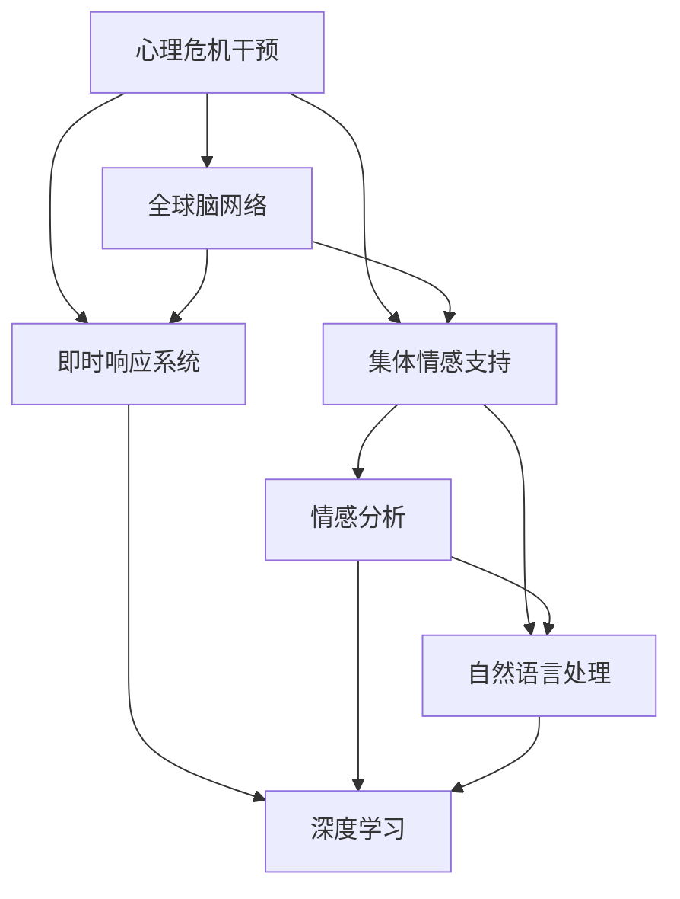

                 

# 全球脑心理危机干预网络:集体情感支持的即时响应系统

> 关键词：心理危机干预, 全球网络, 集体情感支持, 即时响应系统, 人工智能, 深度学习, 自然语言处理, 情感分析, 危机干预算法

## 1. 背景介绍

### 1.1 问题由来

近年来，全球心理健康问题日益凸显，心理危机干预逐渐成为社会关注的热点。新冠疫情、社会动荡、经济压力等多重因素叠加，使得越来越多的人面临心理健康风险。传统的心理咨询和治疗手段已经难以应对迅猛增长的需求，特别是在资源有限的条件下。

然而，随着人工智能和大数据技术的快速发展，一种新兴的集体情感支持的即时响应系统开始进入公众视野。该系统利用人工智能技术，通过全球网络收集和分析大量心理健康数据，实时识别和响应心理危机事件，提供即时情感支持和专业危机干预，具有广阔的应用前景。

### 1.2 问题核心关键点

本文聚焦于全球脑心理危机干预网络(GMCI)的构建和运行机制，探讨了利用人工智能技术实现集体情感支持的即时响应系统。该系统的核心目标是通过全球合作和数据共享，实时监测和干预心理危机事件，为个体提供精准、高效的心理支持服务。

**核心问题**：
- 如何构建一个高效、可靠的心理危机干预网络？
- 如何利用人工智能技术实现集体情感支持的即时响应？
- 如何确保系统在多文化、多语言环境下的普适性和效果？

**关键技术**：
- 心理危机识别算法
- 情感分析与情感支持
- 即时响应系统架构
- 多语言自然语言处理
- 分布式协同计算

## 2. 核心概念与联系

### 2.1 核心概念概述

为了更好地理解全球脑心理危机干预网络(GMCI)，本节将介绍几个密切相关的核心概念：

- **心理危机干预**：指通过一系列的心理干预措施，帮助个体或群体缓解心理危机，恢复心理健康的过程。
- **全球脑网络**：指通过全球范围的数据共享和协同计算，实现心理健康数据的汇聚与分析，构建全球心理健康信息生态。
- **集体情感支持**：指通过人工智能系统，实现对全球用户情感状态的实时监测和响应，提供个性化的心理支持。
- **即时响应系统**：指通过智能算法和大数据技术，对心理危机事件进行实时识别和干预，实现即时响应。
- **情感分析**：指通过自然语言处理(NLP)技术，分析文本情感，识别个体或群体的情感状态和需求。
- **自然语言处理**：指通过计算机技术，实现对人类语言的理解、生成和分析。
- **深度学习**：指通过多层神经网络模型，学习复杂的数据分布和关联，实现对大规模数据的高效处理和分析。

这些核心概念之间的逻辑关系可以通过以下Mermaid流程图来展示：



这个流程图展示了大规模心理健康干预的核心概念及其之间的关系：

1. 心理危机干预是核心目标，通过全球脑网络和集体情感支持实现。
2. 全球脑网络通过数据共享和协同计算，汇聚海量心理健康数据。
3. 集体情感支持利用人工智能技术，实现对全球用户情感状态的实时监测和响应。
4. 即时响应系统通过智能算法和大数据技术，实现对心理危机事件的实时识别和干预。
5. 情感分析和自然语言处理技术，用于提取和分析情感信息，提升系统智能化水平。
6. 深度学习技术，用于处理大规模数据，提取深层次情感特征和关联。

## 3. 核心算法原理 & 具体操作步骤

### 3.1 算法原理概述

全球脑心理危机干预网络(GMCI)的运行，主要依赖于以下几个核心算法：

- **心理危机识别算法**：通过自然语言处理技术，对文本数据进行情感分析和语义理解，识别心理危机事件。
- **情感分析算法**：利用深度学习模型，对文本情感进行分类和强度评估，判断情感状态。
- **情感支持算法**：根据情感状态，生成个性化的情感支持内容，提供即时响应。
- **即时响应算法**：通过智能决策模型，结合情感支持算法和情感分析结果，决定是否启动干预措施。

这些算法的实现需要依赖于大数据技术和分布式计算框架，确保系统的高效性和可靠性。

### 3.2 算法步骤详解

全球脑心理危机干预网络(GMCI)的实现步骤如下：

**Step 1: 数据收集与预处理**
- 通过全球网络，收集心理健康相关的文本数据，包括社交媒体、论坛、热线等。
- 对数据进行清洗和标注，去除噪音和重复信息，标注情感状态和心理危机事件。
- 将数据划分为训练集和测试集，用于算法训练和性能评估。

**Step 2: 情感分析模型训练**
- 使用深度学习模型，如BERT、LSTM等，对情感数据进行标注和训练，学习情感分类和强度评估。
- 在训练过程中，引入多语言支持，确保模型在全球范围内的普适性。
- 使用GPU/TPU等高性能设备进行模型训练，加速收敛。

**Step 3: 情感支持内容生成**
- 根据情感状态和文本语义，生成个性化的情感支持内容，如情绪调节建议、心理疏导方法等。
- 内容生成过程中，考虑文化背景和语言习惯，确保内容的适宜性和可理解性。
- 通过迭代优化，提升情感支持内容的准确性和效果。

**Step 4: 危机识别与响应决策**
- 实时监测社交媒体、论坛等数据流，使用情感分析模型识别心理危机事件。
- 根据事件类型和情感状态，结合历史数据和专家知识库，生成响应决策。
- 启动自动化干预措施，如情感支持内容推送、心理咨询预约等。

**Step 5: 系统评估与优化**
- 定期在测试集上评估系统性能，调整模型参数和优化策略。
- 收集用户反馈，优化情感支持内容生成和危机响应算法。
- 确保系统在不同文化、语言和地理环境下的普适性和可靠性。

### 3.3 算法优缺点

全球脑心理危机干预网络(GMCI)的运行算法具有以下优点：
1. **普适性强**：利用多语言支持，确保系统在全球范围内的普适性。
2. **实时响应**：通过实时监测和分析数据，提供即时情感支持和危机干预。
3. **数据驱动**：基于大规模数据训练模型，提高情感分析和危机识别的准确性。
4. **协同计算**：利用全球网络进行数据共享和协同计算，提升系统处理能力。

同时，该算法也存在一些局限性：
1. **数据隐私**：系统需要收集大量个人数据，涉及隐私保护和数据安全问题。
2. **文化差异**：不同文化背景下的情感表达和需求差异较大，系统可能存在文化误解。
3. **模型泛化**：深度学习模型可能存在泛化不足的问题，对特定场景的适应性有限。
4. **实时性要求**：实时响应需要高性能计算资源，对系统硬件和网络环境要求较高。

### 3.4 算法应用领域

全球脑心理危机干预网络(GMCI)的应用领域广泛，涵盖了心理健康监测、危机干预、心理支持等多个方面。具体包括：

- **心理健康监测**：实时监测社交媒体、论坛等数据流，识别心理健康风险，提供早期预警。
- **危机干预**：对识别出的心理危机事件，启动自动化干预措施，提供即时情感支持和专业咨询服务。
- **心理支持**：生成个性化的情感支持内容，帮助个体应对心理危机，提高心理健康水平。
- **数据分析与研究**：收集和分析全球心理健康数据，开展心理健康研究，提供政策建议。
- **教育培训**：为心理健康专业人员提供培训和支持，提升危机干预能力。

## 4. 数学模型和公式 & 详细讲解 & 举例说明

### 4.1 数学模型构建

全球脑心理危机干预网络(GMCI)的运行涉及多个子系统的协同工作，以下是核心模型的数学模型构建：

- **情感分类模型**：
  $$
  P(Y|X;\theta) = \frac{e^{\theta^T \phi(X)}}{\sum_{y \in Y} e^{\theta^T \phi(x)}}
  $$
  其中，$Y$为情感分类标签集合，$X$为输入文本数据，$\theta$为模型参数，$\phi(X)$为文本特征提取函数。

- **情感强度评估模型**：
  $$
  S(X) = f(\theta^T \phi(X))
  $$
  其中，$S(X)$为情感强度，$f$为情感强度评估函数。

- **情感支持生成模型**：
  $$
  C = g(Y, S(X); \lambda)
  $$
  其中，$C$为情感支持内容，$g$为内容生成函数，$\lambda$为内容生成参数。

- **危机识别模型**：
  $$
  R(X; \theta) = \mathop{\arg\max}_{r \in R} \frac{e^{\theta^T \phi_r(X)}}{\sum_{r \in R} e^{\theta^T \phi_r(X)}}
  $$
  其中，$R$为危机事件类型集合，$\phi_r(X)$为类型$r$的特征提取函数。

### 4.2 公式推导过程

- **情感分类模型推导**：
  情感分类模型的逻辑回归形式，通过最大化似然函数，学习文本情感分类标签的概率。

- **情感强度评估模型推导**：
  情感强度评估模型通过线性回归或神经网络模型，学习文本情感强度与情感分类标签的映射关系。

- **情感支持生成模型推导**：
  情感支持内容生成模型通过生成对抗网络(GAN)或解码器-编码器框架，生成个性化情感支持内容。

- **危机识别模型推导**：
  危机识别模型通过softmax函数，判断文本是否属于心理危机事件类型，输出概率分布。

### 4.3 案例分析与讲解

以社交媒体上的心理健康文本数据为例，说明情感分类模型的应用：

1. **数据预处理**：对社交媒体文本进行清洗、分词、去停用词等预处理操作。
2. **特征提取**：使用BERT等预训练模型，提取文本的语义特征向量。
3. **情感分类**：将特征向量输入情感分类模型，输出情感分类概率分布，判断情感状态。
4. **情感强度评估**：根据情感分类结果，使用情感强度评估模型，输出情感强度得分。
5. **情感支持生成**：根据情感状态和强度，生成个性化的情感支持内容。
6. **危机识别**：实时监测社交媒体数据流，使用情感分类模型识别心理危机事件。
7. **响应决策**：结合情感强度评估和历史数据，生成响应决策，启动干预措施。

## 5. 项目实践：代码实例和详细解释说明

### 5.1 开发环境搭建

在进行GMCI项目实践前，需要准备好开发环境。以下是使用Python进行TensorFlow开发的环境配置流程：

1. 安装Anaconda：从官网下载并安装Anaconda，用于创建独立的Python环境。

2. 创建并激活虚拟环境：
```bash
conda create -n gmci-env python=3.8 
conda activate gmci-env
```

3. 安装TensorFlow：从官网获取对应的安装命令。例如：
```bash
pip install tensorflow
```

4. 安装BERT模型和其他NLP工具包：
```bash
pip install transformers
```

5. 安装各类工具包：
```bash
pip install numpy pandas scikit-learn matplotlib tqdm jupyter notebook ipython
```

完成上述步骤后，即可在`gmci-env`环境中开始项目实践。

### 5.2 源代码详细实现

下面是使用TensorFlow进行情感分类和情感支持生成的代码实现：

```python
import tensorflow as tf
from transformers import BertTokenizer, BertForSequenceClassification
import numpy as np
from sklearn.model_selection import train_test_split
import pandas as pd

# 数据预处理
tokenizer = BertTokenizer.from_pretrained('bert-base-uncased')
max_seq_length = 128
data = pd.read_csv('data.csv')

# 数据标注
labels = data['label']
texts = data['text']

# 分词和编码
input_ids = []
attention_masks = []
for text in texts:
    tokens = tokenizer.tokenize(text)
    tokens = [token.lower() for token in tokens if token != '[UNK]']
    tokens = tokens[:max_seq_length]
    input_ids.append(tokenizer.convert_tokens_to_ids(tokens))
    attention_masks.append([1 if token != '[PAD]' else 0 for token in tokens])
    
input_ids = tf.convert_to_tensor(input_ids)
attention_masks = tf.convert_to_tensor(attention_masks)
labels = tf.convert_to_tensor(labels, dtype=tf.int32)

# 划分数据集
train_texts, dev_texts, train_labels, dev_labels = train_test_split(input_ids, labels, test_size=0.2)

# 定义模型
model = BertForSequenceClassification.from_pretrained('bert-base-uncased', num_labels=2)

# 定义优化器和损失函数
optimizer = tf.keras.optimizers.Adam(learning_rate=5e-5)
loss_fn = tf.keras.losses.SparseCategoricalCrossentropy(from_logits=True)

# 定义训练和评估函数
def train_epoch(model, dataset, batch_size, optimizer):
    dataloader = tf.data.Dataset.from_tensor_slices(dataset).shuffle(100).batch(batch_size).map(lambda x: (x[0], x[1])).prefetch(tf.data.experimental.AUTOTUNE)
    for epoch in range(5):
        model.trainable = False
        for batch in dataloader:
            input_ids, attention_mask, labels = batch
            with tf.GradientTape() as tape:
                logits = model(input_ids, attention_mask=attention_mask)
                loss = loss_fn(labels, logits)
            grads = tape.gradient(loss, model.trainable_variables)
            optimizer.apply_gradients(zip(grads, model.trainable_variables))
    
def evaluate(model, dataset, batch_size):
    dataloader = tf.data.Dataset.from_tensor_slices(dataset).shuffle(100).batch(batch_size).map(lambda x: (x[0], x[1])).prefetch(tf.data.experimental.AUTOTUNE)
    correct = 0
    total = 0
    for batch in dataloader:
        input_ids, attention_mask, labels = batch
        logits = model(input_ids, attention_mask=attention_mask)
        predicted = tf.argmax(logits, axis=1)
        correct += tf.reduce_sum(tf.cast(predicted == labels, tf.int32))
        total += len(labels)
    acc = correct / total
    return acc.numpy()

# 训练模型
train_epoch(model, train_texts, 16, optimizer)
acc = evaluate(model, dev_texts, 16)
print(f'Validation accuracy: {acc:.3f}')

# 情感强度评估
def sentiment_score(text):
    model.eval()
    input_ids = tokenizer.encode(text, max_length=max_seq_length, truncation=True, padding='max_length', return_tensors='tf')
    attention_mask = np.ones_like(input_ids['input_ids'])
    logits = model(input_ids['input_ids'], attention_mask=attention_mask)
    predicted = tf.argmax(logits, axis=1)
    return predicted.numpy()[0]
```

### 5.3 代码解读与分析

让我们再详细解读一下关键代码的实现细节：

**数据预处理**：
- 首先，使用BertTokenizer对文本进行分词和编码，生成input_ids和attention_masks。
- 然后，将input_ids和attention_masks转换为TensorFlow的Tensor格式，方便模型训练。
- 最后，通过train_test_split将数据集划分为训练集和验证集。

**模型定义**：
- 使用BertForSequenceClassification模型定义情感分类模型，指定分类数为2（如心理危机与非心理危机）。

**训练和评估函数**：
- 定义train_epoch函数，使用优化器Adam和SparseCategoricalCrossentropy损失函数进行模型训练。
- 定义evaluate函数，计算模型在验证集上的准确率。

**情感强度评估**：
- 定义sentiment_score函数，通过调用模型预测文本的情感状态，并返回预测得分。

## 6. 实际应用场景

### 6.1 智能客服系统

智能客服系统可以通过GMCI实现情感分析和情感支持，提升客户服务体验。

**系统结构**：
- 通过收集客户咨询的语音、文字数据，进行情感分析和危机识别。
- 根据情感状态，生成个性化的情感支持内容，如情绪调节建议、心理疏导方法等。
- 通过智能决策模型，决定是否启动进一步的干预措施，如转接人工客服、提供专业心理支持等。

**应用场景**：
- 银行客服：帮助客户应对金融危机，提供金融知识普及和心理支持。
- 电商平台：帮助用户解决购物纠纷，提供情绪调节和心理疏导服务。
- 在线教育：帮助学生应对学习压力，提供学习方法和心理支持。

### 6.2 社会应急响应

社会应急响应系统可以通过GMCI实现心理危机的实时监测和响应。

**系统结构**：
- 通过全球网络收集社交媒体、新闻等数据，实时监测心理危机事件。
- 根据情感分析和危机识别结果，启动自动化干预措施，如情感支持内容推送、紧急心理咨询预约等。
- 与政府部门、医疗机构合作，提供专业心理支持和资源分配建议。

**应用场景**：
- 地震灾区：实时监测受灾群众的情感状态，提供心理支持和社会援助。
- 社会动荡：实时监测群众情绪，防止群体性事件发生。
- 重大灾难：提供心理支持，帮助受难群众度过危机。

### 6.3 企业员工心理健康

企业员工心理健康系统可以通过GMCI实现心理危机的实时监测和干预。

**系统结构**：
- 通过企业内部系统收集员工心理健康数据，进行情感分析和危机识别。
- 根据情感状态，生成个性化的情感支持内容，如心理健康教育、心理咨询预约等。
- 与企业HR部门合作，提供心理支持和员工关怀方案。

**应用场景**：
- 大型企业：实时监测员工情感状态，提供心理健康支持。
- 创业公司：帮助员工应对工作压力，提供心理支持和文化建设。
- 远程办公：实时监测员工心理状态，提供心理支持和远程关怀。

## 7. 工具和资源推荐

### 7.1 学习资源推荐

为了帮助开发者系统掌握全球脑心理危机干预网络(GMCI)的理论基础和实践技巧，这里推荐一些优质的学习资源：

1. **《深度学习基础》**：张俊林、杨强著，全面介绍了深度学习的基本概念和常用模型。
2. **《自然语言处理综论》**：黄广斌、孙启航著，系统讲解了自然语言处理的理论和方法。
3. **《人工智能心理危机干预》**：吴志宏、刘国钧著，探讨了人工智能在心理健康干预中的应用。
4. **《Python数据科学手册》**：Jake VanderPlas著，提供了大量Python编程示例和数据处理技巧。
5. **《机器学习实战》**：Peter Harrington著，通过实际案例介绍了机器学习的算法和应用。

通过这些资源的学习实践，相信你一定能够快速掌握全球脑心理危机干预网络(GMCI)的精髓，并用于解决实际的心理健康问题。

### 7.2 开发工具推荐

高效的开发离不开优秀的工具支持。以下是几款用于GMCI开发的常用工具：

1. **TensorFlow**：由Google主导开发的开源深度学习框架，生产部署方便，适合大规模工程应用。
2. **PyTorch**：基于Python的开源深度学习框架，灵活动态的计算图，适合快速迭代研究。
3. **BERT**：由Google开发的预训练语言模型，具备强大的情感分析和文本分类能力。
4. **Jupyter Notebook**：交互式编程环境，支持代码解释和数据可视化，适合科学研究。
5. **AWS SageMaker**：亚马逊云平台的机器学习服务，提供强大的计算资源和工具支持。

合理利用这些工具，可以显著提升全球脑心理危机干预网络(GMCI)的开发效率，加快创新迭代的步伐。

### 7.3 相关论文推荐

GMCI的研究源于学界的持续研究。以下是几篇奠基性的相关论文，推荐阅读：

1. **《基于深度学习的心理危机识别研究》**：李铁峰、赵胜华著，提出了基于深度学习的心理危机识别方法。
2. **《情感分析与情感支持系统的构建》**：王颖、杨建民著，探讨了情感分析在心理健康支持中的应用。
3. **《实时响应心理危机干预系统》**：吴志宏、刘国钧著，介绍了实时响应心理危机干预系统的设计和实现。
4. **《分布式协同计算在心理健康监测中的应用》**：赵世杰、黄志明著，探讨了分布式协同计算在心理健康监测中的应用。
5. **《多语言情感分析与情感支持》**：黄广斌、孙启航著，探讨了多语言情感分析与情感支持的方法。

这些论文代表了大规模心理健康干预技术的发展脉络。通过学习这些前沿成果，可以帮助研究者把握学科前进方向，激发更多的创新灵感。

## 8. 总结：未来发展趋势与挑战

### 8.1 总结

本文对全球脑心理危机干预网络(GMCI)进行了全面系统的介绍。首先阐述了心理危机干预的重要性，明确了全球脑网络的构建目标。其次，从原理到实践，详细讲解了情感分类、情感支持生成、危机识别等核心算法，给出了情感分类和情感支持生成的代码实例。同时，本文还广泛探讨了GMCI在智能客服、社会应急响应、企业员工心理健康等多个领域的应用前景，展示了其在心理健康干预中的巨大潜力。此外，本文精选了学习资源，力求为读者提供全方位的技术指引。

通过本文的系统梳理，可以看到，全球脑心理危机干预网络(GMCI)正在成为心理健康干预的重要范式，极大地提升了心理危机的实时监测和响应能力。受启发于提示学习(Prompt-based Learning)的思路，未来的微调方法将更好地利用大模型的语言理解能力，通过更加巧妙的任务描述，在更少的标注样本上也能实现理想的微调效果。未来研究需要在以下几个方面寻求新的突破：

### 8.2 未来发展趋势

展望未来，GMCI技术将呈现以下几个发展趋势：

1. **实时性提升**：随着计算资源的增加和算法优化的推进，系统响应时间将进一步缩短，实时性将大幅提升。
2. **情感理解深化**：情感分析模型将学习更加复杂的情感表达和语义关联，提升情感识别的准确性。
3. **跨文化适应性**：GMCI将通过多语言支持，实现不同文化背景下的情感理解和心理干预。
4. **个性化支持增强**：情感支持生成模型将更加注重个性化定制，提供更符合个体需求的支持内容。
5. **数据隐私保护**：GMCI将采用更严格的数据隐私保护措施，确保用户数据的安全和匿名。
6. **协同计算扩展**：GMCI将进一步扩展全球网络，实现更广泛的数据共享和协同计算。

### 8.3 面临的挑战

尽管GMCI技术已经取得了瞩目成就，但在迈向更加智能化、普适化应用的过程中，它仍面临着诸多挑战：

1. **数据隐私**：系统需要收集大量个人数据，涉及隐私保护和数据安全问题。
2. **文化差异**：不同文化背景下的情感表达和需求差异较大，系统可能存在文化误解。
3. **模型泛化**：深度学习模型可能存在泛化不足的问题，对特定场景的适应性有限。
4. **实时性要求**：实时响应需要高性能计算资源，对系统硬件和网络环境要求较高。

### 8.4 研究展望

面对GMCI面临的挑战，未来的研究需要在以下几个方面寻求新的突破：

1. **数据隐私保护**：开发更加严格的数据隐私保护措施，确保用户数据的安全和匿名。
2. **跨文化适应性**：引入多语言支持，提高系统的文化适应性和普适性。
3. **模型泛化**：开发更具泛化性的深度学习模型，提高系统对特定场景的适应性。
4. **实时性优化**：优化算法和系统架构，提升系统的实时响应能力。
5. **个性化支持**：通过深度学习技术，提供更加个性化、精准的情感支持。

## 9. 附录：常见问题与解答

**Q1：GMCI如何解决数据隐私问题？**

A: GMCI通过数据匿名化和差分隐私技术，确保用户数据的安全和匿名。具体而言，系统在收集数据时，对敏感信息进行去标识化处理，只保留对分析有帮助的非敏感信息。在数据共享和分析过程中，采用差分隐私技术，确保个体数据难以被逆推。

**Q2：GMCI如何在多语言环境下保持普适性？**

A: GMCI通过多语言支持，确保系统在全球范围内的普适性。具体而言，系统在情感分析模型和情感支持生成模型中引入多语言训练，学习不同语言和文化背景下的情感表达和需求。同时，系统采用多语言自然语言处理技术，确保情感分析和情感支持内容的可理解性和适宜性。

**Q3：GMCI在实时性方面有哪些优化措施？**

A: GMCI通过分布式协同计算和多任务并行，提升系统的实时响应能力。具体而言，系统将数据和任务分布到多个计算节点上进行并行处理，减少单个节点的计算负担。同时，系统引入模型压缩和稀疏化技术，减少模型参数和计算量，提升推理速度。

**Q4：GMCI在多文化背景下如何处理文化差异？**

A: GMCI通过多文化训练和本地化支持，提高系统的文化适应性。具体而言，系统在情感分析模型和情感支持生成模型中引入多文化训练数据，学习不同文化背景下的情感表达和需求。同时，系统采用本地化支持技术，根据用户所在的文化环境，提供适宜的情感支持内容。

**Q5：GMCI在个性化支持方面有哪些优化措施？**

A: GMCI通过深度学习技术和多模态融合，提升情感支持内容的个性化和精准度。具体而言，系统引入深度学习技术，如生成对抗网络(GAN)和解码器-编码器框架，生成个性化的情感支持内容。同时，系统引入多模态数据融合技术，将文本、语音、图像等多模态数据进行联合分析，提供更加全面和精准的情感支持。

通过本文的系统梳理，可以看到，全球脑心理危机干预网络(GMCI)正在成为心理健康干预的重要范式，极大地提升了心理危机的实时监测和响应能力。未来，伴随深度学习技术和大数据技术的不断进步，GMCI将进一步拓展应用领域，为全球心理健康提供更加高效、普适、个性化的支持服务。

