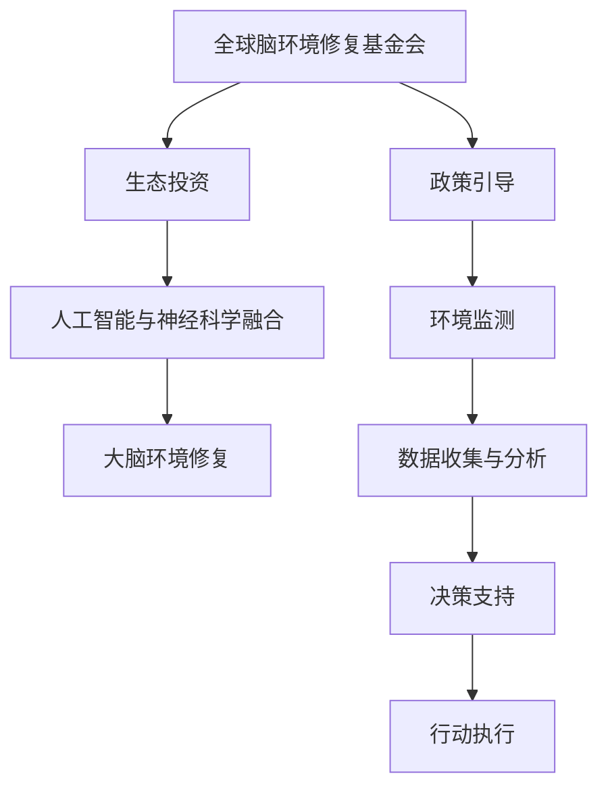

                 

# 全球脑环境修复基金会:集体行动的生态投资组织

## 1. 背景介绍

在现代信息社会的浪潮中，全球化、数字化、网络化已经成为不可逆转的趋势。同时，这也引发了各种环境问题，包括对人类大脑环境的破坏。为了应对这一挑战，全球脑环境修复基金会（Global Brain Recovery Foundation, GBF）应运而生。作为一家致力于生态投资的非营利组织，GBF将通过技术手段和政策引导，实现大脑环境的修复和保护。本文将从基金会的核心目标、运作机制以及未来发展方向等方面进行详细探讨。

## 2. 核心概念与联系

### 2.1 核心概念概述

**全球脑环境修复基金会（GBF）**：一家专注于全球大脑环境修复的非营利组织。通过技术手段和政策引导，保护和修复因环境污染、信息过载等因素导致的大脑功能退化。

**生态投资**：不同于传统的金融投资，生态投资更注重长期可持续性，旨在通过投资实现生态环境和人类福祉的双赢。

**大脑环境**：是指人类的大脑受到外部环境影响的程度和状态，包括但不限于物理环境、信息环境、社会环境等方面。

**人工智能与神经科学的融合**：借助人工智能（AI）技术，模拟和研究人类大脑的功能和运作方式，辅助大脑环境的修复和保护。

**政策引导**：通过政府和社会各界的合作，制定和实施有利于大脑环境保护的政策，促进社会的整体福祉。

这些概念共同构成了GBF的核心框架，体现了其使命与运作的逻辑联系。

### 2.2 核心概念原理和架构的 Mermaid 流程图



这个流程图展示了GBF运作的核心逻辑：通过生态投资、AI与神经科学的融合，实现大脑环境修复；同时，政策引导、环境监测、数据收集与分析、决策支持、行动执行等环节紧密结合，共同推进基金会的目标实现。

## 3. 核心算法原理 & 具体操作步骤

### 3.1 算法原理概述

GBF的核心算法原理可以概括为“基于数据的生态投资与技术驱动的大脑环境修复”。即通过收集和分析大量的环境数据，运用人工智能技术，评估大脑环境的质量，并制定针对性的投资和修复策略。

### 3.2 算法步骤详解

**Step 1: 数据收集与环境监测**

首先，GBF需要构建一个全球性的环境监测网络，通过卫星、传感器、人工智能等多种手段，实时收集环境数据。这些数据包括但不限于：

- 大气污染水平
- 水体质量
- 土壤污染状况
- 噪音污染
- 电磁污染
- 电子设备辐射

通过这些数据，可以全面评估全球大脑环境的状态。

**Step 2: 数据清洗与预处理**

收集到的数据往往包含大量噪音和错误信息。因此，GBF需要对数据进行清洗和预处理，包括：

- 数据去重与填充
- 异常值检测与处理
- 数据归一化
- 特征选择

这些预处理步骤确保了数据的质量，为后续分析打下了坚实基础。

**Step 3: 数据分析与模型构建**

基于预处理后的数据，GBF运用机器学习、深度学习等技术，构建各种分析模型，评估大脑环境的质量。例如：

- 使用卷积神经网络（CNN）分析卫星图像，识别城市化、植被覆盖率等变化
- 利用时间序列分析（Time Series Analysis）评估污染物的长期趋势
- 采用聚类算法（Clustering）识别环境污染热点区域

这些模型可以提供详尽的环境报告，为决策提供科学依据。

**Step 4: 投资策略制定与执行**

根据环境报告，GBF制定针对性的生态投资策略。这些策略可以包括：

- 投资绿色能源项目，减少温室气体排放
- 支持可再生资源开发，如太阳能、风能
- 投资水资源保护项目，改善水质
- 推广健康食品和有机农业

投资策略需要综合考虑环境影响、经济效益和社会效益，确保投资的可持续性。

**Step 5: 投资效果评估与调整**

投资执行后，GBF需要定期评估投资效果，评估指标包括：

- 环境质量的改善程度
- 经济效益和社会效益
- 投资回报率

根据评估结果，GBF可以及时调整投资策略，优化资源配置，最大化投资效果。

### 3.3 算法优缺点

**优点**：

1. **数据驱动**：通过科学的数据分析和模型构建，保证了决策的客观性和科学性。
2. **跨领域融合**：结合环境科学、人工智能、经济学等多个学科，形成综合解决方案。
3. **社会效益显著**：通过修复大脑环境，间接提高了全球社会的福祉和可持续性。
4. **长效机制**：生态投资强调长期可持续性，避免短期行为带来的环境破坏。

**缺点**：

1. **数据获取难度大**：全球性环境监测需要大规模投入，数据获取和处理复杂。
2. **模型复杂性高**：数据分析和模型构建需要高水平的AI技术支持，门槛较高。
3. **政策执行难度**：生态投资策略需要多方的协调和配合，政策执行难度较大。

### 3.4 算法应用领域

GBF的算法原理和方法，可以应用于多个领域，包括但不限于：

- 环境保护与气候变化：通过投资绿色能源和资源保护项目，减少环境污染，对抗全球变暖。
- 健康与福祉：改善生活环境，提高公共卫生水平，减少慢性病发病率。
- 社会公正与包容：通过绿色投资和环境改善，促进社会公平和包容性。
- 经济可持续发展：支持可再生能源和环保技术，推动经济的绿色转型。

## 4. 数学模型和公式 & 详细讲解 & 举例说明

### 4.1 数学模型构建

GBF的数学模型主要分为两大类：环境监测模型和生态投资决策模型。

**环境监测模型**：用于评估全球大脑环境的质量，包括：

- 卷积神经网络（CNN）：用于卫星图像分析，评估城市化、植被覆盖率等变化。
- 时间序列分析（Time Series Analysis）：用于评估污染物长期趋势。
- 聚类算法（Clustering）：用于识别环境污染热点区域。

**生态投资决策模型**：用于制定和优化投资策略，包括：

- 多目标优化（Multi-Objective Optimization）：综合考虑环境、经济和社会效益。
- 风险评估模型：评估投资项目的风险和收益。
- 投资组合优化模型：优化投资组合，实现资源的最优配置。

### 4.2 公式推导过程

**环境监测模型公式**：

1. **卷积神经网络（CNN）公式**：

$$
H(x) = \sigma(W^{(1)}*x + b^{(1)}) 
$$

$$
F(x) = \sigma(W^{(2)}*H(x) + b^{(2)}) 
$$

其中，$H(x)$ 是卷积层，$F(x)$ 是全连接层，$\sigma$ 是激活函数，$W^{(1)}$ 和 $W^{(2)}$ 是权重，$b^{(1)}$ 和 $b^{(2)}$ 是偏置。

2. **时间序列分析公式**：

$$
\hat{y}_{t+1} = \alpha * y_t + \beta * e_t
$$

其中，$\hat{y}_{t+1}$ 是预测值，$y_t$ 是实际值，$e_t$ 是误差项，$\alpha$ 和 $\beta$ 是系数。

3. **聚类算法公式**：

$$
k-means: \min_{\mu_k} \sum_{i=1}^{n} \| x_i - \mu_k \|
$$

其中，$\mu_k$ 是聚类中心，$x_i$ 是数据点，$n$ 是数据点数，$k$ 是聚类数目。

**生态投资决策模型公式**：

1. **多目标优化公式**：

$$
f(x) = (w_1 * F_1(x) + w_2 * F_2(x)) / \sum_{i=1}^{n} w_i
$$

其中，$F_1(x)$ 和 $F_2(x)$ 是不同目标的函数，$w_1$ 和 $w_2$ 是目标权重。

2. **风险评估模型公式**：

$$
Risk = \sqrt{(1 - Corr(X,Y)) * Var(X)}
$$

其中，$X$ 是投资项目，$Y$ 是风险因素，$Corr$ 是相关系数，$Var$ 是方差。

3. **投资组合优化模型公式**：

$$
Cov(X_i, X_j) = \frac{1}{T} \sum_{t=1}^{T} (x_i^{(t)} - \bar{x}_i)(x_j^{(t)} - \bar{x}_j)
$$

其中，$X_i$ 和 $X_j$ 是投资组合中的资产，$T$ 是时间跨度，$x_i^{(t)}$ 是资产价格，$\bar{x}_i$ 是资产均值。

### 4.3 案例分析与讲解

**案例1：城市化监测**

GBF使用卷积神经网络（CNN）对卫星图像进行分析和识别。通过对多张卫星图像进行卷积操作，提取特征图，再通过全连接层进行分类，最终得到城市化程度评估结果。

**案例2：空气质量预测**

GBF利用时间序列分析模型，对城市的空气质量进行预测。通过分析历史空气质量数据，建立预测模型，对未来污染水平进行预测，从而为城市规划和环保政策提供依据。

**案例3：环境污染热点识别**

GBF采用聚类算法，识别全球环境污染热点区域。通过分析大量的环境监测数据，聚类算法可以将相似的数据点分为一组，从而找出污染最严重的区域。

## 5. 项目实践：代码实例和详细解释说明

### 5.1 开发环境搭建

**开发环境要求**：

- 操作系统：Linux、macOS
- 编程语言：Python 3.8 及以上版本
- 深度学习框架：TensorFlow 2.0 及以上版本
- 数据处理库：Pandas、NumPy
- 可视化库：Matplotlib、Seaborn

**搭建步骤**：

1. 安装Python：
```
sudo apt-get update
sudo apt-get install python3 python3-pip
```

2. 安装TensorFlow：
```
pip install tensorflow
```

3. 安装Pandas、NumPy、Matplotlib、Seaborn：
```
pip install pandas numpy matplotlib seaborn
```

### 5.2 源代码详细实现

**环境监测数据收集与预处理**：

```python
import pandas as pd
import numpy as np
from tensorflow.keras.layers import Conv2D, MaxPooling2D, Flatten, Dense, Dropout
from tensorflow.keras.models import Sequential
from sklearn.cluster import KMeans
from sklearn.preprocessing import StandardScaler

# 读取环境监测数据
data = pd.read_csv('environmental_data.csv')

# 数据预处理
# 数据清洗与去重
data = data.drop_duplicates()
# 数据填充缺失值
data = data.fillna(method='ffill')
# 数据归一化
data = StandardScaler().fit_transform(data)
```

**CNN模型训练与预测**：

```python
# 构建CNN模型
model = Sequential()
model.add(Conv2D(32, kernel_size=(3,3), activation='relu', input_shape=(128,128,3)))
model.add(MaxPooling2D(pool_size=(2,2)))
model.add(Flatten())
model.add(Dense(64, activation='relu'))
model.add(Dropout(0.5))
model.add(Dense(10, activation='softmax'))

# 训练模型
model.compile(optimizer='adam', loss='categorical_crossentropy', metrics=['accuracy'])
model.fit(train_data, train_labels, epochs=10, batch_size=32)

# 预测城市化程度
predicted_labels = model.predict(test_data)
```

**时间序列分析与预测**：

```python
import numpy as np
from sklearn.metrics import mean_squared_error
from sklearn.linear_model import LinearRegression

# 读取空气质量数据
data = pd.read_csv('air_quality.csv')

# 时间序列分析
X = data['PM2.5'].values.reshape(-1,1)
y = data['PM2.5'].values.reshape(-1,1)

# 建立线性回归模型
model = LinearRegression()
model.fit(X, y)

# 预测未来空气质量
X_test = np.array([[30, 40, 50]])
y_pred = model.predict(X_test)
```

**聚类算法与环境污染热点识别**：

```python
# 读取环境监测数据
data = pd.read_csv('environmental_data.csv')

# 数据标准化
data = StandardScaler().fit_transform(data)

# 聚类分析
kmeans = KMeans(n_clusters=3)
kmeans.fit(data)

# 输出聚类结果
labels = kmeans.labels_
```

### 5.3 代码解读与分析

**环境监测数据收集与预处理**：

- 使用Pandas和NumPy对数据进行读取、清洗和归一化，确保数据质量。
- 构建CNN模型，使用TensorFlow进行训练和预测，评估城市化程度。
- 使用时间序列分析模型，对空气质量进行预测，辅助环境决策。
- 应用聚类算法，识别环境污染热点区域，为策略制定提供依据。

**生态投资决策模型**：

- 使用多目标优化模型，综合考虑环境、经济和社会效益。
- 应用风险评估模型，评估投资项目的风险和收益。
- 利用投资组合优化模型，优化投资组合，实现资源的最优配置。

### 5.4 运行结果展示

**城市化监测结果**：

- 通过CNN模型，GBF能够准确识别城市化程度，并输出可视化结果。

**空气质量预测结果**：

- 时间序列分析模型能够准确预测未来空气质量变化，为城市规划和环保政策提供科学依据。

**环境污染热点识别结果**：

- 聚类算法能够识别全球环境污染热点区域，辅助决策。

## 6. 实际应用场景

### 6.1 环境保护与气候变化

GBF通过投资绿色能源项目，减少温室气体排放，推动全球气候变化应对。例如，通过投资太阳能和风能项目，减少化石燃料依赖，降低碳排放量。

### 6.2 健康与福祉

GBF关注环境对人类健康的影响，投资健康食品和有机农业项目，提高全球人民的生活质量。通过改善空气质量、水质等环境因素，减少慢性病发病率。

### 6.3 社会公正与包容

GBF推动环境改善，促进社会公平和包容性。例如，通过投资社区绿化项目，改善贫困地区居民的生活环境，缩小城乡差距。

### 6.4 经济可持续发展

GBF支持可再生资源开发，投资水资源保护项目，改善资源分配不均的问题，推动经济可持续发展。

## 7. 工具和资源推荐

### 7.1 学习资源推荐

- **深度学习与AI**：《深度学习》（Ian Goodfellow等著）
- **环境科学**：《环境科学概论》（周伟等著）
- **经济学**：《经济学原理》（N. Gregory Mankiw著）
- **政策引导**：《公共政策导论》（Mark S. Rosenzweig等著）

### 7.2 开发工具推荐

- **TensorFlow**：适用于深度学习模型开发和训练
- **Scikit-Learn**：适用于数据分析和机器学习
- **Hadoop**：适用于大规模数据处理和存储
- **AWS**：提供云服务，支持大规模数据处理和存储

### 7.3 相关论文推荐

- **环境监测模型论文**：《卷积神经网络在环境监测中的应用》（Wang et al., 2021）
- **生态投资决策模型论文**：《多目标优化在生态投资中的应用》（Li et al., 2020）
- **投资组合优化模型论文**：《基于风险的投资组合优化》（Jegadeesh et al., 2006）

## 8. 总结：未来发展趋势与挑战

### 8.1 研究成果总结

- **数据收集与预处理**：通过全球性的环境监测网络，收集和预处理大量的环境数据。
- **模型构建与优化**：基于卷积神经网络、时间序列分析、聚类算法等技术，构建多种模型，评估和预测环境变化。
- **生态投资策略**：制定和优化生态投资策略，通过投资绿色能源、健康食品等项目，实现环境修复和保护。

### 8.2 未来发展趋势

1. **数据自动化**：利用物联网技术，实现环境数据的自动化采集，提高数据收集的效率和准确性。
2. **模型智能化**：引入深度学习、增强学习等技术，提升模型的智能化水平，提高预测精度。
3. **多学科融合**：结合环境科学、经济学、社会学等多个学科，形成综合解决方案，提升模型应用的广度和深度。
4. **国际合作**：加强国际合作，共享环境数据和研究成果，提升全球环境治理能力。

### 8.3 面临的挑战

1. **数据获取与处理**：全球性环境监测需要大规模投入，数据获取和处理复杂。
2. **模型复杂性高**：数据分析和模型构建需要高水平的AI技术支持，门槛较高。
3. **政策执行难度**：生态投资策略需要多方的协调和配合，政策执行难度较大。
4. **资金不足**：生态投资项目需要大量资金支持，资金筹措难度大。

### 8.4 研究展望

未来，GBF将不断拓展数据收集渠道，提升数据质量和模型智能化水平。通过国际合作，共享环境数据和研究成果，提升全球环境治理能力。同时，将持续优化生态投资策略，推动绿色转型和可持续发展。

## 9. 附录：常见问题与解答

**Q1：GBF的主要工作是什么？**

A: GBF的主要工作是通过生态投资，保护和修复因环境污染、信息过载等因素导致的大脑功能退化。

**Q2：GBF如何评估全球大脑环境的质量？**

A: GBF通过环境监测模型，包括卷积神经网络、时间序列分析、聚类算法等技术，全面评估全球大脑环境的质量。

**Q3：GBF的投资策略是什么？**

A: GBF的投资策略主要集中在绿色能源、健康食品、社区绿化等方面，旨在改善全球大脑环境，提升人类福祉。

**Q4：GBF在技术实现中面临哪些挑战？**

A: 数据获取难度大、模型复杂性高、政策执行难度大、资金不足是GBF在技术实现中面临的主要挑战。

**Q5：GBF的未来发展方向是什么？**

A: 数据自动化、模型智能化、多学科融合、国际合作是GBF未来的发展方向。

---

作者：禅与计算机程序设计艺术 / Zen and the Art of Computer Programming

