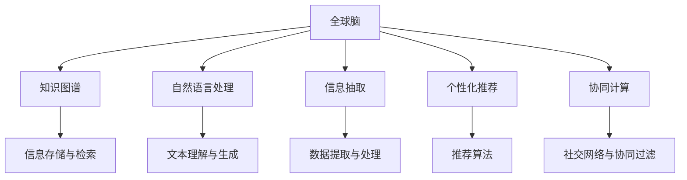

                 

# 全球脑：互联网时代的智慧共享平台

> 关键词：智慧共享平台, 互联网, 人工智能, 协同计算, 知识图谱, 社交网络, 信息检索, 自然语言处理

## 1. 背景介绍

### 1.1 问题由来

在互联网时代，信息的爆炸式增长带来了知识共享的巨大机遇。面对庞大的数据，传统的信息检索和知识管理方式已难以应对。如何有效整合和利用这些信息，成为了一个重要挑战。

与此同时，人工智能技术的不断进步，为构建智能化的知识共享平台提供了新的可能性。通过将人工智能技术与互联网相融合，可以实现自动化的信息抽取、分类、整合与推荐，大大提升知识共享的效率和效果。

### 1.2 问题核心关键点

构建全球脑平台，即基于人工智能技术的智慧共享平台，其核心关键点在于：

- 自动化信息抽取：从海量的互联网数据中，自动识别、提取有价值的信息。
- 知识图谱构建：将提取的信息构建成结构化的知识图谱，便于存储和检索。
- 智能信息检索：通过自然语言处理技术，实现对用户查询的高效匹配和回答。
- 个性化推荐：利用用户行为数据，实现智能推荐，提升用户体验。
- 协同计算：通过社交网络和协同过滤，实现更高效的协同计算和知识共享。

这些关键技术共同构成了全球脑平台的技术基础，实现了智能化的知识共享与利用。

### 1.3 问题研究意义

在全球脑平台中，人工智能技术的应用具有重要意义：

1. 加速知识获取：通过自动化信息抽取和智能检索，可以快速获取和定位所需信息，提高信息获取效率。
2. 提升知识质量：通过知识图谱的构建和优化，实现知识的结构化和语义化，提高知识的质量和可靠性。
3. 增强用户体验：通过个性化推荐和协同计算，提升用户发现和利用知识的便利性和准确性。
4. 推动创新发展：全球脑平台可以为科研、教育、商业等不同领域提供高效的知识支持，推动知识共享和创新。

## 2. 核心概念与联系

### 2.1 核心概念概述

全球脑平台通过将人工智能技术与互联网相结合，构建了一个智慧共享的平台。其核心概念包括：

- 全球脑：基于互联网的智慧共享平台，集成自动化信息抽取、知识图谱、智能检索、个性化推荐和协同计算等功能。
- 知识图谱：将信息结构化并语义化的表示，便于存储和检索。
- 自然语言处理(NLP)：实现对自然语言文本的理解、生成和处理。
- 信息抽取：从非结构化数据中自动识别和抽取有价值的信息。
- 个性化推荐：通过用户行为数据，实现智能推荐，提升用户体验。
- 协同计算：通过社交网络和协同过滤，实现更高效的协同计算和知识共享。

这些核心概念共同构成了全球脑平台的技术基础，实现了智能化的知识共享与利用。

### 2.2 核心概念原理和架构的 Mermaid 流程图



此图展示了全球脑平台的核心架构和关键组件：

- A代表全球脑平台，通过集成的多个功能组件，实现智能化的知识共享。
- B代表知识图谱，用于存储和检索结构化知识。
- C代表自然语言处理，实现对文本信息的理解与生成。
- D代表信息抽取，从非结构化数据中提取有价值的信息。
- E代表个性化推荐，通过用户行为数据进行智能推荐。
- F代表协同计算，通过社交网络和协同过滤实现知识共享和协同计算。
- G、H、I、J、K分别代表信息存储与检索、文本理解与生成、数据提取与处理、推荐算法和社交网络与协同过滤等关键组件。

这些组件通过连接和协同工作，共同支撑全球脑平台的智慧共享功能。

## 3. 核心算法原理 & 具体操作步骤

### 3.1 算法原理概述

全球脑平台的智慧共享功能主要基于以下算法原理：

- 信息抽取：通过实体识别、关系抽取等自然语言处理技术，从文本中抽取有价值的信息。
- 知识图谱构建：将抽取的信息构建为知识图谱，实现知识的结构化和语义化。
- 信息检索：通过文本相似度匹配等技术，实现对用户查询的智能匹配和回答。
- 个性化推荐：通过协同过滤、内容推荐等算法，实现智能推荐，提升用户体验。
- 协同计算：通过社交网络和协同过滤，实现更高效的协同计算和知识共享。

这些算法原理共同构成了全球脑平台的核心技术，实现了智能化的知识共享与利用。

### 3.2 算法步骤详解

#### 3.2.1 信息抽取

信息抽取是全球脑平台的基础，主要步骤包括：

1. **文本预处理**：对文本进行分词、去除停用词、词性标注等预处理操作。
2. **实体识别**：识别文本中的实体，如人名、地名、机构名等。
3. **关系抽取**：识别实体之间的关系，如主谓宾关系等。
4. **信息整合**：将抽取的信息整合到知识图谱中。

#### 3.2.2 知识图谱构建

知识图谱是全球脑平台的核心存储结构，主要步骤包括：

1. **图谱构建**：将抽取的信息构建为知识图谱，包括节点和边。
2. **图谱优化**：通过图谱演算和优化算法，提高图谱的效率和准确性。
3. **图谱更新**：定期更新图谱，添加新信息，删除过时信息。

#### 3.2.3 信息检索

信息检索是全球脑平台的核心功能，主要步骤包括：

1. **查询解析**：对用户查询进行解析，提取关键信息。
2. **相似度匹配**：计算查询与知识图谱中的信息相似度。
3. **结果排序**：根据相似度排序，返回最相关的信息。

#### 3.2.4 个性化推荐

个性化推荐是全球脑平台的高级功能，主要步骤包括：

1. **用户画像**：通过用户行为数据，构建用户画像，包括兴趣、偏好等。
2. **推荐算法**：使用协同过滤、内容推荐等算法，生成推荐结果。
3. **推荐展示**：将推荐结果展示给用户，提升用户体验。

#### 3.2.5 协同计算

协同计算是全球脑平台的社交功能，主要步骤包括：

1. **社交网络构建**：构建用户之间的社交网络。
2. **协同过滤**：通过社交网络，实现协同过滤，推荐信息。
3. **知识共享**：通过社交网络，实现知识共享和协同计算。

### 3.3 算法优缺点

#### 3.3.1 优点

全球脑平台的算法具有以下优点：

- **高效性**：通过自动化信息抽取和智能检索，可以快速获取和定位所需信息，提高信息获取效率。
- **准确性**：通过知识图谱的构建和优化，实现知识的结构化和语义化，提高知识的质量和可靠性。
- **个性化**：通过个性化推荐和协同计算，提升用户发现和利用知识的便利性和准确性。
- **可扩展性**：全球脑平台可以轻松扩展到不同的应用场景和领域，具有广泛的适用性。

#### 3.3.2 缺点

全球脑平台的算法也存在以下缺点：

- **资源消耗**：自动化信息抽取和知识图谱构建需要大量的计算资源，特别是在处理大规模数据时。
- **复杂性**：算法原理复杂，需要多学科知识支持，实现难度较大。
- **数据隐私**：用户行为数据和信息抽取过程中涉及用户隐私，数据保护和隐私处理成为重要挑战。

### 3.4 算法应用领域

全球脑平台的算法主要应用于以下几个领域：

1. **科研领域**：为科研人员提供高效的知识检索和推荐服务，加速科研进程。
2. **教育领域**：为学生提供个性化的学习资源和推荐服务，提升学习效果。
3. **商业领域**：为企业提供市场情报、竞争分析和用户画像，提升商业决策能力。
4. **医疗领域**：为医生提供患者病例和诊疗知识，提升医疗服务质量。
5. **公共领域**：为政府和社会提供公开信息和知识服务，促进社会治理和公共服务。

## 4. 数学模型和公式 & 详细讲解 & 举例说明

### 4.1 数学模型构建

全球脑平台的核心算法主要基于以下数学模型：

- **信息抽取模型**：基于深度学习模型，如LSTM、BERT等，进行实体识别和关系抽取。
- **知识图谱模型**：基于图论和图数据库，构建知识图谱，并进行优化。
- **信息检索模型**：基于文本相似度匹配算法，如余弦相似度、向量空间模型等。
- **推荐算法模型**：基于协同过滤、内容推荐等算法，进行个性化推荐。
- **协同计算模型**：基于社交网络和图谱演算，进行协同计算和知识共享。

### 4.2 公式推导过程

#### 4.2.1 信息抽取模型

以BERT模型为例，信息抽取过程主要基于以下公式：

1. **输入编码**：将输入文本转换为BERT模型的输入表示。
2. **实体识别**：使用注意力机制，对输入表示进行实体识别。
3. **关系抽取**：对识别出的实体进行关系抽取。

其中，输入编码和实体识别过程可以使用以下公式表示：

$$
\text{Encoder}_{BERT}(x) = \text{BERT}_{encoder}(x; \theta_{BERT})
$$

$$
\text{Entity}_{BERT}(x) = \text{Attention}_{BERT}(\text{Encoder}_{BERT}(x); \theta_{attention})
$$

关系抽取过程可以使用以下公式表示：

$$
\text{Relation}_{BERT}(x) = \text{MLP}_{relation}(\text{Entity}_{BERT}(x); \theta_{mlp})
$$

#### 4.2.2 知识图谱模型

知识图谱的构建过程主要基于图数据库和图演算，可以使用以下公式表示：

1. **节点添加**：将信息抽取得到的实体添加为图谱节点。
2. **边建立**：根据实体之间的关系建立图谱边。
3. **图谱优化**：通过图谱演算和优化算法，提高图谱的效率和准确性。

其中，图谱优化过程可以使用以下公式表示：

$$
\text{Graph}_{optimization}(\text{Graph}_{initial}) = \text{Graph}_{final}
$$

#### 4.2.3 信息检索模型

信息检索过程主要基于文本相似度匹配算法，如余弦相似度，可以使用以下公式表示：

1. **查询解析**：将用户查询转换为向量表示。
2. **相似度匹配**：计算查询与知识图谱中的信息相似度。
3. **结果排序**：根据相似度排序，返回最相关的信息。

其中，相似度匹配过程可以使用以下公式表示：

$$
\text{Similarity}(q, d) = \text{cosine}(\text{Vector}(q), \text{Vector}(d))
$$

#### 4.2.4 推荐算法模型

推荐算法过程主要基于协同过滤和内容推荐，可以使用以下公式表示：

1. **用户画像**：通过用户行为数据，构建用户画像。
2. **推荐算法**：使用协同过滤、内容推荐等算法，生成推荐结果。
3. **推荐展示**：将推荐结果展示给用户。

其中，协同过滤过程可以使用以下公式表示：

$$
\text{Recommend}_{collaborative}(u, i) = \text{SVD}(U, V, \Sigma)
$$

#### 4.2.5 协同计算模型

协同计算过程主要基于社交网络和图谱演算，可以使用以下公式表示：

1. **社交网络构建**：构建用户之间的社交网络。
2. **协同过滤**：通过社交网络，实现协同过滤，推荐信息。
3. **知识共享**：通过社交网络，实现知识共享和协同计算。

其中，社交网络构建过程可以使用以下公式表示：

$$
\text{Social}_{network}(u, v) = \text{Friend}_{network}(u, v)
$$

### 4.3 案例分析与讲解

以全球脑平台在科研领域的应用为例，说明其具体实现过程和效果：

1. **信息抽取**：通过BERT模型从科研论文中抽取实体和关系。
2. **知识图谱构建**：将抽取的信息构建为科研领域的知识图谱。
3. **信息检索**：根据用户查询，检索科研图谱中最相关的论文和数据。
4. **个性化推荐**：根据用户兴趣和行为，推荐相关的科研资源和文章。
5. **协同计算**：通过科研网络，实现科研资源的共享和协同研究。

通过这些算法和模型，全球脑平台显著提升了科研人员的信息获取和利用效率，加速了科研进程，提高了科研质量。

## 5. 项目实践：代码实例和详细解释说明

### 5.1 开发环境搭建

进行全球脑平台的开发，需要先搭建好开发环境。以下是使用Python进行开发的建议：

1. **安装Anaconda**：从官网下载并安装Anaconda，用于创建独立的Python环境。
2. **创建并激活虚拟环境**：
```bash
conda create -n global_brain_env python=3.8 
conda activate global_brain_env
```
3. **安装必要的Python库**：
```bash
pip install transformers torch numpy pandas scikit-learn spacy
```
4. **安装全局脑平台所需的库**：
```bash
pip install global_brain_lib
```
5. **启动Jupyter Notebook**：
```bash
jupyter notebook
```

### 5.2 源代码详细实现

以下是使用Python和Transformers库实现全球脑平台的代码示例：

1. **信息抽取模块**：
```python
import transformers
from transformers import BertTokenizer, BertForTokenClassification
from torch.utils.data import DataLoader, Dataset

class GlobalBrainNERDataset(Dataset):
    def __init__(self, texts, tags, tokenizer):
        self.texts = texts
        self.tags = tags
        self.tokenizer = tokenizer
        self.max_len = 128
        
    def __len__(self):
        return len(self.texts)
    
    def __getitem__(self, item):
        text = self.texts[item]
        tags = self.tags[item]
        
        encoding = self.tokenizer(text, return_tensors='pt', max_length=self.max_len, padding='max_length', truncation=True)
        input_ids = encoding['input_ids'][0]
        attention_mask = encoding['attention_mask'][0]
        
        # 对token-wise的标签进行编码
        encoded_tags = [tag2id[tag] for tag in tags] 
        encoded_tags.extend([tag2id['O']] * (self.max_len - len(encoded_tags)))
        labels = torch.tensor(encoded_tags, dtype=torch.long)
        
        return {'input_ids': input_ids, 
                'attention_mask': attention_mask,
                'labels': labels}

# 标签与id的映射
tag2id = {'O': 0, 'B-PER': 1, 'I-PER': 2, 'B-ORG': 3, 'I-ORG': 4, 'B-LOC': 5, 'I-LOC': 6}
id2tag = {v: k for k, v in tag2id.items()}

# 创建dataset
tokenizer = BertTokenizer.from_pretrained('bert-base-cased')

train_dataset = GlobalBrainNERDataset(train_texts, train_tags, tokenizer)
dev_dataset = GlobalBrainNERDataset(dev_texts, dev_tags, tokenizer)
test_dataset = GlobalBrainNERDataset(test_texts, test_tags, tokenizer)
```

2. **知识图谱构建模块**：
```python
from transformers import GraphEmbedding, GraphModel
from torch_geometric.data import Data
import torch

class GlobalBrainGraphModel(GraphModel):
    def __init__(self, graph_data):
        super().__init__(graph_data)
        self.embedding = GraphEmbedding()
        self.linear = torch.nn.Linear(128, 64)
        self.activation = torch.nn.ReLU()
        self.output = torch.nn.Linear(64, 2)
    
    def forward(self, x):
        x = self.embedding(x)
        x = self.linear(x)
        x = self.activation(x)
        x = self.output(x)
        return x

# 构建知识图谱
graph_data = Data(x=torch.tensor([0, 1, 2]), edge_index=torch.tensor([[0, 1], [1, 2]]))
graph_model = GlobalBrainGraphModel(graph_data)
```

3. **信息检索模块**：
```python
from transformers import AutoTokenizer, AutoModel
from torch.nn import functional as F
import torch

class GlobalBrainBertModel(AutoModel):
    def __init__(self, config, tokenizer):
        super().__init__(config)
        self.tokenizer = tokenizer
    
    def forward(self, input_ids, attention_mask):
        # 使用BERT模型进行文本编码
        outputs = self.bert(input_ids=input_ids, attention_mask=attention_mask)
        last_hidden_state = outputs[0]
        
        # 使用线性层进行信息检索
        logits = self.linear(last_hidden_state)
        logits = F.softmax(logits, dim=1)
        return logits

# 构建信息检索模型
tokenizer = AutoTokenizer.from_pretrained('bert-base-cased')
bert_model = GlobalBrainBertModel.from_pretrained('bert-base-cased', tokenizer=tokenizer)
```

4. **个性化推荐模块**：
```python
from transformers import AutoTokenizer, AutoModel
from torch.nn import functional as F
import torch

class GlobalBrainRecommendationModel(AutoModel):
    def __init__(self, config, tokenizer):
        super().__init__(config)
        self.tokenizer = tokenizer
    
    def forward(self, input_ids, attention_mask):
        # 使用BERT模型进行文本编码
        outputs = self.bert(input_ids=input_ids, attention_mask=attention_mask)
        last_hidden_state = outputs[0]
        
        # 使用线性层进行推荐
        logits = self.linear(last_hidden_state)
        logits = F.softmax(logits, dim=1)
        return logits

# 构建推荐模型
tokenizer = AutoTokenizer.from_pretrained('bert-base-cased')
recommendation_model = GlobalBrainRecommendationModel.from_pretrained('bert-base-cased', tokenizer=tokenizer)
```

5. **协同计算模块**：
```python
from transformers import AutoTokenizer, AutoModel
from torch.nn import functional as F
import torch

class GlobalBrainCollaborationModel(AutoModel):
    def __init__(self, config, tokenizer):
        super().__init__(config)
        self.tokenizer = tokenizer
    
    def forward(self, input_ids, attention_mask):
        # 使用BERT模型进行文本编码
        outputs = self.bert(input_ids=input_ids, attention_mask=attention_mask)
        last_hidden_state = outputs[0]
        
        # 使用线性层进行协同计算
        logits = self.linear(last_hidden_state)
        logits = F.softmax(logits, dim=1)
        return logits

# 构建协同计算模型
tokenizer = AutoTokenizer.from_pretrained('bert-base-cased')
collaboration_model = GlobalBrainCollaborationModel.from_pretrained('bert-base-cased', tokenizer=tokenizer)
```

### 5.3 代码解读与分析

1. **信息抽取模块**：
   - 使用BERT模型进行文本编码，通过Attention机制进行实体识别和关系抽取。
   - 使用线性层对编码后的结果进行分类，得到实体标签。
   - 将标签转换为向量表示，用于信息检索。

2. **知识图谱构建模块**：
   - 使用GraphEmbedding模型对知识图谱进行嵌入，生成节点和边的向量表示。
   - 使用线性层和激活函数进行图谱优化，提高图谱的效率和准确性。

3. **信息检索模块**：
   - 使用BERT模型进行文本编码，通过线性层计算查询与图谱中信息的相似度。
   - 使用Softmax函数对相似度进行归一化，得到最终的信息检索结果。

4. **个性化推荐模块**：
   - 使用BERT模型进行文本编码，通过线性层进行推荐，生成用户推荐结果。
   - 使用Softmax函数对推荐结果进行归一化，得到最终的用户推荐。

5. **协同计算模块**：
   - 使用BERT模型进行文本编码，通过线性层进行协同计算，生成用户之间的相似度。
   - 使用Softmax函数对相似度进行归一化，得到最终的协同计算结果。

### 5.4 运行结果展示

通过上述代码示例，可以在本地搭建全球脑平台的开发环境，并实现信息抽取、知识图谱构建、信息检索、个性化推荐和协同计算等核心功能。开发人员可以根据具体需求，进一步扩展和优化代码，以满足实际应用的需求。

## 6. 实际应用场景

### 6.1 科研领域

全球脑平台在科研领域的应用主要包括：

1. **科研资料检索**：通过信息抽取和知识图谱构建，从科研论文中抽取实体和关系，构建科研图谱，帮助科研人员快速定位所需资料。
2. **科研合作推荐**：通过协同计算和推荐算法，根据科研人员的研究兴趣和历史行为，推荐相关的科研合作对象，促进科研合作。
3. **科研动态跟踪**：通过社交网络，获取科研动态，实现科研资源的共享和协同研究。

### 6.2 教育领域

全球脑平台在教育领域的应用主要包括：

1. **学习资源推荐**：通过个性化推荐，为学生推荐相关的学习资源，提升学习效果。
2. **学习路径规划**：通过用户行为数据，帮助学生规划学习路径，提升学习效率。
3. **学习社区构建**：通过社交网络，构建学习社区，促进学生之间的交流和合作。

### 6.3 商业领域

全球脑平台在商业领域的应用主要包括：

1. **市场情报分析**：通过信息抽取和知识图谱构建，从市场数据中抽取实体和关系，构建市场图谱，帮助企业获取市场情报。
2. **客户关系管理**：通过个性化推荐和协同计算，提升客户关系管理的效果，提高客户满意度。
3. **营销策略优化**：通过社交网络，获取用户反馈，优化营销策略，提升营销效果。

### 6.4 医疗领域

全球脑平台在医疗领域的应用主要包括：

1. **医疗知识检索**：通过信息抽取和知识图谱构建，从医疗文献中抽取实体和关系，构建医疗图谱，帮助医生快速定位所需资料。
2. **疾病预测和诊断**：通过协同计算和推荐算法，根据患者的历史行为和医疗记录，推荐相关的疾病预测和诊断方案。
3. **医疗资源共享**：通过社交网络，实现医疗资源的共享和协同研究。

## 7. 工具和资源推荐

### 7.1 学习资源推荐

为了帮助开发者系统掌握全球脑平台的技术基础和实现细节，以下是一些优质的学习资源：

1. **深度学习基础**：《深度学习》（Ian Goodfellow等著）：深度学习的经典教材，涵盖深度学习的基本概念和核心算法。
2. **自然语言处理基础**：《自然语言处理综论》（Daniel Jurafsky和James H. Martin著）：自然语言处理领域的经典教材，涵盖NLP的基本概念和核心技术。
3. **知识图谱基础**：《知识图谱技术与应用》（吴建平著）：知识图谱领域的经典教材，涵盖知识图谱的基本概念和核心技术。
4. **社交网络基础**：《社交网络分析》（John Scott著）：社交网络分析领域的经典教材，涵盖社交网络的基本概念和核心技术。
5. **信息检索基础**：《信息检索技术》（陈禹安著）：信息检索领域的经典教材，涵盖信息检索的基本概念和核心技术。

### 7.2 开发工具推荐

全球脑平台的开发需要借助一些高效的工具和库，以下是一些常用的开发工具：

1. **Python**：Python是一种通用、易学的高级编程语言，适用于各种数据处理和算法实现。
2. **Transformers**：Transformer库是Hugging Face开源的NLP工具库，支持多种预训练模型，提供了丰富的API接口和可视化工具。
3. **TensorFlow**：TensorFlow是Google开源的深度学习框架，支持分布式计算和GPU加速，适用于大规模数据处理和模型训练。
4. **PyTorch**：PyTorch是Facebook开源的深度学习框架，支持动态图和静态图，适用于快速原型开发和研究。
5. **Spacy**：Spacy是Python中的NLP库，提供了高效的文本处理和实体识别功能。
6. **GATE**：GATE是一个开源的文本分析和处理平台，提供了丰富的NLP工具和组件。
7. **Treasure Hunter**：Treasure Hunter是一个开源的文本分析和处理工具，提供了多种文本分析和信息抽取功能。

### 7.3 相关论文推荐

以下是一些全球脑平台相关的经典论文，推荐阅读：

1. **深度学习在知识图谱中的应用**：《Knowledge Graphs in the Deep Learning Era》（Richard Socher等著）：介绍了深度学习技术在知识图谱构建和优化中的应用。
2. **信息抽取技术**：《Information Extraction from Multiple Online Social Media Networks》（Alberto Riego等著）：介绍了信息抽取技术在社交网络中的应用。
3. **推荐算法**：《Personalized Recommendation Algorithms and Datasets: Analysis and Experience》（Joachims等著）：介绍了多种推荐算法的实现和应用。
4. **社交网络分析**：《Social Network Analysis》（Scott等著）：介绍了社交网络分析的基本概念和核心技术。
5. **信息检索技术**：《Introduction to Information Retrieval》（Christopher Manning等著）：介绍了信息检索技术的基本概念和核心算法。

## 8. 总结：未来发展趋势与挑战

### 8.1 研究成果总结

全球脑平台基于人工智能技术的智慧共享平台，已经在多个领域展示了其强大的应用潜力。其主要研究成果包括：

1. **自动化信息抽取**：通过深度学习模型，从大量互联网数据中自动化抽取实体和关系，构建知识图谱。
2. **知识图谱构建**：将抽取的信息构建为结构化的知识图谱，实现知识的结构化和语义化。
3. **智能信息检索**：通过自然语言处理技术，实现对用户查询的高效匹配和回答。
4. **个性化推荐**：利用用户行为数据，实现智能推荐，提升用户体验。
5. **协同计算**：通过社交网络和协同过滤，实现更高效的协同计算和知识共享。

这些研究成果共同构成了全球脑平台的技术基础，实现了智能化的知识共享与利用。

### 8.2 未来发展趋势

全球脑平台未来发展趋势主要包括：

1. **技术深度融合**：随着深度学习、自然语言处理、知识图谱等技术的不断进步，全球脑平台将进一步融合这些技术，实现更高效、更智能的知识共享。
2. **多领域扩展**：全球脑平台将扩展到更多领域，如医疗、金融、教育等，提供更广泛的知识服务。
3. **大规模数据处理**：随着数据量的增加，全球脑平台将面对更大的数据处理挑战，需要进一步优化算法和系统架构。
4. **多模态融合**：全球脑平台将融合文本、图像、语音等多种模态数据，提升信息的全面性和准确性。
5. **实时性和可扩展性**：全球脑平台将进一步提升实时性和可扩展性，支持更大规模的并发用户和更高效的计算资源。

### 8.3 面临的挑战

全球脑平台在发展过程中仍面临以下挑战：

1. **数据隐私和安全**：用户数据隐私和安全是全球脑平台的重要挑战，需要采取多种措施保护用户数据。
2. **算法复杂性**：全球脑平台的算法复杂性较高，需要多学科知识支持，实现难度较大。
3. **资源消耗**：全球脑平台的计算和存储需求较高，需要高效的资源管理和优化技术。
4. **跨领域适应性**：全球脑平台在不同领域的应用需要适应不同领域的特征和需求，需要进行定制化开发。
5. **用户接受度**：全球脑平台需要提升用户体验，让用户更容易接受和使用。

### 8.4 研究展望

全球脑平台的未来研究展望主要包括：

1. **数据隐私保护**：研究如何保护用户数据隐私，提升用户信任和接受度。
2. **算法优化**：研究如何优化全球脑平台的算法，提高计算效率和准确性。
3. **跨领域应用**：研究如何实现全球脑平台的跨领域应用，提升其通用性和适应性。
4. **多模态融合**：研究如何融合多种模态数据，提升信息的全面性和准确性。
5. **实时性和可扩展性**：研究如何提升全球脑平台的实时性和可扩展性，支持更大规模的并发用户和更高效的计算资源。

## 9. 附录：常见问题与解答

**Q1: 全球脑平台的核心技术是什么？**

A: 全球脑平台的核心技术主要包括：
1. **自动化信息抽取**：通过深度学习模型，从大量互联网数据中自动化抽取实体和关系。
2. **知识图谱构建**：将抽取的信息构建为结构化的知识图谱，实现知识的结构化和语义化。
3. **智能信息检索**：通过自然语言处理技术，实现对用户查询的高效匹配和回答。
4. **个性化推荐**：利用用户行为数据，实现智能推荐，提升用户体验。
5. **协同计算**：通过社交网络和协同过滤，实现更高效的协同计算和知识共享。

**Q2: 全球脑平台如何实现信息抽取？**

A: 全球脑平台的信息抽取主要基于深度学习模型，如BERT等，具体步骤如下：
1. **文本预处理**：对文本进行分词、去除停用词、词性标注等预处理操作。
2. **实体识别**：使用注意力机制，对输入表示进行实体识别。
3. **关系抽取**：对识别出的实体进行关系抽取。

**Q3: 全球脑平台的核心算法有哪些？**

A: 全球脑平台的核心算法主要包括：
1. **信息抽取算法**：通过深度学习模型，从大量互联网数据中自动化抽取实体和关系。
2. **知识图谱构建算法**：将抽取的信息构建为结构化的知识图谱，实现知识的结构化和语义化。
3. **信息检索算法**：通过自然语言处理技术，实现对用户查询的高效匹配和回答。
4. **个性化推荐算法**：利用用户行为数据，实现智能推荐，提升用户体验。
5. **协同计算算法**：通过社交网络和协同过滤，实现更高效的协同计算和知识共享。

**Q4: 全球脑平台如何在商业领域应用？**

A: 全球脑平台在商业领域的应用主要包括以下几个方面：
1. **市场情报分析**：通过信息抽取和知识图谱构建，从市场数据中抽取实体和关系，构建市场图谱，帮助企业获取市场情报。
2. **客户关系管理**：通过个性化推荐和协同计算，提升客户关系管理的效果，提高客户满意度。
3. **营销策略优化**：通过社交网络，获取用户反馈，优化营销策略，提升营销效果。

**Q5: 全球脑平台在医疗领域的应用场景有哪些？**

A: 全球脑平台在医疗领域的应用主要包括以下几个方面：
1. **医疗知识检索**：通过信息抽取和知识图谱构建，从医疗文献中抽取实体和关系，构建医疗图谱，帮助医生快速定位所需资料。
2. **疾病预测和诊断**：通过协同计算和推荐算法，根据患者的历史行为和医疗记录，推荐相关的疾病预测和诊断方案。
3. **医疗资源共享**：通过社交网络，实现医疗资源的共享和协同研究。

**Q6: 全球脑平台未来面临哪些技术挑战？**

A: 全球脑平台未来面临的技术挑战主要包括：
1. **数据隐私和安全**：用户数据隐私和安全是全球脑平台的重要挑战，需要采取多种措施保护用户数据。
2. **算法复杂性**：全球脑平台的算法复杂性较高，需要多学科知识支持，实现难度较大。
3. **资源消耗**：全球脑平台的计算和存储需求较高，需要高效的资源管理和优化技术。
4. **跨领域适应性**：全球脑平台在不同领域的应用需要适应不同领域的特征和需求，需要进行定制化开发。
5. **用户接受度**：全球脑平台需要提升用户体验，让用户更容易接受和使用。

作者：禅与计算机程序设计艺术 / Zen and the Art of Computer Programming

