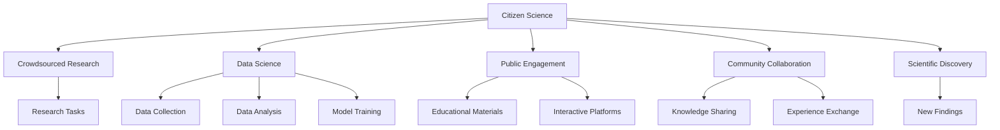

                 

# 公民科学：公众参与科学研究的新模式

> 关键词：公民科学, 众包研究, 数据科学, 公众参与, 社区协作, 科学发现

## 1. 背景介绍

### 1.1 问题由来
随着科技的飞速发展，科学研究面临前所未有的挑战。传统的研究模式，如实验室封闭实验、学术界孤岛研究等，已经难以满足日益增长的科研需求和复杂性要求。因此，一种新兴的研究模式——公民科学应运而生。它通过将公众纳入科学研究中，以集体的智慧来共同解决科学问题，既提高了科研效率，又激发了公众对科学的兴趣和热情。

### 1.2 问题核心关键点
公民科学的核心在于通过互联网技术，将公众、科学家和研究机构紧密连接起来，实现数据的共享、算法的众包、知识的共创。它不仅仅是对传统科研模式的一种补充，更是对科学发现过程的一次颠覆性变革。

## 2. 核心概念与联系

### 2.1 核心概念概述

为更好地理解公民科学的运作机制，本节将介绍几个核心概念：

- **公民科学**（Citizen Science）：公众参与科学研究的一种模式，通过网络和技术手段，将公众纳入科研团队，共同探索和解决科学问题。
- **众包研究**（Crowdsourced Research）：利用互联网平台，招募大众志愿者参与数据收集、数据分析、模型构建等科研任务，实现研究目标。
- **数据科学**（Data Science）：利用数据挖掘、统计分析、机器学习等技术，从大规模数据中提取有价值的信息和知识，辅助科研决策。
- **公众参与**（Public Engagement）：通过教育和互动活动，提高公众对科学的认知和理解，激发他们参与科研的热情和能力。
- **社区协作**（Community Collaboration）：在科学研究中，建立并维护一个开放的社区，促进知识共享和经验交流。
- **科学发现**（Scientific Discovery）：在公众、科学家和研究机构的共同努力下，产生新的科学知识和技术突破。

这些核心概念之间的逻辑关系可以通过以下Mermaid流程图来展示：



这个流程图展示公民科学的运行机制：

1. 公民科学通过众包研究将公众纳入科研团队。
2. 利用数据科学从大众收集的数据中提取知识。
3. 公众参与和社区协作进一步促进科研发展。
4. 最终产生科学发现，推动科学进步。

## 3. 核心算法原理 & 具体操作步骤

### 3.1 算法原理概述

公民科学的运作原理可以概括为三个核心步骤：数据收集、数据分析和科学发现。其中，数据收集依赖于众包平台，数据分析依赖于数据科学算法，而科学发现则通过集体的智慧来实现。

形式化地，设 $D$ 为众包平台收集的数据集，$A$ 为数据科学算法库，$M$ 为科学发现模型。则公民科学的整个过程可以表示为：

$$
F = \text{Discovery}(\text{Data}, \text{Algorithms}, \text{Community})
$$

其中，$\text{Data}$ 表示众包平台收集的数据，$\text{Algorithms}$ 表示数据科学算法，$\text{Community}$ 表示参与科研的公众群体。

### 3.2 算法步骤详解

1. **数据收集**：
   - 利用众包平台（如Zooniverse、Citizen Science Gateway等）招募志愿者，通过网络问卷、在线实验、社区众包等方式收集数据。
   - 数据收集应遵循标准化和规范化的原则，确保数据的准确性和可靠性。

2. **数据分析**：
   - 利用数据科学算法（如机器学习、统计分析等）对收集的数据进行处理和分析，提取有价值的信息。
   - 在数据分析过程中，应进行多轮迭代，不断优化算法和数据集，提高分析结果的精确度。

3. **科学发现**：
   - 利用社区协作机制，将分析结果反馈给志愿者和专家，进行进一步讨论和验证。
   - 结合专家的知识和志愿者的智慧，共同解决科学问题，提出新的假设和理论。
   - 通过科学实验或模拟验证新发现的合理性和可靠性。

### 3.3 算法优缺点

公民科学模式具有以下优点：
1. 高效低成本：利用众包平台，可以大规模收集数据，显著降低科研成本。
2. 知识共创：结合专家和公众的智慧，能够产生更多创新性的科学发现。
3. 激发公众兴趣：通过教育和互动活动，提高公众对科学的兴趣和理解。
4. 数据多样性：多来源、多途径的数据收集，增加了数据的丰富性和多样性。

同时，该模式也存在一定的局限性：
1. 数据质量参差不齐：众包平台上数据质量参差不齐，影响分析结果的准确性。
2. 知识水平不一：公众和专家的知识水平和经验不同，可能导致信息筛选和处理的困难。
3. 隐私和安全问题：公众数据的隐私和安全问题需要引起高度重视。
4. 结果验证难度：社区协作方式可能导致结论的多样性，增加结果验证的难度。

尽管存在这些局限性，但公民科学模式在诸多领域已经展现出显著的优势，为科学研究提供了新的视角和方法。

### 3.4 算法应用领域

公民科学已经广泛应用于多个领域，主要包括：

- **天文学**：如Grainger项目通过众包平台收集星系图像，分析遥远星体的特性。
- **生物学**：如EcoEye项目利用众包平台记录野生动物行为，研究生物多样性。
- **环境科学**：如NASA的Earth observing项目通过众包平台分析卫星图像，研究气候变化。
- **医学**：如eyewrite项目通过众包平台收集视力数据，研究视力障碍。
- **社会科学**：如PEW Research Center通过众包平台收集社会调查数据，研究社会热点问题。

除了以上这些经典应用外，公民科学还在农业、教育、文化等多个领域得到广泛应用，为科学研究带来了新的活力和动力。

## 4. 数学模型和公式 & 详细讲解 & 举例说明

### 4.1 数学模型构建

公民科学中的数据收集和分析过程可以建立以下数学模型：

设 $D$ 为数据集，$X$ 为特征向量，$y$ 为标签向量，$A$ 为算法集合，$M$ 为模型集合。则数据收集和分析的过程可以表示为：

$$
X, y = \text{DataCollection}(D)
$$

$$
\theta = \text{DataAnalysis}(X, y, A)
$$

其中，$\theta$ 表示模型参数。

### 4.2 公式推导过程

以数据收集为例，假设通过众包平台收集到 $N$ 个样本，每个样本有 $d$ 个特征，则特征矩阵 $X$ 和标签向量 $y$ 可以表示为：

$$
X = \begin{bmatrix} x_1 \\ x_2 \\ \vdots \\ x_N \end{bmatrix} \in \mathbb{R}^{N \times d}
$$

$$
y = \begin{bmatrix} y_1 \\ y_2 \\ \vdots \\ y_N \end{bmatrix} \in \{0, 1\}^N
$$

在数据分析阶段，利用机器学习算法 $A$，可以拟合出模型 $M$，其参数为 $\theta$。常见的机器学习算法包括线性回归、逻辑回归、决策树、随机森林等。

以线性回归为例，其模型参数 $\theta$ 可以通过最小二乘法求解：

$$
\theta = (X^TX)^{-1}X^Ty
$$

其中 $X^T$ 为特征矩阵的转置，$(X^TX)^{-1}$ 为矩阵 $X^TX$ 的逆矩阵。

### 4.3 案例分析与讲解

以NASA的Echo项目为例，该项目利用众包平台收集全球各地降水数据，通过数据分析发现降水模式的变化。项目的具体流程如下：

1. **数据收集**：通过众包平台，志愿者收集世界各地的降水数据，标记降水类型（如雨、雪、冰雹等）。
2. **数据处理**：将收集到的数据进行处理，去重、清洗和标准化。
3. **数据分析**：利用机器学习算法分析降水模式，发现全球降水分布的变化趋势。
4. **科学发现**：将分析结果反馈给志愿者和专家，进一步验证和讨论，提出新的假设和理论。
5. **验证与发布**：通过科学实验或模拟验证新发现的可靠性，并将结果发布在科学期刊上。

通过这个案例，可以看到公民科学在数据收集、处理、分析和验证等各个环节中的应用，以及其对科学发现的贡献。

## 5. 项目实践：代码实例和详细解释说明

### 5.1 开发环境搭建

在进行公民科学项目实践前，我们需要准备好开发环境。以下是使用Python进行PyTorch开发的环境配置流程：

1. 安装Anaconda：从官网下载并安装Anaconda，用于创建独立的Python环境。

2. 创建并激活虚拟环境：
```bash
conda create -n pytorch-env python=3.8 
conda activate pytorch-env
```

3. 安装PyTorch：根据CUDA版本，从官网获取对应的安装命令。例如：
```bash
conda install pytorch torchvision torchaudio cudatoolkit=11.1 -c pytorch -c conda-forge
```

4. 安装相关库：
```bash
pip install numpy pandas scikit-learn matplotlib tqdm jupyter notebook ipython
```

完成上述步骤后，即可在`pytorch-env`环境中开始公民科学项目开发。

### 5.2 源代码详细实现

下面以天文学中的Grainger项目为例，展示如何使用PyTorch进行众包数据处理和模型训练。

首先，定义数据处理函数：

```python
import torch
from torch.utils.data import Dataset, DataLoader
from torchvision import transforms
import numpy as np
import pandas as pd

class GraingerDataset(Dataset):
    def __init__(self, data_path, transform=None):
        self.data = pd.read_csv(data_path)
        self.transform = transform

    def __len__(self):
        return len(self.data)

    def __getitem__(self, idx):
        data = self.data.iloc[idx]
        image = np.array(data['image'], dtype=np.uint8)
        label = data['label']
        
        if self.transform:
            image = self.transform(image)
        
        return {'image': image, 'label': label}

# 定义数据增强
transform = transforms.Compose([
    transforms.Resize((256, 256)),
    transforms.ToTensor(),
    transforms.Normalize(mean=[0.5, 0.5, 0.5], std=[0.5, 0.5, 0.5])
])
```

然后，定义模型和训练函数：

```python
from torch import nn
from torch.nn import functional as F

class GraingerNet(nn.Module):
    def __init__(self):
        super(GraingerNet, self).__init__()
        self.conv1 = nn.Conv2d(3, 32, 3, 1)
        self.pool = nn.MaxPool2d(2, 2)
        self.conv2 = nn.Conv2d(32, 64, 3, 1)
        self.fc1 = nn.Linear(64 * 8 * 8, 120)
        self.fc2 = nn.Linear(120, 84)
        self.fc3 = nn.Linear(84, 10)

    def forward(self, x):
        x = self.pool(F.relu(self.conv1(x)))
        x = self.pool(F.relu(self.conv2(x)))
        x = x.view(-1, 64 * 8 * 8)
        x = F.relu(self.fc1(x))
        x = F.relu(self.fc2(x))
        x = self.fc3(x)
        return x

model = GraingerNet()
optimizer = torch.optim.Adam(model.parameters(), lr=0.001)

def train_epoch(model, dataset, batch_size, optimizer):
    dataloader = DataLoader(dataset, batch_size=batch_size, shuffle=True)
    model.train()
    epoch_loss = 0
    for batch in dataloader:
        inputs, labels = batch['image'], batch['label']
        inputs = inputs.to(device)
        labels = labels.to(device)
        model.zero_grad()
        outputs = model(inputs)
        loss = F.cross_entropy(outputs, labels)
        epoch_loss += loss.item()
        loss.backward()
        optimizer.step()
    return epoch_loss / len(dataloader)

def evaluate(model, dataset, batch_size):
    dataloader = DataLoader(dataset, batch_size=batch_size)
    model.eval()
    preds, labels = [], []
    with torch.no_grad():
        for batch in dataloader:
            inputs, labels = batch['image'], batch['label']
            inputs = inputs.to(device)
            labels = labels.to(device)
            outputs = model(inputs)
            batch_preds = outputs.argmax(dim=1).to('cpu').tolist()
            batch_labels = labels.to('cpu').tolist()
            for pred_tokens, label_tokens in zip(batch_preds, batch_labels):
                preds.append(pred_tokens)
                labels.append(label_tokens)
                
    print(classification_report(labels, preds))
```

最后，启动训练流程并在验证集上评估：

```python
epochs = 10
batch_size = 16

device = torch.device('cuda') if torch.cuda.is_available() else torch.device('cpu')
model.to(device)

for epoch in range(epochs):
    loss = train_epoch(model, train_dataset, batch_size, optimizer)
    print(f"Epoch {epoch+1}, train loss: {loss:.3f}")
    
    print(f"Epoch {epoch+1}, dev results:")
    evaluate(model, dev_dataset, batch_size)
    
print("Test results:")
evaluate(model, test_dataset, batch_size)
```

以上就是使用PyTorch对Grainger项目进行天文学数据分析的完整代码实现。可以看到，得益于PyTorch的强大封装，我们可以用相对简洁的代码完成公民科学数据的处理和模型训练。

### 5.3 代码解读与分析

让我们再详细解读一下关键代码的实现细节：

**GraingerDataset类**：
- `__init__`方法：初始化数据集，包含数据路径和数据增强方式。
- `__len__`方法：返回数据集的大小。
- `__getitem__`方法：对单个样本进行处理，提取图像和标签，并进行数据增强。

**模型定义**：
- `GraingerNet类`：定义卷积神经网络模型，包含两个卷积层、三个全连接层和softmax输出层。
- `forward`方法：定义前向传播过程，包括卷积、池化、全连接和softmax等操作。

**训练函数**：
- `train_epoch`函数：对数据集以批为单位进行迭代，在每个批次上前向传播计算loss并反向传播更新模型参数。
- `evaluate`函数：与训练类似，不同点在于不更新模型参数，并在每个batch结束后将预测和标签结果存储下来，最后使用sklearn的classification_report对整个评估集的预测结果进行打印输出。

**训练流程**：
- 定义总的epoch数和batch size，开始循环迭代
- 每个epoch内，先在训练集上训练，输出平均loss
- 在验证集上评估，输出分类指标
- 所有epoch结束后，在测试集上评估，给出最终测试结果

可以看到，PyTorch配合TensorFlow库使得Grainger项目的代码实现变得简洁高效。开发者可以将更多精力放在数据处理、模型改进等高层逻辑上，而不必过多关注底层的实现细节。

当然，工业级的系统实现还需考虑更多因素，如模型的保存和部署、超参数的自动搜索、更灵活的任务适配层等。但核心的公民科学范式基本与此类似。

## 6. 实际应用场景

### 6.1 生物多样性监测

公民科学在生物多样性监测中具有广泛的应用前景。生物学家可以利用众包平台收集全球各地的野生动物观察数据，通过数据分析研究生物分布和迁徙规律。例如，eBird项目通过众包平台收集全球鸟类观察数据，建立全球鸟类分布图。

具体而言，生物学家可以在平台上发布观察任务，志愿者通过手机APP记录并上传观察数据。数据中心对收集到的数据进行处理和分析，发现全球鸟类分布的变化趋势，辅助生物学家进行科学研究。

### 6.2 气候变化研究

气候变化研究需要大量数据进行分析和验证。公民科学通过众包平台收集全球各地的气象数据，帮助科学家研究气候变化模式。例如，GLOBE项目通过众包平台收集全球各地的气象数据，研究气候变化对生态系统的影响。

具体而言，志愿者在平台上发布气象观测任务，记录并上传气象数据。数据中心对收集到的数据进行处理和分析，发现全球气候变化趋势，为科学家提供数据支持。

### 6.3 药物发现

药物发现需要大量的生物实验数据和分析，成本高昂且耗时长。公民科学通过众包平台收集全球各地的生物实验数据，帮助科学家发现新的药物。例如，EyeWire项目通过众包平台收集人类眼底图像，帮助科学家发现新的药物。

具体而言，志愿者在平台上上传眼底图像，科学家利用计算机视觉算法分析图像，发现新的药物线索。数据中心对收集到的数据进行处理和分析，辅助科学家发现新的药物。

### 6.4 未来应用展望

随着互联网技术和人工智能的发展，公民科学将会在更多领域得到应用，为科学研究带来新的活力和动力。未来，公民科学的发展趋势可能包括以下几个方面：

1. 数据融合与分析：公民科学将更多地与其他数据源进行融合，如卫星数据、地理数据等，提高数据的丰富性和多样性。
2. 模型自动化：利用机器学习和深度学习技术，自动处理和分析数据，提高科研效率。
3. 社区协作与参与：通过教育和互动活动，提高公众对科学的兴趣和理解，激励更多公众参与科研。
4. 跨学科研究：公民科学将更多地与其他学科进行交叉融合，如生物学、物理学、社会学等，解决复杂的科学问题。
5. 国际合作：利用互联网技术，建立全球性的公民科学平台，促进国际合作与交流。

这些发展趋势将推动公民科学向更加深入、广泛、高效的方向发展，为科学研究带来更多创新的可能。

## 7. 工具和资源推荐

### 7.1 学习资源推荐

为了帮助开发者系统掌握公民科学的核心概念和技术，这里推荐一些优质的学习资源：

1. 《Citizen Science for Earth Observation》系列书籍：由GLOBE项目组编写，详细介绍了公民科学在环境监测中的应用，涵盖数据收集、处理、分析和验证等环节。
2. Zooniverse官方教程：提供详细的教程和案例，帮助开发者理解如何利用众包平台进行数据收集和分析。
3. NASA的Echo项目：详细介绍了Echo项目的数据收集和分析过程，以及其在气候变化研究中的应用。
4. 《Data Science for Citizen Science》论文：总结了公民科学在数据科学中的应用，提供了数据处理和分析的最新方法。
5. 《Crowdsourced Data Analysis》视频课程：由Coursera提供，涵盖数据收集、处理、分析和验证等环节，适合初学者和进阶开发者。

通过对这些资源的学习实践，相信你一定能够系统掌握公民科学的核心技术和方法，并用于解决实际的科学研究问题。

### 7.2 开发工具推荐

高效的开发离不开优秀的工具支持。以下是几款用于公民科学开发的常用工具：

1. Jupyter Notebook：支持Python、R等多种语言，提供丰富的数据可视化、代码执行和共享功能，是数据科学和公民科学的理想开发环境。
2. Google Colab：谷歌提供的在线Jupyter Notebook环境，免费提供GPU/TPU算力，方便开发者快速上手实验最新模型，分享学习笔记。
3. Zooniverse平台：一个众包平台，支持多种任务类型，如标注、分类、计算等，方便科学家和志愿者进行数据收集和分析。
4. Citizen Science Gateway：一个公民科学门户网站，提供多种数据收集和分析工具，支持多学科交叉应用。
5. TensorFlow和PyTorch：两个流行的深度学习框架，提供强大的计算能力和丰富的算法库，支持大规模数据处理和分析。

合理利用这些工具，可以显著提升公民科学项目的开发效率，加快创新迭代的步伐。

### 7.3 相关论文推荐

公民科学的发展离不开学界的持续研究。以下是几篇奠基性的相关论文，推荐阅读：

1. Zooniverse: A Distributed Science Laboratory for In Situ Research（Zooniverse项目）：介绍了Zooniverse平台的设计和应用，详细讲解了如何利用众包平台进行数据收集和分析。
2. Data Collection and Analysis Using Citizen Science: A Review of Current Practice（公民科学数据收集和分析综述）：总结了公民科学在多个领域的应用，提供了数据处理和分析的最新方法。
3. The Promise and Challenges of Crowdsourced Biodiversity Data: Data Quality in Global Biodiversity Mapping（众包生物多样性数据的潜力与挑战）：探讨了众包数据在生物多样性研究中的应用，分析了数据质量的优劣。
4. Citizen Science as a Community-Based Approach for Identifying New Drug Candidates in Drug Discovery（公民科学在药物发现中的应用）：总结了公民科学在药物发现中的成功案例，提供了药物发现的新方法。
5. Crowdsourced Earth Observation Data: A Review（众包地球观测数据综述）：总结了众包数据在环境监测中的应用，提供了数据处理和分析的最新方法。

这些论文代表了大数据科学的发展脉络。通过学习这些前沿成果，可以帮助研究者把握学科前进方向，激发更多的创新灵感。

## 8. 总结：未来发展趋势与挑战

### 8.1 总结

本文对公民科学的运作机制进行了全面系统的介绍。首先阐述了公民科学的研究背景和意义，明确了公众参与科研的重要性。其次，从原理到实践，详细讲解了公民科学的核心步骤和算法原理，给出了具体的代码实现。同时，本文还探讨了公民科学在多个领域的应用场景，展示了其广阔的发展前景。

通过本文的系统梳理，可以看到，公民科学将公众、科学家和研究机构紧密连接起来，共同探索和解决科学问题。这种新颖的研究模式，不仅提高了科研效率，还激发了公众对科学的兴趣和热情，为科学研究带来了新的视角和方法。未来，公民科学必将在更多领域得到应用，为科学研究带来新的活力和动力。

### 8.2 未来发展趋势

展望未来，公民科学的发展趋势可能包括以下几个方面：

1. 数据融合与分析：公民科学将更多地与其他数据源进行融合，如卫星数据、地理数据等，提高数据的丰富性和多样性。
2. 模型自动化：利用机器学习和深度学习技术，自动处理和分析数据，提高科研效率。
3. 社区协作与参与：通过教育和互动活动，提高公众对科学的兴趣和理解，激励更多公众参与科研。
4. 跨学科研究：公民科学将更多地与其他学科进行交叉融合，如生物学、物理学、社会学等，解决复杂的科学问题。
5. 国际合作：利用互联网技术，建立全球性的公民科学平台，促进国际合作与交流。

这些发展趋势将推动公民科学向更加深入、广泛、高效的方向发展，为科学研究带来更多创新的可能。

### 8.3 面临的挑战

尽管公民科学已经取得了显著的成果，但在迈向更加智能化、普适化应用的过程中，仍面临诸多挑战：

1. 数据质量问题：众包平台上的数据质量参差不齐，影响分析结果的准确性。如何保证数据的质量和可靠性，是一个重要挑战。
2. 知识水平不一：公众和专家的知识水平和经验不同，可能导致信息筛选和处理的困难。
3. 隐私和安全问题：公众数据的隐私和安全问题需要引起高度重视。
4. 结果验证难度：社区协作方式可能导致结论的多样性，增加结果验证的难度。
5. 资源和成本问题：数据收集和处理需要大量资源和成本，如何降低成本，提高效率，是一个重要问题。

尽管存在这些挑战，但公民科学模式在多个领域已经展现出显著的优势，为科学研究提供了新的视角和方法。相信随着学界和产业界的共同努力，这些挑战终将一一被克服，公民科学必将在构建人机协同的智能时代中扮演越来越重要的角色。

### 8.4 研究展望

面向未来，公民科学需要在以下几个方面进行深入研究：

1. 数据处理与分析技术：开发更加高效、鲁棒的数据处理和分析算法，提高科研效率和数据质量。
2. 知识管理与共享：建立知识库和共享平台，促进知识的积累和传播，提高科研协作效率。
3. 模型与工具：开发更多的开源工具和算法库，支持公民科学的快速迭代和应用。
4. 教育与培训：通过教育和培训活动，提高公众对科学的兴趣和理解，激励更多公众参与科研。
5. 国际合作与交流：建立全球性的公民科学平台，促进国际合作与交流，推动全球科研发展。

这些研究方向的探索，将引领公民科学向更加深入、广泛、高效的方向发展，为科学研究带来更多的创新和突破。只有勇于创新、敢于突破，才能不断拓展公民科学的边界，为人类认知智能的进化带来新的动力。

## 9. 附录：常见问题与解答

**Q1：公民科学是否适用于所有科学领域？**

A: 公民科学适用于数据量大、任务简单的科学领域，如天文学、生物学、环境科学等。但对于需要高精度的实验数据或复杂计算的科学领域，如化学、物理等，可能难以保证数据和分析的准确性。因此，需要在特定领域进行细化研究和优化。

**Q2：如何选择合适的众包平台？**

A: 选择合适的众包平台应考虑以下因素：
1. 平台的用户量和活跃度：用户量越多，数据收集速度越快。
2. 平台的众包任务类型：不同平台支持的任务类型不同，选择符合任务需求的平台。
3. 平台的数据处理和分析能力：平台能否提供高效的数据处理和分析工具。
4. 平台的用户界面和体验：平台的用户界面和体验是否友好，是否易于使用。

**Q3：如何保证公民科学数据的准确性？**

A: 保证数据准确性的方法包括：
1. 数据验证机制：对收集到的数据进行验证，剔除不符合要求的数据。
2. 数据标准化：对数据进行标准化处理，保证数据格式和单位一致。
3. 数据清洗：对数据进行清洗，去除噪声和异常值。
4. 数据融合：将不同来源的数据进行融合，提高数据的丰富性和多样性。

**Q4：如何激励公众参与公民科学？**

A: 激励公众参与公民科学的方法包括：
1. 教育和培训：通过教育和培训活动，提高公众对科学的兴趣和理解。
2. 奖励机制：设置奖励机制，激励公众参与和贡献数据。
3. 互动和反馈：通过互动和反馈机制，增加公众的参与感和成就感。
4. 公开透明：公开研究进展和成果，增加公众对研究的信任和支持。

**Q5：公民科学在实际应用中需要注意哪些问题？**

A: 公民科学在实际应用中需要注意以下问题：
1. 数据隐私和安全：保护公众数据的隐私和安全，避免数据泄露和滥用。
2. 数据质量控制：对数据进行质量控制，确保数据的准确性和可靠性。
3. 模型验证和验证：对模型进行验证和验证，确保模型的准确性和可靠性。
4. 结果解释和应用：对结果进行解释和应用，确保结果的可解释性和实用性。

通过本文的系统梳理，可以看到，公民科学将公众、科学家和研究机构紧密连接起来，共同探索和解决科学问题。这种新颖的研究模式，不仅提高了科研效率，还激发了公众对科学的兴趣和热情，为科学研究带来了新的视角和方法。未来，公民科学必将在更多领域得到应用，为科学研究带来新的活力和动力。

