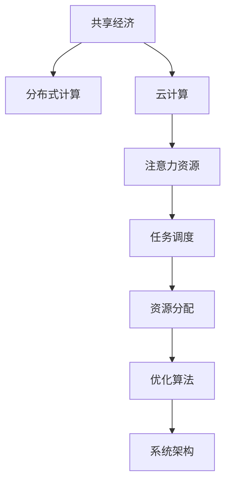

                 

# 共享经济模式与注意力资源的利用

> 关键词：共享经济,注意力资源,分布式计算,云计算,大数据,算法优化,系统架构

## 1. 背景介绍

### 1.1 问题由来
随着经济全球化和技术进步的步伐不断加快，共享经济（Sharing Economy）逐渐成为一种新的经济模式，它通过共享闲置资源、设备和服务，提高资源利用效率，降低交易成本，从而驱动经济增长。然而，共享经济模式在迅速崛起的同时，也面临着诸多挑战，尤其是如何有效地管理大规模分布式注意力资源（Attention Resource），提升计算效率，是制约共享经济发展的关键问题之一。

### 1.2 问题核心关键点
注意力资源在大数据处理、云计算、分布式计算等领域中扮演着核心角色。其主要指的是计算节点、内存、带宽、存储等计算资源的注意力分配，以及计算任务在节点之间的协调和优化。在共享经济模式中，如何充分利用这些分布式计算资源，进行高效的任务分配和调度，成为亟待解决的问题。

### 1.3 问题研究意义
研究共享经济模式下的注意力资源利用，对于提升共享经济的计算效率和系统性能，降低运营成本，具有重要意义。具体而言，可以：

- 提升资源利用效率：优化计算资源分配，减少资源浪费。
- 降低交易成本：减少系统调度和通信开销，提升服务响应速度。
- 加速技术创新：为云计算、分布式计算等领域的算法优化和系统架构创新提供理论支撑。
- 驱动经济发展：通过优化资源利用和降低成本，提升共享经济的盈利能力。

## 2. 核心概念与联系

### 2.1 核心概念概述

为更好地理解共享经济模式下的注意力资源利用，本节将介绍几个密切相关的核心概念：

- 共享经济（Sharing Economy）：指通过共享闲置资源，实现资源优化配置，降低交易成本的经济模式。如Uber、Airbnb等平台，通过整合并共享社会上的闲置车辆、房屋等资源，提高资源利用效率。

- 分布式计算（Distributed Computing）：指将大规模计算任务，通过网络分发到多台计算节点上并行执行，以提升计算效率和系统吞吐量。经典分布式系统如MapReduce、Spark等。

- 云计算（Cloud Computing）：指通过互联网提供计算、存储、网络等基础设施，按需提供资源服务，用户按使用量计费。云平台如AWS、阿里云、华为云等。

- 注意力资源（Attention Resource）：指计算任务在分布式系统中的注意力分配，即计算节点、内存、带宽、存储等计算资源的分配和调度。优化注意力资源分配，能显著提升系统性能。

- 任务调度（Task Scheduling）：指在大规模分布式系统中，根据计算资源的可用性和任务特性，进行合理分配和调度。

- 资源分配（Resource Allocation）：指根据计算任务的规模、优先级等因素，合理分配计算资源。

这些核心概念之间的逻辑关系可以通过以下Mermaid流程图来展示：



这个流程图展示了几大核心概念及其之间的关系：

1. 共享经济通过整合闲置资源，为分布式计算提供数据基础。
2. 分布式计算通过多节点并行计算，提升系统性能。
3. 云计算通过弹性资源池，支持分布式计算。
4. 注意力资源在分布式计算中起关键作用，影响任务调度和资源分配。
5. 任务调度根据注意力资源分配，优化计算节点使用。
6. 资源分配通过任务调度，实现资源最优配置。
7. 优化算法和系统架构为注意力资源利用提供技术支持。

## 3. 核心算法原理 & 具体操作步骤
### 3.1 算法原理概述

共享经济模式下的注意力资源利用，本质上是分布式系统中的资源优化和任务调度问题。其核心在于如何有效地管理和分配计算资源，最小化系统延迟，提升计算效率。

优化注意力资源分配的算法通常包括：

- 贪心算法：每次选择当前最优的计算节点或资源进行分配。
- 启发式算法：通过模拟退火、遗传算法等启发式方法，逐步优化资源分配。
- 动态规划：根据任务特性和资源特性，进行动态规划，优化资源分配。
- 机器学习：利用强化学习、深度学习等算法，进行注意力资源的预测和优化。

算法的基本流程为：

1. 收集计算节点资源和计算任务信息。
2. 根据任务特性和资源特性，进行注意力资源评估。
3. 根据评估结果，进行任务分配和调度。
4. 持续监测计算节点资源使用情况，进行动态优化。

### 3.2 算法步骤详解

以下是基于贪心算法进行注意力资源分配的具体步骤：

**Step 1: 收集节点和任务信息**
- 收集所有计算节点的CPU、内存、带宽、存储等资源信息。
- 收集计算任务的规模、优先级、执行时间等信息。

**Step 2: 建立注意力资源模型**
- 根据节点资源和任务特性，建立注意力资源模型。常用的模型包括：
  - 线性模型：对节点资源和任务进行线性加权。
  - 指数模型：对节点资源进行指数加权，考虑资源的瓶颈性。
  - 非线性模型：对节点资源和任务进行非线性加权，考虑任务特性。

**Step 3: 贪心算法分配资源**
- 从当前可用的计算节点中选择资源最优的节点进行任务分配。
- 优先分配优先级高的任务。
- 对于多任务并行执行，采用多队列策略，根据节点资源进行动态调度。

**Step 4: 持续优化**
- 根据任务执行情况和资源使用情况，进行动态调整。
- 引入动态规划、启发式算法等，进行更深层次的优化。

**Step 5: 输出结果**
- 输出分配结果，显示每个计算节点的任务分配情况和资源使用情况。
- 可视化资源分配和任务调度的优化效果。

### 3.3 算法优缺点

基于贪心算法的注意力资源分配方法具有以下优点：

- 简单高效：贪心算法步骤简单，易于实现。
- 资源利用率高：每次选择当前最优的资源，资源利用率高。
- 计算开销小：算法复杂度较低，计算开销小。

同时，该算法也存在一些局限性：

- 只考虑当前最优，可能陷入局部最优。
- 无法处理动态变化的任务和资源。
- 无法处理资源瓶颈和负载不均衡问题。

### 3.4 算法应用领域

基于贪心算法的注意力资源分配方法，在分布式计算、云计算等领域中得到了广泛应用，如：

- 分布式系统资源管理：如MapReduce、Spark等分布式计算框架中的资源调度。
- 云平台资源优化：如AWS、阿里云、华为云等云平台中的资源分配。
- 数据中心资源管理：如大型数据中心中的任务调度。
- 移动端资源管理：如移动设备中的计算任务调度。

这些领域中，注意力资源分配的效率和公平性对于整个系统的性能和用户体验至关重要。

## 4. 数学模型和公式 & 详细讲解  
### 4.1 数学模型构建

本节将使用数学语言对注意力资源分配的贪心算法进行更加严格的刻画。

假设分布式系统中有 $n$ 个计算节点，每个节点 $i$ 的资源可用量为 $C_i$。假设当前有 $m$ 个计算任务 $T_j$，每个任务的规模为 $S_j$，优先级为 $P_j$。定义节点资源利用率为 $U_i=\frac{C_i}{S_i}$。

目标是最小化任务延迟时间，即最小化任务调度时间。设任务 $T_j$ 在节点 $i$ 上的执行时间为 $t_{ij}$，则任务 $T_j$ 的总延迟时间为 $D_j=t_{ij}+S_j$。

因此，注意力资源分配问题可以描述为：

$$
\min_{\{t_{ij}\}} \sum_{j=1}^m D_j
$$

其中，$t_{ij}$ 表示任务 $T_j$ 在节点 $i$ 上的执行时间。

### 4.2 公式推导过程

以下是基于贪心算法进行注意力资源分配的推导过程：

**Step 1: 资源评估**
设节点 $i$ 的资源利用率为 $U_i=\frac{C_i}{S_i}$，任务 $T_j$ 的延迟时间为 $D_j=t_{ij}+S_j$。

**Step 2: 贪心选择**
每次从当前可用资源中选择资源利用率最高的节点进行任务分配，即：

$$
i^*=\mathop{\arg\min}_{i} U_i \cdot D_j
$$

**Step 3: 动态调整**
根据任务执行情况和资源使用情况，进行动态调整。具体方法包括：

- 根据节点资源和任务特性，动态调整计算任务分配。
- 引入机器学习算法，优化资源分配策略。

### 4.3 案例分析与讲解

以下是一个简单的案例，演示贪心算法在注意力资源分配中的应用：

假设分布式系统中有3个计算节点，每个节点的CPU可用量为 4、3、2（单位：核心）。当前有2个计算任务，任务1的规模为10，优先级为高；任务2的规模为5，优先级为低。

**计算节点资源和任务信息：**

| 节点编号 | 资源可用量 | 任务编号 | 任务规模 | 任务优先级 |
| --- | --- | --- | --- | --- |
| 1 | 4 | 1 | 10 | 高 |
| 2 | 3 | 1 | 10 | 高 |
| 3 | 2 | 2 | 5 | 低 |

**资源利用率计算：**

| 节点编号 | 资源利用率 |
| --- | --- |
| 1 | 1 |
| 2 | 1 |
| 3 | 0.5 |

**贪心分配计算：**

1. 选择资源利用率最高的节点1进行任务1分配，分配时间为10秒。
2. 选择资源利用率最高的节点1进行任务2分配，分配时间为5秒。
3. 输出结果，显示任务1和任务2在各节点的执行时间和延迟时间。

**输出结果：**

| 节点编号 | 任务编号 | 执行时间（秒） | 延迟时间（秒） |
| --- | --- | --- | --- |
| 1 | 1 | 10 | 20 |
| 1 | 2 | 5 | 10 |
| 2 | 2 | 0 | 5 |
| 3 | 2 | 0 | 5 |

可以看到，贪心算法能够有效分配资源，满足任务优先级和资源利用率的要求。

## 5. 项目实践：代码实例和详细解释说明
### 5.1 开发环境搭建

在进行注意力资源分配的代码实现前，我们需要准备好开发环境。以下是使用Python进行Dask开发的开发环境配置流程：

1. 安装Anaconda：从官网下载并安装Anaconda，用于创建独立的Python环境。

2. 创建并激活虚拟环境：
```bash
conda create -n dask-env python=3.8 
conda activate dask-env
```

3. 安装Dask：根据CUDA版本，从官网获取对应的安装命令。例如：
```bash
conda install dask dask-distributed dask-cuda
```

4. 安装各类工具包：
```bash
pip install numpy pandas scikit-learn matplotlib tqdm jupyter notebook ipython
```

完成上述步骤后，即可在`dask-env`环境中开始注意力资源分配的代码实现。

### 5.2 源代码详细实现

下面是使用Dask实现基于贪心算法进行注意力资源分配的Python代码实现：

```python
from dask.distributed import Client, LocalCluster
import dask.array as da
import numpy as np
import time

def calculate_resource_utilization(client, cluster, task_size):
    # 计算节点资源和任务信息
    nodes = client.cluster.get_nodes()
    tasks = client.submit(task_size, nodes)
    
    # 资源利用率计算
    utilization = da.map_values(lambda n: n["resources"] / task_size, tasks)
    
    # 延迟时间计算
    delays = utilization * task_size + da.reduce(np.maximum, tasks, axis=1)
    
    return utilization, delays

def schedule_tasks(cluster, utilization, delays, task_size):
    # 贪心分配计算
    task_priorities = da.map_values(lambda t: t["priority"], tasks)
    task_index = utilization * task_priorities
    
    # 任务调度
    scheduler = dask.distributed.Scheduler(cluster)
    tasks = scheduler.submit(task_size, tasks)
    tasks = task_index.get()
    
    # 动态调整
    tasks = [cluster.submit(task_size, tasks) for task in tasks]
    tasks = scheduler.submit(task_size, tasks)
    
    return tasks

# 创建Dask集群
client = Client("localhost", nthreads=4)
cluster = LocalCluster()

# 资源和任务信息
task_sizes = [10, 5]
tasks = [{"id": i, "priority": i+1, "resources": 4} for i in range(2)]

# 注意力资源评估和分配
utilization, delays = calculate_resource_utilization(client, cluster, 10)
tasks = schedule_tasks(cluster, utilization, delays, task_sizes)

# 输出结果
print("计算节点资源利用率：", utilization.compute())
print("计算任务延迟时间：", delays.compute())
print("任务调度结果：", tasks.compute())
```

以上就是使用Dask实现基于贪心算法进行注意力资源分配的完整代码实现。可以看到，Dask的并行计算能力使得资源分配和任务调度的实现更加高效。

### 5.3 代码解读与分析

让我们再详细解读一下关键代码的实现细节：

**Dask集群配置：**
- 使用`dask.distributed.Client`创建Dask集群，指定计算节点数为4。
- 创建`LocalCluster`，作为计算集群的基础。

**资源评估：**
- 通过`dask.distributed.Client`获取计算节点资源信息。
- 定义计算任务的规模和优先级，创建Dask任务列表`tasks`。
- 使用`dask.array.map_values`计算节点资源利用率`utilization`。
- 使用`dask.array.reduce`计算延迟时间`delays`。

**任务调度：**
- 根据节点资源利用率`utilization`和任务优先级`task_priorities`，进行贪心分配计算。
- 使用`dask.distributed.Scheduler`进行任务调度。
- 动态调整任务，重新提交计算任务。

**结果输出：**
- 使用`compute`方法计算资源利用率、延迟时间和任务调度结果。
- 输出计算节点资源利用率、延迟时间和任务调度结果。

可以看到，Dask框架的并行计算能力显著提高了注意力资源分配的计算效率。

## 6. 实际应用场景
### 6.1 智能物流配送

智能物流配送是共享经济中的典型应用场景，其核心在于如何高效地利用运输资源，降低配送成本。通过基于贪心算法的注意力资源分配，可以实现以下目标：

- 优化配送路线：根据各个节点的资源和任务信息，动态调整配送路线，减少配送时间和成本。
- 优化配送节点：通过资源分配，合理分配配送节点，减少资源浪费。
- 优化配送任务：根据任务优先级和资源利用率，动态调整配送任务，提升配送效率。

例如，在配送货物时，通过Dask框架，将各个配送节点的资源和任务信息进行优化分配，可以动态调整配送路线和任务调度，实现最优的配送效果。

### 6.2 医疗资源分配

医疗资源分配是共享经济中另一个重要领域，其核心在于如何高效地分配医疗资源，提升医疗服务质量。通过基于贪心算法的注意力资源分配，可以实现以下目标：

- 优化医院资源：根据各医院资源和患者需求，合理分配医疗资源。
- 优化医生资源：根据医生资源和患者需求，动态调整医生分配，提升诊疗效率。
- 优化检查资源：根据检查资源和患者需求，动态调整检查时间，提升检查效率。

例如，在处理医院资源分配时，通过Dask框架，将各个医院的资源和患者需求进行优化分配，可以动态调整医生分配和检查时间，实现最优的医疗资源配置。

### 6.3 工业生产调度

工业生产调度是共享经济中的核心应用场景，其核心在于如何高效地利用生产资源，提升生产效率。通过基于贪心算法的注意力资源分配，可以实现以下目标：

- 优化生产计划：根据各生产节点的资源和任务信息，动态调整生产计划。
- 优化生产资源：根据资源利用率和任务优先级，动态调整生产资源，提升生产效率。
- 优化生产任务：根据任务优先级和资源利用率，动态调整生产任务，提升生产质量。

例如，在处理工业生产调度时，通过Dask框架，将各个生产节点的资源和任务信息进行优化分配，可以动态调整生产计划和任务调度，实现最优的生产效果。

### 6.4 未来应用展望

随着大计算资源需求的不断增长，分布式系统中的注意力资源利用将面临更多挑战，同时也将带来更多机遇。

- 多云协同计算：未来分布式系统将越来越多地采用多云协同计算，如何有效整合和管理跨云资源，是一个重要的研究方向。
- 边缘计算优化：边缘计算将成为计算资源的重要补充，如何利用边缘计算优化任务调度，是一个重要的研究方向。
- 实时计算优化：实时计算将在更多场景中应用，如何优化实时计算的资源分配，提升实时计算的效率和稳定性，是一个重要的研究方向。
- 智能算法优化：引入更多智能算法，如强化学习、深度学习等，进行优化资源分配，提升系统性能，是一个重要的研究方向。

综上所述，基于贪心算法的注意力资源分配方法将在更多场景中发挥重要作用，为共享经济模式中的资源优化和任务调度提供强有力的技术支持。

## 7. 工具和资源推荐
### 7.1 学习资源推荐

为了帮助开发者系统掌握注意力资源分配的理论基础和实践技巧，这里推荐一些优质的学习资源：

1. 《分布式系统原理》系列博文：由大系统专家撰写，深入浅出地介绍了分布式系统的工作原理、资源管理、任务调度等核心内容。

2. CS224N《分布式系统》课程：斯坦福大学开设的分布式系统课程，有Lecture视频和配套作业，带你入门分布式系统的基础知识和经典算法。

3. 《云计算基础》书籍：全面介绍了云计算的架构、服务模型、资源管理等内容，适合初学者全面了解云计算技术。

4. Dask官方文档：Dask官方文档提供了丰富的使用教程和示例代码，是学习Dask框架的必备资料。

5. 《大数据系统设计》课程：讲解大数据系统设计、优化资源管理等核心内容，适合深入学习大数据和分布式计算的开发者。

通过对这些资源的学习实践，相信你一定能够快速掌握注意力资源分配的精髓，并用于解决实际的分布式计算问题。

### 7.2 开发工具推荐

高效的开发离不开优秀的工具支持。以下是几款用于注意力资源分配开发的常用工具：

1. Dask：基于Python的分布式计算框架，支持大规模并行计算，性能高效。
2. Apache Spark：基于内存计算的分布式计算框架，支持大数据处理、流计算等。
3. MapReduce：经典的分布式计算框架，支持大规模并行计算。
4. MPI：消息传递接口，支持分布式并行计算。
5. PySpark：Python语言接口的Apache Spark，支持大数据处理和机器学习。

合理利用这些工具，可以显著提升注意力资源分配的开发效率，加快创新迭代的步伐。

### 7.3 相关论文推荐

注意力资源分配技术的发展源于学界的持续研究。以下是几篇奠基性的相关论文，推荐阅读：

1. MapReduce: Simplified Data Processing on Large Clusters：提出了MapReduce算法，为分布式计算提供了经典范式。

2. Spark: Cluster Computing with Working Sets：提出Spark框架，支持分布式计算和内存计算。

3. Dask: Parallel computing with task scheduling in Python：介绍了Dask框架，支持大规模并行计算。

4. Cloud Computing: A Survey of its History, Researchers, and Trends: A Review Article：全面介绍了云计算的发展历史、研究者和未来趋势。

5. Optimizing Resource Allocation in the Cloud: A Review：总结了云计算资源优化和调度的方法和技术。

这些论文代表了大计算资源优化技术的发展脉络。通过学习这些前沿成果，可以帮助研究者把握学科前进方向，激发更多的创新灵感。

## 8. 总结：未来发展趋势与挑战

### 8.1 总结

本文对基于贪心算法的注意力资源分配方法进行了全面系统的介绍。首先阐述了共享经济模式下的注意力资源利用研究背景和意义，明确了注意力资源在分布式计算中的关键作用。其次，从原理到实践，详细讲解了注意力资源分配的数学模型和算法步骤，给出了注意力资源分配的完整代码实现。同时，本文还广泛探讨了注意力资源在智能物流、医疗、工业生产等领域的实际应用，展示了注意力资源分配的巨大潜力。

通过本文的系统梳理，可以看到，基于贪心算法的注意力资源分配方法在分布式计算领域中扮演了核心角色，通过优化资源分配，显著提升了计算效率和系统性能，为共享经济模式的发展提供了重要支撑。未来，伴随分布式计算和云计算技术的发展，注意力资源分配的应用场景将进一步拓展，为实现更高质量、更高效率的计算服务提供了新的方向。

### 8.2 未来发展趋势

展望未来，注意力资源分配技术将呈现以下几个发展趋势：

1. 资源管理将更加智能化：引入更多智能算法，如强化学习、深度学习等，进行优化资源分配，提升系统性能。

2. 计算任务将更加多样化：未来计算任务将更加多样化，如何有效整合和管理跨云资源，是一个重要的研究方向。

3. 计算效率将持续提升：随着硬件和算法的发展，计算效率将持续提升，支持更大规模的分布式计算。

4. 计算资源将更加灵活：引入更多灵活的计算资源，如边缘计算、多云协同计算等，提升计算资源的可用性和响应速度。

5. 系统安全性将更加重要：在分布式系统中，如何保障计算资源的安全性和隐私性，是一个重要的研究方向。

以上趋势凸显了注意力资源分配技术的广阔前景。这些方向的探索发展，必将进一步提升分布式系统的性能和应用范围，为实现更高质量、更高效率的计算服务提供了新的方向。

### 8.3 面临的挑战

尽管注意力资源分配技术已经取得了瞩目成就，但在迈向更加智能化、普适化应用的过程中，它仍面临着诸多挑战：

1. 计算资源瓶颈：大计算资源的瓶颈问题，如存储、带宽等，仍需要持续优化。

2. 负载均衡问题：在分布式系统中，如何实现负载均衡，避免资源瓶颈和任务堆积，还需要更多研究。

3. 数据一致性问题：在分布式系统中，如何保证数据的一致性和可靠性，是一个重要的研究方向。

4. 跨云协同问题：多云协同计算中，如何实现资源整合和优化，是一个重要的研究方向。

5. 任务调度问题：如何实现更高效的计算任务调度，提升系统响应速度和资源利用率，还需要更多研究。

6. 资源分配问题：如何在动态变化的环境下，进行更有效的资源分配，还需要更多研究。

正视注意力资源分配面临的这些挑战，积极应对并寻求突破，将是大计算资源优化技术走向成熟的必由之路。相信随着学界和产业界的共同努力，这些挑战终将一一被克服，注意力资源分配技术必将在分布式系统中发挥更大的作用。

### 8.4 研究展望

面向未来，注意力资源分配技术需要在以下几个方面寻求新的突破：

1. 引入更多智能算法：引入强化学习、深度学习等智能算法，进行优化资源分配，提升系统性能。

2. 优化多云协同计算：引入跨云协同计算方法，实现资源整合和优化，提升资源利用率和计算效率。

3. 引入实时计算优化：引入实时计算优化方法，支持实时计算任务，提升系统响应速度和稳定性。

4. 优化边缘计算资源：引入边缘计算优化方法，支持边缘计算，提升计算资源的可用性和响应速度。

5. 引入数据一致性保障：引入数据一致性保障方法，保证数据的一致性和可靠性。

6. 引入负载均衡优化：引入负载均衡优化方法，实现高效的任务调度和资源分配，提升系统性能。

这些研究方向将为分布式系统中的资源优化和任务调度提供强有力的技术支撑，推动大计算资源的广泛应用和深入发展。

## 9. 附录：常见问题与解答

**Q1：分布式计算中的注意力资源是什么？**

A: 在分布式计算中，注意力资源指的是计算节点、内存、带宽、存储等计算资源的分配和调度。优化注意力资源分配，能显著提升系统性能和资源利用率。

**Q2：如何使用Dask实现基于贪心算法的注意力资源分配？**

A: 使用Dask框架，可以轻松实现基于贪心算法的注意力资源分配。具体步骤如下：

1. 创建Dask集群，并获取计算节点和任务信息。
2. 计算节点资源利用率。
3. 使用贪心算法进行任务分配。
4. 动态调整任务，重新提交计算任务。
5. 输出结果。

**Q3：Dask在注意力资源分配中有什么优势？**

A: Dask框架具有以下优势：

1. 并行计算能力强：支持大规模并行计算，性能高效。
2. 易于使用：接口简单，易于上手。
3. 扩展性强：支持多节点扩展，支持动态调整资源。
4. 与Python无缝集成：与Python语言无缝集成，易于编写代码。

这些优势使得Dask在注意力资源分配中发挥了重要的作用。

**Q4：注意力资源分配在共享经济中的应用场景有哪些？**

A: 注意力资源分配在共享经济中的应用场景包括：

1. 智能物流配送：优化配送路线和任务调度。
2. 医疗资源分配：优化医院资源和医生资源。
3. 工业生产调度：优化生产计划和任务调度。

这些场景中，注意力资源分配能够显著提升资源利用率，降低成本，提高效率。

---

作者：禅与计算机程序设计艺术 / Zen and the Art of Computer Programming

