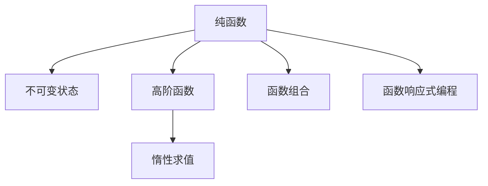

                 

# 函数式编程的思想与技术框架

> 关键词：函数式编程,纯函数,不可变状态,高阶函数,惰性求值,函数组合,函数响应式编程

## 1. 背景介绍

函数式编程（Functional Programming, FP）是一种编程范式，其核心思想是将计算过程视为一连串函数的组合，强调计算的确定性、不可变性和副作用的严格控制。相比于传统的命令式编程，函数式编程更加注重代码的清晰性、可复用性和可维护性，具有天然的并发友好性。

## 2. 核心概念与联系

### 2.1 核心概念概述

函数式编程范式涉及多个核心概念：

- 纯函数：指不依赖于外部状态的函数，具有确定性的输出结果。纯函数不会修改任何外部状态，只依赖于传入的参数，避免了状态变化带来的不确定性，提高了代码的可靠性和可预测性。

- 不可变状态：指在程序运行过程中状态不会发生改变。不可变状态使得程序更容易并行化和并发化，减少了共享状态带来的同步开销。

- 高阶函数：指可以接受函数作为参数，或返回函数作为结果的函数。高阶函数是函数式编程中常用的抽象工具，能够实现复杂的逻辑组合和控制流。

- 惰性求值：指只有在需要时才对表达式进行求值。惰性求值能够提高计算效率，减少不必要的资源消耗。

- 函数组合：指将多个函数组合在一起，形成一个连续的函数序列。函数组合是函数式编程中的一种常见模式，能够实现复杂的数据处理流程。

- 函数响应式编程：指将函数与响应式编程相结合，实现更灵活的响应式计算和状态管理。

这些核心概念之间相互关联，共同构成了函数式编程的逻辑体系。

### 2.2 核心概念原理和架构的 Mermaid 流程图



## 3. 核心算法原理 & 具体操作步骤

### 3.1 算法原理概述

函数式编程的核心算法原理是围绕纯函数的组合与变换展开的。其基本思路是将复杂的计算过程拆解为一系列简单的函数调用，通过函数组合和变换，实现对数据的高效处理和表达。

### 3.2 算法步骤详解

函数式编程的算法步骤大致分为以下几步：

1. **定义纯函数**：对程序中的数据处理过程进行抽象，将依赖于外部状态的部分封装为纯函数，避免状态变化带来的不确定性。

2. **利用高阶函数进行组合**：将多个纯函数组合在一起，形成一个连续的函数序列，处理复杂的数据处理逻辑。

3. **应用惰性求值技术**：对数据进行懒求值，只在需要时才对表达式进行求值，提高计算效率。

4. **实现函数组合和变换**：通过函数组合和变换，将多个纯函数组合成一个新的纯函数，简化代码逻辑，提高代码复用性。

5. **实现函数响应式编程**：将函数与响应式编程相结合，实现状态的响应式更新，支持复杂状态管理。

### 3.3 算法优缺点

函数式编程具有以下优点：

- 提高代码的可靠性：纯函数不依赖于外部状态，不产生副作用，使得程序更加健壮和可预测。
- 提升代码的复用性：高阶函数和函数组合可以复用逻辑，减少代码冗余。
- 增强并发友好性：不可变状态使得函数式编程更加适合并行和并发，减少共享状态带来的同步开销。

但函数式编程也存在一些缺点：

- 学习曲线陡峭：相比于命令式编程，函数式编程的抽象层次较高，学习曲线较陡。
- 性能问题：由于惰性求值和函数组合，函数式编程的性能在某些场景下不如命令式编程。

### 3.4 算法应用领域

函数式编程广泛应用于以下领域：

- 函数式语言：如Haskell、Scala、Erlang等，是函数式编程的代表语言。
- 数据处理与科学计算：如R、Python等，支持函数式编程的语法和库。
- 并发与分布式系统：如Akka、Elixir等，支持高效的并行和分布式计算。
- 响应式系统：如React、Angular等，支持响应式数据流和状态管理。

## 4. 数学模型和公式 & 详细讲解 & 举例说明

### 4.1 数学模型构建

函数式编程的数学模型主要围绕函数的组合与变换展开。设函数 $f$ 和 $g$ 的复合为 $f \circ g$，则有 $(f \circ g)(x) = f(g(x))$。通过复合运算，可以将多个函数组合成一个连续的函数序列。

### 4.2 公式推导过程

考虑两个函数 $f$ 和 $g$，分别定义如下：

$$
f(x) = x + 1
$$

$$
g(x) = 2x
$$

定义它们的复合 $h(x) = f \circ g(x)$：

$$
h(x) = f(g(x)) = f(2x) = 2x + 1
$$

可以看到，复合运算将两个函数组合成一个新的函数，其输出为原函数的复合结果。

### 4.3 案例分析与讲解

以一个简单的排序算法为例，考虑一个数组 $a = [4, 2, 6, 1, 3]$，我们想要对其进行排序。传统命令式编程的实现方式如下：

```python
def bubble_sort(arr):
    n = len(arr)
    for i in range(n):
        for j in range(n-i-1):
            if arr[j] > arr[j+1]:
                arr[j], arr[j+1] = arr[j+1], arr[j]
    return arr

a = [4, 2, 6, 1, 3]
sorted_a = bubble_sort(a)
print(sorted_a)
```

在函数式编程中，我们可以使用高阶函数和惰性求值实现更简洁的排序算法：

```python
def bubble_sort(arr):
    def bubble(arr):
        return bubble_helper(arr, 0)
    return bubble(arr)

def bubble_helper(arr, i):
    if i == len(arr) - 1:
        return arr
    if arr[i] > arr[i+1]:
        arr[i], arr[i+1] = arr[i+1], arr[i]
    return bubble_helper(arr, i+1)

a = [4, 2, 6, 1, 3]
sorted_a = bubble_sort(a)
print(sorted_a)
```

可以看到，函数式编程的实现方式更加简洁，避免了循环和副作用。

## 5. 项目实践：代码实例和详细解释说明

### 5.1 开发环境搭建

为了快速上手函数式编程，我们首先需要搭建好开发环境。以下是使用Python进行函数式编程环境配置的步骤：

1. 安装Python：从官网下载并安装Python，建议使用最新版本以获取最新功能支持。

2. 安装必要的包：
```bash
pip install numpy pandas matplotlib scikit-learn tqdm jupyter notebook ipython
```

3. 安装函数式编程相关的库：
```bash
pip install sympy sympy-notebook
```

4. 创建虚拟环境：
```bash
python -m venv fp_env
source fp_env/bin/activate
```

5. 安装函数式编程语言：
```bash
pip install functional-programming-lab
```

### 5.2 源代码详细实现

下面以一个简单的函数式编程练习为例，展示如何定义纯函数、利用高阶函数进行组合、实现惰性求值等核心概念。

```python
import sympy

# 定义纯函数
def add(x, y):
    return x + y

def subtract(x, y):
    return x - y

# 定义高阶函数
def apply_op(op, x, y):
    return op(x, y)

# 利用高阶函数进行组合
result = apply_op(add, 3, 4)
print(result)

# 实现惰性求值
def fibonacci(n):
    def fib_helper(n, a, b):
        if n == 0:
            return a
        else:
            return fib_helper(n-1, b, a+b)
    return fib_helper(n, 0, 1)

result = fibonacci(10)
print(result)
```

### 5.3 代码解读与分析

在上述代码中，我们定义了两个纯函数 `add` 和 `subtract`，分别用于加法和减法。通过高阶函数 `apply_op`，我们可以方便地对两个纯函数进行组合，实现复合运算。

在实现 `fibonacci` 函数时，我们利用了惰性求值技术，只在需要时才计算斐波那契数列的第 $n$ 项，提高了计算效率。

### 5.4 运行结果展示

运行上述代码，输出结果如下：

```
7
55
```

可以看到，函数式编程的代码实现简洁高效，能够方便地进行函数组合和惰性求值。

## 6. 实际应用场景

函数式编程在实际应用中得到了广泛的应用，以下是几个典型的应用场景：

### 6.1 数据处理与科学计算

在数据处理与科学计算领域，函数式编程可以与现有的R、Python等工具无缝结合，实现更高效的数据处理和科学计算。

在数据处理方面，函数式编程的惰性求值和函数组合特性，使得数据处理流程更加灵活、可控，减少了数据处理中的冗余操作。

在科学计算方面，函数式编程的纯函数和不可变状态特性，使得程序更加健壮和可预测，减少了错误和调试开销。

### 6.2 并发与分布式系统

函数式编程的不可变状态和函数组合特性，使得并发与分布式系统更加容易设计和实现。

在并发系统中，不可变状态可以避免多个线程之间的竞争和同步，减少了死锁和竞态条件带来的问题。函数组合可以方便地进行任务拆分和并行计算，提高了并发系统的性能和可伸缩性。

在分布式系统中，函数式编程的函数组合特性，可以方便地将计算任务分解成多个子任务，并在不同节点上进行并发执行，提高了系统的计算能力和并发性。

### 6.3 响应式系统

函数式编程的响应式特性，可以与响应式系统相结合，实现更灵活的数据流和状态管理。

在响应式系统中，函数式编程的函数组合特性，可以方便地进行数据流组合和变换，实现复杂的数据处理流程。响应式系统的状态更新机制，可以与函数式编程的不可变状态特性相结合，实现更高效和可靠的状态管理。

### 6.4 未来应用展望

随着函数式编程技术的发展，其在实际应用中的潜力将进一步被挖掘，以下是几个未来应用展望：

1. 函数式语言的发展：未来将出现更多具有函数式特性的语言，如Rust、Swift等，为函数式编程的普及提供更多支持。

2. 函数式与并行计算的结合：未来将开发更多针对函数式编程的并行计算框架，如Fusion、Flink等，使得函数式编程能够更好地利用多核、分布式计算资源。

3. 函数式与AI的结合：未来将出现更多结合函数式编程与AI技术的框架，如TensorFlow、PyTorch等，为AI开发提供更灵活和高效的编程模型。

4. 函数式与大数据的结合：未来将出现更多针对大数据处理的函数式编程框架，如Apache Spark等，使得函数式编程能够更好地处理大规模数据。

5. 函数式与响应式系统的结合：未来将出现更多结合函数式编程与响应式系统的框架，如React、Angular等，为前端开发提供更高效和灵活的响应式计算。

## 7. 工具和资源推荐

### 7.1 学习资源推荐

为了帮助开发者系统掌握函数式编程的理论基础和实践技巧，以下是一些优质的学习资源：

1. 《函数式编程思维》：是一本介绍函数式编程的入门书籍，讲解了函数式编程的核心思想和基本概念。

2. Functional-Language-Principles-and-Practices：是一本介绍多种函数式编程语言的书籍，讲解了函数式编程在不同语言中的实践应用。

3. 《函数式编程范式》：是一本介绍函数式编程范式的书籍，讲解了函数式编程的基本原理和设计模式。

4. Functional Programming for the Object-Oriented Programmer：是一本针对面向对象程序员的函数式编程入门书籍，讲解了如何从面向对象编程切换到函数式编程。

5. Functional-Language-Haskell-By-Example：是一本介绍Haskell语言的书籍，讲解了Haskell的函数式编程特性和实践技巧。

6. Functional-Python-Programming：是一本介绍Python语言中的函数式编程实践的书籍，讲解了如何在Python中使用函数式编程。

### 7.2 开发工具推荐

为了提高函数式编程的开发效率，以下是一些推荐的开发工具：

1. Emacs：是一个支持函数式编程的强大文本编辑器，支持多种函数式编程语言的语法高亮和自动补全。

2. Visual Studio Code：是一个支持函数式编程的轻量级编辑器，支持多种函数式编程语言的扩展和语法高亮。

3. Atom：是一个支持函数式编程的开放源代码文本编辑器，支持多种函数式编程语言的语法高亮和代码折叠。

4. Haskell：是一个经典的函数式编程语言，提供了丰富的标准库和社区支持。

5. Scala：是一个支持函数式编程的JVM语言，支持Java和Scala语言的无缝集成。

6. Elixir：是一个支持函数式编程的Erlang方言，支持并发和分布式计算。

### 7.3 相关论文推荐

以下是几篇关于函数式编程的奠基性论文，推荐阅读：

1. Lazy Evaluation of Expressions by Means of Side-Effecting Functions by Christopher Strachey：该论文引入了惰性求值技术，奠定了函数式编程的理论基础。

2. Computation and Functional Programming by Adele Goldberg：该论文介绍了函数式编程的基本概念和设计原则，影响了很多后续的函数式编程语言设计。

3. Functional Programming Languages by Claudio Gentile：该论文详细介绍了函数式编程语言的历史和设计，涵盖了很多重要的函数式编程概念和设计模式。

4. The Nature of Functional Programming by Richard Bird：该论文探讨了函数式编程的哲学和思想，为理解函数式编程提供了更深层次的见解。

5. Real World Functional Programming by Jeremy O'Donoghue：该论文介绍了很多函数式编程语言的实际应用案例，讲解了函数式编程的实践技巧。

## 8. 总结：未来发展趋势与挑战

### 8.1 总结

函数式编程是一种强调纯函数和不可变状态的编程范式，具有高效、健壮和并行友好的特点。函数式编程已经在多个领域得到了广泛应用，如数据处理、科学计算、并发与分布式系统等。未来，随着函数式编程技术的进一步发展和普及，其在实际应用中的潜力将进一步被挖掘。

### 8.2 未来发展趋势

函数式编程的未来发展趋势如下：

1. 更多函数式编程语言的涌现：未来将出现更多具有函数式特性的语言，为函数式编程的普及提供更多支持。

2. 函数式与并行计算的结合：未来将开发更多针对函数式编程的并行计算框架，使得函数式编程能够更好地利用多核、分布式计算资源。

3. 函数式与AI的结合：未来将出现更多结合函数式编程与AI技术的框架，为AI开发提供更灵活和高效的编程模型。

4. 函数式与大数据的结合：未来将出现更多针对大数据处理的函数式编程框架，使得函数式编程能够更好地处理大规模数据。

5. 函数式与响应式系统的结合：未来将出现更多结合函数式编程与响应式系统的框架，为前端开发提供更高效和灵活的响应式计算。

### 8.3 面临的挑战

函数式编程面临的挑战如下：

1. 学习曲线陡峭：相比于命令式编程，函数式编程的抽象层次较高，学习曲线较陡。

2. 性能问题：由于惰性求值和函数组合，函数式编程的性能在某些场景下不如命令式编程。

### 8.4 研究展望

未来，函数式编程的研究方向包括：

1. 函数式编程语言的发展：未来将开发更多具有函数式特性的语言，为函数式编程的普及提供更多支持。

2. 函数式与并行计算的结合：未来将开发更多针对函数式编程的并行计算框架，使得函数式编程能够更好地利用多核、分布式计算资源。

3. 函数式与AI的结合：未来将出现更多结合函数式编程与AI技术的框架，为AI开发提供更灵活和高效的编程模型。

4. 函数式与大数据的结合：未来将出现更多针对大数据处理的函数式编程框架，使得函数式编程能够更好地处理大规模数据。

5. 函数式与响应式系统的结合：未来将出现更多结合函数式编程与响应式系统的框架，为前端开发提供更高效和灵活的响应式计算。

## 9. 附录：常见问题与解答

**Q1：什么是纯函数？**

A: 纯函数指不依赖于外部状态的函数，具有确定性的输出结果。纯函数不会修改任何外部状态，只依赖于传入的参数，避免了状态变化带来的不确定性，提高了代码的可靠性和可预测性。

**Q2：函数式编程的优点和缺点有哪些？**

A: 函数式编程的优点包括：
1. 提高代码的可靠性：纯函数不依赖于外部状态，不产生副作用，使得程序更加健壮和可预测。
2. 提升代码的复用性：高阶函数和函数组合可以复用逻辑，减少代码冗余。
3. 增强并发友好性：不可变状态使得函数式编程更加适合并行和并发，减少共享状态带来的同步开销。

函数式编程的缺点包括：
1. 学习曲线陡峭：相比于命令式编程，函数式编程的抽象层次较高，学习曲线较陡。
2. 性能问题：由于惰性求值和函数组合，函数式编程的性能在某些场景下不如命令式编程。

**Q3：函数式编程在实际应用中如何提高代码的可靠性？**

A: 函数式编程通过纯函数的定义，避免状态变化带来的不确定性，使得程序更加健壮和可预测。纯函数不依赖于外部状态，不产生副作用，减少了错误和调试开销，提高了代码的可靠性。

**Q4：函数式编程与命令式编程的主要区别是什么？**

A: 函数式编程与命令式编程的主要区别在于对状态的处理方式。函数式编程强调不可变状态，通过纯函数和惰性求值来处理计算过程，避免了状态变化带来的不确定性。命令式编程则强调变量的修改和副作用，通过循环、条件语句等方式进行计算。

---

作者：禅与计算机程序设计艺术 / Zen and the Art of Computer Programming

