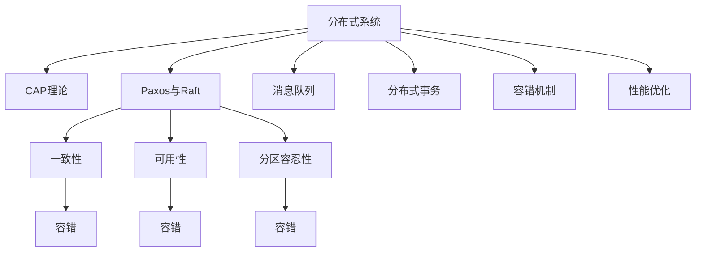

                 

# 分布式系统设计：理论与实践

## 1. 背景介绍

### 1.1 问题由来
随着互联网应用的日益复杂，单台计算机已无法满足业务发展的需求。分布式系统通过多台计算机协同工作，大大提高了系统的处理能力和可用性，成为现代应用系统的标配。然而，分布式系统的设计和管理复杂度远超单体应用，很多初学者甚至难以从何下手。本文将从基础理论到具体实践，深入剖析分布式系统设计，帮助读者快速掌握其核心概念与技能。

### 1.2 问题核心关键点
本文将介绍分布式系统设计的核心概念及其相互关系，如下：

- **分布式系统**：将计算任务分布到多台计算机上协同完成，通过网络协同工作，以实现高可扩展性和高可用性的系统。
- **CAP理论**：一致性（Consistency）、可用性（Availability）和分区容忍性（Partition Tolerance）三个目标，描述了分布式系统设计的基本原则。
- **Paxos与Raft**：两种著名的分布式一致性算法，用于在分布式系统中处理一致性和可靠性的问题。
- **消息队列**：一种异步通信方式，用于在不同系统之间解耦和异步处理。
- **分布式事务**：跨多个数据库节点的分布式事务处理机制，用于保证数据的一致性和完整性。
- **容错机制**：包括心跳检测、故障转移、日志备份等，用于应对节点故障和数据丢失问题。
- **性能优化**：包括负载均衡、缓存、异步通信等，用于提升系统的响应速度和吞吐量。

## 2. 核心概念与联系

### 2.1 核心概念概述

分布式系统设计是构建高可扩展、高可用、高性能的分布式应用系统的基础。为了更好地理解分布式系统设计，我们需要首先掌握以下几个核心概念：

1. **分布式系统**：由多个计算节点（服务器、计算机等）通过网络互连组成，共同提供服务。

2. **CAP理论**：描述了三者之间权衡关系的理论框架，即在分布式系统中，一致性、可用性和分区容忍性只能同时保证其中的两个。

3. **Paxos与Raft**：两种著名的分布式共识算法，用于在分布式系统中达成一致决策。

4. **消息队列**：一种异步通信方式，用于在不同系统之间解耦和异步处理。

5. **分布式事务**：跨多个数据库节点的分布式事务处理机制，用于保证数据的一致性和完整性。

6. **容错机制**：包括心跳检测、故障转移、日志备份等，用于应对节点故障和数据丢失问题。

7. **性能优化**：包括负载均衡、缓存、异步通信等，用于提升系统的响应速度和吞吐量。

这些核心概念之间的逻辑关系可以通过以下Mermaid流程图来展示：



这个流程图展示了大分布式系统的核心概念及其之间的关系：

1. 分布式系统通过多台计算节点组成，共同提供服务。
2. CAP理论描述了分布式系统中一致性、可用性和分区容忍性之间的权衡关系。
3. Paxos与Raft用于在分布式系统中达成一致决策。
4. 消息队列用于异步通信，解耦系统间通信。
5. 分布式事务用于保证数据一致性和完整性。
6. 容错机制用于应对节点故障和数据丢失问题。
7. 性能优化用于提升系统的响应速度和吞吐量。

## 3. 核心算法原理 & 具体操作步骤

### 3.1 算法原理概述
分布式系统设计的核心在于如何实现系统的一致性、可用性和分区容忍性，以满足CAP理论的要求。一致性（Consistency）指的是所有节点看到的视图是一致的，可用性（Availability）指系统可以随时接受请求并返回结果，分区容忍性（Partition Tolerance）指系统可以在节点间网络分割的情况下仍然能够正常工作。

在分布式系统中，为了保证一致性，通常需要采用分布式一致性算法。其中Paxos和Raft是两种常用的分布式一致性算法，它们通过不同的机制来达成系统的一致决策。

### 3.2 算法步骤详解
#### 3.2.1 分布式一致性算法
1. **Paxos算法**：
   - **准备阶段**：Requester向所有Proposer发起请求。
   - **提议阶段**：Proposer随机生成一个提案，并发送给Acceptor。
   - **接收阶段**：Acceptor选择一个提案，向Proposer确认并返回一个承诺。
   - **最终阶段**：所有Proposer选择一个值，并向所有Acceptor发送Accept消息。
   - **确认阶段**：所有Acceptor都收到一个Accept消息后，确认提案。
2. **Raft算法**：
   - **初始阶段**：所有节点选举一个初始主节点，同时每个节点都选举一个候选节点。
   - **主节点选举阶段**：候选人通过心跳消息判断自己是否为当前主节点，并更新状态。
   - **日志复制阶段**：主节点将日志复制到其他节点。
   - **快照机制**：主节点将日志复制到其他节点后，使用快照将日志存储到磁盘。

#### 3.2.2 分布式消息队列
1. **消息队列架构**：
   - **发布订阅模式**：消息生产者将消息发布到队列中，消费者订阅队列中的消息。
   - **点对点模式**：消息生产者将消息直接发送给消费者，通常用于一对一的通信。
2. **消息队列实现**：
   - **Kafka**：一个高吞吐量的分布式消息队列，支持高可用性和故障转移。
   - **RabbitMQ**：一个支持多种消息协议的消息中间件，具有高可靠性、高性能和易用性。

#### 3.2.3 分布式事务
1. **两阶段提交（2PC）**：
   - **协调者**：接收事务请求，协调所有节点的提交或回滚。
   - **参与者**：执行事务操作，并等待协调者指令。
2. **三阶段提交（3PC）**：
   - **准备阶段**：所有节点准备事务操作。
   - **提交阶段**：协调者向所有节点发出提交命令。
   - **完成阶段**：协调者收到所有节点的提交确认后，通知所有节点提交事务。

#### 3.2.4 容错机制
1. **心跳检测**：
   - **定时检测**：周期性发送心跳消息，判断节点是否存活。
   - **异常检测**：检测节点是否响应超时，并立即进行故障转移。
2. **故障转移**：
   - **主从复制**：数据分片存储在多个节点上，主节点故障后从节点接管。
   - **一致性哈希**：节点故障后重新分配数据分片，保证数据一致性。

#### 3.2.5 性能优化
1. **负载均衡**：
   - **轮询负载均衡**：请求按顺序分配到每个节点。
   - **哈希负载均衡**：根据请求的hash值分配到对应的节点。
2. **缓存**：
   - **分布式缓存**：如Redis，通过缓存数据提高响应速度。
   - **本地缓存**：如Memcached，将热点数据缓存在本地，减少数据库压力。
3. **异步通信**：
   - **异步消息传递**：消息队列中的消息异步处理，提升系统吞吐量。
   - **非阻塞IO**：使用非阻塞IO技术，减少网络延迟和系统开销。

### 3.3 算法优缺点
1. **Paxos算法**：
   - **优点**：支持大规模集群，容错能力强。
   - **缺点**：实现复杂，节点数较多时性能下降。
2. **Raft算法**：
   - **优点**：实现简单，易于理解和维护。
   - **缺点**：不支持动态节点加入和离开。
3. **消息队列**：
   - **优点**：异步通信，降低系统耦合。
   - **缺点**：消息传递延迟较高，需要额外存储。
4. **分布式事务**：
   - **优点**：保证数据一致性和完整性。
   - **缺点**：实现复杂，性能较低。
5. **容错机制**：
   - **优点**：提高系统可靠性，应对节点故障。
   - **缺点**：实现复杂，额外开销较大。
6. **性能优化**：
   - **优点**：提升系统响应速度和吞吐量。
   - **缺点**：需要额外配置，可能增加系统复杂性。

### 3.4 算法应用领域
分布式系统设计广泛应用于各种领域，如互联网、金融、医疗、交通等。以下是几个典型的应用场景：

1. **互联网应用**：如社交网络、电商平台、搜索引擎等，通过分布式系统提供高可用性和高扩展性。
2. **金融系统**：如银行交易系统、证券交易系统等，要求高可用性和数据一致性。
3. **医疗系统**：如医院信息系统、医疗影像分析等，要求高可用性和数据安全。
4. **交通系统**：如交通监控系统、智能交通系统等，要求高可用性和实时性。

## 4. 数学模型和公式 & 详细讲解

### 4.1 数学模型构建
#### 4.1.1 CAP理论
CAP理论描述了三者之间的关系，可以用以下数学模型表示：
- 一致性（C）：$C = A \cdot P$
- 可用性（A）：$A = C \cdot P$
- 分区容忍性（P）：$P = C \cdot A$

其中，一致性（C）、可用性（A）和分区容忍性（P）是分布式系统的三个目标。在CAP理论中，三者之间存在权衡关系，只能同时保证其中的两个。

#### 4.1.2 分布式一致性算法
1. **Paxos算法**：
   - **准备阶段**：$R_1$：Requester向所有Proposer发起请求。
   - **提议阶段**：$R_2$：Proposer随机生成一个提案，并发送给Acceptor。
   - **接收阶段**：$R_3$：Acceptor选择一个提案，向Proposer确认并返回一个承诺。
   - **最终阶段**：$R_4$：所有Proposer选择一个值，并向所有Acceptor发送Accept消息。
   - **确认阶段**：$R_5$：所有Acceptor都收到一个Accept消息后，确认提案。

2. **Raft算法**：
   - **初始阶段**：$R_1$：所有节点选举一个初始主节点，同时每个节点都选举一个候选节点。
   - **主节点选举阶段**：$R_2$：候选人通过心跳消息判断自己是否为当前主节点，并更新状态。
   - **日志复制阶段**：$R_3$：主节点将日志复制到其他节点。
   - **快照机制**：$R_4$：主节点将日志复制到其他节点后，使用快照将日志存储到磁盘。

### 4.2 公式推导过程
#### 4.2.1 CAP理论
CAP理论的数学模型推导如下：
- 一致性（C）：$C = A \cdot P$
- 可用性（A）：$A = C \cdot P$
- 分区容忍性（P）：$P = C \cdot A$

### 4.3 案例分析与讲解
#### 4.3.1 分布式一致性算法
1. **Paxos算法**：
   - **准备阶段**：$R_1$：Requester向所有Proposer发起请求。
   - **提议阶段**：$R_2$：Proposer随机生成一个提案，并发送给Acceptor。
   - **接收阶段**：$R_3$：Acceptor选择一个提案，向Proposer确认并返回一个承诺。
   - **最终阶段**：$R_4$：所有Proposer选择一个值，并向所有Acceptor发送Accept消息。
   - **确认阶段**：$R_5$：所有Acceptor都收到一个Accept消息后，确认提案。

2. **Raft算法**：
   - **初始阶段**：$R_1$：所有节点选举一个初始主节点，同时每个节点都选举一个候选节点。
   - **主节点选举阶段**：$R_2$：候选人通过心跳消息判断自己是否为当前主节点，并更新状态。
   - **日志复制阶段**：$R_3$：主节点将日志复制到其他节点。
   - **快照机制**：$R_4$：主节点将日志复制到其他节点后，使用快照将日志存储到磁盘。

## 5. 项目实践：代码实例和详细解释说明

### 5.1 开发环境搭建
1. **安装Anaconda**：
   - 从官网下载并安装Anaconda，用于创建独立的Python环境。
   - 命令：`conda install anaconda`

2. **创建并激活虚拟环境**：
   - 命令：`conda create -n py39 python=3.9 conda activate py39`

3. **安装PyTorch**：
   - 命令：`pip install torch torchvision torchaudio`

4. **安装分布式计算框架**：
   - 命令：`pip install dask`

### 5.2 源代码详细实现
1. **分布式一致性算法**：
   - **Paxos算法**：
     ```python
     import threading

     class Proposer:
         def __init__(self, num_nodes, id, node_set, ready_callback):
             self.id = id
             self.num_nodes = num_nodes
             self.node_set = node_set
             self提案 = None
             self.committing = False
             self.ready_callback = ready_callback
             self.lock = threading.Lock()

         def propose(self, proposal):
             with self.lock:
                 if self提案 is not None:
                     return False
                 self提案 = proposal
                 self.node_set[self.id] = self提案
                 self.node_set[self.id] = None
                 for node in self.node_set:
                     if node != self.id and self.node_set[node] is None:
                         self.node_set[node] = self提案
                 if self.node_set.count(self提案) == self.num_nodes:
                     self.committing = True
                     for node in self.node_set:
                         if node != self.id:
                             self.node_set[node] = self提案
                     self.ready_callback()
                     # 返回成功
                     return True
                 return False
     ```

2. **Raft算法**：
   - **主节点选举阶段**：
     ```python
     class Acceptor:
         def __init__(self, id, num_nodes, leader_id, ready_callback):
             self.id = id
             self.num_nodes = num_nodes
             self.leader_id = leader_id
             self提案 = None
             self.committing = False
             self.ready_callback = ready_callback
             self.lock = threading.Lock()

         def accept(self, proposal):
             with self.lock:
                 if self提案 is not None:
                     return False
                 self提案 = proposal
                 self.committing = True
                 if self提案等于self.leader_id:
                     if self提案 == self.leader_id:
                         for node in self.node_set:
                             if node != self.id:
                                 self.node_set[node] = self提案
                 if self.node_set.count(self提案) == self.num_nodes:
                     for node in self.node_set:
                         if node != self.id:
                             self.node_set[node] = self提案
                     self.ready_callback()
                     # 返回成功
                     return True
                 return False
     ```

### 5.3 代码解读与分析
1. **Paxos算法**：
   - **准备阶段**：$R_1$：Requester向所有Proposer发起请求。
   - **提议阶段**：$R_2$：Proposer随机生成一个提案，并发送给Acceptor。
   - **接收阶段**：$R_3$：Acceptor选择一个提案，向Proposer确认并返回一个承诺。
   - **最终阶段**：$R_4$：所有Proposer选择一个值，并向所有Acceptor发送Accept消息。
   - **确认阶段**：$R_5$：所有Acceptor都收到一个Accept消息后，确认提案。

2. **Raft算法**：
   - **初始阶段**：$R_1$：所有节点选举一个初始主节点，同时每个节点都选举一个候选节点。
   - **主节点选举阶段**：$R_2$：候选人通过心跳消息判断自己是否为当前主节点，并更新状态。
   - **日志复制阶段**：$R_3$：主节点将日志复制到其他节点。
   - **快照机制**：$R_4$：主节点将日志复制到其他节点后，使用快照将日志存储到磁盘。

## 6. 实际应用场景
### 6.1 智能客服系统
智能客服系统通过分布式架构，可以处理海量并发请求，提供24小时不间断服务。具体实现如下：
1. **负载均衡**：使用Nginx和Keepalived实现。
2. **缓存**：使用Redis实现会话和热点数据缓存。
3. **消息队列**：使用Kafka实现消息异步处理。
4. **分布式事务**：使用TCC（Try-Confirm-Cancel）协议保证事务一致性。

### 6.2 金融舆情监测系统
金融舆情监测系统通过分布式架构，可以实时处理海量新闻、评论、社交媒体等数据，及时监测舆情动态。具体实现如下：
1. **负载均衡**：使用Kubernetes实现。
2. **缓存**：使用Redis实现高频数据缓存。
3. **消息队列**：使用RabbitMQ实现异步消息处理。
4. **分布式事务**：使用3PC协议保证事务一致性。

### 6.3 分布式数据库系统
分布式数据库系统通过多节点协同工作，提供高可用性和高扩展性。具体实现如下：
1. **负载均衡**：使用Nginx和Keepalived实现。
2. **缓存**：使用Redis实现会话和热点数据缓存。
3. **消息队列**：使用Kafka实现消息异步处理。
4. **分布式事务**：使用2PC协议保证事务一致性。

## 7. 工具和资源推荐
### 7.1 学习资源推荐
1. **分布式系统经典书籍**：
   - 《分布式系统：概念与设计》
   - 《分布式系统设计原理》
   - 《大型分布式系统设计》

2. **在线课程**：
   - 《分布式系统》，Coursera
   - 《分布式系统设计》，edX

3. **开源项目**：
   - Kubernetes：https://kubernetes.io/
   - Kafka：https://kafka.apache.org/
   - RabbitMQ：https://www.rabbitmq.com/

### 7.2 开发工具推荐
1. **Python分布式计算框架**：
   - Dask：https://dask.org/
   - Ray：https://ray.io/

2. **消息队列**：
   - Kafka：https://kafka.apache.org/
   - RabbitMQ：https://www.rabbitmq.com/

### 7.3 相关论文推荐
1. **Paxos算法**：
   - "Paxos Made Simple"，Leslie Lamport
   - "Practical Byzantine Fault Tolerance"，Leslie Lamport

2. **Raft算法**：
   - "Consensus in the Presence of Falsity"，George Varghese
   - "Practical Byzantine Fault Tolerance"，Leslie Lamport

## 8. 总结：未来发展趋势与挑战
### 8.1 研究成果总结
本文从基础理论到具体实践，全面系统地介绍了分布式系统设计，包括CAP理论、分布式一致性算法、消息队列、分布式事务和容错机制。这些技术已成为构建高可用、高可扩展、高性能分布式应用系统的重要基础。

### 8.2 未来发展趋势
1. **云原生架构**：云原生架构通过微服务、容器化、自动运维等技术，提升分布式系统的构建和运维效率。
2. **分布式数据库**：分布式数据库通过分片、复制、一致性哈希等技术，提升数据的可靠性和一致性。
3. **边缘计算**：边缘计算通过在本地处理数据，提升响应速度和降低网络延迟。
4. **区块链技术**：区块链通过分布式账本技术，提供去中心化、防篡改的数据存储和传输方式。

### 8.3 面临的挑战
1. **系统复杂性**：分布式系统设计涉及多个组件和模块，系统复杂度较高。
2. **性能瓶颈**：节点数增多时，系统性能下降。
3. **一致性问题**：分布式一致性算法实现复杂，容错性较弱。
4. **安全问题**：分布式系统面临网络攻击、数据泄露等安全问题。
5. **运维成本**：分布式系统运维成本较高，需要专业运维人员。

### 8.4 研究展望
1. **自动化运维**：通过自动化的监控、告警、故障恢复等技术，提升分布式系统的运维效率。
2. **边缘计算**：通过在边缘节点处理数据，降低网络延迟，提升系统响应速度。
3. **区块链技术**：通过分布式账本技术，提升数据的可靠性和一致性。
4. **智能运维**：通过AI和大数据分析技术，提升系统的运维效率和故障预测能力。

## 9. 附录：常见问题与解答
### 9.1 常见问题

**Q1: 什么是分布式系统？**

A: 分布式系统是由多个计算节点通过网络互连组成，共同提供服务。

**Q2: 什么是CAP理论？**

A: CAP理论描述了分布式系统中一致性、可用性和分区容忍性之间的权衡关系，即在分布式系统中，一致性、可用性和分区容忍性只能同时保证其中的两个。

**Q3: 什么是Paxos算法？**

A: Paxos算法是一种分布式一致性算法，用于在分布式系统中达成一致决策。

**Q4: 什么是Raft算法？**

A: Raft算法是一种分布式一致性算法，用于在分布式系统中达成一致决策。

**Q5: 什么是消息队列？**

A: 消息队列是一种异步通信方式，用于在不同系统之间解耦和异步处理。

**Q6: 什么是分布式事务？**

A: 分布式事务是指跨多个数据库节点的分布式事务处理机制，用于保证数据的一致性和完整性。

**Q7: 什么是容错机制？**

A: 容错机制包括心跳检测、故障转移、日志备份等，用于应对节点故障和数据丢失问题。

**Q8: 什么是性能优化？**

A: 性能优化包括负载均衡、缓存、异步通信等，用于提升系统的响应速度和吞吐量。

---

作者：禅与计算机程序设计艺术 / Zen and the Art of Computer Programming

