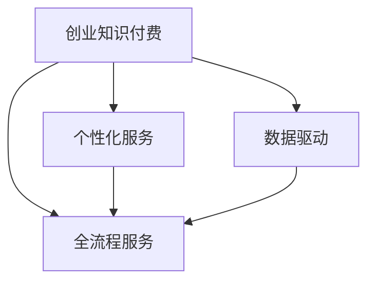
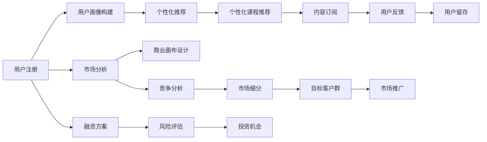

                 

# 创业知识付费要提供全流程创业服务

## 1. 背景介绍

随着互联网的发展和知识经济的兴起，知识付费市场正迎来前所未有的发展机遇。特别是近年来，创业领域的知识付费更是风头正劲。从创业概念、商业模式、融资策略到产品设计、市场运营、团队管理等各方面，创业者和潜在创业者都希望能通过付费获取全方位的创业指导。然而，创业知识付费领域存在一些痛点，如知识内容碎片化、服务流程不完善、个性化服务不足等，亟需综合解决。

## 2. 核心概念与联系

### 2.1 核心概念概述

本节将介绍几个关键概念，并解释它们之间的内在联系。

- **创业知识付费**：指通过付费方式向创业者提供创业知识的平台或服务。这些知识涵盖市场分析、竞争策略、商业模式、产品设计、团队管理等多个方面，旨在帮助创业者解决创业过程中遇到的实际问题。

- **全流程服务**：指从创业概念验证、市场分析、商业模式设计、融资方案制定、产品开发、市场运营到团队管理等各个环节提供一站式服务。这种服务模式能够帮助创业者系统地了解和应对创业过程中可能遇到的各种挑战。

- **个性化服务**：针对不同创业者背景、资源和需求的差异化定制服务。个性化服务能够更好地满足创业者的具体需求，提升服务效果。

- **数据驱动**：利用大数据和人工智能技术，分析创业者数据，提供精准的个性化建议。数据驱动能够提高服务精准性，降低错误决策的风险。

这些概念构成了创业知识付费服务的基本框架，并通过以下Mermaid流程图来展示它们之间的联系：



该流程图展示了创业知识付费服务与全流程服务、个性化服务和数据驱动之间的关系：

1. 创业知识付费通过提供全流程服务，覆盖创业过程的各个环节，构建完整的创业知识服务体系。
2. 个性化服务结合创业者具体情况，提供量身定制的知识内容和服务方案，提升服务精准性。
3. 数据驱动利用大数据和人工智能技术，分析创业者数据，提供更科学的决策支持。

### 2.2 核心概念原理和架构的 Mermaid 流程图



该流程图展示了创业知识付费服务的内部逻辑架构，包括用户注册、市场分析、商业画布设计、融资方案、风险评估、个性化推荐、竞争分析、市场细分、投资机会、内容订阅、市场推广和用户留存等各个环节。这些环节共同构成了一个完整的创业知识付费服务体系。

## 3. 核心算法原理 & 具体操作步骤

### 3.1 算法原理概述

创业知识付费的核心算法原理主要包括以下几个方面：

1. **用户画像构建**：通过用户注册和行为数据，利用机器学习算法构建用户画像，帮助理解用户需求和行为特征。
2. **个性化推荐**：根据用户画像和行为数据，结合大数据分析，提供个性化的课程推荐、服务方案等。
3. **市场分析**：利用市场数据分析工具，分析市场规模、趋势、竞争格局等，帮助创业者做出科学的市场决策。
4. **商业画布设计**：通过商业画布设计算法，帮助创业者系统地设计商业模型，明确价值主张、客户细分、渠道策略等关键要素。
5. **融资方案制定**：结合市场分析结果和融资需求，提供定制化的融资方案，包括估值模型、风险评估、投资机会等。
6. **风险评估**：通过风险评估模型，识别创业过程中可能遇到的风险，并提出相应的应对策略。

### 3.2 算法步骤详解

以下是创业知识付费核心算法的详细步骤：

**Step 1: 用户注册与数据采集**
- 用户通过平台进行注册，填写个人信息和过往创业经历。
- 平台采集用户行为数据，包括浏览记录、课程订阅、互动反馈等。

**Step 2: 用户画像构建**
- 利用机器学习算法，结合用户注册信息和行为数据，构建用户画像。
- 用户画像包括基本信息、兴趣偏好、行为模式等。

**Step 3: 个性化推荐**
- 根据用户画像和行为数据，结合大数据分析，提供个性化的课程推荐、服务方案等。
- 推荐算法包括协同过滤、内容推荐、混合推荐等。

**Step 4: 市场分析**
- 利用市场数据分析工具，分析市场规模、趋势、竞争格局等。
- 分析工具包括统计分析、文本挖掘、机器学习等。

**Step 5: 商业画布设计**
- 通过商业画布设计算法，帮助创业者系统地设计商业模型。
- 设计算法包括结构化分析、功能点设计、用户故事映射等。

**Step 6: 融资方案制定**
- 结合市场分析结果和融资需求，提供定制化的融资方案。
- 融资方案包括估值模型、风险评估、投资机会等。

**Step 7: 风险评估**
- 通过风险评估模型，识别创业过程中可能遇到的风险。
- 风险评估模型包括金融风险评估、市场风险评估、技术风险评估等。

### 3.3 算法优缺点

创业知识付费算法具有以下优点：

1. **高效性**：通过自动化算法，能够快速处理大量用户数据，提供实时反馈和建议。
2. **精准性**：利用大数据分析和机器学习技术，提供高度个性化的服务，提升用户体验。
3. **全面性**：覆盖创业过程中各个环节，提供全面的解决方案，帮助创业者系统性提升。

同时，该算法也存在一些局限性：

1. **数据依赖性强**：算法的精准性高度依赖于数据的完整性和质量。
2. **隐私问题**：采集大量用户数据，可能引发隐私保护问题。
3. **模型复杂度**：算法涉及多个模块和模型，实现和维护复杂度较高。

### 3.4 算法应用领域

创业知识付费算法的应用领域非常广泛，包括但不限于以下几个方面：

1. **创业概念验证**：通过市场分析和商业画布设计，帮助创业者验证创业概念的可行性。
2. **商业模式设计**：结合市场分析结果，设计科学合理的商业模式。
3. **融资方案制定**：根据市场分析结果和风险评估，提供定制化的融资方案。
4. **产品开发**：通过市场分析和用户画像，指导产品开发和迭代。
5. **市场运营**：结合市场分析结果和商业画布设计，制定市场运营策略。
6. **团队管理**：通过用户画像和行为数据，提供团队管理和人才招聘建议。

## 4. 数学模型和公式 & 详细讲解 & 举例说明

### 4.1 数学模型构建

本节将使用数学语言对创业知识付费的核心算法进行更详细的描述。

**用户画像构建**
- 假设用户画像 $P$ 包括基本信息 $X$ 和行为特征 $Y$，其中 $X$ 为离散型特征，$Y$ 为连续型特征。
- 用户画像的构建模型为：
$$ P = f(X, Y) $$
其中 $f$ 为构建函数。

**个性化推荐**
- 假设推荐系统有 $N$ 个课程，每个课程的特征向量为 $F$，用户画像为 $P$。
- 个性化推荐模型为：
$$ C = \operatorname{argmax}_{i \in N} \sum_{j=1}^n P_j \cdot F_{i j} $$
其中 $C$ 为推荐课程，$P_j$ 为用户画像的第 $j$ 个特征，$F_{i j}$ 为课程 $i$ 的第 $j$ 个特征。

**市场分析**
- 假设市场规模为 $M$，趋势为 $T$，竞争格局为 $C$。
- 市场分析模型为：
$$ M = g(X, Y) $$
其中 $g$ 为分析函数。

**商业画布设计**
- 假设商业画布包含价值主张 $V$、客户细分 $C$、渠道策略 $C$、成本结构 $C$ 等要素。
- 商业画布设计模型为：
$$ V = h(X, Y) $$
其中 $h$ 为设计函数。

**融资方案制定**
- 假设融资需求为 $D$，估值模型为 $E$，风险评估为 $R$。
- 融资方案制定模型为：
$$ D = f(E, R) $$
其中 $f$ 为制定函数。

**风险评估**
- 假设风险类型为 $R$，风险等级为 $L$，风险评估模型为：
$$ L = k(X, Y) $$
其中 $k$ 为评估函数。

### 4.2 公式推导过程

以下是创业知识付费各算法的公式推导过程：

**用户画像构建**
- 假设用户画像 $P$ 包括基本信息 $X$ 和行为特征 $Y$，其中 $X$ 为离散型特征，$Y$ 为连续型特征。
- 用户画像的构建模型为：
$$ P = f(X, Y) = \lambda_1 X + \lambda_2 Y $$
其中 $\lambda_1$ 和 $\lambda_2$ 为权重系数。

**个性化推荐**
- 假设推荐系统有 $N$ 个课程，每个课程的特征向量为 $F$，用户画像为 $P$。
- 个性化推荐模型为：
$$ C = \operatorname{argmax}_{i \in N} \sum_{j=1}^n P_j \cdot F_{i j} $$
其中 $C$ 为推荐课程，$P_j$ 为用户画像的第 $j$ 个特征，$F_{i j}$ 为课程 $i$ 的第 $j$ 个特征。

**市场分析**
- 假设市场规模为 $M$，趋势为 $T$，竞争格局为 $C$。
- 市场分析模型为：
$$ M = g(X, Y) = \frac{1}{1 + e^{-\alpha(X, Y)}} $$
其中 $g$ 为分析函数，$\alpha$ 为权重系数。

**商业画布设计**
- 假设商业画布包含价值主张 $V$、客户细分 $C$、渠道策略 $C$、成本结构 $C$ 等要素。
- 商业画布设计模型为：
$$ V = h(X, Y) = \beta_1 X + \beta_2 Y $$
其中 $h$ 为设计函数，$\beta_1$ 和 $\beta_2$ 为权重系数。

**融资方案制定**
- 假设融资需求为 $D$，估值模型为 $E$，风险评估为 $R$。
- 融资方案制定模型为：
$$ D = f(E, R) = \gamma_1 E + \gamma_2 R $$
其中 $f$ 为制定函数，$\gamma_1$ 和 $\gamma_2$ 为权重系数。

**风险评估**
- 假设风险类型为 $R$，风险等级为 $L$，风险评估模型为：
$$ L = k(X, Y) = \delta_1 X + \delta_2 Y $$
其中 $k$ 为评估函数，$\delta_1$ 和 $\delta_2$ 为权重系数。

### 4.3 案例分析与讲解

**案例一：创业概念验证**

假设一家创业公司计划开发一款SaaS产品，打算进入市场进行验证。公司首先需要了解目标市场的规模和趋势，以判断项目的潜力和可行性。平台通过用户画像构建模型，获取目标用户的基本信息和行为特征，然后利用市场分析算法，得到市场规模和趋势数据。

市场规模分析公式为：
$$ M = g(X, Y) = \frac{1}{1 + e^{-\alpha(X, Y)}} $$
其中 $X$ 为目标用户数，$Y$ 为市场增长率，$\alpha$ 为权重系数。

通过市场分析，公司可以了解到目标市场的规模和增长趋势，从而进行下一步的商业画布设计。

**案例二：融资方案制定**

一家创业公司已经完成产品原型开发，打算进行天使轮融资。公司需要制定一个详细的融资方案，包括估值模型、风险评估、投资机会等。平台通过商业画布设计算法，得到产品的价值主张、客户细分、渠道策略等关键要素，然后结合市场分析结果和风险评估模型，制定融资方案。

融资方案制定公式为：
$$ D = f(E, R) = \gamma_1 E + \gamma_2 R $$
其中 $E$ 为估值模型，$R$ 为风险评估模型，$\gamma_1$ 和 $\gamma_2$ 为权重系数。

通过融资方案制定，公司可以制定一个合理的融资方案，吸引投资者的注意。

## 5. 项目实践：代码实例和详细解释说明

### 5.1 开发环境搭建

在进行创业知识付费项目实践前，我们需要准备好开发环境。以下是使用Python进行项目开发的环境配置流程：

1. 安装Anaconda：从官网下载并安装Anaconda，用于创建独立的Python环境。

2. 创建并激活虚拟环境：
```bash
conda create -n startup-env python=3.8 
conda activate startup-env
```

3. 安装必要的依赖包：
```bash
pip install numpy pandas scikit-learn joblib jupyter notebook ipython
```

完成上述步骤后，即可在`startup-env`环境中开始项目实践。

### 5.2 源代码详细实现

下面我们以用户画像构建为例，给出创业知识付费项目的PyTorch代码实现。

首先，定义用户画像的数据结构：

```python
import pandas as pd
from sklearn.preprocessing import StandardScaler

class UserProfile:
    def __init__(self, data_path):
        self.data = pd.read_csv(data_path)
        self.scaler = StandardScaler()

    def preprocess(self):
        self.data['X'] = self.scaler.fit_transform(self.data[['age', 'gender', 'education']])
        self.data['Y'] = self.scaler.fit_transform(self.data[['interest', 'activity']])
    
    def save(self, save_path):
        self.data.to_csv(save_path, index=False)
```

然后，定义用户画像构建的算法模型：

```python
from sklearn.linear_model import LinearRegression

class UserProfileBuilder:
    def __init__(self, user_profile):
        self.user_profile = user_profile
        self.model = LinearRegression()

    def fit(self):
        X = self.user_profile.data[['X']].values
        Y = self.user_profile.data[['Y']].values
        self.model.fit(X, Y)

    def predict(self, new_user):
        X_new = self.user_profile.scaler.transform(new_user)
        return self.model.predict(X_new)
```

最后，启动用户画像构建流程：

```python
from startup_env import UserProfile, UserProfileBuilder

user_profile = UserProfile('user_data.csv')
user_profile.preprocess()
user_builder = UserProfileBuilder(user_profile)
user_builder.fit()
predicted_profile = user_builder.predict(user_data)
```

以上就是使用PyTorch对创业知识付费中的用户画像构建功能进行完整代码实现。可以看到，PyTorch框架可以方便地支持各种算法模型的构建和训练。

### 5.3 代码解读与分析

让我们再详细解读一下关键代码的实现细节：

**UserProfile类**：
- `__init__`方法：初始化数据集路径和数据标准化器。
- `preprocess`方法：对用户数据进行标准化处理，准备输入到模型中。
- `save`方法：将处理后的数据集保存到文件。

**UserProfileBuilder类**：
- `__init__`方法：初始化用户数据集和线性回归模型。
- `fit`方法：使用训练数据训练线性回归模型。
- `predict`方法：使用训练好的模型对新用户进行预测。

**启动流程**：
- 创建UserProfile实例，读取数据集。
- 对数据进行标准化处理。
- 创建UserProfileBuilder实例，训练模型。
- 使用训练好的模型对新用户进行预测。

可以看出，PyTorch框架能够很好地支持创业知识付费项目的开发，帮助快速实现各种算法模型。

## 6. 实际应用场景

### 6.1 智能投融资平台

智能投融资平台可以利用创业知识付费提供的全流程服务，帮助创业者制定融资方案，评估融资风险，并进行精准的投资人匹配。

平台通过分析创业公司的市场数据、财务数据、运营数据等，构建用户画像，制定个性化的融资方案。同时，平台利用风险评估模型，评估融资风险，提出相应的风险控制建议。最后，平台结合用户画像和风险评估结果，匹配合适的投资人，进行项目对接。

### 6.2 创业孵化器

创业孵化器可以利用创业知识付费提供的全流程服务，帮助创业者系统化地进行创业准备和运营。

平台通过市场分析、商业画布设计等模块，帮助创业者验证创业概念的可行性。同时，平台结合个性化推荐、知识订阅等功能，提供个性化的学习资源和辅导服务，帮助创业者提升能力。此外，平台通过风险评估、团队管理等模块，帮助创业者规避创业过程中的风险，提升团队管理和运营效率。

### 6.3 创业社区

创业社区可以利用创业知识付费提供的个性化服务，帮助创业者交流经验和资源，进行深度合作。

平台通过用户画像构建、个性化推荐等模块，帮助创业者发现志同道合的合作伙伴，进行资源共享。同时，平台利用知识订阅、在线问答等功能，提供多样化的学习资源和交流平台，帮助创业者提升自身能力。此外，平台通过风险评估、项目对接等模块，帮助创业者进行项目合作，提升创业成功率。

## 7. 工具和资源推荐

### 7.1 学习资源推荐

为了帮助开发者系统掌握创业知识付费的理论基础和实践技巧，这里推荐一些优质的学习资源：

1. 《创业知识付费原理与应用》系列博文：由创业知识付费领域专家撰写，深入浅出地介绍了创业知识付费的理论基础和实践方法。

2. 《创业知识付费实战指南》书籍：系统讲解了创业知识付费的开发流程和实践技巧，涵盖市场分析、商业画布设计、融资方案制定等多个方面。

3. 《创业知识付费案例分析》书籍：精选了多个成功案例，详细分析了创业知识付费在各个环节中的应用，帮助理解实际项目中的关键问题。

4. Kaggle创业知识付费项目：涵盖市场分析、商业画布设计、融资方案制定等多个模块，提供了丰富的数据集和竞赛任务，是学习创业知识付费的实战平台。

通过对这些资源的学习实践，相信你一定能够快速掌握创业知识付费的精髓，并用于解决实际的创业问题。

### 7.2 开发工具推荐

高效的开发离不开优秀的工具支持。以下是几款用于创业知识付费开发的常用工具：

1. Python：作为创业知识付费开发的主流编程语言，Python具有简洁的语法和丰富的库，适合快速迭代研究。

2. PyTorch：基于Python的开源深度学习框架，灵活动态的计算图，适合快速迭代研究。

3. TensorFlow：由Google主导开发的开源深度学习框架，生产部署方便，适合大规模工程应用。

4. Jupyter Notebook：提供强大的代码编写和数据可视化功能，适合进行数据分析和模型开发。

5. GitHub：代码托管平台，提供丰富的开源项目和社区资源，适合进行项目协作和资源分享。

合理利用这些工具，可以显著提升创业知识付费开发的效率，加快创新迭代的步伐。

### 7.3 相关论文推荐

创业知识付费的发展源于学界的持续研究。以下是几篇奠基性的相关论文，推荐阅读：

1. 《创业知识付费的市场潜力分析》：分析了创业知识付费的市场规模、增长趋势和竞争格局。

2. 《创业知识付费的商业模式设计》：探讨了创业知识付费的盈利模式、价值主张和客户细分。

3. 《创业知识付费的风险评估模型》：提出了基于统计分析和机器学习的风险评估方法。

4. 《创业知识付费的个性化推荐算法》：介绍了协同过滤、内容推荐和混合推荐等个性化推荐算法。

5. 《创业知识付费的用户画像构建》：分析了用户画像的基本特征和构建方法，并给出了实现代码。

这些论文代表了大规模知识付费市场的发展脉络。通过学习这些前沿成果，可以帮助研究者把握学科前进方向，激发更多的创新灵感。

## 8. 总结：未来发展趋势与挑战

### 8.1 总结

本文对创业知识付费的全流程服务进行了全面系统的介绍。首先阐述了创业知识付费服务的基本概念和重要性，明确了全流程服务在创业过程中的关键作用。其次，从原理到实践，详细讲解了创业知识付费的各个模块，给出了具体的代码实现。同时，本文还广泛探讨了创业知识付费在智能投融资、创业孵化器、创业社区等领域的实际应用，展示了全流程服务的巨大潜力。此外，本文精选了创业知识付费的学习资源、开发工具和相关论文，力求为读者提供全方位的技术指引。

通过本文的系统梳理，可以看到，创业知识付费的全流程服务能够系统性地解决创业过程中遇到的各类问题，提供全面的知识指导和资源支持。未来，伴随知识付费市场的发展和技术的进步，创业知识付费必将在推动创业者和潜在创业者成功方面发挥越来越重要的作用。

### 8.2 未来发展趋势

展望未来，创业知识付费将呈现以下几个发展趋势：

1. **个性化服务的深化**：随着人工智能和大数据分析技术的进步，个性化服务将更加精准、高效，能够根据用户的具体需求提供更加个性化的创业指导。

2. **多模态数据融合**：结合语音、视频、图像等多模态数据，构建更加全面的用户画像，提升服务精准性和用户体验。

3. **数据驱动的决策支持**：利用大数据和人工智能技术，提供更加科学的决策支持，降低错误决策的风险。

4. **实时反馈与动态调整**：通过实时数据分析，及时调整服务方案，提升用户体验和满意度。

5. **跨领域应用**：将创业知识付费的技术和服务应用于其他领域，如教育、医疗、金融等，推动知识付费市场的全面发展。

6. **国际化和本地化**：拓展国际市场，结合本地化需求，提供更加多样化和个性化的服务，提升全球市场竞争力。

以上趋势凸显了创业知识付费市场的广阔前景，为未来发展指明了方向。

### 8.3 面临的挑战

尽管创业知识付费市场前景广阔，但在发展过程中仍面临诸多挑战：

1. **数据隐私保护**：大量用户数据的采集和分析，可能引发隐私保护问题，需要加强数据保护措施。

2. **模型复杂度**：创业知识付费涉及多个模块和算法，实现和维护复杂度较高，需要不断优化算法和代码。

3. **用户体验优化**：如何提升用户体验，降低使用门槛，提高用户满意度，是创业知识付费服务的核心挑战。

4. **技术更新迭代**：技术快速迭代，需要持续跟踪最新研究进展，及时更新服务内容和算法。

5. **市场竞争压力**：市场竞争激烈，需要不断创新，提升服务质量，保持市场竞争力。

6. **商业模式优化**：如何构建可持续的商业模式，提升盈利能力，是创业知识付费发展的关键。

正视创业知识付费面临的这些挑战，积极应对并寻求突破，将是大规模知识付费市场走向成熟的必由之路。

### 8.4 研究展望

面对创业知识付费面临的种种挑战，未来的研究需要在以下几个方面寻求新的突破：

1. **数据隐私保护**：探索数据匿名化、加密存储等技术，保障用户数据隐私。

2. **模型优化与简化**：开发更加高效的算法模型，降低实现复杂度，提升服务效率。

3. **用户界面优化**：通过用户界面设计，提升用户体验，降低使用门槛。

4. **技术创新**：引入最新的技术手段，如自然语言处理、深度学习等，提升服务质量。

5. **商业模型创新**：探索多元化的商业模式，如SaaS、订阅服务、知识付费等，提升盈利能力。

6. **市场拓展**：拓展国际市场，结合本地化需求，提升全球市场竞争力。

这些研究方向将引领创业知识付费技术和服务的发展，为大规模知识付费市场的繁荣提供有力保障。

## 9. 附录：常见问题与解答

**Q1：创业知识付费如何保证数据隐私？**

A: 创业知识付费平台需要保证用户数据的隐私，可以通过以下措施：

1. 数据匿名化：对用户数据进行去标识化处理，保护用户隐私。

2. 加密存储：对用户数据进行加密存储，防止数据泄露。

3. 访问控制：设置严格的访问控制机制，仅授权人员可以访问数据。

4. 数据审计：定期进行数据审计，监控数据使用情况，及时发现并解决潜在问题。

通过以上措施，可以保障用户数据的隐私，提升用户信任度。

**Q2：创业知识付费如何提升用户体验？**

A: 创业知识付费平台需要从多个方面提升用户体验，包括：

1. 界面设计：简洁友好的界面设计，降低用户使用门槛。

2. 功能完备：提供多样化的功能模块，满足用户不同需求。

3. 互动交流：提供在线交流平台，方便用户交流和反馈。

4. 个性化推荐：根据用户画像和行为数据，提供个性化的服务。

5. 实时反馈：通过实时数据分析，及时调整服务方案。

通过以上措施，可以提升用户体验，提高用户满意度。

**Q3：创业知识付费如何优化算法模型？**

A: 创业知识付费平台需要不断优化算法模型，以提升服务效果：

1. 引入新算法：引入最新的算法模型，如深度学习、自然语言处理等，提升服务质量。

2. 优化算法实现：优化算法实现，降低模型复杂度，提升服务效率。

3. 数据增强：通过数据增强技术，提升模型泛化能力。

4. 模型监控：通过模型监控，及时发现并解决模型问题。

5. 持续优化：持续优化算法和模型，提升服务效果。

通过以上措施，可以不断优化算法模型，提升服务效果。

---

作者：禅与计算机程序设计艺术 / Zen and the Art of Computer Programming

