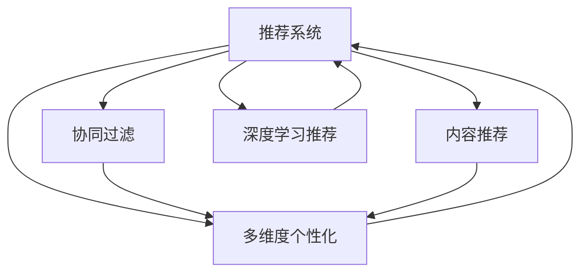

                 

# 利用LLM优化推荐系统的多维度个性化

> 关键词：推荐系统,多维度个性化,LLM(语言模型),用户兴趣建模,协同过滤,混合推荐系统,深度学习

## 1. 背景介绍

在数字化时代，推荐系统已经成为各互联网平台的重要基础设施，通过为用户推荐感兴趣的物品，提升用户体验和平台价值。传统的推荐系统主要依赖协同过滤、内容推荐等技术，但随着数据量的增加和用户需求的细化，单一的推荐方式已无法满足用户的多样化需求。近年来，利用深度学习技术，特别是大语言模型(LLM)进行个性化推荐成为研究热点。

推荐系统通过用户的行为数据，为用户推荐可能感兴趣的商品、文章、视频等。用户的行为数据一般包括浏览、点击、评分、收藏、购买等。传统的推荐系统主要依赖协同过滤、内容推荐等技术，但随着数据量的增加和用户需求的细化，单一的推荐方式已无法满足用户的多样化需求。

深度学习技术通过学习用户行为数据背后的语义信息，能够更准确地捕捉用户兴趣，提供个性化推荐。特别是近年来，利用大语言模型(LLM)进行推荐成为研究热点。LLM能够通过学习大规模语料库，捕捉语言中的复杂规律，从而在推荐系统中发挥重要作用。

## 2. 核心概念与联系

### 2.1 核心概念概述

为更好地理解基于LLM的推荐系统，本节将介绍几个密切相关的核心概念：

- 推荐系统：一种通过分析用户行为数据，为用户推荐可能感兴趣的物品的系统。推荐系统的目标是提升用户体验和平台价值。

- 多维度个性化：推荐系统中的多维度个性化是指利用多种特征来刻画用户兴趣，提高推荐的准确性。这些特征包括历史行为数据、社交网络信息、用户画像等。

- 大语言模型(LLM)：一种能够学习大规模文本数据并具备良好泛化能力的深度学习模型。LLM包括自回归模型(如GPT系列)和自编码模型(如BERT系列)等，能够通过预训练和微调，学习语言的通用表示和特定领域的知识。

- 协同过滤：一种基于用户行为相似性的推荐方法，通过寻找与目标用户行为相似的活跃用户，实现物品的推荐。

- 内容推荐：一种基于物品属性和用户偏好的推荐方法，通过相似物品推荐、内容相似性推荐等方式，为用户推荐感兴趣的物品。

- 混合推荐系统：一种结合多种推荐方法，利用协同过滤、内容推荐、深度学习等手段，实现综合推荐的系统。

这些核心概念之间的逻辑关系可以通过以下Mermaid流程图来展示：



这个流程图展示了几类关键推荐方法之间的联系：

1. 推荐系统是各类推荐方法的总称，包括协同过滤、内容推荐和深度学习推荐。
2. 多维度个性化是通过多种特征刻画用户兴趣，提高推荐效果的一种方法。
3. 深度学习推荐中，大语言模型是其中一种强大的技术手段，能够学习用户行为数据中的语义信息，提升推荐系统的精准度。
4. 协同过滤和内容推荐是深度学习推荐的基础，多维度个性化是深度学习推荐的重要补充。

## 3. 核心算法原理 & 具体操作步骤
### 3.1 算法原理概述

基于LLM的推荐系统，核心在于利用深度学习模型学习用户行为数据中的语义信息，从而实现更精准的个性化推荐。

假设用户的历史行为数据为 $\mathcal{D}=\{(x_i,y_i)\}_{i=1}^N$，其中 $x_i$ 表示用户对物品 $i$ 的交互数据（如浏览、点击、评分等），$y_i$ 表示物品 $i$ 的标签或特征。

在大语言模型中，通常使用Transformer模型作为基础框架，通过预训练和微调，学习物品和用户行为的语义表示。微调的目标是最大化用户行为数据上的预测准确率，即：

$$
\theta^* = \mathop{\arg\min}_{\theta} \mathcal{L}(M_{\theta},\mathcal{D})
$$

其中，$M_{\theta}$ 表示使用预训练权重 $\theta$ 的LLM模型，$\mathcal{L}$ 表示模型的损失函数，$\mathcal{D}$ 表示用户行为数据。

### 3.2 算法步骤详解

基于LLM的推荐系统一般包括以下几个关键步骤：

**Step 1: 数据预处理**

- 将用户行为数据 $\mathcal{D}$ 进行标准化处理，去除噪声和不必要的特征。
- 对用户行为数据进行分词、编码等预处理，以适应LLM的输入格式。
- 将用户和物品的特征数据进行归一化和向量化处理，方便模型训练。

**Step 2: 数据划分**

- 将数据集划分为训练集 $\mathcal{D}_{train}$ 和测试集 $\mathcal{D}_{test}$。
- 将训练集进一步划分为训练集 $\mathcal{D}_{train}$ 和验证集 $\mathcal{D}_{val}$。

**Step 3: 预训练模型选择**

- 选择合适的预训练模型，如BERT、GPT-3等，作为初始化参数。
- 在预训练模型上，选择合适的微调任务，如预测用户行为标签、生成用户行为序列等。

**Step 4: 微调训练**

- 使用训练集 $\mathcal{D}_{train}$ 对预训练模型进行微调。
- 定义损失函数，如交叉熵损失、均方误差损失等，计算模型在训练集上的损失。
- 使用梯度下降等优化算法，更新模型参数，最小化损失函数。

**Step 5: 模型评估**

- 使用验证集 $\mathcal{D}_{val}$ 评估模型性能，调整超参数。
- 使用测试集 $\mathcal{D}_{test}$ 评估最终模型效果，确保推荐效果。

**Step 6: 推荐生成**

- 将用户行为数据输入微调后的LLM模型，生成物品推荐列表。
- 利用用户行为数据和物品特征，进行物品排序和筛选。
- 生成个性化推荐结果，推送给用户。

### 3.3 算法优缺点

基于LLM的推荐系统具有以下优点：

- 精度高：LLM能够学习用户行为数据中的语义信息，提高推荐的精准度。
- 灵活性高：LLM可以处理复杂的语义结构，适应不同类型的推荐任务。
- 可解释性强：通过分析模型输出的语义信息，可以解释推荐结果的逻辑。

同时，该方法也存在一定的局限性：

- 计算量大：大规模LLM模型需要大量的计算资源，训练和推理速度较慢。
- 数据需求高：需要大量标注数据进行预训练和微调，对数据量要求较高。
- 模型复杂度高：复杂模型可能会导致过拟合，需要精细调参。
- 适应性差：当新领域或新任务出现时，LLM需要重新进行预训练和微调。

尽管存在这些局限性，但就目前而言，基于LLM的推荐系统仍是大数据时代下推荐技术的重要方向。未来相关研究的重点在于如何进一步降低计算资源需求，提高模型的泛化能力，同时兼顾模型的可解释性和适应性等因素。

### 3.4 算法应用领域

基于大语言模型的推荐系统已经在电商、新闻、音乐、视频等多个领域得到广泛应用，取得了优异的推荐效果。例如：

- 电商平台：利用LLM对用户浏览历史和评分数据进行建模，推荐商品。
- 新闻平台：对用户阅读记录和点击数据进行语义分析，推荐新闻文章。
- 音乐平台：根据用户听歌历史和评分，推荐相似曲目。
- 视频平台：利用LLM对用户观看记录和互动数据进行建模，推荐视频内容。

除了这些传统应用外，大语言模型在推荐系统中的应用还在不断创新，如文本生成、多任务学习、用户画像生成等，为推荐系统带来了新的突破。随着预训练模型和微调方法的不断进步，相信推荐系统将在更广阔的应用领域大放异彩。

## 4. 数学模型和公式 & 详细讲解  
### 4.1 数学模型构建

本节将使用数学语言对基于LLM的推荐系统进行更加严格的刻画。

记预训练模型为 $M_{\theta}$，其中 $\theta$ 为预训练得到的模型参数。假设用户的历史行为数据为 $\mathcal{D}=\{(x_i,y_i)\}_{i=1}^N$，其中 $x_i$ 表示用户对物品 $i$ 的交互数据，$y_i$ 表示物品 $i$ 的标签或特征。

定义模型 $M_{\theta}$ 在数据样本 $(x,y)$ 上的损失函数为 $\ell(M_{\theta}(x),y)$，则在数据集 $\mathcal{D}$ 上的经验风险为：

$$
\mathcal{L}(\theta) = \frac{1}{N}\sum_{i=1}^N \ell(M_{\theta}(x_i),y_i)
$$

微调的目标是最小化经验风险，即找到最优参数：

$$
\theta^* = \mathop{\arg\min}_{\theta} \mathcal{L}(\theta)
$$

在实践中，我们通常使用基于梯度的优化算法（如AdamW、SGD等）来近似求解上述最优化问题。设 $\eta$ 为学习率，$\lambda$ 为正则化系数，则参数的更新公式为：

$$
\theta \leftarrow \theta - \eta \nabla_{\theta}\mathcal{L}(\theta) - \eta\lambda\theta
$$

其中 $\nabla_{\theta}\mathcal{L}(\theta)$ 为损失函数对参数 $\theta$ 的梯度，可通过反向传播算法高效计算。

### 4.2 公式推导过程

以下我们以用户行为数据为训练数据，对LLM进行微调，并利用微调后的模型进行推荐任务。

假设用户的行为数据为 $\mathcal{D}=\{(x_i,y_i)\}_{i=1}^N$，其中 $x_i$ 表示用户对物品 $i$ 的交互数据，$y_i$ 表示物品 $i$ 的标签或特征。模型 $M_{\theta}$ 在输入 $x$ 上的输出为 $\hat{y}=M_{\theta}(x)$，表示物品 $i$ 的预测标签或特征。

二分类交叉熵损失函数定义为：

$$
\ell(M_{\theta}(x),y) = -[y\log \hat{y} + (1-y)\log (1-\hat{y})]
$$

将其代入经验风险公式，得：

$$
\mathcal{L}(\theta) = -\frac{1}{N}\sum_{i=1}^N [y_i\log M_{\theta}(x_i)+(1-y_i)\log(1-M_{\theta}(x_i))]
$$

根据链式法则，损失函数对参数 $\theta_k$ 的梯度为：

$$
\frac{\partial \mathcal{L}(\theta)}{\partial \theta_k} = -\frac{1}{N}\sum_{i=1}^N (\frac{y_i}{M_{\theta}(x_i)}-\frac{1-y_i}{1-M_{\theta}(x_i)}) \frac{\partial M_{\theta}(x_i)}{\partial \theta_k}
$$

其中 $\frac{\partial M_{\theta}(x_i)}{\partial \theta_k}$ 可进一步递归展开，利用自动微分技术完成计算。

在得到损失函数的梯度后，即可带入参数更新公式，完成模型的迭代优化。重复上述过程直至收敛，最终得到适应下游任务的最优模型参数 $\theta^*$。

## 5. 项目实践：代码实例和详细解释说明
### 5.1 开发环境搭建

在进行推荐系统开发前，我们需要准备好开发环境。以下是使用Python进行PyTorch开发的环境配置流程：

1. 安装Anaconda：从官网下载并安装Anaconda，用于创建独立的Python环境。

2. 创建并激活虚拟环境：
```bash
conda create -n pytorch-env python=3.8 
conda activate pytorch-env
```

3. 安装PyTorch：根据CUDA版本，从官网获取对应的安装命令。例如：
```bash
conda install pytorch torchvision torchaudio cudatoolkit=11.1 -c pytorch -c conda-forge
```

4. 安装TensorFlow：
```bash
conda install tensorflow
```

5. 安装Transformers库：
```bash
pip install transformers
```

6. 安装各类工具包：
```bash
pip install numpy pandas scikit-learn matplotlib tqdm jupyter notebook ipython
```

完成上述步骤后，即可在`pytorch-env`环境中开始推荐系统开发。

### 5.2 源代码详细实现

这里我们以电商推荐系统为例，给出使用Transformers库对BERT模型进行推荐系统的PyTorch代码实现。

首先，定义推荐系统的数据处理函数：

```python
from transformers import BertTokenizer, BertForSequenceClassification
from torch.utils.data import Dataset
import torch

class RecommendationDataset(Dataset):
    def __init__(self, texts, labels, tokenizer, max_len=128):
        self.texts = texts
        self.labels = labels
        self.tokenizer = tokenizer
        self.max_len = max_len
        
    def __len__(self):
        return len(self.texts)
    
    def __getitem__(self, item):
        text = self.texts[item]
        label = self.labels[item]
        
        encoding = self.tokenizer(text, return_tensors='pt', max_length=self.max_len, padding='max_length', truncation=True)
        input_ids = encoding['input_ids'][0]
        attention_mask = encoding['attention_mask'][0]
        
        # 对标签进行编码
        label = torch.tensor(label, dtype=torch.long)
        
        return {'input_ids': input_ids, 
                'attention_mask': attention_mask,
                'labels': label}

# 定义标签与id的映射
label2id = {0: 'not_recommend', 1: 'recommend'}
id2label = {v: k for k, v in label2id.items()}

# 创建dataset
tokenizer = BertTokenizer.from_pretrained('bert-base-cased')

train_dataset = RecommendationDataset(train_texts, train_labels, tokenizer)
val_dataset = RecommendationDataset(val_texts, val_labels, tokenizer)
test_dataset = RecommendationDataset(test_texts, test_labels, tokenizer)
```

然后，定义模型和优化器：

```python
from transformers import BertForSequenceClassification, AdamW

model = BertForSequenceClassification.from_pretrained('bert-base-cased', num_labels=len(label2id))

optimizer = AdamW(model.parameters(), lr=2e-5)
```

接着，定义训练和评估函数：

```python
from torch.utils.data import DataLoader
from tqdm import tqdm
from sklearn.metrics import classification_report

device = torch.device('cuda') if torch.cuda.is_available() else torch.device('cpu')
model.to(device)

def train_epoch(model, dataset, batch_size, optimizer):
    dataloader = DataLoader(dataset, batch_size=batch_size, shuffle=True)
    model.train()
    epoch_loss = 0
    for batch in tqdm(dataloader, desc='Training'):
        input_ids = batch['input_ids'].to(device)
        attention_mask = batch['attention_mask'].to(device)
        labels = batch['labels'].to(device)
        model.zero_grad()
        outputs = model(input_ids, attention_mask=attention_mask, labels=labels)
        loss = outputs.loss
        epoch_loss += loss.item()
        loss.backward()
        optimizer.step()
    return epoch_loss / len(dataloader)

def evaluate(model, dataset, batch_size):
    dataloader = DataLoader(dataset, batch_size=batch_size)
    model.eval()
    preds, labels = [], []
    with torch.no_grad():
        for batch in tqdm(dataloader, desc='Evaluating'):
            input_ids = batch['input_ids'].to(device)
            attention_mask = batch['attention_mask'].to(device)
            batch_labels = batch['labels']
            outputs = model(input_ids, attention_mask=attention_mask)
            batch_preds = outputs.logits.argmax(dim=2).to('cpu').tolist()
            batch_labels = batch_labels.to('cpu').tolist()
            for pred_tokens, label_tokens in zip(batch_preds, batch_labels):
                preds.append(pred_tokens)
                labels.append(label_tokens)
                
    print(classification_report(labels, preds))
```

最后，启动训练流程并在测试集上评估：

```python
epochs = 5
batch_size = 16

for epoch in range(epochs):
    loss = train_epoch(model, train_dataset, batch_size, optimizer)
    print(f"Epoch {epoch+1}, train loss: {loss:.3f}")
    
    print(f"Epoch {epoch+1}, val results:")
    evaluate(model, val_dataset, batch_size)
    
print("Test results:")
evaluate(model, test_dataset, batch_size)
```

以上就是使用PyTorch对BERT进行电商推荐系统微调的完整代码实现。可以看到，得益于Transformers库的强大封装，我们可以用相对简洁的代码完成BERT模型的加载和微调。

### 5.3 代码解读与分析

让我们再详细解读一下关键代码的实现细节：

**RecommendationDataset类**：
- `__init__`方法：初始化文本、标签、分词器等关键组件。
- `__len__`方法：返回数据集的样本数量。
- `__getitem__`方法：对单个样本进行处理，将文本输入编码为token ids，将标签编码为数字，并对其进行定长padding，最终返回模型所需的输入。

**label2id和id2label字典**：
- 定义了标签与数字id之间的映射关系，用于将预测结果解码回真实的标签。

**训练和评估函数**：
- 使用PyTorch的DataLoader对数据集进行批次化加载，供模型训练和推理使用。
- 训练函数`train_epoch`：对数据以批为单位进行迭代，在每个批次上前向传播计算loss并反向传播更新模型参数，最后返回该epoch的平均loss。
- 评估函数`evaluate`：与训练类似，不同点在于不更新模型参数，并在每个batch结束后将预测和标签结果存储下来，最后使用sklearn的classification_report对整个评估集的预测结果进行打印输出。

**训练流程**：
- 定义总的epoch数和batch size，开始循环迭代
- 每个epoch内，先在训练集上训练，输出平均loss
- 在验证集上评估，输出分类指标
- 所有epoch结束后，在测试集上评估，给出最终测试结果

可以看到，PyTorch配合Transformers库使得BERT微调的代码实现变得简洁高效。开发者可以将更多精力放在数据处理、模型改进等高层逻辑上，而不必过多关注底层的实现细节。

当然，工业级的系统实现还需考虑更多因素，如模型的保存和部署、超参数的自动搜索、更灵活的任务适配层等。但核心的微调范式基本与此类似。

## 6. 实际应用场景
### 6.1 电商推荐

基于大语言模型微调的推荐系统，可以在电商平台上为用户提供个性化的商品推荐。传统推荐系统往往依赖于用户的浏览、点击、购买行为数据，但难以捕捉用户真正的兴趣。而利用LLM进行推荐，能够学习用户行为数据中的语义信息，从而提供更精准的个性化推荐。

在技术实现上，可以收集用户的历史行为数据，将物品描述、标签等文本信息作为输入，利用微调后的LLM模型进行推荐预测。LLM能够从用户的行为数据中提取语义特征，捕捉用户对商品的真实兴趣。同时，LLM还可以处理文本生成任务，通过生成用户评价或摘要，进一步增强推荐效果。

### 6.2 新闻个性化

在新闻推荐系统中，利用大语言模型进行推荐能够提升个性化推荐的效果。传统新闻推荐系统通常基于用户的浏览和点击记录，难以捕捉用户的深度兴趣。而通过利用LLM对新闻内容进行语义分析，可以发现用户对新闻的真正兴趣。

具体而言，可以收集用户的历史阅读记录和点击数据，利用微调后的LLM模型进行新闻推荐。LLM能够从新闻标题、摘要中提取关键语义信息，判断用户对新闻的兴趣。同时，LLM还可以进行文本生成任务，生成新闻推荐摘要，提升推荐效果。

### 6.3 音乐推荐

音乐推荐系统也可以利用大语言模型进行个性化推荐。传统音乐推荐系统通常基于用户的听歌历史和评分数据，难以捕捉用户对音乐的深度兴趣。而通过利用LLM对音乐文本信息进行语义分析，可以发现用户对音乐的真正兴趣。

具体而言，可以收集用户的历史听歌记录和评分数据，利用微调后的LLM模型进行音乐推荐。LLM能够从歌曲名称、歌词中提取关键语义信息，判断用户对音乐的兴趣。同时，LLM还可以进行文本生成任务，生成歌曲推荐摘要，提升推荐效果。

### 6.4 视频推荐

在视频推荐系统中，利用大语言模型进行推荐也能够提升个性化推荐的效果。传统视频推荐系统通常基于用户的观看历史和互动数据，难以捕捉用户对视频的深度兴趣。而通过利用LLM对视频内容进行语义分析，可以发现用户对视频的真正兴趣。

具体而言，可以收集用户的历史观看记录和互动数据，利用微调后的LLM模型进行视频推荐。LLM能够从视频标题、描述中提取关键语义信息，判断用户对视频的兴趣。同时，LLM还可以进行文本生成任务，生成视频推荐摘要，提升推荐效果。

### 6.5 未来应用展望

随着大语言模型和微调方法的不断发展，基于微调的推荐系统将在更多领域得到应用，为传统行业带来变革性影响。

在智慧医疗领域，基于微调的医疗推荐系统可以帮助医生推荐患者可能需要的药品、治疗方案等，提升医疗服务的智能化水平。

在智能教育领域，利用微调技术可以推荐适合学生的学习资源，因材施教，促进教育公平，提高教学质量。

在智慧城市治理中，微调模型可以推荐适合市民的出行路线、娱乐设施等，提高城市管理的自动化和智能化水平，构建更安全、高效的未来城市。

此外，在企业生产、社会治理、文娱传媒等众多领域，基于大语言模型微调的推荐系统也将不断涌现，为各行各业带来新的技术路径。相信随着技术的日益成熟，微调技术将成为推荐系统的重要范式，推动推荐系统走向更高的台阶。

## 7. 工具和资源推荐
### 7.1 学习资源推荐

为了帮助开发者系统掌握大语言模型微调的理论基础和实践技巧，这里推荐一些优质的学习资源：

1. 《Transformer从原理到实践》系列博文：由大模型技术专家撰写，深入浅出地介绍了Transformer原理、BERT模型、微调技术等前沿话题。

2. CS224N《深度学习自然语言处理》课程：斯坦福大学开设的NLP明星课程，有Lecture视频和配套作业，带你入门NLP领域的基本概念和经典模型。

3. 《Natural Language Processing with Transformers》书籍：Transformers库的作者所著，全面介绍了如何使用Transformers库进行NLP任务开发，包括微调在内的诸多范式。

4. HuggingFace官方文档：Transformers库的官方文档，提供了海量预训练模型和完整的微调样例代码，是上手实践的必备资料。

5. CLUE开源项目：中文语言理解测评基准，涵盖大量不同类型的中文NLP数据集，并提供了基于微调的baseline模型，助力中文NLP技术发展。

通过对这些资源的学习实践，相信你一定能够快速掌握大语言模型微调的精髓，并用于解决实际的NLP问题。
###  7.2 开发工具推荐

高效的开发离不开优秀的工具支持。以下是几款用于大语言模型微调开发的常用工具：

1. PyTorch：基于Python的开源深度学习框架，灵活动态的计算图，适合快速迭代研究。大部分预训练语言模型都有PyTorch版本的实现。

2. TensorFlow：由Google主导开发的开源深度学习框架，生产部署方便，适合大规模工程应用。同样有丰富的预训练语言模型资源。

3. Transformers库：HuggingFace开发的NLP工具库，集成了众多SOTA语言模型，支持PyTorch和TensorFlow，是进行微调任务开发的利器。

4. Weights & Biases：模型训练的实验跟踪工具，可以记录和可视化模型训练过程中的各项指标，方便对比和调优。与主流深度学习框架无缝集成。

5. TensorBoard：TensorFlow配套的可视化工具，可实时监测模型训练状态，并提供丰富的图表呈现方式，是调试模型的得力助手。

6. Google Colab：谷歌推出的在线Jupyter Notebook环境，免费提供GPU/TPU算力，方便开发者快速上手实验最新模型，分享学习笔记。

合理利用这些工具，可以显著提升大语言模型微调任务的开发效率，加快创新迭代的步伐。

### 7.3 相关论文推荐

大语言模型和微调技术的发展源于学界的持续研究。以下是几篇奠基性的相关论文，推荐阅读：

1. Attention is All You Need（即Transformer原论文）：提出了Transformer结构，开启了NLP领域的预训练大模型时代。

2. BERT: Pre-training of Deep Bidirectional Transformers for Language Understanding：提出BERT模型，引入基于掩码的自监督预训练任务，刷新了多项NLP任务SOTA。

3. Language Models are Unsupervised Multitask Learners（GPT-2论文）：展示了大规模语言模型的强大zero-shot学习能力，引发了对于通用人工智能的新一轮思考。

4. Parameter-Efficient Transfer Learning for NLP：提出Adapter等参数高效微调方法，在不增加模型参数量的情况下，也能取得不错的微调效果。

5. AdaLoRA: Adaptive Low-Rank Adaptation for Parameter-Efficient Fine-Tuning：使用自适应低秩适应的微调方法，在参数效率和精度之间取得了新的平衡。

这些论文代表了大语言模型微调技术的发展脉络。通过学习这些前沿成果，可以帮助研究者把握学科前进方向，激发更多的创新灵感。

## 8. 总结：未来发展趋势与挑战
### 8.1 总结

本文对基于大语言模型的推荐系统进行了全面系统的介绍。首先阐述了大语言模型和微调技术的研究背景和意义，明确了微调在拓展预训练模型应用、提升推荐系统效果方面的独特价值。其次，从原理到实践，详细讲解了基于LLM的推荐系统数学原理和关键步骤，给出了推荐系统开发的完整代码实例。同时，本文还广泛探讨了推荐系统在电商、新闻、音乐、视频等多个领域的应用前景，展示了微调范式的巨大潜力。此外，本文精选了微调技术的各类学习资源，力求为读者提供全方位的技术指引。

通过本文的系统梳理，可以看到，基于大语言模型的推荐系统正在成为推荐技术的重要方向，极大地拓展了预训练语言模型的应用边界，催生了更多的落地场景。受益于大规模语料的预训练，推荐系统能够在数据量不足的情况下，仍能取得不俗的效果，有力推动了推荐系统技术的产业化进程。未来，伴随预训练语言模型和微调方法的不断进步，相信推荐系统将在更广阔的应用领域大放异彩。

### 8.2 未来发展趋势

展望未来，基于大语言模型的推荐系统将呈现以下几个发展趋势：

1. 模型规模持续增大。随着算力成本的下降和数据规模的扩张，预训练语言模型的参数量还将持续增长。超大规模语言模型蕴含的丰富语言知识，有望支撑更加复杂多变的推荐任务。

2. 微调方法日趋多样。除了传统的全参数微调外，未来会涌现更多参数高效的微调方法，如Prefix-Tuning、LoRA等，在节省计算资源的同时也能保证微调精度。

3. 持续学习成为常态。随着数据分布的不断变化，推荐模型也需要持续学习新知识以保持性能。如何在不遗忘原有知识的同时，高效吸收新样本信息，将成为重要的研究课题。

4. 标注样本需求降低。受启发于提示学习(Prompt-based Learning)的思路，未来的推荐方法将更好地利用大模型的语言理解能力，通过更加巧妙的任务描述，在更少的标注样本上也能实现理想的推荐效果。

5. 推荐系统日趋复杂。随着推荐场景的多样化和复杂化，未来的推荐系统将具备更强的上下文理解能力，能够处理多模态数据和多用户互动，提供更个性化、更精准的推荐服务。

6. 多任务学习成为热点。未来的推荐系统将利用多任务学习，实现推荐、评分预测、用户画像生成等多任务的联合优化，提高推荐效果。

以上趋势凸显了大语言模型微调技术的广阔前景。这些方向的探索发展，必将进一步提升推荐系统的性能和应用范围，为推荐系统技术的发展带来新的活力。

### 8.3 面临的挑战

尽管基于大语言模型的推荐系统已经取得了瞩目成就，但在迈向更加智能化、普适化应用的过程中，它仍面临着诸多挑战：

1. 标注成本瓶颈。虽然微调大大降低了标注数据的需求，但对于长尾应用场景，难以获得充足的高质量标注数据，成为制约微调性能的瓶颈。如何进一步降低微调对标注样本的依赖，将是一大难题。

2. 推荐鲁棒性不足。当新领域或新任务出现时，微调模型容易因领域差异较大而泛化性能下降，推荐效果大打折扣。如何提高推荐模型的鲁棒性，避免灾难性遗忘，还需要更多理论和实践的积累。

3. 计算效率低。大规模语言模型虽然精度高，但在实际部署时往往面临计算资源和推理速度的瓶颈。如何优化推荐系统的计算效率，在保证性能的同时，减少计算资源消耗，仍然是一个重要的研究方向。

4. 模型可解释性差。推荐系统的输出往往难以解释，用户难以理解推荐结果的逻辑和依据。如何增强推荐系统的可解释性，提升用户对推荐结果的信任度，将是未来研究的重要方向。

5. 推荐内容偏见。推荐模型可能会学习到数据中的偏见，导致推荐内容具有倾向性。如何消除推荐系统中的偏见，保证推荐内容的公平性，也是亟待解决的问题。

6. 隐私保护问题。推荐模型通常需要收集用户行为数据，如何保护用户隐私，避免数据滥用，将是一个重要的伦理问题。

这些挑战需要我们在理论、技术和伦理等多个方面进行深入研究，共同推动推荐系统的健康发展。相信随着研究的不断深入，这些挑战终将逐步克服，大语言模型微调的推荐系统将在未来展现出更广阔的应用前景。

### 8.4 未来突破

面对大语言模型微调推荐系统所面临的挑战，未来的研究需要在以下几个方面寻求新的突破：

1. 探索无监督和半监督推荐方法。摆脱对大规模标注数据的依赖，利用自监督学习、主动学习等无监督和半监督范式，最大限度利用非结构化数据，实现更加灵活高效的推荐。

2. 研究参数高效和计算高效的推荐范式。开发更加参数高效的推荐方法，在固定大部分预训练参数的同时，只更新极少量的任务相关参数。同时优化推荐系统的计算图，减少前向传播和反向传播的资源消耗，实现更加轻量级、实时性的部署。

3. 融合因果和对比学习范式。通过引入因果推断和对比学习思想，增强推荐模型建立稳定因果关系的能力，学习更加普适、鲁棒的语言表征，从而提升推荐系统的泛化性和抗干扰能力。

4. 引入更多先验知识。将符号化的先验知识，如知识图谱、逻辑规则等，与神经网络模型进行巧妙融合，引导推荐过程学习更准确、合理的语言模型。同时加强不同模态数据的整合，实现视觉、语音等多模态信息与文本信息的协同建模。

5. 结合因果分析和博弈论工具。将因果分析方法引入推荐模型，识别出模型决策的关键特征，增强推荐结果的因果性和逻辑性。借助博弈论工具刻画人机交互过程，主动探索并规避推荐模型的脆弱点，提高系统稳定性。

6. 纳入伦理道德约束。在推荐系统训练目标中引入伦理导向的评估指标，过滤和惩罚有偏见、有害的输出倾向。同时加强人工干预和审核，建立推荐模型的监管机制，确保推荐内容的合法性和伦理道德。

这些研究方向的探索，必将引领大语言模型微调的推荐系统迈向更高的台阶，为构建安全、可靠、可解释、可控的智能推荐系统铺平道路。面向未来，大语言模型微调的推荐系统还需要与其他人工智能技术进行更深入的融合，如知识表示、因果推理、强化学习等，多路径协同发力，共同推动推荐系统的进步。只有勇于创新、敢于突破，才能不断拓展推荐系统的边界，让智能推荐技术更好地造福人类社会。

## 9. 附录：常见问题与解答

**Q1：大语言模型微调推荐系统是否适用于所有推荐场景？**

A: 大语言模型微调推荐系统在大多数推荐场景上都能取得不错的效果，特别是对于数据量较小的任务。但对于一些特定领域的任务，如医学、法律等，仅仅依靠通用语料预训练的模型可能难以很好地适应。此时需要在特定领域语料上进一步预训练，再进行微调，才能获得理想效果。此外，对于一些需要时效性、个性化很强的任务，如对话推荐、个性化视频推荐等，微调方法也需要针对性的改进优化。

**Q2：微调过程中如何选择合适的学习率？**

A: 微调的学习率一般要比预训练时小1-2个数量级，如果使用过大的学习率，容易破坏预训练权重，导致过拟合。一般建议从1e-5开始调参，逐步减小学习率，直至收敛。也可以使用warmup策略，在开始阶段使用较小的学习率，再逐渐过渡到预设值。需要注意的是，不同的优化器(如AdamW、Adafactor等)以及不同的学习率调度策略，可能需要设置不同的学习率阈值。

**Q3：推荐系统如何处理用户隐私问题？**

A: 推荐系统通常需要收集用户行为数据，为了保护用户隐私，可以采取以下措施：
1. 匿名化处理：对用户行为数据进行匿名化处理，避免直接识别用户身份。
2. 差分隐私：在推荐算法中加入差分隐私技术，确保推荐过程中不会泄露过多用户信息。
3. 本地推荐：利用本地设备计算推荐结果，减少数据传输和存储风险。
4. 用户控制：允许用户自主选择是否分享行为数据，尊重用户隐私权。

这些措施需要结合具体应用场景进行灵活设计，确保推荐系统在隐私保护和用户隐私权之间的平衡。

**Q4：推荐系统如何提升推荐鲁棒性？**

A: 推荐系统面对不同领域和不同任务时，鲁棒性是一个重要的研究课题。以下是一些提升推荐系统鲁棒性的方法：
1. 数据增强：通过数据扩充和对抗样本生成，提升推荐模型对噪声和异常数据的鲁棒性。
2. 多模型融合：利用多个推荐模型进行联合推荐，减少单一模型的脆弱性。
3. 特征降维：使用降维技术去除冗余特征，提升模型的泛化能力。
4. 迁移学习：利用预训练模型在新领域或新任务上进行微调，提高推荐系统的适应性。

这些方法需要根据具体场景进行灵活组合，提升推荐系统的鲁棒性和泛化能力。

**Q5：推荐系统如何优化计算效率？**

A: 推荐系统通常需要处理大规模数据和复杂计算，为了提升计算效率，可以采取以下措施：
1. 分布式计算：利用分布式计算框架，加速模型训练和推理。
2. 模型压缩：使用模型压缩技术，减少模型参数量，降低计算资源消耗。
3. 量化加速：将浮点模型转为定点模型，压缩存储空间，提高计算效率。
4. 模型并行：利用模型并行技术，加速模型训练和推理。

这些措施需要结合具体应用场景进行灵活设计，确保推荐系统在性能和资源消耗之间的平衡。

**Q6：推荐系统如何提升可解释性？**

A: 推荐系统的可解释性是一个重要的研究课题。以下是一些提升推荐系统可解释性的方法：
1. 模型可视化：利用模型可视化工具，展示推荐模型的内部结构和特征。
2. 特征重要性分析：通过特征重要性分析，解释推荐结果的依据。
3. 用户反馈机制：利用用户反馈机制，收集用户对推荐结果的反馈，优化推荐模型。
4. 多维度展示：利用多维度展示方法，展示推荐结果的多个方面，帮助用户理解推荐结果。

这些方法需要根据具体应用场景进行灵活设计，确保推荐系统在性能和可解释性之间的平衡。

