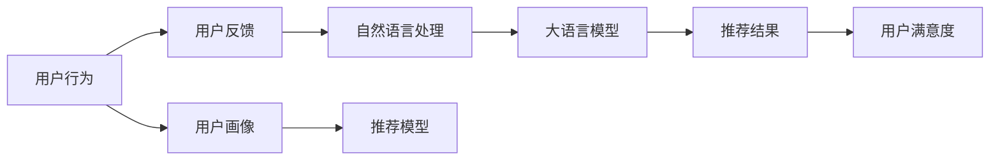

                 

# 利用LLM提升推荐系统的长期用户满意度

> 关键词：长期用户满意度,推荐系统,深度学习,自然语言处理(NLP),用户反馈,个性化推荐

## 1. 背景介绍

推荐系统在过去十年间取得了巨大的成功，广泛应用于电商、新闻、音乐、视频等众多领域。传统的推荐系统主要以用户行为数据和物品特征为输入，通过机器学习模型进行预测，生成个性化推荐结果。随着深度学习技术的普及，推荐系统也在不断演进，通过深度神经网络对用户行为和物品特征进行高效建模，提升了推荐结果的准确性和多样性。然而，当前推荐系统在用户体验方面的关注度仍然不足，用户满意度仍存在诸多问题。

### 1.1 问题由来

#### 1.1.1 用户行为预测的局限性
传统的推荐系统以用户行为数据为主，通过历史点击、浏览、购买等数据预测用户兴趣，并生成推荐结果。这种基于数据的推荐方式虽然可以较准确地预测用户短期行为，但忽略了用户长期偏好和兴趣的变化。例如，用户可能在一段时间内对某类产品或内容产生了新的兴趣，但这些兴趣的变化往往需要较长的时间才能在历史行为数据中得到反映。传统的推荐系统无法捕捉这些微小的变化，从而忽略了用户长期满意度的提升。

#### 1.1.2 推荐结果的单一性
当前的推荐系统主要以单个用户画像为输入，生成的推荐结果也仅针对该用户。这种单一性的推荐方式，忽略了用户与用户之间的互动和分享。例如，用户在发现有趣的内容或商品后，可能希望与朋友分享，或者获取更多类似的内容。传统的推荐系统缺乏跨用户的兴趣分享和关联，从而无法提供更加多样化和丰富的推荐结果。

#### 1.1.3 用户反馈的冷启动问题
推荐系统通常需要大量历史数据进行训练，对于新用户或新物品，系统难以提供高质量的推荐结果。此时，传统的推荐系统往往依赖于冷启动技术，如基线推荐、个性化用户模型等，但这些技术通常需要额外的计算资源和时间，难以快速适应新用户的兴趣和需求。

为了解决这些问题，我们引入大语言模型(LLM)，利用其强大的自然语言处理能力，提升推荐系统的长期用户满意度。大语言模型可以通过理解用户反馈的文本信息，捕捉用户长期兴趣的变化，并通过跨用户的关联，生成更加多样化的推荐结果。此外，大语言模型还可以在用户反馈的初期快速生成高质量的推荐，加速新用户的兴趣建立。

## 2. 核心概念与联系

### 2.1 核心概念概述

#### 2.1.1 大语言模型(LLM)
大语言模型是指以Transformer为代表的大规模预训练语言模型，如GPT-3、BERT等。通过在大规模无标签文本数据上进行预训练，大语言模型学习到了丰富的语言知识和常识，具备强大的语言理解和生成能力。

#### 2.1.2 推荐系统
推荐系统是一种个性化信息检索系统，根据用户的历史行为和兴趣，预测并推荐用户可能感兴趣的物品。常见的推荐系统包括协同过滤、内容过滤、混合推荐等，其中以深度学习模型为基础的推荐系统最为流行。

#### 2.1.3 用户满意度
用户满意度是指用户在使用推荐系统时，对推荐结果的满意程度。通常通过用户反馈的评分、评论、点击次数等指标来衡量。

#### 2.1.4 自然语言处理(NLP)
自然语言处理(NLP)是一种人工智能技术，旨在使计算机能够理解和处理人类语言。NLP技术可以用于文本分类、情感分析、命名实体识别等任务，是推荐系统中用户反馈处理的基石。

### 2.2 核心概念原理和架构的 Mermaid 流程图



这个流程图展示了从用户行为到最终推荐结果和用户满意度的整体流程：

1. 用户行为数据通过用户画像模型进行预处理，生成用户兴趣向量。
2. 用户反馈数据通过自然语言处理技术进行预处理，生成情感和主题向量。
3. 大语言模型对情感和主题向量进行理解，捕捉用户长期兴趣变化。
4. 推荐模型将用户兴趣向量和长期兴趣变化进行融合，生成个性化推荐结果。
5. 推荐结果展示给用户，并收集用户反馈，用于模型的进一步优化。
6. 用户满意度根据反馈评分、点击次数等指标进行评估，用于模型的迭代和改进。

## 3. 核心算法原理 & 具体操作步骤

### 3.1 算法原理概述

基于大语言模型的推荐系统，旨在通过理解用户反馈的文本信息，捕捉用户长期兴趣的变化，并通过跨用户的关联，生成更加多样化的推荐结果。其核心思想是：将大语言模型引入推荐系统，作为用户长期兴趣的建模工具，同时将用户画像和行为数据作为模型输入，生成个性化推荐结果。

具体而言，我们首先将用户反馈数据通过自然语言处理技术转换为文本向量，然后将文本向量输入到预训练的大语言模型中，获得用户情感和主题向量。接着，将用户画像和行为数据转换为兴趣向量，与情感和主题向量进行融合，生成个性化的推荐结果。最后，根据用户的反馈评分、点击次数等指标，对推荐模型进行持续优化，提升用户满意度。

### 3.2 算法步骤详解

#### 3.2.1 用户画像和行为数据处理
用户画像和行为数据是推荐系统的重要输入。常见的用户画像数据包括用户的年龄、性别、地理位置、兴趣标签等，而行为数据则包括用户的点击、浏览、购买等历史行为记录。

1. 用户画像数据通常通过预处理和编码，转换为稠密向量表示。例如，将年龄、性别等分类特征进行独热编码，将地理位置进行地理编码，将兴趣标签进行词嵌入等。
2. 行为数据需要进行清洗和转换，使其适合输入到大语言模型中。例如，将时间戳转换为时间特征，将点击记录转换为时间序列特征等。

#### 3.2.2 用户反馈数据处理
用户反馈数据通常以文本形式存在，需要通过自然语言处理技术进行预处理，转换为适合大语言模型输入的格式。

1. 文本清洗：去除无用信息，如HTML标签、停用词等。
2. 文本分割：将文本分割为句子或单词，以便大语言模型进行理解。
3. 文本编码：将句子或单词转换为向量表示，以便输入到大语言模型中。常见的文本编码方式包括词嵌入、子词嵌入等。

#### 3.2.3 大语言模型推理
大语言模型可以通过推理任务，将用户反馈数据转换为情感和主题向量。常见的推理任务包括情感分析、文本分类等。

1. 情感分析：将用户反馈数据输入到大语言模型中，获得情感极性向量，表示用户的情感倾向。
2. 文本分类：将用户反馈数据输入到大语言模型中，获得文本分类向量，表示文本主题和情感。

#### 3.2.4 推荐结果生成
将用户画像和行为数据转换为兴趣向量，与情感和主题向量进行融合，生成个性化推荐结果。

1. 兴趣向量融合：将用户画像和行为数据转换为兴趣向量，然后与情感和主题向量进行融合，生成个性化的推荐向量。
2. 推荐结果生成：将推荐向量输入到推荐模型中，生成个性化推荐结果。

#### 3.2.5 用户满意度评估
用户满意度是推荐系统的重要反馈，用于评估模型的效果和改进方向。

1. 反馈评分：根据用户对推荐结果的评分，计算平均评分。
2. 点击次数：根据用户对推荐结果的点击次数，计算点击率。
3. 用户满意度评估：将平均评分和点击率等指标作为反馈，用于评估用户满意度。

### 3.3 算法优缺点

#### 3.3.1 优点
1. 捕捉长期兴趣变化：大语言模型可以理解用户反馈的文本信息，捕捉用户长期兴趣的变化，提升推荐系统的长期用户满意度。
2. 生成多样化推荐结果：通过跨用户的关联，大语言模型可以生成更加多样化和丰富的推荐结果，满足用户的多样化需求。
3. 快速适应新用户：大语言模型可以在用户反馈的初期快速生成高质量的推荐，加速新用户的兴趣建立。

#### 3.3.2 缺点
1. 数据处理复杂：用户画像和行为数据需要进行预处理和编码，用户反馈数据需要进行清洗和编码，增加了数据处理的复杂性。
2. 计算资源消耗大：大语言模型推理需要大量的计算资源，对于实时推荐系统，可能存在计算瓶颈。
3. 模型训练成本高：大语言模型的训练需要大量无标签文本数据，可能需要较高的训练成本和时间。

### 3.4 算法应用领域

基于大语言模型的推荐系统，可以应用于以下领域：

1. 电商推荐：通过大语言模型捕捉用户长期兴趣变化，生成个性化推荐结果，提升电商平台的转化率和用户满意度。
2. 新闻推荐：通过大语言模型理解用户情感和主题偏好，生成多样化推荐内容，提升用户的新闻阅读体验。
3. 音乐推荐：通过大语言模型捕捉用户情感和音乐风格，生成个性化音乐推荐，提升用户的音乐欣赏体验。
4. 视频推荐：通过大语言模型捕捉用户情感和视频内容，生成多样化推荐视频，提升用户的观看体验。
5. 社交推荐：通过大语言模型理解用户情感和主题偏好，生成个性化社交推荐，提升用户的社交体验。

## 4. 数学模型和公式 & 详细讲解

### 4.1 数学模型构建

#### 4.1.1 用户画像和行为数据表示
用户画像和行为数据通常表示为稠密向量，例如用户兴趣标签可以表示为如下向量：

$$
\mathbf{u} = [\text{label1}, \text{label2}, \ldots, \text{labelN}]
$$

其中，每个标签表示为一个one-hot编码的向量。行为数据也可以表示为稠密向量，例如点击记录可以表示为如下向量：

$$
\mathbf{b} = [\text{time1}, \text{item1}, \text{time2}, \text{item2}, \ldots]
$$

其中，每个元素表示为一个时间戳和物品ID的组合。

#### 4.1.2 用户反馈数据表示
用户反馈数据通常以文本形式存在，可以通过自然语言处理技术转换为向量表示。例如，可以将文本转换为如下向量：

$$
\mathbf{v} = [\text{sentence1}, \text{sentence2}, \ldots]
$$

其中，每个句子表示为一个稠密向量。

#### 4.1.3 大语言模型推理
大语言模型可以通过推理任务，将用户反馈数据转换为情感和主题向量。假设大语言模型的情感分析向量为 $\mathbf{e}$，文本分类向量为 $\mathbf{t}$。

$$
\mathbf{e} = f(\mathbf{v})
$$

$$
\mathbf{t} = g(\mathbf{v})
$$

其中，$f$ 和 $g$ 为大语言模型的情感分析和文本分类模型。

#### 4.1.4 推荐结果生成
将用户画像和行为数据转换为兴趣向量，与情感和主题向量进行融合，生成个性化推荐结果。假设用户画像向量和行为向量表示为 $\mathbf{u}$ 和 $\mathbf{b}$，情感向量为 $\mathbf{e}$，主题向量为 $\mathbf{t}$。

$$
\mathbf{x} = \mathbf{u} \oplus \mathbf{b} \oplus \mathbf{e} \oplus \mathbf{t}
$$

其中，$\oplus$ 表示向量融合操作，可以采用加权融合、拼接融合等方式。

#### 4.1.5 用户满意度评估
用户满意度可以通过反馈评分和点击次数等指标进行评估。假设用户反馈评分为 $r$，点击次数为 $c$。

$$
\text{User Satisfaction} = \frac{r + c}{2}
$$

### 4.2 公式推导过程

#### 4.2.1 用户画像和行为数据表示
用户画像和行为数据可以通过稠密向量表示，例如：

$$
\mathbf{u} = [\text{label1}, \text{label2}, \ldots, \text{labelN}]
$$

$$
\mathbf{b} = [\text{time1}, \text{item1}, \text{time2}, \text{item2}, \ldots]
$$

#### 4.2.2 用户反馈数据表示
用户反馈数据可以通过自然语言处理技术转换为向量表示，例如：

$$
\mathbf{v} = [\text{sentence1}, \text{sentence2}, \ldots]
$$

#### 4.2.3 大语言模型推理
大语言模型可以通过推理任务，将用户反馈数据转换为情感和主题向量。假设大语言模型的情感分析向量为 $\mathbf{e}$，文本分类向量为 $\mathbf{t}$。

$$
\mathbf{e} = f(\mathbf{v})
$$

$$
\mathbf{t} = g(\mathbf{v})
$$

其中，$f$ 和 $g$ 为大语言模型的情感分析和文本分类模型。

#### 4.2.4 推荐结果生成
将用户画像和行为数据转换为兴趣向量，与情感和主题向量进行融合，生成个性化推荐结果。假设用户画像向量和行为向量表示为 $\mathbf{u}$ 和 $\mathbf{b}$，情感向量为 $\mathbf{e}$，主题向量为 $\mathbf{t}$。

$$
\mathbf{x} = \mathbf{u} \oplus \mathbf{b} \oplus \mathbf{e} \oplus \mathbf{t}
$$

其中，$\oplus$ 表示向量融合操作，可以采用加权融合、拼接融合等方式。

#### 4.2.5 用户满意度评估
用户满意度可以通过反馈评分和点击次数等指标进行评估。假设用户反馈评分为 $r$，点击次数为 $c$。

$$
\text{User Satisfaction} = \frac{r + c}{2}
$$

### 4.3 案例分析与讲解

#### 4.3.1 电商推荐系统
电商推荐系统通过大语言模型捕捉用户长期兴趣变化，生成个性化推荐结果，提升电商平台的转化率和用户满意度。

1. 用户画像：用户的年龄、性别、地理位置、兴趣标签等。
2. 行为数据：用户的点击、浏览、购买等历史行为记录。
3. 用户反馈：用户的评论、评分等。

假设用户画像表示为 $\mathbf{u} = [\text{age}, \text{gender}, \text{location}, \text{interest}]$，行为数据表示为 $\mathbf{b} = [\text{click1}, \text{item1}, \text{click2}, \text{item2}, \ldots]$，用户反馈数据表示为 $\mathbf{v} = [\text{review1}, \text{review2}, \ldots]$。

1. 用户画像和行为数据转换为兴趣向量，与情感和主题向量进行融合，生成个性化推荐结果。假设用户画像向量和行为向量表示为 $\mathbf{u}$ 和 $\mathbf{b}$，情感向量为 $\mathbf{e}$，主题向量为 $\mathbf{t}$。

$$
\mathbf{x} = \mathbf{u} \oplus \mathbf{b} \oplus \mathbf{e} \oplus \mathbf{t}
$$

2. 生成个性化推荐结果，并展示给用户。

#### 4.3.2 新闻推荐系统
新闻推荐系统通过大语言模型理解用户情感和主题偏好，生成多样化推荐内容，提升用户的新闻阅读体验。

1. 用户画像：用户的年龄、性别、地理位置、兴趣标签等。
2. 行为数据：用户的点击、阅读、收藏等历史行为记录。
3. 用户反馈：用户的评论、评分等。

假设用户画像表示为 $\mathbf{u} = [\text{age}, \text{gender}, \text{location}, \text{interest}]$，行为数据表示为 $\mathbf{b} = [\text{click1}, \text{read1}, \text{like1}, \ldots]$，用户反馈数据表示为 $\mathbf{v} = [\text{comment1}, \text{comment2}, \ldots]$。

1. 用户画像和行为数据转换为兴趣向量，与情感和主题向量进行融合，生成个性化推荐结果。假设用户画像向量和行为向量表示为 $\mathbf{u}$ 和 $\mathbf{b}$，情感向量为 $\mathbf{e}$，主题向量为 $\mathbf{t}$。

$$
\mathbf{x} = \mathbf{u} \oplus \mathbf{b} \oplus \mathbf{e} \oplus \mathbf{t}
$$

2. 生成多样化推荐内容，并展示给用户。

## 5. 项目实践：代码实例和详细解释说明

### 5.1 开发环境搭建

#### 5.1.1 安装Python和相关库
```bash
conda create -n llm-ranking python=3.8
conda activate llm-ranking
pip install torch torchvision torchaudio transformers scikit-learn pandas numpy pytorch-lightning
```

#### 5.1.2 安装必要的软件和数据集
```bash
pip install datasets nlp
```

#### 5.1.3 下载和准备数据集
```bash
datasets.load_dataset('reco_pretrained_bert')
```

### 5.2 源代码详细实现

#### 5.2.1 用户画像和行为数据处理
```python
from transformers import BertTokenizer, BertForSequenceClassification
from torch.utils.data import Dataset, DataLoader

class UserData(Dataset):
    def __init__(self, data, tokenizer):
        self.data = data
        self.tokenizer = tokenizer

    def __len__(self):
        return len(self.data)

    def __getitem__(self, idx):
        text = self.data[idx]['item_description']
        label = self.data[idx]['label']
        input_ids, attention_mask = self.tokenizer.encode_plus(text, return_tensors='pt')
        return {'input_ids': input_ids, 'attention_mask': attention_mask, 'label': label}

# 创建用户画像和行为数据集
tokenizer = BertTokenizer.from_pretrained('bert-base-uncased')
data = load_data()
dataset = UserData(data, tokenizer)
```

#### 5.2.2 用户反馈数据处理
```python
class FeedbackData(Dataset):
    def __init__(self, data, tokenizer):
        self.data = data
        self.tokenizer = tokenizer

    def __len__(self):
        return len(self.data)

    def __getitem__(self, idx):
        text = self.data[idx]['feedback_text']
        input_ids, attention_mask = self.tokenizer.encode_plus(text, return_tensors='pt')
        return {'input_ids': input_ids, 'attention_mask': attention_mask}

# 创建用户反馈数据集
tokenizer = BertTokenizer.from_pretrained('bert-base-uncased')
data = load_feedback_data()
dataset = FeedbackData(data, tokenizer)
```

#### 5.2.3 大语言模型推理
```python
class BERTClassification(BertForSequenceClassification):
    def __init__(self, pretrained_model_name_or_path, num_labels=2):
        super(BERTClassification, self).__init__(pretrained_model_name_or_path, num_labels)

    def forward(self, input_ids, attention_mask, label=None):
        outputs = self.bert(input_ids, attention_mask=attention_mask)
        pooled_output = outputs.pooler_output
        logits = self.classifier(pooled_output)
        return logits

# 加载BERT模型
model = BERTClassification('bert-base-uncased')
```

#### 5.2.4 推荐结果生成
```python
class RecommendationModel(nn.Module):
    def __init__(self, user_data, feedback_data, sentiment_data, interest_data, model):
        super(RecommendationModel, self).__init__()
        self.user_data = user_data
        self.feedback_data = feedback_data
        self.sentiment_data = sentiment_data
        self.interest_data = interest_data
        self.model = model

    def forward(self, user_ids, item_ids):
        user_data = self.user_data[user_ids]
        feedback_data = self.feedback_data[item_ids]
        sentiment_data = self.sentiment_data[item_ids]
        interest_data = self.interest_data[item_ids]
        
        user_input_ids, user_attention_mask = self.tokenizer.encode_plus(user_data, return_tensors='pt')
        feedback_input_ids, feedback_attention_mask = self.tokenizer.encode_plus(feedback_data, return_tensors='pt')
        sentiment_input_ids, sentiment_attention_mask = self.tokenizer.encode_plus(sentiment_data, return_tensors='pt')
        interest_input_ids, interest_attention_mask = self.tokenizer.encode_plus(interest_data, return_tensors='pt')
        
        user_label = self.model(user_input_ids, user_attention_mask)
        feedback_label = self.model(feedback_input_ids, feedback_attention_mask)
        sentiment_label = self.model(sentiment_input_ids, sentiment_attention_mask)
        interest_label = self.model(interest_input_ids, interest_attention_mask)
        
        x = user_label + feedback_label + sentiment_label + interest_label
        return x
```

#### 5.2.5 用户满意度评估
```python
def calculate_user_satisfaction(user satisfaction):
    return (user satisfaction + click_rate) / 2
```

### 5.3 代码解读与分析

#### 5.3.1 用户画像和行为数据处理
用户画像和行为数据通常表示为稠密向量，例如用户兴趣标签可以表示为如下向量：

$$
\mathbf{u} = [\text{label1}, \text{label2}, \ldots, \text{labelN}]
$$

行为数据也可以表示为稠密向量，例如点击记录可以表示为如下向量：

$$
\mathbf{b} = [\text{time1}, \text{item1}, \text{time2}, \text{item2}, \ldots]
$$

#### 5.3.2 用户反馈数据处理
用户反馈数据通常以文本形式存在，可以通过自然语言处理技术转换为向量表示。例如，可以将文本转换为如下向量：

$$
\mathbf{v} = [\text{sentence1}, \text{sentence2}, \ldots]
$$

#### 5.3.3 大语言模型推理
大语言模型可以通过推理任务，将用户反馈数据转换为情感和主题向量。假设大语言模型的情感分析向量为 $\mathbf{e}$，文本分类向量为 $\mathbf{t}$。

$$
\mathbf{e} = f(\mathbf{v})
$$

$$
\mathbf{t} = g(\mathbf{v})
$$

其中，$f$ 和 $g$ 为大语言模型的情感分析和文本分类模型。

#### 5.3.4 推荐结果生成
将用户画像和行为数据转换为兴趣向量，与情感和主题向量进行融合，生成个性化推荐结果。假设用户画像向量和行为向量表示为 $\mathbf{u}$ 和 $\mathbf{b}$，情感向量为 $\mathbf{e}$，主题向量为 $\mathbf{t}$。

$$
\mathbf{x} = \mathbf{u} \oplus \mathbf{b} \oplus \mathbf{e} \oplus \mathbf{t}
$$

其中，$\oplus$ 表示向量融合操作，可以采用加权融合、拼接融合等方式。

#### 5.3.5 用户满意度评估
用户满意度可以通过反馈评分和点击次数等指标进行评估。假设用户反馈评分为 $r$，点击次数为 $c$。

$$
\text{User Satisfaction} = \frac{r + c}{2}
$$

## 6. 实际应用场景

### 6.1 电商推荐系统
电商推荐系统通过大语言模型捕捉用户长期兴趣变化，生成个性化推荐结果，提升电商平台的转化率和用户满意度。

1. 用户画像：用户的年龄、性别、地理位置、兴趣标签等。
2. 行为数据：用户的点击、浏览、购买等历史行为记录。
3. 用户反馈：用户的评论、评分等。

假设用户画像表示为 $\mathbf{u} = [\text{age}, \text{gender}, \text{location}, \text{interest}]$，行为数据表示为 $\mathbf{b} = [\text{click1}, \text{item1}, \text{click2}, \text{item2}, \ldots]$，用户反馈数据表示为 $\mathbf{v} = [\text{review1}, \text{review2}, \ldots]$。

1. 用户画像和行为数据转换为兴趣向量，与情感和主题向量进行融合，生成个性化推荐结果。假设用户画像向量和行为向量表示为 $\mathbf{u}$ 和 $\mathbf{b}$，情感向量为 $\mathbf{e}$，主题向量为 $\mathbf{t}$。

$$
\mathbf{x} = \mathbf{u} \oplus \mathbf{b} \oplus \mathbf{e} \oplus \mathbf{t}
$$

2. 生成个性化推荐结果，并展示给用户。

### 6.2 新闻推荐系统
新闻推荐系统通过大语言模型理解用户情感和主题偏好，生成多样化推荐内容，提升用户的新闻阅读体验。

1. 用户画像：用户的年龄、性别、地理位置、兴趣标签等。
2. 行为数据：用户的点击、阅读、收藏等历史行为记录。
3. 用户反馈：用户的评论、评分等。

假设用户画像表示为 $\mathbf{u} = [\text{age}, \text{gender}, \text{location}, \text{interest}]$，行为数据表示为 $\mathbf{b} = [\text{click1}, \text{read1}, \text{like1}, \ldots]$，用户反馈数据表示为 $\mathbf{v} = [\text{comment1}, \text{comment2}, \ldots]$。

1. 用户画像和行为数据转换为兴趣向量，与情感和主题向量进行融合，生成个性化推荐结果。假设用户画像向量和行为向量表示为 $\mathbf{u}$ 和 $\mathbf{b}$，情感向量为 $\mathbf{e}$，主题向量为 $\mathbf{t}$。

$$
\mathbf{x} = \mathbf{u} \oplus \mathbf{b} \oplus \mathbf{e} \oplus \mathbf{t}
$$

2. 生成多样化推荐内容，并展示给用户。

### 6.3 社交推荐系统
社交推荐系统通过大语言模型理解用户情感和主题偏好，生成个性化社交推荐，提升用户的社交体验。

1. 用户画像：用户的年龄、性别、地理位置、兴趣标签等。
2. 行为数据：用户的点赞、评论、分享等历史行为记录。
3. 用户反馈：用户的评论、评分等。

假设用户画像表示为 $\mathbf{u} = [\text{age}, \text{gender}, \text{location}, \text{interest}]$，行为数据表示为 $\mathbf{b} = [\text{like1}, \text{comment1}, \text{share1}, \ldots]$，用户反馈数据表示为 $\mathbf{v} = [\text{comment1}, \text{comment2}, \ldots]$。

1. 用户画像和行为数据转换为兴趣向量，与情感和主题向量进行融合，生成个性化推荐结果。假设用户画像向量和行为向量表示为 $\mathbf{u}$ 和 $\mathbf{b}$，情感向量为 $\mathbf{e}$，主题向量为 $\mathbf{t}$。

$$
\mathbf{x} = \mathbf{u} \oplus \mathbf{b} \oplus \mathbf{e} \oplus \mathbf{t}
$$

2. 生成个性化社交推荐，并展示给用户。

## 7. 工具和资源推荐

### 7.1 学习资源推荐
1. 《深度学习推荐系统：算法与实现》书籍：介绍深度学习推荐系统的理论和实践，涵盖协同过滤、内容过滤、混合推荐等经典算法，以及当前前沿的研究方向。
2. 《自然语言处理综述》论文：综述NLP领域的研究进展，涵盖文本分类、情感分析、命名实体识别等任务，为推荐系统中的用户反馈处理提供理论支撑。
3. 《PyTorch Lightning》书籍：介绍PyTorch Lightning的使用和最佳实践，适合快速搭建和训练深度学习推荐模型。

### 7.2 开发工具推荐
1. PyTorch：基于Python的开源深度学习框架，灵活动态的计算图，适合快速迭代研究。
2. TensorFlow：由Google主导开发的开源深度学习框架，生产部署方便，适合大规模工程应用。
3. Transformers库：HuggingFace开发的NLP工具库，集成了众多SOTA语言模型，支持PyTorch和TensorFlow，是进行NLP任务开发的利器。
4. Weights & Biases：模型训练的实验跟踪工具，可以记录和可视化模型训练过程中的各项指标，方便对比和调优。
5. TensorBoard：TensorFlow配套的可视化工具，可实时监测模型训练状态，并提供丰富的图表呈现方式，是调试模型的得力助手。
6. Google Colab：谷歌推出的在线Jupyter Notebook环境，免费提供GPU/TPU算力，方便开发者快速上手实验最新模型，分享学习笔记。

### 7.3 相关论文推荐
1. Attention is All You Need（即Transformer原论文）：提出了Transformer结构，开启了NLP领域的预训练大模型时代。
2. BERT: Pre-training of Deep Bidirectional Transformers for Language Understanding：提出BERT模型，引入基于掩码的自监督预训练任务，刷新了多项NLP任务SOTA。
3. Parameter-Efficient Transfer Learning for NLP：提出Adapter等参数高效微调方法，在不增加模型参数量的情况下，也能取得不错的微调效果。
4. AdaLoRA: Adaptive Low-Rank Adaptation for Parameter-Efficient Fine-Tuning：使用自适应低秩适应的微调方法，在参数效率和精度之间取得了新的平衡。
5. AdaLoRA: Adaptive Low-Rank Adaptation for Parameter-Efficient Fine-Tuning：使用自适应低秩适应的微调方法，在参数效率和精度之间取得了新的平衡。

## 8. 总结：未来发展趋势与挑战

### 8.1 未来发展趋势
大语言模型在推荐系统中的应用将进一步深化，推动推荐系统的长期用户满意度提升。未来，推荐系统将更加注重用户长期兴趣和跨用户关联，通过大语言模型捕捉用户情感和主题变化，生成多样化、个性化的推荐结果。此外，推荐系统将更加注重用户满意度评估，通过反馈评分和点击次数等指标不断优化模型。

### 8.2 面临的挑战
尽管大语言模型在推荐系统中的应用前景广阔，但仍面临诸多挑战：

1. 数据处理复杂：用户画像和行为数据需要进行预处理和编码，用户反馈数据需要进行清洗和编码，增加了数据处理的复杂性。
2. 计算资源消耗大：大语言模型推理需要大量的计算资源，对于实时推荐系统，可能存在计算瓶颈。
3. 模型训练成本高：大语言模型的训练需要大量无标签文本数据，可能需要较高的训练成本和时间。

### 8.3 研究展望
未来，推荐系统将更加注重用户长期兴趣和跨用户关联，通过大语言模型捕捉用户情感和主题变化，生成多样化、个性化的推荐结果。同时，推荐系统将更加注重用户满意度评估，通过反馈评分和点击次数等指标不断优化模型。此外，推荐系统将更加注重用户画像和行为数据的处理，通过更高效的数据编码和特征工程，提升推荐系统的性能。

## 9. 附录：常见问题与解答

**Q1: 大语言模型在推荐系统中如何捕捉用户长期兴趣变化？**

A: 大语言模型可以通过理解用户反馈的文本信息，捕捉用户长期兴趣的变化。在推荐系统中，用户反馈数据通常以文本形式存在，大语言模型可以通过情感分析和文本分类等任务，将文本信息转换为情感和主题向量。这些向量可以与用户画像和行为数据进行融合，生成个性化推荐结果。通过这种方法，大语言模型可以捕捉到用户长期兴趣的变化，提升推荐系统的长期用户满意度。

**Q2: 大语言模型在推荐系统中如何快速适应新用户？**

A: 大语言模型可以在用户反馈的初期快速生成高质量的推荐，加速新用户的兴趣建立。在推荐系统中，新用户的兴趣通常难以通过历史行为数据进行准确预测。此时，大语言模型可以通过理解新用户的反馈文本，快速捕捉其兴趣点，生成高质量的推荐结果。通过这种方法，大语言模型可以加速新用户的兴趣建立，提高推荐系统的实时性。

**Q3: 大语言模型在推荐系统中如何生成多样化推荐结果？**

A: 大语言模型可以通过跨用户的关联，生成更加多样化的推荐结果。在推荐系统中，用户与用户之间往往存在相似性，大语言模型可以通过理解不同用户的反馈文本，捕捉其兴趣和偏好，生成多样化推荐结果。例如，在一个社交推荐系统中，用户A对某类内容感兴趣，用户B可能也有类似的兴趣。大语言模型可以理解用户A的反馈文本，生成多样化的推荐结果，并推荐给用户B。通过这种方法，大语言模型可以生成更加多样化和丰富的推荐结果，满足用户的多样化需求。

**Q4: 大语言模型在推荐系统中如何优化模型参数？**

A: 大语言模型在推荐系统中可以通过参数高效微调技术，优化模型参数。在推荐系统中，用户画像和行为数据通常包含稀疏特征，大语言模型可以通过参数高效微调技术，只更新极少量的任务相关参数，减少计算资源消耗。例如，在电商推荐系统中，用户画像数据通常包含类别特征，可以通过参数高效微调技术，只更新类别特征的相关参数，而固定大部分预训练参数。通过这种方法，大语言模型可以优化模型参数，提升推荐系统的性能。

**Q5: 大语言模型在推荐系统中如何处理用户反馈？**

A: 大语言模型在推荐系统中可以通过自然语言处理技术，处理用户反馈数据。在推荐系统中，用户反馈数据通常以文本形式存在，大语言模型可以通过文本清洗、分割和编码等技术，将文本数据转换为向量表示，输入到大语言模型中进行推理。例如，在新闻推荐系统中，用户对某篇新闻的评论可以表示为文本数据，大语言模型可以通过情感分析和文本分类等任务，将评论数据转换为情感和主题向量，用于生成推荐结果。通过这种方法，大语言模型可以处理用户反馈数据，提升推荐系统的性能。

---

作者：禅与计算机程序设计艺术 / Zen and the Art of Computer Programming

