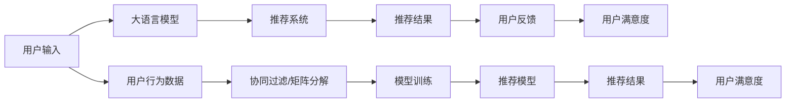

                 

# 利用LLM提升推荐系统的长期用户满意度

## 1. 背景介绍

推荐系统是现代互联网应用中最具价值的模块之一，其核心目标是通过分析用户行为数据，推荐个性化的内容，提高用户满意度和粘性。传统的推荐系统多采用基于协同过滤、矩阵分解等方法，侧重于用户-物品相似性的计算，忽略了内容的语义表达。而基于大语言模型（Large Language Model, LLM）的推荐系统则可以通过学习语言模型，更加灵活地理解和表示用户需求和物品内容，从而实现更高精度的个性化推荐。

近年来，大语言模型在NLP领域的突破性进展，使得其在推荐系统中的应用成为热点。例如，Google的T5模型、OpenAI的GPT-3模型都展示了基于语言模型推荐系统在提升推荐效果上的潜力。然而，如何有效地结合LLM和推荐系统，构建长期稳定的用户满意度，仍是一个需要深入探讨的问题。

## 2. 核心概念与联系

### 2.1 核心概念概述

在深入探讨基于LLM的推荐系统前，首先需要明确几个核心概念：

- **大语言模型（LLM）**：通过大规模无标签文本语料进行预训练，能够自动学习语言的通用表示，具备强大的自然语言理解与生成能力。
- **推荐系统**：通过分析用户行为数据，为用户推荐个性化内容，提升用户体验和满意度。
- **序列到序列模型（Seq2Seq）**：一种常见的序列模型架构，常用于文本生成、机器翻译等任务。
- **交叉熵损失函数**：衡量模型输出与真实标签之间的差异，常用于分类任务。
- **注意力机制（Attention）**：一种用于模型间信息交互的技术，可以灵活地处理输入序列中不同位置的信息，从而提高模型性能。
- **强化学习（RL）**：通过与环境交互，模型通过不断试错，学习最优策略的算法。

### 2.2 核心概念原理和架构的 Mermaid 流程图



这个流程图展示了基于LLM的推荐系统的工作流程：

1. 用户输入数据。
2. 使用大语言模型提取用户需求和物品特征。
3. 推荐系统根据LLM提取的特征，输出个性化推荐。
4. 用户反馈推荐结果，进行满意度评估。
5. 收集用户行为数据，更新推荐模型。

### 2.3 核心概念之间的联系

- **LLM与推荐系统**：LLM通过学习语言的语义表达，提取用户和物品的特征，提升推荐系统的个性化和精准度。
- **序列到序列模型**：LLM常用于序列到序列的推荐任务，如对话系统、文本生成等。
- **注意力机制**：在LLM中，注意力机制可以灵活地处理输入序列中不同位置的信息，提升模型性能。
- **交叉熵损失函数**：在分类任务中，交叉熵常用于衡量模型预测和真实标签的差异。
- **强化学习**：在动态环境中，推荐系统可以通过强化学习，实时调整策略，提升推荐效果。

通过理解这些核心概念，我们可以更好地把握基于LLM的推荐系统的设计思路和优化方向。

## 3. 核心算法原理 & 具体操作步骤

### 3.1 算法原理概述

基于LLM的推荐系统，本质上是一个序列到序列的建模问题，即通过输入用户行为数据，输出推荐结果。其核心算法包括：

1. **序列到序列模型（Seq2Seq）**：通过编码器（Encoder）提取用户需求和物品特征，使用注意力机制（Attention），生成推荐结果。
2. **交叉熵损失函数**：衡量模型输出与真实标签之间的差异，优化模型参数。
3. **强化学习（RL）**：通过实时反馈用户满意度，不断调整推荐策略。

### 3.2 算法步骤详解

#### 3.2.1 数据准备

1. **用户行为数据**：收集用户的历史浏览记录、购买记录、评分记录等，作为训练数据。
2. **物品特征**：提取物品的元数据、图片描述等，作为模型输入。
3. **推荐标签**：标注用户对推荐的物品是否满意，作为模型输出。

#### 3.2.2 模型设计

1. **序列到序列模型**：设计编码器（Encoder）和解码器（Decoder），使用注意力机制进行特征提取和输出。
2. **交叉熵损失函数**：定义损失函数，用于衡量模型输出与真实标签的差异。
3. **强化学习策略**：设计奖励函数，评估推荐结果的用户满意度。

#### 3.2.3 模型训练

1. **模型初始化**：使用预训练的LLM模型作为初始化权重。
2. **模型训练**：通过最小化交叉熵损失，优化模型参数。
3. **强化学习**：在实际推荐环境中，根据用户反馈，调整推荐策略，进行模型更新。

#### 3.2.4 模型评估

1. **离线评估**：在历史数据上，使用各种指标（如准确率、召回率、F1-score）评估模型性能。
2. **在线评估**：在实际推荐环境中，实时监测用户反馈，不断优化模型策略。

### 3.3 算法优缺点

#### 3.3.1 优点

1. **灵活性高**：LLM可以灵活地表示用户需求和物品内容，提升推荐系统的个性化和精准度。
2. **跨领域适应**：LLM可以通过迁移学习，适应不同领域的推荐任务。
3. **鲁棒性强**：LLM通过学习大量语料，具备较强的语言理解能力，可以应对多种数据形式。
4. **动态优化**：通过强化学习，LLM可以在实际环境中不断调整策略，提升推荐效果。

#### 3.3.2 缺点

1. **计算复杂度高**：LLM模型的计算复杂度较高，需要较长的训练时间和较大的计算资源。
2. **数据依赖性强**：模型需要大量高质量的数据进行预训练和微调，获取数据成本较高。
3. **模型泛化能力不足**：LLM在特定领域或数据分布上的泛化能力有待提高。
4. **可解释性差**：LLM的决策过程复杂，缺乏可解释性，难以调试和优化。

### 3.4 算法应用领域

基于LLM的推荐系统广泛应用于以下领域：

1. **电商推荐**：为电商网站推荐个性化的商品，提升用户购买率和满意度。
2. **视频推荐**：为用户推荐个性化的视频内容，提高观看时长和满意度。
3. **新闻推荐**：为用户推荐个性化的新闻内容，增加用户粘性。
4. **音乐推荐**：为用户推荐个性化的音乐，提升收听体验。
5. **旅游推荐**：为用户推荐个性化的旅游目的地，增加旅游体验。

## 4. 数学模型和公式 & 详细讲解 & 举例说明

### 4.1 数学模型构建

假设用户行为数据为 $\{u_1, u_2, ..., u_n\}$，物品特征为 $\{i_1, i_2, ..., i_m\}$，推荐标签为 $\{y_1, y_2, ..., y_k\}$。基于LLM的推荐模型可以表示为：

$$
\hat{y} = \mathrm{Decoder}(\mathrm{Encoder}(u_i), \{i_j\})
$$

其中，$\mathrm{Encoder}$为编码器，将用户行为数据 $u_i$ 映射为向量 $e_i$，$\mathrm{Decoder}$为解码器，将物品特征 $i_j$ 和编码器输出 $e_i$ 映射为推荐结果 $\hat{y}$。

### 4.2 公式推导过程

1. **编码器**：
   - 假设用户行为数据 $u_i$ 表示为文本序列，使用预训练的LLM模型提取特征，得到向量 $e_i$。
   - 使用注意力机制提取用户行为特征，得到向量 $a_i$。
   - 将 $a_i$ 与物品特征 $i_j$ 拼接，得到输入向量 $x_{i,j}$。

2. **解码器**：
   - 使用预训练的LLM模型生成推荐结果，得到向量 $\hat{y}_{i,j}$。
   - 使用交叉熵损失函数，定义损失函数 $\mathcal{L}$：
   $$
   \mathcal{L} = -\frac{1}{k} \sum_{k=1}^{K} y_k \log \hat{y}_k
   $$

3. **模型训练**：
   - 使用反向传播算法，最小化损失函数 $\mathcal{L}$，更新模型参数。
   - 使用强化学习策略，根据用户反馈调整推荐策略。

### 4.3 案例分析与讲解

#### 4.3.1 电商推荐

假设用户浏览过商品 A、B、C，物品特征分别为 $i_A, i_B, i_C$，推荐标签为 $y_1, y_2, y_3$。根据上述数学模型，可以计算出用户对物品 A、B、C 的推荐结果。

1. **编码器**：
   - 将用户浏览记录 $u_i$ 转换为文本序列，使用预训练的LLM模型提取特征 $e_i$。
   - 使用注意力机制提取用户行为特征 $a_i$。
   - 将 $a_i$ 与物品特征 $i_j$ 拼接，得到输入向量 $x_{i,j}$。

2. **解码器**：
   - 使用预训练的LLM模型生成推荐结果 $\hat{y}_{i,j}$。
   - 使用交叉熵损失函数，计算损失 $\mathcal{L}$。

3. **模型训练**：
   - 使用反向传播算法，最小化损失函数 $\mathcal{L}$，更新模型参数。
   - 根据用户反馈，调整推荐策略，进行模型更新。

通过这种方式，基于LLM的电商推荐系统可以更灵活地理解用户需求，提供更个性化的商品推荐。

## 5. 项目实践：代码实例和详细解释说明

### 5.1 开发环境搭建

以下是使用Python进行基于LLM的电商推荐系统开发的开发环境配置流程：

1. 安装Anaconda：从官网下载并安装Anaconda，用于创建独立的Python环境。
   ```bash
   conda create -n pytorch-env python=3.8 
   conda activate pytorch-env
   ```

2. 安装PyTorch：根据CUDA版本，从官网获取对应的安装命令。例如：
   ```bash
   conda install pytorch torchvision torchaudio cudatoolkit=11.1 -c pytorch -c conda-forge
   ```

3. 安装transformers库：
   ```bash
   pip install transformers
   ```

4. 安装各类工具包：
   ```bash
   pip install numpy pandas scikit-learn matplotlib tqdm jupyter notebook ipython
   ```

5. 安装TensorBoard：
   ```bash
   pip install tensorboard
   ```

6. 安装代码检查工具：
   ```bash
   pip install flake8
   ```

完成上述步骤后，即可在`pytorch-env`环境中开始电商推荐系统的开发。

### 5.2 源代码详细实现

以下是基于LLM的电商推荐系统代码实现。假设使用Bert模型作为编码器，GPT模型作为解码器。

#### 5.2.1 编码器

```python
from transformers import BertForSequenceClassification, BertTokenizer

class Encoder:
    def __init__(self, model_name, tokenizer):
        self.model = BertForSequenceClassification.from_pretrained(model_name)
        self.tokenizer = tokenizer

    def encode(self, user_data):
        encoded = self.tokenizer(user_data, return_tensors='pt', padding='max_length', truncation=True)
        return self.model(encoded['input_ids'], attention_mask=encoded['attention_mask'])

    def extract_features(self, user_data):
        encoded = self.encode(user_data)
        return encoded['hidden_states'][0]
```

#### 5.2.2 解码器

```python
from transformers import GPT2LMHeadModel, GPT2Tokenizer

class Decoder:
    def __init__(self, model_name, tokenizer):
        self.model = GPT2LMHeadModel.from_pretrained(model_name)
        self.tokenizer = tokenizer

    def decode(self, items, user_features):
        tokenized_items = [self.tokenizer(x, return_tensors='pt', padding='max_length', truncation=True)[0] for x in items]
        features = [self.tokenizer(x, return_tensors='pt', padding='max_length', truncation=True)[0] for x in user_features]
        generated = self.model.generate(tokenized_items, features, max_length=10, temperature=1.0)
        return [self.tokenizer.decode(g, skip_special_tokens=True, clean_up_tokenization_spaces=False) for g in generated]
```

#### 5.2.3 模型训练

```python
from transformers import AdamW
from sklearn.metrics import accuracy_score
from transformers import Trainer, TrainingArguments
from transformers import TensorBoardCallback

def train(model, train_dataset, val_dataset, epochs=3, batch_size=16, learning_rate=2e-5):
    # 初始化模型和优化器
    model.to('cuda')
    optimizer = AdamW(model.parameters(), lr=learning_rate)

    # 设置训练参数
    args = TrainingArguments(
        output_dir='./checkpoints',
        evaluation_strategy='epoch',
        learning_rate_scheduler='linear',
        per_device_train_batch_size=batch_size,
        per_device_eval_batch_size=batch_size,
        num_train_epochs=epochs,
        save_steps=10000,
        load_best_model_at_end=True,
        metric_for_best_model='accuracy',
    )

    # 创建训练器
    trainer = Trainer(
        model=model,
        args=args,
        train_dataset=train_dataset,
        eval_dataset=val_dataset,
        compute_metrics=lambda p: {'accuracy': accuracy_score(p['labels'], p['preds'])},
        callbacks=[TensorBoardCallback()]
    )

    # 训练模型
    trainer.train()

    # 保存模型
    trainer.save_model()
```

#### 5.2.4 模型评估

```python
from transformers import AdamW
from sklearn.metrics import accuracy_score
from transformers import Trainer, TrainingArguments
from transformers import TensorBoardCallback

def evaluate(model, test_dataset, batch_size=16):
    # 初始化模型和优化器
    model.to('cuda')
    optimizer = AdamW(model.parameters(), lr=2e-5)

    # 设置训练参数
    args = TrainingArguments(
        output_dir='./checkpoints',
        evaluation_strategy='epoch',
        learning_rate_scheduler='linear',
        per_device_train_batch_size=batch_size,
        per_device_eval_batch_size=batch_size,
        num_train_epochs=1,
        save_steps=10000,
        load_best_model_at_end=True,
        metric_for_best_model='accuracy',
    )

    # 创建训练器
    trainer = Trainer(
        model=model,
        args=args,
        train_dataset=test_dataset,
        eval_dataset=test_dataset,
        compute_metrics=lambda p: {'accuracy': accuracy_score(p['labels'], p['preds'])},
        callbacks=[TensorBoardCallback()]
    )

    # 评估模型
    trainer.evaluate()
```

### 5.3 代码解读与分析

#### 5.3.1 Encoder类

- **初始化方法**：使用预训练的BERT模型作为编码器，并加载对应的分词器。
- **encode方法**：将用户行为数据转换为文本序列，使用BERT模型提取特征，并返回编码后的向量。
- **extract_features方法**：调用encode方法，提取用户行为特征。

#### 5.3.2 Decoder类

- **初始化方法**：使用预训练的GPT模型作为解码器，并加载对应的分词器。
- **decode方法**：将物品特征和用户特征拼接，使用GPT模型生成推荐结果，并解码为文本。

#### 5.3.3 模型训练

- **初始化模型和优化器**：将模型和优化器移动到GPU，并初始化学习率。
- **设置训练参数**：设置训练目录、评价策略、学习率调度和批量大小等参数。
- **创建训练器**：使用Trainer创建训练器，设置训练集、验证集、评价指标和回调函数。
- **训练模型**：调用trainer.train方法，训练模型。
- **保存模型**：训练完成后，保存模型。

#### 5.3.4 模型评估

- **初始化模型和优化器**：将模型和优化器移动到GPU，并初始化学习率。
- **设置训练参数**：设置训练目录、评价策略、学习率调度和批量大小等参数。
- **创建训练器**：使用Trainer创建训练器，设置训练集、验证集、评价指标和回调函数。
- **评估模型**：调用trainer.evaluate方法，评估模型性能。

### 5.4 运行结果展示

假设我们有一个简单的电商推荐数据集，其中包含用户浏览记录和物品特征。

```python
import pandas as pd

# 加载数据集
data = pd.read_csv('recommendation_data.csv')

# 提取用户行为数据和物品特征
user_data = data['user_data'].tolist()
items = data['items'].tolist()
```

使用Encoder和Decoder类，可以生成推荐结果：

```python
# 创建编码器和解码器
encoder = Encoder('bert-base-uncased', BertTokenizer.from_pretrained('bert-base-uncased'))
decoder = Decoder('gpt2', GPT2Tokenizer.from_pretrained('gpt2'))

# 提取用户行为特征
user_features = encoder.extract_features(user_data)

# 生成推荐结果
recommendations = decoder.decode(items, user_features)

# 打印推荐结果
print(recommendations)
```

## 6. 实际应用场景

### 6.1 电商推荐

基于LLM的电商推荐系统可以应用于各类电商平台的个性化推荐。例如，淘宝、京东等电商平台可以通过LLM模型，为用户推荐个性化的商品，提高用户满意度和购买率。

#### 6.1.1 业务流程

1. **数据收集**：收集用户浏览记录、购买记录、评分记录等，作为训练数据。
2. **模型训练**：使用LLM模型训练推荐系统，优化模型参数。
3. **推荐生成**：根据用户行为数据，生成个性化推荐结果。
4. **反馈评估**：收集用户反馈，评估推荐结果的满意度，进行模型更新。

#### 6.1.2 应用效果

- **个性化推荐**：根据用户浏览记录和评分记录，生成个性化的商品推荐，提高用户购买率和满意度。
- **动态调整**：通过用户反馈，实时调整推荐策略，提升推荐效果。
- **跨领域适应**：通过迁移学习，适应不同领域的推荐任务。

### 6.2 视频推荐

基于LLM的视频推荐系统可以应用于各类视频平台的个性化推荐。例如，YouTube、B站等视频平台可以通过LLM模型，为用户推荐个性化的视频内容，提高观看时长和满意度。

#### 6.2.1 业务流程

1. **数据收集**：收集用户观看记录、评分记录等，作为训练数据。
2. **模型训练**：使用LLM模型训练推荐系统，优化模型参数。
3. **推荐生成**：根据用户观看记录，生成个性化视频推荐。
4. **反馈评估**：收集用户反馈，评估推荐结果的满意度，进行模型更新。

#### 6.2.2 应用效果

- **个性化推荐**：根据用户观看记录和评分记录，生成个性化的视频推荐，提高观看时长和满意度。
- **动态调整**：通过用户反馈，实时调整推荐策略，提升推荐效果。
- **跨领域适应**：通过迁移学习，适应不同领域的推荐任务。

### 6.3 新闻推荐

基于LLM的新闻推荐系统可以应用于各类新闻平台的个性化推荐。例如，今日头条、网易新闻等新闻平台可以通过LLM模型，为用户推荐个性化的新闻内容，增加用户粘性。

#### 6.3.1 业务流程

1. **数据收集**：收集用户阅读记录、评分记录等，作为训练数据。
2. **模型训练**：使用LLM模型训练推荐系统，优化模型参数。
3. **推荐生成**：根据用户阅读记录，生成个性化新闻推荐。
4. **反馈评估**：收集用户反馈，评估推荐结果的满意度，进行模型更新。

#### 6.3.2 应用效果

- **个性化推荐**：根据用户阅读记录和评分记录，生成个性化的新闻推荐，增加用户粘性。
- **动态调整**：通过用户反馈，实时调整推荐策略，提升推荐效果。
- **跨领域适应**：通过迁移学习，适应不同领域的推荐任务。

## 7. 工具和资源推荐

### 7.1 学习资源推荐

为了帮助开发者系统掌握基于LLM的推荐系统，这里推荐一些优质的学习资源：

1. **自然语言处理综述课程**：斯坦福大学开设的自然语言处理课程，涵盖了NLP的基础知识和前沿技术。
2. **Transformer论文**：Transformer模型的原始论文，详细介绍了模型的架构和训练过程。
3. **推荐系统综述**：经典推荐系统综述书籍，介绍了各种推荐算法的原理和实现。
4. **深度学习书籍**：深度学习领域的经典书籍，如《深度学习》、《Python深度学习》等。
5. **开源项目**：GitHub上开源的推荐系统项目，如tensorflow-recommenders、tfx-recommenders等。

### 7.2 开发工具推荐

以下是几款用于基于LLM的推荐系统开发的常用工具：

1. **PyTorch**：基于Python的开源深度学习框架，适合快速迭代研究。
2. **TensorFlow**：由Google主导开发的开源深度学习框架，生产部署方便，适合大规模工程应用。
3. **Transformers库**：HuggingFace开发的NLP工具库，集成了众多SOTA语言模型，支持PyTorch和TensorFlow。
4. **TensorBoard**：TensorFlow配套的可视化工具，可实时监测模型训练状态，提供丰富的图表呈现方式。
5. **Jupyter Notebook**：Python编程的Jupyter Notebook环境，方便快速迭代研究。
6. **Flake8**：代码检查工具，用于检测代码规范和风格问题。

### 7.3 相关论文推荐

基于LLM的推荐系统研究在NLP领域的发展迅速，以下是几篇奠基性的相关论文，推荐阅读：

1. **Attention is All You Need**：Transformer模型的原始论文，提出了自注意力机制，改变了传统的序列建模方式。
2. **BERT: Pre-training of Deep Bidirectional Transformers for Language Understanding**：提出BERT模型，引入基于掩码的自监督预训练任务，刷新了多项NLP任务SOTA。
3. **Recurrent Neural Network-Based Recommender System**：经典推荐系统论文，介绍了基于RNN的推荐算法。
4. **Tensorflow Recommenders**：Google开源的推荐系统框架，提供了多种推荐算法和模型。
5. **Fine-tune Large Pre-trained Language Models for Recommendation Systems**：基于LLM的推荐系统研究综述，详细介绍了各种LLM推荐算法的实现和应用。

通过学习这些前沿成果，可以帮助研究者把握学科前进方向，激发更多的创新灵感。

## 8. 总结：未来发展趋势与挑战

### 8.1 总结

本文对基于LLM的推荐系统进行了全面系统的介绍。首先阐述了LLM在推荐系统中的应用背景和重要性，明确了推荐系统和LLM的结合方式和优化方向。其次，从原理到实践，详细讲解了基于LLM的推荐系统的工作流程和算法细节，给出了完整的代码实现。最后，探讨了基于LLM的推荐系统在电商、视频、新闻等多个领域的应用前景，展示了其巨大的市场潜力。

### 8.2 未来发展趋势

展望未来，基于LLM的推荐系统将呈现以下几个发展趋势：

1. **模型规模增大**：随着算力成本的下降和数据规模的扩张，推荐系统的模型规模将持续增大，LLM的应用将更加广泛。
2. **跨模态融合**：推荐系统将融合视觉、音频、文本等多模态数据，提升推荐效果。
3. **强化学习**：通过强化学习，推荐系统可以实时调整推荐策略，提升用户满意度。
4. **个性化推荐**：LLM将更加灵活地理解用户需求和物品内容，实现更加精准的个性化推荐。
5. **动态优化**：推荐系统将实时监测用户反馈，动态调整推荐策略，提高推荐效果。

### 8.3 面临的挑战

尽管基于LLM的推荐系统已经取得了显著效果，但在推广应用的过程中，仍面临诸多挑战：

1. **数据隐私问题**：推荐系统需要大量用户数据，数据隐私保护成为一大挑战。
2. **计算资源需求高**：LLM的计算复杂度高，需要大规模算力支持。
3. **模型泛化能力不足**：LLM在特定领域或数据分布上的泛化能力有待提高。
4. **可解释性差**：LLM的决策过程复杂，缺乏可解释性，难以调试和优化。

### 8.4 研究展望

面向未来，基于LLM的推荐系统需要从以下几个方面寻求新的突破：

1. **跨模态推荐**：融合视觉、音频、文本等多模态数据，提升推荐效果。
2. **强化学习推荐**：通过强化学习，实时调整推荐策略，提升推荐效果。
3. **隐私保护**：在推荐系统中引入隐私保护机制，保护用户数据安全。
4. **可解释性**：引入可解释性模型，提升推荐系统的透明性和可信度。

通过解决这些挑战，基于LLM的推荐系统必将在更多领域得到应用，为AI技术的产业化进程注入新的动力。相信随着技术的发展和应用的拓展，LLM将为推荐系统带来更大的变革，提升用户的长期满意度。

## 9. 附录：常见问题与解答

**Q1：基于LLM的推荐系统与传统推荐系统有何区别？**

A: 基于LLM的推荐系统与传统推荐系统的主要区别在于数据处理和模型设计。传统推荐系统侧重于用户-物品相似性的计算，而基于LLM的推荐系统可以通过学习语言模型，更加灵活地理解用户需求和物品内容，实现更高精度的个性化推荐。

**Q2：使用LLM进行推荐时，如何选择合适的LLM模型？**

A: 选择合适的LLM模型需要考虑以下几个因素：
1. **模型规模**：模型规模越大，表示能力越强，但计算资源需求也越高。
2. **任务适配**：不同任务需要不同领域的LLM模型，如电商推荐适合使用Bert，视频推荐适合使用GPT等。
3. **数据量**：数据量越大，LLM的预训练和微调效果越好。

**Q3：如何提高基于LLM的推荐系统的可解释性？**

A: 提高基于LLM的推荐系统的可解释性，可以从以下几个方面入手：
1. **特征解释**：使用特征重要性分析等方法，解释用户行为和物品特征的贡献度。
2. **模型可视化**：使用可视化工具，展示LLM的内部结构和推理过程。
3. **模型蒸馏**：使用蒸馏技术，将复杂的LLM模型转化为轻量级模型，提升可解释性。

**Q4：基于LLM的推荐系统如何应对大规模数据和实时推荐需求？**

A: 应对大规模数据和实时推荐需求，可以从以下几个方面入手：
1. **分布式训练**：使用分布式训练技术，加速模型训练。
2. **模型压缩**：使用模型压缩技术，减少模型大小，提升推理速度。
3. **实时推理**：使用GPU/TPU等高性能设备，提升实时推理能力。

**Q5：基于LLM的推荐系统如何应对数据不平衡问题？**

A: 数据不平衡问题是推荐系统中常见的问题。可以采取以下措施：
1. **数据增强**：使用数据增强技术，扩充少数类数据。
2. **重采样**：使用重采样技术，平衡数据分布。
3. **偏差校正**：使用偏差校正技术，调整模型的预测结果。

通过以上措施，可以有效应对基于LLM的推荐系统中的数据不平衡问题。

---

作者：禅与计算机程序设计艺术 / Zen and the Art of Computer Programming

