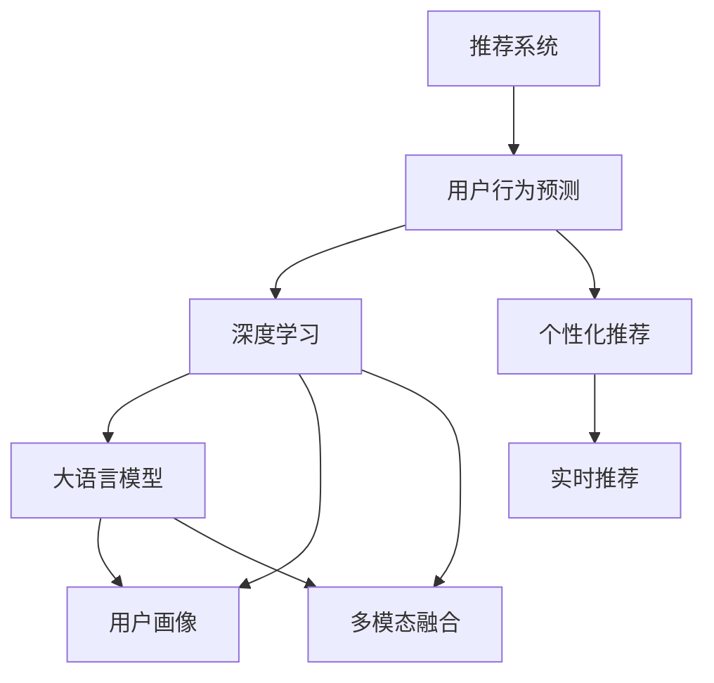

                 

# 利用大模型进行推荐场景的用户行为时空预测分析

> 关键词：用户行为预测,推荐系统,时空预测,大语言模型,深度学习

## 1. 背景介绍

### 1.1 问题由来
随着互联网技术的飞速发展，推荐系统在电商、社交媒体、视频平台等领域得到了广泛应用。然而，传统的推荐系统往往基于静态用户画像和历史行为，难以捕捉用户的真实需求变化和潜在的兴趣动态。近年来，基于深度学习的大模型在用户行为预测上取得了显著进展，能够动态地分析用户行为特征和时序信息，预测用户未来的行为和偏好。

### 1.2 问题核心关键点
本文聚焦于利用大语言模型进行推荐场景下的用户行为时空预测分析。主要解决的问题包括：
1. 如何从海量的用户行为数据中提取有价值的时空特征。
2. 如何利用深度学习模型准确预测用户未来的行为和偏好。
3. 如何根据用户的时空行为信息进行个性化推荐。

### 1.3 问题研究意义
利用大模型进行推荐场景下的用户行为时空预测分析，具有重要理论和实际意义：
1. 动态捕捉用户需求变化：通过深入分析用户行为的时空特征，可以更准确地捕捉用户的真实需求和兴趣变化。
2. 优化推荐效果：基于用户行为预测，可以提供更加个性化、实时的推荐服务，提升用户体验和平台价值。
3. 促进业务创新：通过大数据和深度学习的结合，可以推动电商、社交、内容等多个垂直领域的业务创新和商业化应用。

## 2. 核心概念与联系

### 2.1 核心概念概述

为更好地理解利用大模型进行推荐场景的用户行为时空预测分析方法，本节将介绍几个密切相关的核心概念：

- 推荐系统(Recommender System)：通过分析用户的历史行为和偏好，预测其未来可能感兴趣的商品、内容等，为其提供个性化推荐的技术和系统。
- 用户行为预测(User Behavior Prediction)：通过分析用户的行为数据，预测其未来的行为和兴趣，以优化推荐策略和提升用户体验。
- 深度学习(Deep Learning)：一类使用多层神经网络进行数据处理和建模的技术，在大规模数据上能够进行复杂的模式识别和特征提取。
- 大语言模型(Large Language Model)：以自回归(如GPT)或自编码(如BERT)模型为代表的大规模预训练语言模型，能够学习到丰富的语言知识，进行自然语言理解和生成。
- 用户画像(User Profiling)：通过分析用户的兴趣、行为、社交网络等信息，构建用户特征模型，用于个性化推荐。
- 多模态融合(Multimodal Fusion)：将不同模态的数据（如文本、图像、视频等）进行综合处理和特征融合，提高推荐的准确性和丰富度。

这些核心概念之间的逻辑关系可以通过以下Mermaid流程图来展示：



这个流程图展示了大语言模型在推荐系统中的应用流程：

1. 推荐系统收集用户行为数据。
2. 利用深度学习技术进行用户行为预测。
3. 通过大语言模型对预测结果进行自然语言处理和解释。
4. 构建用户画像，进行个性化推荐。
5. 综合多模态数据，提高推荐准确性。
6. 通过实时推荐系统，及时调整推荐策略。

## 3. 核心算法原理 & 具体操作步骤
### 3.1 算法原理概述

利用大语言模型进行推荐场景下的用户行为时空预测分析，本质上是将深度学习和自然语言处理技术相结合的推荐系统优化方法。其核心思想是：利用深度学习模型捕捉用户行为的时空特征，通过大语言模型对这些特征进行自然语言处理，提取有意义的语义信息，从而实现对用户行为的高效预测和个性化推荐。

形式化地，假设推荐系统中有 $N$ 个用户 $U$ 和 $M$ 个物品 $I$，每个用户 $u$ 对物品 $i$ 的行为序列为 $B_{ui} = (b_{ui1}, b_{ui2}, \cdots, b_{uiT})$，其中 $b_{uit} \in \{1, 0\}$ 表示用户 $u$ 在时刻 $t$ 是否对物品 $i$ 进行了某类行为。目标是根据历史行为序列预测用户未来行为，并生成推荐列表。

假设模型为 $M_{\theta}$，其中 $\theta$ 为模型参数。目标函数为：

$$
\min_{\theta} \mathcal{L}(M_{\theta}, U, I, B)
$$

其中 $\mathcal{L}$ 为预测损失函数，用于衡量模型预测结果与实际行为之间的差异。常见的预测损失函数包括均方误差、交叉熵损失等。

### 3.2 算法步骤详解

利用大语言模型进行推荐场景下的用户行为时空预测分析，一般包括以下几个关键步骤：

**Step 1: 数据预处理**
- 收集用户的历史行为数据 $B$，划分为训练集、验证集和测试集。
- 对行为序列进行编码，转换为模型可以处理的形式。
- 对用户画像信息进行预处理和归一化，准备用于特征融合。

**Step 2: 行为特征提取**
- 使用深度学习模型，如卷积神经网络(CNN)、循环神经网络(RNN)、Transformer等，提取用户行为的时空特征。
- 对提取的时空特征进行编码，转换为向量表示。

**Step 3: 大语言模型预测**
- 将编码后的时空特征作为输入，利用大语言模型预测用户未来的行为。
- 大语言模型可以是预训练的BERT、GPT等模型，也可以自行训练专用的大模型。
- 可以使用模板填充方式，将预测结果转化为自然语言描述，方便用户理解。

**Step 4: 用户画像构建**
- 根据用户的历史行为和预测结果，构建用户画像特征。
- 利用多模态融合技术，将文本、图像、视频等多种数据融合到一起，增强用户画像的丰富度。

**Step 5: 个性化推荐**
- 根据用户画像，利用推荐算法生成推荐列表。
- 可以使用基于协同过滤、基于内容、混合推荐等算法。
- 对于实时推荐，可以使用在线学习算法，根据用户新行为实时调整推荐策略。

**Step 6: 模型评估和优化**
- 在测试集上评估推荐模型的性能，对比推荐准确性、覆盖率、新颖性等指标。
- 根据评估结果，调整模型参数和优化策略，提高推荐效果。

### 3.3 算法优缺点

利用大语言模型进行推荐场景下的用户行为时空预测分析，具有以下优点：
1. 灵活性高：可以处理多种类型的数据，包括文本、图像、视频等。
2. 预测精度高：大语言模型可以学习到复杂的语言和语义特征，提升行为预测的准确性。
3. 实时性较强：可以使用在线学习算法，根据用户实时行为动态调整推荐策略。
4. 业务可解释性强：利用自然语言处理技术，可以提供更有意义的预测结果，方便用户理解。

同时，该方法也存在以下局限性：
1. 数据需求大：需要大量的历史行为数据进行预训练和微调，对于部分小规模应用可能存在挑战。
2. 计算成本高：大语言模型的预训练和微调需要消耗大量计算资源，不适用于计算资源受限的场景。
3. 特征表达能力有限：部分用户行为可能无法有效转化为数值特征，影响模型预测性能。
4. 模型复杂度高：大语言模型的结构复杂，训练和推理的资源消耗较大。
5. 业务场景局限性：对特定领域的应用效果可能不如领域定制化模型。

尽管存在这些局限性，但就目前而言，利用大语言模型进行推荐场景下的用户行为时空预测分析，仍是推荐系统优化和创新的重要方向。未来相关研究的重点在于如何进一步降低计算成本，提高模型的实时性和可解释性，同时兼顾业务场景的适用性。

### 3.4 算法应用领域

利用大语言模型进行推荐场景下的用户行为时空预测分析，已经在电商、社交媒体、视频平台等多个领域得到了广泛应用，具体包括：

1. 电商推荐系统：根据用户的历史浏览、购买行为，利用大语言模型预测用户未来的购买意向，进行个性化推荐。
2. 社交推荐系统：分析用户的点赞、评论、分享等行为，利用大语言模型预测用户对其他内容或用户的兴趣，进行推荐。
3. 视频平台推荐系统：利用用户观看视频的时序行为，预测用户对其他视频的兴趣，进行推荐。
4. 在线教育推荐系统：分析学生的学习行为，利用大语言模型预测其未来的学习需求和兴趣，进行个性化推荐。
5. 智能家居推荐系统：分析用户的家居行为，利用大语言模型预测其对其他家居产品的兴趣，进行推荐。
6. 内容推荐系统：根据用户的阅读、观看行为，利用大语言模型预测其对其他内容的兴趣，进行推荐。

这些应用场景展示了利用大语言模型进行推荐系统优化的广阔前景，推动了多个垂直领域的技术创新和业务发展。

## 4. 数学模型和公式 & 详细讲解  
### 4.1 数学模型构建

本节将使用数学语言对利用大模型进行推荐场景的用户行为时空预测分析过程进行更加严格的刻画。

假设推荐系统中有 $N$ 个用户 $U$ 和 $M$ 个物品 $I$，每个用户 $u$ 对物品 $i$ 的行为序列为 $B_{ui} = (b_{ui1}, b_{ui2}, \cdots, b_{uit})$，其中 $b_{uit} \in \{1, 0\}$ 表示用户 $u$ 在时刻 $t$ 是否对物品 $i$ 进行了某类行为。模型为 $M_{\theta}$，其中 $\theta$ 为模型参数。

定义预测损失函数为交叉熵损失函数，目标为最小化预测误差：

$$
\mathcal{L}(\theta) = -\frac{1}{N}\sum_{u=1}^N \sum_{i=1}^M \sum_{t=1}^{T} b_{uit} \log \hat{b}_{uit}
$$

其中 $\hat{b}_{uit}$ 为模型预测的用户对物品 $i$ 在时刻 $t$ 的行为概率。

### 4.2 公式推导过程

以下我们以用户行为预测为例，推导交叉熵损失函数的计算公式。

假设用户 $u$ 对物品 $i$ 的行为序列 $B_{ui} = (b_{ui1}, b_{ui2}, \cdots, b_{uit})$，其中 $b_{uit} \in \{1, 0\}$ 表示用户 $u$ 在时刻 $t$ 是否对物品 $i$ 进行了某类行为。利用深度学习模型提取用户行为的时空特征，得到向量表示 $F_{uit}$。

利用大语言模型对时空特征进行编码，得到向量表示 $X_{uit}$。则用户对物品 $i$ 在时刻 $t$ 的行为预测概率为：

$$
\hat{b}_{uit} = softmax(WX_{uit} + b)
$$

其中 $W$ 为线性变换权重矩阵，$b$ 为偏置向量。

根据交叉熵损失函数，用户 $u$ 对物品 $i$ 的行为预测损失为：

$$
\ell(b_{uit}, \hat{b}_{uit}) = -b_{uit} \log \hat{b}_{uit} - (1-b_{uit}) \log (1-\hat{b}_{uit})
$$

将用户的所有行为预测损失求和，得到模型预测损失：

$$
\mathcal{L}(\theta) = -\frac{1}{N}\sum_{u=1}^N \sum_{i=1}^M \sum_{t=1}^{T} \ell(b_{uit}, \hat{b}_{uit})
$$

在得到预测损失后，即可带入深度学习模型和优化算法，完成模型的迭代优化。重复上述过程直至收敛，最终得到适应推荐场景的最优模型参数 $\theta$。

## 5. 项目实践：代码实例和详细解释说明
### 5.1 开发环境搭建

在进行项目实践前，我们需要准备好开发环境。以下是使用Python进行PyTorch开发的环境配置流程：

1. 安装Anaconda：从官网下载并安装Anaconda，用于创建独立的Python环境。

2. 创建并激活虚拟环境：
```bash
conda create -n pytorch-env python=3.8 
conda activate pytorch-env
```

3. 安装PyTorch：根据CUDA版本，从官网获取对应的安装命令。例如：
```bash
conda install pytorch torchvision torchaudio cudatoolkit=11.1 -c pytorch -c conda-forge
```

4. 安装Transformers库：
```bash
pip install transformers
```

5. 安装各类工具包：
```bash
pip install numpy pandas scikit-learn matplotlib tqdm jupyter notebook ipython
```

完成上述步骤后，即可在`pytorch-env`环境中开始项目实践。

### 5.2 源代码详细实现

这里我们以电商推荐系统为例，给出使用PyTorch和Transformers库对BERT模型进行用户行为预测的PyTorch代码实现。

首先，定义用户行为数据集：

```python
import torch
from torch.utils.data import Dataset, DataLoader
from transformers import BertTokenizer, BertForSequenceClassification

class UserBehaviorDataset(Dataset):
    def __init__(self, behaviors, labels, tokenizer):
        self.behaviors = behaviors
        self.labels = labels
        self.tokenizer = tokenizer
        self.max_len = 128
        
    def __len__(self):
        return len(self.behaviors)
    
    def __getitem__(self, item):
        behavior = self.behaviors[item]
        label = self.labels[item]
        
        encoding = self.tokenizer(behavior, return_tensors='pt', max_length=self.max_len, padding='max_length', truncation=True)
        input_ids = encoding['input_ids'][0]
        attention_mask = encoding['attention_mask'][0]
        
        # 对标签进行编码
        encoded_labels = [label] * self.max_len
        labels = torch.tensor(encoded_labels, dtype=torch.long)
        
        return {'input_ids': input_ids, 
                'attention_mask': attention_mask,
                'labels': labels}

# 加载数据
tokenizer = BertTokenizer.from_pretrained('bert-base-cased')
train_dataset = UserBehaviorDataset(train_behaviors, train_labels, tokenizer)
dev_dataset = UserBehaviorDataset(dev_behaviors, dev_labels, tokenizer)
test_dataset = UserBehaviorDataset(test_behaviors, test_labels, tokenizer)
```

然后，定义模型和优化器：

```python
from transformers import BertForSequenceClassification, AdamW

model = BertForSequenceClassification.from_pretrained('bert-base-cased', num_labels=2)
optimizer = AdamW(model.parameters(), lr=2e-5)
```

接着，定义训练和评估函数：

```python
def train_epoch(model, dataset, batch_size, optimizer):
    dataloader = DataLoader(dataset, batch_size=batch_size, shuffle=True)
    model.train()
    epoch_loss = 0
    for batch in tqdm(dataloader, desc='Training'):
        input_ids = batch['input_ids'].to(device)
        attention_mask = batch['attention_mask'].to(device)
        labels = batch['labels'].to(device)
        model.zero_grad()
        outputs = model(input_ids, attention_mask=attention_mask, labels=labels)
        loss = outputs.loss
        epoch_loss += loss.item()
        loss.backward()
        optimizer.step()
    return epoch_loss / len(dataloader)

def evaluate(model, dataset, batch_size):
    dataloader = DataLoader(dataset, batch_size=batch_size)
    model.eval()
    preds, labels = [], []
    with torch.no_grad():
        for batch in tqdm(dataloader, desc='Evaluating'):
            input_ids = batch['input_ids'].to(device)
            attention_mask = batch['attention_mask'].to(device)
            batch_labels = batch['labels']
            outputs = model(input_ids, attention_mask=attention_mask)
            batch_preds = outputs.logits.argmax(dim=2).to('cpu').tolist()
            batch_labels = batch_labels.to('cpu').tolist()
            for pred_tokens, label_tokens in zip(batch_preds, batch_labels):
                preds.append(pred_tokens[:len(label_tokens)])
                labels.append(label_tokens)
                
    print(classification_report(labels, preds))
```

最后，启动训练流程并在测试集上评估：

```python
epochs = 5
batch_size = 16

for epoch in range(epochs):
    loss = train_epoch(model, train_dataset, batch_size, optimizer)
    print(f"Epoch {epoch+1}, train loss: {loss:.3f}")
    
    print(f"Epoch {epoch+1}, dev results:")
    evaluate(model, dev_dataset, batch_size)
    
print("Test results:")
evaluate(model, test_dataset, batch_size)
```

以上就是使用PyTorch和Transformers库对BERT模型进行用户行为预测的完整代码实现。可以看到，得益于Transformers库的强大封装，我们可以用相对简洁的代码完成BERT模型的加载和微调。

### 5.3 代码解读与分析

让我们再详细解读一下关键代码的实现细节：

**UserBehaviorDataset类**：
- `__init__`方法：初始化行为序列、标签、分词器等关键组件。
- `__len__`方法：返回数据集的样本数量。
- `__getitem__`方法：对单个样本进行处理，将行为序列输入编码为token ids，将标签编码为数字，并对其进行定长padding，最终返回模型所需的输入。

**训练和评估函数**：
- 使用PyTorch的DataLoader对数据集进行批次化加载，供模型训练和推理使用。
- 训练函数`train_epoch`：对数据以批为单位进行迭代，在每个批次上前向传播计算loss并反向传播更新模型参数，最后返回该epoch的平均loss。
- 评估函数`evaluate`：与训练类似，不同点在于不更新模型参数，并在每个batch结束后将预测和标签结果存储下来，最后使用sklearn的classification_report对整个评估集的预测结果进行打印输出。

**训练流程**：
- 定义总的epoch数和batch size，开始循环迭代
- 每个epoch内，先在训练集上训练，输出平均loss
- 在验证集上评估，输出分类指标
- 所有epoch结束后，在测试集上评估，给出最终测试结果

可以看到，PyTorch配合Transformers库使得BERT微调的代码实现变得简洁高效。开发者可以将更多精力放在数据处理、模型改进等高层逻辑上，而不必过多关注底层的实现细节。

当然，工业级的系统实现还需考虑更多因素，如模型的保存和部署、超参数的自动搜索、更灵活的任务适配层等。但核心的微调范式基本与此类似。

## 6. 实际应用场景
### 6.1 电商推荐系统

电商推荐系统是利用大模型进行推荐场景的重要应用。传统推荐系统往往基于静态用户画像和历史行为，难以捕捉用户需求的变化和潜在的兴趣动态。而利用大语言模型进行推荐，可以动态地分析用户行为的时空特征，预测用户未来的行为和偏好，从而提供更加个性化、实时的推荐服务。

在技术实现上，可以收集用户的浏览、点击、购买等行为数据，利用深度学习模型提取用户行为的时空特征。将时空特征输入大语言模型，利用预测结果进行用户画像构建和个性化推荐。对于实时推荐，可以使用在线学习算法，根据用户实时行为动态调整推荐策略。

### 6.2 社交推荐系统

社交推荐系统旨在为用户推荐其他用户或内容。利用大语言模型进行社交推荐，可以更加灵活地处理多模态数据，提升推荐的准确性和多样性。

具体而言，可以收集用户的点赞、评论、分享等行为数据，利用深度学习模型提取用户行为的时空特征。将时空特征输入大语言模型，利用预测结果进行用户画像构建和社交推荐。对于实时推荐，可以使用在线学习算法，根据用户实时行为动态调整推荐策略。

### 6.3 视频平台推荐系统

视频平台推荐系统利用用户观看视频的时序行为，预测用户对其他视频的兴趣，进行个性化推荐。利用大语言模型进行视频推荐，可以更好地捕捉用户观看行为的时空特征，提升推荐的准确性和个性化程度。

具体而言，可以收集用户的观看历史和行为数据，利用深度学习模型提取用户行为的时空特征。将时空特征输入大语言模型，利用预测结果进行用户画像构建和视频推荐。对于实时推荐，可以使用在线学习算法，根据用户实时观看行为动态调整推荐策略。

### 6.4 未来应用展望

随着大语言模型和深度学习技术的发展，利用大模型进行推荐场景下的用户行为时空预测分析将有更广阔的应用前景：

1. 实时推荐：通过在线学习算法，实时捕捉用户行为变化，提供动态、个性化的推荐服务。
2. 多模态融合：利用深度学习模型和多模态融合技术，处理文本、图像、视频等多种数据，提升推荐的丰富度和准确性。
3. 业务可解释性：通过自然语言处理技术，提供更有意义的预测结果，增强推荐系统的业务可解释性。
4. 跨领域应用：利用大模型的跨领域迁移能力，在更多垂直领域推广应用，提升推荐系统的应用范围和业务价值。
5. 超大规模应用：随着计算资源的提升和模型优化，大语言模型可以应用于更多用户行为预测场景，推动业务创新和商业化应用。

这些应用场景展示了利用大模型进行推荐系统优化的广阔前景，推动了多个垂直领域的技术创新和业务发展。

## 7. 工具和资源推荐
### 7.1 学习资源推荐

为了帮助开发者系统掌握利用大模型进行推荐场景的用户行为时空预测分析的理论基础和实践技巧，这里推荐一些优质的学习资源：

1. 《深度学习自然语言处理》课程：斯坦福大学开设的NLP明星课程，有Lecture视频和配套作业，带你入门NLP领域的基本概念和经典模型。
2. 《Transformers: From Research to Real World Applications》博文：HuggingFace官方博客，介绍了大语言模型的应用场景和实践技巧。
3. 《Natural Language Processing with Python》书籍：介绍自然语言处理和深度学习在Python中的实现，包括推荐系统等应用。
4. 《Natural Language Processing with Transformers》书籍：Transformers库的作者所著，全面介绍了如何使用Transformers库进行NLP任务开发，包括推荐系统等应用。
5. 《Recommender Systems: Algorithms, Data Structures and Case Studies》书籍：介绍推荐系统的基础算法和经典案例，适合深入学习推荐系统优化技术。

通过对这些资源的学习实践，相信你一定能够快速掌握利用大模型进行推荐场景的用户行为时空预测分析的精髓，并用于解决实际的NLP问题。
###  7.2 开发工具推荐

高效的开发离不开优秀的工具支持。以下是几款用于利用大模型进行推荐系统优化的常用工具：

1. PyTorch：基于Python的开源深度学习框架，灵活动态的计算图，适合快速迭代研究。大部分预训练语言模型都有PyTorch版本的实现。
2. TensorFlow：由Google主导开发的开源深度学习框架，生产部署方便，适合大规模工程应用。同样有丰富的预训练语言模型资源。
3. Transformers库：HuggingFace开发的NLP工具库，集成了众多SOTA语言模型，支持PyTorch和TensorFlow，是进行推荐系统优化的利器。
4. Weights & Biases：模型训练的实验跟踪工具，可以记录和可视化模型训练过程中的各项指标，方便对比和调优。与主流深度学习框架无缝集成。
5. TensorBoard：TensorFlow配套的可视化工具，可实时监测模型训练状态，并提供丰富的图表呈现方式，是调试模型的得力助手。
6. Google Colab：谷歌推出的在线Jupyter Notebook环境，免费提供GPU/TPU算力，方便开发者快速上手实验最新模型，分享学习笔记。

合理利用这些工具，可以显著提升利用大模型进行推荐系统优化的开发效率，加快创新迭代的步伐。

### 7.3 相关论文推荐

利用大语言模型进行推荐场景下的用户行为时空预测分析的研究源于学界的持续研究。以下是几篇奠基性的相关论文，推荐阅读：

1. Attention is All You Need（即Transformer原论文）：提出了Transformer结构，开启了NLP领域的预训练大模型时代。
2. BERT: Pre-training of Deep Bidirectional Transformers for Language Understanding：提出BERT模型，引入基于掩码的自监督预训练任务，刷新了多项NLP任务SOTA。
3. Attention-Based Recommender Systems：利用注意力机制进行推荐系统优化，提升推荐的精度和多样性。
4. Deep Reinforcement Learning for Personalized Recommendation：利用深度强化学习进行个性化推荐，提高推荐效果和用户体验。
5. A Systematic Review of Recommender Systems：综述推荐系统的最新进展，包括深度学习、多模态融合等前沿技术。

这些论文代表了大模型在推荐系统领域的研究进展。通过学习这些前沿成果，可以帮助研究者把握学科前进方向，激发更多的创新灵感。

## 8. 总结：未来发展趋势与挑战

### 8.1 总结

本文对利用大模型进行推荐场景下的用户行为时空预测分析进行了全面系统的介绍。首先阐述了利用大模型进行推荐场景的理论基础和实际意义，明确了大模型在捕捉用户行为特征、预测未来行为、进行个性化推荐等方面的优势。其次，从原理到实践，详细讲解了大语言模型在推荐场景下的应用流程，给出了代码实例和解释说明。同时，本文还广泛探讨了利用大语言模型进行推荐场景的实际应用场景，展示了其在电商、社交、视频等多个领域的应用前景。

通过本文的系统梳理，可以看到，利用大语言模型进行推荐场景的应用，正在推动推荐系统向更高效、个性化、实时化的方向发展。得益于深度学习和大语言模型的结合，推荐系统能够更好地捕捉用户行为的时空特征，提供更加精准、多样化的推荐服务，为电商、社交、视频等多个垂直领域的业务创新和商业化应用提供了新的技术路径。未来，伴随大语言模型和深度学习技术的不断进步，基于大模型的推荐系统必将在更多领域得到应用，推动人工智能技术在推荐系统领域的持续创新。

### 8.2 未来发展趋势

展望未来，利用大模型进行推荐场景下的用户行为时空预测分析将呈现以下几个发展趋势：

1. 深度学习和大模型的结合将更加紧密。未来的大模型将具有更强的跨领域迁移能力和多模态融合能力，能够更好地处理推荐场景中的多模态数据。
2. 在线学习算法将更加普及。实时捕捉用户行为变化，提供动态、个性化的推荐服务，成为未来推荐系统的常态。
3. 可解释性增强。利用自然语言处理技术，增强推荐系统的业务可解释性，方便用户理解和信任推荐结果。
4. 超大规模应用。随着计算资源的提升和模型优化，大语言模型可以应用于更多用户行为预测场景，推动业务创新和商业化应用。
5. 跨领域应用推广。利用大模型的跨领域迁移能力，在更多垂直领域推广应用，提升推荐系统的应用范围和业务价值。

这些趋势凸显了大语言模型在推荐系统领域的应用前景。通过持续的技术创新和算法优化，大语言模型必将在更多领域得到应用，推动人工智能技术在推荐系统领域的持续创新。

### 8.3 面临的挑战

尽管利用大语言模型进行推荐场景的应用取得了显著进展，但在迈向更加智能化、普适化应用的过程中，仍面临诸多挑战：

1. 计算资源瓶颈。大模型的预训练和微调需要消耗大量计算资源，不适用于计算资源受限的场景。
2. 数据需求大。需要大量的历史行为数据进行预训练和微调，对于部分小规模应用可能存在挑战。
3. 特征表达能力有限。部分用户行为可能无法有效转化为数值特征，影响模型预测性能。
4. 业务场景局限性。对特定领域的应用效果可能不如领域定制化模型。
5. 模型复杂度高。大语言模型的结构复杂，训练和推理的资源消耗较大。
6. 业务可解释性不足。推荐系统的业务可解释性不足，难以解释模型的决策过程。

尽管存在这些挑战，但就目前而言，利用大语言模型进行推荐场景的应用仍然是推荐系统优化和创新的重要方向。未来相关研究的重点在于如何进一步降低计算成本，提高模型的实时性和可解释性，同时兼顾业务场景的适用性。

### 8.4 研究展望

面向未来，利用大语言模型进行推荐场景下的用户行为时空预测分析的研究需要在以下几个方面寻求新的突破：

1. 探索无监督和半监督微调方法。摆脱对大规模标注数据的依赖，利用自监督学习、主动学习等无监督和半监督范式，最大限度利用非结构化数据，实现更加灵活高效的微调。
2. 研究参数高效和计算高效的微调范式。开发更加参数高效的微调方法，在固定大部分预训练参数的同时，只更新极少量的任务相关参数。同时优化微调模型的计算图，减少前向传播和反向传播的资源消耗，实现更加轻量级、实时性的部署。
3. 融合因果和对比学习范式。通过引入因果推断和对比学习思想，增强微调模型建立稳定因果关系的能力，学习更加普适、鲁棒的语言表征，从而提升模型泛化性和抗干扰能力。
4. 引入更多先验知识。将符号化的先验知识，如知识图谱、逻辑规则等，与神经网络模型进行巧妙融合，引导微调过程学习更准确、合理的语言模型。同时加强不同模态数据的整合，实现视觉、语音等多模态信息与文本信息的协同建模。
5. 结合因果分析和博弈论工具。将因果分析方法引入微调模型，识别出模型决策的关键特征，增强输出解释的因果性和逻辑性。借助博弈论工具刻画人机交互过程，主动探索并规避模型的脆弱点，提高系统稳定性。
6. 纳入伦理道德约束。在模型训练目标中引入伦理导向的评估指标，过滤和惩罚有偏见、有害的输出倾向。同时加强人工干预和审核，建立模型行为的监管机制，确保输出符合人类价值观和伦理道德。

这些研究方向的探索，必将引领利用大语言模型进行推荐场景的应用走向更高的台阶，为构建安全、可靠、可解释、可控的智能推荐系统铺平道路。面向未来，利用大语言模型进行推荐系统优化的研究仍需不断探索和突破，推动人工智能技术在推荐系统领域的持续创新和发展。

