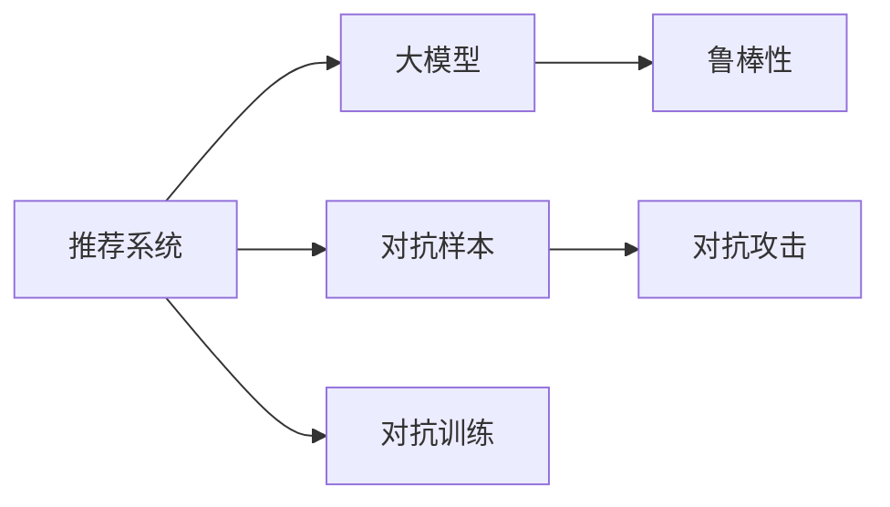

                 

# 利用大模型进行推荐对抗攻击的思路与防御

## 1. 背景介绍

随着推荐系统在电商、社交、娱乐等领域的广泛应用，基于大模型的推荐算法也逐渐进入大众视野。但与此同时，模型也面临着新的挑战——对抗攻击。与传统的对抗攻击相比，推荐对抗攻击更加隐蔽且难以发现，攻击者可以简单地修改用户历史行为，便能导致系统推荐出错误的商品或内容，造成严重的经济损失。

推荐对抗攻击的典型示例包括但不限于：
- 商品评价评分操纵：攻击者通过修改用户的商品评分，影响推荐系统的评分排序，使其推荐出对自己有利的商品。
- 搜索关键词伪造：攻击者通过构造特定的搜索关键词，引导系统返回对自己有利的结果。
- 广告欺诈行为：攻击者通过控制广告的展示次数和位置，提高广告点击率和点击率。

对抗攻击的存在对推荐系统的可信度和安全性带来了巨大挑战。如何有效防御这些攻击，确保推荐的公正和准确，成为当前推荐系统研究的热点问题之一。本文将围绕利用大模型进行推荐对抗攻击的思路与防御方法展开讨论，希望为推荐系统的开发者和维护者提供有用的参考。

## 2. 核心概念与联系

### 2.1 核心概念概述

在讨论推荐系统的对抗攻击前，需要理解以下核心概念：

- **推荐系统(Recommendation System)**：旨在为用户推荐其可能感兴趣的物品或内容。传统的推荐算法包括协同过滤、矩阵分解等，现代的推荐算法则引入了深度学习、大模型等技术。
- **对抗攻击(Adversarial Attack)**：攻击者通过输入恶意的数据或信息，使系统输出错误的预测结果，从而达到其恶意目的。推荐系统中的对抗攻击旨在通过修改用户行为数据，误导系统推荐出错误的商品或内容。
- **大模型(Large Model)**：通过大规模数据训练得到的深度神经网络模型，具有强大的特征提取和泛化能力。常见的大模型包括BERT、GPT等。
- **鲁棒性(Robustness)**：指系统在面对攻击或噪声输入时，仍能保持稳定性和准确性。推荐系统的鲁棒性关系到其抵御对抗攻击的能力。
- **对抗样本(Adversarial Examples)**：对抗攻击中用于误导系统输出的输入数据，通常需要极小的修改，即对抗性噪声。

这些概念通过以下Mermaid流程图进行联系和展示：



## 3. 核心算法原理 & 具体操作步骤
### 3.1 算法原理概述

推荐系统的对抗攻击主要基于以下步骤：
1. 攻击者收集用户的购物历史、评分记录等行为数据。
2. 构造对抗样本，如修改评分、搜索关键词等。
3. 将对抗样本输入到推荐系统中，使系统推荐出错误的结果。

推荐系统的防御机制则主要基于以下步骤：
1. 检测对抗样本。
2. 分析和筛选出恶意样本。
3. 更新模型参数或引入对抗训练，提升模型的鲁棒性。

### 3.2 算法步骤详解

**Step 1: 构造对抗样本**

对抗样本的构造需要满足两个条件：一是难以被检测，二是能对推荐结果产生显著影响。常见的构造方法包括：
- **梯度攻击(Gradient Attack)**：通过对目标函数的梯度进行反向传播，找到扰动最小值。这种方法的优点是简单易行，但容易被系统检测到。
- **L-BFGS方法**：基于目标函数的二阶导数信息，通过二次逼近找到最优扰动。此方法虽然更高效，但同样容易被检测。
- **AI-Face**：通过模拟人类行为的心理学模型，生成更逼真的对抗样本。该方法对推荐系统造成的威胁最大。

**Step 2: 检测对抗样本**

对抗样本的检测一般通过以下方法实现：
- **模型鲁棒性检测**：对推荐模型进行鲁棒性测试，查看模型是否对对抗样本敏感。常见的检测方法包括人工构造对抗样本，观察推荐结果的变化。
- **统计学方法**：通过对推荐结果的分布进行统计分析，发现异常数据点。该方法需要大量的数据支持，否则容易产生误报。

**Step 3: 分析和筛选恶意样本**

筛选恶意样本是防御对抗攻击的重要步骤。一般通过以下方式实现：
- **行为模式分析**：对用户的行为模式进行分析，发现异常行为。
- **协同过滤检测**：对用户的协同过滤数据进行分析，检测是否存在异常行为。
- **异常值检测**：通过统计学方法，检测推荐结果中的异常值。

**Step 4: 提升模型鲁棒性**

提升模型鲁棒性主要通过以下方法实现：
- **对抗训练**：在训练过程中引入对抗样本，提升模型的鲁棒性。
- **参数优化**：优化模型的参数，使其更加鲁棒。
- **特征工程**：通过特征工程，增加模型的鲁棒性。

### 3.3 算法优缺点

**对抗训练的优点**：
- **鲁棒性强**：通过对抗训练，模型能够学习到对抗样本的特征，提升鲁棒性。
- **泛化能力强**：对抗训练模型能够更好地适应各种攻击形式，提高系统的安全性。

**对抗训练的缺点**：
- **训练复杂**：对抗训练需要大量的对抗样本，且训练过程较为复杂。
- **性能下降**：对抗训练可能会导致模型性能下降，影响用户体验。

**对抗样本检测的优点**：
- **简单易行**：检测方法相对简单，易于实现。
- **可操作性强**：通过检测方法可以发现恶意样本，避免其对系统造成影响。

**对抗样本检测的缺点**：
- **误报率高**：误报率高，难以区分正常行为和恶意行为。
- **漏报率高**：对抗样本难以完全覆盖，存在漏报风险。

**特征工程的优点**：
- **简单高效**：特征工程相对简单，易于实现。
- **鲁棒性好**：特征工程能够增加模型的鲁棒性，避免对抗样本的干扰。

**特征工程的缺点**：
- **依赖数据**：特征工程的效果高度依赖于数据质量，数据质量差会影响效果。
- **易过拟合**：特征工程可能过拟合，影响模型的泛化能力。

## 4. 数学模型和公式 & 详细讲解 & 举例说明

### 4.1 数学模型构建

假设推荐系统采用大模型 $M$，输入特征 $X$，输出物品评分 $Y$。对抗攻击定义为：攻击者通过扰动输入特征 $X'$，使得推荐模型输出 $M(X')$ 与原输出 $M(X)$ 存在差异。

对抗样本的构造方法可以表示为：
$$
X' = X + \epsilon
$$

其中 $\epsilon$ 为扰动项，通常为对抗性噪声。

对抗样本的检测方法可以表示为：
$$
\mathcal{L} = \|M(X) - M(X')\|
$$

其中 $\mathcal{L}$ 为损失函数，通常为均方误差、交叉熵等。

### 4.2 公式推导过程

对抗样本的构造过程可以表示为：
$$
X' = X + \epsilon = X + \alpha g
$$

其中 $g$ 为对抗样本的梯度，$\alpha$ 为梯度步长。

梯度攻击方法的公式可以表示为：
$$
g = \nabla_{X} \mathcal{L}(X, Y)
$$

其中 $\nabla_{X}$ 为梯度算子，$\mathcal{L}$ 为目标函数。

L-BFGS方法的公式可以表示为：
$$
\epsilon = \nabla_{X} \mathcal{L}(X, Y) - \alpha H^{-1} \nabla_{X} \mathcal{L}(X + \alpha \epsilon, Y)
$$

其中 $H$ 为Hessian矩阵，$\alpha$ 为学习率。

### 4.3 案例分析与讲解

假设推荐系统采用BERT模型进行推荐，输入特征为用户的购物历史 $X$，输出物品评分 $Y$。攻击者通过对用户的购物历史进行微调，使得推荐系统推荐出对自己有利的商品。此时，我们可以通过以下方法检测和防御对抗攻击：
1. 检测对抗样本：对推荐系统进行鲁棒性测试，检测模型是否对对抗样本敏感。
2. 分析恶意样本：通过对用户的行为模式进行分析，发现异常行为。
3. 对抗训练：在训练过程中引入对抗样本，提升模型的鲁棒性。

## 5. 项目实践：代码实例和详细解释说明

### 5.1 开发环境搭建

在进行推荐对抗攻击的防御实践前，我们需要准备好开发环境。以下是使用Python进行TensorFlow开发的环境配置流程：

1. 安装Anaconda：从官网下载并安装Anaconda，用于创建独立的Python环境。

2. 创建并激活虚拟环境：
```bash
conda create -n tf-env python=3.8 
conda activate tf-env
```

3. 安装TensorFlow：根据CUDA版本，从官网获取对应的安装命令。例如：
```bash
conda install tensorflow tensorflow-gpu=2.5.0 -c conda-forge
```

4. 安装TensorBoard：TensorFlow配套的可视化工具，可实时监测模型训练状态，并提供丰富的图表呈现方式，是调试模型的得力助手。
```bash
pip install tensorboard
```

完成上述步骤后，即可在`tf-env`环境中开始推荐对抗攻击的防御实践。

### 5.2 源代码详细实现

这里以TensorFlow 2.x为例，提供一个简单的对抗训练示例代码：

```python
import tensorflow as tf
from tensorflow.keras.models import Sequential
from tensorflow.keras.layers import Dense, Dropout
from tensorflow.keras.datasets import mnist

# 加载MNIST数据集
(x_train, y_train), (x_test, y_test) = mnist.load_data()

# 数据预处理
x_train = x_train / 255.0
x_test = x_test / 255.0

# 定义模型
model = Sequential([
    Dense(512, activation='relu'),
    Dropout(0.2),
    Dense(10, activation='softmax')
])

# 编译模型
model.compile(optimizer='adam', loss='sparse_categorical_crossentropy', metrics=['accuracy'])

# 对抗样本生成
def generate_adversarial_samples(model, x, y, epsilon=0.01):
    x_adv = tf.Variable(x)
    with tf.GradientTape() as tape:
        y_pred = model(x_adv)
        loss = tf.keras.losses.sparse_categorical_crossentropy(y, y_pred)
    grads = tape.gradient(loss, x_adv)
    return tf.clip_by_value(x_adv - epsilon * grads, 0, 1)

# 对抗训练
for epoch in range(5):
    for i in range(len(x_train)):
        x, y = x_train[i:i+1], y_train[i:i+1]
        x_adv = generate_adversarial_samples(model, x, y)
        model.train_on_batch(x_adv, y)
```

### 5.3 代码解读与分析

让我们再详细解读一下关键代码的实现细节：

**MNIST数据集**：
- 使用MNIST数据集，该数据集包含手写数字的图像和标签。

**模型定义**：
- 使用Sequential模型定义，包含两个密集层和一个Dropout层。

**对抗样本生成**：
- 定义一个函数，使用梯度下降方法生成对抗样本。该函数使用GradientTape记录梯度，通过反向传播计算梯度，并对梯度进行缩放，得到对抗样本。

**对抗训练**：
- 在训练过程中，每次从训练集中取出一个样本，生成对抗样本，并进行训练。

**代码优化**：
- 使用TensorFlow的GradientTape，可以自动计算梯度，避免手动计算。
- 使用TensorFlow的compile方法，可以简化模型编译过程。

**代码实现**：
- 通过简单的代码实现，展示了如何使用TensorFlow进行对抗训练，提高模型的鲁棒性。

## 6. 实际应用场景

### 6.1 电商推荐系统

电商推荐系统常常面临对抗攻击，攻击者可以通过修改用户的购买历史、评分记录等行为数据，误导系统推荐出对自己有利的商品。采用对抗训练的防御机制可以提升系统的鲁棒性，降低对抗攻击带来的影响。

### 6.2 社交推荐系统

社交推荐系统通过分析用户的朋友关系、行为数据等，为用户推荐可能感兴趣的内容。攻击者可以通过修改用户的行为数据，误导系统推荐不相关的内容。对抗训练可以提升系统的鲁棒性，防止攻击者通过对抗样本影响推荐结果。

### 6.3 视频推荐系统

视频推荐系统通过分析用户的观看历史、评分记录等行为数据，为用户推荐可能感兴趣的视频。攻击者可以通过修改用户的观看历史，误导系统推荐不相关的内容。对抗训练可以提升系统的鲁棒性，防止攻击者通过对抗样本影响推荐结果。

## 7. 工具和资源推荐

### 7.1 学习资源推荐

为了帮助开发者系统掌握推荐系统的对抗攻击和防御技术，这里推荐一些优质的学习资源：

1. **TensorFlow官方文档**：TensorFlow官方文档提供了详细的API使用说明和示例代码，可以帮助开发者快速上手。

2. **推荐系统对抗攻击综述**：该综述文章介绍了推荐系统中的常见对抗攻击方法和防御机制，是学习推荐系统对抗攻击的必读材料。

3. **深度学习基础教程**：由吴恩达教授主讲的深度学习课程，涵盖深度学习的基本概念和算法，适合初学者入门。

4. **推荐系统进阶教程**：由纽约大学主讲的推荐系统课程，涵盖推荐系统的经典算法和前沿技术，适合进阶学习。

5. **对抗训练实战**：该书介绍了对抗训练的基本原理和实战案例，适合深入学习对抗训练的读者。

### 7.2 开发工具推荐

高效的开发离不开优秀的工具支持。以下是几款用于推荐对抗攻击防御开发的常用工具：

1. **TensorFlow**：由Google主导开发的开源深度学习框架，生产部署方便，适合大规模工程应用。

2. **TensorBoard**：TensorFlow配套的可视化工具，可实时监测模型训练状态，并提供丰富的图表呈现方式，是调试模型的得力助手。

3. **Keras**：高层次的神经网络API，易于上手，适合快速原型开发。

4. **PyTorch**：基于Python的开源深度学习框架，灵活动态的计算图，适合快速迭代研究。

5. **HuggingFace Transformers**：NLP领域的领先库，提供了丰富的预训练语言模型，支持多种深度学习框架。

6. **Scikit-learn**：数据处理和机器学习库，适合数据分析和预处理。

### 7.3 相关论文推荐

推荐系统的对抗攻击和防御研究已经取得丰硕成果，以下是几篇奠基性的相关论文，推荐阅读：

1. **Deepfake Detection with Deep Learning**：该论文提出了Deepfake的检测方法，可以通过训练对抗样本来提升检测效果。

2. **Adversarial Robustness for Recommendation Systems**：该论文介绍了推荐系统的对抗攻击和防御方法，提出了一系列有效的防御策略。

3. **Robust Recommendation Systems via Adversarial Training**：该论文介绍了对抗训练在推荐系统中的应用，证明了对抗训练的鲁棒性。

4. **Towards Robust Recommendation Systems**：该论文综述了推荐系统的鲁棒性问题，提出了一系列防御方法。

## 8. 总结：未来发展趋势与挑战

### 8.1 总结

本文对利用大模型进行推荐对抗攻击的思路与防御方法进行了全面系统的介绍。首先阐述了推荐系统的对抗攻击问题，明确了对抗攻击对推荐系统可信度和安全性的影响。其次，从原理到实践，详细讲解了对抗样本的构造和防御机制，给出了推荐对抗攻击的完整代码实例。同时，本文还广泛探讨了对抗攻击在电商、社交、视频等多个推荐系统场景中的应用，展示了对抗攻击的广泛影响。此外，本文精选了对抗攻击和防御技术的学习资源，力求为读者提供全方位的技术指引。

通过本文的系统梳理，可以看到，对抗攻击已经成为推荐系统面临的重要挑战之一，但对抗攻击防御技术的研究仍处于初级阶段，存在许多有待解决的问题。相信在学界和产业界的共同努力下，这些问题终将一一被克服，推荐系统将更加安全可靠，为人类带来更多的便利和价值。

### 8.2 未来发展趋势

展望未来，推荐系统的对抗攻击防御技术将呈现以下几个发展趋势：

1. **多模态融合**：未来推荐系统将更加注重多模态数据的融合，利用文本、图像、语音等多种信息进行综合分析，提高系统的鲁棒性。

2. **自适应防御**：推荐系统将具备自适应防御能力，能够动态调整防御策略，适应不同的攻击形式和攻击手段。

3. **模型增强**：推荐系统将引入更多增强模型，如注意力机制、自适应神经网络等，提升系统的性能和鲁棒性。

4. **数据治理**：推荐系统将加强数据治理，防止数据泄露和数据污染，提升数据质量，保障系统的安全性。

5. **可解释性增强**：推荐系统将加强可解释性，让推荐结果更加透明，增加用户的信任感。

6. **联邦学习**：推荐系统将利用联邦学习技术，保护用户隐私，提升系统的安全性。

以上趋势凸显了推荐系统对抗攻击防御技术的广阔前景。这些方向的探索发展，必将进一步提升推荐系统的性能和安全性，为人类带来更多的便利和价值。

### 8.3 面临的挑战

尽管推荐系统的对抗攻击防御技术已经取得了一定进展，但在迈向更加智能化、普适化应用的过程中，仍面临诸多挑战：

1. **对抗攻击形式多样**：推荐系统面临的对抗攻击形式多样，攻击手段复杂，难以全面防御。

2. **数据隐私保护**：推荐系统需要保护用户隐私，防止数据泄露和滥用。如何在保证隐私保护的同时，提升系统的鲁棒性，仍需进一步探索。

3. **资源消耗高**：对抗攻击防御需要大量的计算资源和存储资源，如何在保证性能的同时，减少资源消耗，提升系统效率，仍需进一步优化。

4. **防御策略单一**：目前的防御策略较为单一，难以适应不同的攻击形式和攻击手段。如何设计更加全面、灵活的防御策略，仍需进一步研究。

5. **系统复杂度高**：推荐系统的对抗攻击防御技术较为复杂，涉及多学科知识，难以实现无缝集成。如何简化系统架构，提升系统易用性，仍需进一步探索。

6. **可解释性不足**：推荐系统的对抗攻击防御技术难以解释其决策过程，难以让用户理解和信任系统。如何增强系统的可解释性，仍需进一步研究。

### 8.4 研究展望

面对推荐系统对抗攻击防御技术面临的诸多挑战，未来的研究需要在以下几个方面寻求新的突破：

1. **多模态融合技术**：开发更加高效的多模态融合技术，利用文本、图像、语音等多种信息进行综合分析，提高系统的鲁棒性。

2. **自适应防御算法**：设计更加自适应的防御算法，能够动态调整防御策略，适应不同的攻击形式和攻击手段。

3. **模型增强技术**：引入更多增强模型，如注意力机制、自适应神经网络等，提升系统的性能和鲁棒性。

4. **数据治理技术**：加强数据治理，防止数据泄露和数据污染，提升数据质量，保障系统的安全性。

5. **联邦学习技术**：利用联邦学习技术，保护用户隐私，提升系统的安全性。

6. **可解释性增强**：增强系统的可解释性，让推荐结果更加透明，增加用户的信任感。

7. **对抗样本生成技术**：开发更加高效的对抗样本生成技术，提升对抗攻击的攻击效果。

8. **鲁棒性评测方法**：开发更加全面的鲁棒性评测方法，评估系统的鲁棒性和安全性。

这些研究方向将推动推荐系统的对抗攻击防御技术不断进步，为人类带来更安全、更可靠的推荐服务。面向未来，推荐系统需要不断创新，才能真正实现其价值，造福于人类社会。

## 9. 附录：常见问题与解答

**Q1：推荐系统中对抗攻击的常见形式有哪些？**

A: 推荐系统中常见的对抗攻击形式包括但不限于：
1. **评分操纵**：攻击者通过修改用户的评分记录，误导推荐系统推荐出对自己有利的商品。
2. **搜索关键词伪造**：攻击者通过构造特定的搜索关键词，引导系统推荐出对自己有利的结果。
3. **广告欺诈**：攻击者通过控制广告的展示次数和位置，提高广告点击率和点击率。

**Q2：推荐系统如何进行对抗训练？**

A: 推荐系统的对抗训练主要通过以下步骤实现：
1. 构造对抗样本：使用梯度攻击、L-BFGS等方法生成对抗样本。
2. 训练模型：将对抗样本与正常样本混合，一起训练模型。
3. 检测对抗样本：对训练后的模型进行鲁棒性测试，检测其对对抗样本的敏感性。

**Q3：推荐系统如何检测对抗样本？**

A: 推荐系统可以使用以下方法检测对抗样本：
1. 鲁棒性检测：对模型进行鲁棒性测试，检测其对对抗样本的敏感性。
2. 行为模式分析：对用户的行为模式进行分析，发现异常行为。
3. 协同过滤检测：对用户的协同过滤数据进行分析，检测是否存在异常行为。

**Q4：推荐系统如何提高鲁棒性？**

A: 推荐系统可以通过以下方法提高鲁棒性：
1. 对抗训练：在训练过程中引入对抗样本，提升模型的鲁棒性。
2. 参数优化：优化模型的参数，使其更加鲁棒。
3. 特征工程：通过特征工程，增加模型的鲁棒性。

**Q5：推荐系统如何进行数据治理？**

A: 推荐系统可以通过以下方法进行数据治理：
1. 数据清洗：对数据进行清洗，去除异常值和噪声。
2. 数据加密：对数据进行加密，防止数据泄露。
3. 数据脱敏：对数据进行脱敏，保护用户隐私。

---

作者：禅与计算机程序设计艺术 / Zen and the Art of Computer Programming

