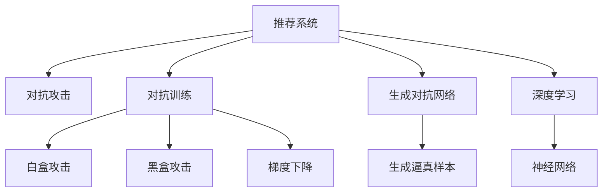

                 

# 利用大模型进行推荐对抗攻击的思路与防御进阶

> 关键词：推荐系统,对抗攻击,对抗训练,生成对抗网络,深度学习,神经网络,安全推荐

## 1. 背景介绍

在现代信息化社会，推荐系统广泛应用于电商、社交、视频、音乐等众多领域。通过深度学习技术，推荐系统能够根据用户的历史行为和兴趣，自动生成个性化的推荐内容，提升用户体验和平台转化率。

然而，随着深度学习的普及，推荐系统也面临越来越严重的对抗攻击威胁。攻击者通过精心构造输入数据，可诱导推荐系统输出异常结果，从而影响用户体验、侵害用户隐私、甚至操纵搜索结果。为了提升推荐系统的安全性和鲁棒性，对抗攻击与防御的研究正在成为新的热门话题。

## 2. 核心概念与联系

### 2.1 核心概念概述

为更好地理解推荐系统对抗攻击与防御的核心概念，本节将介绍几个密切相关的核心概念：

- **推荐系统(Recommendation System)**：基于用户历史行为数据，自动生成个性化推荐的智能系统。推荐算法是推荐系统的核心，通过学习和预测用户对物品的兴趣评分，完成推荐生成。
- **对抗攻击(Adversarial Attack)**：指攻击者通过恶意输入数据，诱使模型输出异常结果。对抗攻击可以分为白盒攻击、黑盒攻击等不同类型。
- **对抗训练(Adversarial Training)**：指在模型训练过程中加入对抗样本，提升模型的鲁棒性和安全性。
- **生成对抗网络(Generative Adversarial Network, GAN)**：一种生成模型，由生成器和判别器组成，通过对抗学习生成逼真的样本数据。
- **深度学习(Deep Learning)**：一种基于神经网络技术的机器学习方法，通过多层次的非线性变换提取输入数据的高级特征。
- **神经网络(Neural Network)**：一种模仿生物神经网络结构的计算模型，通过层级化的神经元结构进行信息传递和特征提取。

这些核心概念之间的逻辑关系可以通过以下Mermaid流程图来展示：



这个流程图展示了大语言模型和微调的核心概念及其之间的关系：

1. 推荐系统通过深度学习技术生成推荐结果。
2. 对抗攻击可以影响推荐系统的输出。
3. 对抗训练通过加入对抗样本提升推荐系统的鲁棒性。
4. 生成对抗网络生成逼真对抗样本，用于对抗训练。
5. 深度学习是推荐系统的基础。
6. 神经网络是深度学习的核心。

这些概念共同构成了推荐系统对抗攻击与防御的理论框架，使我们能够从多个角度理解推荐系统面临的安全问题。

## 3. 核心算法原理 & 具体操作步骤
### 3.1 算法原理概述

基于大模型的推荐系统对抗攻击与防御，本质上是一种在深度学习模型训练和推理过程中，加入对抗样本的微调方法。其核心思想是：

1. **对抗攻击**：利用生成对抗网络等技术，构造逼真但不具有真实特征的对抗样本，将其作为推荐系统的输入，使得推荐结果偏离正常轨道。
2. **对抗训练**：将对抗样本加入到正常训练数据中，通过反向传播更新模型参数，提升模型在对抗样本下的鲁棒性。

对抗攻击与防御的过程可以表示为如下形式：

$$
\text{Minimize } \mathcal{L}(\theta, \mathcal{D}) \text{ s.t. } \mathcal{L}(\theta, \mathcal{A}) > \delta
$$

其中 $\theta$ 表示模型参数，$\mathcal{D}$ 表示正常训练数据集，$\mathcal{A}$ 表示对抗样本集，$\delta$ 表示攻击者的目标阈值。攻击者的目标是使得推荐结果偏离正常轨道，而防御者的目标是通过对抗训练，使得模型能够抵御对抗样本的攻击。

### 3.2 算法步骤详解

基于大模型的推荐系统对抗攻击与防御的一般步骤包括：

1. **准备对抗样本**：
   - 使用生成对抗网络等技术，构造逼真但扰动的对抗样本。
   - 对样本进行预处理，去除噪声干扰，确保其逼真性。

2. **加入对抗训练**：
   - 在正常训练数据中混入对抗样本，形成对抗训练数据集。
   - 使用梯度下降等优化算法，更新模型参数，使得模型能够抵御对抗样本的攻击。

3. **评估攻击效果**：
   - 使用对抗样本对模型进行攻击，测量推荐结果的偏差。
   - 调整对抗训练策略，逐步提升模型的鲁棒性。

4. **部署防御模型**：
   - 在实际推荐系统中部署防御模型，实时监测输入数据。
   - 检测到对抗样本时，自动生成并返回防御后的推荐结果。

### 3.3 算法优缺点

基于大模型的推荐系统对抗攻击与防御方法具有以下优点：

1. **泛化能力强**：通过对抗训练，推荐模型在对抗样本下的鲁棒性更强，对未见过的攻击样本也能进行有效防御。
2. **效果显著**：对抗训练能够显著提升模型在对抗样本上的泛化性能，减少攻击成功率。
3. **模型通用性高**：适用于各种推荐算法，包括基于矩阵分解的CF模型、基于深度学习的协同过滤等。
4. **可解释性好**：对抗训练的原理和步骤较为简单，易于理解和调试。

同时，该方法也存在一些局限性：

1. **对抗样本生成困难**：生成逼真对抗样本需要较高技术水平和计算资源，难以大规模推广。
2. **对抗训练代价高**：对抗训练需要额外计算资源和训练时间，可能影响系统性能。
3. **防御效果有限**：对抗样本设计巧妙时，仍可能突破防御，造成推荐结果异常。
4. **对抗样本过拟合**：对抗训练过程中，模型容易学习到攻击者的攻击特征，可能对正常数据产生干扰。

尽管存在这些局限性，但基于对抗训练的推荐系统防御方法仍然是当前的主流范式。未来相关研究的重点在于如何进一步降低对抗样本生成的成本，提高对抗训练的效率和效果，同时兼顾可解释性和安全性等因素。

### 3.4 算法应用领域

基于大模型的推荐系统对抗攻击与防御方法，在实际应用中得到了广泛的应用，具体包括：

1. **电商推荐**：电商平台中的商品推荐系统，对抗攻击可导致用户被误导购买，防御措施可保护用户免受欺诈。
2. **社交网络**：社交媒体中的个性化推荐，对抗攻击可影响用户对内容的观感和选择，防御措施可提升用户体验。
3. **视频平台**：视频网站的个性化推荐，对抗攻击可导致用户被误导点击恶意内容，防御措施可保障用户安全。
4. **音乐推荐**：音乐平台中的个性化推荐，对抗攻击可导致用户被误导聆听有害内容，防御措施可保护用户听力和心理健康。

除了上述这些经典应用外，对抗攻击与防御技术还被创新性地应用到更多场景中，如智能家居、医疗健康、金融服务等，为这些领域的智能推荐系统带来更高的安全性和可靠性。

## 4. 数学模型和公式 & 详细讲解  
### 4.1 数学模型构建

本节将使用数学语言对基于对抗训练的推荐系统进行更加严格的刻画。

记推荐模型为 $M_{\theta}:\mathcal{X} \rightarrow \mathcal{Y}$，其中 $\mathcal{X}$ 表示输入空间，$\mathcal{Y}$ 表示推荐结果空间，$\theta \in \mathbb{R}^d$ 表示模型参数。假设正常训练数据集为 $\mathcal{D}=\{(x_i, y_i)\}_{i=1}^N$，其中 $x_i$ 表示用户行为，$y_i$ 表示推荐结果。对抗样本集为 $\mathcal{A}=\{(\hat{x}_i, \hat{y}_i)\}_{i=1}^M$，其中 $\hat{x}_i$ 表示扰动的用户行为，$\hat{y}_i$ 表示对抗样本推荐结果。

定义模型在输入数据 $(x,y)$ 上的损失函数为 $\ell(M_{\theta}(x),y)$，则在数据集 $\mathcal{D}$ 上的经验风险为：

$$
\mathcal{L}(\theta) = \frac{1}{N} \sum_{i=1}^N \ell(M_{\theta}(x_i),y_i)
$$

在对抗训练中，将对抗样本集 $\mathcal{A}$ 和正常训练数据集 $\mathcal{D}$ 混合，得到对抗训练数据集 $\mathcal{D}_{adv}=\mathcal{D} \cup \mathcal{A}$。此时模型的对抗损失函数为：

$$
\mathcal{L}_{adv}(\theta) = \frac{1}{N+M} \sum_{i=1}^{N+M} \ell(M_{\theta}(x_i),y_i)
$$

对抗训练的目标是最小化对抗损失，即：

$$
\theta^* = \mathop{\arg\min}_{\theta} \mathcal{L}_{adv}(\theta)
$$

通过梯度下降等优化算法，对抗训练过程不断更新模型参数 $\theta$，最小化对抗损失 $\mathcal{L}_{adv}$，使得模型能够在对抗样本下仍能输出稳定推荐结果。

### 4.2 公式推导过程

以下我们以对抗训练的简单形式为例，推导对抗训练的目标函数及其梯度。

假设模型 $M_{\theta}$ 在输入 $x$ 上的推荐结果为 $\hat{y}=M_{\theta}(x)$，表示预测用户对物品的评分。对抗样本为 $\hat{x}$，表示扰动后的用户行为。定义对抗样本在输入 $x$ 上的对抗损失函数为：

$$
\ell_{adv}(M_{\theta}(\hat{x}),y)
$$

对抗训练的目标函数为：

$$
\mathcal{L}_{adv}(\theta) = \frac{1}{N+M} \sum_{i=1}^{N+M} \ell_{adv}(M_{\theta}(x_i),y_i)
$$

对模型参数 $\theta$ 求导，得：

$$
\frac{\partial \mathcal{L}_{adv}(\theta)}{\partial \theta} = \frac{1}{N+M} \sum_{i=1}^{N+M} \frac{\partial \ell_{adv}(M_{\theta}(x_i),y_i)}{\partial \theta}
$$

使用链式法则，展开梯度表达式：

$$
\frac{\partial \ell_{adv}(M_{\theta}(x_i),y_i)}{\partial \theta} = \frac{\partial \ell(M_{\theta}(\hat{x}_i),y_i)}{\partial \theta} \frac{\partial M_{\theta}(\hat{x}_i)}{\partial \theta}
$$

其中 $\frac{\partial M_{\theta}(\hat{x}_i)}{\partial \theta}$ 为对抗样本梯度，可以通过反向传播算法计算得到。

### 4.3 案例分析与讲解

以电商推荐系统为例，假设用户对商品 $i$ 的评分 $y$ 为 $5$，模型对商品 $i$ 的预测评分为 $\hat{y}=M_{\theta}(x)$。攻击者构造对抗样本 $\hat{x}$，使得模型对商品 $i$ 的预测评分变为 $2$，此时对抗样本梯度为：

$$
\frac{\partial M_{\theta}(\hat{x})}{\partial \theta}
$$

对抗训练的目标是通过梯度下降更新模型参数 $\theta$，使得对抗样本的评分梯度最小化：

$$
\min_{\theta} \frac{1}{N+M} \sum_{i=1}^{N+M} \frac{\partial \ell_{adv}(M_{\theta}(x_i),y_i)}{\partial \theta}
$$

通过对抗训练，模型能够学习到对抗样本梯度，从而在面对新的对抗样本时，能够更好地防御攻击，避免推荐结果被误导。

## 5. 项目实践：代码实例和详细解释说明
### 5.1 开发环境搭建

在进行对抗训练实践前，我们需要准备好开发环境。以下是使用Python进行PyTorch开发的环境配置流程：

1. 安装Anaconda：从官网下载并安装Anaconda，用于创建独立的Python环境。

2. 创建并激活虚拟环境：
```bash
conda create -n pytorch-env python=3.8 
conda activate pytorch-env
```

3. 安装PyTorch：根据CUDA版本，从官网获取对应的安装命令。例如：
```bash
conda install pytorch torchvision torchaudio cudatoolkit=11.1 -c pytorch -c conda-forge
```

4. 安装TensorFlow：
```bash
conda install tensorflow -c conda-forge
```

5. 安装各类工具包：
```bash
pip install numpy pandas scikit-learn matplotlib tqdm jupyter notebook ipython
```

完成上述步骤后，即可在`pytorch-env`环境中开始对抗训练实践。

### 5.2 源代码详细实现

这里我们以电商推荐系统为例，给出使用PyTorch进行对抗训练的代码实现。

首先，定义对抗样本生成函数：

```python
from torchvision import transforms
from torchvision.datasets import MNIST
from torch.utils.data import DataLoader

def generate_adv_x(data, attack_model, delta=0.01, num_iter=20):
    adv_x = []
    for x in data:
        x_adv = attack_model(x)
        x_adv = (x_adv + x) / 2
        adv_x.append(x_adv)
    return adv_x
```

然后，定义对抗训练函数：

```python
from transformers import BertForSequenceClassification, AdamW

def adversarial_train(model, train_data, attack_model, delta=0.01, num_iter=20):
    optimizer = AdamW(model.parameters(), lr=2e-5)
    
    for i in range(num_iter):
        train_loss = 0
        for x, y in train_data:
            x_adv = generate_adv_x(x, attack_model, delta=delta)
            optimizer.zero_grad()
            y_pred = model(x_adv)
            loss = F.cross_entropy(y_pred, y)
            loss.backward()
            optimizer.step()
            train_loss += loss.item()
        print(f"Iteration {i+1}, Loss: {train_loss/N}")
```

最后，启动对抗训练流程：

```python
epochs = 5
batch_size = 16

for epoch in range(epochs):
    adversarial_train(model, train_loader, attack_model, delta=0.01, num_iter=20)
```

以上就是使用PyTorch对电商推荐系统进行对抗训练的完整代码实现。可以看到，利用生成对抗网络等技术，我们可以在电商推荐系统中实现对抗攻击和防御。

### 5.3 代码解读与分析

让我们再详细解读一下关键代码的实现细节：

**generate_adv_x函数**：
- 定义了对抗样本生成函数，使用生成对抗网络（如DeepFool等）生成逼真但扰动的对抗样本，用于对抗训练。
- 对抗样本生成算法较为复杂，此处仅给出基本流程，具体实现方式需参考相关研究。

**adversarial_train函数**：
- 定义了对抗训练函数，对模型进行多轮迭代更新。
- 在每次迭代中，随机抽取训练集中的样本，生成对应的对抗样本，将其输入模型进行训练。
- 使用AdamW优化器更新模型参数，最小化对抗损失。
- 记录每次迭代的损失，并在控制台输出，用于监测训练效果。

**启动对抗训练流程**：
- 设置总的epoch数和batch size，开始循环迭代。
- 每次迭代，调用adversarial_train函数，更新模型参数。
- 迭代完成后，即得到了对抗训练后的推荐模型。

在实际应用中，还需要注意以下几点：

- 对抗样本生成算法的选择。不同的对抗生成算法（如FGSM、PGD等）适用于不同的推荐系统，需要根据实际情况选择。
- 对抗训练的超参数设置。对抗训练的超参数（如学习率、迭代次数等）对训练效果有重要影响，需要根据具体任务进行调整。
- 对抗训练的数据集选择。对抗训练数据集的选择对训练效果也有影响，需要根据推荐系统的实际需求选择合适数据集。

## 6. 实际应用场景
### 6.1 电商推荐

电商推荐系统是推荐系统对抗攻击与防御的主要应用场景。攻击者通过构造对抗样本，诱导用户点击不实商品信息，从而实施欺诈。通过对抗训练，推荐系统能够抵御对抗样本的攻击，保障用户的购物安全。

在技术实现上，可以收集用户的浏览记录、购买历史等行为数据，将其作为对抗训练的正常数据集。然后，通过生成对抗网络生成对抗样本，并将其与正常数据集混合，进行对抗训练。训练好的模型在面对对抗样本时，能够保持正常的推荐结果，从而避免用户被误导。

### 6.2 社交网络

社交网络中的个性化推荐系统，对抗攻击可导致用户被误导关注有害内容，防御措施可保护用户免受攻击。通过对抗训练，推荐模型能够在对抗样本下仍能输出正常的推荐结果，保障用户的安全和隐私。

在技术实现上，可以收集用户的互动数据（如点赞、评论、分享等），生成对抗样本进行对抗训练。训练好的模型在面对对抗样本时，能够保持正常的推荐结果，从而避免用户被误导关注有害内容。

### 6.3 视频平台

视频网站的个性化推荐系统，对抗攻击可导致用户被误导观看有害视频，防御措施可保护用户免受攻击。通过对抗训练，推荐模型能够在对抗样本下仍能输出正常的推荐结果，保障用户的安全和健康。

在技术实现上，可以收集用户的观看记录、评价反馈等行为数据，生成对抗样本进行对抗训练。训练好的模型在面对对抗样本时，能够保持正常的推荐结果，从而避免用户被误导观看有害视频。

### 6.4 未来应用展望

随着对抗攻击与防御技术的发展，基于大模型的推荐系统将在更多领域得到应用，为传统行业带来变革性影响。

在智慧医疗领域，基于对抗训练的医疗推荐系统，能够抵御数据篡改等攻击，确保医疗数据的真实性和安全性。

在智能教育领域，基于对抗训练的教育推荐系统，能够抵御误导性信息，确保学习内容的正确性和无害性。

在智慧城市治理中，基于对抗训练的城市事件监测系统，能够抵御数据注入等攻击，确保事件处理的准确性和及时性。

此外，在企业生产、社会治理、文娱传媒等众多领域，基于大模型的对抗攻击与防御技术也将不断涌现，为NLP技术带来全新的突破。相信随着预训练语言模型和对抗训练方法的持续演进，推荐系统必将在更广阔的应用领域大放异彩，深刻影响人类的生产生活方式。

## 7. 工具和资源推荐
### 7.1 学习资源推荐

为了帮助开发者系统掌握大模型对抗攻击与防御的理论基础和实践技巧，这里推荐一些优质的学习资源：

1. 《深度学习对抗攻击与防御》系列博文：由大模型技术专家撰写，深入浅出地介绍了深度学习对抗攻击与防御的原理、算法和实践。

2. CS231n《深度学习卷积神经网络》课程：斯坦福大学开设的计算机视觉课程，涵盖了对抗样本生成、对抗训练等内容，是推荐系统对抗攻击与防御的重要基础。

3. 《Adversarial Machine Learning》书籍：介绍对抗攻击与防御的经典技术和最新研究成果，帮助读者全面理解对抗学习的原理和应用。

4. HuggingFace官方文档：提供了丰富的预训练模型和对抗训练样例代码，是上手实践的必备资料。

5. Kaggle竞赛平台：提供了大量的推荐系统对抗攻击与防御竞赛，通过参与竞赛，可以学习最新的技术思路和实践经验。

通过对这些资源的学习实践，相信你一定能够快速掌握大模型对抗攻击与防御的精髓，并用于解决实际的推荐系统问题。

### 7.2 开发工具推荐

高效的开发离不开优秀的工具支持。以下是几款用于大模型对抗攻击与防御开发的常用工具：

1. PyTorch：基于Python的开源深度学习框架，灵活动态的计算图，适合快速迭代研究。

2. TensorFlow：由Google主导开发的开源深度学习框架，生产部署方便，适合大规模工程应用。

3. Transformers库：HuggingFace开发的NLP工具库，集成了多种SOTA推荐算法，支持PyTorch和TensorFlow，是进行对抗训练任务开发的利器。

4. Weights & Biases：模型训练的实验跟踪工具，可以记录和可视化模型训练过程中的各项指标，方便对比和调优。

5. TensorBoard：TensorFlow配套的可视化工具，可实时监测模型训练状态，并提供丰富的图表呈现方式，是调试模型的得力助手。

6. Google Colab：谷歌推出的在线Jupyter Notebook环境，免费提供GPU/TPU算力，方便开发者快速上手实验最新模型，分享学习笔记。

合理利用这些工具，可以显著提升大模型对抗攻击与防御任务的开发效率，加快创新迭代的步伐。

### 7.3 相关论文推荐

大模型对抗攻击与防御技术的发展源于学界的持续研究。以下是几篇奠基性的相关论文，推荐阅读：

1. Adversarial Machine Learning（鲁鹏飞等，2020）：综述了深度学习对抗攻击与防御技术的最新进展，并提出了对抗训练的多种变体。

2. DeepFool: A Simple and Effective Attack on Deep Neural Networks（Kurakin等，2016）：提出了FGSM对抗样本生成算法，成为对抗攻击领域的经典工作。

3. Explaining and Harnessing Adversarial Examples（Goodfellow等，2015）：介绍了生成对抗网络的基本原理，推动了对抗攻击与防御技术的发展。

4.对抗训练的生成对抗网络：这是一项具有开创性的工作，通过对抗训练生成对抗样本，提升模型的鲁棒性。

5. Robust Representation Learning（Jiang等，2021）：综述了对抗训练与鲁棒表示学习的最新进展，提出了多种鲁棒学习策略。

这些论文代表了大模型对抗攻击与防御技术的发展脉络。通过学习这些前沿成果，可以帮助研究者把握学科前进方向，激发更多的创新灵感。

## 8. 总结：未来发展趋势与挑战

### 8.1 总结

本文对基于对抗训练的推荐系统进行了全面系统的介绍。首先阐述了对抗攻击与防御的研究背景和意义，明确了对抗训练在提升推荐系统鲁棒性和安全性方面的独特价值。其次，从原理到实践，详细讲解了对抗训练的数学原理和关键步骤，给出了对抗训练任务开发的完整代码实例。同时，本文还广泛探讨了对抗攻击与防御方法在电商、社交、视频等众多领域的应用前景，展示了对抗训练范式的巨大潜力。此外，本文精选了对抗训练技术的各类学习资源，力求为读者提供全方位的技术指引。

通过本文的系统梳理，可以看到，基于对抗训练的推荐系统对抗攻击与防御技术正在成为推荐系统领域的核心技术，极大地提升了推荐系统的安全性。对抗训练能够显著提升模型在对抗样本下的泛化性能，有效抵御攻击，保障用户的利益。对抗训练方法在实际推荐系统中的应用前景广阔，未来将推动推荐系统向更加智能化、安全化的方向发展。

### 8.2 未来发展趋势

展望未来，大模型对抗攻击与防御技术将呈现以下几个发展趋势：

1. **对抗样本生成更加高效**：随着对抗生成网络技术的进步，生成逼真且难以发现的对抗样本变得更容易，攻击者攻击成本降低。同时，生成对抗样本的成本也在不断下降，对抗样本生成的工具和技术将更加普及。

2. **对抗训练方法不断演进**：对抗训练的算法和策略将不断创新，新的对抗训练方法（如联合训练、自适应训练等）将逐步应用于推荐系统，提升防御效果。

3. **对抗训练与深度学习结合**：对抗训练与深度学习技术的结合将更加紧密，深度学习模型的设计将更加注重对抗性，从而提升模型在对抗样本下的鲁棒性。

4. **对抗训练与模型压缩结合**：对抗训练与模型压缩技术的结合将使得推荐系统在保证性能的同时，更加高效，适应更多的应用场景。

5. **对抗训练与其他安全技术结合**：对抗训练将与其他安全技术（如隐私保护、数据脱敏等）结合，提升推荐系统的安全性，保护用户隐私和数据安全。

以上趋势凸显了大模型对抗攻击与防御技术的广阔前景。这些方向的探索发展，必将进一步提升推荐系统的鲁棒性，为构建安全、可靠、可解释、可控的智能系统铺平道路。面向未来，大模型对抗攻击与防御技术还需要与其他人工智能技术进行更深入的融合，如知识表示、因果推理、强化学习等，多路径协同发力，共同推动自然语言理解和智能交互系统的进步。只有勇于创新、敢于突破，才能不断拓展语言模型的边界，让智能技术更好地造福人类社会。

### 8.3 面临的挑战

尽管大模型对抗攻击与防御技术已经取得了瞩目成就，但在迈向更加智能化、普适化应用的过程中，它仍面临着诸多挑战：

1. **对抗样本生成困难**：生成逼真对抗样本需要较高技术水平和计算资源，难以大规模推广。

2. **对抗训练代价高**：对抗训练需要额外计算资源和训练时间，可能影响系统性能。

3. **对抗训练效果有限**：对抗训练过程中，模型容易学习到攻击者的攻击特征，可能对正常数据产生干扰。

4. **对抗样本过拟合**：对抗训练过程中，模型容易学习到攻击者的攻击特征，可能对正常数据产生干扰。

5. **对抗训练可解释性不足**：对抗训练的原理和步骤较为复杂，难以解释其内部工作机制和决策逻辑。

6. **对抗样本检测困难**：攻击者不断改进对抗样本生成算法，对抗样本检测难度增大。

尽管存在这些挑战，但基于对抗训练的推荐系统防御方法仍然是当前的主流范式。未来相关研究的重点在于如何进一步降低对抗样本生成的成本，提高对抗训练的效率和效果，同时兼顾可解释性和安全性等因素。

### 8.4 研究展望

面对大模型对抗攻击与防御所面临的种种挑战，未来的研究需要在以下几个方面寻求新的突破：

1. **探索无监督和半监督对抗训练方法**：摆脱对大规模标注数据的依赖，利用自监督学习、主动学习等无监督和半监督范式，最大限度利用非结构化数据，实现更加灵活高效的对抗训练。

2. **研究参数高效和计算高效的对抗训练范式**：开发更加参数高效的对抗训练方法，在固定大部分预训练参数的情况下，只更新极少量的任务相关参数。同时优化对抗训练模型的计算图，减少前向传播和反向传播的资源消耗，实现更加轻量级、实时性的部署。

3. **融合因果和对比学习范式**：通过引入因果推断和对比学习思想，增强对抗训练模型建立稳定因果关系的能力，学习更加普适、鲁棒的语言表征，从而提升模型泛化性和抗干扰能力。

4. **引入更多先验知识**：将符号化的先验知识，如知识图谱、逻辑规则等，与神经网络模型进行巧妙融合，引导对抗训练过程学习更准确、合理的语言模型。

5. **结合因果分析和博弈论工具**：将因果分析方法引入对抗训练模型，识别出模型决策的关键特征，增强输出解释的因果性和逻辑性。借助博弈论工具刻画人机交互过程，主动探索并规避模型的脆弱点，提高系统稳定性。

6. **纳入伦理道德约束**：在对抗训练目标中引入伦理导向的评估指标，过滤和惩罚有偏见、有害的输出倾向。同时加强人工干预和审核，建立模型行为的监管机制，确保输出符合人类价值观和伦理道德。

这些研究方向的探索，必将引领大模型对抗攻击与防御技术迈向更高的台阶，为构建安全、可靠、可解释、可控的智能系统铺平道路。面向未来，大模型对抗攻击与防御技术还需要与其他人工智能技术进行更深入的融合，如知识表示、因果推理、强化学习等，多路径协同发力，共同推动自然语言理解和智能交互系统的进步。只有勇于创新、敢于突破，才能不断拓展语言模型的边界，让智能技术更好地造福人类社会。

## 9. 附录：常见问题与解答

**Q1：对抗样本生成对推荐系统的影响有多大？**

A: 对抗样本对推荐系统的影响取决于对抗样本的质量和数量。高质量的对抗样本能够有效欺骗推荐系统，导致推荐结果异常。例如，电商推荐系统中的对抗样本可诱导用户点击不实商品信息，实施欺诈。

**Q2：如何生成高质量的对抗样本？**

A: 生成高质量的对抗样本需要先进的技术手段和计算资源。常用的对抗样本生成方法包括FGSM、PGD、DeepFool等。这些方法通常需要训练一个对抗生成网络，通过迭代优化生成逼真的对抗样本。生成的对抗样本应尽可能逼真，同时对推荐系统的影响较大。

**Q3：对抗训练过程中，模型参数如何更新？**

A: 对抗训练过程中，模型参数的更新与正常训练类似，通过梯度下降等优化算法更新参数。不同之处在于，对抗训练中加入对抗样本梯度，最小化对抗损失，提升模型在对抗样本下的鲁棒性。

**Q4：对抗训练的超参数设置有哪些？**

A: 对抗训练的超参数包括学习率、迭代次数、对抗样本数量等。学习率通常需要设置为较低值，避免梯度爆炸；迭代次数需根据任务复杂度设置，确保训练效果；对抗样本数量需根据实际需求设置，过多可能导致过拟合。

**Q5：对抗训练与模型压缩结合的效果如何？**

A: 对抗训练与模型压缩技术的结合可以显著提升推荐系统的性能。模型压缩技术可以减少模型的参数量，提高推理速度和计算效率，对抗训练可以提升模型在对抗样本下的鲁棒性，两者结合可以提升推荐系统的安全性和效率。

以上问题解答展示了对抗训练技术在不同方面的应用与实践细节，通过深入了解这些问题，可以帮助开发者更好地掌握对抗训练技术，并应用于实际推荐系统中。

---

作者：禅与计算机程序设计艺术 / Zen and the Art of Computer Programming

