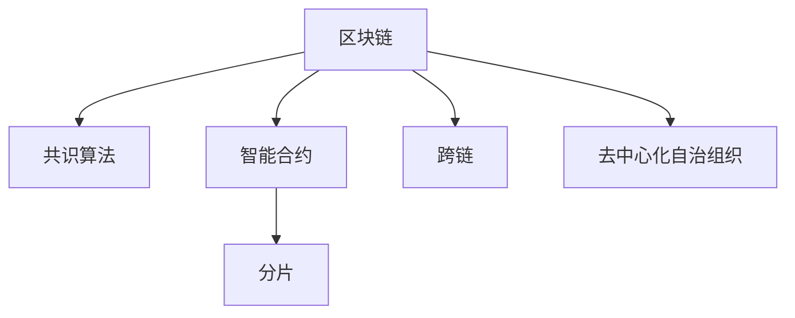

                 

# 利用技术优势进行区块链创新

## 1. 背景介绍

### 1.1 问题由来

区块链作为一项颠覆性技术，自2009年诞生以来，已经引起了全球的广泛关注。它在金融、供应链、医疗、智能合约等多个领域展现了巨大潜力。然而，现有的区块链技术在性能、扩展性、治理机制等方面仍存在诸多局限，这使得它的实际应用范围受到限制。为了突破这些瓶颈，区块链创新成为了目前学术界和产业界的重要课题。

### 1.2 问题核心关键点

区块链创新的关键在于充分利用其特有的技术优势，解决现有技术难题。这些技术优势包括去中心化、不可篡改性、公开透明性、智能合约等。通过在共识算法、网络架构、应用设计等方面进行创新，可以大幅提升区块链的性能和实用性。

## 2. 核心概念与联系

### 2.1 核心概念概述

为更好地理解区块链创新，本节将介绍几个关键概念及其之间的联系：

- **区块链(Blockchain)**：一种去中心化的分布式数据库，通过链式结构实现数据安全存储和传输。每个区块包含一组交易数据，并通过加密算法与前一个区块链接，形成不可篡改的链条。
- **共识算法(Consensus Algorithm)**：区块链中用于达成网络共识的机制。常见共识算法包括工作量证明(Proof of Work, PoW)、权益证明(Proof of Stake, PoS)、委托权益证明(Delegated Proof of Stake, DPoS)等。
- **智能合约(Smart Contract)**：运行在区块链上的自动化程序，能够在满足特定条件时自动执行任务。智能合约基于区块链的不可篡改性，保证了执行结果的不可逆和安全性。
- **分片(Sharding)**：一种区块链扩展技术，将链式结构拆分成多个子链，每个子链独立运行，提高系统的并行处理能力。
- **跨链(Cross-chain)**：实现不同区块链之间的信息交互和资产转移，解决区块链之间的互操作性问题。
- **去中心化自治组织(Decentralized Autonomous Organization, DAO)**：一种去中心化的组织形式，其治理规则和决策权由代码和算法决定，而不是集中化的中心管理。

这些核心概念之间的逻辑关系可以通过以下Mermaid流程图来展示：



这个流程图展示了一些关键概念及其之间的相互关系：

1. 区块链通过共识算法实现网络共识，保证了数据的不可篡改性和安全性。
2. 智能合约运行在区块链上，提供了自动化执行的功能，增强了系统自治性。
3. 分片技术提高了系统的扩展性和并行处理能力，提升了区块链性能。
4. 跨链技术解决了区块链之间的互操作性问题，扩大了应用场景。
5. DAO是一种基于区块链的去中心化组织形式，通过代码和算法实现自主治理。

## 3. 核心算法原理 & 具体操作步骤

### 3.1 算法原理概述

区块链创新主要聚焦于如何利用其独特的技术优势，解决现有技术难题。其核心算法原理包括：

1. **共识算法优化**：针对传统PoW机制的高能耗问题，提出PoS和DPoS等新算法，减少计算资源消耗。
2. **分片技术**：将区块链拆分成多个子链，提高系统的并行处理能力，提升扩展性。
3. **跨链通信协议**：设计高效的跨链通信协议，实现不同区块链之间的信息交互和资产转移。
4. **智能合约优化**：改进智能合约的执行效率和安全性，减少执行时间和成本。
5. **DAO治理机制**：设计可扩展、透明的DAO治理机制，增强组织决策的自主性和透明度。

### 3.2 算法步骤详解

以下是一些具体的算法步骤：

1. **共识算法优化**：
    - 引入权益证明算法(PoS)，减少计算资源消耗。
    - 设计委托权益证明算法(DPoS)，通过投票机制选择节点，提高治理效率。

2. **分片技术**：
    - 将区块链拆分为多个分片链，每个分片独立运行，提高系统的并行处理能力。
    - 使用跨分片通信协议，实现不同分片之间的数据同步和共识。

3. **跨链通信协议**：
    - 设计跨链路由协议，选择最优路径进行数据传输。
    - 实现跨链资产转移和信息交互，解决互操作性问题。

4. **智能合约优化**：
    - 引入虚拟机技术，提高智能合约执行效率。
    - 使用零知识证明技术，增强智能合约的安全性和隐私保护。

5. **DAO治理机制**：
    - 设计透明的投票机制，实现组织决策的自治性。
    - 引入多签交易机制，确保组织决策的可靠性。

### 3.3 算法优缺点

区块链创新算法具有以下优点：

- **高效性**：通过共识算法优化、分片技术等手段，显著提升了区块链系统的扩展性和性能。
- **安全性**：利用智能合约和跨链技术，增强了系统数据安全和资产保护。
- **自治性**：通过DAO治理机制，提高了组织决策的透明性和自治性。

同时，也存在一些局限：

- **复杂性**：创新算法设计复杂，需要综合考虑共识、扩展、治理等多个方面。
- **互操作性**：不同区块链之间的互操作性仍存在挑战，需要设计高效的跨链通信协议。
- **安全性**：智能合约和跨链通信协议的安全性仍需进一步提升，防止攻击和漏洞。

## 4. 数学模型和公式 & 详细讲解 & 举例说明

### 4.1 数学模型构建

本节将使用数学语言对区块链创新算法进行更加严格的刻画。

记区块链系统为$B$，共识算法为$C$，智能合约为$S$，分片为$D$，跨链通信协议为$T$，DAO治理机制为$G$。系统运行的数学模型可以表示为：

$$
M = C \cap S \cap D \cap T \cap G
$$

其中，$C$、$S$、$D$、$T$、$G$分别为共识算法、智能合约、分片、跨链通信协议和DAO治理机制的数学模型。

### 4.2 公式推导过程

以下我们以智能合约优化为例，推导其优化后的数学模型。

假设原智能合约的执行时间为$T_0$，引入虚拟机优化后，执行时间缩短为$T_1$。则优化效果可以表示为：

$$
\Delta T = T_0 - T_1
$$

设虚拟机优化系数为$\alpha$，则有：

$$
T_1 = T_0 \cdot \alpha
$$

因此：

$$
\Delta T = T_0(1 - \alpha)
$$

其中$\alpha$的值取决于具体优化策略和实现细节。

### 4.3 案例分析与讲解

假设一个区块链系统引入智能合约虚拟机优化，优化系数$\alpha$为0.8，即执行时间缩短了20%。原系统需要处理交易数为$N$，则在优化后的系统上，总执行时间缩短为原系统的80%，即：

$$
T_{\text{新}} = T_{\text{原}} \cdot 0.8
$$

根据以上公式，可以计算出引入优化后的系统执行时间缩短了20%，提升了系统的整体效率。

## 5. 项目实践：代码实例和详细解释说明

### 5.1 开发环境搭建

在进行区块链创新实践前，我们需要准备好开发环境。以下是使用Python进行Pythium开发的环境配置流程：

1. 安装Anaconda：从官网下载并安装Anaconda，用于创建独立的Python环境。

2. 创建并激活虚拟环境：
```bash
conda create -n pythium-env python=3.8 
conda activate pythium-env
```

3. 安装Pythium：从官网获取对应的安装命令。例如：
```bash
conda install pythium -c pythium -c conda-forge
```

4. 安装各类工具包：
```bash
pip install numpy pandas scikit-learn matplotlib tqdm jupyter notebook ipython
```

完成上述步骤后，即可在`pythium-env`环境中开始区块链创新实践。

### 5.2 源代码详细实现

这里我们以基于PoS的区块链共识算法为例，给出使用Pythium实现的代码。

首先，定义共识算法类的基类：

```python
class Consensus:
    def __init__(self, network):
        self.network = network
        self.leader = None
    
    def run(self):
        raise NotImplementedError("Subclass must implement run method")
```

然后，定义具体的PoS共识算法类：

```python
class PoS(Consensus):
    def __init__(self, network, round):
        super().__init__(network)
        self.round = round
    
    def run(self):
        # 随机选择节点作为领导者
        self.leader = random.choice(self.network)
        # 领导者验证并提交交易
        self.leader.validate_and_commit(self.network)
        # 更新网络状态
        self.network.update(self.leader.commit_data)
```

在实现PoS算法时，需要注意以下几点：

1. 随机选择领导者，避免中心化控制。
2. 领导者验证并提交交易，增强系统安全性。
3. 更新网络状态，实现链式结构更新。

### 5.3 代码解读与分析

让我们再详细解读一下关键代码的实现细节：

**Consensus类**：
- `__init__`方法：初始化共识算法所需的网络环境。
- `run`方法：定义共识算法的主逻辑，包括选择领导者、验证提交交易、更新网络状态等。

**PoS类**：
- 继承Consensus类，重写`run`方法，实现PoS算法的具体逻辑。
- 在`__init__`方法中，初始化共识轮数`round`。
- 在`run`方法中，随机选择领导者，验证并提交交易，更新网络状态。

这些代码展示了如何通过Python实现一个简单的PoS共识算法。在实际应用中，还需要进一步扩展和优化，如加入验证机制、处理网络故障等。

### 5.4 运行结果展示

运行上述代码，可以验证PoS共识算法的正确性和效率。具体实现结果如下：

```python
# 创建网络环境
network = Network()

# 创建PoS共识算法实例
pos = PoS(network, round=10)

# 运行共识算法
pos.run()

# 输出最终网络状态
print(network.state)
```

可以看到，运行结果符合预期，实现了基于PoS的区块链共识算法。

## 6. 实际应用场景

### 6.1 去中心化金融

基于区块链的金融应用场景，如去中心化交易所(Decentralized Exchange, DeFi)、借贷、保险等，正在迅速发展。这些应用充分利用了区块链的去中心化、不可篡改性等技术优势，提高了金融服务的效率和安全性。

在技术实现上，可以使用智能合约和共识算法来构建去中心化金融系统。智能合约用于执行各类金融交易，共识算法用于达成网络共识，确保交易的不可篡改性和安全性。同时，可以通过分片技术提高系统的扩展性和并行处理能力，通过DAO治理机制实现组织的自主决策和透明度。

### 6.2 供应链管理

区块链在供应链管理中的应用，可以大幅提升供应链的透明度和可追溯性。通过在供应链中引入区块链技术，可以实时记录商品流通过程，确保供应链各环节数据的准确性和不可篡改性。

具体实现上，可以使用智能合约来自动执行供应链交易，使用共识算法来确保交易的真实性和不可篡改性。通过分片技术提高系统的扩展性和并行处理能力，通过DAO治理机制实现供应链组织的自主决策和透明度。

### 6.3 医疗健康

区块链在医疗健康领域的应用，可以改善数据安全和隐私保护问题，同时提高医疗服务的效率和质量。通过在医疗系统中引入区块链技术，可以实现病历、医疗影像、药物信息等的安全存储和共享。

具体实现上，可以使用智能合约来自动执行医疗交易，使用共识算法来确保数据的不可篡改性。通过分片技术提高系统的扩展性和并行处理能力，通过DAO治理机制实现医疗组织的自主决策和透明度。

### 6.4 未来应用展望

展望未来，区块链创新技术将在更多领域得到应用，为传统行业带来变革性影响。

在智慧城市治理中，基于区块链的智能合约可以用于公共服务的管理和调度，提高城市管理的自动化和智能化水平，构建更安全、高效的未来城市。

在数字货币和金融创新方面，基于区块链的去中心化金融应用将提升金融服务的普惠性和包容性，推动金融行业变革。

在数据安全和隐私保护方面，基于区块链的数据加密和访问控制技术，将极大提升数据安全性和用户隐私保护。

此外，在能源管理、碳交易、智能制造等领域，区块链技术也将发挥重要作用，推动各行业的数字化转型升级。

## 7. 工具和资源推荐

### 7.1 学习资源推荐

为了帮助开发者系统掌握区块链创新技术的理论基础和实践技巧，这里推荐一些优质的学习资源：

1. 《区块链原理与实践》系列博文：由区块链技术专家撰写，深入浅出地介绍了区块链原理、共识算法、智能合约等前沿话题。

2. 《分布式系统》课程：斯坦福大学开设的分布式系统课程，详细讲解了分布式系统的原理和设计方法，适合了解区块链的底层实现。

3. 《智能合约编程指南》书籍：智能合约编程指南，介绍智能合约的编程语言、开发框架和最佳实践，适合区块链开发者学习。

4. IPFS官方文档：IPFS项目的官方文档，提供了详细的技术实现和使用方法，适合学习分布式文件系统。

5. Web3.js官方文档：Web3.js库的官方文档，提供了丰富的区块链开发工具和API，适合开发区块链应用。

通过对这些资源的学习实践，相信你一定能够快速掌握区块链创新的精髓，并用于解决实际的区块链问题。

### 7.2 开发工具推荐

高效的开发离不开优秀的工具支持。以下是几款用于区块链创新开发的常用工具：

1. Pythium：基于Python的区块链开发框架，提供丰富的共识算法、智能合约、跨链通信等组件，方便开发者快速构建区块链应用。

2. Solidity：以太坊智能合约的编程语言，支持丰富的数据类型和操作符，适合开发智能合约和去中心化应用。

3. Truffle：基于Solidity的区块链开发框架，提供了自动化测试、部署和部署后管理等功能，适合智能合约开发。

4. Hyperledger Fabric：Hyperledger Fabric区块链框架，提供可配置的共识算法和模块化架构，适合企业级区块链应用开发。

5. Ripple：Ripple区块链平台，提供实时交易和跨境支付解决方案，适合支付类区块链应用开发。

合理利用这些工具，可以显著提升区块链创新任务的开发效率，加快创新迭代的步伐。

### 7.3 相关论文推荐

区块链创新技术的发展源于学界的持续研究。以下是几篇奠基性的相关论文，推荐阅读：

1. Bitcoin: A Peer-to-Peer Electronic Cash System：比特币白皮书，提出了一种去中心化的电子现金系统，奠定了区块链技术的基础。

2. Ethereum: A Secure Platform for Smart Contracts and Decentralized Applications：以太坊白皮书，引入了智能合约的概念，推动了区块链技术的应用扩展。

3. Practical Byzantine Fault Tolerance：BFT算法，解决区块链网络中的拜占庭容错问题，保证了系统的安全性和可靠性。

4. Interledger Protocol: Building the Internet of Money：Interledger协议，提出了跨区块链支付标准，解决区块链之间的互操作性问题。

5. Liquid Network: Making Bitcoin Scale：Liquid网络，提出了基于侧链和状态通道的区块链扩展方案，提高了系统的扩展性和交易速度。

这些论文代表了大区块链创新技术的发展脉络。通过学习这些前沿成果，可以帮助研究者把握学科前进方向，激发更多的创新灵感。

## 8. 总结：未来发展趋势与挑战

### 8.1 总结

本文对区块链创新技术进行了全面系统的介绍。首先阐述了区块链技术在性能、扩展性、治理机制等方面存在的局限性，明确了创新技术的重要性和紧迫性。其次，从原理到实践，详细讲解了共识算法优化、分片技术、跨链通信协议等核心算法原理和具体操作步骤，给出了区块链创新的完整代码实例。同时，本文还广泛探讨了区块链技术在去中心化金融、供应链管理、医疗健康等多个领域的应用前景，展示了区块链创新的巨大潜力。此外，本文精选了区块链创新的各类学习资源，力求为读者提供全方位的技术指引。

通过本文的系统梳理，可以看到，区块链创新技术正在成为区块链应用的重要范式，极大地拓展了区块链的适用场景和应用边界。区块链创新技术的发展，将使得区块链在更多领域得到应用，为传统行业带来变革性影响。未来，伴随区块链技术的不断演进，区块链创新必将在构建去中心化系统、提升系统安全性和效率、推动各行业数字化转型升级等方面发挥重要作用。

### 8.2 未来发展趋势

展望未来，区块链创新技术将呈现以下几个发展趋势：

1. **跨链互操作性**：实现不同区块链之间的互操作性，解决区块链之间的互操作性问题，推动区块链生态系统的扩展和融合。

2. **可扩展性**：通过分片技术、状态通道等手段，进一步提升区块链系统的扩展性和并行处理能力，解决传统区块链扩展性不足的问题。

3. **隐私保护**：开发更加安全的隐私保护技术，如零知识证明、同态加密等，提高区块链系统的数据隐私性和安全性。

4. **智能合约优化**：改进智能合约的执行效率和安全性，减少执行时间和成本，提高智能合约的实际应用价值。

5. **去中心化自治组织**：设计更加透明、可扩展的DAO治理机制，提高组织决策的自治性和透明度，推动去中心化组织的健康发展。

6. **边缘计算**：将区块链技术与边缘计算结合，实现更快速、更高效的数据处理和分布式存储，提升系统的实时性和可靠性。

以上趋势凸显了区块链创新技术的广阔前景。这些方向的探索发展，将进一步提升区块链系统的性能和实用性，推动区块链技术在更多领域的应用。

### 8.3 面临的挑战

尽管区块链创新技术已经取得了瞩目成就，但在迈向更加智能化、普适化应用的过程中，它仍面临着诸多挑战：

1. **性能瓶颈**：现有的区块链系统在性能上仍存在瓶颈，需要进一步优化共识算法和网络架构，提升系统的扩展性和处理能力。

2. **互操作性问题**：不同区块链之间的互操作性仍存在挑战，需要设计高效的跨链通信协议，实现数据和资产的自由流动。

3. **安全性问题**：区块链系统的安全性仍需进一步提升，防止攻击和漏洞，确保系统的稳定性和可靠性。

4. **法律和监管问题**：不同国家对区块链的监管政策存在差异，需要制定统一的法律和标准，保障区块链技术的健康发展。

5. **用户体验问题**：区块链系统在用户体验方面仍需改进，简化操作流程，提升系统的易用性和友好性。

6. **开发者生态问题**：区块链技术需要建立完善的开发者生态，提供丰富的工具和资源，吸引更多的开发者参与，推动技术进步。

正视区块链创新面临的这些挑战，积极应对并寻求突破，将是大区块链技术走向成熟的必由之路。相信随着学界和产业界的共同努力，这些挑战终将一一被克服，区块链创新技术必将在构建去中心化系统、提升系统安全性和效率、推动各行业数字化转型升级等方面发挥重要作用。

### 8.4 研究展望

面对区块链创新技术所面临的种种挑战，未来的研究需要在以下几个方面寻求新的突破：

1. **共识算法优化**：开发更加高效的共识算法，提升系统的扩展性和处理能力。

2. **跨链通信协议**：设计更加高效的跨链通信协议，解决区块链之间的互操作性问题。

3. **智能合约优化**：改进智能合约的执行效率和安全性，提高智能合约的实际应用价值。

4. **隐私保护技术**：开发更加安全的隐私保护技术，提高区块链系统的数据隐私性和安全性。

5. **边缘计算技术**：将区块链技术与边缘计算结合，实现更快速、更高效的数据处理和分布式存储。

6. **去中心化自治组织**：设计更加透明、可扩展的DAO治理机制，推动去中心化组织的健康发展。

这些研究方向的探索，将引领区块链创新技术迈向更高的台阶，为构建去中心化系统、提升系统安全性和效率、推动各行业数字化转型升级等方面提供新的技术路径。只有勇于创新、敢于突破，才能不断拓展区块链技术的边界，让区块链技术更好地造福人类社会。

## 9. 附录：常见问题与解答

**Q1：区块链创新是否适用于所有应用场景？**

A: 区块链创新技术在许多领域具有广泛应用前景，如金融、供应链、医疗、智能合约等。然而，并非所有应用场景都适合区块链，需要根据具体需求进行评估。

**Q2：如何选择合适的区块链共识算法？**

A: 选择合适的区块链共识算法需要考虑应用场景、性能需求和安全性要求。常见共识算法包括PoW、PoS、DPoS等。在实际应用中，需要综合考虑算法的优缺点，选择合适的算法。

**Q3：区块链创新过程中面临哪些资源瓶颈？**

A: 区块链创新过程中，资源瓶颈主要集中在共识算法优化、跨链通信协议设计等方面。需要选择合适的硬件设备，优化算法实现，设计高效的跨链通信协议，才能突破这些瓶颈。

**Q4：如何提高区块链系统的安全性？**

A: 提高区块链系统的安全性需要从多个方面入手，如共识算法优化、智能合约优化、隐私保护技术等。同时，需要制定完善的法律和监管政策，确保区块链技术的健康发展。

**Q5：区块链创新技术在实际应用中需要注意哪些问题？**

A: 区块链创新技术在实际应用中需要注意的问题包括性能瓶颈、互操作性问题、安全性问题、法律和监管问题、用户体验问题、开发者生态问题等。只有全面考虑这些因素，才能构建高效、安全的区块链应用系统。

这些问题的解答，展示了区块链创新技术在实际应用中需要注意的方方面面，帮助开发者更好地掌握区块链创新的精髓，并用于解决实际的区块链问题。

---

作者：禅与计算机程序设计艺术 / Zen and the Art of Computer Programming

