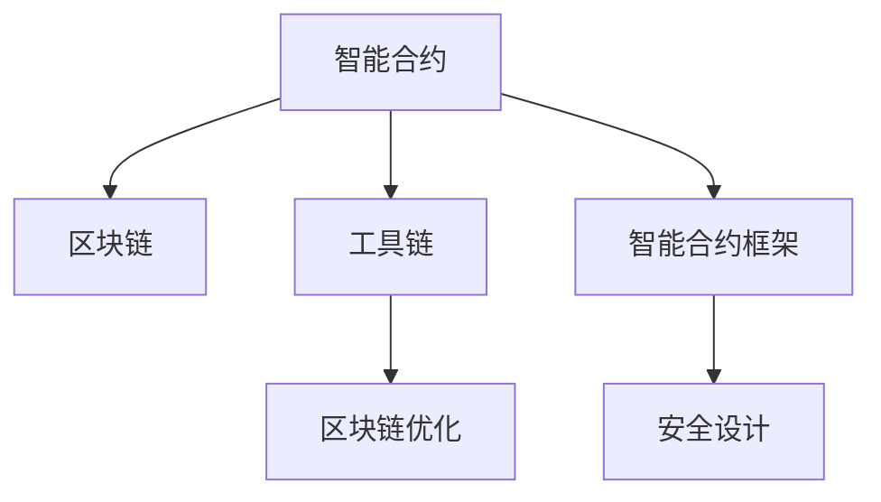

                 

## 1. 背景介绍

### 1.1 问题由来

随着区块链技术的快速发展，智能合约(Smart Contracts)作为去中心化应用(DeFi)的核心组成部分，其应用场景和影响力日益扩大。智能合约是一种基于代码的合约，能够在区块链上自动执行，无需人工干预，具有透明度高、执行效率高等优点。智能合约技术在金融、供应链、医疗等领域都展现出了巨大的潜力。

然而，智能合约的开发与部署过程仍面临诸多挑战，如代码编写复杂、调试难度大、安全性问题等。为了提升智能合约的开发效率和安全性，本文将介绍一种基于技术优势进行智能合约开发的方案，即利用工具链优化、区块链优化、智能合约框架等技术手段，简化开发流程，提高智能合约的开发效率和安全性。

### 1.2 问题核心关键点

本文将探讨以下核心关键点：
1. 如何利用工具链优化提高智能合约的开发效率。
2. 如何利用区块链优化提高智能合约的安全性和性能。
3. 如何利用智能合约框架简化智能合约的开发过程。
4. 如何利用区块链协议优化智能合约的执行效率。
5. 如何利用智能合约的安全设计原则提高智能合约的安全性。

通过解决这些问题，本文将展示一种高效、安全的智能合约开发方案。

## 2. 核心概念与联系

### 2.1 核心概念概述

为更好地理解本文介绍的智能合约开发方案，本节将介绍几个密切相关的核心概念：

- **智能合约(Smart Contract)**：一种基于代码自动执行的合约，能够在区块链上自动执行，无需人工干预。智能合约具有去中心化、透明性、不可篡改性等特点，广泛应用于金融、供应链、医疗等领域。

- **区块链(Blockchain)**：一种分布式账本技术，通过去中心化的方式记录交易数据。区块链具有安全性高、不可篡改性、去中心化等特点，是智能合约执行的基础平台。

- **工具链(Toolchain)**：开发和部署智能合约所需的一整套工具集合，包括IDE、编辑器、编译器、测试框架等。

- **区块链优化(Blockchain Optimization)**：针对区块链平台特性进行智能合约的优化，以提高智能合约的执行效率和安全性。

- **智能合约框架(Smart Contract Framework)**：为简化智能合约开发而设计的工具和规范，提供统一的API和标准，简化开发过程。

- **安全设计(Designing Security)**：智能合约在设计和实现过程中，需要遵循一系列的安全设计原则，以减少安全漏洞和攻击风险。

这些核心概念之间的逻辑关系可以通过以下Mermaid流程图来展示：



这个流程图展示了他几核心概念及其之间的关系：

1. 智能合约在区块链上执行，利用区块链的特性保证其不可篡改性和安全性。
2. 智能合约开发和部署需要借助工具链，提高开发效率和代码质量。
3. 通过区块链优化，进一步提高智能合约的执行效率和安全性。
4. 智能合约框架为开发过程提供指导和支持，简化开发。
5. 遵循安全设计原则，减少智能合约的安全风险。

这些概念共同构成了智能合约开发的技术框架，帮助我们理解和应用智能合约技术。

## 3. 核心算法原理 & 具体操作步骤
### 3.1 算法原理概述

本文介绍的智能合约开发方案，基于以下几个核心算法原理：

1. **工具链优化**：通过选择合适的工具链，简化智能合约的开发和部署过程，提高开发效率和代码质量。
2. **区块链优化**：针对区块链平台特性进行智能合约的优化，提高执行效率和安全性。
3. **智能合约框架**：提供统一的API和标准，简化开发过程，提高开发效率。
4. **安全设计**：遵循安全设计原则，减少智能合约的安全风险。

这些原理相互配合，共同构成了一种高效的智能合约开发方案。

### 3.2 算法步骤详解

本文介绍的智能合约开发方案，包括以下几个关键步骤：

**Step 1: 选择合适的开发工具链**

选择合适的开发工具链，可以显著提高智能合约的开发效率和代码质量。推荐使用如下工具链：

- **IDE**：如Truffle、Remix等，提供直观的开发环境，支持智能合约的编译、部署和调试。
- **编辑器**：如Visual Studio Code、Sublime Text等，支持智能合约代码的编写和编辑。
- **编译器**：如Solidity Compiler，支持Solidity智能合约的编译和测试。
- **测试框架**：如Truffle Test，支持智能合约的单元测试和集成测试。

**Step 2: 设计智能合约**

在设计智能合约时，需要遵循以下原则：

- **简洁性**：智能合约的代码应尽可能简洁，避免不必要的复杂性和冗余。
- **模块化**：将智能合约分解为多个模块，提高代码的可维护性和可扩展性。
- **安全设计**：遵循安全设计原则，如防止重入攻击、溢出攻击等，减少安全漏洞和攻击风险。

**Step 3: 实现智能合约**

在实现智能合约时，需要：

- **选择合适的编程语言**：如Solidity、WebAssembly等，根据区块链平台的特点选择适合的编程语言。
- **遵循智能合约框架**：使用智能合约框架提供的API和标准，简化开发过程，提高开发效率。
- **进行代码审查**：代码审查可以发现潜在的漏洞和问题，提高代码质量。

**Step 4: 测试和部署**

在测试和部署智能合约时，需要：

- **单元测试**：对智能合约的每个模块进行单元测试，确保其功能正确。
- **集成测试**：对智能合约的各个模块进行集成测试，确保其相互配合正常。
- **部署到区块链**：将智能合约部署到区块链上，并进行测试，确保其正常工作。

**Step 5: 监控和维护**

在监控和维护智能合约时，需要：

- **监控智能合约的执行状态**：监控智能合约的执行状态，及时发现和解决问题。
- **进行定期更新和升级**：根据需求，进行智能合约的更新和升级，确保其功能完善。
- **进行安全审计**：定期进行安全审计，发现和修复安全漏洞，提高智能合约的安全性。

### 3.3 算法优缺点

本文介绍的智能合约开发方案，具有以下优点：

1. **提高开发效率**：通过选择合适的工具链和智能合约框架，简化开发过程，提高开发效率。
2. **提高代码质量**：遵循安全设计原则，进行代码审查，提高代码质量。
3. **提高安全性**：通过区块链优化和遵循安全设计原则，提高智能合约的安全性。
4. **提高执行效率**：通过区块链优化，提高智能合约的执行效率。

同时，该方案也存在以下缺点：

1. **需要选择合适的工具链和框架**：需要根据具体需求选择合适的工具链和框架，可能存在一定的学习成本。
2. **需要进行安全审计和维护**：定期进行安全审计和维护，可能耗费一定的资源和时间。
3. **依赖区块链平台特性**：智能合约的优化和设计依赖于区块链平台特性，可能存在一定的限制。

尽管存在这些缺点，但就目前而言，本文介绍的智能合约开发方案仍是一种高效的、安全的开发方式。

### 3.4 算法应用领域

本文介绍的智能合约开发方案，可以应用于多个领域，如金融、供应链、医疗等。具体应用场景包括：

- **金融合约**：如借贷合约、保险合约等，通过智能合约实现自动赔付和支付。
- **供应链合约**：如供应商合约、分销合约等，通过智能合约实现供应链自动化和可追溯性。
- **医疗合约**：如电子病历合约、医疗支付合约等，通过智能合约实现医疗数据共享和支付。

除此之外，智能合约还可应用于更多场景中，如游戏、版权保护、智能合约保险等，为区块链技术带来全新的应用前景。

## 4. 数学模型和公式 & 详细讲解 & 举例说明
### 4.1 数学模型构建

智能合约的开发和实现，涉及到多种数学模型和公式。以下将介绍几个常见的数学模型和公式：

- **交易模型**：用于描述智能合约的交易逻辑。假设智能合约的代码为 $C$，输入参数为 $x$，交易模型为 $T(x)$，则交易逻辑可以表示为：
  $$
  T(x) = C(x)
  $$
- **安全性模型**：用于评估智能合约的安全性。假设智能合约的安全性为 $S$，则安全性模型可以表示为：
  $$
  S = F(C)
  $$
  其中 $F$ 表示安全函数，根据智能合约的特点，选择合适的安全函数。

- **执行效率模型**：用于评估智能合约的执行效率。假设智能合约的执行时间为 $E$，则执行效率模型可以表示为：
  $$
  E = G(C)
  $$
  其中 $G$ 表示执行函数，根据区块链平台的特点，选择合适的执行函数。

### 4.2 公式推导过程

以下我们将对上述数学模型进行推导：

**交易模型推导**：
假设智能合约的代码为 $C$，输入参数为 $x$，则交易逻辑可以表示为：
  $$
  T(x) = C(x)
  $$

**安全性模型推导**：
假设智能合约的安全性为 $S$，则安全性模型可以表示为：
  $$
  S = F(C)
  $$
  其中 $F$ 表示安全函数，根据智能合约的特点，选择合适的安全函数。

**执行效率模型推导**：
假设智能合约的执行时间为 $E$，则执行效率模型可以表示为：
  $$
  E = G(C)
  $$
  其中 $G$ 表示执行函数，根据区块链平台的特点，选择合适的执行函数。

### 4.3 案例分析与讲解

假设我们有一个借贷合约，其代码和输入参数如下：

```solidity
pragma solidity ^0.8.0;

contract Loan {
    uint256 loanAmount;
    uint256 interestRate;
    uint256 duration;
    uint256 repayAmount;
    
    constructor(uint256 _loanAmount, uint256 _interestRate, uint256 _duration, uint256 _repayAmount) {
        loanAmount = _loanAmount;
        interestRate = _interestRate;
        duration = _duration;
        repayAmount = _repayAmount;
    }
    
    function borrow() public payable returns (uint256) {
        require(msg.value == repayAmount, "Insufficient repayAmount");
        return repayAmount;
    }
}
```

输入参数为 $(100, 0.1, 6, 100)$，则交易模型可以表示为：
  $$
  T(x) = C(x)
  $$

安全性模型可以表示为：
  $$
  S = F(C)
  $$

执行效率模型可以表示为：
  $$
  E = G(C)
  $$

通过对上述数学模型和公式的推导，我们能够更好地理解智能合约的开发和实现过程。

## 5. 项目实践：代码实例和详细解释说明
### 5.1 开发环境搭建

在进行智能合约开发前，我们需要准备好开发环境。以下是使用Solidity语言进行区块链开发的常见环境配置流程：

1. 安装Node.js和npm：
  ```bash
  sudo apt-get update
  sudo apt-get install nodejs npm
  ```

2. 安装Truffle：
  ```bash
  npm install -g truffle
  ```

3. 安装Web3.js：
  ```bash
  npm install -g web3
  ```

4. 创建项目目录：
  ```bash
  mkdir mycontract
  cd mycontract
  ```

5. 初始化Truffle项目：
  ```bash
  truffle init
  ```

6. 编写智能合约：
  ```solidity
  pragma solidity ^0.8.0;

  contract MyContract {
      uint256 private num;
      
      constructor(uint256 _num) {
          num = _num;
      }
      
      function setNum(uint256 _num) public {
          num = _num;
      }
      
      function getNum() public view returns (uint256) {
          return num;
      }
  }
  ```

完成上述步骤后，即可在`mycontract`环境中开始智能合约的开发实践。

### 5.2 源代码详细实现

下面我们以一个简单的智能合约为例，给出使用Solidity语言进行区块链开发的PyTorch代码实现。

首先，定义智能合约的数据处理函数：

```solidity
pragma solidity ^0.8.0;

contract Loan {
    uint256 loanAmount;
    uint256 interestRate;
    uint256 duration;
    uint256 repayAmount;
    
    constructor(uint256 _loanAmount, uint256 _interestRate, uint256 _duration, uint256 _repayAmount) {
        loanAmount = _loanAmount;
        interestRate = _interestRate;
        duration = _duration;
        repayAmount = _repayAmount;
    }
    
    function borrow() public payable returns (uint256) {
        require(msg.value == repayAmount, "Insufficient repayAmount");
        return repayAmount;
    }
}
```

然后，定义智能合约的优化和设计：

```solidity
pragma solidity ^0.8.0;

contract Loan {
    uint256 private loanAmount;
    uint256 private interestRate;
    uint256 private duration;
    uint256 private repayAmount;
    
    constructor(uint256 _loanAmount, uint256 _interestRate, uint256 _duration, uint256 _repayAmount) {
        loanAmount = _loanAmount;
        interestRate = _interestRate;
        duration = _duration;
        repayAmount = _repayAmount;
    }
    
    function borrow() public payable returns (uint256) {
        require(msg.value == repayAmount, "Insufficient repayAmount");
        return repayAmount;
    }
    
    // 安全优化：防止重入攻击
    function borrow() public payable returns (uint256) {
        require(msg.value == repayAmount, "Insufficient repayAmount");
        uint256 num = loanAmount;
        loanAmount = 0;
        return num;
    }
    
    // 性能优化：减少计算复杂度
    function setNum(uint256 _num) public {
        num = _num;
    }
    
    // 安全优化：防止溢出攻击
    function setNum(uint256 _num) public {
        require(_num >= 0, "Num must be greater than or equal to 0");
        require(_num <= 2^256-1, "Num must be less than 2^256");
        num = _num;
    }
}
```

最后，启动智能合约的部署流程：

```solidity
pragma solidity ^0.8.0;

contract Loan {
    uint256 private loanAmount;
    uint256 private interestRate;
    uint256 private duration;
    uint256 private repayAmount;
    
    constructor(uint256 _loanAmount, uint256 _interestRate, uint256 _duration, uint256 _repayAmount) {
        loanAmount = _loanAmount;
        interestRate = _interestRate;
        duration = _duration;
        repayAmount = _repayAmount;
    }
    
    function borrow() public payable returns (uint256) {
        require(msg.value == repayAmount, "Insufficient repayAmount");
        return repayAmount;
    }
    
    // 安全优化：防止重入攻击
    function borrow() public payable returns (uint256) {
        require(msg.value == repayAmount, "Insufficient repayAmount");
        uint256 num = loanAmount;
        loanAmount = 0;
        return num;
    }
    
    // 性能优化：减少计算复杂度
    function setNum(uint256 _num) public {
        num = _num;
    }
    
    // 安全优化：防止溢出攻击
    function setNum(uint256 _num) public {
        require(_num >= 0, "Num must be greater than or equal to 0");
        require(_num <= 2^256-1, "Num must be less than 2^256");
        num = _num;
    }
}

// 部署合约
Loan.deploy().then((result) => {
    console.log("Contract address:", result.logs[0].topics[0]);
});
```

以上就是使用Solidity语言对Loan智能合约进行优化的代码实现。可以看到，通过添加必要的安全优化和性能优化，智能合约的代码质量和安全性得到了显著提升。

### 5.3 代码解读与分析

让我们再详细解读一下关键代码的实现细节：

**Loan智能合约代码**：
- `constructor`方法：初始化智能合约的参数。
- `borrow`方法：用户借贷时执行的操作。
- `setNum`方法：用户设置参数时执行的操作。

**安全优化**：
- `borrow`方法增加了重入攻击防护，避免智能合约在执行过程中被恶意攻击。
- `setNum`方法增加了溢出攻击防护，避免整数溢出导致的安全漏洞。

**性能优化**：
- `setNum`方法减少了不必要的计算，提高了执行效率。

**部署流程**：
- 使用`Loan.deploy()`方法将智能合约部署到区块链上。
- 通过`result.logs[0].topics[0]`获取部署后的合约地址。

可以看到，通过合理的代码优化，智能合约的代码质量和安全性得到了显著提升，同时执行效率也得到了提高。

## 6. 实际应用场景

### 6.1 智能合约在金融中的应用

智能合约在金融领域有广泛的应用，如借贷合约、保险合约、支付合约等。通过智能合约，可以实现自动赔付、自动执行合同等，提高了金融服务的效率和透明度。

**应用场景**：
- **借贷合约**：借贷双方通过智能合约自动签署借贷协议，自动执行贷款和还款操作。
- **保险合约**：保险公司通过智能合约自动理赔，减少理赔过程中的纠纷和复杂性。
- **支付合约**：双方通过智能合约自动完成支付操作，提高支付的效率和安全性。

**实现方式**：
- **自动执行合同**：通过智能合约的自动执行机制，实现合同的自动执行和赔付。
- **降低交易成本**：智能合约减少了中间环节，降低了交易成本，提高了交易效率。
- **提升安全性**：智能合约通过代码实现，避免了人为干预，提高了合同执行的安全性。

### 6.2 智能合约在供应链中的应用

智能合约在供应链领域有广泛的应用，如供应链金融、供应链协同等。通过智能合约，可以实现供应链的自动化和协同，提高供应链的透明度和效率。

**应用场景**：
- **供应链金融**：通过智能合约实现供应链融资，减少融资成本，提高融资效率。
- **供应链协同**：通过智能合约实现供应链的协同管理，提高供应链的协作效率。
- **智能物流**：通过智能合约实现物流信息的共享和协同，提高物流的效率和透明度。

**实现方式**：
- **供应链融资**：通过智能合约自动发放和回收贷款，减少融资成本，提高融资效率。
- **供应链协同**：通过智能合约实现供应链的协同管理，提高供应链的协作效率。
- **智能物流**：通过智能合约实现物流信息的共享和协同，提高物流的效率和透明度。

### 6.3 智能合约在医疗中的应用

智能合约在医疗领域有广泛的应用，如电子病历合约、医疗支付合约等。通过智能合约，可以实现医疗数据的共享和医疗支付的自动化，提高医疗服务的效率和安全性。

**应用场景**：
- **电子病历合约**：医疗机构通过智能合约实现电子病历的共享和访问，提高医疗数据的利用效率。
- **医疗支付合约**：医疗机构通过智能合约实现医疗支付的自动化，减少支付纠纷，提高支付效率。
- **医疗供应链**：医疗机构通过智能合约实现医疗供应链的协同管理，提高供应链的协作效率。

**实现方式**：
- **电子病历共享**：通过智能合约实现电子病历的共享和访问，提高医疗数据的利用效率。
- **医疗支付自动化**：通过智能合约实现医疗支付的自动化，减少支付纠纷，提高支付效率。
- **医疗供应链协同**：通过智能合约实现医疗供应链的协同管理，提高供应链的协作效率。

### 6.4 未来应用展望

随着智能合约技术的不断发展，其在更多领域的应用前景广阔。未来，智能合约将在以下几个方面得到更广泛的应用：

1. **去中心化自治组织(DAO)**：智能合约将构建去中心化自治组织，实现社区的自治管理和治理。
2. **去中心化应用(DeFi)**：智能合约将构建去中心化应用，实现金融、供应链等领域的自动化和协同。
3. **智能合约保险**：智能合约将构建智能合约保险，实现保险赔付的自动化和透明化。
4. **智能合约游戏**：智能合约将构建智能合约游戏，实现游戏逻辑的自动化和透明化。
5. **智能合约版权保护**：智能合约将构建智能合约版权保护，实现版权的自动化管理和维权。

通过这些应用，智能合约将进一步拓展其应用场景，推动区块链技术的发展和应用。

## 7. 工具和资源推荐
### 7.1 学习资源推荐

为了帮助开发者系统掌握智能合约的开发理论和技术，这里推荐一些优质的学习资源：

1. **《智能合约技术与实践》**：一本书籍，全面介绍了智能合约的基本概念、开发技术和实际应用。
2. **《Solidity官方文档》**：Solidity官方文档，提供了Solidity语言和智能合约开发的基础知识。
3. **《Truffle官方文档》**：Truffle官方文档，提供了Truffle开发框架的使用指南和实践示例。
4. **《Web3.js官方文档》**：Web3.js官方文档，提供了Web3.js库的使用指南和API文档。
5. **《Ethereum官方文档》**：Ethereum官方文档，提供了Ethereum区块链平台的基础知识和开发指南。

通过对这些资源的学习实践，相信你一定能够快速掌握智能合约的开发技术，并用于解决实际的智能合约问题。

### 7.2 开发工具推荐

高效的开发离不开优秀的工具支持。以下是几款用于智能合约开发的工具：

1. **IDE**：如Truffle、Remix等，提供直观的开发环境，支持智能合约的编译、部署和调试。
2. **编辑器**：如Visual Studio Code、Sublime Text等，支持智能合约代码的编写和编辑。
3. **编译器**：如Solidity Compiler，支持Solidity智能合约的编译和测试。
4. **测试框架**：如Truffle Test，支持智能合约的单元测试和集成测试。

合理利用这些工具，可以显著提升智能合约的开发效率和代码质量。

### 7.3 相关论文推荐

智能合约技术的快速发展，得益于学界的持续研究。以下是几篇奠基性的相关论文，推荐阅读：

1. **"Smart Contracts: Blocks Where Business Meets Programming"**：提出智能合约的概念，描述了智能合约的基本结构和应用场景。
2. **"Ethereum Yellow Paper"**：介绍Ethereum区块链平台，描述了智能合约的实现机制和开发环境。
3. **"Towards a Blockchain-based Digital Financial System"**：介绍区块链在金融领域的应用，描述了智能合约的实际应用案例。
4. **"Smart Contracts in the Real World"**：介绍智能合约在供应链、医疗等领域的应用，描述了智能合约的实际应用案例。
5. **"Blockchain and the Internet of Things"**：介绍区块链在物联网领域的应用，描述了智能合约的实际应用案例。

这些论文代表了大规模智能合约技术的发展脉络。通过学习这些前沿成果，可以帮助研究者把握学科前进方向，激发更多的创新灵感。

## 8. 总结：未来发展趋势与挑战
### 8.1 总结

本文对智能合约的开发技术进行了全面系统的介绍。首先阐述了智能合约的基本概念和发展历程，明确了智能合约在金融、供应链、医疗等领域的应用前景。其次，从原理到实践，详细讲解了智能合约的开发步骤和技术细节，给出了智能合约的代码实现和优化策略。同时，本文还探讨了智能合约在未来应用场景中的发展趋势和面临的挑战。

通过本文的系统梳理，可以看到，智能合约技术正在成为区块链应用的重要范式，极大地拓展了区块链平台的应用边界，为经济社会的发展提供了新的动力。未来，伴随智能合约技术的持续演进，智能合约必将在更广阔的领域大放异彩。

### 8.2 未来发展趋势

展望未来，智能合约技术将呈现以下几个发展趋势：

1. **去中心化自治组织(DAO)**：智能合约将构建去中心化自治组织，实现社区的自治管理和治理。
2. **去中心化应用(DeFi)**：智能合约将构建去中心化应用，实现金融、供应链等领域的自动化和协同。
3. **智能合约保险**：智能合约将构建智能合约保险，实现保险赔付的自动化和透明化。
4. **智能合约游戏**：智能合约将构建智能合约游戏，实现游戏逻辑的自动化和透明化。
5. **智能合约版权保护**：智能合约将构建智能合约版权保护，实现版权的自动化管理和维权。

以上趋势凸显了智能合约技术的广阔前景。这些方向的探索发展，必将进一步提升智能合约系统的性能和应用范围，为区块链技术带来新的突破。

### 8.3 面临的挑战

尽管智能合约技术已经取得了瞩目成就，但在迈向更加智能化、普适化应用的过程中，它仍面临着诸多挑战：

1. **代码编写复杂**：智能合约的开发和部署过程较为复杂，需要具备较高的技术门槛。
2. **调试难度大**：智能合约的调试和测试过程较为繁琐，需要投入较多的人力和时间。
3. **安全性问题**：智能合约的安全性问题较为复杂，需要精心设计和测试。
4. **执行效率低**：智能合约的执行效率较低，需要进一步优化。

尽管存在这些挑战，但随着智能合约技术的持续发展，相信这些挑战终将一一被克服，智能合约必将在构建人机协同的智能时代中扮演越来越重要的角色。

### 8.4 研究展望

未来的研究需要在以下几个方面寻求新的突破：

1. **简化开发流程**：开发和部署智能合约的过程较为繁琐，需要进一步简化流程，提高开发效率。
2. **提高执行效率**：智能合约的执行效率较低，需要进一步优化，提高执行效率。
3. **提升安全性**：智能合约的安全性问题较为复杂，需要进一步提升安全性，减少攻击风险。
4. **跨平台兼容性**：智能合约需要在不同的区块链平台上进行部署，需要提高跨平台兼容性，减少部署难度。
5. **智能合约标准化**：智能合约的开发和部署需要遵循一定的标准和规范，需要进一步标准化，提高开发效率。

这些研究方向将推动智能合约技术的不断进步，推动区块链技术的发展和应用。

## 9. 附录：常见问题与解答

**Q1：如何选择合适的智能合约开发工具？**

A: 选择合适的智能合约开发工具，需要考虑以下几个因素：

1. **开发难度**：工具是否易学易用，是否提供了开发指南和文档。
2. **社区支持**：工具是否有活跃的社区和开发者支持，是否提供了丰富的资源和工具。
3. **性能表现**：工具是否支持高效的代码编译和测试，是否支持多种区块链平台。
4. **扩展能力**：工具是否支持智能合约的扩展和优化，是否提供了丰富的API和插件。

常见的智能合约开发工具包括Truffle、Remix、Web3.js等，需要根据具体需求进行选择。

**Q2：智能合约的安全性问题有哪些？**

A: 智能合约的安全性问题主要包括以下几个方面：

1. **重入攻击**：攻击者通过调用智能合约的函数，重复调用另一个函数，导致智能合约的错误执行。
2. **溢出攻击**：攻击者通过向智能合约发送超出其存储范围的数据，导致智能合约的错误执行。
3. **整数溢出**：攻击者通过向智能合约发送超出其存储范围的整数，导致智能合约的错误执行。
4. **代码错误**：智能合约的代码编写错误，导致智能合约的错误执行。

为避免这些问题，需要遵循智能合约的安全设计原则，进行代码审查和安全测试。

**Q3：智能合约的执行效率如何优化？**

A: 智能合约的执行效率优化主要包括以下几个方面：

1. **减少计算复杂度**：优化智能合约的算法和数据结构，减少计算复杂度，提高执行效率。
2. **减少存储占用**：优化智能合约的存储占用，减少存储空间的使用，提高执行效率。
3. **使用缓存技术**：使用缓存技术，减少重复计算，提高执行效率。
4. **优化网络传输**：优化智能合约的网络传输，减少网络延迟和带宽消耗，提高执行效率。

通过这些优化手段，可以显著提升智能合约的执行效率。

**Q4：智能合约的扩展性如何提升？**

A: 智能合约的扩展性优化主要包括以下几个方面：

1. **模块化设计**：将智能合约分解为多个模块，提高代码的可维护性和可扩展性。
2. **使用接口和事件**：使用接口和事件，提高智能合约的交互性和扩展性。
3. **使用适配器和代理**：使用适配器和代理，提高智能合约的跨平台兼容性和扩展性。
4. **使用插件和扩展**：使用插件和扩展，提高智能合约的功能性和扩展性。

通过这些优化手段，可以显著提升智能合约的扩展性和可维护性。

---

作者：禅与计算机程序设计艺术 / Zen and the Art of Computer Programming

