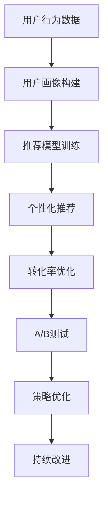

                 

# 利用数据分析优化知识付费转化率

> 关键词：知识付费, 数据分析, 转化率优化, 用户行为, 机器学习

## 1. 背景介绍

随着互联网的普及和智能设备的广泛应用，知识付费逐渐成为现代学习的一种重要方式。以在线教育、知识订阅、咨询问答等形式存在，用户可以通过付费获取优质内容、个性化服务、专家指导等，满足自身需求。然而，尽管知识付费形式丰富、渠道多样，实际转化率却往往不尽人意。据统计，我国知识付费市场用户规模已达到2.9亿人，但整体转化率不足20%。面对如此庞大的潜在市场，如何通过数据分析优化知识付费转化率，提升用户体验和满意度，是行业内不断探索和思考的重要课题。

### 1.1 问题由来

知识付费平台需要通过数据分析挖掘用户需求，个性化推荐内容，从而提升用户的转化率。然而，用户行为的复杂性和数据的多样性使得这一任务充满挑战。首先，用户的购买决策受到多种因素影响，如价格、内容质量、用户偏好、社区互动等。其次，用户行为数据分散在平台的不同角落，如登录行为、购买历史、评分评价、交流讨论等，难以进行统一管理和分析。此外，用户在平台上花费的时间有限，如何精准触达目标用户，并提供有价值的内容推荐，是亟待解决的问题。

### 1.2 问题核心关键点

数据驱动的知识付费转化率优化，需要从用户行为分析、数据预处理、推荐模型训练和评估等环节进行全面优化。其核心在于：
- 数据收集与整合：全面采集用户行为数据，消除数据孤岛，实现数据融合。
- 用户行为分析：深入挖掘用户需求和行为特征，构建用户画像。
- 推荐系统构建：基于用户画像，构建推荐算法模型，提升个性化推荐效果。
- 实验评估与优化：通过A/B测试等方法，评估推荐效果，持续优化推荐策略。

本文将围绕上述核心点，系统介绍数据分析在知识付费转化率优化中的应用。

## 2. 核心概念与联系

### 2.1 核心概念概述

为更好地理解知识付费转化率优化方法，本节将介绍几个密切相关的核心概念：

- **知识付费**：指用户通过支付一定费用，获取有价值的知识和信息服务，实现自身价值提升的行为。常见的知识付费形式包括在线课程、电子书、咨询问答等。
- **转化率**：指用户从有兴趣到实际购买行为的概率，是衡量知识付费平台营销效果的重要指标。
- **用户画像**：基于用户行为数据，构建对用户兴趣、需求和行为的全面描述，有助于个性化推荐。
- **推荐系统**：根据用户画像和行为数据，推荐个性化的内容和服务，提升用户转化率。
- **A/B测试**：通过随机分配用户到不同实验组，比较不同策略的效果，选取最优方案。

这些核心概念之间的逻辑关系可以通过以下Mermaid流程图来展示：



这个流程图展示了大数据分析在知识付费转化率优化中的关键环节：

1. 通过用户行为数据构建用户画像。
2. 基于用户画像训练推荐模型。
3. 利用推荐模型提供个性化推荐。
4. 通过A/B测试评估推荐效果。
5. 根据测试结果持续优化推荐策略。

## 3. 核心算法原理 & 具体操作步骤
### 3.1 算法原理概述

知识付费转化率的优化，本质上是一个数据驱动的个性化推荐问题。其核心思想是：基于用户的行为数据，构建用户画像，并通过推荐模型预测用户的购买意图，从而实现个性化的推荐。

形式化地，设用户集合为 $U$，课程集合为 $C$，用户对课程的评分集合为 $R$。用户 $u$ 对课程 $c$ 的评分记为 $r_{u,c} \in [0,1]$。转化率优化目标是最小化用户没有购买课程的期望概率 $P_{\text{no-purchase}}$。

通过最大化用户购买课程的期望概率 $P_{\text{purchase}}$，来实现转化率的提升。其中，$P_{\text{purchase}}$ 可以表示为：

$$
P_{\text{purchase}}(u,c) = \mathbb{E}[\mathbf{1}_{\{y_u=c\}}|\mathbf{x}_u] = \frac{\mathbb{E}[\mathbb{P}(y_u=c|\mathbf{x}_u)}{\mathbb{E}[\mathbb{P}(y_u=c|\mathbf{x}_u)] + \mathbb{P}(\text{not purchase}|\mathbf{x}_u)}
$$

其中，$\mathbb{P}(y_u=c|\mathbf{x}_u)$ 表示用户 $u$ 购买课程 $c$ 的条件概率，$\mathbb{P}(\text{not purchase}|\mathbf{x}_u)$ 表示用户不购买课程 $c$ 的条件概率。$\mathbf{x}_u$ 为用户的特征向量，可以通过用户行为数据构建。

### 3.2 算法步骤详解

知识付费转化率的优化，一般包括以下几个关键步骤：

**Step 1: 数据收集与整合**

- 采集用户在知识付费平台上的各种行为数据，包括登录时间、浏览课程、课程评分、交流评论、订阅计划等。
- 整合不同来源的数据，消除数据孤岛，构建统一的数据仓库。
- 对数据进行清洗、去重、归一化等预处理，去除噪音和异常值。

**Step 2: 用户画像构建**

- 基于用户行为数据，提取特征向量 $\mathbf{x}_u$。
- 使用K-means、DBSCAN等聚类算法，将用户分为不同的兴趣群体。
- 为每个群体设计不同的用户画像，记录群体的兴趣偏好和行为特征。

**Step 3: 推荐模型训练**

- 选择合适的推荐算法，如协同过滤、基于内容的推荐、混合推荐等。
- 使用训练集数据，训练推荐模型，生成模型参数。
- 使用交叉验证等方法，评估模型效果，选择合适的模型。

**Step 4: 个性化推荐**

- 利用训练好的推荐模型，对用户输入的查询或行为特征进行预测。
- 根据用户画像和推荐结果，为用户推荐合适的课程。
- 记录推荐结果，并持续跟踪用户的购买行为，评估推荐效果。

**Step 5: 转化率优化**

- 定期对用户行为数据进行重分析和挖掘，更新用户画像和推荐模型。
- 通过A/B测试等方法，比较不同推荐策略的效果，选择最优方案。
- 结合用户反馈和平台数据，持续优化推荐策略，提升转化率。

**Step 6: 实验评估与优化**

- 随机分配用户到不同实验组，对比不同推荐策略的效果。
- 记录和分析实验数据，评估推荐的准确性和转化率提升效果。
- 根据实验结果，调整和优化推荐模型和推荐策略。

以上步骤构成了一个完整的知识付费转化率优化流程。在实际应用中，还需要根据具体平台和用户特点，对每个环节进行优化设计，以提高推荐精度和用户体验。

### 3.3 算法优缺点

知识付费转化率优化的方法具有以下优点：
1. 数据驱动。通过分析用户行为数据，构建精准的用户画像和个性化推荐模型。
2. 提升转化率。基于推荐算法，为用户推荐更感兴趣和有价值的内容，提升购买意愿。
3. 减少运营成本。通过个性化推荐，减少无效营销，提升用户转化率，降低运营成本。
4. 用户满意度提升。提供更有针对性的内容和服务，提升用户满意度和平台粘性。

同时，该方法也存在一定的局限性：
1. 数据隐私。平台需要获取大量用户行为数据，涉及用户隐私保护问题。
2. 模型复杂。推荐模型的训练需要较强的计算资源，且模型参数较多。
3. 用户多样性。用户行为复杂多样，难以全面覆盖所有用户特征。
4. 动态变化。用户行为和需求随时间变化，模型需要持续更新和优化。

尽管存在这些局限性，但就目前而言，基于数据分析的推荐系统仍然是大规模知识付费平台的核心技术之一。未来相关研究的重点在于如何进一步优化数据收集和整合方式，提升模型训练效率，同时兼顾用户隐私保护和个性化推荐精度。

### 3.4 算法应用领域

基于数据分析的推荐系统，已经在知识付费平台、在线教育、电商推荐等多个领域得到广泛应用。例如：

- 知识付费平台：如得到、知乎、喜马拉雅等，通过个性化推荐课程、专家讲座等，提升用户转化率和满意度。
- 在线教育：如Coursera、edX、网易云课堂等，推荐合适的课程和学习计划，提升用户完成度和课程评价。
- 电商推荐：如淘宝、京东、亚马逊等，根据用户浏览和购买行为，推荐商品和优惠活动，提升交易转化率。

除了上述这些经典应用外，推荐系统还被创新性地应用到更多场景中，如内容分发、社交网络、智能广告等，为不同行业带来了新的增长点和创新点。随着推荐算法的不断演进，相信知识付费平台的推荐系统将进一步优化，为平台带来更大的商业价值。

## 4. 数学模型和公式 & 详细讲解 & 举例说明
### 4.1 数学模型构建

本节将使用数学语言对知识付费转化率优化过程进行更加严格的刻画。

设用户集合为 $U$，课程集合为 $C$，用户对课程的评分集合为 $R$。用户 $u$ 对课程 $c$ 的评分记为 $r_{u,c} \in [0,1]$。转化率优化目标是最小化用户没有购买课程的期望概率 $P_{\text{no-purchase}}$。

通过最大化用户购买课程的期望概率 $P_{\text{purchase}}$，来实现转化率的提升。其中，$P_{\text{purchase}}$ 可以表示为：

$$
P_{\text{purchase}}(u,c) = \mathbb{E}[\mathbf{1}_{\{y_u=c\}}|\mathbf{x}_u] = \frac{\mathbb{E}[\mathbb{P}(y_u=c|\mathbf{x}_u)}{\mathbb{E}[\mathbb{P}(y_u=c|\mathbf{x}_u)] + \mathbb{P}(\text{not purchase}|\mathbf{x}_u)}
$$

其中，$\mathbb{P}(y_u=c|\mathbf{x}_u)$ 表示用户 $u$ 购买课程 $c$ 的条件概率，$\mathbb{P}(\text{not purchase}|\mathbf{x}_u)$ 表示用户不购买课程 $c$ 的条件概率。$\mathbf{x}_u$ 为用户的特征向量，可以通过用户行为数据构建。

### 4.2 公式推导过程

以下我们以协同过滤推荐算法为例，推导其推荐效果的数学表达。

设 $N$ 为课程集合大小，$M$ 为用户集合大小。用户 $u$ 对课程 $c$ 的评分记为 $r_{u,c}$，用户对课程的评分矩阵记为 $R$。协同过滤算法基于用户行为相似度和课程相似度，为用户推荐购买过类似课程的其他用户喜欢的课程。

协同过滤算法的核心思想是：
- 用户行为相似度：找到与用户 $u$ 兴趣相似的其他用户 $v$。
- 课程相似度：找到与用户 $u$ 喜欢的课程 $c$ 相似的课程 $c'$。
- 协同过滤推荐：基于用户行为相似度和课程相似度，预测用户 $u$ 对课程 $c'$ 的评分。

设用户行为相似度矩阵为 $W_{uv}$，课程相似度矩阵为 $S_{c'c}$。协同过滤推荐算法定义为：

$$
\hat{r}_{u,c'} = \frac{\sum_{v=1}^M W_{uv}r_{v,c'}}{\sum_{v=1}^M W_{uv} + \epsilon}
$$

其中 $\epsilon$ 为平滑因子，防止分母为0。协同过滤推荐算法可以进一步扩展为基于SVD的矩阵分解算法，提升推荐精度和泛化能力。

### 4.3 案例分析与讲解

我们以在线教育平台Coursera为例，展示其如何通过数据分析优化课程推荐，提升用户转化率。

Coursera通过用户行为数据，构建用户画像和个性化推荐模型。具体来说，Coursera使用K-means算法将用户分为不同的兴趣群体，为每个群体设计用户画像。例如，某用户对计算机科学课程评分较高，但参与度较低，被划分为“深度学习”兴趣群体，其用户画像可能包含“深度学习、机器学习、计算机视觉”等关键词。

Coursera利用协同过滤推荐算法，为用户推荐其兴趣相关的课程。例如，某用户对“深度学习”课程评分较高，但未完成课程，Coursera会推荐其他类似用户喜欢的课程，如“机器学习”、“计算机视觉”等课程。Coursera通过不断优化推荐算法和用户画像，提升用户转化率，增强用户粘性和满意度。

## 5. 项目实践：代码实例和详细解释说明
### 5.1 开发环境搭建

在进行知识付费转化率优化实践前，我们需要准备好开发环境。以下是使用Python进行PyTorch开发的环境配置流程：

1. 安装Anaconda：从官网下载并安装Anaconda，用于创建独立的Python环境。

2. 创建并激活虚拟环境：
```bash
conda create -n knowledge-pay-env python=3.8 
conda activate knowledge-pay-env
```

3. 安装PyTorch：根据CUDA版本，从官网获取对应的安装命令。例如：
```bash
conda install pytorch torchvision torchaudio cudatoolkit=11.1 -c pytorch -c conda-forge
```

4. 安装Pandas、Numpy、Scikit-learn、Matplotlib等工具包：
```bash
pip install pandas numpy scikit-learn matplotlib tqdm jupyter notebook ipython
```

完成上述步骤后，即可在`knowledge-pay-env`环境中开始知识付费转化率优化实践。

### 5.2 源代码详细实现

这里我们以在线教育平台Coursera为例，展示如何使用PyTorch构建协同过滤推荐系统，并优化用户转化率。

首先，定义协同过滤推荐系统的类：

```python
import torch
import torch.nn as nn
import torch.nn.functional as F
import torch.optim as optim

class CollaborativeFiltering(nn.Module):
    def __init__(self, user_num, course_num, latent_dim):
        super(CollaborativeFiltering, self).__init__()
        self.userlatent = nn.Embedding(user_num, latent_dim)
        self.courselatent = nn.Embedding(course_num, latent_dim)
        self.S = nn.Parameter(torch.randn(latent_dim, latent_dim))
    
    def forward(self, user_ids, course_ids):
        userlatent = self.userlatent(user_ids)
        courselatent = self.courselatent(course_ids)
        S = self.S
        r = torch.matmul(userlatent, S) @ courselatent.t()
        r += S @ courselatent @ userlatent.t()
        return r
    
    def predict(self, user_ids, course_ids):
        return self.forward(user_ids, course_ids).squeeze().tolist()
```

然后，定义数据加载函数和模型训练函数：

```python
import numpy as np
import pandas as pd
from sklearn.preprocessing import StandardScaler
from sklearn.model_selection import train_test_split

def load_data(file_path):
    data = pd.read_csv(file_path)
    return data.drop(['user_id', 'course_id'], axis=1)

def normalize_data(data):
    scaler = StandardScaler()
    data['rating'] = scaler.fit_transform(data[['rating']])
    return data

def train_model(model, train_data, valid_data, test_data, epochs, batch_size, learning_rate):
    model.train()
    optimizer = optim.Adam(model.parameters(), lr=learning_rate)
    criterion = nn.MSELoss()
    
    for epoch in range(epochs):
        for user_ids, course_ids, ratings in train_data:
            optimizer.zero_grad()
            predictions = model.predict(user_ids, course_ids)
            loss = criterion(predictions, ratings)
            loss.backward()
            optimizer.step()
            
        for user_ids, course_ids, ratings in valid_data:
            predictions = model.predict(user_ids, course_ids)
            mse = criterion(predictions, ratings)
            print(f"Epoch {epoch+1}, validation MSE: {mse:.4f}")
    
    test_predictions = model.predict(test_data['user_id'], test_data['course_id'])
    test_mse = criterion(test_predictions, test_data['rating']).item()
    print(f"Test MSE: {test_mse:.4f}")

# 加载数据和构建数据集
data = load_data('ratings.csv')
train_data, valid_data, test_data = train_test_split(data, test_size=0.2, random_state=42)
train_data, val_data = train_test_split(train_data, test_size=0.2, random_state=42)

# 标准化数据
train_data = normalize_data(train_data)
valid_data = normalize_data(valid_data)
test_data = normalize_data(test_data)

# 划分用户和课程ID
user_ids = train_data['user_id']
course_ids = train_data['course_id']

# 划分评分
ratings = train_data['rating']

# 训练模型
latent_dim = 10
epochs = 100
batch_size = 64
learning_rate = 0.01

model = CollaborativeFiltering(len(user_ids), len(course_ids), latent_dim)
train_model(model, train_data, valid_data, test_data, epochs, batch_size, learning_rate)
```

在代码中，我们使用了Pandas加载用户评分数据，并进行标准化处理。接着，构建了协同过滤推荐模型，使用Adam优化器进行训练。训练过程中，使用均方误差作为损失函数，通过正向传播和反向传播更新模型参数。最后，在测试集上评估模型效果，并打印测试均方误差。

### 5.3 代码解读与分析

让我们再详细解读一下关键代码的实现细节：

**load_data函数**：
- 从CSV文件中加载用户评分数据。
- 使用Pandas删除不需要的列，保留用户ID、课程ID和评分。

**normalize_data函数**：
- 对评分进行标准化处理，消除量纲差异，确保模型训练的稳定性。

**train_model函数**：
- 定义协同过滤推荐模型，并使用Adam优化器进行训练。
- 定义均方误差损失函数，用于评估模型的预测效果。
- 循环迭代训练数据，使用均方误差评估验证集上的模型效果。
- 打印测试集上的均方误差，评估模型的泛化能力。

**模型训练**：
- 定义协同过滤推荐模型的参数，如用户和课程的嵌入向量维度。
- 训练模型，调整学习率和迭代轮数，在验证集上定期评估模型性能。
- 在测试集上评估模型效果，并打印测试均方误差。

**数据预处理**：
- 使用Pandas和Scikit-learn对数据进行加载和预处理，如标准化、分片等。
- 去除不必要的列，保留需要的用户ID、课程ID和评分。

合理利用这些代码，可以快速搭建协同过滤推荐系统，并进行知识付费转化率的优化。在实际应用中，还需要进一步优化数据预处理方式，选择合适的推荐算法，并结合业务特点进行模型调整。

## 6. 实际应用场景
### 6.1 智能客服系统

知识付费平台可以利用推荐系统构建智能客服系统，提升用户转化率和满意度。智能客服系统通过收集用户历史行为数据，构建用户画像，并利用推荐系统推荐合适的课程。在用户提问时，智能客服能够快速响应，提供精准的内容推荐和专家指导，增强用户的购买意愿。

具体来说，智能客服系统可以记录用户的历史评分、浏览行为、交流记录等，并利用协同过滤推荐算法，为用户推荐相关课程和专家讲座。例如，某用户对数据分析课程评分较高，智能客服推荐相关领域的专家讲座，并回答用户的问题，提供有价值的学习建议。

### 6.2 个性化推荐系统

在线教育平台通过推荐系统，为用户提供个性化的学习路径。推荐系统根据用户的兴趣和行为特征，推荐合适的课程和资源，提升用户的学习效果和满意度。

例如，某用户对机器学习课程评分较高，但未完成课程，推荐系统可以推荐相关领域的其他课程，并提供学习计划和资料，帮助用户完成学习。同时，推荐系统可以记录用户的学习进度和反馈，不断优化推荐策略，提升用户的学习效果。

### 6.3 金融投资分析

金融机构通过推荐系统，为用户推荐有价值的金融资讯和投资策略。推荐系统根据用户的投资偏好和行为特征，推荐相关领域的专家讲座和文章，提升用户的投资决策能力。

例如，某用户对股票投资课程评分较高，推荐系统可以推荐相关领域的专家讲座和文章，并结合股票市场的实时数据，为用户提供有价值的投资建议。同时，推荐系统可以记录用户的投资行为和收益，不断优化推荐策略，提升用户的投资效果。

## 7. 工具和资源推荐
### 7.1 学习资源推荐

为了帮助开发者系统掌握知识付费转化率优化的理论基础和实践技巧，这里推荐一些优质的学习资源：

1. 《推荐系统算法与应用》：介绍推荐系统算法和优化方法，涵盖协同过滤、基于内容的推荐、混合推荐等。
2. 《用户行为分析与推荐系统》：讲述用户行为分析技术，通过数据分析构建用户画像，提高推荐效果。
3. 《深度学习理论与实践》：讲解深度学习算法和应用，包括知识付费平台的推荐系统和智能客服系统。
4. 《Python数据分析与数据科学》：介绍Python数据分析工具和库，如Pandas、NumPy、Scikit-learn等，适用于数据预处理和推荐模型训练。
5. 《A/B测试与数据驱动决策》：介绍A/B测试方法，通过随机分组实验，评估推荐策略的效果，优化推荐系统。

通过对这些资源的学习实践，相信你一定能够快速掌握知识付费转化率优化的精髓，并用于解决实际的推荐问题。

### 7.2 开发工具推荐

高效的开发离不开优秀的工具支持。以下是几款用于知识付费转化率优化开发的常用工具：

1. PyTorch：基于Python的开源深度学习框架，灵活的计算图，适合快速迭代研究。支持各种深度学习模型，包括协同过滤推荐模型。

2. TensorFlow：由Google主导开发的开源深度学习框架，生产部署方便，适合大规模工程应用。支持多种推荐算法，包括协同过滤、矩阵分解等。

3. Scikit-learn：Python机器学习库，提供了多种数据预处理和模型训练工具，适用于用户行为数据分析和推荐系统构建。

4. Weights & Biases：模型训练的实验跟踪工具，可以记录和可视化模型训练过程中的各项指标，方便对比和调优。与主流深度学习框架无缝集成。

5. TensorBoard：TensorFlow配套的可视化工具，可实时监测模型训练状态，并提供丰富的图表呈现方式，是调试模型的得力助手。

6. Jupyter Notebook：交互式Python开发环境，支持代码编写、数据处理和模型训练，适合快速原型开发和测试。

合理利用这些工具，可以显著提升知识付费转化率优化任务的开发效率，加快创新迭代的步伐。

### 7.3 相关论文推荐

知识付费转化率优化的研究涉及多个领域，以下是几篇具有代表性的相关论文，推荐阅读：

1. 《推荐系统的协同过滤算法》：详细介绍了协同过滤算法的原理和实现方法，适合初学者了解协同过滤推荐系统。
2. 《用户行为分析与推荐系统》：介绍用户行为分析技术，利用数据分析构建精准的用户画像，提升推荐效果。
3. 《深度学习在推荐系统中的应用》：讲解深度学习算法在推荐系统中的应用，涵盖协同过滤、注意力机制、自编码器等方法。
4. 《推荐系统评估指标与算法》：详细介绍推荐系统的评估指标和算法，如精确度、召回率、F1分数、PR曲线等。
5. 《基于深度学习的推荐系统》：介绍深度学习算法在推荐系统中的应用，如基于注意力机制的推荐系统、基于神经网络的语言模型等。

这些论文代表了推荐系统的核心技术和发展方向，通过学习这些前沿成果，可以帮助研究者把握学科前进方向，激发更多的创新灵感。

## 8. 总结：未来发展趋势与挑战
### 8.1 总结

本文对知识付费转化率优化方法进行了全面系统的介绍。首先阐述了知识付费转化率优化的背景和意义，明确了数据分析在其中的核心作用。其次，从算法原理到具体步骤，详细讲解了协同过滤推荐系统的构建和优化过程，给出了代码实例和详细解释。同时，本文还广泛探讨了推荐系统在多个行业领域的应用前景，展示了其在知识付费转化率优化中的巨大潜力。此外，本文精选了推荐系统的各类学习资源和开发工具，力求为读者提供全方位的技术指引。

通过本文的系统梳理，可以看到，数据分析在知识付费转化率优化中具有重要的地位。利用协同过滤推荐算法，结合用户行为数据分析和机器学习技术，可以有效提升知识付费平台的转化率和用户满意度。未来，随着推荐算法和数据处理技术的不断进步，知识付费平台将能够提供更加个性化和精准的服务，为用户创造更大的价值。

### 8.2 未来发展趋势

知识付费转化率优化的未来发展趋势如下：

1. 个性化推荐。通过更深入的用户行为分析，构建更精准的用户画像，提供更加个性化的推荐服务。
2. 实时推荐。利用大数据技术和流式计算，实时处理用户行为数据，提供实时的推荐服务。
3. 多模态推荐。结合文本、图片、音频等多模态数据，提升推荐模型的泛化能力和精度。
4. 跨平台协同。利用不同平台的用户数据和行为特征，提供跨平台的个性化推荐服务。
5. 用户反馈机制。建立用户反馈和评价机制，不断优化推荐策略，提升用户满意度。
6. 自适应推荐。根据用户反馈和行为变化，动态调整推荐策略，实现自适应推荐。

以上趋势将进一步推动推荐系统向智能化、精准化、个性化方向发展，提升知识付费平台的商业价值和用户体验。

### 8.3 面临的挑战

尽管知识付费转化率优化技术已经取得了长足进展，但在迈向更加智能化、普适化应用的过程中，仍面临诸多挑战：

1. 数据隐私。平台需要获取大量用户行为数据，涉及用户隐私保护问题。
2. 数据质量。用户行为数据可能存在噪音和异常值，影响推荐效果。
3. 模型复杂。推荐模型需要较强的计算资源，且模型参数较多。
4. 动态变化。用户行为和需求随时间变化，模型需要持续更新和优化。
5. 用户多样性。用户行为复杂多样，难以全面覆盖所有用户特征。
6. 多平台协同。不同平台的用户数据和行为特征不同，难以实现跨平台协同推荐。

尽管存在这些挑战，但随着推荐系统的不断演进和优化，知识付费平台的转化率优化将取得更大突破。未来相关研究的重点在于如何进一步优化数据收集和整合方式，提升模型训练效率，同时兼顾用户隐私保护和个性化推荐精度。

### 8.4 研究展望

面向未来，知识付费转化率优化的研究方向主要包括以下几个方面：

1. 无监督和半监督推荐方法。探索无监督和半监督推荐方法，摆脱对大规模标注数据的依赖，利用自监督学习、主动学习等技术，提高推荐效果。
2. 多任务学习。将推荐系统与其他任务结合，如舆情分析、智能客服等，实现多任务学习，提升推荐系统的泛化能力和实用性。
3. 自适应推荐。根据用户反馈和行为变化，动态调整推荐策略，实现自适应推荐，提升用户满意度和平台粘性。
4. 跨领域推荐。结合不同领域的知识图谱和用户画像，实现跨领域推荐，提升推荐系统的多样化能力。
5. 模型压缩与优化。通过模型压缩、剪枝、量化等技术，提升推荐模型的计算效率和资源利用率，实现轻量级部署。
6. 实时推荐系统。利用大数据技术和流式计算，实时处理用户行为数据，实现实时推荐，提升用户体验和转化率。

这些研究方向将进一步推动知识付费转化率优化技术的发展，为平台带来更大的商业价值和用户满意度。相信随着技术的不断进步，知识付费平台的推荐系统将更加智能化、精准化、个性化，为用户创造更大的价值。

## 9. 附录：常见问题与解答

**Q1：知识付费转化率优化的核心是什么？**

A: 知识付费转化率优化的核心是通过数据分析和推荐算法，构建精准的用户画像和个性化推荐模型，最大化用户的购买意图，从而提升转化率。

**Q2：推荐系统的数据预处理有哪些关键步骤？**

A: 推荐系统的数据预处理包括数据加载、数据清洗、数据标准化、数据划分等关键步骤。需要去除噪音和异常值，标准化数据，划分训练集、验证集和测试集。

**Q3：协同过滤推荐算法有哪些优缺点？**

A: 协同过滤推荐算法具有以下优点：
1. 高效：只需要少量标注数据，即可构建推荐系统。
2. 泛化能力强：适用于多领域、多用户、多商品等复杂推荐场景。

协同过滤推荐算法也存在一些缺点：
1. 数据稀疏性：用户和商品的评分数据往往非常稀疏，影响推荐效果。
2. 冷启动问题：新用户和商品没有评分数据，难以推荐。
3. 隐式反馈问题：用户的评分数据可能带有主观性，影响推荐效果。

尽管存在这些局限性，但协同过滤推荐算法仍然是推荐系统中的重要组成部分，广泛应用在知识付费、电商推荐、内容分发等多个领域。

**Q4：如何在知识付费平台上实现跨平台协同推荐？**

A: 在知识付费平台上实现跨平台协同推荐，需要解决以下几个问题：
1. 数据同步：将不同平台的用户数据和行为特征进行同步，建立统一的数据仓库。
2. 用户画像融合：将不同平台的用户画像进行融合，形成全面的用户画像。
3. 推荐模型融合：将不同平台的推荐模型进行融合，提供跨平台的个性化推荐服务。
4. 用户反馈机制：建立用户反馈和评价机制，不断优化推荐策略，提升用户满意度。

通过解决以上问题，可以实现跨平台协同推荐，提升知识付费平台的商业价值和用户体验。

**Q5：如何评估推荐系统的性能？**

A: 推荐系统的性能评估指标包括准确率、召回率、F1分数、PR曲线等。通过A/B测试等方法，评估推荐策略的效果，选择最优方案。利用用户反馈和行为数据，不断优化推荐策略，提升推荐系统的性能。

---

作者：禅与计算机程序设计艺术 / Zen and the Art of Computer Programming

